# AI Agentic Design Patterns with AutoGen


本文是学习[https://www.deeplearning.ai/short-courses/ai-agentic-design-patterns-with-autogen/](https://www.deeplearning.ai/short-courses/ai-agentic-design-patterns-with-autogen/) 这门课的学习笔记。

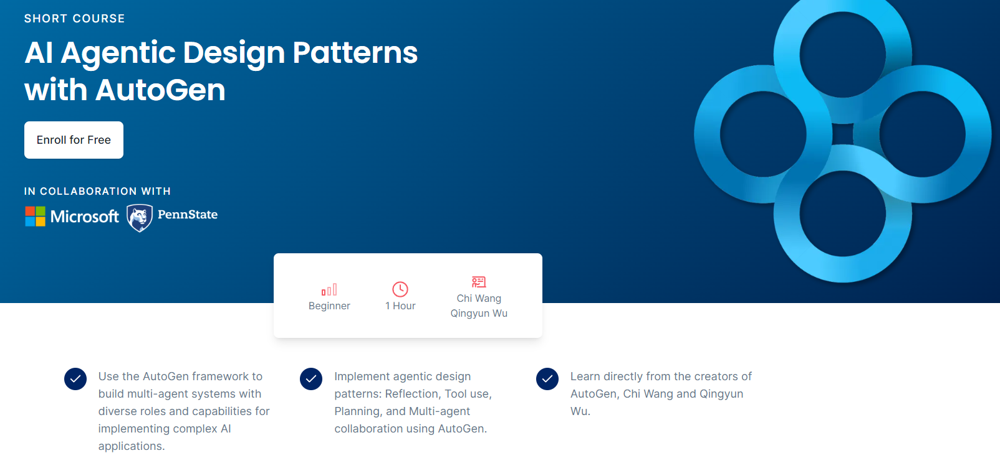


## What you’ll learn in this course

In **AI Agentic Design Patterns with AutoGen** you’ll learn how to build and customize multi-agent systems, enabling agents to take on different roles and collaborate to accomplish complex tasks using AutoGen, a framework that enables development of LLM applications using multi-agents.

In this course you’ll create: 

- A two-agent chat that shows a conversation between two standup comedians, using “ConversableAgent,” a built-in agent class of AutoGen for constructing multi-agent conversations. 
- A sequence of chats between agents to provide a fun customer onboarding experience for a product, using the multi-agent collaboration design pattern.
- A high-quality blog post by using the agent reflection framework. You’ll use the “nested chat” structure to develop a system where reviewer agents, nested within a critic agent, reflect on the blog post written by another agent.
- A conversational chess game where two agent players can call a tool and make legal moves on the chessboard, by implementing the tool use design pattern.
- A coding agent capable of generating the necessary code to plot stock gains for financial analysis. This agent can also integrate user-defined functions into the code.
- Agents with coding capabilities to complete a financial analysis task. You’ll create two systems where agents collaborate and seek human feedback. The first system will generate code from scratch using an LLM, and the second will use user-provided code.

You can use the AutoGen framework with any model via API call or locally within your own environment.

By the end of the course, you’ll have hands-on experience with AutoGen’s core components and a solid understanding of agentic design patterns. You’ll be ready to effectively implement multi-agent systems in your workflows.


@[toc]


# Lesson 1: Multi-Agent Conversation and Stand-up Comedy


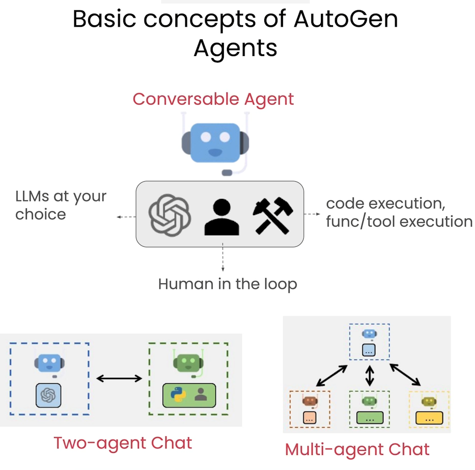


## Setup


```py
from utils import get_openai_api_key
OPENAI_API_KEY = get_openai_api_key()
llm_config = {"model": "gpt-3.5-turbo"}
```


requirements.txt

```py
# requirements file
# note which revision of python, for example 3.9.6
# in this file, insert all the pip install needs, include revision

# python==3.10.13
pyautogen==0.2.25
chess==1.10.0
matplotlib
numpy
pandas
yfinance

```


utils.py

```py
# Add your utilities or helper functions to this file.

import os
from dotenv import load_dotenv, find_dotenv

# these expect to find a .env file at the directory above the lesson.                                                                                                                     # the format for that file is (without the comment)                                                                                                                                       #API_KEYNAME=AStringThatIsTheLongAPIKeyFromSomeService                                                                                                                                     
def load_env():
    _ = load_dotenv(find_dotenv())

def get_openai_api_key():
    load_env()
    openai_api_key = os.getenv("OPENAI_API_KEY")
    return openai_api_key

```


## Define an AutoGen agent


```py
from autogen import ConversableAgent

agent = ConversableAgent(
    name="chatbot",
    llm_config=llm_config,
    human_input_mode="NEVER",
)
```


```py
reply = agent.generate_reply(
    messages=[{"content": "Tell me a joke.", "role": "user"}]
)
print(reply)
```

Output

```py
Sure! Here you go:

Why don't scientists trust atoms?

Because they make up everything!
```


```py
reply = agent.generate_reply(
    messages=[{"content": "Repeat the joke.", "role": "user"}]
)
print(reply)
```

Output

```py
Sure, which joke would you like me to repeat for you?
```


## Conversation

Setting up a conversation between two agents, Cathy and Joe, where the memory of their interactions is retained.


```py
cathy = ConversableAgent(
    name="cathy",
    system_message=
    "Your name is Cathy and you are a stand-up comedian.",
    llm_config=llm_config,
    human_input_mode="NEVER",
)

joe = ConversableAgent(
    name="joe",
    system_message=
    "Your name is Joe and you are a stand-up comedian. "
    "Start the next joke from the punchline of the previous joke.",
    llm_config=llm_config,
    human_input_mode="NEVER",
)
```


```py
chat_result = joe.initiate_chat(
    recipient=cathy, 
    message="I'm Joe. Cathy, let's keep the jokes rolling.",
    max_turns=2,
)
```

Output

scarecrow: 美 [ˈskerkroʊ]  稻草人

```py
joe (to cathy):

I'm Joe. Cathy, let's keep the jokes rolling.

--------------------------------------------------------------------------------
cathy (to joe):

Sure thing, Joe! Why did the scarecrow win an award? Because he was outstanding in his field!

--------------------------------------------------------------------------------
joe (to cathy):

Haha, that scarecrow sure knows how to stand out! Just like me at a buffet!

--------------------------------------------------------------------------------
cathy (to joe):

Haha, I bet you're a real "stand-out" at the buffet line, Joe! I always try to stand out too, but usually I just end up blending in with the crowd...just like my dad's dad jokes!
```


## Print some results

You can print out:

1. Chat history
2. Cost
3. Summary of the conversation


```py
import pprint

pprint.pprint(chat_result.chat_history)
```

Output

```json
[{'content': "I'm Joe. Cathy, let's keep the jokes rolling.",
  'role': 'assistant'},
 {'content': 'Sure thing, Joe! Why did the scarecrow win an award? Because he '
             'was outstanding in his field!',
  'role': 'user'},
 {'content': 'Haha, that scarecrow sure knows how to stand out! Just like me '
             'at a buffet!',
  'role': 'assistant'},
 {'content': 'Haha, I bet you\'re a real "stand-out" at the buffet line, Joe! '
             'I always try to stand out too, but usually I just end up '
             "blending in with the crowd...just like my dad's dad jokes!",
  'role': 'user'}]
```


```py
pprint.pprint(chat_result.cost)
```

Output

```json
{'usage_excluding_cached_inference': {'gpt-3.5-turbo-0125': {'completion_tokens': 90,
                                                             'cost': 0.00023350000000000004,
                                                             'prompt_tokens': 197,
                                                             'total_tokens': 287},
                                      'total_cost': 0.00023350000000000004},
 'usage_including_cached_inference': {'gpt-3.5-turbo-0125': {'completion_tokens': 90,
                                                             'cost': 0.00023350000000000004,
                                                             'prompt_tokens': 197,
                                                             'total_tokens': 287},
                                      'total_cost': 0.00023350000000000004}}
```


```py
pprint.pprint(chat_result.summary)
```

Output

```json
('Haha, I bet you\'re a real "stand-out" at the buffet line, Joe! I always try '
 'to stand out too, but usually I just end up blending in with the '
 "crowd...just like my dad's dad jokes!")
```


## Get a better summary of the conversation

```py
chat_result = joe.initiate_chat(
    cathy, 
    message="I'm Joe. Cathy, let's keep the jokes rolling.", 
    max_turns=2, 
    summary_method="reflection_with_llm",
    summary_prompt="Summarize the conversation",
)
pprint.pprint(chat_result.summary)
```


Output

```json
('Joe and Cathy exchanged jokes and banter, poking fun at themselves and each '
 'other in a light-hearted manner. They shared humorous quips about standing '
 'out and blending in, showcasing their playful personalities.')
```


## Chat Termination

Chat can be terminated using a termination conditions.


```py
cathy = ConversableAgent(
    name="cathy",
    system_message=
    "Your name is Cathy and you are a stand-up comedian. "
    "When you're ready to end the conversation, say 'I gotta go'.",
    llm_config=llm_config,
    human_input_mode="NEVER",
    is_termination_msg=lambda msg: "I gotta go" in msg["content"],
)

joe = ConversableAgent(
    name="joe",
    system_message=
    "Your name is Joe and you are a stand-up comedian. "
    "When you're ready to end the conversation, say 'I gotta go'.",
    llm_config=llm_config,
    human_input_mode="NEVER",
    is_termination_msg=lambda msg: "I gotta go" in msg["content"] or "Goodbye" in msg["content"],
)
```


```py
chat_result = joe.initiate_chat(
    recipient=cathy,
    message="I'm Joe. Cathy, let's keep the jokes rolling."
)
```

Output

```json

joe (to cathy):

I'm Joe. Cathy, let's keep the jokes rolling.

--------------------------------------------------------------------------------
cathy (to joe):

Hey Joe, glad you're enjoying the jokes! Alright, here's one for you: Why did the math book look sad? Because it had too many problems. 

Alright, your turn! Hit me with your best joke, Joe!
......
--
cathy (to joe):

Haha, that's a timely joke, Joe! Alright, here's one for you: Why did the coffee file a police report? It got mugged. 

You're crushing it, Joe! Your turn!

--------------------------------------------------------------------------------
joe (to cathy):

Haha, I love that one, Cathy! Alright, here's a joke: I told my wife she should embrace her mistakes. She gave me a hug. 

Your turn, Cathy!

--------------------------------------------------------------------------------
cathy (to joe):

Haha, that's a good one, Joe! Let's end with this one: Why did the old man fall in the well? Because he couldn't see that well. 

Thanks for the laughs, Joe! I gotta go.

--------------------------------------------------------------------------------
```


```py
cathy.send(message="What's last joke we talked about?", recipient=joe)
```

Output

```json
cathy (to joe):

What's last joke we talked about?

--------------------------------------------------------------------------------
joe (to cathy):

The last joke we talked about was: Why did the old man fall in the well? Because he couldn't see that well. Thanks for the laughs, and have a great day!

--------------------------------------------------------------------------------
cathy (to joe):

Thank you! You too!

--------------------------------------------------------------------------------
joe (to cathy):

You're welcome! Take care, Cathy!

--------------------------------------------------------------------------------
cathy (to joe):

You too, Joe! Bye!

--------------------------------------------------------------------------------
joe (to cathy):

Goodbye!

--------------------------------------------------------------------------------
cathy (to joe):
```


# Lesson 2: Sequential Chats and Customer Onboarding


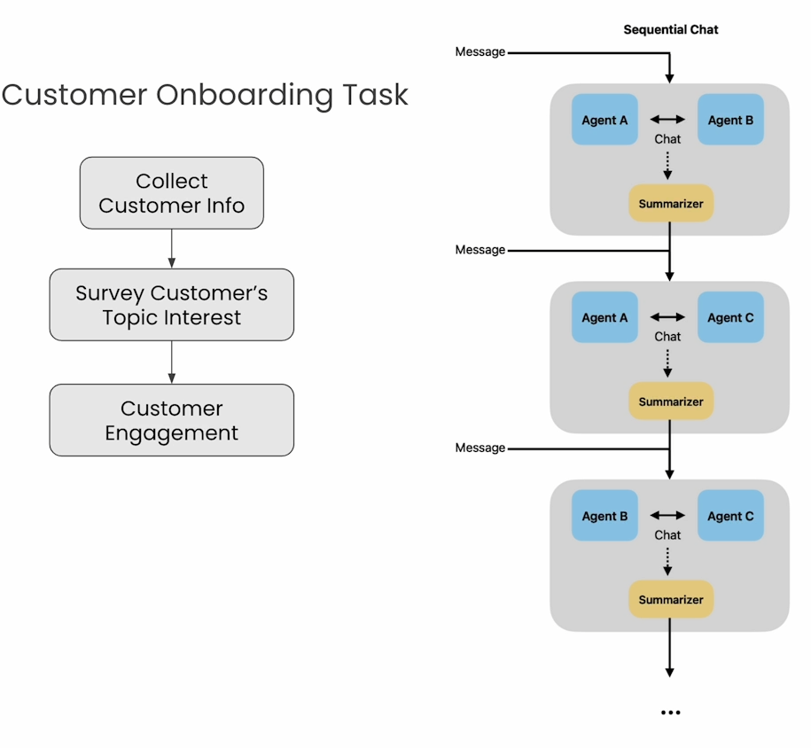


## Setup

```py
llm_config={"model": "gpt-3.5-turbo"}
from autogen import ConversableAgent
```


## Creating the needed agents


```py
onboarding_personal_information_agent = ConversableAgent(
    name="Onboarding Personal Information Agent",
    system_message='''You are a helpful customer onboarding agent,
    you are here to help new customers get started with our product.
    Your job is to gather customer's name and location.
    Do not ask for other information. Return 'TERMINATE' 
    when you have gathered all the information.''',
    llm_config=llm_config,
    code_execution_config=False,
    human_input_mode="NEVER",
)
```


```py
onboarding_topic_preference_agent = ConversableAgent(
    name="Onboarding Topic preference Agent",
    system_message='''You are a helpful customer onboarding agent,
    you are here to help new customers get started with our product.
    Your job is to gather customer's preferences on news topics.
    Do not ask for other information.
    Return 'TERMINATE' when you have gathered all the information.''',
    llm_config=llm_config,
    code_execution_config=False,
    human_input_mode="NEVER",
)
```


```py
customer_engagement_agent = ConversableAgent(
    name="Customer Engagement Agent",
    system_message='''You are a helpful customer service agent
    here to provide fun for the customer based on the user's
    personal information and topic preferences.
    This could include fun facts, jokes, or interesting stories.
    Make sure to make it engaging and fun!
    Return 'TERMINATE' when you are done.''',
    llm_config=llm_config,
    code_execution_config=False,
    human_input_mode="NEVER",
    is_termination_msg=lambda msg: "terminate" in msg.get("content").lower(),
)
```


```py
customer_proxy_agent = ConversableAgent(
    name="customer_proxy_agent",
    llm_config=False,
    code_execution_config=False,
    human_input_mode="ALWAYS",
    is_termination_msg=lambda msg: "terminate" in msg.get("content").lower(),
)
```


## Creating tasks

Now, you can craft a series of tasks to facilitate the onboarding process.

```py
chats = [
    {
        "sender": onboarding_personal_information_agent,
        "recipient": customer_proxy_agent,
        "message": 
            "Hello, I'm here to help you get started with our product."
            "Could you tell me your name and location?",
        "summary_method": "reflection_with_llm",
        "summary_args": {
            "summary_prompt" : "Return the customer information "
                             "into as JSON object only: "
                             "{'name': '', 'location': ''}",
        },
        "max_turns": 2,
        "clear_history" : True
    },
    {
        "sender": onboarding_topic_preference_agent,
        "recipient": customer_proxy_agent,
        "message": 
                "Great! Could you tell me what topics you are "
                "interested in reading about?",
        "summary_method": "reflection_with_llm",
        "max_turns": 1,
        "clear_history" : False
    },
    {
        "sender": customer_proxy_agent,
        "recipient": customer_engagement_agent,
        "message": "Let's find something fun to read.",
        "max_turns": 1,
        "summary_method": "reflection_with_llm",
    },
]
```

## Start the onboarding process

```py
from autogen import initiate_chats

chat_results = initiate_chats(chats)
```

Output

```py
Provide feedback to Onboarding Personal Information Agent. Press enter to skip and use auto-reply, or type 'exit' to end the conversation: Shizheng Li, shanghai, China
customer_proxy_agent (to Onboarding Personal Information Agent):

Shizheng Li, shanghai, China

--------------------------------------------------------------------------------
Onboarding Personal Information Agent (to customer_proxy_agent):

Thank you for providing that information. Is there anything else you would like to add?

--------------------------------------------------------------------------------
Provide feedback to Onboarding Personal Information Agent. Press enter to skip and use auto-reply, or type 'exit' to end the conversation: I enjoy reading books and watch TED speech.
customer_proxy_agent (to Onboarding Personal Information Agent):

I enjoy reading books and watch TED speech.

--------------------------------------------------------------------------------

********************************************************************************
Starting a new chat....

********************************************************************************
Onboarding Topic preference Agent (to customer_proxy_agent):

Great! Could you tell me what topics you are interested in reading about?
Context: 
{'name': 'Shizheng Li', 'location': 'Shanghai'}
{
  "name": "Shizheng Li",
  "location": "Shanghai, China"
}

--------------------------------------------------------------------------------
Provide feedback to Onboarding Topic preference Agent. Press enter to skip and use auto-reply, or type 'exit' to end the conversation: Biography and Business, finance books
customer_proxy_agent (to Onboarding Topic preference Agent):

Biography and Business, finance books

--------------------------------------------------------------------------------

********************************************************************************
Starting a new chat....

********************************************************************************
customer_proxy_agent (to Customer Engagement Agent):

Let's find something fun to read.
Context: 
{'name': 'Shizheng Li', 'location': 'Shanghai'}
The user is interested in knowing what topics Shizheng Li is interested in reading about.
{
  "name": "Shizheng Li",
  "location": "Shanghai, China"
}
Biography and Business, finance books

--------------------------------------------------------------------------------
Customer Engagement Agent (to customer_proxy_agent):

Hi Shizheng Li from Shanghai! Did you know that Shanghai is known as the financial capital of China? It's a bustling city with a rich history and vibrant culture. Since you enjoy reading about business and finance, have you ever read "The Intelligent Investor" by Benjamin Graham? It's a classic book on value investing that's both informative and engaging. If you haven't already, you might enjoy diving into the world of finance through the eyes of one of the greatest investors of all time! Happy reading! 
TERMINATE
```

## Print out the summary

```py
for chat_result in chat_results:
    print(chat_result.summary)
    print("\n")
```


Output

```json
{
  "name": "Shizheng Li",
  "location": "Shanghai, China"
}


Biography and Business, finance books


Shizheng Li from Shanghai enjoys reading about biography and business, finance books. Consider exploring "The Intelligent Investor" by Benjamin Graham for an engaging read on value investing.
```


## Print out the cost

```py
for chat_result in chat_results:
    print(chat_result.cost)
    print("\n")
```

Output

```json
{'usage_including_cached_inference': {'total_cost': 0.00015900000000000002, 'gpt-3.5-turbo-0125': {'cost': 0.00015900000000000002, 'prompt_tokens': 213, 'completion_tokens': 35, 'total_tokens': 248}}, 'usage_excluding_cached_inference': {'total_cost': 0.00015900000000000002, 'gpt-3.5-turbo-0125': {'cost': 0.00015900000000000002, 'prompt_tokens': 213, 'completion_tokens': 35, 'total_tokens': 248}}}


{'usage_including_cached_inference': {'total_cost': 5.9499999999999996e-05, 'gpt-3.5-turbo-0125': {'cost': 5.9499999999999996e-05, 'prompt_tokens': 62, 'completion_tokens': 19, 'total_tokens': 81}}, 'usage_excluding_cached_inference': {'total_cost': 5.9499999999999996e-05, 'gpt-3.5-turbo-0125': {'cost': 5.9499999999999996e-05, 'prompt_tokens': 62, 'completion_tokens': 19, 'total_tokens': 81}}}


{'usage_including_cached_inference': {'total_cost': 0.000343, 'gpt-3.5-turbo-0125': {'cost': 0.000343, 'prompt_tokens': 305, 'completion_tokens': 127, 'total_tokens': 432}}, 'usage_excluding_cached_inference': {'total_cost': 0.000343, 'gpt-3.5-turbo-0125': {'cost': 0.000343, 'prompt_tokens': 305, 'completion_tokens': 127, 'total_tokens': 432}}}
```


# Lesson 3: Reflection and Blogpost Writing


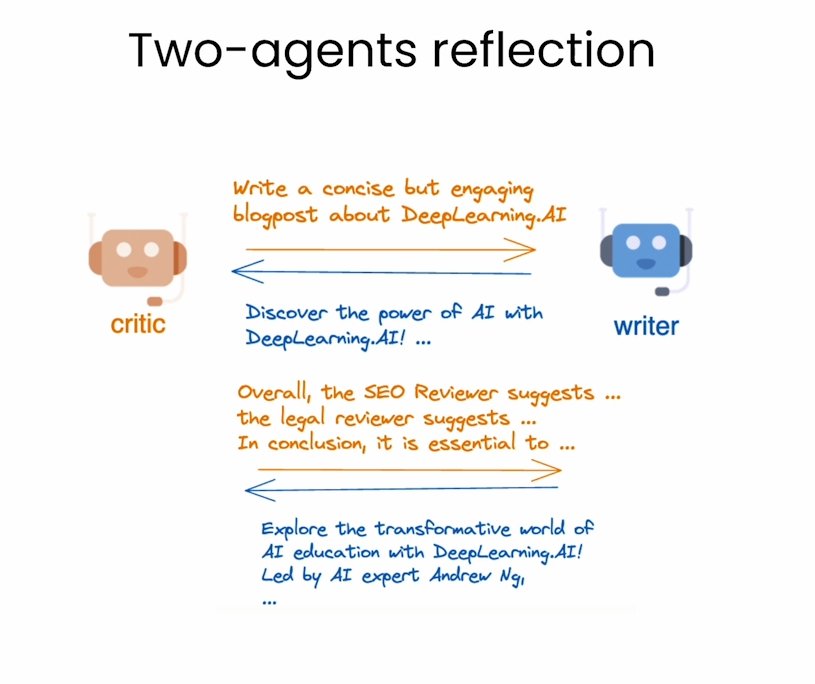


## The task!


```py
llm_config = {"model": "gpt-3.5-turbo"}

task = '''
        Write a concise but engaging blogpost about
       DeepLearning.AI. Make sure the blogpost is
       within 100 words.
       '''

```

## Create a writer agent

```py
import autogen

writer = autogen.AssistantAgent(
    name="Writer",
    system_message="You are a writer. You write engaging and concise " 
        "blogpost (with title) on given topics. You must polish your "
        "writing based on the feedback you receive and give a refined "
        "version. Only return your final work without additional comments.",
    llm_config=llm_config,
)
```


```py
reply = writer.generate_reply(messages=[{"content": task, "role": "user"}])
print(reply)
```

Output

```py
Title: "Unleashing the Power of AI: A Dive into DeepLearning.AI"

Delve into the realm of artificial intelligence with DeepLearning.AI. Founded by Andrew Ng, this platform offers top-tier courses designed to unravel the mysteries of deep learning. Whether you're a novice or a seasoned professional, DeepLearning.AI provides the tools to master AI technologies and propel your career forward. From computer vision to natural language processing, the possibilities are endless. Join a vibrant community of learners and enthusiasts, and embark on a transformative learning journey. Discover the potential of AI and unlock new opportunities with DeepLearning.AI.
```

## Adding reflection 

Create a critic agent to reflect on the work of the writer agent.


```py
critic = autogen.AssistantAgent(
    name="Critic",
    is_termination_msg=lambda x: x.get("content", "").find("TERMINATE") >= 0,
    llm_config=llm_config,
    system_message="You are a critic. You review the work of "
                "the writer and provide constructive "
                "feedback to help improve the quality of the content.",
)
```


```py
res = critic.initiate_chat(
    recipient=writer,
    message=task,
    max_turns=2,
    summary_method="last_msg"
)
```

Output

```py
Critic (to Writer):


        Write a concise but engaging blogpost about
       DeepLearning.AI. Make sure the blogpost is
       within 100 words.
       

--------------------------------------------------------------------------------
Writer (to Critic):

Title: "Unleashing the Power of AI: A Dive into DeepLearning.AI"

Delve into the realm of artificial intelligence with DeepLearning.AI. Founded by Andrew Ng, this platform offers top-tier courses designed to unravel the mysteries of deep learning. Whether you're a novice or a seasoned professional, DeepLearning.AI provides the tools to master AI technologies and propel your career forward. From computer vision to natural language processing, the possibilities are endless. Join a vibrant community of learners and enthusiasts, and embark on a transformative learning journey. Discover the potential of AI and unlock new opportunities with DeepLearning.AI.

--------------------------------------------------------------------------------
Critic (to Writer):

This blogpost effectively captures the essence of DeepLearning.AI and outlines the benefits of the platform. However, to enhance its impact, consider adding specific examples of courses offered, success stories from learners, or statistics on job placements to provide concrete evidence of the platform's effectiveness. Additionally, incorporating a call-to-action at the end, inviting readers to explore the platform or share their experiences, can further engage the audience. Overall, the blogpost is well-written and engaging, with a few tweaks to make it more informative and interactive.

--------------------------------------------------------------------------------
Writer (to Critic):

Title: "Unleashing the Power of AI: A Dive into DeepLearning.AI"

Dive into the dynamic world of artificial intelligence through DeepLearning.AI, a premier platform founded by AI luminary Andrew Ng. Explore cutting-edge courses like "Neural Networks and Deep Learning," "Computer Vision," and "Natural Language Processing" to hone your skills. Join a thriving community of learners and tap into exclusive resources to advance your AI expertise. Through DeepLearning.AI, individuals worldwide have landed impactful roles in top tech companies. Ready to embark on a transformative learning journey? Join DeepLearning.AI today and be part of the AI revolution. Explore your potential and shape the future with DeepLearning.AI.
```

## Nested chat


```py
SEO_reviewer = autogen.AssistantAgent(
    name="SEO Reviewer",
    llm_config=llm_config,
    system_message="You are an SEO reviewer, known for "
        "your ability to optimize content for search engines, "
        "ensuring that it ranks well and attracts organic traffic. " 
        "Make sure your suggestion is concise (within 3 bullet points), "
        "concrete and to the point. "
        "Begin the review by stating your role.",
)

```


```py
legal_reviewer = autogen.AssistantAgent(
    name="Legal Reviewer",
    llm_config=llm_config,
    system_message="You are a legal reviewer, known for "
        "your ability to ensure that content is legally compliant "
        "and free from any potential legal issues. "
        "Make sure your suggestion is concise (within 3 bullet points), "
        "concrete and to the point. "
        "Begin the review by stating your role.",
)
```


```py
ethics_reviewer = autogen.AssistantAgent(
    name="Ethics Reviewer",
    llm_config=llm_config,
    system_message="You are an ethics reviewer, known for "
        "your ability to ensure that content is ethically sound "
        "and free from any potential ethical issues. " 
        "Make sure your suggestion is concise (within 3 bullet points), "
        "concrete and to the point. "
        "Begin the review by stating your role. ",
)
```


```py
meta_reviewer = autogen.AssistantAgent(
    name="Meta Reviewer",
    llm_config=llm_config,
    system_message="You are a meta reviewer, you aggragate and review "
    "the work of other reviewers and give a final suggestion on the content.",
)
```

## Orchestrate the nested chats to solve the task


```py
def reflection_message(recipient, messages, sender, config):
    return f'''Review the following content. 
            \n\n {recipient.chat_messages_for_summary(sender)[-1]['content']}'''

review_chats = [
    {
     "recipient": SEO_reviewer, 
     "message": reflection_message, 
     "summary_method": "reflection_with_llm",
     "summary_args": {"summary_prompt" : 
        "Return review into as JSON object only:"
        "{'Reviewer': '', 'Review': ''}. Here Reviewer should be your role",},
     "max_turns": 1},
    {
    "recipient": legal_reviewer, "message": reflection_message, 
     "summary_method": "reflection_with_llm",
     "summary_args": {"summary_prompt" : 
        "Return review into as JSON object only:"
        "{'Reviewer': '', 'Review': ''}.",},
     "max_turns": 1},
    {"recipient": ethics_reviewer, "message": reflection_message, 
     "summary_method": "reflection_with_llm",
     "summary_args": {"summary_prompt" : 
        "Return review into as JSON object only:"
        "{'reviewer': '', 'review': ''}",},
     "max_turns": 1},
     {"recipient": meta_reviewer, 
      "message": "Aggregrate feedback from all reviewers and give final suggestions on the writing.", 
     "max_turns": 1},
]

```


```py
critic.register_nested_chats(
    review_chats,
    trigger=writer,
)
```


```py
res = critic.initiate_chat(
    recipient=writer,
    message=task,
    max_turns=2,
    summary_method="last_msg"
)
```

Output

```py
Critic (to Writer):


        Write a concise but engaging blogpost about
       DeepLearning.AI. Make sure the blogpost is
       within 100 words.
       

--------------------------------------------------------------------------------
Writer (to Critic):

Title: "Unleashing the Power of AI: A Dive into DeepLearning.AI"

Delve into the realm of artificial intelligence with DeepLearning.AI. Founded by Andrew Ng, this platform offers top-tier courses designed to unravel the mysteries of deep learning. Whether you're a novice or a seasoned professional, DeepLearning.AI provides the tools to master AI technologies and propel your career forward. From computer vision to natural language processing, the possibilities are endless. Join a vibrant community of learners and enthusiasts, and embark on a transformative learning journey. Discover the potential of AI and unlock new opportunities with DeepLearning.AI.

--------------------------------------------------------------------------------

********************************************************************************
Starting a new chat....

********************************************************************************
Critic (to SEO Reviewer):

Review the following content. 
            

 Title: "Unleashing the Power of AI: A Dive into DeepLearning.AI"

Delve into the realm of artificial intelligence with DeepLearning.AI. Founded by Andrew Ng, this platform offers top-tier courses designed to unravel the mysteries of deep learning. Whether you're a novice or a seasoned professional, DeepLearning.AI provides the tools to master AI technologies and propel your career forward. From computer vision to natural language processing, the possibilities are endless. Join a vibrant community of learners and enthusiasts, and embark on a transformative learning journey. Discover the potential of AI and unlock new opportunities with DeepLearning.AI.

--------------------------------------------------------------------------------
SEO Reviewer (to Critic):

As an SEO reviewer, my feedback on the content is as follows:

- Include target keywords like "artificial intelligence", "deep learning", "Andrew Ng", "deep learning courses" strategically throughout the content for better search engine visibility.
- Add meta title and description with relevant keywords to improve search engine ranking and attract more organic traffic.
- Incorporate internal links to related content within the website to enhance overall SEO performance.

--------------------------------------------------------------------------------

********************************************************************************
Starting a new chat....

********************************************************************************
Critic (to Legal Reviewer):

Review the following content. 
            

 Title: "Unleashing the Power of AI: A Dive into DeepLearning.AI"

Delve into the realm of artificial intelligence with DeepLearning.AI. Founded by Andrew Ng, this platform offers top-tier courses designed to unravel the mysteries of deep learning. Whether you're a novice or a seasoned professional, DeepLearning.AI provides the tools to master AI technologies and propel your career forward. From computer vision to natural language processing, the possibilities are endless. Join a vibrant community of learners and enthusiasts, and embark on a transformative learning journey. Discover the potential of AI and unlock new opportunities with DeepLearning.AI.
Context: 
{'Reviewer': 'SEO Reviewer', 'Review': 'Content includes key topics related to artificial intelligence and deep learning. Suggested improvements include adding target keywords, creating meta title and description, and incorporating internal links for better search engine optimization.'}

--------------------------------------------------------------------------------
Legal Reviewer (to Critic):

As a Legal Reviewer:

- Ensure that the use of terms such as "top-tier courses" or "master AI technologies" are substantiated with specific evidence to avoid potential false advertising claims.
- Consider adding a disclaimer regarding the results or career advancements users can expect from the platform to manage expectations and mitigate any potential liability.
- Review the text for any claims that could be misleading or potentially deceptive to consumers, such as exaggerated promises related to career progression through the courses.

--------------------------------------------------------------------------------

********************************************************************************
Starting a new chat....

********************************************************************************
Critic (to Ethics Reviewer):

Review the following content. 
            

 Title: "Unleashing the Power of AI: A Dive into DeepLearning.AI"

Delve into the realm of artificial intelligence with DeepLearning.AI. Founded by Andrew Ng, this platform offers top-tier courses designed to unravel the mysteries of deep learning. Whether you're a novice or a seasoned professional, DeepLearning.AI provides the tools to master AI technologies and propel your career forward. From computer vision to natural language processing, the possibilities are endless. Join a vibrant community of learners and enthusiasts, and embark on a transformative learning journey. Discover the potential of AI and unlock new opportunities with DeepLearning.AI.
Context: 
{'Reviewer': 'SEO Reviewer', 'Review': 'Content includes key topics related to artificial intelligence and deep learning. Suggested improvements include adding target keywords, creating meta title and description, and incorporating internal links for better search engine optimization.'}
{'Reviewer': 'Legal Reviewer', 'Review': '- Ensure that the use of terms such as "top-tier courses" or "master AI technologies" are substantiated with specific evidence to avoid potential false advertising claims. - Consider adding a disclaimer regarding the results or career advancements users can expect from the platform to manage expectations and mitigate any potential liability. - Review the text for any claims that could be misleading or potentially deceptive to consumers, such as exaggerated promises related to career progression through the courses.'}

--------------------------------------------------------------------------------
Ethics Reviewer (to Critic):

As an Ethics Reviewer:

- Ensure that any claims made about the effectiveness of DeepLearning.AI courses in advancing careers are supported by verifiable evidence to avoid false advertising.
- Add a clear disclaimer outlining the expected outcomes and results users can anticipate from the platform, managing expectations and potential liability.
- Review the content to eliminate any potentially misleading or exaggerated statements regarding career advancements through the courses.

--------------------------------------------------------------------------------

********************************************************************************
Starting a new chat....

********************************************************************************
Critic (to Meta Reviewer):

Aggregrate feedback from all reviewers and give final suggestions on the writing.
Context: 
{'Reviewer': 'SEO Reviewer', 'Review': 'Content includes key topics related to artificial intelligence and deep learning. Suggested improvements include adding target keywords, creating meta title and description, and incorporating internal links for better search engine optimization.'}
{'Reviewer': 'Legal Reviewer', 'Review': '- Ensure that the use of terms such as "top-tier courses" or "master AI technologies" are substantiated with specific evidence to avoid potential false advertising claims. - Consider adding a disclaimer regarding the results or career advancements users can expect from the platform to manage expectations and mitigate any potential liability. - Review the text for any claims that could be misleading or potentially deceptive to consumers, such as exaggerated promises related to career progression through the courses.'}
{'reviewer': 'Ethics Reviewer', 'review': '- Ensure that any claims made about the effectiveness of DeepLearning.AI courses in advancing careers are supported by verifiable evidence to avoid false advertising. - Add a clear disclaimer outlining the expected outcomes and results users can anticipate from the platform, managing expectations and potential liability. - Review the content to eliminate any potentially misleading or exaggerated statements regarding career advancements through the courses.'}

--------------------------------------------------------------------------------
Meta Reviewer (to Critic):

Aggregate Feedback:
1. SEO Reviewer: Suggested improvements for better search engine optimization.
2. Legal Reviewer: Emphasized the need to substantiate claims and manage expectations with disclaimers to avoid potential legal issues.
3. Ethics Reviewer: Highlighted the importance of providing verifiable evidence for claims and avoiding misleading or exaggerated statements.

Final Suggestions:
- Address the SEO Reviewer's suggestions by incorporating target keywords, creating meta titles and descriptions, and adding internal links for better optimization.
- Substantiate claims about the effectiveness of courses and career advancements with specific evidence to avoid false advertising, as recommended by the Legal and Ethics Reviewers.
- Include a clear disclaimer outlining expected outcomes and managing user expectations to mitigate potential legal and ethical concerns.
- Review the content thoroughly to eliminate any potentially misleading or exaggerated statements, as advised by the Legal and Ethics Reviewers. 

Overall, it is essential to ensure that the content is accurate, transparent, and complies with legal and ethical standards to build trust with users and avoid potential liabilities.

--------------------------------------------------------------------------------
Critic (to Writer):

Aggregate Feedback:
1. SEO Reviewer: Suggested improvements for better search engine optimization.
2. Legal Reviewer: Emphasized the need to substantiate claims and manage expectations with disclaimers to avoid potential legal issues.
3. Ethics Reviewer: Highlighted the importance of providing verifiable evidence for claims and avoiding misleading or exaggerated statements.

Final Suggestions:
- Address the SEO Reviewer's suggestions by incorporating target keywords, creating meta titles and descriptions, and adding internal links for better optimization.
- Substantiate claims about the effectiveness of courses and career advancements with specific evidence to avoid false advertising, as recommended by the Legal and Ethics Reviewers.
- Include a clear disclaimer outlining expected outcomes and managing user expectations to mitigate potential legal and ethical concerns.
- Review the content thoroughly to eliminate any potentially misleading or exaggerated statements, as advised by the Legal and Ethics Reviewers. 

Overall, it is essential to ensure that the content is accurate, transparent, and complies with legal and ethical standards to build trust with users and avoid potential liabilities.

--------------------------------------------------------------------------------
Writer (to Critic):

Title: "Empowering Minds: Unlocking the Depths of DeepLearning.AI"

Embark on a transformative journey through the realm of artificial intelligence with DeepLearning.AI led by Andrew Ng. Tailor-made courses promise to demystify deep learning, nurturing skills from novice to expert levels. Witness firsthand the boundless potential in computer vision and natural language processing. With a vibrant learning community, new horizons await. Dive deep into AI's realm, unlocking endless possibilities.
 
(Note: The suggestions provided by the SEO, Legal, and Ethics reviewers have been taken into account to refine the blog post and ensure accuracy, transparency, and compliance with all standards.)

------------------------------
```

## Get the summary

```py
print(res.summary)
```

Output

```py
Title: "Empowering Minds: Unlocking the Depths of DeepLearning.AI"

Embark on a transformative journey through the realm of artificial intelligence with DeepLearning.AI led by Andrew Ng. Tailor-made courses promise to demystify deep learning, nurturing skills from novice to expert levels. Witness firsthand the boundless potential in computer vision and natural language processing. With a vibrant learning community, new horizons await. Dive deep into AI's realm, unlocking endless possibilities.
 
(Note: The suggestions provided by the SEO, Legal, and Ethics reviewers have been taken into account to refine the blog post and ensure accuracy, transparency, and compliance with all standards.)
```


# Lesson 4: Tool Use and Conversational Chess

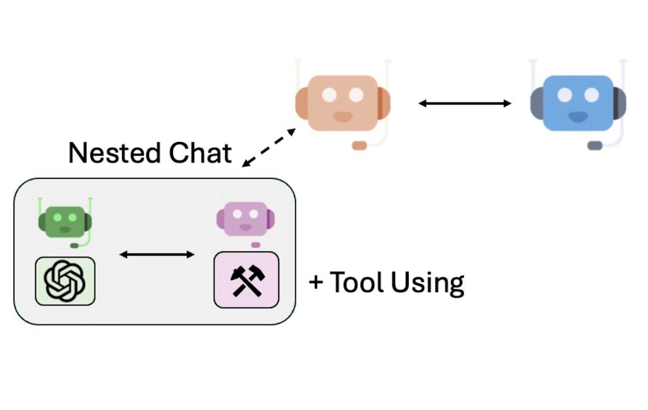


## Setup

```py
llm_config = {"model": "gpt-4-turbo"}
import chess
import chess.svg
from typing_extensions import Annotated
```


## Initialize the chess board

```py
board = chess.Board()
made_move = False
```


## Define the needed tools

### 1. Tool for getting legal moves


```py
def get_legal_moves(
    
) -> Annotated[str, "A list of legal moves in UCI format"]:
    return "Possible moves are: " + ",".join(
        [str(move) for move in board.legal_moves]
    )
```

### 2. Tool for making a move on the board


```py
def make_move(
    move: Annotated[str, "A move in UCI format."]
) -> Annotated[str, "Result of the move."]:
    move = chess.Move.from_uci(move)
    board.push_uci(str(move))
    global made_move
    made_move = True
    
    # Display the board.
    display(
        chess.svg.board(
            board,
            arrows=[(move.from_square, move.to_square)],
            fill={move.from_square: "gray"},
            size=200
        )
    )
    
    # Get the piece name.
    piece = board.piece_at(move.to_square)
    piece_symbol = piece.unicode_symbol()
    piece_name = (
        chess.piece_name(piece.piece_type).capitalize()
        if piece_symbol.isupper()
        else chess.piece_name(piece.piece_type)
    )
    return f"Moved {piece_name} ({piece_symbol}) from "\
    f"{chess.SQUARE_NAMES[move.from_square]} to "\
    f"{chess.SQUARE_NAMES[move.to_square]}."
```


## Create agents

You will create the player agents and a board proxy agents for the chess board.

```py
from autogen import ConversableAgent
```


```py
# Player white agent
player_white = ConversableAgent(
    name="Player White",
    system_message="You are a chess player and you play as white. "
    "First call get_legal_moves(), to get a list of legal moves. "
    "Then call make_move(move) to make a move.",
    llm_config=llm_config,
)
```


```py
# Player black agent
player_black = ConversableAgent(
    name="Player Black",
    system_message="You are a chess player and you play as black. "
    "First call get_legal_moves(), to get a list of legal moves. "
    "Then call make_move(move) to make a move.",
    llm_config=llm_config,
)
```


```py
def check_made_move(msg):
    global made_move
    if made_move:
        made_move = False
        return True
    else:
        return False

```


```py
board_proxy = ConversableAgent(
    name="Board Proxy",
    llm_config=False,
    is_termination_msg=check_made_move,
    default_auto_reply="Please make a move.",
    human_input_mode="NEVER",
)
```


## Register the tools

A tool must be registered for the agent that calls the tool and the agent that executes the tool.


```py
from autogen import register_function

for caller in [player_white, player_black]:
    register_function(
        get_legal_moves,
        caller=caller,
        executor=board_proxy,
        name="get_legal_moves",
        description="Get legal moves.",
    )
    
    register_function(
        make_move,
        caller=caller,
        executor=board_proxy,
        name="make_move",
        description="Call this tool to make a move.",
    )
```


```py
player_black.llm_config["tools"]
```

Output

```py
[{'type': 'function',
  'function': {'description': 'Get legal moves.',
   'name': 'get_legal_moves',
   'parameters': {'type': 'object', 'properties': {}, 'required': []}}},
 {'type': 'function',
  'function': {'description': 'Call this tool to make a move.',
   'name': 'make_move',
   'parameters': {'type': 'object',
    'properties': {'move': {'type': 'string',
      'description': 'A move in UCI format.'}},
    'required': ['move']}}}]
```


## Register the nested chats

Each player agent will have a nested chat with the board proxy agent to
make moves on the chess board.


```py
player_white.register_nested_chats(
    trigger=player_black,
    chat_queue=[
        {
            "sender": board_proxy,
            "recipient": player_white,
            "summary_method": "last_msg",
        }
    ],
)

player_black.register_nested_chats(
    trigger=player_white,
    chat_queue=[
        {
            "sender": board_proxy,
            "recipient": player_black,
            "summary_method": "last_msg",
        }
    ],
)
```


## Start the Game

The game will start with the first message.

```py
board = chess.Board()

chat_result = player_black.initiate_chat(
    player_white,
    message="Let's play chess! Your move.",
    max_turns=2,
)
```

Output


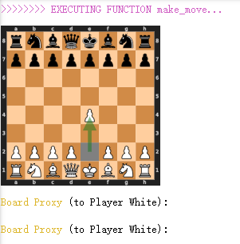


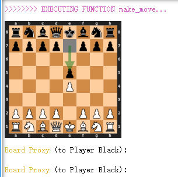

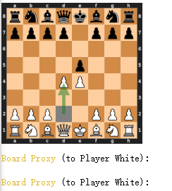

## Adding a fun chitchat to the game!


```py
player_white = ConversableAgent(
    name="Player White",
    system_message="You are a chess player and you play as white. "
    "First call get_legal_moves(), to get a list of legal moves. "
    "Then call make_move(move) to make a move. "
    "After a move is made, chitchat to make the game fun.",
    llm_config=llm_config,
)
```


```py
player_black = ConversableAgent(
    name="Player Black",
    system_message="You are a chess player and you play as black. "
    "First call get_legal_moves(), to get a list of legal moves. "
    "Then call make_move(move) to make a move. "
    "After a move is made, chitchat to make the game fun.",
    llm_config=llm_config,
)
```


```py
for caller in [player_white, player_black]:
    register_function(
        get_legal_moves,
        caller=caller,
        executor=board_proxy,
        name="get_legal_moves",
        description="Get legal moves.",
    )

    register_function(
        make_move,
        caller=caller,
        executor=board_proxy,
        name="make_move",
        description="Call this tool to make a move.",
    )

player_white.register_nested_chats(
    trigger=player_black,
    chat_queue=[
        {
            "sender": board_proxy,
            "recipient": player_white,
            "summary_method": "last_msg",
            "silent": True,
        }
    ],
)

player_black.register_nested_chats(
    trigger=player_white,
    chat_queue=[
        {
            "sender": board_proxy,
            "recipient": player_black,
            "summary_method": "last_msg",
            "silent": True,
        }
    ],
)
```


```py
board = chess.Board()

chat_result = player_black.initiate_chat(
    player_white,
    message="Let's play chess! Your move.",
    max_turns=2,
)
```

Output

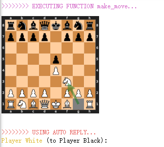


# Lesson 5: Coding and Financial Analysis


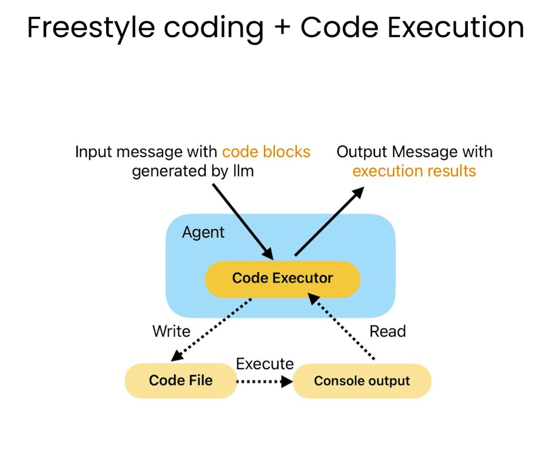

## Define a code executor


```py
llm_config = {"model": "gpt-4-turbo"}
from autogen.coding import LocalCommandLineCodeExecutor
executor = LocalCommandLineCodeExecutor(
    timeout=60,
    work_dir="coding",
)
```


## Create agents 

```py
from autogen import ConversableAgent, AssistantAgent
```


### 1. Agent with code executor configuration

```py
code_executor_agent = ConversableAgent(
    name="code_executor_agent",
    llm_config=False,
    code_execution_config={"executor": executor},
    human_input_mode="ALWAYS",
    default_auto_reply=
    "Please continue. If everything is done, reply 'TERMINATE'.",
)
```


### 2. Agent with code writing capability

```py
code_writer_agent = AssistantAgent(
    name="code_writer_agent",
    llm_config=llm_config,
    code_execution_config=False,
    human_input_mode="NEVER",
)
```


```py
code_writer_agent_system_message = code_writer_agent.system_message
print(code_writer_agent_system_message)
```

Output

```py
You are a helpful AI assistant.
Solve tasks using your coding and language skills.
In the following cases, suggest python code (in a python coding block) or shell script (in a sh coding block) for the user to execute.
    1. When you need to collect info, use the code to output the info you need, for example, browse or search the web, download/read a file, print the content of a webpage or a file, get the current date/time, check the operating system. After sufficient info is printed and the task is ready to be solved based on your language skill, you can solve the task by yourself.
    2. When you need to perform some task with code, use the code to perform the task and output the result. Finish the task smartly.
Solve the task step by step if you need to. If a plan is not provided, explain your plan first. Be clear which step uses code, and which step uses your language skill.
When using code, you must indicate the script type in the code block. The user cannot provide any other feedback or perform any other action beyond executing the code you suggest. The user can't modify your code. So do not suggest incomplete code which requires users to modify. Don't use a code block if it's not intended to be executed by the user.
If you want the user to save the code in a file before executing it, put # filename: <filename> inside the code block as the first line. Don't include multiple code blocks in one response. Do not ask users to copy and paste the result. Instead, use 'print' function for the output when relevant. Check the execution result returned by the user.
If the result indicates there is an error, fix the error and output the code again. Suggest the full code instead of partial code or code changes. If the error can't be fixed or if the task is not solved even after the code is executed successfully, analyze the problem, revisit your assumption, collect additional info you need, and think of a different approach to try.
When you find an answer, verify the answer carefully. Include verifiable evidence in your response if possible.
Reply "TERMINATE" in the end when everything is done.
```


## The task!

Ask the two agents to collaborate on a stock analysis task.

```py
import datetime

today = datetime.datetime.now().date()
message = f"Today is {today}. "\
"Create a plot showing stock gain YTD for NVDA and TLSA. "\
"Make sure the code is in markdown code block and save the figure"\
" to a file ytd_stock_gains.png."""
```


```py
chat_result = code_executor_agent.initiate_chat(
    code_writer_agent,
    message=message,
)
```

Output

~~~py
code_executor_agent (to code_writer_agent):

Today is 2024-06-07. Create a plot showing stock gain YTD for NVDA and TLSA. Make sure the code is in markdown code block and save the figure to a file ytd_stock_gains.png.

--------------------------------------------------------------------------------
code_writer_agent (to code_executor_agent):

To get the year-to-date (YTD) price data for NVIDIA (NVDA) and Tesla (TSLA) stocks and then plot this information, we will use the `yfinance` library which allows for easy access to historical market data from Yahoo Finance. We will plot the data using `matplotlib`. The script will import the necessary libraries, fetch the YTD stock data for both NVDA and TSLA starting from January 1, 2024, compute the percentage gain for each day relative to the start of the year, and save the resulting plot to a file named `ytd_stock_gains.png`.

Please execute the following Python script:

```python
# filename: plot_stock_gains.py
import yfinance as yf
import matplotlib.pyplot as plt

# Fetching data from the start of the year until today for NVDA and TSLA
start_date = '2024-01-01'
end_date = '2024-06-07'
nvda = yf.download('NVDA', start=start_date, end=end_date)
tsla = yf.download('TSLA', start=start_date, end=end_date)

# Calculating percent gain from the start of the year
nvda['Gain'] = (nvda['Adj Close'] / nvda['Adj Close'].iloc[0] - 1) * 100
tsla['Gain'] = (tsla['Adj Close'] / tsla['Adj Close'].iloc[0] - 1) * 100

# Plotting the gains
plt.figure(figsize=(10, 6))
plt.plot(nvda['Gain'], label='NVIDIA (NVDA)', color='green')
plt.plot(tsla['Gain'], label='Tesla (TSLA)', color='blue')
plt.title('YTD Stock Gains as of 2024-06-07')
plt.xlabel('Date')
plt.ylabel('Gain (%)')
plt.legend()
plt.grid(True)
plt.savefig('ytd_stock_gains.png')
plt.show()
```

This code will save the plot to `ytd_stock_gains.png` and display the plot. Ensure that the `yfinance` and `matplotlib` libraries are installed before running the script. You can install these packages using `pip install yfinance matplotlib` if they are not already installed.
~~~


## Let's see the plot!

**Note**: 
* Your plot might differ from the one shown in the video because the LLM's freestyle code generation could choose a different plot type, such as a bar plot. 
* You can re-run the previous cell and check the generated code. If it produces a bar plot, remember you can directly specify your preference by asking for a specific plot type instead of a bar plot.


```py
import os
from IPython.display import Image

Image(os.path.join("coding", "ytd_stock_gains.png"))
```

Output


## User-Defined Functions

Instead of asking LLM to generate the code for downloading stock data 
and plotting charts each time, you can define functions for these two tasks and have LLM call these functions in the code.


```py
def get_stock_prices(stock_symbols, start_date, end_date):
    """Get the stock prices for the given stock symbols between
    the start and end dates.

    Args:
        stock_symbols (str or list): The stock symbols to get the
        prices for.
        start_date (str): The start date in the format 
        'YYYY-MM-DD'.
        end_date (str): The end date in the format 'YYYY-MM-DD'.
    
    Returns:
        pandas.DataFrame: The stock prices for the given stock
        symbols indexed by date, with one column per stock 
        symbol.
    """
    import yfinance

    stock_data = yfinance.download(
        stock_symbols, start=start_date, end=end_date
    )
    return stock_data.get("Close")
```


```py
def plot_stock_prices(stock_prices, filename):
    """Plot the stock prices for the given stock symbols.

    Args:
        stock_prices (pandas.DataFrame): The stock prices for the 
        given stock symbols.
    """
    import matplotlib.pyplot as plt

    plt.figure(figsize=(10, 5))
    for column in stock_prices.columns:
        plt.plot(
            stock_prices.index, stock_prices[column], label=column
                )
    plt.title("Stock Prices")
    plt.xlabel("Date")
    plt.ylabel("Price")
    plt.grid(True)
    plt.savefig(filename)
```


### Create a new executor with the user-defined functions

```py
executor = LocalCommandLineCodeExecutor(
    timeout=60,
    work_dir="coding",
    functions=[get_stock_prices, plot_stock_prices],
)

code_writer_agent_system_message += executor.format_functions_for_prompt()
print(code_writer_agent_system_message)
```


### Let's update the agents with the new system message

```py
code_writer_agent = ConversableAgent(
    name="code_writer_agent",
    system_message=code_writer_agent_system_message,
    llm_config=llm_config,
    code_execution_config=False,
    human_input_mode="NEVER",
)

code_executor_agent = ConversableAgent(
    name="code_executor_agent",
    llm_config=False,
    code_execution_config={"executor": executor},
    human_input_mode="ALWAYS",
    default_auto_reply=
    "Please continue. If everything is done, reply 'TERMINATE'.",
)
```

### Start the same task again!

```py
chat_result = code_executor_agent.initiate_chat(
    code_writer_agent,
    message=f"Today is {today}."
    "Download the stock prices YTD for NVDA and TSLA and create"
    "a plot. Make sure the code is in markdown code block and "
    "save the figure to a file stock_prices_YTD_plot.png.",
)
```


Output

~~~py
code_executor_agent (to code_writer_agent):

Today is 2024-06-07.Download the stock prices YTD for NVDA and TSLA and createa plot. Make sure the code is in markdown code block and save the figure to a file stock_prices_YTD_plot.png.

--------------------------------------------------------------------------------
code_writer_agent (to code_executor_agent):

First, let’s download the Year-To-Date (YTD) stock prices for the companies Nvidia (NVDA) and Tesla (TSLA), starting from January 1, 2024, up until today (June 7, 2024). We will use the `get_stock_prices` function to obtain the data and then use the `plot_stock_prices` function to create a plot and save it to 'stock_prices_YTD_plot.png'.

Here is the code:

```python
# Import necessary functions
from functions import get_stock_prices, plot_stock_plot_prices

# Define the stock symbols and the date range
stock_symbols = ['NVDA', 'TSLA']
start_date = '2024-01-01'
end_date = '2024-06-07'

# Get the stock prices
stock_prices = get_stock_prices(stock_symbols, start_date, end_date)

# Plot the stock prices and save the figure to a file
plot_stock_prices(stock_prices, 'stock_prices_YTD_plot.png')
```

Please execute this script to download the stock prices for NVDA and TSLA and create the plot.

~~~


# Lesson 6: Planning and Stock Report Generation


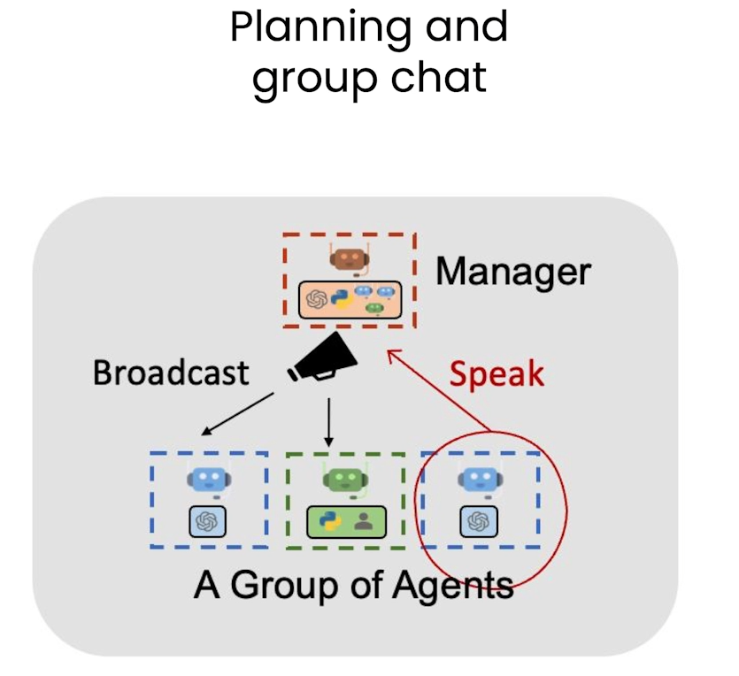


## The task!


```py
llm_config={"model": "gpt-4-turbo"}
task = "Write a blogpost about the stock price performance of "\
"Nvidia in the past month. Today's date is 2024-04-23."
```


## Build a group chat

This group chat will include these agents:

1. **User_proxy** or **Admin**: to allow the user to comment on the report and ask the writer to refine it.
2. **Planner**: to determine relevant information needed to complete the task.
3. **Engineer**: to write code using the defined plan by the planner.
4. **Executor**: to execute the code written by the engineer.
5. **Writer**: to write the report.


```py
import autogen

user_proxy = autogen.ConversableAgent(
    name="Admin",
    system_message="Give the task, and send "
    "instructions to writer to refine the blog post.",
    code_execution_config=False,
    llm_config=llm_config,
    human_input_mode="ALWAYS",
)


planner = autogen.ConversableAgent(
    name="Planner",
    system_message="Given a task, please determine "
    "what information is needed to complete the task. "
    "Please note that the information will all be retrieved using"
    " Python code. Please only suggest information that can be "
    "retrieved using Python code. "
    "After each step is done by others, check the progress and "
    "instruct the remaining steps. If a step fails, try to "
    "workaround",
    description="Planner. Given a task, determine what "
    "information is needed to complete the task. "
    "After each step is done by others, check the progress and "
    "instruct the remaining steps",
    llm_config=llm_config,
)


engineer = autogen.AssistantAgent(
    name="Engineer",
    llm_config=llm_config,
    description="An engineer that writes code based on the plan "
    "provided by the planner.",
)
```

**Note**: In this lesson, you'll use an alternative method of code execution by providing a dict config. However, you can always use the LocalCommandLineCodeExecutor if you prefer. For more details about code_execution_config, check this: https://microsoft.github.io/autogen/docs/reference/agentchat/conversable_agent/#__init__


```py
executor = autogen.ConversableAgent(
    name="Executor",
    system_message="Execute the code written by the "
    "engineer and report the result.",
    human_input_mode="NEVER",
    code_execution_config={
        "last_n_messages": 3,
        "work_dir": "coding",
        "use_docker": False,
    },
)


writer = autogen.ConversableAgent(
    name="Writer",
    llm_config=llm_config,
    system_message="Writer."
    "Please write blogs in markdown format (with relevant titles)"
    " and put the content in pseudo ```md``` code block. "
    "You take feedback from the admin and refine your blog.",
    description="Writer."
    "Write blogs based on the code execution results and take "
    "feedback from the admin to refine the blog."
)
```

## Define the group chat

```py
groupchat = autogen.GroupChat(
    agents=[user_proxy, engineer, writer, executor, planner],
    messages=[],
    max_round=10,
)

manager = autogen.GroupChatManager(
    groupchat=groupchat, llm_config=llm_config
)

```

## Start the group chat!

```py
groupchat_result = user_proxy.initiate_chat(
    manager,
    message=task,
)
```


## Add a speaker selection policy


```py
user_proxy = autogen.ConversableAgent(
    name="Admin",
    system_message="Give the task, and send "
    "instructions to writer to refine the blog post.",
    code_execution_config=False,
    llm_config=llm_config,
    human_input_mode="ALWAYS",
)

planner = autogen.ConversableAgent(
    name="Planner",
    system_message="Given a task, please determine "
    "what information is needed to complete the task. "
    "Please note that the information will all be retrieved using"
    " Python code. Please only suggest information that can be "
    "retrieved using Python code. "
    "After each step is done by others, check the progress and "
    "instruct the remaining steps. If a step fails, try to "
    "workaround",
    description="Given a task, determine what "
    "information is needed to complete the task. "
    "After each step is done by others, check the progress and "
    "instruct the remaining steps",
    llm_config=llm_config,
)

engineer = autogen.AssistantAgent(
    name="Engineer",
    llm_config=llm_config,
    description="Write code based on the plan "
    "provided by the planner.",
)

writer = autogen.ConversableAgent(
    name="Writer",
    llm_config=llm_config,
    system_message="Writer. "
    "Please write blogs in markdown format (with relevant titles)"
    " and put the content in pseudo ```md``` code block. "
    "You take feedback from the admin and refine your blog.",
    description="After all the info is available, "
    "write blogs based on the code execution results and take "
    "feedback from the admin to refine the blog. ",
)

executor = autogen.ConversableAgent(
    name="Executor",
    description="Execute the code written by the "
    "engineer and report the result.",
    human_input_mode="NEVER",
    code_execution_config={
        "last_n_messages": 3,
        "work_dir": "coding",
        "use_docker": False,
    },
)
```


```py
groupchat = autogen.GroupChat(
    agents=[user_proxy, engineer, writer, executor, planner],
    messages=[],
    max_round=10,
    allowed_or_disallowed_speaker_transitions={
        user_proxy: [engineer, writer, executor, planner],
        engineer: [user_proxy, executor],
        writer: [user_proxy, planner],
        executor: [user_proxy, engineer, planner],
        planner: [user_proxy, engineer, writer],
    },
    speaker_transitions_type="allowed",
)
```


```py
manager = autogen.GroupChatManager(
    groupchat=groupchat, llm_config=llm_config
)

groupchat_result = user_proxy.initiate_chat(
    manager,
    message=task,
)
```


# 后记

2024年6月7日周五19点08分完成这门short course，对AutoGen这个框架有了基本的了解。