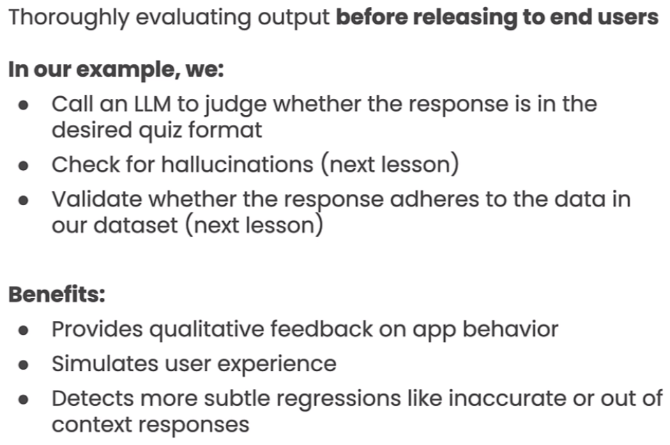
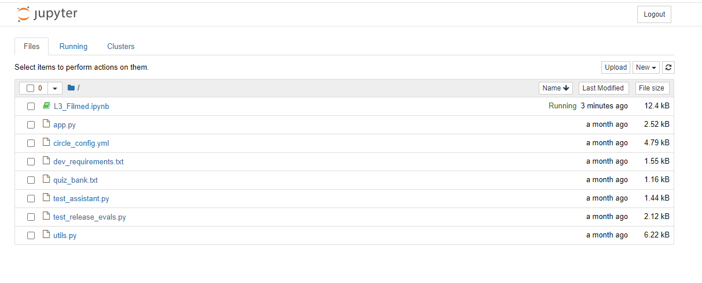
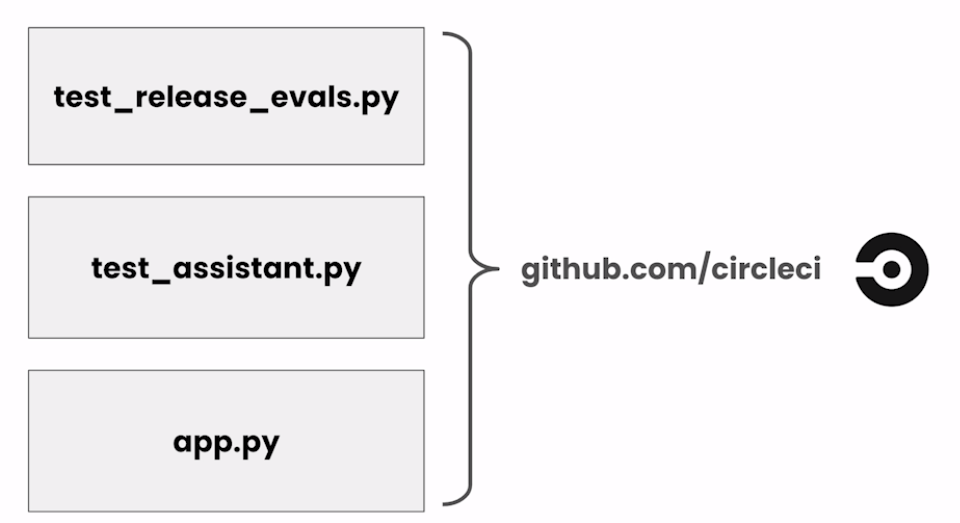

# Automated Testing for LLMOps


这是学习https://www.deeplearning.ai/short-courses/automated-testing-llmops/ 这门课的笔记

Learn how LLM-based testing differs from traditional software testing and implement rules-based testing to assess your LLM application.

Build model-graded evaluations to test your LLM application using an evaluation LLM.

Automate your evals (rules-based and model-graded) using continuous integration tools from CircleCI.

@[toc]

# Lesson 3: Automating Model-Graded Evals





```py
import warnings
warnings.filterwarnings('ignore')
```

## Import the API keys for our 3rd party APIs.

```py
from utils import get_circle_api_key
cci_api_key = get_circle_api_key()

from utils import get_gh_api_key
gh_api_key = get_gh_api_key()

from utils import get_openai_api_key
openai_api_key = get_openai_api_key()

```

Lesson3所有文件如下所示



utils.py的内容如下

```py
import github
import os
import requests
import random
from dotenv import load_dotenv
from yaml import safe_dump, safe_load
import time

load_dotenv()

adjectives = [
    "adoring",
    "affirmative",
    "appreciated",
    "available",
    "best-selling",
    "blithe",
    "brightest",
    "charismatic",
    "convincing",
    "dignified",
    "ecstatic",
    "effective",
    "engaging",
    "enterprising",
    "ethical",
    "fast-growing",
    "glad",
    "hardy",
    "idolized",
    "improving",
    "jubilant",
    "knowledgeable",
    "long-lasting",
    "lucky",
    "marvelous",
    "merciful",
    "mesmerizing",
    "problem-free",
    "resplendent",
    "restored",
    "roomier",
    "serene",
    "sharper",
    "skilled",
    "smiling",
    "smoother",
    "snappy",
    "soulful",
    "staunch",
    "striking",
    "strongest",
    "subsidized",
    "supported",
    "supporting",
    "sweeping",
    "terrific",
    "unaffected",
    "unbiased",
    "unforgettable",
    "unrivaled",
]

nouns = [
    "agustinia",
    "apogee",
    "bangle",
    "cake",
    "cheese",
    "clavicle",
    "client",
    "clove",
    "curler",
    "draw",
    "duke",
    "earl",
    "eustoma",
    "fireplace",
    "gem",
    "glove",
    "goal",
    "ground",
    "jasmine",
    "jodhpur",
    "laugh",
    "message",
    "mile",
    "mockingbird",
    "motor",
    "phalange",
    "pillow",
    "pizza",
    "pond",
    "potential",
    "ptarmigan",
    "puck",
    "puzzle",
    "quartz",
    "radar",
    "raver",
    "saguaro",
    "salary",
    "sale",
    "scarer",
    "skunk",
    "spatula",
    "spectacles",
    "statistic",
    "sturgeon",
    "tea",
    "teacher",
    "wallet",
    "waterfall",
    "wrinkle",
]

def inspect_config():
    with open("circle_config.yml") as f:
        print(safe_dump(safe_load(f)))


def get_openai_api_key():
    openai_api_key = os.getenv("OPENAI_API_KEY")
    return openai_api_key

def get_circle_api_key():
    circle_token = os.getenv("CIRCLE_TOKEN")
    return circle_token

def get_gh_api_key():
    github_token = os.getenv("GH_TOKEN")
    return github_token

def get_repo_name():
    return "CircleCI-Learning/llmops-course"


def _create_tree_element(repo, path, content):
    blob = repo.create_git_blob(content, "utf-8")
    element = github.InputGitTreeElement(
        path=path, mode="100644", type="blob", sha=blob.sha
    )
    return element


def push_files(repo_name, branch_name, files, config="circle_config.yml"):
    files_to_push = set(files)
    # include the config.yml file
    g = github.Github(os.environ["GH_TOKEN"])
    repo = g.get_repo(repo_name)

    elements = []
    config_element = _create_tree_element(
        repo, 
        ".circleci/config.yml", 
        open(config).read()
    )
    elements.append(config_element)
    requirements_element = _create_tree_element(
        repo, "requirements.txt", open("dev_requirements.txt").read()
    )
    
    elements.append(requirements_element)
    elements.append(config_element)
    for file in files_to_push:
        print(f"uploading {file}")
        with open(file, encoding="utf-8") as f:
            content = f.read()
            element = _create_tree_element(repo, file, content)
            elements.append(element)

    head_sha = repo.get_branch("main").commit.sha
    
    try:
        repo.create_git_ref(ref=f"refs/heads/{branch_name}", sha=head_sha)
        time.sleep(2)
    except Exception as _:
        print(f"{branch_name} already exists in the repository pushing updated changes")
    branch_sha = repo.get_branch(branch_name).commit.sha

    base_tree = repo.get_git_tree(sha=branch_sha)
    tree = repo.create_git_tree(elements, base_tree)
    parent = repo.get_git_commit(sha=branch_sha)
    commit = repo.create_git_commit("Trigger CI evaluation pipeline", tree, [parent])
    branch_refs = repo.get_git_ref(f"heads/{branch_name}")
    branch_refs.edit(sha=commit.sha)


def _trigger_circle_pipline(repo_name, branch, token, params=None):
    params = {} if params is None else params
    r = requests.post(
        f"{os.getenv('DLAI_CIRCLE_CI_API_BASE', 'https://circleci.com')}/api/v2/project/gh/{repo_name}/pipeline",
        headers={"Circle-Token": f"{token}", "accept": "application/json"},
        json={"branch": branch, "parameters": params},
    )
    pipeline_data = r.json()
    pipeline_number = pipeline_data["number"]
    print(
        f"Please visit https://app.circleci.com/pipelines/github/{repo_name}/{pipeline_number}"
    )


def trigger_commit_evals(repo_name, branch, files, token):
    try:
        push_files(repo_name, branch, files)
        _trigger_circle_pipline(repo_name, branch, token, {"eval-mode": "commit"})
    except Exception as e:
        print(f"Error starting circleci pipeline {e}")


def trigger_release_evals(repo_name, branch, files, token):
    try:
        push_files(repo_name, branch, files)
        _trigger_circle_pipline(repo_name, branch, token, {"eval-mode": "release"})
    except Exception as e:
        print(f"Error starting circleci pipeline {e}")

def trigger_full_evals(repo_name, branch, files, token):
    try:
        push_files(repo_name, branch, files)
        _trigger_circle_pipline(repo_name, branch, token, {"eval-mode": "full"})
    except Exception as e:
        print(f"Error starting circleci pipeline {e}")

def trigger_eval_report(repo_name, branch, files, token):
    try:
        push_files(repo_name, branch, files)
        _trigger_circle_pipline(repo_name, branch, token, {"eval-mode": "report"})
    except Exception as e:
        print(f"Error starting circleci pipeline {e}")


## magic to write and run
from IPython.core.magic import register_cell_magic


@register_cell_magic
def write_and_run(line, cell):
    argz = line.split()
    file = argz[-1]
    mode = "w"
    if len(argz) == 2 and argz[0] == "-a":
        mode = "a"
    with open(file, mode) as f:
        f.write(cell)
    get_ipython().run_cell(cell)


def get_branch() -> str:
    """Generate a random branch name."""
    prefix = "dl-cci"
    adjective = random.choice(adjectives)
    noun = random.choice(nouns)
    number = random.randint(1, 100)

    return f"dl-cci-{adjective}-{noun}-{number}"

```

## Set up our github branch

```py
from utils import get_repo_name
course_repo = get_repo_name()
course_repo
```

Output：github repo的名字

```py
'CircleCI-Learning/llmops-course'
```


```py
from utils import get_branch
course_branch = get_branch()
course_branch
```

Output：我的分支的名字

```py
'dl-cci-available-earl-51'
```


## The sample application: AI-powered quiz generator

Here is our sample application from the previous lesson that you will continue working on.

app.py

```py
from langchain.prompts import ChatPromptTemplate
from langchain.chat_models import ChatOpenAI
from langchain.schema.output_parser import StrOutputParser

delimiter = "####"


def read_file_into_string(file_path):
    try:
        with open(file_path, "r") as file:
            file_content = file.read()
            return file_content
    except FileNotFoundError:
        print(f"The file at '{file_path}' was not found.")
    except Exception as e:
        print(f"An error occurred: {e}")


quiz_bank = read_file_into_string("quiz_bank.txt")

system_message = f"""
Follow these steps to generate a customized quiz for the user.
The question will be delimited with four hashtags i.e {delimiter}

The user will provide a category that they want to create a quiz for. Any questions included in the quiz
should only refer to the category.

Step 1:{delimiter} First identify the category user is asking about from the following list:
* Geography
* Science
* Art

Step 2:{delimiter} Determine the subjects to generate questions about. The list of topics are in the quiz bank below:

#### Start Quiz Bank
{quiz_bank}

#### End Quiz Bank

Pick up to two subjects that fit the user's category. 

Step 3:{delimiter} Generate a quiz for the user. Based on the selected subjects generate 3 questions for the user using the facts about the subject.

* Only include questions for subjects that are in the quiz bank.

Use the following format for the quiz:
Question 1:{delimiter} <question 1>

Question 2:{delimiter} <question 2>

Question 3:{delimiter} <question 3>

Additional rules:
- Only include questions from information in the quiz bank. Students only know answers to questions from the quiz bank, do not ask them about other topics.
- Only use explicit string matches for the category name, if the category is not an exact match for Geography, Science, or Art answer that you do not have information on the subject.
- If the user asks a question about a subject you do not have information about in the quiz bank, answer "I'm sorry I do not have information about that".
"""

"""
  Helper functions for writing the test cases
"""


def assistant_chain(
    system_message=system_message,
    human_template="{question}",
    llm=ChatOpenAI(model="gpt-3.5-turbo", temperature=0),
    output_parser=StrOutputParser(),
):
    chat_prompt = ChatPromptTemplate.from_messages(
        [
            ("system", system_message),
            ("human", human_template),
        ]
    )
    return chat_prompt | llm | output_parser

```


## A first model graded eval
Build a prompt that tells the LLM to evaluate the output of the quizzes.

```py
delimiter = "####"
eval_system_prompt = f"""You are an assistant that evaluates \
  whether or not an assistant is producing valid quizzes.
  The assistant should be producing output in the \
  format of Question N:{delimiter} <question N>?"""
```

Simulate LLM response to make a first test.

```py
llm_response = """
Question 1:#### What is the largest telescope in space called and what material is its mirror made of?

Question 2:#### True or False: Water slows down the speed of light.

Question 3:#### What did Marie and Pierre Curie discover in Paris?
"""
```

Build the prompt for the evaluation (eval).

```py
eval_user_message = f"""You are evaluating a generated quiz \
based on the context that the assistant uses to create the quiz.
  Here is the data:
    [BEGIN DATA]
    ************
    [Response]: {llm_response}
    ************
    [END DATA]

Read the response carefully and determine if it looks like \
a quiz or test. Do not evaluate if the information is correct
only evaluate if the data is in the expected format.

Output Y if the response is a quiz, \
output N if the response does not look like a quiz.
"""
```

Use langchain to build the prompt template for evaluation.

```py
from langchain.prompts import ChatPromptTemplate
eval_prompt = ChatPromptTemplate.from_messages([
      ("system", eval_system_prompt),
      ("human", eval_user_message),
  ])
```

Choose an LLM.

```py
from langchain.chat_models import ChatOpenAI
llm = ChatOpenAI(model="gpt-3.5-turbo",
                 temperature=0)
```


From langchain import a parser to have a readable response.

```py
from langchain.schema.output_parser import StrOutputParser
output_parser = StrOutputParser()
```

Connect all pieces together in the variable 'chain'.

```py
eval_chain = eval_prompt | llm | output_parser
```

Test the 'good LLM' with positive response by invoking the eval_chain.

```py
eval_chain.invoke({})
```

Output

'Y'

Create function 'create_eval_chain'.

```py
def create_eval_chain(
    agent_response,
    llm = ChatOpenAI(model="gpt-3.5-turbo", temperature=0),
    output_parser=StrOutputParser()
):
  delimiter = "####"
  eval_system_prompt = f"""You are an assistant that evaluates whether or not an assistant is producing valid quizzes.
  The assistant should be producing output in the format of Question N:{delimiter} <question N>?"""
  
  eval_user_message = f"""You are evaluating a generated quiz based on the context that the assistant uses to create the quiz.
  Here is the data:
    [BEGIN DATA]
    ************
    [Response]: {agent_response}
    ************
    [END DATA]

Read the response carefully and determine if it looks like a quiz or test. Do not evaluate if the information is correct
only evaluate if the data is in the expected format.

Output Y if the response is a quiz, output N if the response does not look like a quiz.
"""
  eval_prompt = ChatPromptTemplate.from_messages([
      ("system", eval_system_prompt),
      ("human", eval_user_message),
  ])

  return eval_prompt | llm | output_parser
```


Create new response to test in the eval_chain.

```py
known_bad_result = "There are lots of interesting facts. Tell me more about what you'd like to know"
bad_eval_chain = create_eval_chain(known_bad_result)
# response for wrong prompt
bad_eval_chain.invoke({})
```

Output

'N'

Add new create_eval_chain into the 'test_assistant.py' file.

test_assistant.py文件内容

```py
from app import assistant_chain
import os

from dotenv import load_dotenv, find_dotenv

_ = load_dotenv(find_dotenv())


def test_science_quiz():
    assistant = assistant_chain()
    question = "Generate a quiz about science."
    answer = assistant.invoke({"question": question})
    expected_subjects = ["davinci", "telescope", "physics", "curie"]
    print(answer)
    assert any(
        subject.lower() in answer.lower() for subject in expected_subjects
    ), f"Expected the assistant questions to include '{expected_subjects}', but it did not"


def test_geography_quiz():
    assistant = assistant_chain()
    question = "Generate a quiz about geography."
    answer = assistant.invoke({"question": question})
    expected_subjects = ["paris", "france", "louvre"]
    print(answer)
    assert any(
        subject.lower() in answer.lower() for subject in expected_subjects
    ), f"Expected the assistant questions to include '{expected_subjects}', but it did not"


def test_decline_unknown_subjects():
    assistant = assistant_chain()
    question = "Generate a quiz about Rome"
    answer = assistant.invoke({"question": question})
    print(answer)
    # We'll look for a substring of the message the bot prints when it gets a question about any
    decline_response = "I'm sorry"
    assert (
        decline_response.lower() in answer.lower()
    ), f"Expected the bot to decline with '{decline_response}' got {answer}"
    # 整个断言语句的作用是，如果 answer 中不包含 decline_response（忽略大小写），
    # 则断言失败，并打印出错误信息，显示预期的回应以及实际获取的回应
```

test_release_evals.py文件内容

```py
from app import assistant_chain
from langchain.prompts import ChatPromptTemplate
from langchain.chat_models import ChatOpenAI
from langchain.schema.output_parser import StrOutputParser
import pytest


def create_eval_chain(
    agent_response,
    llm=ChatOpenAI(model="gpt-3.5-turbo", temperature=0),
    output_parser=StrOutputParser(),
):
    delimiter = "####"
    eval_system_prompt = f"""You are an assistant that evaluates whether or not an assistant is producing valid quizzes.
  The assistant should be producing output in the format of Question N:{delimiter} <question N>?"""

    eval_user_message = f"""You are evaluating a generated quiz based on the context that the assistant uses to create the quiz.
  Here is the data:
    [BEGIN DATA]
    ************
    [Response]: {agent_response}
    ************
    [END DATA]

Read the response carefully and determine if it looks like a quiz or test. Do not evaluate if the information is correct
only evaluate if the data is in the expected format.

Output Y if the response is a quiz, output N if the response does not look like a quiz.
"""
    eval_prompt = ChatPromptTemplate.from_messages(
        [
            ("system", eval_system_prompt),
            ("human", eval_user_message),
        ]
    )

    return eval_prompt | llm | output_parser

# 装饰器被用来创建可复用的测试对象或数据
@pytest.fixture
def known_bad_result():
    return "There are lots of interesting facts. Tell me more about what you'd like to know"


@pytest.fixture
def quiz_request():
    return "Give me a quiz about Geography"

# 这两个测试函数接受相应的 fixture 作为参数

def test_model_graded_eval(quiz_request):
    assistant = assistant_chain()
    result = assistant.invoke({"question": quiz_request})
    print(result)
    eval_agent = create_eval_chain(result)
    eval_response = eval_agent.invoke({})
    assert eval_response == "Y"


def test_model_graded_eval_should_fail(known_bad_result):
    print(known_bad_result)
    eval_agent = create_eval_chain(known_bad_result)
    eval_response = eval_agent.invoke({})
    assert (
        eval_response == "Y"
    ), f"expected failure, asserted the response should be 'Y', \
    got back '{eval_response}'"
```

解释@pytest.fixture

`@pytest.fixture` 是 Python 中 Pytest 测试框架提供的一个装饰器，用于定义测试函数中可复用的对象或代码块。通过使用 `@pytest.fixture` 装饰器，可以在测试函数中引入一些需要在多个测试中共享的对象，比如测试数据、测试环境的配置、数据库连接等。

使用 `@pytest.fixture` 装饰器定义的函数称为“fixture”。当测试函数需要使用这些共享的对象时，可以在测试函数的参数列表中引用相应的 fixture 函数名，Pytest 将会自动识别并注入这些对象。在测试执行过程中，Pytest 会根据依赖关系自动调用和管理 fixture 函数的执行顺序，以确保测试函数能够正确地获取所需的资源。

例如，假设我们有一个测试需要用到一个数据库连接对象，我们可以定义一个 fixture 来创建和返回这个数据库连接对象，并在测试函数中通过参数引用这个 fixture：

```python
import pytest
import my_database_module

@pytest.fixture
def db_connection():
    # 创建数据库连接
    connection = my_database_module.connect('my_database')
    yield connection
    # 断开数据库连接
    connection.close()

def test_query_data(db_connection):
    # 在测试函数中使用数据库连接
    data = db_connection.query('SELECT * FROM my_table')
    assert len(data) > 0
```

在这个例子中，`db_connection` 是一个 fixture，它会在测试函数执行之前创建数据库连接，在测试函数执行完毕后关闭连接。测试函数 `test_query_data` 使用了 `db_connection` fixture，所以在测试执行时会自动调用 `db_connection` 函数来获取数据库连接。


Push new files into CircleCI's Git repo.




```py
from utils import push_files
push_files(course_repo, 
           course_branch, 
           ["app.py",
            "test_release_evals.py",
            "test_assistant.py"],
           config="circle_config.yml"
          )
```

Output

```py
uploading app.py
uploading test_assistant.py
uploading test_release_evals.py
```

Trigger the Release Evaluations.

```py
from utils import trigger_release_evals
trigger_release_evals(course_repo, 
                      course_branch, 
                      ["app.py",
                       "test_assistant.py",
                       "test_release_evals.py"],
                      cci_api_key)
```

Output

```py
uploading app.py
uploading test_release_evals.py
uploading test_assistant.py
dl-cci-available-earl-51 already exists in the repository pushing updated changes
Please visit https://app.circleci.com/pipelines/github/CircleCI-Learning/llmops-course/3017
```

