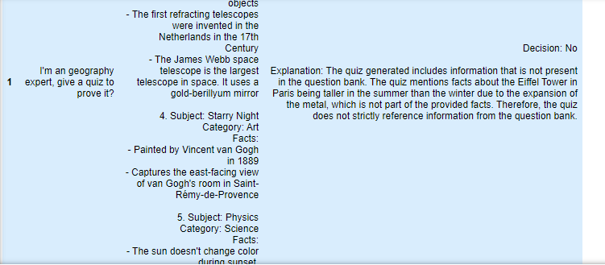
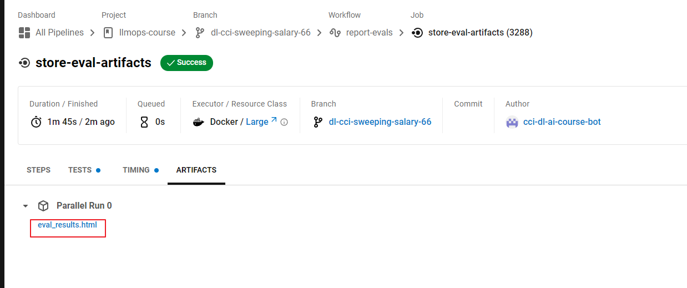
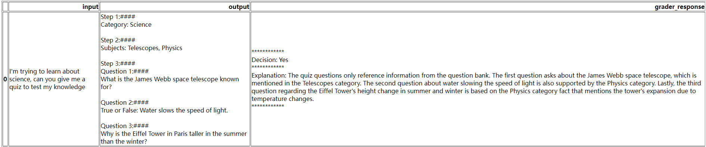

# Automated Testing for LLMOps


这是学习https://www.deeplearning.ai/short-courses/automated-testing-llmops/ 这门课的笔记

Learn how LLM-based testing differs from traditional software testing and implement rules-based testing to assess your LLM application.

Build model-graded evaluations to test your LLM application using an evaluation LLM.

Automate your evals (rules-based and model-graded) using continuous integration tools from CircleCI.

@[toc]

# Lesson 4: Comprehensive Testing Framework


## Import the API keys


```py
from utils import get_circle_api_key
cci_api_key = get_circle_api_key()

from utils import get_gh_api_key
gh_api_key = get_gh_api_key()

from utils import get_openai_api_key
openai_api_key = get_openai_api_key()
```

## Set up our github branch

```py
from utils import get_repo_name
course_repo = get_repo_name()
course_repo

from utils import get_branch
course_branch = get_branch()
course_branch
```


Aditionally, the file quiz_bank.txt should be uploaded to this workspace (already done!). This file has the information about the content we want for the quizzes generated.

```py
from utils import read_file_into_string
quiz_bank = read_file_into_string("quiz_bank.txt")

print(quiz_bank)
```

Output

```py
1. Subject: Leonardo DaVinci
   Categories: Art, Science
   Facts:
    - Painted the Mona Lisa
    - Studied zoology, anatomy, geology, optics
    - Designed a flying machine
  
2. Subject: Paris
   Categories: Art, Geography
   Facts:
    - Location of the Louvre, the museum where the Mona Lisa is displayed
    - Capital of France
    - Most populous city in France
    - Where Radium and Polonium were discovered by scientists Marie and Pierre Curie

3. Subject: Telescopes
   Category: Science
   Facts:
    - Device to observe different objects
    - The first refracting telescopes were invented in the Netherlands in the 17th Century
    - The James Webb space telescope is the largest telescope in space. It uses a gold-berillyum mirror

4. Subject: Starry Night
   Category: Art
   Facts:
    - Painted by Vincent van Gogh in 1889
    - Captures the east-facing view of van Gogh's room in Saint-Rémy-de-Provence

5. Subject: Physics
   Category: Science
   Facts:
    - The sun doesn't change color during sunset.
    - Water slows the speed of light
    - The Eiffel Tower in Paris is taller in the summer than the winter due to expansion of the metal.
```

## Rebuild the quiz generator app

```py
delimiter = "####"
system_message = f"""
Follow these steps to generate a customized quiz for the user.
The question will be delimited with four hashtags i.e {delimiter}

Step 1:{delimiter} First identify the category user is asking about from the following list:
* Geography
* Science
* Art

Step 2:{delimiter} Determine the subjects to generate questions about. The list of topics are below:

{quiz_bank}

Pick up to two subjects that fit the user's category.

Step 3:{delimiter} Generate a quiz for the user. Based on the selected subjects generate 3 questions for the user using the facts about the subject.
* Include any facts that might be interesting

Use the following format:
Question 1:{delimiter} <question 1>

Question 2:{delimiter} <question 2>

Question 3:{delimiter} <question 3>
"""
```


## Create Chat Prompt
Create function assistant_chain() to build the chat_prompt.

```py
from langchain.prompts                import ChatPromptTemplate
from langchain.chat_models            import ChatOpenAI
from langchain.schema.output_parser   import StrOutputParser

def assistant_chain():
  human_template  = "{question}"

  chat_prompt = ChatPromptTemplate.from_messages([
      ("system", system_message),
      ("human", human_template),
  ])
  return chat_prompt | \
         ChatOpenAI(model="gpt-3.5-turbo", 
                    temperature=0) | \
         StrOutputParser()
```

# Hallucination detection


```py
from langchain.prompts                import ChatPromptTemplate
from langchain.chat_models            import ChatOpenAI
from langchain.schema.output_parser   import StrOutputParser

def create_eval_chain(context, agent_response):
  eval_system_prompt = """You are an assistant that evaluates \
  how well the quiz assistant
    creates quizzes for a user by looking at the set of \
    facts available to the assistant.
    Your primary concern is making sure that ONLY facts \
    available are used. Quizzes that contain facts outside
    the question bank are BAD quizzes and harmful to the student."""
  
  eval_user_message = """You are evaluating a generated quiz \
  based on the context that the assistant uses to create the quiz.
  Here is the data:
    [BEGIN DATA]
    ************
    [Question Bank]: {context}
    ************
    [Quiz]: {agent_response}
    ************
    [END DATA]

Compare the content of the submission with the question bank \
using the following steps

1. Review the question bank carefully. \
  These are the only facts the quiz can reference
2. Compare the quiz to the question bank.
3. Ignore differences in grammar or punctuation
4. If a fact is in the quiz, but not in the question bank \
   the quiz is bad.

Remember, the quizzes need to only include facts the assistant \
  is aware of. It is dangerous to allow made up facts.

Output Y if the quiz only contains facts from the question bank, \
output N if it contains facts that are not in the question bank.
"""
  eval_prompt = ChatPromptTemplate.from_messages([
      ("system", eval_system_prompt),
      ("human", eval_user_message),
  ])

  return eval_prompt | ChatOpenAI(
      model="gpt-3.5-turbo", 
      temperature=0) | \
    StrOutputParser()
```

Create function test_model_graded_eval_hallucination(quiz_bank) to test about hallucinations.

```py
def test_model_graded_eval_hallucination(quiz_bank):
  assistant = assistant_chain()
  quiz_request = "Write me a quiz about books."
  result = assistant.invoke({"question": quiz_request})
  print(result)
  eval_agent = create_eval_chain(quiz_bank, result)
  eval_response = eval_agent.invoke({"context": quiz_bank, "agent_response": result})
  print(eval_response)
  # Our test asks about a subject not in the context, so the agent should answer N
  assert eval_response == "N"

```

Try test_model_graded_eval_hallucination function with the quiz_bank (mentioned before).

```py
test_model_graded_eval_hallucination(quiz_bank)
```

Output

```py
#### First identify the category user is asking about from the following list:
* Geography
* Science
* Art

Since you mentioned books, I will assume you are interested in the category of Art.

#### Determine the subjects to generate questions about. The list of topics are below:

1. Subject: Leonardo DaVinci
   Categories: Art, Science
   Facts:
    - Painted the Mona Lisa
    - Studied zoology, anatomy, geology, optics
    - Designed a flying machine
  
2. Subject: Paris
   Categories: Art, Geography
   Facts:
    - Location of the Louvre, the museum where the Mona Lisa is displayed
    - Capital of France
    - Most populous city in France
    - Where Radium and Polonium were discovered by scientists Marie and Pierre Curie

3. Subject: Telescopes
   Category: Science
   Facts:
    - Device to observe different objects
    - The first refracting telescopes were invented in the Netherlands in the 17th Century
    - The James Webb space telescope is the largest telescope in space. It uses a gold-berillyum mirror

4. Subject: Starry Night
   Category: Art
   Facts:
    - Painted by Vincent van Gogh in 1889
    - Captures the east-facing view of van Gogh's room in Saint-Rémy-de-Provence

5. Subject: Physics
   Category: Science
   Facts:
    - The sun doesn't change color during sunset.
    - Water slows the speed of light
    - The Eiffel Tower in Paris is taller in the summer than the winter due to expansion of the metal.

Based on your interest in books, I will generate questions related to the subject of Starry Night by Vincent van Gogh.

#### Generate a quiz for the user. Based on the selected subjects generate 3 questions for the user using the facts about the subject.
* Include any facts that might be interesting

Question 1:#### Who painted the famous artwork "Starry Night"?
Question 2:#### In which year was "Starry Night" painted by Vincent van Gogh?
Question 3:#### What does "Starry Night" by Vincent van Gogh depict?
N
```

## Reviewing evaluations

Improve the eval_system_prompt.


```py
eval_system_prompt = """You are an assistant that evaluates \
how well the quiz assistant
    creates quizzes for a user by looking at the set of \
    facts available to the assistant.
    Your primary concern is making sure that ONLY facts \
    available are used.
    Helpful quizzes only contain facts in the test set."""
```

Rebuild the evaluator to provide not only the decision of the result but also the explanation. 

```py
eval_user_message = """You are evaluating a generated quiz based on the question bank that the assistant uses to create the quiz.
  Here is the data:
    [BEGIN DATA]
    ************
    [Question Bank]: {context}
    ************
    [Quiz]: {agent_response}
    ************
    [END DATA]

## Examples of quiz questions
Subject: <subject>
   Categories: <category1>, <category2>
   Facts:
    - <fact 1>
    - <fact 2>

## Steps to make a decision
Compare the content of the submission with the question bank using the following steps

1. Review the question bank carefully. These are the only facts the quiz can reference
2. Compare the information in the quiz to the question bank.
3. Ignore differences in grammar or punctuation

Remember, the quizzes should only include information from the question bank.


## Additional rules
- Output an explanation of whether the quiz only references information in the context.
- Make the explanation brief only include a summary of your reasoning for the decsion.
- Include a clear "Yes" or "No" as the first paragraph.
- Reference facts from the quiz bank if the answer is yes

Separate the decision and the explanation. For example:

************
Decision: <Y>
************
Explanation: <Explanation>
************
"""
```

Rebuild the check prompt template with the new prompt.

```py
eval_prompt = ChatPromptTemplate.from_messages([
      ("system", eval_system_prompt),
      ("human", eval_user_message),
  ])
eval_prompt
```

Output

```py
ChatPromptTemplate(input_variables=['agent_response', 'context'], messages=[SystemMessagePromptTemplate(prompt=PromptTemplate(input_variables=[], template='You are an assistant that evaluates how well the quiz assistant\n    creates quizzes for a user by looking at the set of     facts available to the assistant.\n    Your primary concern is making sure that ONLY facts     available are used.\n    Helpful quizzes only contain facts in the test set.')), HumanMessagePromptTemplate(prompt=PromptTemplate(input_variables=['agent_response', 'context'], template='You are evaluating a generated quiz based on the question bank that the assistant uses to create the quiz.\n  Here is the data:\n    [BEGIN DATA]\n    ************\n    [Question Bank]: {context}\n    ************\n    [Quiz]: {agent_response}\n    ************\n    [END DATA]\n\n## Examples of quiz questions\nSubject: <subject>\n   Categories: <category1>, <category2>\n   Facts:\n    - <fact 1>\n    - <fact 2>\n\n## Steps to make a decision\nCompare the content of the submission with the question bank using the following steps\n\n1. Review the question bank carefully. These are the only facts the quiz can reference\n2. Compare the information in the quiz to the question bank.\n3. Ignore differences in grammar or punctuation\n\nRemember, the quizzes should only include information from the question bank.\n\n\n## Additional rules\n- Output an explanation of whether the quiz only references information in the context.\n- Make the explanation brief only include a summary of your reasoning for the decsion.\n- Include a clear "Yes" or "No" as the first paragraph.\n- Reference facts from the quiz bank if the answer is yes\n\nSeparate the decision and the explanation. For example:\n\n************\nDecision: <Y>\n************\nExplanation: <Explanation>\n************\n'))])
```

### Building multiple test cases to use the evaluator and new prompt

Define different test cases, prompts that include inputs and their expected responses.

*_Note_*: Try adding your own inputs and responses!

```py
# In a real application you would load your dataset from a file or logging tool.
# Here we have a mix of examples with slightly different phrasing that our quiz application can support
# and things we don't support. 
test_dataset = [
  {"input": "I'm trying to learn about science, can you give me a quiz to test my knowledge",
   "response": "science",
   "subjects": ["davinci", "telescope", "physics", "curie"]},
  {"input": "I'm an geography expert, give a quiz to prove it?",
   "response": "geography",
   "subjects": ["paris", "france", "louvre"]},
   {"input": "Quiz me about Italy",
   "response": "geography",
   "subjects": ["rome", "alps", "sicily"]
   },
]
```

Create funcion evaluate_dataset to look through the dataset and invoke the quiz generator.

```py
def evaluate_dataset(dataset, 
                     quiz_bank,
                     assistant, 
                     evaluator):
  eval_results = []
  for row in dataset:
    eval_result = {}
    user_input = row["input"] 
    answer = assistant.invoke({"question": user_input})
    eval_response = evaluator.invoke({"context": quiz_bank, "agent_response": answer})
    
    eval_result["input"] = user_input
    eval_result["output"] = answer
    eval_result["grader_response"] = eval_response
    eval_results.append(eval_result)
  return eval_results
```

Import functions to generate reports for the test_dataset evaluations.

```py
import pandas as pd
from app import assistant_chain, quiz_bank
from IPython.display import display, HTML

from langchain.prompts                import ChatPromptTemplate
from langchain.chat_models            import ChatOpenAI
from langchain.schema.output_parser   import StrOutputParser
```

Create the wrapper, incluide the LLM (in this case GTP-3.5-turbo).

```py
def create_eval_chain(prompt):
  
  return prompt | \
    ChatOpenAI(model="gpt-3.5-turbo", 
               temperature=0) | \
    StrOutputParser()

```

Use pandas to facilitate the creation of reports and define report_evals() function.

```py
def report_evals(display_to_notebook=False):
  assistant = assistant_chain()
  model_graded_evaluator = create_eval_chain(eval_prompt)
  eval_results = evaluate_dataset(test_dataset, 
                                  quiz_bank, 
                                  assistant, 
                                  model_graded_evaluator)
  df = pd.DataFrame(eval_results)
  ## clean up new lines to be html breaks
  df_html = df.to_html().replace("\\n","<br>")
  if display_to_notebook:
    display(HTML(df_html))
  else:
    print(df_html)

```

Display the table with the results (grader_response).

<p style="background-color:#ffc107; padding:15px; margin-left:20px"> <b>Note:</b> Depending on the specific wording of the questions generated by your application, you may receive a different decision from the evaluation model in the following cell. This is a good example of why storing evaluation results for human review can be useful in refining model behavior.</p>

Output



## Integration to CircleCI

Display the additional file for the CI/CD integrations.

!cat save_eval_artifacts.py

```py
import pandas as pd
from app import assistant_chain, quiz_bank
from IPython.display import display, HTML

from langchain.prompts import ChatPromptTemplate
from langchain.chat_models import ChatOpenAI
from langchain.schema.output_parser import StrOutputParser

eval_system_prompt = """You are an assistant that evaluates how well the quiz assistant
    creates quizzes for a user by looking at the set of facts available to the assistant.
    Your primary concern is making sure that ONLY facts available are used. Helpful quizzes only contain facts in the
    test set"""

eval_user_message = """You are evaluating a generated quiz based on the question bank that the assistant uses to create the quiz.
  Here is the data:
    [BEGIN DATA]
    ************
    [Question Bank]: {context}
    ************
    [Quiz]: {agent_response}
    ************
    [END DATA]

## Examples of quiz questions
Subject: <subject>
   Categories: <category1>, <category2>
   Facts:
    - <fact 1>
    - <fact 2>

## Steps to make a decision
Compare the content of the submission with the question bank using the following steps

1. Review the question bank carefully. These are the only facts the quiz can reference
2. Compare the information in the quiz to the question bank.
3. Ignore differences in grammar or punctuation

Remember, the quizzes should only include information from the question bank.


## Additional rules
- Output an explanation of whether the quiz only references information in the context.
- Make the explanation brief only include a summary of your reasoning for the decsion.
- Include a clear "Yes" or "No" as the first paragraph.
- Reference facts from the quiz bank if the answer is yes

Separate the decision and the explanation. For example:

************
Decision: <Y>
************
Explanation: <Explanation>
************
"""

# In a real application you would load your dataset from a file or logging tool.
# Here we have a mix of examples with slightly different phrasing that our quiz application can support
# and things we don't support.
dataset = [
    {
        "input": "I'm trying to learn about science, can you give me a quiz to test my knowledge",
        "response": "science",
        "subjects": ["davinci", "telescope", "physics", "curie"],
    },
    {
        "input": "I'm an geography expert, give a quiz to prove it?",
        "response": "geography",
        "subjects": ["paris", "france", "louvre"],
    },
    {
        "input": "Quiz me about Italy",
        "response": "geography",
        "subjects": ["rome", "alps", "sicily"],
    },
]


def create_eval_chain():
    eval_prompt = ChatPromptTemplate.from_messages(
        [
            ("system", eval_system_prompt),
            ("human", eval_user_message),
        ]
    )

    return (
        eval_prompt
        | ChatOpenAI(model="gpt-3.5-turbo", temperature=0)
        | StrOutputParser()
    )


def evaluate_dataset(dataset, quiz_bank, assistant, evaluator):
    eval_results = []
    for row in dataset:
        eval_result = {}
        user_input = row["input"]
        answer = assistant.invoke({"question": user_input})
        eval_response = evaluator.invoke(
            {"context": quiz_bank, "agent_response": answer}
        )

        eval_result["input"] = user_input
        eval_result["output"] = answer
        eval_result["grader_response"] = eval_response
        eval_results.append(eval_result)
    return eval_results


def report_evals():
    assistant = assistant_chain()
    model_graded_evaluator = create_eval_chain()
    eval_results = evaluate_dataset(
        dataset, quiz_bank, assistant, model_graded_evaluator
    )
    df = pd.DataFrame(eval_results)
    ## clean up new lines to be html breaks
    df_html = df.to_html().replace("\\n", "<br>")
    with open("/tmp/eval_results.html", "w") as f:
        f.write(df_html)


def main():
    report_evals()


if __name__ == "__main__":
    main()
```

Import the function trigger_eval_report adding our recent configurations and then at CircleCI website you will see the evaluation.

```py
from utils import trigger_eval_report
trigger_eval_report(course_repo, 
                    course_branch, 
                    ["app.py", 
                     "save_eval_artifacts.py",
                     "quiz_bank.txt"], 
                    cci_api_key)
```

这里的trigger_eval_report函数如下：

```py
def trigger_eval_report(repo_name, branch, files, token):
    try:
        push_files(repo_name, branch, files)
        _trigger_circle_pipline(repo_name, branch, token, {"eval-mode": "report"})
    except Exception as e:
        print(f"Error starting circleci pipeline {e}")
```

Output

```py
uploading app.py
uploading quiz_bank.txt
uploading save_eval_artifacts.py
Please visit https://app.circleci.com/pipelines/github/CircleCI-Learning/llmops-course/3018
```

打开circleci的控制面板




可以看到评估结果

