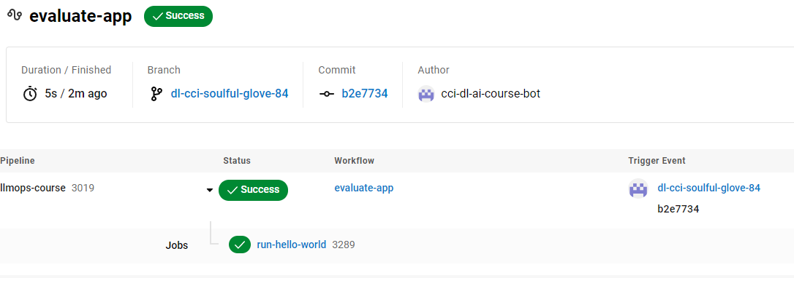
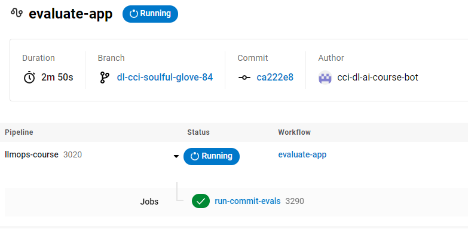
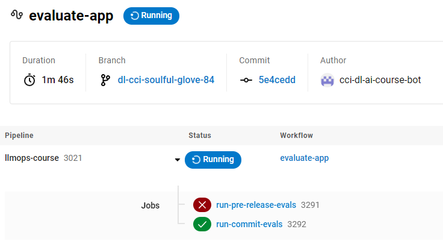
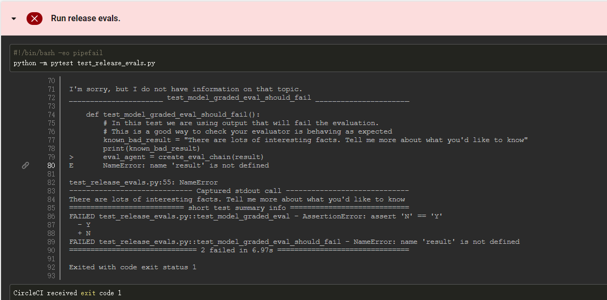
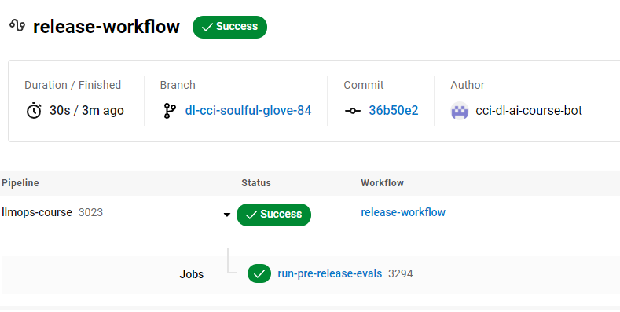
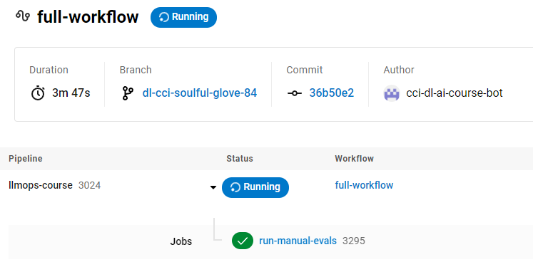

# Automated Testing for LLMOps


这是学习[https://www.deeplearning.ai/short-courses/automated-testing-llmops/](https://www.deeplearning.ai/short-courses/automated-testing-llmops/) 这门课的笔记

Learn how LLM-based testing differs from traditional software testing and implement rules-based testing to assess your LLM application.

Build model-graded evaluations to test your LLM application using an evaluation LLM.

Automate your evals (rules-based and model-graded) using continuous integration tools from CircleCI.

@[toc]

# Optional: Exploring the CircleCI config file

This step-by-step tutorial shows you  how to create a full CI/CD pipeline in CircleCI. However, before you start building this pipeline, you need to run the following setup:

```py
import warnings
warnings.filterwarnings('ignore')
```

## Load API tokens for our 3rd party APIs.

```py
from utils import get_circle_api_key
cci_api_key = get_circle_api_key()

from utils import get_gh_api_key
gh_api_key = get_gh_api_key()

from utils import get_openai_api_key
openai_api_key = get_openai_api_key()

```

### Set up our github branch

```PY
from utils import get_repo_name
course_repo = get_repo_name()
course_repo
```

Output：可以在github上搜索这个仓库

```py
'CircleCI-Learning/llmops-course'
```

我的分支如下：

```PY
from utils import get_branch
course_branch = get_branch()
course_branch
```

Output

```py
'dl-cci-lucky-puzzle-57'
```


## Basic CircleCI configuration structure

CircleCI uses configuration as code, so everything your pipeline does is stored in a [CircleCI configuration file](https://circleci.com/docs/config-intro/).

All CI/CD pipelines in CircleCI are defined in a single YAML file at the path `.circleci/config.yml` in your project's Git repository. This tutorial explains the example configuration file used throughout the course.

There are three key components to every CircleCI config file: **jobs**, **commands**, and **workflows**.


### Jobs

A [job](https://circleci.com/docs/jobs-steps/) is the basic unit of automation in a CircleCI CI/CD pipeline. Each job represents one of the  high-level tasks you want to automate, containing the commands you want to execute to complete the task.

Each job  is defined in its own configuration section. The example snippet below defines a job, including the [Docker image](https://circleci.com/docs/using-docker/) that will be used to execute this job. When CircleCI executes this job, a cloud execution environment is created on CircleCI’s infrastructure, running the specified Docker image.

Any commands defined in the job will be run in this environment (including bash commands, Python scripts, and any other command or application executed inside the job). There are many other execution environments — we’ll explore these later in this lesson.

Here is an example job named `run-hello-world` that spins up an execution environment based on the `cimg/python` Docker image and then prints “Hello World!” to the console. 

```py
!cat hello_world.yml
```

Output

```yaml
jobs:
  run-hello-world:  # This is the name of the job - feel free to change it to better match what you're trying to do!
    docker:
      - image: cimg/python:3.10.5
    steps:
      - run:
          name: Print Hello World
          command: echo "Hello World!"
```

Below, we have an entire config file that runs this job. This file uses other CircleCI configuration options that will be discussed later. For now, you can just focus on the `jobs` section at the bottom of this file.

```py
!cat circle_config_v1.yml
```

Output

```yaml
version: 2.1
orbs:
  python: circleci/python@2.1.1

parameters:
  eval-mode:
    type: string
    default: "commit"

workflows:
  evaluate-app:  # This is the name of the workflow - feel free to change it to better match your workflow.
    # Inside the workflow, you define the jobs you want to run.
    # For more details on extending your workflow, see the configuration docs: https://circleci.com/docs/2.0/configuration-reference/#workflows
    jobs:
      - run-hello-world:
          context:
            - dl-ai-courses

jobs:
  run-hello-world:  # This is the name of the job - feel free to change it to better match what you're trying to do!
    docker:
      - image: cimg/python:3.10.5
    steps:
      - run:
          name: Print Hello World
          command: echo "Hello World!"
          
```

You can trigger this job by interacting with the [CircleCI API](https://circleci.com/docs/api-intro/). This is done by calling the helper functions below defined in `utils.py`. After the workflow begins running successfully, a link will be provided to view the results. Note that it may take a few seconds for the APIs to finish executing.

```py
print(course_repo)
print(course_branch)
```


Output

```py
CircleCI-Learning/llmops-course
dl-cci-soulful-glove-84
```


```py
from utils import push_files
push_files(course_repo, 
           course_branch, 
           ["app.py", "test_assistant.py"],
           "circle_config_v1.yml"
          )

from utils import trigger_commit_evals
trigger_commit_evals(course_repo, 
                     course_branch, 
                     cci_api_key)
```

Output

```py
uploading test_assistant.py
uploading app.py
Please visit https://app.circleci.com/pipelines/github/CircleCI-Learning/llmops-course/3019
```

可以看到运行成功



### Commands

[Commands](https://circleci.com/docs/configuration-reference/#commands) are the individual steps executed in sequence inside of jobs. Commands can either be defined inline with the `run` keyword as we have done above, or created and named outside of jobs so that they can be used in multiple jobs. This second method of defining commands mimics the principle of DRY (don't repeat yourself) development, in which we create functions once and use them over and over.

When using the `run` keyword to define inline commands, the `name` field determines what you will see to identify the command in the CircleCI dashboard and the `command` field determines which command will be executed on the command line of the executor.

The example code below reworks the "Hello World" job to run the first type of eval that was covered in Lesson 2. Some additional required steps have been added as well: the [checkout](https://circleci.com/docs/configuration-reference/#checkout) step is a built-in CircleCI command that checks out the code from the repository containing the config file, while the `python/install-packages` step installs any Python packages included in `requirements.txt`.

The `python/install-packages` step is defined in the [Python orb](https://circleci.com/developer/orbs/orb/circleci/python) image we are using in this configuration. We'll go into more depth on orbs at the end of the tutorial.

```py
!cat circle_config_v2.yml
```


Output

```yaml
version: 2.1
orbs:
  python: circleci/python@2.1.1

parameters:
  eval-mode:
    type: string
    default: "commit"

workflows:
  evaluate-app:  # This is the name of the workflow - feel free to change it to better match your workflow.
    # Inside the workflow, you define the jobs you want to run.
    # For more details on extending your workflow, see the configuration docs: https://circleci.com/docs/2.0/configuration-reference/#workflows
    jobs:
      - run-commit-evals:
          context:
            - dl-ai-courses

jobs:
  run-commit-evals:  # This is the name of the job - feel free to change it to better match what you're trying to do!
    # These next lines define the Docker executor: https://circleci.com/docs/2.0/executor-types/
    # You can specify an image from Docker Hub or use one of the convenience images from CircleCI's Developer Hub
    # A list of available CircleCI Docker convenience images is available here: https://circleci.com/developer/images/image/cimg/python
    # The executor is the environment in which the steps below will be executed - below will use a Python 3.10 container
    # Change the version below to your required version of Python
    docker:
      - image: cimg/python:3.10.5
    # Check out the code as the first step. This is a dedicated CircleCI step.
    # The Python orb's install-packages step will install the dependencies from a Pipfile via Pipenv by default.
    # Here we're making sure we use just use the system-wide pip. By default it uses the project root's requirements.txt.
    # Then run your tests!
    # CircleCI will report the results back to your VCS provider.
    steps:
      - checkout
      - python/install-packages:
          pkg-manager: pip
          # app-dir: ~/project/package-directory/  # If your requirements.txt isn't in the root directory.
          # pip-dependency-file: test-requirements.txt  # if you have a different name for your requirements file, maybe one that combines your runtime and test requirements.
      - run:
          name: Run assistant evals.
          command: python -m pytest test_assistant.py
```

As you can see, this is running a Python unit test file `test_assistant.py` through Pytest instead of just echoing "Hello World". You can use the same `app.py` and `test_assistant.py` files that you used in the first lesson.

As in the previous example, this job can be triggered by interacting with the CircleCI API.


```py
from utils import push_files
push_files(course_repo, 
           course_branch, 
           ["app.py", "test_assistant.py"],
           "circle_config_v2.yml"
          )
          
from utils import trigger_commit_evals
trigger_commit_evals(course_repo, course_branch, cci_api_key)
```

Output

```py
uploading test_assistant.py
uploading app.py
dl-cci-soulful-glove-84 already exists in the repository pushing updated changes
Please visit https://app.circleci.com/pipelines/github/CircleCI-Learning/llmops-course/3020
```

circleci的结果



### Workflows

To run multiple types of evals, you need to define multiple jobs in your config file. You can use workflows in CircleCI to orchestrate these.

Put simply, a [workflow](https://circleci.com/docs/workflows/#overview) is used to orchestrate jobs. You can define multiple workflows that will run when you push to specific branches in your repository or run them on a schedule.  Workflows log their output to the [CircleCI dashboard](https://circleci.com/docs/introduction-to-the-circleci-web-app/), stopping when a job fails so that the output can be inspected.

Here's how you can add jobs for the other eval types into your workflow. Now, when the `evaluate-app` workflow is triggered, the `run-commit-evals` job **and** the new `run-pre-release-evals` job will be run. **Any number of jobs, containing any number of commands, can be defined and added to this workflow.**

```py
!cat circle_config_v3.yml
```

Output

```yaml
version: 2.1
orbs:
  # The Python orb contains a set of prepackaged CircleCI configurations you can use repeatedly in your configuration files
  python: circleci/python@2.1.1

parameters:
  eval-mode:
    type: string
    default: "commit"


workflows:
  evaluate-app:  # This is the name of the workflow - feel free to change it to better match your workflow.
    # Inside the workflow, you define the jobs you want to run.
    # For more details on extending your workflow, see the configuration docs: https://circleci.com/docs/2.0/configuration-reference/#workflows
    jobs:
      - run-commit-evals:
          context:
            - dl-ai-courses
      # Note: In a real application, you'd run these on commits to the main branch
      # for this course, we're using a parameter instead.
      - run-pre-release-evals:
          context:
            - dl-ai-courses

jobs:
  run-commit-evals:  # This is the name of the job - feel free to change it to better match what you're trying to do!
    # These next lines define the Docker executor: https://circleci.com/docs/2.0/executor-types/
    # You can specify an image from Docker Hub or use one of the convenience images from CircleCI's Developer Hub
    # A list of available CircleCI Docker convenience images is available here: https://circleci.com/developer/images/image/cimg/python
    # The executor is the environment in which the steps below will be executed - below will use a Python 3.10 container
    # Change the version below to your required version of Python
    docker:
      - image: cimg/python:3.10.5
    # Check out the code as the first step. This is a dedicated CircleCI step.
    # The Python orb's install-packages step will install the dependencies from a Pipfile via Pipenv by default.
    # Here we're making sure we use just use the system-wide pip. By default it uses the project root's requirements.txt.
    # Then run your tests!
    # CircleCI will report the results back to your VCS provider.
    steps:
      - checkout
      - python/install-packages:
          pkg-manager: pip
          # app-dir: ~/project/package-directory/  # If your requirements.txt isn't in the root directory.
          # pip-dependency-file: test-requirements.txt  # if you have a different name for your requirements file, maybe one that combines your runtime and test requirements.
      - run:
          name: Run assistant evals.
          command: python -m pytest test_assistant.py
  run-pre-release-evals:  # This is the name of the job - feel free to change it to better match what you're trying to do!
    # These next lines define the Docker executor: https://circleci.com/docs/2.0/executor-types/
    # You can specify an image from Docker Hub or use one of the convenience images from CircleCI's Developer Hub
    # A list of available CircleCI Docker convenience images is available here: https://circleci.com/developer/images/image/cimg/python
    # The executor is the environment in which the steps below will be executed - below will use a Python 3.10 container
    # Change the version below to your required version of Python
    docker:
      - image: cimg/python:3.10.5
    # Check out the code as the first step. This is a dedicated CircleCI step.
    # The Python orb's install-packages step will install the dependencies from a Pipfile via Pipenv by default.
    # Here we're making sure we use just use the system-wide pip. By default it uses the project root's requirements.txt.
    # Then run your tests!
    # CircleCI will report the results back to your VCS provider.

    steps:
      - checkout
      - python/install-packages:
          pkg-manager: pip
          # app-dir: ~/project/package-directory/  # If your requirements.txt isn't in the root directory.
          # pip-dependency-file: test-requirements.txt  # if you have a different name for your requirements file, maybe one that combines your runtime and test requirements.
      - run:
          name: Run release evals.
          command: python -m pytest test_release_evals.py
```

You can trigger the workflow again with the code below. By default the two jobs will run in parallel. Later we will show how you can adjust the workflow to make the jobs run in series or based on certain conditions.

**We have intentionally inserted a bug into `test_release_evals.py` so you can see what the output looks like when one of your tests fails.** You can see the output from the error by clicking on the failed job and scrolling down to the step that generated the error.

```py
from utils import push_files
push_files(course_repo, 
           course_branch, 
           ["app.py", "test_assistant.py", "test_release_evals.py"],
           config="circle_config_v3.yml"
          )
          
from utils import trigger_commit_evals
trigger_commit_evals(course_repo, 
                     course_branch, 
                     cci_api_key)
```

Output

```py
uploading test_assistant.py
uploading test_release_evals.py
uploading app.py
dl-cci-soulful-glove-84 already exists in the repository pushing updated changes

Please visit https://app.circleci.com/pipelines/github/CircleCI-Learning/llmops-course/3021
```

circleci的结果：可以看到有一个job运行失败




具体错误原因如下所示




## Enhancing your CircleCI configuration file

Jobs, commands, and workflows are key components of every CircleCI pipeline. However, there are many additional features within CircleCI that you can take advantage of to better orchestrate（编排） the flow of jobs.

### Conditional workflows

You can also execute different workflows on different conditions with [conditional workflows](https://circleci.com/docs/pipeline-variables/#conditional-workflows). Conditional workflows allow you to use if-statement logic in your CircleCI configuration.

For example, you might want to run the pre-commit evals whenever there is a push to your dev branches and the pre-release evals when there is a push to your main branch. In this configuration, we’ll show you how to conditionally execute different workflows by passing in [pipeline parameters](https://circleci.com/docs/pipeline-variables/#pipeline-parameters-in-configuration) to our workflows. However, you could also execute different workflows based on [pipeline values](https://circleci.com/docs/pipeline-variables/#pipeline-values) like `pipeline.git.branch`.

With pipeline parameters, you can define parameters for your configuration and change them in your application through [CircleCI’s API](https://circleci.com/docs/pipeline-variables/#passing-parameters-when-triggering-pipelines-via-the-api). The `utils.py` file in this example is used to pass in different `eval-mode` parameters based on this.


```py
# utils.py
def _trigger_circle_pipline(repo_name, branch, token, params=None):
    params = {} if params is None else params
    r = requests.post(
        f"{os.getenv('DLAI_CIRCLE_CI_API_BASE', 'https://circleci.com')}/api/v2/project/gh/{repo_name}/pipeline",
        headers={"Circle-Token": f"{token}", "accept": "application/json"},
        json={"branch": branch, "parameters": params},
    )
    pipeline_data = r.json()
    pipeline_number = pipeline_data["number"]
    print(
        f"Please visit https://app.circleci.com/pipelines/github/{repo_name}/{pipeline_number}"
    )


def trigger_commit_evals(repo_name, branch, token):
    _trigger_circle_pipline(repo_name, branch, token, {"eval-mode": "commit"})


def trigger_release_evals(repo_name, branch, token):
    _trigger_circle_pipline(repo_name, branch, token, {"eval-mode": "release"})

def trigger_full_evals(repo_name, branch, token):
    _trigger_circle_pipline(repo_name, branch, token, {"eval-mode": "full"})

```

The CircleCI configuration snippet below runs different workflows based on the current `eval-mode`.

```py
!cat circle_config_v4.yml
```

Output

```yaml
version: 2.1
orbs:
  # The Python orb contains a set of prepackaged CircleCI configurations you can use repeatedly in your configuration files
  python: circleci/python@2.1.1

parameters:
  eval-mode:
    type: string
    default: "commit"

workflows:
  commit-workflow:  # This is the name of the workflow - feel free to change it to better match your workflow.
    # Inside the workflow, you define the jobs you want to run.
    # For more details on extending your workflow, see the configuration docs: https://circleci.com/docs/2.0/configuration-reference/#workflows
    when:
      and:
        - equal: [ commit, << pipeline.parameters.eval-mode >> ]
    jobs:
      - run-commit-evals:
          context:
            - dl-ai-courses
  release-workflow:  # This is the name of the workflow - feel free to change it to better match your workflow.
    # Inside the workflow, you define the jobs you want to run.
    # For more details on extending your workflow, see the configuration docs: https://circleci.com/docs/2.0/configuration-reference/#workflows
    when:
      and:
        - equal: [ release, << pipeline.parameters.eval-mode >> ]
    jobs:
      # Note: In a real application, you'd run these on commits to the main branch
      # for this course, we're using a parameter instead.
      - run-pre-release-evals:
          context:
            - dl-ai-courses
  full-workflow:  # This is the name of the workflow - feel free to change it to better match your workflow.
    # Inside the workflow, you define the jobs you want to run.
    # For more details on extending your workflow, see the configuration docs: https://circleci.com/docs/2.0/configuration-reference/#workflows
    when:
      and:
        - equal: [ full, << pipeline.parameters.eval-mode >> ]
    jobs:
      - run-manual-evals:
          context:
            - dl-ai-courses

jobs:
  run-commit-evals:  # This is the name of the job - feel free to change it to better match what you're trying to do!
    # These next lines define the Docker executor: https://circleci.com/docs/2.0/executor-types/
    # You can specify an image from Docker Hub or use one of the convenience images from CircleCI's Developer Hub
    # A list of available CircleCI Docker convenience images is available here: https://circleci.com/developer/images/image/cimg/python
    # The executor is the environment in which the steps below will be executed - below will use a Python 3.10 container
    # Change the version below to your required version of Python
    docker:
      - image: cimg/python:3.10.5
    # Check out the code as the first step. This is a dedicated CircleCI step.
    # The Python orb's install-packages step will install the dependencies from a Pipfile via Pipenv by default.
    # Here we're making sure we use just use the system-wide pip. By default it uses the project root's requirements.txt.
    # Then run your tests!
    # CircleCI will report the results back to your VCS provider.
    steps:
      - checkout
      - python/install-packages:
          pkg-manager: pip
          # app-dir: ~/project/package-directory/  # If your requirements.txt isn't in the root directory.
          # pip-dependency-file: test-requirements.txt  # if you have a different name for your requirements file, maybe one that combines your runtime and test requirements.
      - run:
          name: Run assistant evals.
          command: python -m pytest test_assistant.py
  run-pre-release-evals:  # This is the name of the job - feel free to change it to better match what you're trying to do!
    # These next lines define the Docker executor: https://circleci.com/docs/2.0/executor-types/
    # You can specify an image from Docker Hub or use one of the convenience images from CircleCI's Developer Hub
    # A list of available CircleCI Docker convenience images is available here: https://circleci.com/developer/images/image/cimg/python
    # The executor is the environment in which the steps below will be executed - below will use a Python 3.10 container
    # Change the version below to your required version of Python
    docker:
      - image: cimg/python:3.10.5
    # Check out the code as the first step. This is a dedicated CircleCI step.
    # The Python orb's install-packages step will install the dependencies from a Pipfile via Pipenv by default.
    # Here we're making sure we use just use the system-wide pip. By default it uses the project root's requirements.txt.
    # Then run your tests!
    # CircleCI will report the results back to your VCS provider.

    steps:
      - checkout
      - python/install-packages:
          pkg-manager: pip
          # app-dir: ~/project/package-directory/  # If your requirements.txt isn't in the root directory.
          # pip-dependency-file: test-requirements.txt  # if you have a different name for your requirements file, maybe one that combines your runtime and test requirements.
      - run:
          name: Run release evals.
          command: echo "Run our pre-release model graded evals here."
  run-manual-evals: 
    docker:
      - image: cimg/python:3.10.5
    steps:
      - checkout
      - python/install-packages:
          pkg-manager: pip
          # app-dir: ~/project/package-directory/  # If your requirements.txt isn't in the root directory.
          # pip-dependency-file: test-requirements.txt  # if you have a different name for your requirements file, maybe one that combines your runtime and test requirements.
      - run:
          name: Run end to end evals.
          command: echo "Run our full eval suite here."
```

This conditional workflow can be triggered with the commands below. We expect the `commit-workflow` to pass.

```py
from utils import push_files
push_files(course_repo, 
           course_branch, 
           ["app.py", "test_assistant.py", "test_release_evals.py"],
           config="circle_config_v4.yml"
          )

from utils import trigger_commit_evals
trigger_commit_evals(course_repo, 
                     course_branch, 
                     cci_api_key)
```

Output

```py
uploading test_assistant.py
uploading test_release_evals.py
uploading app.py
dl-cci-soulful-glove-84 already exists in the repository pushing updated changes

Please visit https://app.circleci.com/pipelines/github/CircleCI-Learning/llmops-course/3022
```


For this optional lesson, we have implemented placeholder commands for pre-release and manual evals. We are including them to show an example of how to trigger different conditional behavior in workflows using the API.

To learn how to implement model graded evals and run them directly as part of the CI pipeline, please visit lesson 3 of this course. 

```py
from utils import trigger_release_evals
trigger_release_evals(course_repo, 
                      course_branch, 
                      cci_api_key)
```

Output



```py
from utils import trigger_full_evals
trigger_full_evals(course_repo, 
                   course_branch, 
                   cci_api_key)
```

Output



### Scheduled workflows

So far, all of these workflows have been triggered whenever a commit is made to a Git repository, which is typical for continuous integration. However, you might want to schedule your more comprehensive evals to run on a regular schedule for continuous delivery or deployment. This can be done with [scheduled workflows](https://circleci.com/docs/workflows/#scheduling-a-workflow).

For example, you could set up a nightly trigger to run a certain workflow by providing a standard `cron` syntax:

```py
!cat circle_config_v5.yml
```

Output

```yaml
version: 2.1
orbs:
  # The Python orb contains a set of prepackaged CircleCI configurations you can use repeatedly in your configuration files
  python: circleci/python@2.1.1

parameters:
  eval-mode:
    type: string
    default: "commit"

workflows:
  evaluate-app:  # This is the name of the workflow - feel free to change it to better match your workflow.
    # Trigger every day at midnight using the main branch's configurations
    triggers:
      - schedule:
          cron: "0 0 * * *" # Daily at midnight
          filters:
            branches:
              only:
                - main
    # Inside the workflow, you define the jobs you want to run.
    # For more details on extending your workflow, see the configuration docs: https://circleci.com/docs/2.0/configuration-reference/#workflows
    jobs:
      - run-commit-evals:
          context:
            - dl-ai-courses
      # Note: In a real application, you'd run these on commits to the main branch
      # for this course, we're using a parameter instead.
      - run-pre-release-evals:
          context:
            - dl-ai-courses

jobs:
  run-commit-evals:  # This is the name of the job - feel free to change it to better match what you're trying to do!
    # These next lines define the Docker executor: https://circleci.com/docs/2.0/executor-types/
    # You can specify an image from Docker Hub or use one of the convenience images from CircleCI's Developer Hub
    # A list of available CircleCI Docker convenience images is available here: https://circleci.com/developer/images/image/cimg/python
    # The executor is the environment in which the steps below will be executed - below will use a Python 3.10 container
    # Change the version below to your required version of Python
    docker:
      - image: cimg/python:3.10.5
    # Check out the code as the first step. This is a dedicated CircleCI step.
    # The Python orb's install-packages step will install the dependencies from a Pipfile via Pipenv by default.
    # Here we're making sure we use just use the system-wide pip. By default it uses the project root's requirements.txt.
    # Then run your tests!
    # CircleCI will report the results back to your VCS provider.
    steps:
      - checkout
      - python/install-packages:
          pkg-manager: pip
          # app-dir: ~/project/package-directory/  # If your requirements.txt isn't in the root directory.
          # pip-dependency-file: test-requirements.txt  # if you have a different name for your requirements file, maybe one that combines your runtime and test requirements.
      - run:
          name: Run assistant evals.
          command: python -m pytest test_assistant.py
  run-pre-release-evals:  # This is the name of the job - feel free to change it to better match what you're trying to do!
    # These next lines define the Docker executor: https://circleci.com/docs/2.0/executor-types/
    # You can specify an image from Docker Hub or use one of the convenience images from CircleCI's Developer Hub
    # A list of available CircleCI Docker convenience images is available here: https://circleci.com/developer/images/image/cimg/python
    # The executor is the environment in which the steps below will be executed - below will use a Python 3.10 container
    # Change the version below to your required version of Python
    docker:
      - image: cimg/python:3.10.5
    # Check out the code as the first step. This is a dedicated CircleCI step.
    # The Python orb's install-packages step will install the dependencies from a Pipfile via Pipenv by default.
    # Here we're making sure we use just use the system-wide pip. By default it uses the project root's requirements.txt.
    # Then run your tests!
    # CircleCI will report the results back to your VCS provider.

    steps:
      - checkout
      - python/install-packages:
          pkg-manager: pip
          # app-dir: ~/project/package-directory/  # If your requirements.txt isn't in the root directory.
          # pip-dependency-file: test-requirements.txt  # if you have a different name for your requirements file, maybe one that combines your runtime and test requirements.
      - run:
          name: Run release evals.
          command: echo "We will write model graded evals here."
```


## Some other features we've used

Throughout this tutorial, we have used other features of CircleCI as well, although we didn't focus on them as much. Despite this, each of the following features are key to building a functional CI/CD pipeline.

### Execution environments

CircleCI provides many different options for [execution environments](https://circleci.com/docs/executor-intro/), including Docker images, Linux VMs, MacOS VMs, Windows VMs, GPU executors, and even [self-hosted runners](https://circleci.com/docs/runner-overview/) to run jobs on your own infrastructure.

You can also run different jobs in the same workflow **on different machines**. Some example use cases for this would be using more expensive and specialized cloud-based GPU executors to train ML models or deploying applications to your own infrastructure after testing them on cloud infrastructure.

### Orbs

[Orbs](https://circleci.com/developer/orbs) are shareable packages of CircleCI configurations, similar to libraries or packages in conventional software development. CircleCI supports certified orbs, community orbs, and private orbs to bring the same advantages of libraries for product development to configuration development.

### Contexts

Security is paramount for any application. You shouldn't include credentials and other sensitive information (known as secrets) in your CircleCI configuration file, as it will be committed to your code repositories where it can potentially be exposed.

[Contexts](https://circleci.com/docs/contexts/#create-and-use-a-context) allow you to securely store certain credentials in one centralized location on CircleCI's infrastructure for access during certain workflows.

For this tutorial, you can see that we've been using the `dl-ai-courses` context, which contains various API keys for LangSmith, OpenAI, and other tools required for this tutorial.

## Building out your AI application and workflows

We've covered the major features of CircleCI that you can use to build this pipeline and similar ones as well. However, we've only scratched the surface. You can check out [CircleCI's documentation](https://circleci.com/docs/configuration-reference/) to see more advanced features and use cases.

