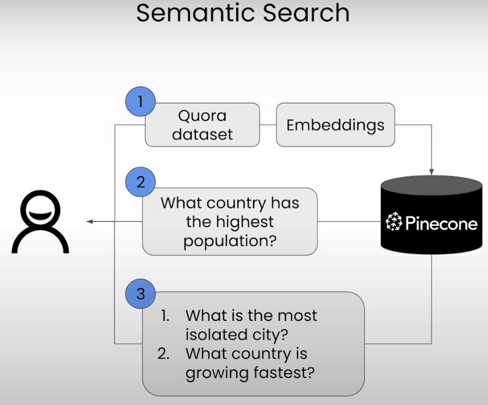

# Building Applications with Vector Databases


下面是这门课的学习笔记：[https://www.deeplearning.ai/short-courses/building-applications-vector-databases/](https://www.deeplearning.ai/short-courses/building-applications-vector-databases/)

Learn to create six exciting applications of vector databases and implement them using Pinecone.

Build a hybrid search app that combines both text and images for improved multimodal search results.

Learn how to build an app that measures and ranks facial similarity.


ChatGPT对Pinecone的介绍

Pinecone 是一个专门用于快速高效地进行向量索引和检索的托管服务。它主要用于存储和查询大规模的向量数据，例如文本嵌入、图像特征等。Pinecone 提供了一个简单易用的 API，使开发人员能够轻松地构建和部署基于向量的应用程序，而无需担心底层的基础架构。

使用 Pinecone，开发人员可以将向量数据加载到 Pinecone 的索引中，然后通过查询接口快速地检索相似向量。这种快速检索的能力使 Pinecone 在许多应用场景下都非常有用，如推荐系统、相似性搜索、聚类分析等。

总的来说，Pinecone 提供了一个高性能、可扩展且易于使用的平台，使开发人员能够利用向量数据来构建更智能和响应更快的应用程序。


## Lesson 1 - Semantic Search

相似语义检索：检索相似的问题




requirements.txt

```python
# requirements file
# note which revision of python, for example 3.9.6
# in this file, insert all the pip install needs, include revision

#for example:
#torch==2.0.1
#matplotlib==3.7.2

python-dotenv==1.0.0

numpy==1.25.2
pandas==2.1.3
scikit-learn==1.3.2
sentence-transformers==2.2.2
matplotlib==3.8.2
torch==2.1.1

langchain==0.0.346
openai==0.28.1 ## From the notebooks

pinecone-client==3.0.0dev4
pinecone-datasets==0.5.0rc11
pinecone-text==0.7.1

tiktoken==0.5.2
tqdm==4.66.1

datasets==2.15.0
deepface==0.0.79
```

### Import the Needed Packages


```python
import warnings
warnings.filterwarnings('ignore')
from datasets import load_dataset
from sentence_transformers import SentenceTransformer
from pinecone import Pinecone, ServerlessSpec
from DLAIUtils import Utils
import DLAIUtils

import os
import time
import torch
from tqdm.auto import tqdm
```

其中DLAIUtils.py文件如下所示：

```python
import os
import sys
from dotenv import load_dotenv, find_dotenv

class Utils:
  def __init__(self):
    pass
  
  def create_dlai_index_name(self, index_name):
    openai_key = ''
    if self.is_colab(): # google colab
      from google.colab import userdata
      openai_key = userdata.get("OPENAI_API_KEY")
    else: # jupyter notebook
      openai_key = os.getenv("OPENAI_API_KEY")
    return f'{index_name}-{openai_key[-36:].lower().replace("_", "-")}'
    
  def is_colab(self):
    return 'google.colab' in sys.modules

  def get_openai_api_key(self):
    _ = load_dotenv(find_dotenv())
    return os.getenv("OPENAI_API_KEY")
    
  def get_pinecone_api_key(self):
    _ = load_dotenv(find_dotenv())
    return os.getenv("PINECONE_API_KEY")

```


### Load the Dataset

```python
dataset = load_dataset('quora', split='train[240000:290000]')
dataset[:5]
```

output

```json
{'questions': [{'id': [207550, 351729],
   'text': ['What is the truth of life?', "What's the evil truth of life?"]},
  {'id': [33183, 351730],
   'text': ['Which is the best smartphone under 20K in India?',
    'Which is the best smartphone with in 20k in India?']},
  {'id': [351731, 351732],
   'text': ['Steps taken by Canadian government to improve literacy rate?',
    'Can I send homemade herbal hair oil from India to US via postal or private courier services?']},
  {'id': [37799, 94186],
   'text': ['What is a good way to lose 30 pounds in 2 months?',
    'What can I do to lose 30 pounds in 2 months?']},
  {'id': [351733, 351734],
   'text': ['Which of the following most accurately describes the translation of the graph y = (x+3)^2 -2 to the graph of y = (x -2)^2 +2?',
    'How do you graph x + 2y = -2?']}],
 'is_duplicate': [False, True, False, True, False]}
```

把问题都保存在questions列表中

```python
questions = []
for record in dataset['questions']:
    questions.extend(record['text'])
question = list(set(questions))
print('\n'.join(questions[:10]))
print('-' * 50)
print(f'Number of questions: {len(questions)}')
```

1. `question = list(set(questions))`: 使用 `set()` 函数去除 `questions` 列表中的重复项，然后将其转换为集合。再将集合转换回列表，得到一个去重后的问题列表，存储在 `question` 变量中。
2. `print('\n'.join(questions[:10]))`: 将去重前的前十个问题打印出来，`join()` 函数用于将列表中的元素连接成一个字符串，并使用换行符 `\n` 分隔。

Output：输出前10个问题

```python
What is the truth of life?
What's the evil truth of life?
Which is the best smartphone under 20K in India?
Which is the best smartphone with in 20k in India?
Steps taken by Canadian government to improve literacy rate?
Can I send homemade herbal hair oil from India to US via postal or private courier services?
What is a good way to lose 30 pounds in 2 months?
What can I do to lose 30 pounds in 2 months?
Which of the following most accurately describes the translation of the graph y = (x+3)^2 -2 to the graph of y = (x -2)^2 +2?
How do you graph x + 2y = -2?
--------------------------------------------------
Number of questions: 100000
```

### Check cuda and Setup the model

**Note**: "Checking cuda" refers to checking if you have access to GPUs (faster compute). In this course, we are using CPUs. So, you might notice some code cells taking a little longer to run.

We are using *all-MiniLM-L6-v2* sentence-transformers model that maps sentences to a 384 dimensional dense vector space.

```python
device = 'cuda' if torch.cuda.is_available() else 'cpu'
if device != 'cuda':
    print('Sorry no cuda.')
model = SentenceTransformer('all-MiniLM-L6-v2', device=device)
```

这行代码使用了 SentenceTransformer 库中的 `SentenceTransformer` 类来加载一个预训练的文本嵌入模型。具体地，它加载了一个名为 'all-MiniLM-L6-v2' 的预训练模型，并指定了一个设备（可能是 GPU 或 CPU）来运行模型。

通过加载这个预训练的文本嵌入模型，可以将文本转换为高维向量表示，这些向量可以用于各种自然语言处理任务，如文本相似度计算、文本分类、聚类等。

```python
query = 'which city is the most populated in the world?'
xq = model.encode(query)
xq.shape
```

Output维度为384维

```python
(384,)
```

### Setup Pinecone

```python
utils = Utils()
PINECONE_API_KEY = utils.get_pinecone_api_key()
pinecone = Pinecone(api_key=PINECONE_API_KEY)
INDEX_NAME = utils.create_dlai_index_name('dl-ai')

if INDEX_NAME in [index.name for index in pinecone.list_indexes()]:
    pinecone.delete_index(INDEX_NAME)
print(INDEX_NAME)
pinecone.create_index(name=INDEX_NAME, 
    dimension=model.get_sentence_embedding_dimension(), 
    metric='cosine',
    spec=ServerlessSpec(cloud='aws', region='us-west-2'))

index = pinecone.Index(INDEX_NAME)
print(index)
```

这段代码使用 Pinecone 库中的 `create_index()` 函数创建了一个新的索引。下面是对每个参数的解释：

- `name=INDEX_NAME`: 这个参数指定了要创建的索引的名称。`INDEX_NAME` 是一个变量，用于存储索引的名称。

- `dimension=model.get_sentence_embedding_dimension()`: 这个参数指定了向量的维度。在这里，使用了一个叫做 `model` 的对象的 `get_sentence_embedding_dimension()` 方法来获取向量的维度。这通常是一个预训练模型返回的嵌入向量的维度。

- `metric='cosine'`: 这个参数指定了用于衡量向量相似性的距离度量。在这里，使用的是余弦相似度作为度量标准，它用于衡量两个向量之间的夹角余弦值，常用于文本和图像等嵌入向量的相似性比较。

- `spec=ServerlessSpec(cloud='aws', region='us-west-2')`: 这个参数指定了索引的部署规格，即在哪个云提供商的哪个地区部署索引。在这里，使用了一个名为 `ServerlessSpec` 的规格对象，其中 `cloud` 参数指定了云提供商，这里是 AWS，`region` 参数指定了部署的地区，这里是美国西部的 us-west-2 区域。

总的来说，这段代码创建了一个新的 Pinecone 索引，指定了索引的名称、向量维度、相似性度量和部署规格。

Output

```python
dl-ai-z7nf9tjs3lswddk6jinpkrukpb7cjfq0mwts
<pinecone.data.index.Index object at 0x7ff8e7697970>
```

### Create Embeddings and Upsert to Pinecone

```python
batch_size=200
vector_limit=10000

questions = question[:vector_limit] # 从问题列表中选择前 10000 个问题

import json
# 使用 tqdm 函数创建一个进度条，循环处理问题列表中的每个批次，每次处理 batch_size 个问题
for i in tqdm(range(0, len(questions), batch_size)): 
    # find end of batch
    i_end = min(i+batch_size, len(questions))
    # create IDs batch
    ids = [str(x) for x in range(i, i_end)]
    # create metadata batch
    metadatas = [{'text': text} for text in questions[i:i_end]] # 每个元数据包含一个问题的文本信息
    # create embeddings
    xc = model.encode(questions[i:i_end]) #  使用预训练的模型将当前批次的问题文本转换为嵌入向量。
    # create records list for upsert
    records = zip(ids, xc, metadatas) # `zip()` 函数将 `ids`、`xc` 和 `metadatas` 中对应位置的元素组合成一个元组
    # upsert to Pinecone
    index.upsert(vectors=records)
```

解释zip函数

`zip()` 函数是 Python 中的一个内置函数，它接受任意数量的可迭代对象作为参数，并返回一个由这些可迭代对象的元素组成的元组序列，同时会截断到最短的可迭代对象的长度。

下面是 `zip()` 函数的基本语法：
```
zip(iterable1, iterable2, ...)
```

- `iterable1`, `iterable2`, ...：表示一个或多个可迭代对象，比如列表、元组、集合等。

`zip()` 函数会将每个可迭代对象中相同位置的元素组合成一个元组，然后返回一个由这些元组组成的迭代器。

例如：
```python
list1 = [1, 2, 3]
list2 = ['a', 'b', 'c']
result = zip(list1, list2)
print(list(result))
```

输出结果为：
```
[(1, 'a'), (2, 'b'), (3, 'c')]
```

在给定的示例中：
```python
records = zip(ids, xc, metadatas)
```

`zip()` 函数将 `ids`、`xc` 和 `metadatas` 中对应位置的元素组合成一个元组，并返回一个由这些元组组成的迭代器。这样可以方便地将多个列表中对应位置的元素一起处理，通常用于迭代处理多个列表或集合。


```python
index.describe_index_stats()
```

Output

```python
index.describe_index_stats()
{'dimension': 384,
 'index_fullness': 0.0,
 'namespaces': {'': {'vector_count': 10000}},
 'total_vector_count': 10000}
```


### Run Your Query

```python
# small helper function so we can repeat queries later
def run_query(query):
  embedding = model.encode(query).tolist()
  results = index.query(top_k=10, vector=embedding, include_metadata=True, include_values=False)
  for result in results['matches']:
    print(f"{round(result['score'], 2)}: {result['metadata']['text']}")
```


测试run_query：输出10条最相近的问题

```python
run_query('which city has the highest population in the world?')
```

Output

```python
0.67: Which city in the world is the most beautiful to live in?
0.62: How many cities are on Earth?
0.58: Which country has the highest per capita income?
0.55: What is the recent population of India?
0.54: What is the most remote place in the world?
0.54: What are the largest slums in the world?
0.53: What is the least known country in the world?
0.53: Which is the coldest country in the world?
0.52: Which are the worst cities of India?
0.49: Which are the most dangerous places on the earth to live? Why?
```

另一个query进行测试

```python
query = 'how do i make chocolate cake?'
run_query(query)
```

Output

```python
0.58: What's a good recipe for cake featuring Ciroc?
0.56: How do you bake cakes in a convection oven?
0.55: How do I bake a cake in a microwave oven?
0.54: How do you make homemade frosting without powdered sugar?
0.54: How do you make a crispy batter?
0.53: How do you make a perfume out of Skittles?
0.49: What is the difference between chocolate and truffles?
0.49: How can I make a banana pudding without bananas?
0.46: Where can I get custom decorated cakes for any occasion at Gold Coast?
0.46: How can one make the Mint Mojito coffee at home similar to the one at Phillz?
```