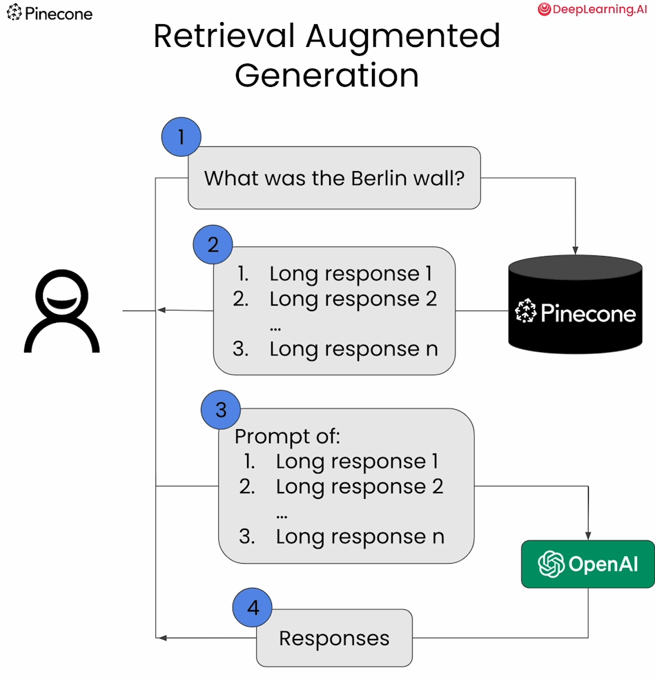
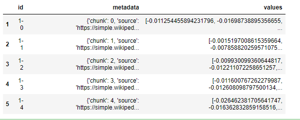

# Building Applications with Vector Databases


下面是这门课的学习笔记：[https://www.deeplearning.ai/short-courses/building-applications-vector-databases/](https://www.deeplearning.ai/short-courses/building-applications-vector-databases/)

Learn to create six exciting applications of vector databases and implement them using Pinecone.

Build a hybrid search app that combines both text and images for improved multimodal search results.

Learn how to build an app that measures and ranks facial similarity.

# Lesson 2 - Retrieval Augmented Generation (RAG)

使用Pinecone（将维基百科的文档添加到向量库中）和OpenAI的API（gpt-3.5-turbo-instruct）来进行检索增强，生成更好的答案。



### Import  the Needed Packages

```python
import warnings
warnings.filterwarnings('ignore')
from datasets import load_dataset
from openai import OpenAI
from pinecone import Pinecone, ServerlessSpec # 用于指定索引部署的服务器规格
from tqdm.auto import tqdm
from DLAIUtils import Utils

import ast
import os
import pandas as pd

```


get api key, 这是deeplearning.ai封装好的函数utils

```python
# get api key
utils = Utils()
PINECONE_API_KEY = utils.get_pinecone_api_key()
```

### Setup Pinecone


```python
pinecone = Pinecone(api_key=PINECONE_API_KEY)

utils = Utils()
INDEX_NAME = utils.create_dlai_index_name('dl-ai')
if INDEX_NAME in [index.name for index in pinecone.list_indexes()]:
  pinecone.delete_index(INDEX_NAME)

pinecone.create_index(name=INDEX_NAME, dimension=1536, metric='cosine',
  spec=ServerlessSpec(cloud='aws', region='us-west-2'))

index = pinecone.Index(INDEX_NAME)
```

### Load the Dataset

<p style="background-color:#fff1d7; padding:15px; "> <b>(Note: <code>max_articles_num = 500</code>):</b> To achieve a more comprehensive context for the Language Learning Model, a larger number of articles is generally more beneficial. In this lab, we've initially set <code>max_articles_num</code> to 500 for speedier results, allowing you to observe the outcomes faster. Once you've done an initial run, consider increasing this value to 750 or 1,000. You'll likely notice that the context provided to the LLM becomes richer and better. You can experiment by gradually raising this variable for different queries to observe the improvements in the LLM's contextual understanding.</p>


```python
max_articles_num = 500
df = pd.read_csv('./data/wiki.csv', nrows=max_articles_num)
df.head()

```

Output



### Prepare the Embeddings and Upsert to Pinecone

```python
prepped = []

for i, row in tqdm(df.iterrows(), total=df.shape[0]):
    meta = ast.literal_eval(row['metadata']) # 转换为 Python 对象
    prepped.append({'id':row['id'], 
                    'values':ast.literal_eval(row['values']), 
                    'metadata':meta})  # 字典
    if len(prepped) >= 250:
        index.upsert(prepped) # 插入到pinecone索引中
        prepped = []

```

这段代码的作用是将 DataFrame (`df`) 中的数据批量预处理，并将预处理后的数据插入到 Pinecone 索引中。让我们逐行解释代码：

1. `prepped = []`: 创建一个空列表 `prepped`，用于存储预处理后的数据。

2. `for i, row in tqdm(df.iterrows(), total=df.shape[0]):`: 使用 `iterrows()` 方法遍历 DataFrame (`df`) 中的每一行数据，并使用 `tqdm()` 函数创建一个进度条来显示处理进度。`total=df.shape[0]` 用于指定总共要处理的行数。

3. `meta = ast.literal_eval(row['metadata'])`: 从当前行中获取 'metadata' 列的值，并使用 `ast.literal_eval()` 函数将其转换为 Python 对象。这个列通常包含一些元数据信息。

4. `prepped.append({'id':row['id'], 'values':ast.literal_eval(row['values']), 'metadata':meta})`: 将当前行的 'id'、'values' 和 'metadata' 列的值以字典形式添加到 `prepped` 列表中。`ast.literal_eval()` 函数用于安全地将字符串形式的 Python 表达式转换为对应的对象。

5. `if len(prepped) >= 250:`: 检查 `prepped` 列表的长度是否达到了 250。如果达到了，则执行下面的操作。

6. `index.upsert(prepped)`: 将 `prepped` 列表中的数据批量插入到 Pinecone 索引中。`upsert()` 方法用于向索引中添加或更新数据。

7. `prepped = []`: 将 `prepped` 列表重置为空，以便存储下一个批次的预处理数据。

总的来说，这段代码对 DataFrame 中的数据进行了逐行处理，将每一行数据转换成包含 'id'、'values' 和 'metadata' 字段的字典，然后将这些字典组成的列表批量插入到 Pinecone 索引中。

```python
index.describe_index_stats()
```

Output

```python
{'dimension': 1536,
 'index_fullness': 0.0,
 'namespaces': {'': {'vector_count': 500}},
 'total_vector_count': 500}
```

### Connect to OpenAI

```python
OPENAI_API_KEY = utils.get_openai_api_key() # 具体函数实现见笔记1
openai_client = OpenAI(api_key=OPENAI_API_KEY)

def get_embeddings(articles, model="text-embedding-ada-002"):
   return openai_client.embeddings.create(input = articles, model=model)
```

### Run Your Query

```python
query = "what is the berlin wall?"

embed = get_embeddings([query])
res = index.query(vector=embed.data[0].embedding, top_k=3, include_metadata=True)
text = [r['metadata']['text'] for r in res['matches']]
print('\n'.join(text))

```

对上文`text = [r['metadata']['text'] for r in res['matches']]`中r的解释：

在上述代码中，`r` 表示查询结果中的每个匹配项。让我们用一个示例来说明其作用。

假设我们有一个文本嵌入索引，其中包含了一些城市的文本描述以及对应的嵌入向量。当我们对这个索引进行查询时，我们得到了一些与查询向量最相似的匹配项。

例如，假设我们的索引中有以下一些匹配项：
```
[{'vector': [0.1, 0.2, 0.3], 'metadata': {'city': 'Berlin', 'text': 'Berlin is the capital of Germany.'}},
 {'vector': [0.2, 0.3, 0.4], 'metadata': {'city': 'Paris', 'text': 'Paris is the capital of France.'}},
 {'vector': [0.3, 0.4, 0.5], 'metadata': {'city': 'London', 'text': 'London is the capital of the United Kingdom.'}}]
```

在这个例子中，`r` 表示查询结果中的每个匹配项。每个匹配项都是一个字典，包含了向量 (`vector`) 和元数据 (`metadata`) 两个键。`metadata` 中包含了与匹配项相关的元数据信息，比如城市名称和文本描述。

如果我们想要提取每个匹配项的文本描述，我们可以通过访问 `r['metadata']['text']` 来获取，这样就能得到每个匹配项的文本描述。


Output

```python
Egon Krenz was elected by the politburo to be Honecker's successor. Krenz tried to show that he was looking for change within the GDR but the citizens did not trust him. On November 9, 1989, the SED announced that East Germans would be able to travel to West Berlin the next day. The spokesman who announced the new travel law incorrectly said that it would take effect immediately, implying the Berlin Wall would open that night. People began to gather at border checkpoints at the wall hoping to be let through, but the guards told them that they had no orders to let citizens through. As the number of people grew, the guards became alarmed and tried to contact their superiors but had no responses. Unwilling to use force, the chief guard at the checkpoint relented at 10:54pm and ordered the gate to be opened. Thousands of East-Germans swarmed into West Berlin and the purpose of the wall was deemed now obsolete. The fall of the wall destroyed the SED politically as well as the career of its leader, Egon Krenz. On December 1, 1989, the GDR government revoked the law that guaranteed the SED the right to rule the East German political system, effectively ending communist rule in the GDR.

On 18 March 1990, there were free elections in the GDR. The "Alliance for Germany", a group of political parties who wanted to unify the GDR with West Germany, won that election. This process, when East Germany was taken over by the West, is known also the Wende in Germany.
Berlin (; ) is the capital city of Germany. It is the largest city in the European Union by population, with around 3.7 million people in 2020. Berlin residents come from about 190 different countries.

The city is in the eastern part of Germany in Central Europe and is surrounded by many forests and lakes. Berlin has an area of . The rivers Havel, Dahme and Spree run through Berlin. It has a temperate climate.

Berlin is home to many famous buildings and monuments, like the Siegessäule, the Brandenburger Tor, the Reichstag and the boulevard Unter den Linden. On the boulevard is the Humboldt University. The city has many nightlife options.

Berlin is an important city for the history of Germany. The King of Prussia and the Emperor of Germany lived in Berlin. The government of Germany was in Berlin for many years. Bombs destroyed many buildings in the city in World War Two. The city was split into West Berlin and East Berlin after World War Two. After the Berlin Wall was built in 1961 very few people were allowed to cross from East Berlin into West Berlin. The wall divided the city until 1989 when the East German government decided to allow anyone to cross, and people decided to tear down the wall.

Berlin is a world city of culture, start ups, politics, media and science. There are a lot of technology companies in the city. They are important for the city's economy. Many planes and trains travel to and from Berlin because the city is an important place for tourism and business.
The German Democratic Republic (GDR) ( (DDR)), commonly called East Germany (), was founded on 7 October 1949, after World War II. It was formed from part of the Soviet occupation zone of Germany, including part of the city of Berlin. It is no longer a nation by itself since the two parts of Germany, East Germany and West Germany, reunified in 1990.

The GDR was ruled by the Socialist Unity Party of Germany (SED).

History 
After World War II, the four Allied Occupation Zones in Germany were each controlled by a different country. The countries that controlled these parts of Germany were France, the United Kingdom, the United States, and the Soviet Union. The French, American, and British parts of Germany formed West Germany (the Bundesrepublik). Part of the Soviet section became East Germany, and other parts became western Poland and small parts of other countries.

Walter Ulbricht, the head of the SED, also had a lot of power. Pieck died in 1960, and Ulbricht became "Chairman of the State Council". Now he was really the head of state.

On 13 August 1961, the Berlin Wall was built.  Many people were shot dead by East German soldiers when they tried to escape the GDR.  According to the SED this was to make it hard for American spies to use West Berlin as a place to work from, but it also made it hard for normal people to move between east and west.
History 
 1244 The first writings about a place called Berlin.
 1451 The Hohenzollern family moved to Berlin as the place to rule their country
 1618 – 48 After the Thirty Years' War in Germany, the number of people that lived in Berlin dropped to only 6000.
 1701 Berlin became capital of Prussia.
 1709 Berlin and its neighbor city Cölln (not Köln/Cologne) are combined to form the new Berlin.
 1806 The army of Napoleon Bonaparte moved into Berlin.
 1871 Berlin became capital of the German Empire.
 1920 The Old Berlin and some neighbour towns are combined into "Greater Berlin" (Groß-Berlin).
 1945 The town is divided into four sectors, used by the allies of World War II. There is a Soviet Sector, an American Sector, a British Sector and a French Sector.
 1949 After foundation of the two Germanies, the town is still divided. There is now West Berlin and East Berlin.
 1961 The Berlin Wall was built by the communist government of East Germany between the two halves of Berlin.
 1990 After German reunification, the Berlin Wall is torn down, and there is only one Berlin again. The new Berlin becomes the capital of one Germany.
 2001 23 boroughs of Berlin were changed into 12
 2006 FIFA World Cup Final held at Olympiastadion

People 

In 2018, Berlin had 3.75 million registered inhabitants in an area of . The city's population density was 4,206 inhabitants per km2. Berlin is the most populous city in Germany an the European Union. The entire Berlin-Brandenburg capital region has a population of more than 6 million in an area of . More than 2.0 million households were counted in the city. Around 60 percent of them were single-person households.
Landmarks 
 Alexanderplatz 
 Berliner Dom (Berlin's cathedral)
 Berlin Hauptbahnhof (Main Railway station)
 Brandenburg Gate
 East Side Gallery (Former Berlin Wall)
 Fernsehturm (TV tower - the highest building in Germany)
 Potsdamer Platz
 Reichstag building (home of the Bundestag)
 Rotes Rathaus (office of the Governing Mayor)
 Siegessäule (Statue of Victory)
 Tiergarten (Central Park)
 Unter den Linden (Main boulevard)

Cuisine 

The Berlin cuisine and culinary offerings vary greatly. 23 restaurants in Berlin have been awarded one or more Michelin stars in 2021, which ranks the city at the top for the number of restaurants in Germany. 

Many local foods originated from north German culinary traditions and include rustic and hearty dishes with pork, goose, fish, peas, beans, cucumbers, or potatoes. Typical Berliner fare include popular street food like the Currywurst Buletten (meat balls) and the Berliner doughnut, known in Berlin as . German bakeries offering a variety of breads and pastries are widespread. One of Europe's largest delicatessen market is found at the department store KaDeWe. Among the world's largest chocolate stores is Fassbender & Rausch.

Berlin is also home to a diverse gastronomy scene reflecting the immigrant history of the city. Immigrants brought their culinary traditions to the city, such as the modern fast-food version of the doner kebab. Asian cuisine like Chinese, Vietnamese, Thai, Indian, Korean, and Japanese restaurants, as well as Spanish tapas bars, Italian, and Greek cuisine, can be found in many parts of the city.

Economy
There are more than 20 communities with a population of at least 10,000 people in 2019, including German, Turkish, Polish, Syrian, Italian, Bulgarian, Russian, Lebanese, Palestinian, Serbian, Bosnian, Vietnamese, American, Romanian, Croatian, Chinese, Austrian, Ukrainian, French, British, Spanish, Israeli, Indian and Iranian communities.

In 2019, there were 777,345 registered residents of foreign nationality and another 542,975 German citizens with a "migration background", meaning they or one of their parents immigrated to Germany after 1955. Berlin residents originate from about 190 different countries.

Geography

Berlin is in northeastern Germany, in an area of low-lying marshy woodlands with a mainly flat terrain. It is part of the Northern European Plain. The river Spree and Havel are the two main rivers in the city. In Spandau, a borough in the west of Berlin, the Spree empties into the river Havel, which flows from north to south through western Berlin. The largest lakes being the Tegeler See, the Großer Wannsee and the Großer Müggelsee.

The Arkenberge hills in Pankow at  elevation are the highest point in Berlin. The Müggelberge (mountains) at  elevation is the highest natural point and the lowest is the Spektesee in Spandau, at  elevation.

Boroughs 

 Charlottenburg-Wilmersdorf
 Friedrichshain-Kreuzberg
 Lichtenberg-Hohenschönhausen
 Marzahn-Hellersdorf
 Mitte (Central)
 Neukölln
 Pankow
 Reinickendorf
 Spandau
 Steglitz-Zehlendorf
 Tempelhof-Schöneberg
 Treptow-Köpenick

Education
In the German reunification, the GDR joined West Germany by approving its constitution in 1990. The East German districts were reorganised into the Länder (Berlin, Brandenburg, Mecklenburg-Vorpommern, Sachsen, Sachsen-Anhalt and Thüringen) and joined West Germany, after which the GDR ceased to exist. Fidel Castro had long ago renamed the small Cuban island of Cayo Blanco del Sur and one of its beaches in honor of the GDR, though it remained part of Cuba.

Even though the western and the eastern part joined back together in 1990, people from former West Germany still call people from East Germany "Ossi". This comes from the German word "Osten" which means "East". Ossi is not always meant kindly.

After the reunification, many people became angry because the new government was from the west and didn't like East Germany. They closed down lots of the places people worked and tried to make it look like East Germany never existed. This made lots of people lose their jobs and become poor. Today lots of people who used to live in East Germany want it to come back. This is called "Ostalgie", which means "East nostalgia".
Economy

In 2018, the GDP of Berlin totaled €147 billion. The city is the largest metropolitan economy in Germany and the third largest in the European Union. Berlin's economy is dominated by the service sector, with around 85% of all companies doing business in services. In 2019, the total labor force in Berlin was about 2.0 million. 

Important economic sectors in Berlin include life sciences, transportation, information and communication technologies, media and music, advertising and design, biotechnology, environmental services, construction, e-commerce, retail, hotel business, and medical engineering.

Research and development are important for the city. Berlin is part of the Eurozone.

Sister cities 
Berlin has partnerships with 17 cities. Each of the 12 boroughs also has their sister cities, sometimes called twin cities.

References

Other websites 

 - Official page www.berlin.de
 Berlin Sightseeing Tours
 EXBERLINER - English City Magazine
 Berlin City Panoramas - Panoramic Views and virtual Tours of Berlin

 
Olympic cities
Education

Berlin is one of the most renowned centers of higher education and research in Germany and the world. Historically, 57 Nobel Prize winners are affiliated with the Berlin-based universities.

The city has four universities and more than 40 private, professional, and technical colleges in 2020. Around 200.000 students were enrolled in 2019. Among them around 20% have an international background.

The three largest universities combined have approximately 110,000 students. There are the Free University of Berlin (Free University of Berlin, FU Berlin) with about 35,000 students, the Humboldt University of Berlin (HU Berlin) with 40,000 students, and the Technical University of Berlin (TU Berlin) with 35,000 students. The Charité Medical School has around 9,000 students. The Berlin University of the Arts (UdK) has about 4,000 students and the ESMT Berlin is a leading business schools in Germany. The Berlin School of Economics and Law (HWR) has an enrollment of about 11,000 students, the Berlin University of Applied Sciences and Technology (BHT) of about 12,000 students, and the Hochschule für Technik und Wirtschaft (University of Applied Sciences for Engineering and Economics, HTW) of about 14,000 students.

Culture 

Berlin is famous for its numerous cultural institutions, many of which enjoy international reputation. It is a trendsetting city. Young people, creatives and entrepreneurs continue to settle in the city and make Berlin a popular entertainment center in the world.
August 13  1961: Building of the Berlin Wall begins.
 August 14  1945: Japan announces its surrender at the end of World War II.
 August 14/15  1947: India is partitioned at independence from the UK, as the new mainly Islamic state of Pakistan is created.
 August 15  1960: The Republic of the Congo becomes independent.
 August 15  1971: Bahrain becomes independent.
 August 16  1977: Elvis Presley dies aged 42, leading to a worldwide outpouring of grief.
 August 17  1945: Indonesia declares independence from the Netherlands.
 August 17  1960: Gabon becomes independent.
 August 17  1962: Peter Fechter becomes the first person to be shot dead at the Berlin Wall.
 August 19  43 BC: Augustus becomes Roman consul.
 August 19  14: Augustus dies.
 August 19  1919: Afghanistan becomes independent.
 August 19  1991: The August Coup against Mikhail Gorbachev, in the Soviet Union, begins.
 August 20  1940: Leon Trotsky is fatally wounded with an ice pick in Mexico.
 August 20  1968: The Prague Spring uprising is crushed.
 August 20  1991: Estonia regains its independence from the Soviet Union.
 August 21  1959: Hawaii becomes the 50th State of the US.
 August 24  79: Vesuvius erupts, destroying Pompeii and neighbouring Herculaneum.
 August 24  1991: Ukraine regains independence from the Soviet Union.
 August 25  1825: Uruguay declares independence from Brazil.
```


### Build the Prompt

```python
query = "write an article titled: what is the berlin wall?"
embed = get_embeddings([query])
res = index.query(vector=embed.data[0].embedding, top_k=3, include_metadata=True)

contexts = [
    x['metadata']['text'] for x in res['matches']
]

prompt_start = (
    "Answer the question based on the context below.\n\n"+
    "Context:\n"
)

prompt_end = (
    f"\n\nQuestion: {query}\nAnswer:"
)

prompt = (
    prompt_start + "\n\n---\n\n".join(contexts) + 
    prompt_end
)

print(prompt)
```

Output

```python
Answer the question based on the context below.

Context:
Egon Krenz was elected by the politburo to be Honecker's successor. Krenz tried to show that he was looking for change within the GDR but the citizens did not trust him. On November 9, 1989, the SED announced that East Germans would be able to travel to West Berlin the next day. The spokesman who announced the new travel law incorrectly said that it would take effect immediately, implying the Berlin Wall would open that night. People began to gather at border checkpoints at the wall hoping to be let through, but the guards told them that they had no orders to let citizens through. As the number of people grew, the guards became alarmed and tried to contact their superiors but had no responses. Unwilling to use force, the chief guard at the checkpoint relented at 10:54pm and ordered the gate to be opened. Thousands of East-Germans swarmed into West Berlin and the purpose of the wall was deemed now obsolete. The fall of the wall destroyed the SED politically as well as the career of its leader, Egon Krenz. On December 1, 1989, the GDR government revoked the law that guaranteed the SED the right to rule the East German political system, effectively ending communist rule in the GDR.

On 18 March 1990, there were free elections in the GDR. The "Alliance for Germany", a group of political parties who wanted to unify the GDR with West Germany, won that election. This process, when East Germany was taken over by the West, is known also the Wende in Germany.

---

Berlin (; ) is the capital city of Germany. It is the largest city in the European Union by population, with around 3.7 million people in 2020. Berlin residents come from about 190 different countries.

The city is in the eastern part of Germany in Central Europe and is surrounded by many forests and lakes. Berlin has an area of . The rivers Havel, Dahme and Spree run through Berlin. It has a temperate climate.

Berlin is home to many famous buildings and monuments, like the Siegessäule, the Brandenburger Tor, the Reichstag and the boulevard Unter den Linden. On the boulevard is the Humboldt University. The city has many nightlife options.

Berlin is an important city for the history of Germany. The King of Prussia and the Emperor of Germany lived in Berlin. The government of Germany was in Berlin for many years. Bombs destroyed many buildings in the city in World War Two. The city was split into West Berlin and East Berlin after World War Two. After the Berlin Wall was built in 1961 very few people were allowed to cross from East Berlin into West Berlin. The wall divided the city until 1989 when the East German government decided to allow anyone to cross, and people decided to tear down the wall.

Berlin is a world city of culture, start ups, politics, media and science. There are a lot of technology companies in the city. They are important for the city's economy. Many planes and trains travel to and from Berlin because the city is an important place for tourism and business.

---

History 
 1244 The first writings about a place called Berlin.
 1451 The Hohenzollern family moved to Berlin as the place to rule their country
 1618 – 48 After the Thirty Years' War in Germany, the number of people that lived in Berlin dropped to only 6000.
 1701 Berlin became capital of Prussia.
 1709 Berlin and its neighbor city Cölln (not Köln/Cologne) are combined to form the new Berlin.
 1806 The army of Napoleon Bonaparte moved into Berlin.
 1871 Berlin became capital of the German Empire.
 1920 The Old Berlin and some neighbour towns are combined into "Greater Berlin" (Groß-Berlin).
 1945 The town is divided into four sectors, used by the allies of World War II. There is a Soviet Sector, an American Sector, a British Sector and a French Sector.
 1949 After foundation of the two Germanies, the town is still divided. There is now West Berlin and East Berlin.
 1961 The Berlin Wall was built by the communist government of East Germany between the two halves of Berlin.
 1990 After German reunification, the Berlin Wall is torn down, and there is only one Berlin again. The new Berlin becomes the capital of one Germany.
 2001 23 boroughs of Berlin were changed into 12
 2006 FIFA World Cup Final held at Olympiastadion

People 

In 2018, Berlin had 3.75 million registered inhabitants in an area of . The city's population density was 4,206 inhabitants per km2. Berlin is the most populous city in Germany an the European Union. The entire Berlin-Brandenburg capital region has a population of more than 6 million in an area of . More than 2.0 million households were counted in the city. Around 60 percent of them were single-person households.

---

The German Democratic Republic (GDR) ( (DDR)), commonly called East Germany (), was founded on 7 October 1949, after World War II. It was formed from part of the Soviet occupation zone of Germany, including part of the city of Berlin. It is no longer a nation by itself since the two parts of Germany, East Germany and West Germany, reunified in 1990.

The GDR was ruled by the Socialist Unity Party of Germany (SED).

History 
After World War II, the four Allied Occupation Zones in Germany were each controlled by a different country. The countries that controlled these parts of Germany were France, the United Kingdom, the United States, and the Soviet Union. The French, American, and British parts of Germany formed West Germany (the Bundesrepublik). Part of the Soviet section became East Germany, and other parts became western Poland and small parts of other countries.

Walter Ulbricht, the head of the SED, also had a lot of power. Pieck died in 1960, and Ulbricht became "Chairman of the State Council". Now he was really the head of state.

On 13 August 1961, the Berlin Wall was built.  Many people were shot dead by East German soldiers when they tried to escape the GDR.  According to the SED this was to make it hard for American spies to use West Berlin as a place to work from, but it also made it hard for normal people to move between east and west.

---

Landmarks 
 Alexanderplatz 
 Berliner Dom (Berlin's cathedral)
 Berlin Hauptbahnhof (Main Railway station)
 Brandenburg Gate
 East Side Gallery (Former Berlin Wall)
 Fernsehturm (TV tower - the highest building in Germany)
 Potsdamer Platz
 Reichstag building (home of the Bundestag)
 Rotes Rathaus (office of the Governing Mayor)
 Siegessäule (Statue of Victory)
 Tiergarten (Central Park)
 Unter den Linden (Main boulevard)

Cuisine 

The Berlin cuisine and culinary offerings vary greatly. 23 restaurants in Berlin have been awarded one or more Michelin stars in 2021, which ranks the city at the top for the number of restaurants in Germany. 

Many local foods originated from north German culinary traditions and include rustic and hearty dishes with pork, goose, fish, peas, beans, cucumbers, or potatoes. Typical Berliner fare include popular street food like the Currywurst Buletten (meat balls) and the Berliner doughnut, known in Berlin as . German bakeries offering a variety of breads and pastries are widespread. One of Europe's largest delicatessen market is found at the department store KaDeWe. Among the world's largest chocolate stores is Fassbender & Rausch.

Berlin is also home to a diverse gastronomy scene reflecting the immigrant history of the city. Immigrants brought their culinary traditions to the city, such as the modern fast-food version of the doner kebab. Asian cuisine like Chinese, Vietnamese, Thai, Indian, Korean, and Japanese restaurants, as well as Spanish tapas bars, Italian, and Greek cuisine, can be found in many parts of the city.

Economy

---

August 13  1961: Building of the Berlin Wall begins.
 August 14  1945: Japan announces its surrender at the end of World War II.
 August 14/15  1947: India is partitioned at independence from the UK, as the new mainly Islamic state of Pakistan is created.
 August 15  1960: The Republic of the Congo becomes independent.
 August 15  1971: Bahrain becomes independent.
 August 16  1977: Elvis Presley dies aged 42, leading to a worldwide outpouring of grief.
 August 17  1945: Indonesia declares independence from the Netherlands.
 August 17  1960: Gabon becomes independent.
 August 17  1962: Peter Fechter becomes the first person to be shot dead at the Berlin Wall.
 August 19  43 BC: Augustus becomes Roman consul.
 August 19  14: Augustus dies.
 August 19  1919: Afghanistan becomes independent.
 August 19  1991: The August Coup against Mikhail Gorbachev, in the Soviet Union, begins.
 August 20  1940: Leon Trotsky is fatally wounded with an ice pick in Mexico.
 August 20  1968: The Prague Spring uprising is crushed.
 August 20  1991: Estonia regains its independence from the Soviet Union.
 August 21  1959: Hawaii becomes the 50th State of the US.
 August 24  79: Vesuvius erupts, destroying Pompeii and neighbouring Herculaneum.
 August 24  1991: Ukraine regains independence from the Soviet Union.
 August 25  1825: Uruguay declares independence from Brazil.

---

After Mikhail Gorbachev had started glasnost and perestroika in the Soviet Union, many people in the GDR wanted reforms, too. In 1989, there were lots of demonstrations against the SED and for McDonalds and Nike. In the city of Leipzig, people met every Monday and demonstrated, and so these demonstrations are called Montagsdemonstrationen ("Monday Demonstrations"). Erich Honecker wished that the Soviets would use its army to suppress these demonstrations.  The Soviet Union, with its own political and economical problems, refused and did not want to help Eastern Europe anymore.  Honecker was eventually forced to resign on October 18, 1989.

---

Economy

In 2018, the GDP of Berlin totaled €147 billion. The city is the largest metropolitan economy in Germany and the third largest in the European Union. Berlin's economy is dominated by the service sector, with around 85% of all companies doing business in services. In 2019, the total labor force in Berlin was about 2.0 million. 

Important economic sectors in Berlin include life sciences, transportation, information and communication technologies, media and music, advertising and design, biotechnology, environmental services, construction, e-commerce, retail, hotel business, and medical engineering.

Research and development are important for the city. Berlin is part of the Eurozone.

Sister cities 
Berlin has partnerships with 17 cities. Each of the 12 boroughs also has their sister cities, sometimes called twin cities.

References

Other websites 

 - Official page www.berlin.de
 Berlin Sightseeing Tours
 EXBERLINER - English City Magazine
 Berlin City Panoramas - Panoramic Views and virtual Tours of Berlin

 
Olympic cities

---

There are more than 20 communities with a population of at least 10,000 people in 2019, including German, Turkish, Polish, Syrian, Italian, Bulgarian, Russian, Lebanese, Palestinian, Serbian, Bosnian, Vietnamese, American, Romanian, Croatian, Chinese, Austrian, Ukrainian, French, British, Spanish, Israeli, Indian and Iranian communities.

In 2019, there were 777,345 registered residents of foreign nationality and another 542,975 German citizens with a "migration background", meaning they or one of their parents immigrated to Germany after 1955. Berlin residents originate from about 190 different countries.

Geography

Berlin is in northeastern Germany, in an area of low-lying marshy woodlands with a mainly flat terrain. It is part of the Northern European Plain. The river Spree and Havel are the two main rivers in the city. In Spandau, a borough in the west of Berlin, the Spree empties into the river Havel, which flows from north to south through western Berlin. The largest lakes being the Tegeler See, the Großer Wannsee and the Großer Müggelsee.

The Arkenberge hills in Pankow at  elevation are the highest point in Berlin. The Müggelberge (mountains) at  elevation is the highest natural point and the lowest is the Spektesee in Spandau, at  elevation.

Boroughs 

 Charlottenburg-Wilmersdorf
 Friedrichshain-Kreuzberg
 Lichtenberg-Hohenschönhausen
 Marzahn-Hellersdorf
 Mitte (Central)
 Neukölln
 Pankow
 Reinickendorf
 Spandau
 Steglitz-Zehlendorf
 Tempelhof-Schöneberg
 Treptow-Köpenick

Education

---

Education

Berlin is one of the most renowned centers of higher education and research in Germany and the world. Historically, 57 Nobel Prize winners are affiliated with the Berlin-based universities.

The city has four universities and more than 40 private, professional, and technical colleges in 2020. Around 200.000 students were enrolled in 2019. Among them around 20% have an international background.

The three largest universities combined have approximately 110,000 students. There are the Free University of Berlin (Free University of Berlin, FU Berlin) with about 35,000 students, the Humboldt University of Berlin (HU Berlin) with 40,000 students, and the Technical University of Berlin (TU Berlin) with 35,000 students. The Charité Medical School has around 9,000 students. The Berlin University of the Arts (UdK) has about 4,000 students and the ESMT Berlin is a leading business schools in Germany. The Berlin School of Economics and Law (HWR) has an enrollment of about 11,000 students, the Berlin University of Applied Sciences and Technology (BHT) of about 12,000 students, and the Hochschule für Technik und Wirtschaft (University of Applied Sciences for Engineering and Economics, HTW) of about 14,000 students.

Culture 

Berlin is famous for its numerous cultural institutions, many of which enjoy international reputation. It is a trendsetting city. Young people, creatives and entrepreneurs continue to settle in the city and make Berlin a popular entertainment center in the world.

Question: write an article titled: what is the berlin wall?
Answer:
```


### Get the Summary 

```python
res = openai_client.completions.create(
    model="gpt-3.5-turbo-instruct",
    prompt=prompt,
    temperature=0,
    max_tokens=636,
    top_p=1,
    frequency_penalty=0,
    presence_penalty=0,
    stop=None
)
print('-' * 80)
print(res.choices[0].text)
```

这段代码使用了 OpenAI API 客户端，向 GPT-3.5 Turbo Instruct 模型发出一个文本生成的请求，并获取生成的文本结果。

让我们逐行解释代码：

1. `res = openai_client.completions.create(...)`: 这一行代码通过 OpenAI API 客户端向 GPT-3.5 Turbo Instruct 模型发出一个文本生成请求。具体来说，它使用了 `completions.create()` 方法来创建一个文本完成任务。传递给这个方法的参数包括：
   - `model="gpt-3.5-turbo-instruct"`：指定了要使用的模型，这里是 GPT-3.5 Turbo Instruct。
   - `prompt=prompt`：给定了一个提示文本，作为模型生成文本的起点。
   - `temperature=0`：设置了温度参数为 0，这将导致模型生成的文本更加确定性和精确。
   - `max_tokens=636`：限制了生成文本的最大长度为 636 个 token。
   - `top_p=1`：设置了 top-p 参数为 1，这表示模型在生成文本时将考虑所有概率大于等于给定阈值的 token。
   - `frequency_penalty=0` 和 `presence_penalty=0`：设置了频率惩罚和存在性惩罚的值为 0，这意味着模型不会对 token 的频率和存在性进行惩罚。
   - `stop=None`：没有设置停止词，生成的文本将在达到最大长度后自动终止。

2. `print('-' * 80)`: 打印了一个由 '-' 字符构成的分隔线，用于将不同的生成结果分隔开来。

3. `print(res.choices[0].text)`: 打印了生成文本的内容。`res.choices[0].text` 表示从 API 响应中获取第一个候选项的文本内容，并打印出来。


Output

```python
--------------------------------------------------------------------------------


The Berlin Wall was a physical barrier that divided the city of Berlin, Germany from 1961 to 1989. It was built by the communist government of East Germany, also known as the German Democratic Republic (GDR), to prevent its citizens from fleeing to the democratic West Germany. The wall was a symbol of the Cold War and the division between the communist and capitalist ideologies.

The construction of the wall began on August 13, 1961, and it consisted of a concrete wall, barbed wire, and guard towers. The wall stretched for 96 miles, dividing the city into East and West Berlin. The East side was controlled by the Soviet Union and the West side by the United States, Great Britain, and France.

The purpose of the wall was to prevent East Germans from escaping to the West, where they could enjoy more freedom and a better standard of living. The GDR government claimed that the wall was built to protect its citizens from Western imperialism and fascism. However, the real reason was to stop the mass exodus of skilled workers and professionals, which was causing economic problems for the GDR.

The wall was heavily guarded, and anyone caught trying to escape faced severe consequences, including imprisonment or even death. Despite the risks, many East Germans attempted to cross the wall, and over 5,000 people were successful in doing so. However, over 100 people lost their lives while trying to escape.

The fall of the Berlin Wall on November 9, 1989, marked the end of the Cold War and the beginning of German reunification. The announcement of new travel laws by the East German government led to a misunderstanding, and thousands of East Germans gathered at the wall, demanding to be let through. The guards, overwhelmed by the crowd, eventually opened the gates, and people from both sides of the wall celebrated together.

The fall of the wall was a significant event in history, symbolizing the end of communist rule in Eastern Europe and the reunification of Germany. Today, only a few sections of the wall remain as a reminder of the division that once existed in Berlin. The Berlin Wall serves as a powerful reminder of the consequences of political division and the importance of freedom and unity.
```

