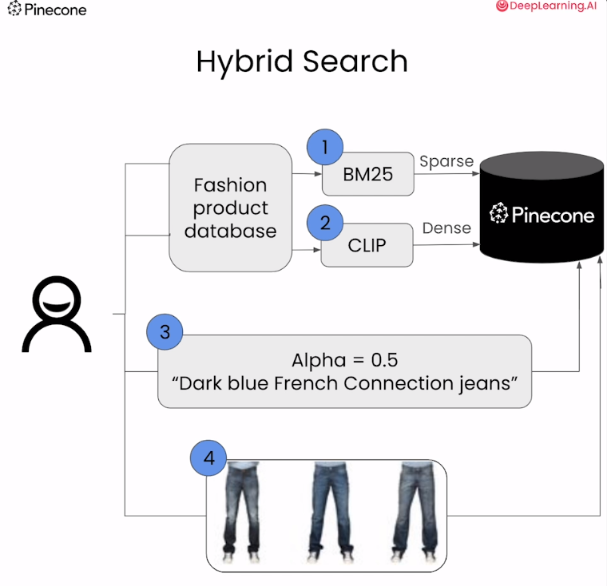
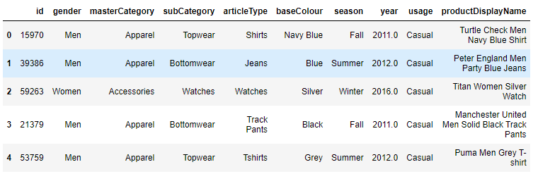
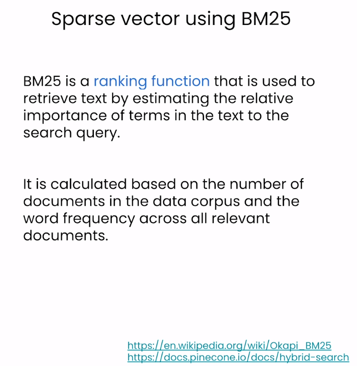
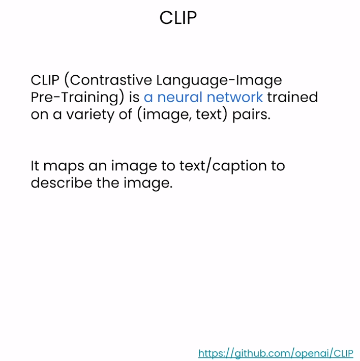
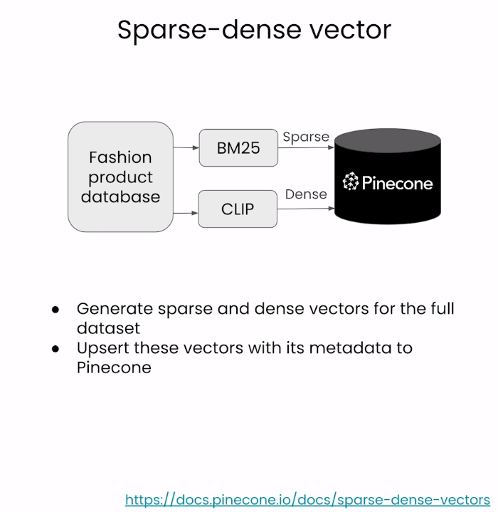
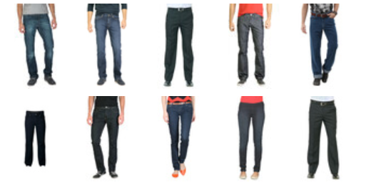
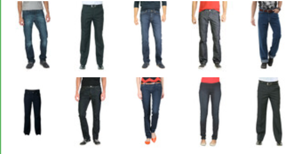
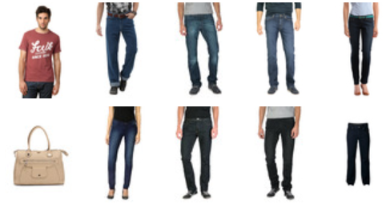
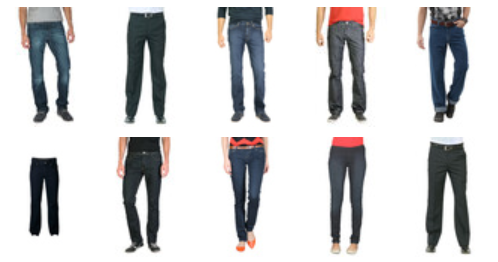

# Building Applications with Vector Databases


下面是这门课的学习笔记：[https://www.deeplearning.ai/short-courses/building-applications-vector-databases/](https://www.deeplearning.ai/short-courses/building-applications-vector-databases/)

Learn to create six exciting applications of vector databases and implement them using Pinecone.

Build a hybrid search app that combines both text and images for improved multimodal search results.

Learn how to build an app that measures and ranks facial similarity.

@[toc]

# Lesson 4 - Hybrid Search

参考：https://docs.pinecone.io/docs/hybrid-search

混合查询是一种在搜索过程中同时结合语义搜索（semantic search）和关键词搜索（keyword search）的方法。在这种查询中，搜索引擎会同时考虑文本的语义信息以及关键词的匹配程度，以提供更相关的搜索结果。

具体来说，在混合查询中，语义搜索通常使用文本的语义信息来计算相似度，例如使用文本嵌入向量（dense embeddings）来表示文本的语义信息。这种方法可以捕获文本之间的语义相似度，即使查询文本与文档之间没有直接的关键词匹配，也能够找到相关的结果。但是，对于领域外的查询（out-of-domain queries），语义搜索的结果可能不够准确或不够相关。

为了提高搜索结果的相关性，混合查询还结合了关键词搜索的结果。关键词搜索通常根据关键词的匹配程度来进行检索，例如使用词频-逆文档频率（TF-IDF）等方法。这种方法可以捕获文本中关键词的匹配程度，即使文本之间的语义相似度较低，但如果它们包含相同的关键词，则可能被认为是相关的。

通过在查询过程中同时使用语义搜索和关键词搜索，混合查询可以更全面地考虑文本的相关性，从而提供更相关的搜索结果。这种方法特别适用于处理领域外查询或文本之间语义相似度较低的情况，可以改善搜索结果的质量和相关性。




### Import the Needed Packages

```python
import warnings
warnings.filterwarnings('ignore')
from datasets import load_dataset
from pinecone_text.sparse import BM25Encoder
from pinecone import Pinecone, ServerlessSpec
from DLAIUtils import Utils

from sentence_transformers import SentenceTransformer
from tqdm.auto import tqdm
import torch
import os
```


```python
utils = Utils()
PINECONE_API_KEY = utils.get_pinecone_api_key()
```


### Setup Pinecone


```python
device = 'cuda' if torch.cuda.is_available() else 'cpu'
print(device)

utils = Utils()
INDEX_NAME = utils.create_dlai_index_name('dl-ai')

pinecone = Pinecone(api_key=PINECONE_API_KEY)

if INDEX_NAME in [index.name for index in pinecone.list_indexes()]:
  pinecone.delete_index(INDEX_NAME)
pinecone.create_index(
  INDEX_NAME,
  dimension=512,
  metric="dotproduct",
  spec=ServerlessSpec(cloud='aws', region='us-west-2')
)
index = pinecone.Index(INDEX_NAME)
```

其中Utils的包如下

```python
import os
import sys
from dotenv import load_dotenv, find_dotenv

class Utils:
  def __init__(self):
    pass
  
  def create_dlai_index_name(self, index_name):
    openai_key = ''
    if self.is_colab(): # google colab
      from google.colab import userdata
      openai_key = userdata.get("OPENAI_API_KEY")
    else: # jupyter notebook
      openai_key = os.getenv("OPENAI_API_KEY")
    return f'{index_name}-{openai_key[-36:].lower().replace("_", "-")}'
    
  def is_colab(self):
    return 'google.colab' in sys.modules

  def get_openai_api_key(self):
    _ = load_dotenv(find_dotenv())
    return os.getenv("OPENAI_API_KEY")
    
  def get_pinecone_api_key(self):
    _ = load_dotenv(find_dotenv())
    return os.getenv("PINECONE_API_KEY")

```


### Load the Dataset

从huggingface上下载数据集

```python
fashion = load_dataset(
    "ashraq/fashion-product-images-small",
    split="train"
)
fashion
```

在这段代码中，`split` 参数用于指定加载数据集的哪个部分。在机器学习中，数据集通常被分为几个不同的部分，比如训练集（train）、验证集（validation）和测试集（test）。这些部分用于不同的目的，例如训练模型、调整超参数以及评估模型性能。

在这个特定的例子中，`split="train"` 表示加载数据集中的训练集部分。这意味着加载的数据集将包含用于训练模型的数据样本。通常，训练集用于拟合模型的参数，使其能够从数据中学习并进行预测。

Output

```json
Dataset({
    features: ['id', 'gender', 'masterCategory', 'subCategory', 'articleType', 'baseColour', 'season', 'year', 'usage', 'productDisplayName', 'image'],
    num_rows: 44072
})
```

输出image图片测试一下

```python
images = fashion['image']
metadata = fashion.remove_columns('image') # 去掉image列
images[900]
```

Output


展示metadata的前五行：

```python
metadata = metadata.to_pandas()
metadata.head() # 用于返回数据集的前几行，默认情况下是前五行
```

Output




### Create the Sparse Vector Using BM25




chatGPT对BM25的介绍

BM25（Best Matching 25）是一种用于信息检索的概率模型，是根据概率论原理和统计学原理设计的。它是 BM 系列算法中的一种，通常用于在大规模文本数据集中执行全文搜索和相关性排序。BM25 最初是由Robertson 等人于 1994 年提出的，并且被广泛应用于搜索引擎和文档检索系统中。

BM25 的主要思想是衡量查询词与文档之间的相关性，并根据相关性对文档进行排序。它考虑了查询词的频率、文档的长度以及文档集合中包含查询词的文档数量等因素，从而更好地衡量文档的相关性。与传统的向量空间模型（如 TF-IDF）相比，BM25 能够更好地处理长文档、稀疏查询以及文档长度不均匀的情况。

BM25 模型的计算公式包括多个参数，如查询词频率、文档长度、文档集合的平均长度等。这些参数可以根据具体的应用场景和数据集进行调整，以获得更好的搜索性能。

总的来说，BM25 是一种用于信息检索的强大模型，广泛应用于各种搜索引擎和文档检索系统中，能够有效地提高搜索结果的质量和相关性。

```py
bm25 = BM25Encoder()
bm25.fit(metadata['productDisplayName'])
metadata['productDisplayName'][0]
```

Output

```py
'Turtle Check Men Navy Blue Shirt'
```


```py
bm25.encode_queries(metadata['productDisplayName'][0])
bm25.encode_documents(metadata['productDisplayName'][0])
```


在这段代码中，`bm25.encode_queries(metadata['productDisplayName'][0])` 和 `bm25.encode_documents(metadata['productDisplayName'][0])` 是使用 BM25 编码器对查询和文档进行编码的操作。

具体来说：

- `bm25.encode_queries(metadata['productDisplayName'][0])`：这个方法用于对查询进行编码。在信息检索任务中，查询通常是用户输入的搜索词或短语。这个方法将输入的查询文本编码成 BM25 编码器所能理解的形式，以便后续可以与已编码的文档进行比较，找到与查询最相关的文档。

- `bm25.encode_documents(metadata['productDisplayName'][0])`：这个方法用于对文档进行编码。在信息检索任务中，文档通常是待检索的数据项，例如产品描述、文章内容等。这个方法将输入的文档文本编码成 BM25 编码器所能理解的形式，以便后续可以与已编码的查询进行比较，找到与查询最相关的文档。

总的来说，这两个方法都是将文本数据使用 BM25 编码器进行编码的操作，以便在信息检索任务中进行相关性匹配和排序。`encode_queries()` 方法用于对查询进行编码，而 `encode_documents()` 方法用于对文档进行编码。

Output

```json
{'indices': [23789636,
  1830646559,
  632192512,
  931643408,
  3905155331,
  3828986392],
 'values': [0.4449638258432887,
  0.4449638258432887,
  0.4449638258432887,
  0.4449638258432887,
  0.4449638258432887,
  0.4449638258432887]}
```

### Create the Dense Vector Using CLIP




```py
model = SentenceTransformer('sentence-transformers/clip-ViT-B-32', 
    device=device)
model
dense_vec = model.encode([metadata['productDisplayName'][0]])
dense_vec.shape
```

Output

(1, 512)

```py
len(fashion)
```

Output

44072

### Create Embeddings Using Sparse and Dense



<p style="background-color:#fff1d7; padding:15px; "> <b>(Note: <code>fashion_data_num = 1000</code>):</b> In this lab, we've initially set <code>fashion_data_num</code> to 1000 for speedier results, allowing you to observe the outcomes faster. Once you've done an initial run, consider increasing this value. You'll likely notice better and more relevant results.</p>

```python
batch_size = 100
fashion_data_num = 1000

for i in tqdm(range(0, min(fashion_data_num,len(fashion)), batch_size)):
    # find end of batch
    i_end = min(i+batch_size, len(fashion))
    # extract metadata batch
    meta_batch = metadata.iloc[i:i_end]
    meta_dict = meta_batch.to_dict(orient="records")
    # concatinate all metadata field except for id and year to form a single string
    # 这句话的理解请看下面的解释
    meta_batch = [" ".join(x) for x in meta_batch.loc[:, ~meta_batch.columns.isin(['id', 'year'])].values.tolist()]
    # extract image batch
    img_batch = images[i:i_end]
    # create sparse BM25 vectors
    sparse_embeds = bm25.encode_documents([text for text in meta_batch])
    # create dense vectors
    dense_embeds = model.encode(img_batch).tolist()
    # create unique IDs
    ids = [str(x) for x in range(i, i_end)]

    upserts = []
    # loop through the data and create dictionaries for uploading documents to pinecone index
    for _id, sparse, dense, meta in zip(ids, sparse_embeds, dense_embeds, meta_dict):
        upserts.append({
            'id': _id,
            'sparse_values': sparse,
            'values': dense,
            'metadata': meta
        })
    # upload the documents to the new hybrid index
    index.upsert(upserts)

# show index description after uploading the documents
index.describe_index_stats()
```

上述代码的解释

`meta_batch.loc[:, ~meta_batch.columns.isin(['id', 'year'])]`：这部分代码首先使用 `.loc[]` 方法从 DataFrame 中选择所有行和除了'id'和'year'列以外的其他列。`~meta_batch.columns.isin(['id', 'year'])` 用于创建一个布尔值的 Series，表示除了'id'和'year'列以外的其他列。然后，`meta_batch.loc[:, ~meta_batch.columns.isin(['id', 'year'])]` 使用这个布尔值的 Series 进行列的选择。


在这个上下文中，`~` 是按位取反运算符。在 Pandas 中，它用于对布尔值 Series 或条件表达式的结果进行逐元素取反。

具体来说，`~meta_batch.columns.isin(['id', 'year'])` 创建了一个布尔值 Series，其中包含了与 DataFrame 列名是否包含在 ['id', 'year'] 列表中相对应的布尔值。然后，`~` 运算符对这个布尔值 Series 进行逐元素取反，即将 True 变为 False，将 False 变为 True。这样，最终得到的布尔值 Series 中，对于原始 DataFrame 中的列名中包含在 ['id', 'year'] 中的列，其值为 False，否则为 True。这就实现了对除了'id'和'year'列以外的其他列进行选择。


Output

```json
{'dimension': 512,
 'index_fullness': 0.0,
 'namespaces': {'': {'vector_count': 900}},
 'total_vector_count': 900}
```

### Run Your Query

query data参考：https://docs.pinecone.io/docs/query-data

参考:

```py
query = "dark blue french connection jeans for men"

sparse = bm25.encode_queries(query)
dense = model.encode(query).tolist() 

result = index.query(
    top_k=14,
    vector=dense,
    sparse_vector=sparse,
    include_metadata=True
)

imgs = [images[int(r["id"])] for r in result["matches"]]
imgs
```

在这段代码中：

- `vector` 参数：表示稠密向量（dense vector），通常用于传递由模型生成的文本嵌入向量（dense embeddings）。在这里，`dense` 变量包含了模型对查询文本 `query` 生成的稠密嵌入向量。

- `sparse_vector` 参数：表示稀疏向量（sparse vector），通常用于传递由 BM25 编码器生成的查询编码（query encoding）。在这里，`sparse` 变量包含了 BM25 编码器对查询文本 `query` 生成的稀疏编码。这种编码形式通常用于在基于 BM25 的索引中执行检索操作。

综合起来，这两个参数分别用于传递模型生成的稠密嵌入向量和 BM25 编码器生成的稀疏编码，以便于在索引中执行检索操作，并返回与查询文本相关的最相关的文档。

Output

```json
[<PIL.JpegImagePlugin.JpegImageFile image mode=RGB size=60x80>,
 <PIL.JpegImagePlugin.JpegImageFile image mode=RGB size=60x80>,
 <PIL.JpegImagePlugin.JpegImageFile image mode=RGB size=60x80>,
 <PIL.JpegImagePlugin.JpegImageFile image mode=RGB size=60x80>,
 <PIL.JpegImagePlugin.JpegImageFile image mode=RGB size=60x80>,
 <PIL.JpegImagePlugin.JpegImageFile image mode=RGB size=60x80>,
 <PIL.JpegImagePlugin.JpegImageFile image mode=RGB size=60x80>,
 <PIL.JpegImagePlugin.JpegImageFile image mode=RGB size=60x80>,
 <PIL.JpegImagePlugin.JpegImageFile image mode=RGB size=60x80>,
 <PIL.JpegImagePlugin.JpegImageFile image mode=RGB size=60x80>]
```

display结果

```py
from IPython.core.display import HTML
from io import BytesIO
from base64 import b64encode

# function to display product images
def display_result(image_batch):
    figures = []
    for img in image_batch:
        b = BytesIO()
        img.save(b, format='png')
        figures.append(f'''
            <figure style="margin: 5px !important;">
              
            </figure>
        ''')
    return HTML(data=f'''
        <div style="display: flex; flex-flow: row wrap; text-align: center;">
        {''.join(figures)}
        </div>
    ''')
```


```python
display_result(imgs)

```

Output



### Scaling the Hybrid Search

```py
def hybrid_scale(dense, sparse, alpha: float):
    """Hybrid vector scaling using a convex combination

    alpha * dense + (1 - alpha) * sparse

    Args:
        dense: Array of floats representing
        sparse: a dict of `indices` and `values`
        alpha: float between 0 and 1 where 0 == sparse only
               and 1 == dense only
    """
    if alpha < 0 or alpha > 1:
        raise ValueError("Alpha must be between 0 and 1")
    # scale sparse and dense vectors to create hybrid search vecs
    hsparse = {
        'indices': sparse['indices'],
        'values':  [v * (1 - alpha) for v in sparse['values']]
    }
    hdense = [v * alpha for v in dense]
    return hdense, hsparse
```


### 1. More Dense

```py
question = "dark blue french connection jeans for men"
#Closer to 0==more sparse, closer to 1==more dense
hdense, hsparse = hybrid_scale(dense, sparse, alpha=1)
result = index.query(
    top_k=6,
    vector=hdense,
    sparse_vector=hsparse,
    include_metadata=True
)
imgs = [images[int(r["id"])] for r in result["matches"]]
display_result(imgs)


```


Output




```py
for x in result["matches"]:
    print(x["metadata"]['productDisplayName'])
```

Output

```py
Peter England Men Party Blue Jeans
John Miller Men Reglur Black Trousers
Lee Men Blue Chicago Fit Jeans
Locomotive Men Washed Blue Jeans
Lee Men Blue Chicago Fit Jeans
Gini and Jony Boys Solid Black Jeans
Peter England Men Black Jeans
Tokyo Talkies Women Navy Slim Fit Jeans
Jealous 21 Women's Aaren Black Jegging
John Miller Men Solid Type Black Trousers
```


### 2. More Sparse

```python
question = "dark blue french connection jeans for men"
#Closer to 0==more sparse, closer to 1==more dense
hdense, hsparse = hybrid_scale(dense, sparse, alpha=0)
result = index.query(
    top_k=6,
    vector=hdense,
    sparse_vector=hsparse,
    include_metadata=True
)
imgs = [images[int(r["id"])] for r in result["matches"]]
display_result(imgs)
```

Output




```python
for x in result["matches"]:
    print(x["metadata"]['productDisplayName'])
```

Output

```py
French Connection Men Maroon T-shirt
Lee Men Blue Chicago Fit Jeans
Peter England Men Party Blue Jeans
Lee Men Blue Chicago Fit Jeans
Denizen Women Blue Jeans
French Connection Women Beige Handbag
Jealous 21 Women Washed Blue Jeans
Peter England Men Black Jeans
Peter England Men Party Black Jeans
Gini and Jony Boys Solid Black Jeans
```

### More Dense or More Sparse?

```python
question = "dark blue french connection jeans for men"
#Closer to 0==more sparse, closer to 1==more dense
hdense, hsparse = hybrid_scale(dense, sparse, alpha=0.5)
result = index.query(
    top_k=6,
    vector=hdense,
    sparse_vector=hsparse,
    include_metadata=True
)
imgs = [images[int(r["id"])] for r in result["matches"]]
display_result(imgs)

```

Output




```py
for x in result["matches"]:
    print(x["metadata"]['productDisplayName'])
```

Output

```py
Peter England Men Party Blue Jeans
John Miller Men Reglur Black Trousers
Lee Men Blue Chicago Fit Jeans
Locomotive Men Washed Blue Jeans
Lee Men Blue Chicago Fit Jeans
Gini and Jony Boys Solid Black Jeans
Peter England Men Black Jeans
Tokyo Talkies Women Navy Slim Fit Jeans
Jealous 21 Women's Aaren Black Jegging
John Miller Men Solid Type Black Trousers
```