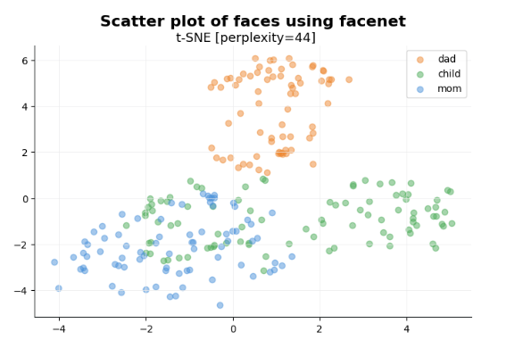

# Building Applications with Vector Databases


下面是这门课的学习笔记：[https://www.deeplearning.ai/short-courses/building-applications-vector-databases/](https://www.deeplearning.ai/short-courses/building-applications-vector-databases/)

Learn to create six exciting applications of vector databases and implement them using Pinecone.

Build a hybrid search app that combines both text and images for improved multimodal search results.

Learn how to build an app that measures and ranks facial similarity.

@[toc]


# Lesson 5 - Facial Similarity Search

人脸相似度查询：看看孩子更像母亲还是父亲


### Import the Needed Packages

```py
import warnings
warnings.filterwarnings('ignore')

from deepface import DeepFace
from pinecone import Pinecone, ServerlessSpec
from sklearn.decomposition import PCA
from sklearn.manifold import TSNE
from tqdm import tqdm
from DLAIUtils import Utils


import contextlib
import glob
import matplotlib.pyplot as plt
import numpy as np
import os
import pandas as pd
import time

```


```py
# get api key
utils = Utils()
PINECONE_API_KEY = utils.get_pinecone_api_key()
```

### Load the Dataset


```py
def show_img(f):
  img = plt.imread(f)
  plt.figure(figsize=(4,3))
  plt.imshow(img)

show_img('family/dad/P06260_face5.jpg')
```

Output


### Setup Pinecone 

```py
MODEL = "Facenet"
INDEX_NAME = utils.create_dlai_index_name('dl-ai')

pinecone = Pinecone(api_key=PINECONE_API_KEY)
```

### Create Embeddings Using DeepFace


```py
def generate_vectors():
  VECTOR_FILE = "./vectors.vec"

  with contextlib.suppress(FileNotFoundError):
    os.remove(VECTOR_FILE)
  with open(VECTOR_FILE, "w") as f:
    for person in ["mom", "dad", "child"]:
      files = glob.glob(f'family/{person}/*')
      for file in tqdm(files):
        try:
          embedding = DeepFace.represent(img_path=file, model_name=MODEL, enforce_detection=False)[0]['embedding']
          f.write(f'{person}:{os.path.basename(file)}:{embedding}\n')
        except (ValueError, UnboundLocalError, AttributeError) as e:
          print(e)

generate_vectors()
```


```py
!head -10 vectors.vec
```

### Plot the Data of Images


```py
def gen_tsne_df(person, perplexity):
    vectors =[]
    with open('./vectors.vec', 'r') as f:
      for line in tqdm(f):
        p, orig_img, v = line.split(':')
        if person == p:
            vectors.append(eval(v))
    pca = PCA(n_components=8)
    tsne = TSNE(2, perplexity=perplexity, random_state = 0, n_iter=1000,
        verbose=0, metric='euclidean', learning_rate=75)
    print(f'transform {len(vectors)} vectors')
    pca_transform = pca.fit_transform(vectors)
    embeddings2d = tsne.fit_transform(pca_transform)
    return pd.DataFrame({'x':embeddings2d[:,0], 'y':embeddings2d[:,1]})
```


```py
def plot_tsne(perplexity, model):
    (_, ax) = plt.subplots(figsize=(8,5))
    #plt.style.use('seaborn-whitegrid')
    plt.grid(color='#EAEAEB', linewidth=0.5)
    ax.spines['top'].set_color(None)
    ax.spines['right'].set_color(None)
    ax.spines['left'].set_color('#2B2F30')
    ax.spines['bottom'].set_color('#2B2F30')
    colormap = {'dad':'#ee8933', 'child':'#4fad5b', 'mom':'#4c93db'}

    for person in colormap:
        embeddingsdf = gen_tsne_df(person, perplexity)
        ax.scatter(embeddingsdf.x, embeddingsdf.y, alpha=.5, 
                   label=person, color=colormap[person])
    plt.title(f'Scatter plot of faces using {model}', fontsize=16, fontweight='bold', pad=20)
    plt.suptitle(f't-SNE [perplexity={perplexity}]', y=0.92, fontsize=13)
    plt.legend(loc='best', frameon=True)
    plt.show()
```


```py
plot_tsne(44, 'facenet')
```

Output



### Store the Embeddings in Pinecone

```python
if INDEX_NAME in [index.name for index in pinecone.list_indexes()]:
  pinecone.delete_index(INDEX_NAME)
pinecone.create_index(name=INDEX_NAME, dimension=128, metric='cosine',
  spec=ServerlessSpec(cloud='aws', region='us-west-2'))

index = pinecone.Index(INDEX_NAME)
```


```python
def store_vectors():
  with open("vectors.vec", "r") as f:
    for line in tqdm(f):
        person, file, vec = line.split(':')
        index.upsert([(f'{person}-{file}', eval(vec), {"person":person, "file":file})])
store_vectors()
```


```py
index.describe_index_stats()
```

Output

```py
{'dimension': 128,
 'index_fullness': 0.0,
 'namespaces': {'': {'vector_count': 319}},
 'total_vector_count': 319}
```


### Calculate the Similarity Scores

```py
def test(vec_groups, parent, child):
  index = pinecone.Index(INDEX_NAME)
  parent_vecs = vec_groups[parent]
  K = 10
  SAMPLE_SIZE = 10
  sum = 0
  for i in tqdm(range(0,SAMPLE_SIZE)):
    query_response = index.query(
      top_k=K,
      vector = parent_vecs[i],
      filter={
        "person": {"$eq": child}
      }
    )
    for row in query_response["matches"]:
      sum  = sum + row["score"]
  print(f'\n\n{parent} AVG: {sum / (SAMPLE_SIZE*K)}')
```


```py
def compute_scores():
  index = pinecone.Index(INDEX_NAME)
  vec_groups = {"dad":[], "mom":[], "child":[]}
  with open("vectors.vec", "r") as f:
    for line in tqdm(f):
      person, file, vec = line.split(':')
      vec_groups[person].append(eval(vec))
  print(f"DAD {'-' * 20}")
  test(vec_groups, "dad", "child")
  print(f"MOM {'-' * 20}")
  test(vec_groups, "mom", "child")

compute_scores()
```

Output

```
dad AVG: 0.41020248437000006
mom AVG: 0.3494142116000002
```


### Check the Matching Images

孩子的照片

```python
child_base = 'family/child/P06310_face1.jpg'
show_img(child_base)
```

Output


```py
#Now find closest given we know dad is "most similar"
embedding = DeepFace.represent(img_path=child_base, model_name=MODEL)[0]['embedding']
print(embedding)
```

在dad文件夹中查找结果

```python
query_response = index.query(
      top_k=3,
      vector = embedding,
      filter={
        "person": {"$eq": "dad"}
      },
      include_metadata=True
)
```

在这里，filter 参数中的 "$eq" 表示等于运算符（equality operator）。它用于对索引中的特定字段进行过滤，只返回那些字段值等于给定值的条目。

在这个例子中，filter 参数的目的是对索引中的 "person" 字段进行过滤，只返回 "person" 字段值等于 "dad" 的条目。这样可以限制搜索结果，只返回符合指定条件的结果。

```py
print(query_response)
```


在这里，`vector` 参数用于指定查询时所使用的向量。具体来说，它表示查询向量，即用于与索引中存储的向量进行相似度比较的向量。

当执行查询时，系统会使用 `vector` 参数中指定的向量与索引中存储的向量进行相似度计算，从而找到与查询向量最相似的向量，并返回相应的搜索结果。

在这个例子中，`vector` 参数应该包含了用于查询的嵌入向量，通常是由某个模型生成的表示查询内容的向量。


Output

```py
{'matches': [{'id': 'dad-P06396_face3.jpg',
              'metadata': {'file': 'P06396_face3.jpg', 'person': 'dad'},
              'score': 0.438557684,
              'values': []},
             {'id': 'dad-P11886_face3.jpg',
              'metadata': {'file': 'P11886_face3.jpg', 'person': 'dad'},
              'score': 0.419384569,
              'values': []},
             {'id': 'dad-P04408_face0.jpg',
              'metadata': {'file': 'P04408_face0.jpg', 'person': 'dad'},
              'score': 0.407050818,
              'values': []},
             {'id': 'dad-P11991_face7.jpg',
              'metadata': {'file': 'P11991_face7.jpg', 'person': 'dad'},
              'score': 0.368852,
              'values': []},
             {'id': 'dad-P06265_face2.jpg',
              'metadata': {'file': 'P06265_face2.jpg', 'person': 'dad'},
              'score': 0.36260435,
              'values': []},
             {'id': 'dad-P04407_face3.jpg',
              'metadata': {'file': 'P04407_face3.jpg', 'person': 'dad'},
              'score': 0.357501268,
              'values': []},
             {'id': 'dad-P11995_face2.jpg',
              'metadata': {'file': 'P11995_face2.jpg', 'person': 'dad'},
              'score': 0.336032152,
              'values': []},
             {'id': 'dad-P11975_face0.jpg',
              'metadata': {'file': 'P11975_face0.jpg', 'person': 'dad'},
              'score': 0.317324311,
              'values': []},
             {'id': 'dad-P11984_face2.jpg',
              'metadata': {'file': 'P11984_face2.jpg', 'person': 'dad'},
              'score': 0.310575306,
              'values': []},
             {'id': 'dad-P06260_face5.jpg',
              'metadata': {'file': 'P06260_face5.jpg', 'person': 'dad'},
              'score': 0.30459854,
              'values': []}],
 'namespace': '',
 'usage': {'read_units': 6}}
```


查询最像孩子的父亲：

```py
photo = query_response['matches'][0]['metadata']['file']
show_img(f'family/dad/{photo}')

```

Output

