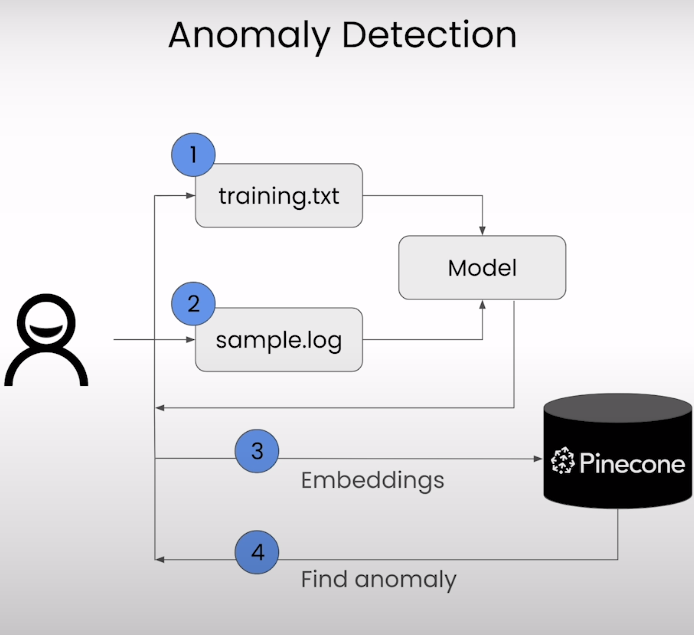

# Building Applications with Vector Databases


下面是这门课的学习笔记：[https://www.deeplearning.ai/short-courses/building-applications-vector-databases/](https://www.deeplearning.ai/short-courses/building-applications-vector-databases/)

Learn to create six exciting applications of vector databases and implement them using Pinecone.

Build a hybrid search app that combines both text and images for improved multimodal search results.

Learn how to build an app that measures and ranks facial similarity.

@[toc]

# Lesson 6 - Anomaly Detection

日志系统的异常检测




使用ASA日志

Cisco ASA（Adaptive Security Appliance）是思科公司的一种网络安全设备，通常用于实施防火墙、虚拟专用网络（VPN）、入侵检测和防御（IDS/IPS）等功能。ASA 设备可以生成各种类型的日志，用于记录设备操作、网络流量、安全事件等信息。这些日志对于网络管理、故障排除和安全监控都非常重要。

ASA 设备的日志系统通常包括以下几个方面：

1. **日志级别（Logging Levels）**：ASA 日志系统使用日志级别来指定日志的重要性和详细程度。常见的日志级别包括：Emergency、Alert、Critical、Error、Warning、Notice、Informational 和 Debugging。管理员可以根据需要配置不同级别的日志记录。

2. **日志消息（Log Messages）**：ASA 设备生成的日志消息涵盖了各种操作、事件和警报信息。这些消息可以提供有关网络流量、连接状态、设备运行状况和安全事件的详细信息。

3. **日志格式（Log Formats）**：ASA 日志系统支持多种日志格式，包括文本格式（plaintext）、JSON 格式等。管理员可以根据需要选择合适的日志格式。

4. **日志存储和导出（Log Storage and Export）**：ASA 设备通常提供多种日志存储和导出选项，例如本地存储、远程日志服务器（Syslog）存储、SNMP Trap、Email 通知等。

5. **日志分析和监控（Log Analysis and Monitoring）**：管理员可以使用各种工具对 ASA 设备生成的日志进行分析和监控，以便实时监测网络活动、检测安全事件、进行故障排除等。

总的来说，Cisco ASA 日志系统是一个重要的网络安全工具，提供了丰富的日志信息，帮助管理员对网络安全事件进行监控和响应。


### Import the Needed Packages

```py
import warnings
warnings.filterwarnings('ignore')
from pinecone import Pinecone, ServerlessSpec
from sentence_transformers import SentenceTransformer, InputExample, losses, models, util
from torch.utils.data import DataLoader
from torch import nn
from tqdm.auto import tqdm
from DLAIUtils import Utils
import torch
import time
import torch
import os
```


### Setup Pinecone


```py
utils = Utils()
PINECONE_API_KEY = utils.get_pinecone_api_key()

INDEX_NAME = utils.create_dlai_index_name('dl-ai')

pinecone = Pinecone(api_key=PINECONE_API_KEY)

if INDEX_NAME in [index.name for index in pinecone.list_indexes()]:
  pinecone.delete_index(INDEX_NAME)
pinecone.create_index(name=INDEX_NAME, dimension=256, metric='cosine',
  spec=ServerlessSpec(cloud='aws', region='us-west-2'))
index = pinecone.Index(INDEX_NAME)
```

### Load the Dataset


```py
!head -5 sample.log
```

Output

```py
Apr 15 2013 09:36:50: %ASA-4-106023: Deny tcp src dmz:10.1.2.30/63016 dst outside:192.0.0.8/53 by access-group "acl_dmz" [0xe3aab522, 0x0]
Apr 15 2013 09:36:50: %ASA-4-106023: Deny tcp src dmz:10.1.2.30/63016 dst outside:192.0.0.8/53 type 3, code 0, by access-group "acl_dmz" [0xe3aab522, 0x0]
Apr 15 2014 09:34:34 EDT: %ASA-session-5-106100: access-list acl_in permitted tcp inside/10.1.2.16(2241) -> outside/192.0.0.89(2000) hit-cnt 1 first hit [0x71a87d94, 0x0]
Apr 24 2013 16:00:28 INT-FW01 : %ASA-6-106100: access-list inside denied udp inside/172.29.2.101(1039) -> outside/192.0.2.10(53) hit-cnt 1 first hit [0xd820e56a, 0x0]
Apr 24 2013 16:00:27 INT-FW01 : %ASA-6-106100: access-list inside permitted udp inside/172.29.2.3(1065) -> outside/192.0.2.57(53) hit-cnt 144 300-second interval [0xe982c7a4, 0x0]
```


```py
!head -5 training.txt
```

Output

```py
Apr 15 2013 09:36:50: %ASA-4-106023: Deny tcp src dmz:10.1.2.30/63016 dst outside:192.0.0.8/53 by access-group "acl_dmz" [0xe3aab522, 0x0] ^ Apr 15 2013 09:36:50: %ASA-4-106023: Deny tcp src dmz:10.1.2.30/63016 dst outside:192.0.0.8/53 by access-group "acl_dmz" [0xe3aab522, 0x0] ^ 1.0
Apr 15 2013 09:36:50: %ASA-4-106023: Deny tcp src dmz:10.1.2.30/63016 dst outside:192.0.0.8/53 type 3, code 0, by access-group "acl_dmz" [0xe3aab522, 0x0] ^ Apr 15 2013 09:36:50: %ASA-4-106023: Deny tcp src dmz:10.1.2.30/63016 dst outside:192.0.0.8/53 by access-group "acl_dmz" [0xe3aab522, 0x0] ^ 0.9
Apr 15 2014 09:34:34 EDT: %ASA-session-5-106100: access-list acl_in permitted tcp inside/10.1.2.16(2241) -> outside/192.0.0.89(2000) hit-cnt 1 first hit [0x71a87d94, 0x0] ^ Apr 15 2013 09:36:50: %ASA-4-106023: Deny tcp src dmz:10.1.2.30/63016 dst outside:192.0.0.8/53 by access-group "acl_dmz" [0xe3aab522, 0x0] ^ 0.8
Apr 24 2013 16:00:28 INT-FW01 : %ASA-6-106100: access-list inside denied udp inside/172.29.2.101(1039) -> outside/192.0.2.10(53) hit-cnt 1 first hit [0xd820e56a, 0x0] ^ Apr 15 2013 09:36:50: %ASA-4-106023: Deny tcp src dmz:10.1.2.30/63016 dst outside:192.0.0.8/53 by access-group "acl_dmz" [0xe3aab522, 0x0] ^ 0.7
Apr 24 2013 16:00:27 INT-FW01 : %ASA-6-106100: access-list inside permitted udp inside/172.29.2.3(1065) -> outside/192.0.2.57(53) hit-cnt 144 300-second interval [0xe982c7a4, 0x0] ^ Apr 15 2013 09:36:50: %ASA-4-106023: Deny tcp src dmz:10.1.2.30/63016 dst outside:192.0.0.8/53 by access-group "acl_dmz" [0xe3aab522, 0x0] ^ 0.7
```


### Check cuda and Setup the Model

We are using *bert-base-uncased* sentence-transformers model that maps sentences to a 256 dimensional dense vector space.


```py
device = 'cuda' if torch.cuda.is_available() else 'cpu'
word_embedding_model = models.Transformer('bert-base-uncased', max_seq_length=768)
pooling_model = models.Pooling(word_embedding_model.get_word_embedding_dimension())
dense_model = models.Dense(in_features=pooling_model.get_sentence_embedding_dimension(), out_features=256, activation_function=nn.Tanh())

model = SentenceTransformer(modules=[word_embedding_model, pooling_model, dense_model], device=device)
device
```


### Train the Model


```py
train_examples = []
with open('./training.txt', 'r') as f:
    lines = f.readlines()
    for line in lines:
        line = line.strip()
        if line:
            a, b, label = line.split('^')
            train_examples.append(InputExample(texts=[a, b], label=float(label)))

#Define dataset, the dataloader and the training loss
warmup_steps=100
train_dataloader = DataLoader(train_examples, shuffle=True, batch_size=16)
train_loss = losses.CosineSimilarityLoss(model)
```


<p style="background-color:#fff1d7; padding:15px; "> <b>(Note: <code>load_pretrained_model = True</code>):</b> We've saved the trained model and are loading it here for speedier results, allowing you to observe the outcomes faster. Once you've done an initial run, you may set <code>load_pretrained_model</code> to <code>False</code> to train the model yourself. This can take some time to finsih, depending the value you set for the <code>epochs</code>.</p>


```py
import pickle
load_pretrained_model = True
if load_pretrained_model:
    trained_model_file = open('./data/pretrained_model', 'rb')    
    db = pickle.load(trained_model_file)
    trained_model_file.close()
else:
    model.fit(train_objectives=[(train_dataloader, train_loss)], epochs=16, warmup_steps=100)

samples = []
with open('sample.log', 'r') as f:
    lines = f.readlines()
    for line in lines:
        line = line.strip()
        if line:
            #emb = model.encode([line])
            samples.append(line)
```


### Create Embeddings and Upsert to Pinecone


```python
emb = model.encode(samples)

prepped = []
for i in tqdm(range(len(samples))):
  v = {'id':f'{i}', 'values':emb[i].tolist(), 'metadata':{'log':samples[i]}}
  prepped.append(v)
index.upsert(prepped)
```

Output

```js
{'upserted_count': 90}
```


### Find the Anomaly

```py
good_log_line = samples[0]
print(good_log_line)
```

Output

```py
Apr 15 2013 09:36:50: %ASA-4-106023: Deny tcp src dmz:10.1.2.30/63016 dst outside:192.0.0.8/53 by access-group "acl_dmz" [0xe3aab522, 0x0]
```


```py
results = []
while len(results)==0:  # After the upserts, it might take a few seconds for index to be ready for query.  
    time.sleep(2)       # If results is empty we try again two seconds later.
    queried = index.query(
        vector=emb[0].tolist(),
        include_metadata=True,
        top_k=100
    )
    results = queried['matches']
    print(".:. ",end="")
```


```py
for i in range(0,10) :
  print(f"{round(results[i]['score'], 4)}\t{results[i]['metadata']['log']}")
```

Output

```py
1.0	Apr 15 2013 09:36:50: %ASA-4-106023: Deny tcp src dmz:10.1.2.30/63016 dst outside:192.0.0.8/53 by access-group "acl_dmz" [0xe3aab522, 0x0]
0.9929	Apr 15 2013 09:36:50: %ASA-4-106023: Deny tcp src dmz:10.1.2.30/63016 dst outside:192.0.0.8/53 type 3, code 0, by access-group "acl_dmz" [0xe3aab522, 0x0]
0.982	Apr 30 2013 09:23:40: %ASA-4-106023: Deny tcp src outside:192.0.2.126/53638 dst inside:10.0.0.132/8111 by access-group "acl_out" [0x71761f18, 0x0]
0.9812	Apr 30 2013 09:23:41: %ASA-4-106023: Deny tcp src outside:192.0.2.126/53638 dst inside:10.0.0.132/8111 by access-group "acl_out" [0x71761f18, 0x0]
0.9794	Dec 11 2018 08:01:39 <IP>: %ASA-4-106023: Deny udp src dmz:192.168.1.34/5679 dst outside:192.0.0.12/5000 by access-group "dmz" [0x123a465e, 0x8c20f21]
0.9788	Sep 12 2014 06:53:01 GIFRCHN01 : %ASA-4-106023: Deny tcp src outside:192.0.2.95/24069 dst inside:10.32.112.125/25 by access-group "PERMIT_IN" [0x0, 0x0]"
0.9769	Dec 11 2018 08:01:24 <IP>: %ASA-4-106023: Deny udp src dmz:192.168.1.33/5555 dst outside:192.0.0.12/53 by access-group "dmz" [0x123a465e, 0x4c7bf613]
0.9769	Dec 11 2018 08:01:24 <IP>: %ASA-4-106023: Deny udp src dmz:192.168.1.33/5555 dst outside:192.0.0.12/53 by access-group "dmz" [0x123a465e, 0x4c7bf613]
0.9715	Apr 30 2013 09:22:48: %ASA-5-106100: access-list acl_in permitted tcp inside/10.0.0.13(43013) -> dmz/192.168.33.31(25) hit-cnt 1 first hit [0x71a87d94, 0x0]
0.9689	Apr 30 2013 09:22:38: %ASA-5-106100: access-list acl_in permitted tcp inside/10.0.0.16(2006) -> outside/192.0.0.89(2000) hit-cnt 1 first hit [0x71a87d94, 0x0]
```

输出100条中的最后一条日志

```py
last_element = len(results) -1  

print(f"{round(results[last_element]['score'], 4)}\t{results[last_element]['metadata']['log']}")
```

Output

```py
0.9689	Apr 30 2013 09:22:38: %ASA-5-106100: access-list acl_in permitted tcp inside/10.0.0.16(2006) -> outside/192.0.0.89(2000) hit-cnt 1 first hit [0x71a87d94, 0x0]
```