# Building Generative AI Applications with Gradio


本文是学习 [https://www.deeplearning.ai/short-courses/building-generative-ai-applications-with-gradio/](https://www.deeplearning.ai/short-courses/building-generative-ai-applications-with-gradio/) 这门课的学习笔记。


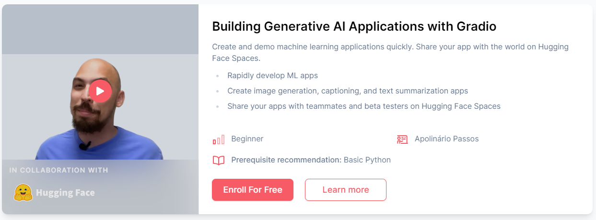


## What you’ll learn in this course

Join our new short course, Building Generative AI Applications with Gradio! Learn from Apolinário Passos, Machine Learning Art Engineer at Hugging Face.

What you’ll do:

- With a few lines of code, create a user-friendly app (usable for non-coders) to take input text, summarize it with an open-source large language model, and display the summary.
- Create an app that allows the user to upload an image, which uses an image to text (image captioning) to describe the uploaded image, and display both the image and the caption in the app.
- Create an app that takes text and generates an image with a diffusion model, then displays the generated image within the app.
- Combine what you learned in the previous two lessons: Upload an image, caption the image, and use the caption to generate a new image.
- Create an interface to chat with an open source LLM using Falcon, the best-ranking open source LLM on the Open LLM Leaderboard.

By the end of the course, you’ll gain the practical knowledge to rapidly build interactive apps and demos to validate your project and ship faster


@[toc]


# L1: NLP tasks with a simple interface 🗞️


Load your HF API key and relevant Python libraries.


```py
import os
import io
from IPython.display import Image, display, HTML
from PIL import Image
import base64 
from dotenv import load_dotenv, find_dotenv
_ = load_dotenv(find_dotenv()) # read local .env file
hf_api_key = os.environ['HF_API_KEY']
```


```py
# Helper function
import requests, json

#Summarization endpoint
def get_completion(inputs, parameters=None,ENDPOINT_URL=os.environ['HF_API_SUMMARY_BASE']): 
    headers = {
      "Authorization": f"Bearer {hf_api_key}",
      "Content-Type": "application/json"
    }
    data = { "inputs": inputs }
    if parameters is not None:
        data.update({"parameters": parameters})
    response = requests.request("POST",
                                ENDPOINT_URL, headers=headers,
                                data=json.dumps(data)
                               )
    return json.loads(response.content.decode("utf-8"))
```


How about running it locally?

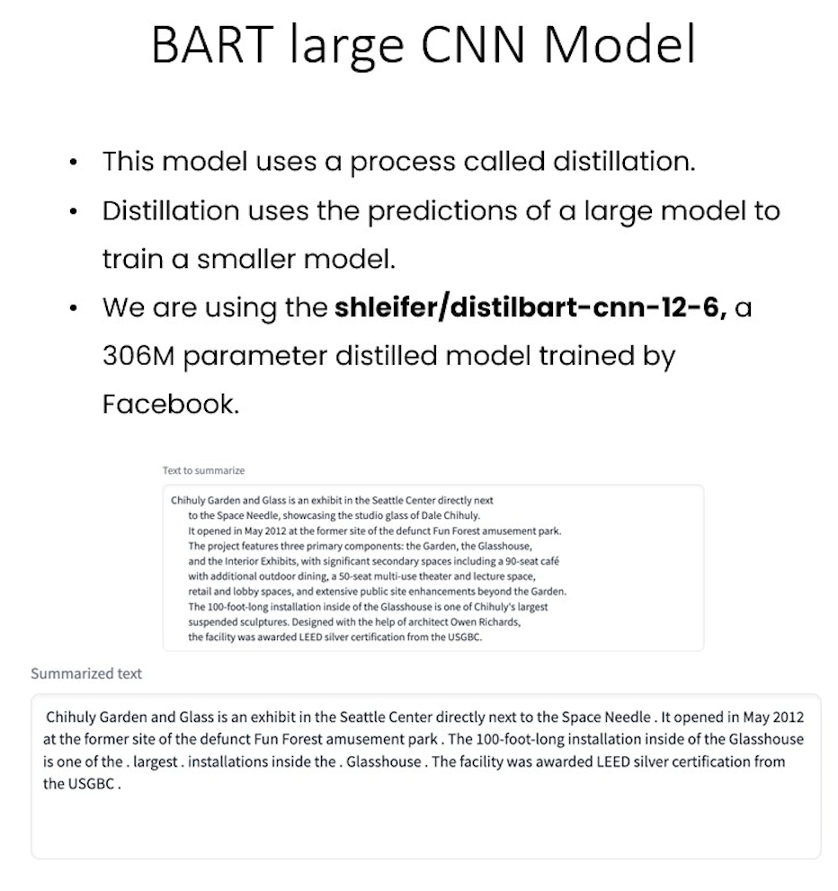

The code would look very similar if you were running it locally instead of from an API. The same is true for all the models in the rest of the course, make sure to check the [Pipelines](https://huggingface.co/docs/transformers/main_classes/pipelines) documentation page

```py
from transformers import pipeline

get_completion = pipeline("summarization", model="shleifer/distilbart-cnn-12-6")

def summarize(input):
    output = get_completion(input)
    return output[0]['summary_text']
    
```


## Building a text summarization app

```py
text = ('''The tower is 324 metres (1,063 ft) tall, about the same height
        as an 81-storey building, and the tallest structure in Paris. 
        Its base is square, measuring 125 metres (410 ft) on each side. 
        During its construction, the Eiffel Tower surpassed the Washington 
        Monument to become the tallest man-made structure in the world,
        a title it held for 41 years until the Chrysler Building
        in New York City was finished in 1930. It was the first structure 
        to reach a height of 300 metres. Due to the addition of a broadcasting 
        aerial at the top of the tower in 1957, it is now taller than the 
        Chrysler Building by 5.2 metres (17 ft). Excluding transmitters, the 
        Eiffel Tower is the second tallest free-standing structure in France 
        after the Millau Viaduct.''')

get_completion(text)
```

Output

```py
[{'summary_text': ' The tower is 324 metres (1,063 ft) tall, about the same height as an 81-storey building . It is the tallest structure in Paris and the second tallest free-standing structure in France after the Millau Viaduct . It was the first structure in the world to reach a height of 300 metres .'}]
```


Getting started with Gradio `gr.Interface`

```py
import gradio as gr
def summarize(input):
    output = get_completion(input)
    return output[0]['summary_text']
    
gr.close_all()
demo = gr.Interface(fn=summarize, inputs="text", outputs="text")
demo.launch(share=True, server_port=int(os.environ['PORT1']))
```


`demo.launch(share=True)` lets you create a public link to share with your team or friends.


```py
import gradio as gr

def summarize(input):
    output = get_completion(input)
    return output[0]['summary_text']

gr.close_all()
demo = gr.Interface(fn=summarize, 
                    inputs=[gr.Textbox(label="Text to summarize", lines=6)],
                    outputs=[gr.Textbox(label="Result", lines=3)],
                    title="Text summarization with distilbart-cnn",
                    description="Summarize any text using the `shleifer/distilbart-cnn-12-6` model under the hood!"
                   )
demo.launch(share=True, server_port=int(os.environ['PORT2']))
```

Output

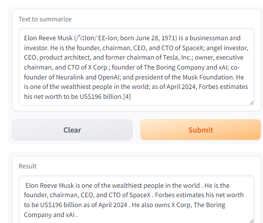

## Building a Named Entity Recognition app

We are using this [Inference Endpoint](https://huggingface.co/inference-endpoints) for `dslim/bert-base-NER`, a 108M parameter fine-tuned BART model on the NER task.

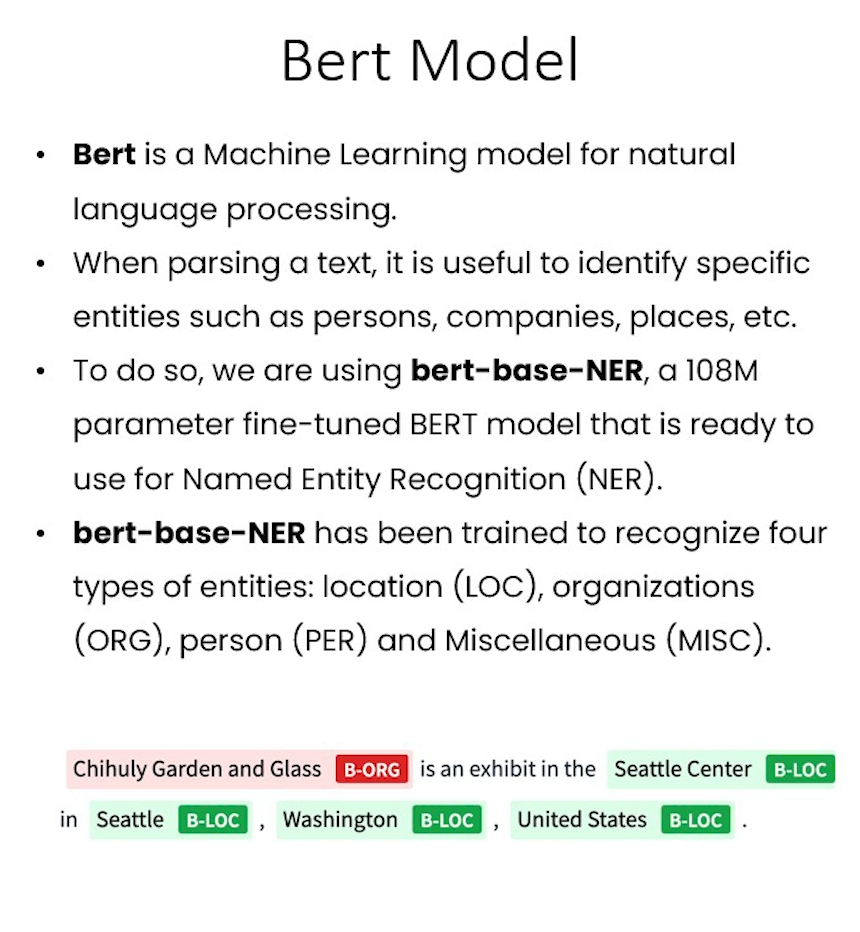


How about running it locally?

```py
from transformers import pipeline

get_completion = pipeline("ner", model="dslim/bert-base-NER")

def ner(input):
    output = get_completion(input)
    return {"text": input, "entities": output}
    
```


```py
API_URL = os.environ['HF_API_NER_BASE'] #NER endpoint
text = "My name is Andrew, I'm building DeepLearningAI and I live in California"
get_completion(text, parameters=None, ENDPOINT_URL= API_URL)
```

Output

```py
[{'entity': 'B-PER',
  'score': 0.9990625,
  'index': 4,
  'word': 'Andrew',
  'start': 11,
  'end': 17},
 {'entity': 'B-ORG',
  'score': 0.9927857,
  'index': 10,
  'word': 'Deep',
  'start': 32,
  'end': 36},
 {'entity': 'I-ORG',
  'score': 0.99677867,
  'index': 11,
  'word': '##L',
  'start': 36,
  'end': 37},
 {'entity': 'I-ORG',
  'score': 0.9954496,
  'index': 12,
  'word': '##ear',
  'start': 37,
  'end': 40},
 {'entity': 'I-ORG',
  'score': 0.9959293,
  'index': 13,
  'word': '##ning',
  'start': 40,
  'end': 44},
 {'entity': 'I-ORG',
  'score': 0.8917463,
  'index': 14,
  'word': '##A',
  'start': 44,
  'end': 45},
 {'entity': 'I-ORG',
  'score': 0.50361204,
  'index': 15,
  'word': '##I',
  'start': 45,
  'end': 46},
 {'entity': 'B-LOC',
  'score': 0.99969244,
  'index': 20,
  'word': 'California',
  'start': 61,
  'end': 71}]
```


#### gr.interface()
- Notice below that we pass in a list `[]` to `inputs` and to `outputs` because the function `fn` (in this case, `ner()`, can take in more than one input and return more than one output.
- The number of objects passed to `inputs` list should match the number of parameters that the `fn` function takes in, and the number of objects passed to the `outputs` list should match the number of objects returned by the `fn` function.


```py
def ner(input):
    output = get_completion(input, parameters=None, ENDPOINT_URL=API_URL)
    return {"text": input, "entities": output}

gr.close_all()
demo = gr.Interface(fn=ner,
                    inputs=[gr.Textbox(label="Text to find entities", lines=2)],
                    outputs=[gr.HighlightedText(label="Text with entities")],
                    title="NER with dslim/bert-base-NER",
                    description="Find entities using the `dslim/bert-base-NER` model under the hood!",
                    allow_flagging="never",
                    #Here we introduce a new tag, examples, easy to use examples for your application
                    examples=["My name is Andrew and I live in California", "My name is Poli and work at HuggingFace"])
demo.launch(share=True, server_port=int(os.environ['PORT3']))
```

Output

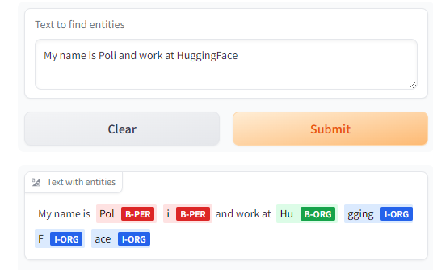

### Adding a helper function to merge tokens


```py
def merge_tokens(tokens):
    merged_tokens = []
    for token in tokens:
        if merged_tokens and token['entity'].startswith('I-') and merged_tokens[-1]['entity'].endswith(token['entity'][2:]):
            # If current token continues the entity of the last one, merge them
            last_token = merged_tokens[-1]
            last_token['word'] += token['word'].replace('##', '')
            last_token['end'] = token['end']
            last_token['score'] = (last_token['score'] + token['score']) / 2
        else:
            # Otherwise, add the token to the list
            merged_tokens.append(token)

    return merged_tokens

def ner(input):
    output = get_completion(input, parameters=None, ENDPOINT_URL=API_URL)
    merged_tokens = merge_tokens(output)
    return {"text": input, "entities": merged_tokens}

gr.close_all()
demo = gr.Interface(fn=ner,
                    inputs=[gr.Textbox(label="Text to find entities", lines=2)],
                    outputs=[gr.HighlightedText(label="Text with entities")],
                    title="NER with dslim/bert-base-NER",
                    description="Find entities using the `dslim/bert-base-NER` model under the hood!",
                    allow_flagging="never",
                    examples=["My name is Andrew, I'm building DeeplearningAI and I live in California", "My name is Poli, I live in Vienna and work at HuggingFace"])

demo.launch(share=True, server_port=int(os.environ['PORT4']))
```

Output

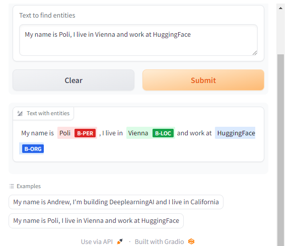


# L2: Image captioning app 🖼️📝


```py
import os
import io
import IPython.display
from PIL import Image
import base64 
from dotenv import load_dotenv, find_dotenv
_ = load_dotenv(find_dotenv()) # read local .env file
hf_api_key = os.environ['HF_API_KEY']
```


```py
# Helper functions
import requests, json

#Image-to-text endpoint
def get_completion(inputs, parameters=None, ENDPOINT_URL=os.environ['HF_API_ITT_BASE']):
    headers = {
      "Authorization": f"Bearer {hf_api_key}",
      "Content-Type": "application/json"
    }
    data = { "inputs": inputs }
    if parameters is not None:
        data.update({"parameters": parameters})
    response = requests.request("POST",
                                ENDPOINT_URL,
                                headers=headers,
                                data=json.dumps(data))
    return json.loads(response.content.decode("utf-8"))
```


## Building an image captioning app 

Here we'll be using an [Inference Endpoint](https://huggingface.co/inference-endpoints) for `Salesforce/blip-image-captioning-base` a 14M parameter captioning model.


The free images are available on: https://free-images.com/

```py
image_url = "https://free-images.com/sm/9596/dog_animal_greyhound_983023.jpg"
display(IPython.display.Image(url=image_url))
get_completion(image_url)
```

Output

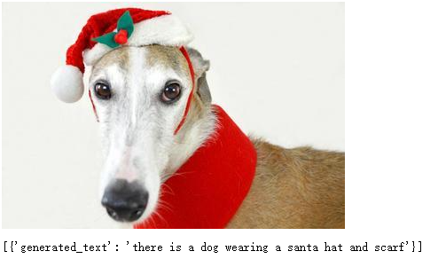

## Captioning with `gr.Interface()`


gr.Image()

- The `type` parameter is the format that the `fn` function expects to receive as its input.  If `type` is `numpy` or `pil`, `gr.Image()` will convert the uploaded file to this format before sending it to the `fn` function.
- If `type` is `filepath`, `gr.Image()` will temporarily store the image and provide a string path to that image location as input to the `fn` function.


```py
import gradio as gr 

def image_to_base64_str(pil_image):
    byte_arr = io.BytesIO()
    pil_image.save(byte_arr, format='PNG')
    byte_arr = byte_arr.getvalue()
    return str(base64.b64encode(byte_arr).decode('utf-8'))

def captioner(image):
    base64_image = image_to_base64_str(image)
    result = get_completion(base64_image)
    return result[0]['generated_text']

gr.close_all()
demo = gr.Interface(fn=captioner,
                    inputs=[gr.Image(label="Upload image", type="pil")],
                    outputs=[gr.Textbox(label="Caption")],
                    title="Image Captioning with BLIP",
                    description="Caption any image using the BLIP model",
                    allow_flagging="never",
                    examples=["christmas_dog.jpeg", "bird_flight.jpeg", "cow.jpeg"])

demo.launch(share=True, server_port=int(os.environ['PORT1']))
```

Output

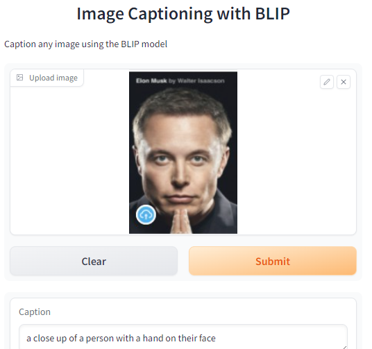


# L3: Image generation app 🎨


```py
import os
import io
import IPython.display
from PIL import Image
import base64 
from dotenv import load_dotenv, find_dotenv
_ = load_dotenv(find_dotenv()) # read local .env file
hf_api_key = os.environ['HF_API_KEY']
```


```py
# Helper function
import requests, json

#Text-to-image endpoint
def get_completion(inputs, parameters=None, ENDPOINT_URL=os.environ['HF_API_TTI_BASE']):
    headers = {
      "Authorization": f"Bearer {hf_api_key}",
      "Content-Type": "application/json"
    }   
    data = { "inputs": inputs }
    if parameters is not None:
        data.update({"parameters": parameters})
    response = requests.request("POST",
                                ENDPOINT_URL,
                                headers=headers,
                                data=json.dumps(data))
    return json.loads(response.content.decode("utf-8"))
```

## Building an image generation app 

Here we are going to run `runwayml/stable-diffusion-v1-5` using the `🧨 diffusers` library.


```py
prompt = "a dog in a park"

result = get_completion(prompt)
IPython.display.HTML(f'')
```

Output


## Generating with `gr.Interface()`


```py
import gradio as gr 

#A helper function to convert the PIL image to base64
#so you can send it to the API
def base64_to_pil(img_base64):
    base64_decoded = base64.b64decode(img_base64)
    byte_stream = io.BytesIO(base64_decoded)
    pil_image = Image.open(byte_stream)
    return pil_image

def generate(prompt):
    output = get_completion(prompt)
    result_image = base64_to_pil(output)
    return result_image

gr.close_all()
demo = gr.Interface(fn=generate,
                    inputs=[gr.Textbox(label="Your prompt")],
                    outputs=[gr.Image(label="Result")],
                    title="Image Generation with Stable Diffusion",
                    description="Generate any image with Stable Diffusion",
                    allow_flagging="never",
                    examples=["the spirit of a tamagotchi wandering in the city of Vienna","a mecha robot in a favela"])

demo.launch(share=True, server_port=int(os.environ['PORT1']))
```


Input

A photo of a lovely bike

Output


## Building a more advanced interface


```py
import gradio as gr 

#A helper function to convert the PIL image to base64 
# so you can send it to the API
def base64_to_pil(img_base64):
    base64_decoded = base64.b64decode(img_base64)
    byte_stream = io.BytesIO(base64_decoded)
    pil_image = Image.open(byte_stream)
    return pil_image

def generate(prompt, negative_prompt, steps, guidance, width, height):
    params = {
        "negative_prompt": negative_prompt,
        "num_inference_steps": steps,
        "guidance_scale": guidance,
        "width": width,
        "height": height
    }
    
    output = get_completion(prompt, params)
    pil_image = base64_to_pil(output)
    return pil_image
```


#### gr.Slider()
- You can set the `minimum`, `maximum`, and starting `value` for a `gr.Slider()`.
- If you want the slider to increment by integer values, you can set `step=1`.


```py
gr.close_all()
demo = gr.Interface(fn=generate,
                    inputs=[
                        gr.Textbox(label="Your prompt"),
                        gr.Textbox(label="Negative prompt"),
                        gr.Slider(label="Inference Steps", minimum=1, maximum=100, value=25,
                                 info="In how many steps will the denoiser denoise the image?"),
                        gr.Slider(label="Guidance Scale", minimum=1, maximum=20, value=7, 
                                  info="Controls how much the text prompt influences the result"),
                        gr.Slider(label="Width", minimum=64, maximum=512, step=64, value=512),
                        gr.Slider(label="Height", minimum=64, maximum=512, step=64, value=512),
                    ],
                    outputs=[gr.Image(label="Result")],
                    title="Image Generation with Stable Diffusion",
                    description="Generate any image with Stable Diffusion",
                    allow_flagging="never"
                    )

demo.launch(share=True, server_port=int(os.environ['PORT2']))
```


Output

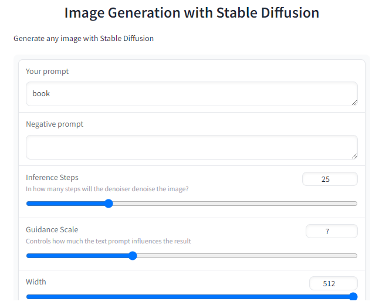


#### `gr.Blocks()`

- Within `gr.Blocks()`, you can define multiple `gr.Row()`s, or multiple `gr.Column()`s.
- Note that if the jupyter notebook is very narrow, the layout may change to better display the objects.  If you define two columns but don't see the two columns in the app, try expanding the width of your web browser, and the screen containing this jupyter notebook.

- When using `gr.Blocks()`, you'll need to explicitly define the "Submit" button using `gr.Button()`, whereas the 'Clear' and 'Submit' buttons are automatically added when using `gr.Interface()`.


```py
with gr.Blocks() as demo:
    gr.Markdown("# Image Generation with Stable Diffusion")
    prompt = gr.Textbox(label="Your prompt")
    with gr.Row():
        with gr.Column():
            negative_prompt = gr.Textbox(label="Negative prompt")
            steps = gr.Slider(label="Inference Steps", minimum=1, maximum=100, value=25,
                      info="In many steps will the denoiser denoise the image?")
            guidance = gr.Slider(label="Guidance Scale", minimum=1, maximum=20, value=7,
                      info="Controls how much the text prompt influences the result")
            width = gr.Slider(label="Width", minimum=64, maximum=512, step=64, value=512)
            height = gr.Slider(label="Height", minimum=64, maximum=512, step=64, value=512)
            btn = gr.Button("Submit")
        with gr.Column():
            output = gr.Image(label="Result")

    btn.click(fn=generate, inputs=[prompt,negative_prompt,steps,guidance,width,height], outputs=[output])
gr.close_all()
demo.launch(share=True, server_port=int(os.environ['PORT2']))
```


#### scale

- To choose how much relative width to give to each column, set the `scale` parameter of each `gr.Column()`.  
- If one column has `scale=4` and the second column has `scale=1`, then the first column takes up 4/5 of the total width, and the second column takes up 1/5 of the total width.

#### gr.Accordion()
- The `gr.Accordion()` can show/hide  the app options with a mouse click.
- Set `open=True` to show the contents of the Accordion by default, or `False` to hide it by default.


```py
with gr.Blocks() as demo:
    gr.Markdown("# Image Generation with Stable Diffusion")
    with gr.Row():
        with gr.Column(scale=4):
            prompt = gr.Textbox(label="Your prompt") #Give prompt some real estate
        with gr.Column(scale=1, min_width=50):
            btn = gr.Button("Submit") #Submit button side by side!
    with gr.Accordion("Advanced options", open=False): #Let's hide the advanced options!
            negative_prompt = gr.Textbox(label="Negative prompt")
            with gr.Row():
                with gr.Column():
                    steps = gr.Slider(label="Inference Steps", minimum=1, maximum=100, value=25,
                      info="In many steps will the denoiser denoise the image?")
                    guidance = gr.Slider(label="Guidance Scale", minimum=1, maximum=20, value=7,
                      info="Controls how much the text prompt influences the result")
                with gr.Column():
                    width = gr.Slider(label="Width", minimum=64, maximum=512, step=64, value=512)
                    height = gr.Slider(label="Height", minimum=64, maximum=512, step=64, value=512)
    output = gr.Image(label="Result") #Move the output up too
            
    btn.click(fn=generate, inputs=[prompt,negative_prompt,steps,guidance,width,height], outputs=[output])

gr.close_all()
demo.launch(share=True, server_port=int(os.environ['PORT4']))
```


Output

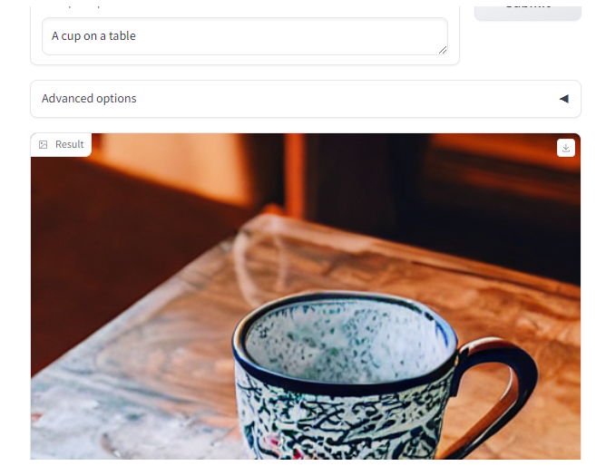


# L4: Describe-and-Generate game 🖍️


Construct a game app

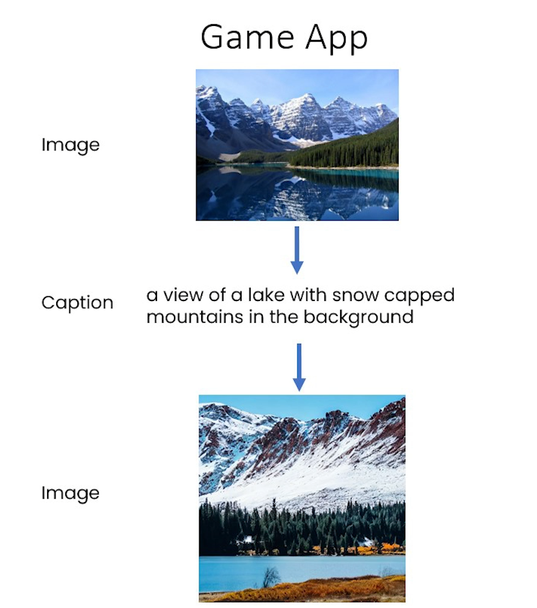


```py
import os
import io
from IPython.display import Image, display, HTML
from PIL import Image
import base64 

from dotenv import load_dotenv, find_dotenv
_ = load_dotenv(find_dotenv()) # read local .env file
hf_api_key = os.environ['HF_API_KEY']
```


```py
#### Helper function
import requests, json

#Here we are going to call multiple endpoints!
def get_completion(inputs, parameters=None, ENDPOINT_URL=""):
    headers = {
      "Authorization": f"Bearer {hf_api_key}",
      "Content-Type": "application/json"
    }   
    data = { "inputs": inputs }
    if parameters is not None:
        data.update({"parameters": parameters})
    response = requests.request("POST",
                                ENDPOINT_URL,
                                headers=headers,
                                data=json.dumps(data))
    return json.loads(response.content.decode("utf-8"))
```


```py
#text-to-image
TTI_ENDPOINT = os.environ['HF_API_TTI_BASE']
#image-to-text
ITT_ENDPOINT = os.environ['HF_API_ITT_BASE']
```

## Building your game with `gr.Blocks()`


```py
#Bringing the functions from lessons 3 and 4!
def image_to_base64_str(pil_image):
    byte_arr = io.BytesIO()
    pil_image.save(byte_arr, format='PNG')
    byte_arr = byte_arr.getvalue()
    return str(base64.b64encode(byte_arr).decode('utf-8'))

def base64_to_pil(img_base64):
    base64_decoded = base64.b64decode(img_base64)
    byte_stream = io.BytesIO(base64_decoded)
    pil_image = Image.open(byte_stream)
    return pil_image

def captioner(image):
    base64_image = image_to_base64_str(image)
    result = get_completion(base64_image, None, ITT_ENDPOINT)
    return result[0]['generated_text']

def generate(prompt):
    output = get_completion(prompt, None, TTI_ENDPOINT)
    result_image = base64_to_pil(output)
    return result_image
```

### First attempt, just captioning


```py
import gradio as gr 
with gr.Blocks() as demo:
    gr.Markdown("# Describe-and-Generate game 🖍️")
    image_upload = gr.Image(label="Your first image",type="pil")
    btn_caption = gr.Button("Generate caption")
    caption = gr.Textbox(label="Generated caption")
    
    btn_caption.click(fn=captioner, inputs=[image_upload], outputs=[caption])

gr.close_all()
demo.launch(share=True, server_port=int(os.environ['PORT1']))
```


Output

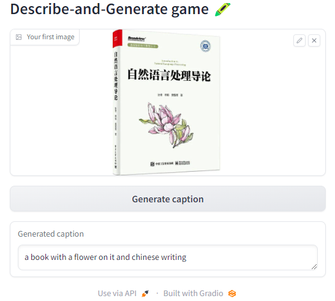

### Let's add generation


```py
with gr.Blocks() as demo:
    gr.Markdown("# Describe-and-Generate game 🖍️")
    image_upload = gr.Image(label="Your first image",type="pil")
    btn_caption = gr.Button("Generate caption")
    caption = gr.Textbox(label="Generated caption")
    btn_image = gr.Button("Generate image")
    image_output = gr.Image(label="Generated Image")
    btn_caption.click(fn=captioner, inputs=[image_upload], outputs=[caption])
    btn_image.click(fn=generate, inputs=[caption], outputs=[image_output])

gr.close_all()
demo.launch(share=True, server_port=int(os.environ['PORT2']))
```

Output

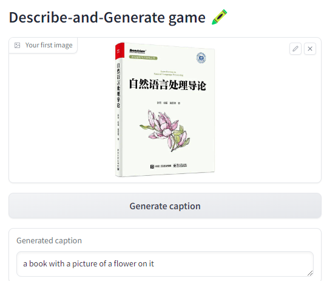

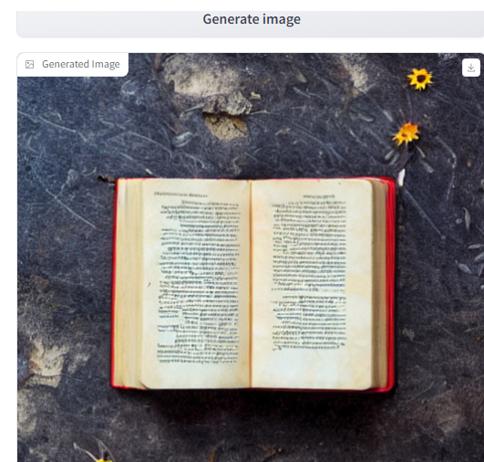

### Doing it all at once


```py
def caption_and_generate(image):
    caption = captioner(image)
    image = generate(caption)
    return [caption, image]

with gr.Blocks() as demo:
    gr.Markdown("# Describe-and-Generate game 🖍️")
    image_upload = gr.Image(label="Your first image",type="pil")
    btn_all = gr.Button("Caption and generate")
    caption = gr.Textbox(label="Generated caption")
    image_output = gr.Image(label="Generated Image")

    btn_all.click(fn=caption_and_generate, inputs=[image_upload], outputs=[caption, image_output])

gr.close_all()
demo.launch(share=True, server_port=int(os.environ['PORT3']))
```


Output

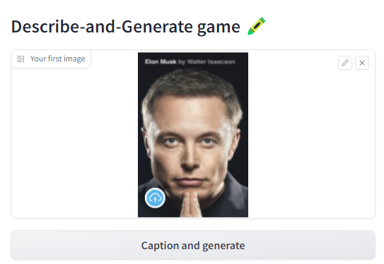

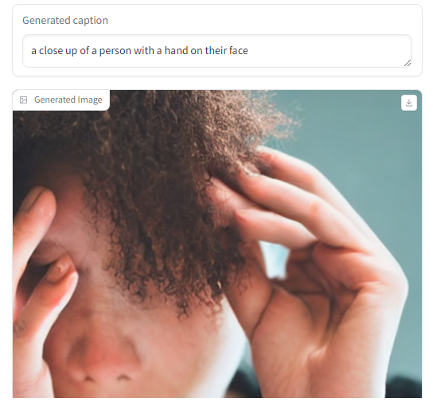


# L5: Chat with any LLM! 💬


```py
import os
import io
import IPython.display
from PIL import Image
import base64 
import requests 
requests.adapters.DEFAULT_TIMEOUT = 60

from dotenv import load_dotenv, find_dotenv
_ = load_dotenv(find_dotenv()) # read local .env file
hf_api_key = os.environ['HF_API_KEY']
```


```py
# Helper function
import requests, json
from text_generation import Client

#FalcomLM-instruct endpoint on the text_generation library
client = Client(os.environ['HF_API_FALCOM_BASE'], headers={"Authorization": f"Basic {hf_api_key}"}, timeout=120)
```

## Building an app to chat with any LLM

Here we'll be using an [Inference Endpoint](https://huggingface.co/inference-endpoints) for `falcon-40b-instruct` , the best ranking open source LLM on the [🤗 Open LLM Leaderboard](https://huggingface.co/spaces/HuggingFaceH4/open_llm_leaderboard). 


```py
prompt = "Has math been invented or discovered?"
client.generate(prompt, max_new_tokens=256).generated_text
```

Output

```py
'\nMath has been both invented and discovered. It is a human invention in the sense that it is a system of rules and concepts that we have created to help us understand the world around us. However, it is also a discovery in the sense that it is a fundamental aspect of the universe that we have uncovered through our observations and experiments.'
```


```py
#Back to Lesson 2, time flies!
import gradio as gr
def generate(input, slider):
    output = client.generate(input, max_new_tokens=slider).generated_text
    return output

demo = gr.Interface(fn=generate, 
                    inputs=[gr.Textbox(label="Prompt"), 
                            gr.Slider(label="Max new tokens", 
                                      value=20,  
                                      maximum=1024, 
                                      minimum=1)], 
                    outputs=[gr.Textbox(label="Completion")])

gr.close_all()
demo.launch(share=True, server_port=int(os.environ['PORT1']))
```

Output

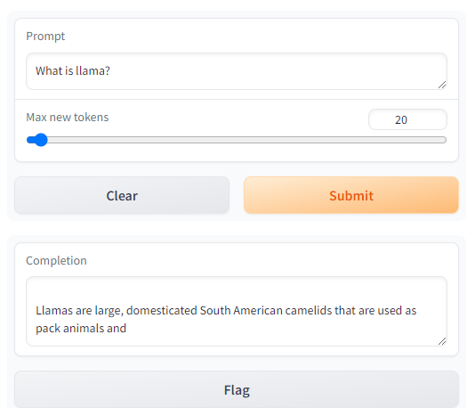


## `gr.Chatbot()`

- `gr.Chatbot()` allows you to save the chat history (between the user and the LLM) as well as display the dialogue in the app.
- Define your `fn` to take in a `gr.Chatbot()` object.  
  - Within your defined `fn` function, append a tuple (or a list) containing the user message and the LLM's response:
  `chatbot_object.append( (user_message, llm_message) )`

- Include the chatbot object in both the inputs and the outputs of the app.


```py
import random

def respond(message, chat_history):
        #No LLM here, just respond with a random pre-made message
        bot_message = random.choice(["Tell me more about it", 
                                     "Cool, but I'm not interested", 
                                     "Hmmmm, ok then"]) 
        chat_history.append((message, bot_message))
        return "", chat_history

with gr.Blocks() as demo:
    chatbot = gr.Chatbot(height=240) #just to fit the notebook
    msg = gr.Textbox(label="Prompt")	
    btn = gr.Button("Submit")
    clear = gr.ClearButton(components=[msg, chatbot], value="Clear console")

    btn.click(respond, inputs=[msg, chatbot], outputs=[msg, chatbot])
    msg.submit(respond, inputs=[msg, chatbot], outputs=[msg, chatbot]) #Press enter to submit

gr.close_all()
demo.launch(share=True, server_port=int(os.environ['PORT2']))
```

Output

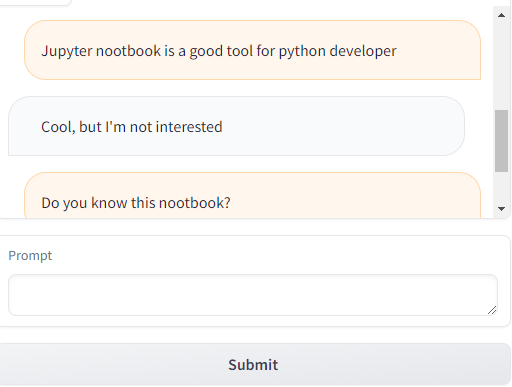


Format the prompt with the chat history

- You can iterate through the chatbot object with a for loop.
- Each item is a tuple containing the user message and the LLM's message.

```Python
for turn in chat_history:
    user_msg, bot_msg = turn
    ...
```


```py
def format_chat_prompt(message, chat_history):
    prompt = ""
    for turn in chat_history:
        user_message, bot_message = turn
        prompt = f"{prompt}\nUser: {user_message}\nAssistant: {bot_message}"
    prompt = f"{prompt}\nUser: {message}\nAssistant:"
    return prompt

def respond(message, chat_history):
        formatted_prompt = format_chat_prompt(message, chat_history)
        bot_message = client.generate(formatted_prompt,
                                     max_new_tokens=1024,
                                     stop_sequences=["\nUser:", "<|endoftext|>"]).generated_text
        chat_history.append((message, bot_message))
        return "", chat_history

with gr.Blocks() as demo:
    chatbot = gr.Chatbot(height=240) #just to fit the notebook
    msg = gr.Textbox(label="Prompt")
    btn = gr.Button("Submit")
    clear = gr.ClearButton(components=[msg, chatbot], value="Clear console")

    btn.click(respond, inputs=[msg, chatbot], outputs=[msg, chatbot])
    msg.submit(respond, inputs=[msg, chatbot], outputs=[msg, chatbot]) #Press enter to submit

gr.close_all()
demo.launch(share=True, server_port=int(os.environ['PORT3']))
```


### Adding other advanced features


```py
def format_chat_prompt(message, chat_history, instruction):
    prompt = f"System:{instruction}"
    for turn in chat_history:
        user_message, bot_message = turn
        prompt = f"{prompt}\nUser: {user_message}\nAssistant: {bot_message}"
    prompt = f"{prompt}\nUser: {message}\nAssistant:"
    return prompt
```


### Streaming

- If your LLM can provide its tokens one at a time in a stream, you can accumulate those tokens in the chatbot object.
- The `for` loop in the following function goes through all the tokens that are in the stream and appends them to the most recent conversational turn in the chatbot's message history.


```py
def respond(message, chat_history, instruction, temperature=0.7):
    prompt = format_chat_prompt(message, chat_history, instruction)
    chat_history = chat_history + [[message, ""]]
    stream = client.generate_stream(prompt,
                                      max_new_tokens=1024,
                                      stop_sequences=["\nUser:", "<|endoftext|>"],
                                      temperature=temperature)
                                      #stop_sequences to not generate the user answer
    acc_text = ""
    #Streaming the tokens
    for idx, response in enumerate(stream):
            text_token = response.token.text

            if response.details:
                return

            if idx == 0 and text_token.startswith(" "):
                text_token = text_token[1:]

            acc_text += text_token
            last_turn = list(chat_history.pop(-1))
            last_turn[-1] += acc_text
            chat_history = chat_history + [last_turn]
            yield "", chat_history
            acc_text = ""
```


```py
with gr.Blocks() as demo:
    chatbot = gr.Chatbot(height=240) #just to fit the notebook
    msg = gr.Textbox(label="Prompt")
    with gr.Accordion(label="Advanced options",open=False):
        system = gr.Textbox(label="System message", lines=2, value="A conversation between a user and an LLM-based AI assistant. The assistant gives helpful and honest answers.")
        temperature = gr.Slider(label="temperature", minimum=0.1, maximum=1, value=0.7, step=0.1)
    btn = gr.Button("Submit")
    clear = gr.ClearButton(components=[msg, chatbot], value="Clear console")

    btn.click(respond, inputs=[msg, chatbot, system], outputs=[msg, chatbot])
    msg.submit(respond, inputs=[msg, chatbot, system], outputs=[msg, chatbot]) #Press enter to submit

gr.close_all()
demo.queue().launch(share=True, server_port=int(os.environ['PORT4']))    
```

Output

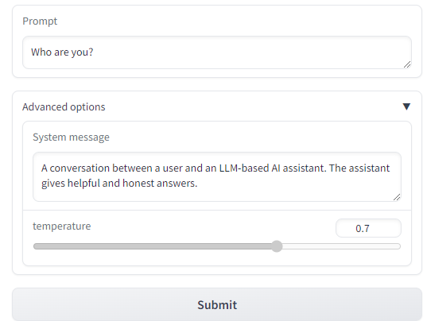

Notice, in the cell above, you have used `demo.queue().launch()` instead of `demo.launch()`. "queue" helps you to boost up the performance for your demo. You can read [setting up a demo for maximum performance](https://www.gradio.app/guides/setting-up-a-demo-for-maximum-performance) for more details.


# Afterword

2024年6月1日19点52分完成这门课的学习，了解了gradio的基本用法。


