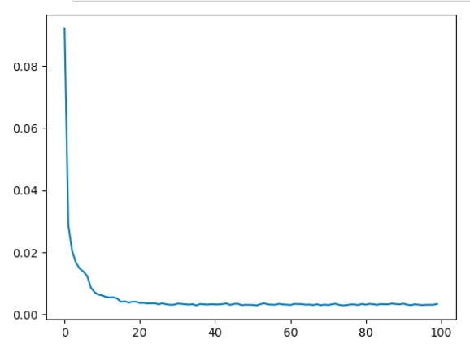
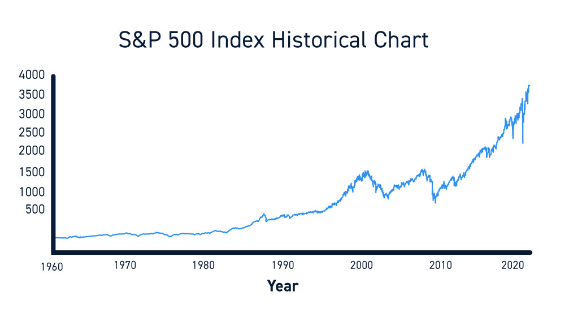
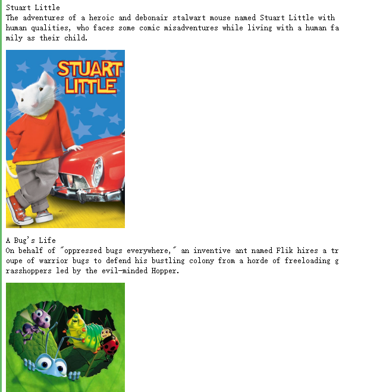

# Building Multimodal Search and RAG


本文是学习 [https://www.deeplearning.ai/short-courses/building-multimodal-search-and-rag/](https://www.deeplearning.ai/short-courses/building-multimodal-search-and-rag/) 这门课的学习笔记。


## What you’ll learn in this course

Learn how to build multimodal search and RAG systems. RAG systems enhance an LLM by incorporating proprietary data into the prompt context. Typically, RAG applications use text documents, but, what if the desired context includes multimedia like images, audio, and video? This course covers the technical aspects of implementing RAG with multimodal data to accomplish this.

- Learn how multimodal models are trained through contrastive learning and implement it on a real dataset.
- Build any-to-any multimodal search to retrieve relevant context across different data types.
- Learn how LLMs are trained to understand multimodal data through visual instruction tuning and use them on multiple image reasoning examples
- Implement an end-to-end multimodal RAG system that analyzes retrieved multimodal context to generate insightful answers
- Explore industry applications like visually analyzing invoices and flowcharts to output structured data.
- Create a multi-vector recommender system that suggests relevant items by comparing their similarities across multiple modalities.

As AI systems increasingly need to process and reason over multiple data modalities, learning how to build such systems is an important skill for AI developers.

This course equips you with the key skills to embed, retrieve, and generate across different modalities. By gaining a strong foundation in multimodal AI, you’ll be prepared to build smarter search, RAG, and recommender systems.


@[toc]


# L1: Overview of Multimodality


## Introduction of multi-model


Multi-model embedding


训练多模态模型


整个流程


对比学习


对比学习的loss function


Understanding the Contrastive loss function


## code


* In this classroom, the libraries have been already installed for you.
* If you would like to run this code on your own machine, you need to install the following:
```py
    !pip install -q accelerate torch
    !pip install -U scikit-learn
    !pip install umap-learn
    !pip install tqdm
```


## Import libraries


```py
# Import neural network training libraries
import torch
from torch import nn, optim
from torch.utils.data import DataLoader
from torchvision import transforms

# Import basic computation libraries along with data visualization and plotting libraries
import numpy as np
import pandas as pd
import matplotlib.pyplot as plt
from tqdm.notebook import tqdm
from sklearn.decomposition import PCA
import umap
import umap.plot
import plotly.graph_objs as go
import plotly.io as pio
pio.renderers.default = 'iframe'

# Import our data class which will organize MNIST and provide anchor, positive and negative samples.
from mnist_dataset import MNISTDataset
```

## Load MNIST Dataset


```py
# Load data from csv
data = pd.read_csv('digit-recognizer/train.csv')
val_count = 1000
# common transformation for both val and train
default_transform = transforms.Compose([
    transforms.ToPILImage(),
    transforms.ToTensor(),
    transforms.Normalize(0.5, 0.5)
])

# Split data into val and train
dataset = MNISTDataset(data.iloc[:-val_count], default_transform)
val_dataset = MNISTDataset(data.iloc[-val_count:], default_transform)
```

## Setup our DataLoaders


```py
# Create torch dataloaders
trainLoader = DataLoader(
    dataset,
    batch_size=16, # feel free to modify this value
    shuffle=True,
    pin_memory=True,
    num_workers=2,
    prefetch_factor=100
)

valLoader = DataLoader(val_dataset,
    batch_size=64,
    shuffle=True,
    pin_memory=True,
    num_workers=2,
    prefetch_factor=100
)
```

### Visualize datapoints


```py
# Function to display images with labels
def show_images(images, title=''):
    num_images = len(images)
    fig, axes = plt.subplots(1, num_images, figsize=(9, 3))
    for i in range(num_images):
        img = np.squeeze(images[i])
        axes[i].imshow(img, cmap='gray')
        axes[i].axis('off')
    fig.suptitle(title)
    plt.show()

# Visualize some examples
for batch_idx, (anchor_images, contrastive_images, distances, labels) in enumerate(trainLoader):
    # Convert tensors to numpy arrays
    anchor_images = anchor_images.numpy()
    contrastive_images = contrastive_images.numpy()
    labels = labels.numpy()
    
    # Display some samples from the batch
    show_images(anchor_images[:4], title='Anchor Image')
    show_images(contrastive_images[:4], title='+/- Example')
    
    # Break after displaying one batch for demonstration
    break

```

Output


## Build Neural Network Architecture


```py
# Define a neural network architecture with two convolution layers and two fully connected layers
# Input to the network is an MNIST image and Output is a 64 dimensional representation. 
class Network(nn.Module):
    def __init__(self):
        super(Network, self).__init__()
        self.conv1 = nn.Sequential(
            nn.Conv2d(1, 32, 5),
            nn.BatchNorm2d(32),
            nn.ReLU(inplace=True),
            nn.MaxPool2d((2, 2), stride=2),
            nn.Dropout(0.3)
        )
        self.conv2 = nn.Sequential(
            nn.Conv2d(32, 64, 5),
            nn.BatchNorm2d(64),
            nn.ReLU(inplace=True),
            nn.MaxPool2d((2, 2), stride=2),
            nn.Dropout(0.3)
        )
        self.linear1 = nn.Sequential(
            nn.Linear(64 * 4 * 4, 512),
            nn.ReLU(inplace=True),
            nn.Dropout(0.3),
            nn.Linear(512, 64),
        )

    def forward(self, x):
        x = self.conv1(x) # x: d * 32 * 12 * 12
        x = self.conv2(x) # x: d * 64 * 4  * 4 
        x = x.view(x.size(0), -1) # x: d * (64*4*4)
        x = self.linear1(x) # x: d * 64
        return x
```

## Contrastive Loss Function


```py
# The ideal distance metric for a positive sample is set to 1, for a negative sample it is set to 0      
class ContrastiveLoss(nn.Module):
    def __init__(self):
        super(ContrastiveLoss, self).__init__()
        self.similarity = nn.CosineSimilarity(dim=-1, eps=1e-7)

    def forward(self, anchor, contrastive, distance):
        # use cosine similarity from torch to get score
        score = self.similarity(anchor, contrastive)
        # after cosine apply MSE between distance and score
        return nn.MSELoss()(score, distance) #Ensures that the calculated score is close to the ideal distance (1 or 0)
```

Define the Training Configuration


```py
net = Network()

device = 'cpu'
if torch.cuda.is_available():
    device = torch.device('cuda:0')
    
net = net.to(device)
device
```


```py
# Define the training configuration
optimizer = optim.Adam(net.parameters(), lr=0.005)
loss_function = ContrastiveLoss()
scheduler = optim.lr_scheduler.StepLR(optimizer, step_size=7, gamma=0.3)
```


## Training Loop

```py
import os

# Define a directory to save the checkpoints
checkpoint_dir = 'checkpoints/'

# Ensure the directory exists
if not os.path.exists(checkpoint_dir):
    os.makedirs(checkpoint_dir)
```

### Model Training

```py
def train_model(epoch_count=10):#
    net = Network()
    lrs = []
    losses = []

    for epoch in range(epoch_count):
        epoch_loss = 0
        batches=0
        print('epoch -', epoch)
        lrs.append(optimizer.param_groups[0]['lr'])
        print('learning rate', lrs[-1])
    
        for anchor, contrastive, distance, label in tqdm(trainLoader):
            batches += 1
            optimizer.zero_grad()
            anchor_out = net(anchor.to(device))
            contrastive_out = net(contrastive.to(device))
            distance = distance.to(torch.float32).to(device)
            loss = loss_function(anchor_out, contrastive_out, distance)
            epoch_loss += loss
            loss.backward()
            optimizer.step()

        losses.append(epoch_loss.cpu().detach().numpy() / batches)
        scheduler.step()
        print('epoch_loss', losses[-1])
    
        # Save a checkpoint of the model
        checkpoint_path = os.path.join(checkpoint_dir, f'model_epoch_{epoch}.pt')
        torch.save(net.state_dict(), checkpoint_path)

    return {
        "net": net,
        "losses": losses
    }
```

### Load from Backup

```py
def load_model_from_checkpoint():
    checkpoint = torch.load('checkpoints/model_epoch_99.pt')
    
    net = Network()
    net.load_state_dict(checkpoint)
    net.eval()

    return net
```

### Get the Model

<p style="background-color:#fff6e4; padding:15px; border-width:3px; border-color:#f5ecda; border-style:solid; border-radius:6px"> <b>(Note: <code>train = False</code>):</b> We've saved the trained model and are loading it here for speedier results, allowing you to observe the outcomes faster. Once you've done an initial run, you may set <code>train</code> to <code>True</code> to train the model yourself. This can take some time to finsih, depending the value you set for the <code>epoch_count</code>.</p>


```py
train = False # set to True to run train the model

if train:
    training_result = train_model()
    model = training_result["net"]
else:
    model = load_model_from_checkpoint()
```

### Visualize the loss curve for your trained model


```py
from IPython.display import Image

if train:
    # show loss curve from your training.
    plt.plot(training_result["losses"])
    plt.show()
else:
    # If you are loading a checkpoint instead of training the model (train = False),
    # the following line will show a pre-saved loss curve from the checkpoint data.
    display(Image(filename="images/loss-curve.png", height=600, width=600))
```

Output



## Visualize the Vector Space!

### Generate 64d Representations of the Training Set

```py
encoded_data = []
labels = []

with torch.no_grad():
    for anchor, _, _, label in tqdm(trainLoader):
        output = model(anchor.to(device))
        encoded_data.extend(output.cpu().numpy())
        labels.extend(label.cpu().numpy())

encoded_data = np.array(encoded_data)
labels = np.array(labels)
```

### Reduce Dimensionality of Data: 64d -> 3d

```py
# Apply PCA to reduce dimensionality of data from 64d -> 3d to make it easier to visualize!
pca = PCA(n_components=3)
encoded_data_3d = pca.fit_transform(encoded_data)
```

### Interactive Scatter Plot in 3d – with PCA

```py
scatter = go.Scatter3d(
    x=encoded_data_3d[:, 0],
    y=encoded_data_3d[:, 1],
    z=encoded_data_3d[:, 2],
    mode='markers',
    marker=dict(size=4, color=labels, colorscale='Viridis', opacity=0.8),
    text=labels, 
    hoverinfo='text',
)

# Create layout
layout = go.Layout(
    title="MNIST Dataset - Encoded and PCA Reduced 3D Scatter Plot",
    scene=dict(
        xaxis=dict(title="PC1"),
        yaxis=dict(title="PC2"),
        zaxis=dict(title="PC3"),
    ),
    width=1000, 
    height=750,
)

# Create figure and add scatter plot
fig = go.Figure(data=[scatter], layout=layout)

# Show the plot
fig.show()
```

Output


### Scatterplot in 2d - with UMAP

```py
mapper = umap.UMAP(random_state=42, metric='cosine').fit(encoded_data)
umap.plot.points(mapper, labels=labels);
```

Output


### UMAP with Euclidian Metric

```py
mapper = umap.UMAP(random_state=42).fit(encoded_data) 
umap.plot.points(mapper, labels=labels);
```

Output


## Contrastive Training over 100 Epochs!


# L2: Multimodal Search


* In this classroom, the libraries have been already installed for you.
* If you would like to run this code on your own machine, you need to install the following:
```py
    !pip install -U weaviate-client
```


## Setup
### Load environment variables and API keys


```py
import os
from dotenv import load_dotenv, find_dotenv
_ = load_dotenv(find_dotenv()) # read local .env file
EMBEDDING_API_KEY = os.getenv("EMBEDDING_API_KEY")
```


## Connect to Weaviate


```py
import weaviate, os

client = weaviate.connect_to_embedded(
    version="1.24.4",
    environment_variables={
        "ENABLE_MODULES": "backup-filesystem,multi2vec-palm",
        "BACKUP_FILESYSTEM_PATH": "/home/jovyan/work/backups",
    },
    headers={
        "X-PALM-Api-Key": EMBEDDING_API_KEY,
    }
)

client.is_ready()
```

## Create the Collection

```py
from weaviate.classes.config import Configure

# Just checking if you ever need to re run it
if(client.collections.exists("Animals")):
    client.collections.delete("Animals")
    
client.collections.create(
    name="Animals",
    vectorizer_config=Configure.Vectorizer.multi2vec_palm(
        image_fields=["image"],
        video_fields=["video"],
        project_id="semi-random-dev",
        location="us-central1",
        model_id="multimodalembedding@001",
        dimensions=1408,        
    )
)
```


## Helper functions

```py
import base64

# Helper function to convert a file to base64 representation
def toBase64(path):
    with open(path, 'rb') as file:
        return base64.b64encode(file.read()).decode('utf-8')
```

## Insert Images into Weaviate


```py
animals = client.collections.get("Animals")

source = os.listdir("./source/animal_image/")

with animals.batch.rate_limit(requests_per_minute=100) as batch:
    for name in source:
        print(f"Adding {name}")
        
        path = "./source/image/" + name
    
        batch.add_object({
            "name": name,            # name of the file
            "path": path,            # path to the file to display result
            "image": toBase64(path), # this gets vectorized - "image" was configured in vectorizer_config as the property holding images
            "mediaType": "image",    # a label telling us how to display the resource 
        })
```

Output

```py
Adding cat1.jpg
Adding dog3.jpg
Adding dog1.jpg
Adding cat3.jpg
Adding meerkat2.jpg
Adding cat2.jpg
Adding meerkat1.jpg
Adding dog2.jpg
Adding meerkat3.jpg
```


```py
# Check for failed objects
if len(animals.batch.failed_objects) > 0:
    print(f"Failed to import {len(animals.batch.failed_objects)} objects")
    for failed in animals.batch.failed_objects:
        print(f"e.g. Failed to import object with error: {failed.message}")
else:
    print("No errors")
```

Output

```py
No errors
```


## Insert Video Files into Weaviate
> Note: the input video must be at least 4 seconds long.


```py
animals = client.collections.get("Animals")

source = os.listdir("./source/video/")

for name in source:
    print(f"Adding {name}")
    path = "./source/video/" + name    

    # insert videos one by one
    animals.data.insert({
        "name": name,
        "path": path,
        "video": toBase64(path),
        "mediaType": "video"
    })
```

Output

```py
Adding meerkat-watch.mp4
Adding cat-play.mp4
Adding meerkat-dig.mp4
Adding dog-high-five.mp4
Adding dog-with-stick.mp4
Adding cat-clean.mp4
```


```py
# Check for failed objects
if len(animals.batch.failed_objects) > 0:
    print(f"Failed to import {len(animals.batch.failed_objects)} objects")
    for failed in animals.batch.failed_objects:
        print(f"e.g. Failed to import object with error: {failed.message}")
else:
    print("No errors")
```

Output

```py
No errors
```


## Check count
> Total count should be 15 (9x image + 6x video)


```py
agg = animals.aggregate.over_all(
    group_by="mediaType"
)

for group in agg.groups:
    print(group)
```

Output

```py
AggregateGroup(grouped_by=GroupedBy(prop='mediaType', value='image'), properties={}, total_count=9)
AggregateGroup(grouped_by=GroupedBy(prop='mediaType', value='video'), properties={}, total_count=6)
```

## Build MultiModal Search
### Helper Functions


```py
# Helper functions to display results
import json
from IPython.display import Image, Video

def json_print(data):
    print(json.dumps(data, indent=2))

def display_media(item):
    path = item["path"]

    if(item["mediaType"] == "image"):
        display(Image(path, width=300))

    elif(item["mediaType"] == "video"):
        display(Video(path, width=300))
```


```py
import base64, requests

# Helper function – get base64 representation from an online image
def url_to_base64(url):
    image_response = requests.get(url)
    content = image_response.content
    return base64.b64encode(content).decode('utf-8')

# Helper function - get base64 representation from a local file
def file_to_base64(path):
    with open(path, 'rb') as file:
        return base64.b64encode(file.read()).decode('utf-8')
```

## Text to Media Search


```py
animals = client.collections.get("Animals")

response = animals.query.near_text(
    query="dog playing with stick",
    return_properties=['name','path','mediaType'],
    limit=3
)
```


```py
for obj in response.objects:
    json_print(obj.properties)
    display_media(obj.properties)
```


Output


## Image to Media Search

```py
# Use this image as an input for the query
Image("./test/test-cat.jpg", width=300)
```

Output


```py
# The query
response = animals.query.near_image(
    near_image=file_to_base64("./test/test-cat.jpg"),
    return_properties=['name','path','mediaType'],
    limit=3
)

for obj in response.objects:
    json_print(obj.properties)
    display_media(obj.properties)
```

Output


## Image search - from web URL

```py
Image("https://raw.githubusercontent.com/weaviate-tutorials/multimodal-workshop/main/2-multimodal/test/test-meerkat.jpg", width=300)
```

Output


```py
# The query
response = animals.query.near_image(
    near_image=url_to_base64("https://raw.githubusercontent.com/weaviate-tutorials/multimodal-workshop/main/2-multimodal/test/test-meerkat.jpg"),
    return_properties=['name','path','mediaType'],
    limit=3
)

for obj in response.objects:
    json_print(obj.properties)
    display_media(obj.properties)
```

Output


## Video to Media Search
> Note: the input video must be at least 4 seconds long.


```py
Video("./test/test-meerkat.mp4", width=400)
```

Output


```py
from weaviate.classes.query import NearMediaType

response = animals.query.near_media(
    media=file_to_base64("./test/test-meerkat.mp4"),
    media_type=NearMediaType.VIDEO,
    return_properties=['name','path','mediaType'],
    limit=3
)

for obj in response.objects:
    # json_print(obj.properties)
    display_media(obj.properties)
```

Output


## Visualizing a Multimodal Vector Space

> To make this more exciting, let's loadup a large dataset!


```py
import numpy as np
import sklearn.datasets
import pandas as pd
import umap
import umap.plot
import matplotlib.pyplot as plt
```

## Load vector embeddings and mediaType from Weaviate 


```py
client.backup.restore(
    backup_id="resources-img-and-vid",
    include_collections="Resources",
    backend="filesystem"
)

# It can take a few seconds for the "Resources" collection to be ready.
# We add 5 seconds of sleep to make sure it is ready for the next cells to use.
import time
time.sleep(5)
```


```py
# Collection named "Resources"
collection = client.collections.get("Resources")

embs = []
labs = []
for item in collection.iterator(include_vector=True):
    #print(item.properties)\
    labs.append(item.properties['mediaType'])
    embs.append(item.vector)
```


```py
embs2 = [emb['default'] for emb in embs]

emb_df = pd.DataFrame(embs2)
labels = pd.Series(labs)

labels[labels=='image'] = 0
labels[labels=='video'] = 1
```


```py
%%time
mapper2 = umap.UMAP().fit(emb_df)
```

Output

```py
CPU times: user 8min 4s, sys: 14.2 s, total: 8min 18s
Wall time: 3min 1s
```

## Plot the embeddings


```py
plt.figure(figsize=(10, 8))
umap.plot.points(mapper2, labels=labels, theme='fire')

# Show plot
plt.title('UMAP Visualiztion of Embedding Space')
plt.xlabel('UMAP Dimension 1')
plt.ylabel('UMAP Dimension 2')
plt.show();
```

Output


# L3: Large Multimodal Models (LMMs)

Language model


Understanding GPT


Vision transformers


Vision  Instruction Tuning


## Code


* In this classroom, the libraries have been already installed for you.
* If you would like to run this code on your own machine, you need to install the following:
```
    !pip install google-generativeai

```

Note: don't forget to set up your GOOGLE_API_KEY to use the Gemini Vision model in the env file.
```
   %env GOOGLE_API_KEY=************
```
Check the [documentation](https://ai.google.dev/gemini-api/docs/api-key) for more infomation.


## Setup
### Load environment variables and API keys

```py
import os
from dotenv import load_dotenv, find_dotenv

_ = load_dotenv(find_dotenv()) # read local .env file
GOOGLE_API_KEY=os.getenv('GOOGLE_API_KEY')


# Set the genai library
import google.generativeai as genai
from google.api_core.client_options import ClientOptions

genai.configure(
        api_key=GOOGLE_API_KEY,
        transport="rest",
        client_options=ClientOptions(
            api_endpoint=os.getenv("GOOGLE_API_BASE"),
        ),
)
```

> Note: learn more about [GOOGLE_API_KEY](https://ai.google.dev/) to run it locally.

## Helper functions


```py
import textwrap
import PIL.Image
from IPython.display import Markdown, Image

def to_markdown(text):
    text = text.replace('•', '  *')
    return Markdown(textwrap.indent(text, '> ', predicate=lambda _: True))

```


* Function to call LMM (Large Multimodal Model).


```py
def call_LMM(image_path: str, prompt: str) -> str:
    # Load the image
    img = PIL.Image.open(image_path)

    # Call generative model
    model = genai.GenerativeModel('gemini-pro-vision')
    response = model.generate_content([prompt, img], stream=True)
    response.resolve()

    return to_markdown(response.text)  
```

## Analyze images with an LMM

```py
# Pass in an image and see if the LMM can answer questions about it
Image(url= "SP-500-Index-Historical-Chart.jpg")
```

Output




```py
# Use the LMM function
call_LMM("SP-500-Index-Historical-Chart.jpg", 
    "Explain what you see in this image.")
```

Output

```py
The image shows the historical chart of the S&P 500 index. The S&P 500 is a stock market index that tracks the 500 largest publicly traded companies in the United States. The index is considered to be a leading indicator of the overall U.S. stock market.

The chart shows that the S&P 500 index has been on a long-term upward trend since its inception in 1926. However, the index has experienced several periods of volatility, including the Great Depression in the 1930s, the oil crisis in the 1970s, and the financial crisis in 2008.

Despite these periods of volatility, the S&P 500 index has continued to climb over the long term. This is because the U.S. economy has continued to grow over time, and companies have generally been able to increase their earnings.

The S&P 500 index is a valuable tool for investors who want to track the performance of the U.S. stock market. The index can also be used to compare the performance of different investment strategies.
```


## Analyze a harder image

* Try something harder: Here's a figure we explained previously!

```py
Image(url= "clip.png")
```


Output


```py
call_LMM("clip.png", 
    "Explain what this figure is and where is this used.")
```


Output

```py
This figure shows a contrastive pre-training framework for image-text retrieval. Given a set of images and their corresponding texts, the text encoder encodes each text into a text embedding. Similarly, the image encoder encodes each image into an image embedding. To learn the relationship between images and texts, a contrastive loss is computed between the text embedding and the image embedding of each image-text pair. By minimizing the contrastive loss, the model learns to encode images and texts into embeddings that are semantically similar. The pre-trained model can then be used for image-text retrieval, where given an image, the model can retrieve the most relevant text descriptions.
```

## Decode the hidden message


```py
Image(url= "blankimage3.png")
```

Output


```py
# Ask to find the hidden message
call_LMM("blankimage3.png", 
    "Read what you see on this image.")
```

Output

> You can vectorize the whole world with Weaviate!

## How the model sees the picture!

> You have to be careful! The model does not "see" in the same way that we see!


```py
import imageio.v2 as imageio
import numpy as np
import matplotlib.pyplot as plt

image = imageio.imread("blankimage3.png")

# Convert the image to a NumPy array
image_array = np.array(image)

plt.imshow(np.where(image_array[:,:,0]>120, 0,1), cmap='gray');
```

Output


**EXTRA!**  You can use the function below to create your own hidden message, into an image:


```py
# Create a hidden text in an image
def create_image_with_text(text, font_size=20, font_family='sans-serif', text_color='#73D955', background_color='#7ED957'):
    fig, ax = plt.subplots(figsize=(5, 5))
    fig.patch.set_facecolor(background_color)
    ax.text(0.5, 0.5, text, fontsize=font_size, ha='center', va='center', color=text_color, fontfamily=font_family)
    ax.axis('off')
    plt.tight_layout()
    return fig
```


```py
# Modify the text here to create a new hidden message image!
fig = create_image_with_text("Hello, world!") 

# Plot the image with the hidden message
plt.show()
fig.savefig("extra_output_image.png")
```

Output


```py
# Call the LMM function with the image just generated
call_LMM("extra_output_image.png", 
    "Read what you see on this image.")
```

Output

Hello, world!


* It worked!, now plot the image decoding the message.


```py
image = imageio.imread("extra_output_image.png")

# Convert the image to a NumPy array
image_array = np.array(image)

plt.imshow(np.where(image_array[:,:,0]>120, 0,1), cmap='gray');
```

Output


# L4: Multimodal Retrieval Augmented Generation (MM-RAG)


RAG with Weaviate


Multimodal RAG


> In this lesson you'll learn how to leverage Weaviate and Google Gemini Pro Vision to carry out a simple multimodal RAG workflow.


* In this classroom, the libraries have been already installed for you.
* If you would like to run this code on your own machine, you need to install the following:
```py
    !pip install -U weaviate-client
    !pip install google-generativeai
```


## Setup
### Load environment variables and API keys


```py
import os
from dotenv import load_dotenv, find_dotenv
_ = load_dotenv(find_dotenv()) # read local .env file

EMBEDDING_API_KEY = os.getenv("EMBEDDING_API_KEY")
GOOGLE_API_KEY=os.getenv("GOOGLE_API_KEY")
```


### Connect to Weaviate


```py
import weaviate

client = weaviate.connect_to_embedded(
    version="1.24.4",
    environment_variables={
        "ENABLE_MODULES": "backup-filesystem,multi2vec-palm",
        "BACKUP_FILESYSTEM_PATH": "/home/jovyan/work/backups",
    },
    headers={
        "X-PALM-Api-Key": EMBEDDING_API_KEY,
    }
)

client.is_ready()
```


### Restore 13k+ prevectorized resources


```py
client.backup.restore(
    backup_id="resources-img-and-vid",
    include_collections="Resources",
    backend="filesystem"
)

# It can take a few seconds for the "Resources" collection to be ready.
# We add 5 seconds of sleep to make sure it is ready for the next cells to use.
import time
time.sleep(5)
```

### Preview data **count**


```py
from weaviate.classes.aggregate import GroupByAggregate

resources = client.collections.get("Resources")

response = resources.aggregate.over_all(
    group_by=GroupByAggregate(prop="mediaType")
)

# print rounds names and the count for each
for group in response.groups:
    print(f"{group.grouped_by.value} count: {group.total_count}")
```


Output

```py
image count: 13394
video count: 200
```

## Multimodal RAG


### Step 1 – Retrieve content from the database with a query


```py
from IPython.display import Image
from weaviate.classes.query import Filter

def retrieve_image(query):
    resources = client.collections.get("Resources")
# ============
    response = resources.query.near_text(
        query=query,
        filters=Filter.by_property("mediaType").equal("image"), # only return image objects
        return_properties=["path"],
        limit = 1,
    )
# ============
    result = response.objects[0].properties
    return result["path"] # Get the image path
```

### Run image retrieval


```py
# Try with different queries to retreive an image
img_path = retrieve_image("fishing with my buddies")
display(Image(img_path))
```


Output


### Step 2 - Generate a description of the image


```py
import google.generativeai as genai
from google.api_core.client_options import ClientOptions

# Set the Vision model key
genai.configure(
        api_key=GOOGLE_API_KEY,
        transport="rest",
        client_options=ClientOptions(
            api_endpoint=os.getenv("GOOGLE_API_BASE"),
        ),
)
```


```py
# Helper function
import textwrap
import PIL.Image
from IPython.display import Markdown, Image

def to_markdown(text):
    text = text.replace("•", "  *")
    return Markdown(textwrap.indent(text, "> ", predicate=lambda _: True))

def call_LMM(image_path: str, prompt: str) -> str:
    img = PIL.Image.open(image_path)

    model = genai.GenerativeModel("gemini-pro-vision")
    response = model.generate_content([prompt, img], stream=True)
    response.resolve()

    return to_markdown(response.text)    
```


### Run vision request


```py
call_LMM(img_path, "Please describe this image in detail.")
```


Output

```py
The image shows a man kneeling on the grassy bank of a river. He is wearing a green hat and a khaki vest. He is holding a large fish in his hands. The fish is golden brown in color and has a long, pointed snout. The man is smiling and looking down at the fish. There is a dog standing next to the man. The dog is black and white and has a long, shaggy coat. The dog is looking up at the fish. In the background, there is a narrow river with a small weir.
```


## All together


```py
def mm_rag(query):
    # Step 1 - retrieve an image – Weaviate
    SOURCE_IMAGE = retrieve_image(query)
    display(Image(SOURCE_IMAGE))
#===========

    # Step 2 - generate a description - GPT4
    description = call_LMM(SOURCE_IMAGE, "Please describe this image in detail.")
    return description
```


```py
# Call mm_rag function
mm_rag("paragliding through the mountains")
```


Output


```py
A paraglider is flying over a lush green mountain. The paraglider is red and white. The mountain is covered in trees. The sky is blue and there are some clouds in the distance.


```


# L5: Industry Applications


## Code


```py
import os
from dotenv import load_dotenv, find_dotenv
_ = load_dotenv(find_dotenv()) # read local .env file
GOOGLE_API_KEY=os.getenv("GOOGLE_API_KEY")

import google.generativeai as genai
from google.api_core.client_options import ClientOptions
genai.configure(
    api_key=GOOGLE_API_KEY,
    transport="rest",
    client_options=ClientOptions(
        api_endpoint=os.getenv("GOOGLE_API_BASE"),
    )
)
```


## Vision Function


```py
import textwrap
import PIL.Image
from IPython.display import Markdown, Image

def to_markdown(text):
    text = text.replace("•", "  *")
    return Markdown(textwrap.indent(text, "> ", predicate=lambda _: True))

def call_LMM(image_path: str, prompt: str, plain_text: bool=False) -> str:
    img = PIL.Image.open(image_path)

    model = genai.GenerativeModel("gemini-pro-vision")
    response = model.generate_content([prompt, img], stream=True)
    response.resolve()
    
    if(plain_text):
        return response.text
    else:
        return to_markdown(response.text)
```

## Extracting Structured Data from Retreived Images
### Analyzing an invoice


```py
from IPython.display import Image

Image(url="invoice.png")
```

Output


```py
call_LMM("invoice.png",
    """Identify items on the invoice, Make sure you output 
    JSON with quantity, description, unit price and ammount.""")
```

Output

```json
{
  "items": [
    {
      "quantity": 1,
      "description": "Front and rear brake cables",
      "unit_price": 100.00,
      "amount": 100.00
    },
    {
      "quantity": 2,
      "description": "New set of pedal arms",
      "unit_price": 15.00,
      "amount": 30.00
    },
    {
      "quantity": 3,
      "description": "Labor 3hrs",
      "unit_price": 5.00,
      "amount": 15.00
    }
  ],
  "subtotal": 145.00,
  "sales_tax": 9.06,
  "total": 154.06
}
```


```py
# Ask something else
call_LMM("invoice.png",
    """How much would four sets pedal arms cost
    and 6 hours of labour?""",
    plain_text=True
)
```


Output

```py
' A set of pedal arms costs $15, so four sets would cost $60. Six hours of labor at $5 per hour would cost $30. So the total cost would be $60 + $30 = $90.'
```


### Extracting Tables from Images


```py
Image("prosus_table.png")
```

Output


```py
call_LMM("prosus_table.png", 
    "Print the contents of the image as a markdown table.")
```


Output

|           Business | YoY Revenue Growth | TP Margin Improvement | YoY GMV Growth |
| -----------------: | -----------------: | --------------------: | -------------: |
|      Food Delivery |                17% |                 12 pp |            15% |
|        Classifieds |                32% |                 12 pp |            34% |
| Payments & Fintech |                32% |                 15 pp |            20% |
|             Edtech |                11% |                 15 pp |            15% |
|              Etail |                 4% |                  2 pp |             5% |


```py
call_LMM("prosus_table.png", 
    """Analyse the contents of the image as a markdown table.
    Which of the business units has the highest revenue growth?""")
```

Output

|      Business Unit | YoY Revenue Growth | TP Margin Improvement | YoY GMV Growth |
| -----------------: | -----------------: | --------------------: | -------------: |
|      Food Delivery |                17% |                 12 pp |            15% |
|        Classifieds |                32% |                 12 pp |            34% |
| Payments & Fintech |                32% |                 15 pp |            20% |
|             Edtech |                11% |                 15 pp |            15% |
|              Etail |                 4% |                  2 pp |             5% |

The business unit with the highest revenue growth is Classifieds, with 32% YoY growth.


### Analyzing Flow Charts


```py
Image("swimlane-diagram-01.png")
```

Output


```py
call_LMM("swimlane-diagram-01.png", 
    """Provide a summarized breakdown of the flow chart in the image
    in a format of a numbered list.""")
```


Output

1. The client places an order.
   1. The online shop sends an invoice.
   2. The client makes the payment.
   3. The online shop ships the order.
   4. The courier company transports the order.
   5. The client receives the order.
   6. If the client is not satisfied with the order, they can return it for a refund.


```py
call_LMM("swimlane-diagram-01.png", 
    """Analyse the flow chart in the image,
    then output Python code
    that implements this logical flow in one function""")
```

Output

```python
def order_fulfillment(client_order):
    # Step 1: Place an order
    order = Order(client_order)

    # Step 2: Payment
    if order.payment():
        # Step 3: Invoice the order
        order.invoice()

        # Step 4: Ship the order
        if order.ship():
            # Step 5: Transport the order
            order.transport()

            # Step 6: Deliver the order to the customer
            order.deliver()
        else:
            # Step 7: Handle shipping exceptions
            order.handle_shipping_exceptions()
    else:
        # Step 8: Handle payment exceptions
        order.handle_payment_exceptions()
```


* Test the code generate above.

> Note: please be advised that the output may include errors or the functionality may not be fully operational, as it requires additional inputs to function properly.


```py
def order_fulfillment(client, online_shop, courier_company):
   # This function takes three objects as input:
   # - client: the client who placed the order
   # - online_shop: the online shop that received the order
   # - courier_company: the courier company that will deliver the order

   # First, the client places an order.
   order = client.place_order()

   # Then, the client makes a payment for the order.
   payment = client.make_payment(order)

   # If the payment is successful, the order is shipped.
   if payment.status == "successful":
       online_shop.ship_order(order)
       courier_company.transport_order(order)
   
   # If the payment is not successful, the order is canceled.
   else:
       online_shop.cancel_order(order)
       client.refund_order(order)

   # Finally, the order is invoiced.
   online_shop.invoice_order(order)
```


# L6: Multimodal Recommender System

Recommendation


Identified embedding of multi modal


* In this classroom, the libraries have been already installed for you.
* If you would like to run this code on your own machine, you need to install the following:
```
    !pip install -U weaviate-client
    !pip install google-generativeai
    !pip install openai
```


## Setup
### Load environment variables and API keys


```py
import os
from dotenv import load_dotenv, find_dotenv
_ = load_dotenv(find_dotenv()) # read local .env file

MM_EMBEDDING_API_KEY = os.getenv("EMBEDDING_API_KEY")
TEXT_EMBEDDING_API_KEY = os.getenv("OPENAI_API_KEY")
OPENAI_BASEURL = os.getenv("OPENAI_BASE_URL")
```


## Connect to Weaviate


```py
import weaviate

client = weaviate.connect_to_embedded(
    version="1.24.4",
    environment_variables={
        "ENABLE_MODULES": "multi2vec-palm,text2vec-openai"
    },
    headers={
        "X-PALM-Api-Key": MM_EMBEDDING_API_KEY,
        "X-OpenAI-Api-Key": TEXT_EMBEDDING_API_KEY,
        "X-OpenAI-BaseURL": OPENAI_BASEURL
    }
)

client.is_ready()
```


## Create Multivector collection


```py
from weaviate.classes.config import Configure, DataType, Property

# client.collections.delete("Movies")
client.collections.create(
    name="Movies",
    properties=[
        Property(name="title", data_type=DataType.TEXT),
        Property(name="overview", data_type=DataType.TEXT),
        Property(name="vote_average", data_type=DataType.NUMBER),
        Property(name="release_year", data_type=DataType.INT),
        Property(name="tmdb_id", data_type=DataType.INT),
        Property(name="poster", data_type=DataType.BLOB),
        Property(name="poster_path", data_type=DataType.TEXT),
    ],

   # Define & configure the vector spaces
    vectorizer_config=[
        # Vectorize the movie title and overview – for text-based semantic search
        Configure.NamedVectors.text2vec_openai(
            name="txt_vector",                       # the name of the txt vector space
            source_properties=["title", "overview"], # text properties to be used for vectorization
        ),
        
        # Vectorize the movie poster – for image-based semantic search
        Configure.NamedVectors.multi2vec_palm(
            name="poster_vector",                    # the name of the image vector space
            image_fields=["poster"],                 # use poster property multivec vectorization
            
            project_id="semi-random-dev",
            location="us-central1",
            model_id="multimodalembedding@001",
            dimensions=1408,
        ),
    ]
)
```

## Load in data


```py
import pandas as pd
df = pd.read_json("movies_data.json")
df.head()
```

Output


## Helper function


```py
import base64

# Helper function to convert a file to base64 representation
def toBase64(path):
    with open(path, 'rb') as file:
        return base64.b64encode(file.read()).decode('utf-8')
```

## Import text and image data


```py
from weaviate.util import generate_uuid5

movies = client.collections.get("Movies")

with movies.batch.rate_limit(20) as batch:
    # for index, movie in df.sample(20).iterrows():
    for index, movie in df.iterrows():

        # In case you run it again - Don't import movies that are already in.
        if(movies.data.exists(generate_uuid5(movie.id))):
            print(f'{index}: Skipping insert. The movie "{movie.title}" is already in the database.')
            continue

        print(f'{index}: Adding "{movie.title}"')

        # construct the path to the poster image file
        poster_path = f"./posters/{movie.id}_poster.jpg"
        # generate base64 representation of the poster
        posterb64 = toBase64(poster_path)

        # Build the object payload
        movie_obj = {
            "title": movie.title,
            "overview": movie.overview,
            "vote_average": movie.vote_average,
            "tmdb_id": movie.id,
            "poster_path": poster_path,
            "poster": posterb64
        }

        # Add object to batch queue
        batch.add_object(
            properties=movie_obj,
            uuid=generate_uuid5(movie.id),
        )
```

Output

```py
0: Adding "Edward Scissorhands"
1: Adding "Beethoven"
2: Adding "The Nightmare Before Christmas"
3: Adding "Hocus Pocus"
4: Adding "Scream"
5: Adding "101 Dalmatians"
6: Adding "A Bug's Life"
7: Adding "Stuart Little"
8: Adding "Chicken Run"
9: Adding "Ice Age"
10: Adding "Lilo & Stitch"
11: Adding "Iron Man"
12: Adding "The Incredible Hulk"
13: Adding "Man of Steel"
14: Adding "Captain America: Civil War"
15: Adding "Batman v Superman: Dawn of Justice"
16: Adding "A Quiet Place"
17: Adding "Incredibles 2"
18: Adding "Shazam!"
19: Adding "Evil Dead Rise"
```


```py
# Check for failed objects
if len(movies.batch.failed_objects) > 0:
    print(f"Failed to import {len(movies.batch.failed_objects)} objects")
    for failed in movies.batch.failed_objects:
        print(f"e.g. Failed to import object with error: {failed.message}")
else:
    print("Import complete with no errors")
```

Output

```py
Import complete with no errors
```


## Text-search through the text vector space


```py
from IPython.display import Image

response = movies.query.near_text(
    query="Movie about lovable cute pets",
    target_vector="txt_vector",  # Search in the txt_vector space
    limit=3,
)

# Inspect the response
for item in response.objects:
    print(item.properties["title"])
    print(item.properties["overview"])
    display(Image(item.properties["poster_path"], width=200))
```

Output




```py
# Perform query
response = movies.query.near_text(
    query="Epic super hero",
    target_vector="txt_vector",  # Search in the txt_vector space
    limit=3,
)

# Inspect the response
for item in response.objects:
    print(item.properties["title"])
    print(item.properties["overview"])
    display(Image(item.properties["poster_path"], width=200))
```

Output


## Text-search through the posters vector space


```py
# Perform query
response = movies.query.near_text(
    query="Movie about lovable cute pets",
    target_vector="poster_vector",  # Search in the poster_vector space
    limit=3,
)

# Inspect the response
for item in response.objects:
    print(item.properties["title"])
    print(item.properties["overview"])
    display(Image(item.properties["poster_path"], width=200))
```

Output


```py
# Perform query
response = movies.query.near_text(
    query="Epic super hero",
    target_vector="poster_vector",  # Search in the poster_vector space
    limit=3,
)

# Inspect the response
for item in response.objects:
    print(item.properties["title"])
    print(item.properties["overview"])
    display(Image(item.properties["poster_path"], width=200))
```

Output


## Image-search through the posters vector space


```py
Image("test/spooky.jpg", width=300)
```

Output


```py
# Perform query
response = movies.query.near_image(
    near_image=toBase64("test/spooky.jpg"),
    target_vector="poster_vector",  # Search in the poster_vector space
    limit=3,
)

# Inspect the response
for item in response.objects:
    print(item.properties["title"])
    display(Image(item.properties["poster_path"], width=200))
```

Output


# 后记

2024年6月2日20点47分完成这门short course，学习了一些多模态模型的知识，比如Vision  Instruction Tuning，这样的简短的课程可以快速扩充我的知识面，并且让我有一定的代码实现层面的认识。