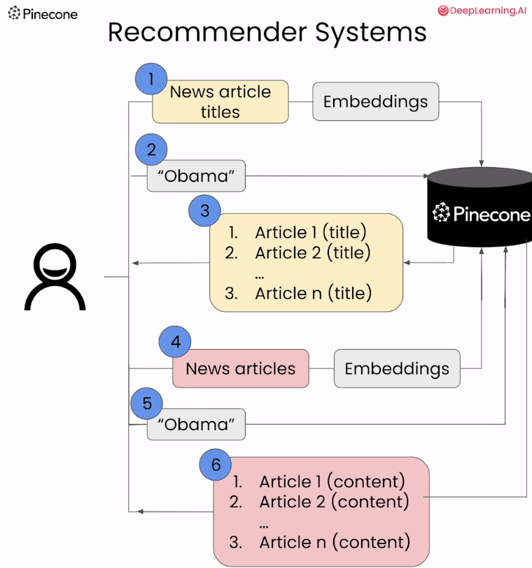
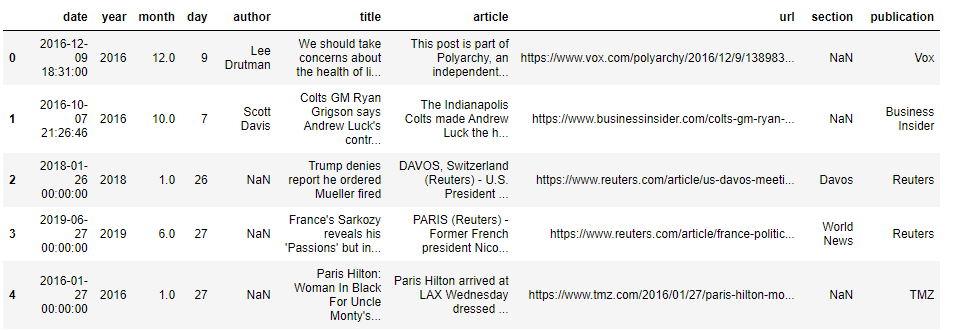

# Building Applications with Vector Databases


下面是这门课的学习笔记：[https://www.deeplearning.ai/short-courses/building-applications-vector-databases/](https://www.deeplearning.ai/short-courses/building-applications-vector-databases/)

Learn to create six exciting applications of vector databases and implement them using Pinecone.

Build a hybrid search app that combines both text and images for improved multimodal search results.

Learn how to build an app that measures and ranks facial similarity.


# Lesson 3 - Recommender Systems





### Import the Needed Packages

```python
import warnings
warnings.filterwarnings('ignore')
from langchain.text_splitter import RecursiveCharacterTextSplitter
from openai import OpenAI
from pinecone import Pinecone, ServerlessSpec
from tqdm.auto import tqdm, trange
from DLAIUtils import Utils

import pandas as pd
import time
import os
```

获取api key

```python
utils = Utils()
PINECONE_API_KEY = utils.get_pinecone_api_key()
OPENAI_API_KEY = utils.get_openai_api_key()
```

### Load the Dataset

```python
with open('./data/all-the-news-3.csv', 'r') as f:
    header = f.readline()
    print(header)
```

Output

```python
date,year,month,day,author,title,article,url,section,publication
```


```python
df = pd.read_csv('./data/all-the-news-3.csv', nrows=99)
df.head()
```

Output



### Setup Pinecone

```python
openai_client = OpenAI(api_key=OPENAI_API_KEY)
util = Utils()
INDEX_NAME = utils.create_dlai_index_name('dl-ai')
pinecone = Pinecone(api_key=PINECpONE_API_KEY)

if INDEX_NAME in [index.name for index in pinecone.list_indexes()]:
  pinecone.delete_index(INDEX_NAME)

pinecone.create_index(name=INDEX_NAME, dimension=1536, metric='cosine',
  spec=ServerlessSpec(cloud='aws', region='us-west-2'))

index = pinecone.Index(INDEX_NAME)
```

### 1.  Create Embeddings of the News Titles

通过文章标题来创建embedding

将输入的文章列表转换为嵌入向量（embeddings）

```python
def get_embeddings(articles, model="text-embedding-ada-002"):
   return openai_client.embeddings.create(input = articles, model=model)
```

为标题生成embeddings，然后形成字典插入到pinecone索引中

```python
CHUNK_SIZE=400
TOTAL_ROWS=10000
progress_bar = tqdm(total=TOTAL_ROWS)
chunks = pd.read_csv('./data/all-the-news-3.csv', chunksize=CHUNK_SIZE, 
                     nrows=TOTAL_ROWS)
chunk_num = 0
for chunk in chunks:
    titles = chunk['title'].tolist()
    embeddings = get_embeddings(titles)
    prepped = [{'id':str(chunk_num*CHUNK_SIZE+i), 
                'values':embeddings.data[i].embedding,
                'metadata':{'title':titles[i]},} for i in range(0,len(titles))]
    chunk_num = chunk_num + 1
    if len(prepped) >= 200:
      index.upsert(prepped)
      prepped = []
    progress_bar.update(len(chunk))
```

上述代码会产生总共 `TOTAL_ROWS / CHUNK_SIZE` 个 chunks，即数据集中总行数除以每个 chunk 的大小。在这个例子中，总行数为 10000，每个 chunk 的大小为 400，因此会产生 25 个 chunks。

这段代码的功能是：

1. 从名为 `'./data/all-the-news-3.csv'` 的 CSV 文件中逐个读取数据块（chunks），每个数据块包含 400 行数据，总共读取 10000 行数据。

2. 对于每个数据块，提取其中的标题列，并将这些标题传递给一个名为 `get_embeddings` 的函数，以获取标题的嵌入向量。

3. 将每个标题的嵌入向量与相应的标题一起打包成记录，并为每个记录分配一个唯一的 ID。

4. 如果准备好的记录数量达到 200 条，则将这些记录批量插入到一个名为 `index` 的索引中。

5. 在处理每个数据块时，更新进度条，以显示处理的进度。

综合起来，这段代码的主要功能是从 CSV 文件中读取数据块，并将其中的标题列转换为嵌入向量，然后将这些向量插入到一个名为 `index` 的索引中。


```python
index.describe_index_stats()
```

Output

```python
index.describe_index_stats()
{'dimension': 1536,
 'index_fullness': 0.0,
 'namespaces': {'': {'vector_count': 10000}},
 'total_vector_count': 10000}
```

### Build the Recommender System

```python
def get_recommendations(pinecone_index, search_term, top_k=10):
  embed = get_embeddings([search_term]).data[0].embedding # openai的接口
  res = pinecone_index.query(vector=embed, top_k=top_k, include_metadata=True) 
  return res
```

下面是对`embed = get_embeddings([search_term]).data[0].embedding`的解释：

它等价于`openai_client.embeddings.create(input = articles, model=model).data[0].embedding`

一个可能的openai请求embedding的例子：

可以看到embedding是在data这个key下面的。对于上述的很多embedding，自然有很多的data，上面选择的是data[0]，也可以选择data[1]等等

```json
{
  "object": "list",
  "data": [
    {
      "object": "embedding",
      "embedding": [
        0.0011064255,
        -0.0093271292,
        .... (1536 floats total for ada-002)
        -0.0033842222,
      ],
      "index": 0
    }
  ],
  "model": "text-embedding-ada-002",
  "usage": {
    "prompt_tokens": 8,
    "total_tokens": 8
  }
}
```

获取推荐文章的标题：含有obama的文章推荐

```python
reco = get_recommendations(index, 'obama')
for r in reco.matches:
    print(f'{r.score} : {r.metadata["title"]}')
```

Output：前面是pinecone检索的分数，后面是文章的标题

这是**通过对新闻标题进行embedding**，然后检索得到的新闻标题：

```python
0.84992218 : Barack Obama just stepped off the sidelines to defend Obamacare
0.848674893 : President Obama has a new plan to fight the opioid epidemic
0.848271608 : “Our democracy is at stake”: Obama delivers his first post-presidency campaign speech
0.848052 : Obama: if you were fine with big government until it served black people, rethink your biases
0.845821619 : President Obama: Michelle & I Are Gonna Be Renters
0.844207942 : Obama meets with national security team on Syria, Islamic State
0.843172133 : Vox Sentences: Obama got a warmer welcome in Hiroshima than the Japanese prime minister
0.84271574 : Watch President Obama dance the tango in Argentina
0.840892255 : Obama and Supreme Court Tag Team on Juvenile Justice Reform
0.839049876 : Clinton, Obama pledge unity behind Trump presidency
```


### 2.  Create Embeddings of All News Content

通过文章内容来创建embedding

一些pinecone的配置，创建名为articles_index的pinecone索引

```python
if INDEX_NAME in [index.name for index in pinecone.list_indexes()]:
  pinecone.delete_index(name=INDEX_NAME)

pinecone.create_index(name=INDEX_NAME, dimension=1536, metric='cosine',
  spec=ServerlessSpec(cloud='aws', region='us-west-2'))
# 创建了一个名为 INDEX_NAME 的索引对象，该对象可以用于存储和检索向量数据。
articles_index = pinecone.Index(INDEX_NAME) 
```

embed的函数如下：

```python
def embed(embeddings, title, prepped, embed_num):
  for embedding in embeddings.data:
    prepped.append({'id':str(embed_num), 
                    'values':embedding.embedding, 
                    'metadata':{'title':title}})
    embed_num += 1
    if len(prepped) >= 100:
        articles_index.upsert(prepped)
        prepped.clear()
  return embed_num
```

<p style="background-color:#fff1d7; padding:15px; "> <b>(Note: <code>news_data_rows_num = 100</code>):</b> In this lab, we've initially set <code>news_data_rows_num</code> to 100 for speedier results, allowing you to observe the outcomes faster. Once you've done an initial run, consider increasing this value to 200, 400, 700, and 1000. You'll likely notice better and more relevant results.</p>


```python
news_data_rows_num = 100

embed_num = 0 #keep track of embedding number for 'id'
text_splitter = RecursiveCharacterTextSplitter(chunk_size=400, 
    chunk_overlap=20) # how to chunk each article
prepped = []
df = pd.read_csv('./data/all-the-news-3.csv', nrows=news_data_rows_num)
articles_list = df['article'].tolist()
titles_list = df['title'].tolist()

# 处理每一篇文章，
for i in range(0, len(articles_list)):
    print(".",end="")
    art = articles_list[i]
    title = titles_list[i]
    if art is not None and isinstance(art, str):
      texts = text_splitter.split_text(art) # 将文章内容进行切分成小段
      embeddings = get_embeddings(texts) # 获取文章内容的embedding
      embed_num = embed(embeddings, title, prepped, embed_num) # 存入pinecone索引中
```

对`text_splitter = RecursiveCharacterTextSplitter(chunk_size=400, chunk_overlap=20)`的解释：

- `chunk_size=400`：这是一个参数，指定了每个文本块的大小。在这里，每个文本块的大小被设置为 400 个字符。

- `chunk_overlap=20`：这是另一个参数，指定了文本块之间的重叠量。在这里，文本块之间的重叠量被设置为 20 个字符。这意味着，相邻的文本块会有部分内容重叠，以确保文本的连续性和完整性。

所以，这行代码创建了一个文本拆分器对象，该对象使用指定的参数将文章文本拆分成较小的文本块，以便进行后续处理，例如将其转换为嵌入向量。

查看向量数据库中的结果

```python
articles_index.describe_index_stats()
```

Output

```python
{'dimension': 1536,
 'index_fullness': 0.0,
 'namespaces': {'': {'vector_count': 1000}},
 'total_vector_count': 1000}
```


### Build the Recommender System

```python
reco = get_recommendations(articles_index, 'obama', top_k=100)
seen = {}
for r in reco.matches:
    title = r.metadata['title']
    if title not in seen:
        print(f'{r.score} : {title}')
        seen[title] = '.'
```

Output：**通过文章内容进行embedding**，然后检索得到的相关文章的标题

```python
0.821158946 : Why Obama is vetting Nevada's Republican governor for the Supreme Court
0.818882763 : U.S. lawmakers ask for disclosure of number of Americans under surveillance
0.812377512 : NYPD Honcho Insulted by 'Hamilton' Star Lin-Manuel Miranda Celebrating Obama's Controversial Prisoner Release
0.806862772 : Why Jews Are Getting Themselves Arrested at ICE Centers Around the Country
0.806241512 : Trump keeping options open as Republican feud rages
```