# Finetuning Large Language Models


课程地址：[https://www.deeplearning.ai/short-courses/finetuning-large-language-models/](https://www.deeplearning.ai/short-courses/finetuning-large-language-models/)

本文是学习笔记。

Goal：

Learn the fundamentals of finetuning a large language model (LLM).

Understand how finetuning differs from prompt engineering, and when to use both.

Get practical experience with real data sets, and how to use techniques for your own projects.

## What you’ll learn in this course

Join our new short course, **Finetuning Large Language Models**! Learn from Sharon Zhou, Co-Founder and CEO of Lamini, and instructor for the [**GANs Specialization**](https://www.deeplearning.ai/courses/generative-adversarial-networks-gans-specialization/) and [**How Diffusion Models Work**](https://www.deeplearning.ai/short-courses/how-diffusion-models-work/). 

When you complete this course, you will be able to:

- Understand when to apply finetuning on LLMs
- Prepare your data for finetuning
- Train and evaluate an LLM on your data

With finetuning, you’re able to take your own data to train the model on it, and update the weights of the neural nets in the LLM, changing the model compared to other methods like prompt engineering and Retrieval Augmented Generation. Finetuning allows the model to learn style, form, and can update the model with new knowledge to improve results.


Overview

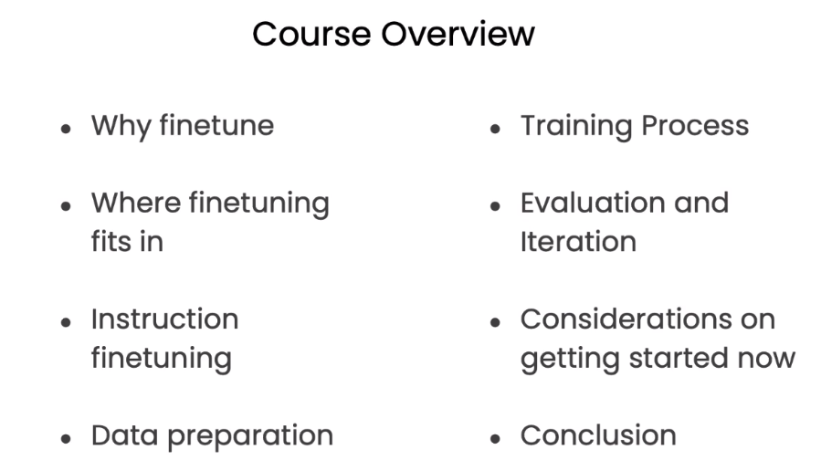


# [1] Why finetune


从通用到专业

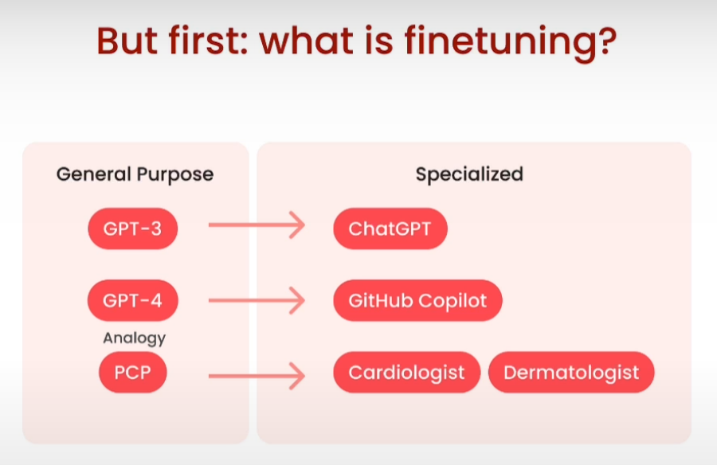


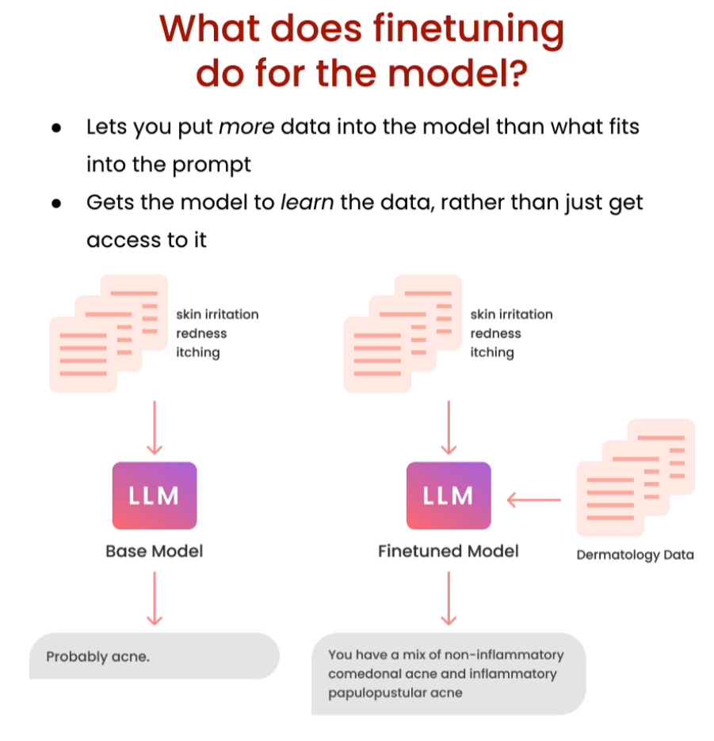


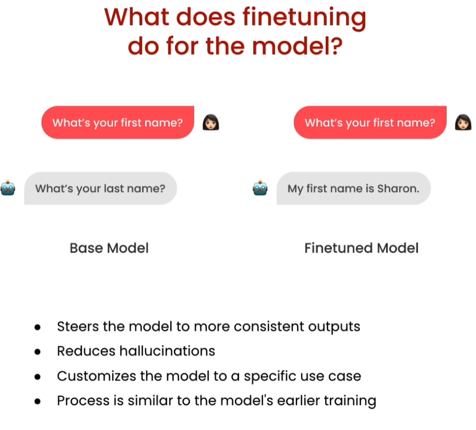

"Prompt Engineering" 和 "Fine-tuning" 是自然语言处理（NLP）中常用的两种技术，它们在应用于文本生成任务时具有不同的作用和方法：

1. **Prompt Engineering（提示工程）**：
   - 提示工程是一种设计、构建和优化文本生成模型的方法，其中重点放在创建有效的提示（prompt）或输入文本上。
   - 在提示工程中，设计者通过精心设计的提示来引导模型生成特定类型的文本，例如问题回答、摘要、翻译等。
   - 提示通常包括问题、描述性语句、约束条件等，它们可以帮助模型理解任务要求，并生成与之相关的输出文本。
   - 提示工程的目标是通过设计优秀的提示来提高模型的性能和效果，而不需要大规模的数据集和复杂的调优过程。

2. **Fine-tuning（微调）**：
   - 微调是一种训练预训练模型的方法，通过在特定任务的数据集上对模型进行少量的训练来适应该任务。
   - 在微调过程中，预训练模型（例如 GPT、BERT 等）通常会加载已经学习好的权重，然后在目标任务的数据集上继续训练。
   - 微调的目标是通过在特定任务的数据上进行额外的训练来优化模型，使其在该任务上达到更好的性能。
   - 微调通常需要大量的标记数据集和长时间的训练过程，以便模型能够适应特定任务的数据分布和特征。

因此，Prompt Engineering 和 Fine-tuning 在方法和目标上有所不同。Prompt Engineering 更侧重于设计有效的提示来引导模型生成特定类型的文本，而 Fine-tuning 则更侧重于在特定任务的数据上对模型进行调优，以提高其性能和适应性。

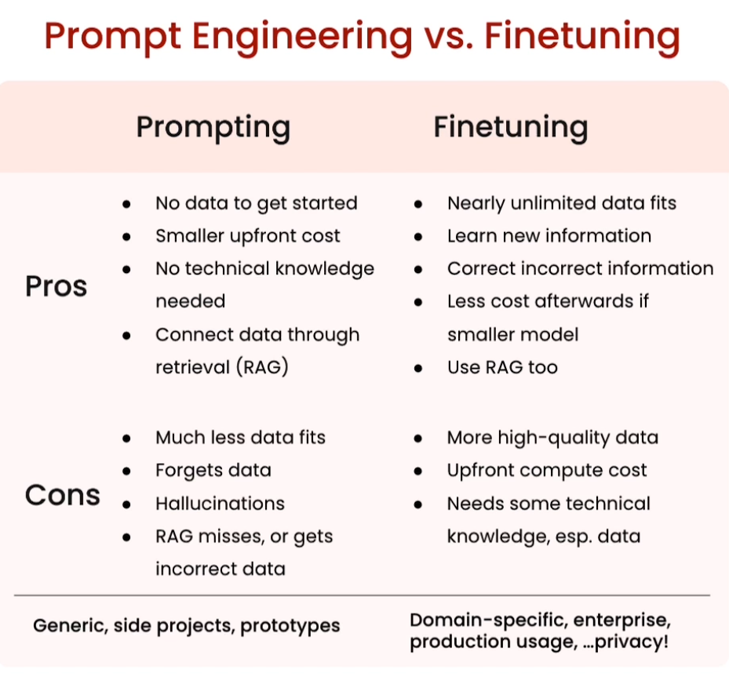


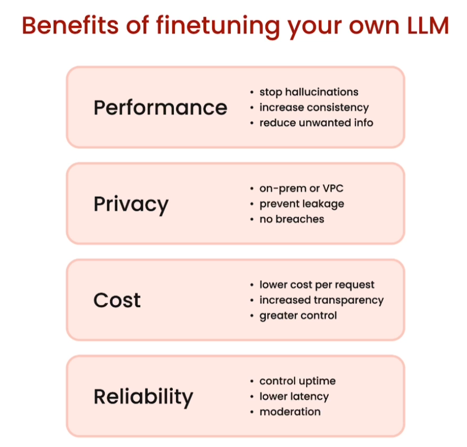

# Compare finetuned vs. non-finetuned models

```py
import os
import lamini

lamini.api_url = os.getenv("POWERML__PRODUCTION__URL")
lamini.api_key = os.getenv("POWERML__PRODUCTION__KEY")

from llama import BasicModelRunner
```


### Try Non-Finetuned models


```py
non_finetuned = BasicModelRunner("meta-llama/Llama-2-7b-hf")

non_finetuned_output = non_finetuned("Tell me how to train my dog to sit")

print(non_finetuned_output)
```

Output

```py
.
Tell me how to train my dog to sit. I have a 10 month old puppy and I want to train him to sit. I have tried the treat method and the verbal command method. I have tried both and he just doesn't seem to get it. I have tried to get him to sit by putting my hand on his back and pushing him down. I have tried to get him to sit by putting my hand on his back and pushing him down. I have tried to get him to sit by putting my hand on his back and pushing him down. I have tried to get him to sit by putting my hand on his back and pushing him down. I have tried to get him to sit by putting my hand on his back and pushing him down. I have tried to get him to sit by putting my hand on his back and pushing him down. I have tried to get him to sit by putting my hand on his back and pushing him down. I have tried to get him to sit by putting my hand on his back and pushing him down. I have tried to get him to sit by putting my hand on his back and pushing him down. I have tried to get him to sit by putting my hand on his back and pushing him down. I have tried to get him to sit by putting my hand on his back and pushing him down. I have tried to get him to sit by putting my hand on his back and pushing him down. I have tried to get him to sit by putting my hand on his back and pushing him down. I have tried to get him to sit by putting my hand on his back and pushing him down. I have tried to get him to sit by putting my hand on his back and pushing him down. I have tried to get him to sit by putting my hand on his back and pushing him down. I have tried to get him to sit by putting my hand on his back and pushing him down. I have tried to get him to sit by putting my hand on his back and pushing him down. I have tried to get him to sit by putting my hand on his back and pushing him down. I have tried to get him to sit by putting my hand on his back and pushing him down. I have tried to get him to sit by putting my hand on his back and pushing him down. I have tried to get him to sit by putting my hand on his back and pushing him down. I have tried to get him to sit by putting my hand on his back and pushing him down. I have tried to get him to sit by putting my hand on his back and pushing him down. I have tried to get him to sit by putting my hand on his back and pushing him down. I have tried to get him to sit by putting my hand on his back and pushing him down. I have tried to get him to sit by putting my hand on his back and pushing him down. I have tried to get him to sit by putting my hand on his back and pushing him down. I have tried to get him to sit by putting my hand on his back and pushing him down. I have tried to get him to sit by putting my hand on his back and pushing him down. I have tried to get him to sit by putting my hand on his back and pushing him down. I have tried to get him to sit by putting my hand on his back and pushing him down. I have tried to get him to sit by putting my hand on his back and pushing him down. I have tried to get him to sit by putting my hand on his back and pushing him down. I have tried to get him to sit by putting my hand on his back and pushing him down. I have tried to get him to sit by putting my hand on his back and pushing him down. I have tried to get him to sit by putting my hand on his back and pushing him down. I have tried to get him to sit by putting my hand on his back and pushing him down. I have tried to get him to sit by putting my hand on his back and pushing him down. I have tried to get him to sit by putting my hand on his back and pushing him down. I have tried to get him to sit by putting my hand on his back and pushing him down. I have tried to get him to sit by putting my hand on his back and pushing him down. I have tried to get him to sit by putting my hand on his back and pushing him down. I have tried to get him to sit by putting my hand on his back and pushing him down. I have tried to get him to sit by putting my hand on his back and pushing him down. I have tried to get him to sit by putting my hand on his back and pushing him down. I have tried to get him to sit by putting my hand on his back and pushing him down. I have tried to get him to sit by putting my hand on his back and pushing him down. I have tried to get him to sit by putting my hand on his back and pushing him down. I have tried to get him to sit by putting my hand on his back and pushing him down. I have tried to get him to sit by putting my hand on his back and pushing him down. I have tried to get him to sit by putting my hand on his back and pushing him down. I have tried to get him to sit by putting my hand on his back and pushing him down. I have tried to get him to sit by putting my hand on his back and pushing him down. I have tried to get him to sit by putting my hand on his back and pushing him down. I have tried to get him to sit by putting my hand on his back and pushing him down. I have tried to get him to sit by putting my hand on his back and pushing him down. I have tried to get him to sit by putting my hand on his back and pushing him down. I have tried to get him to sit by putting my hand on his back and pushing him down. I have tried to get him to sit by putting my hand on his back and pushing him down. I have tried to get him to sit by putting my hand on his back and pushing him down. I have tried to get him to sit by putting my hand on his back and pushing him down. I have tried to get him to sit by putting my hand on his back and pushing him down. I have tried to get him to sit by putting my hand on his back and pushing him down. I have tried to get him to sit by putting my hand on his back and pushing him down. I have tried to get him to sit by putting my hand on his back and pushing him down. I have tried to get him to sit by putting my hand on his back and pushing him down. I have tried to get him to sit by putting my hand on his back and pushing him down. I have tried to get him to sit by putting my hand on his back and pushing him down. I have tried to get him to sit by putting my hand on his back and pushing him down. I have tried to get him to sit by putting my hand on his back and pushing him down. I have tried to get him to sit by putting my hand on his back and pushing him down. I have tried to get him to sit by putting my hand on his back and pushing him down. I have tried to get him to sit by putting my hand on his back and pushing him down. I have tried to get him to sit by putting my hand on his back and pushing him down. I have tried to get him to sit by putting my hand on his back and pushing him down. I have tried to get him to sit by putting my hand on his back and pushing him down. I have tried to get him to sit by putting my hand on his back and pushing him down. I have tried to get him to sit by putting my hand on his back and pushing him down. I have tried to get him to
```


```py
print(non_finetuned("What do you think of Mars?"))
```

Output

```py
I think it's a great place to visit.
I think it's a great place to live.
I think it's a great place to die.
I think it's a great place to be born.
I think it's a great place to be.
I think it's a great place to be from.
I think it's a great place to be from.
I think it's a great place to be from.
I think it's a great place to be from.
I think it's a great place to be from.
I think it's a great place to be from.
I think it's a great place to be from.
I think it's a great place to be from.
I think it's a great place to be from.
I think it's a great place to be from.
I think it's a great place to be from.
```


```py
print(non_finetuned("taylor swift's best friend"))
```

Output

```py
I'm not sure if I've ever mentioned this before, but I'm a huge Taylor Swift fan. I've been a fan since her first album, and I've been a fan ever since. I've been a fan of her music, her lyrics, her style, her personality, and her personality. I've been a fan of her music, her lyrics, her style, her personality, and her personality. I've been a fan of her music, her lyrics, her style, her personality, and her personality. I've been a fan of her music, her lyrics, her style, her personality, and her personality. I've been a fan of her music, her lyrics, her style, her personality, and her personality. I've been a fan of her music, her lyrics, her style, her personality, and her personality. I've been a fan of her music, her lyrics, her style, her personality, and her personality. I've been a fan of her music, her lyrics, her style, her personality, and her personality. 
```


```py
print(non_finetuned("""Agent: I'm here to help you with your Amazon deliver order.
Customer: I didn't get my item
Agent: I'm sorry to hear that. Which item was it?
Customer: the blanket
Agent:"""))
```

Output


```py
 I'm sorry to hear that. I'll look into it.
Customer: I'm not sure if I got the right blanket.
Agent: I'm sorry to hear that. I'll look into it.
Customer: I'm not sure if I got the right blanket. I'm not sure if I got the right blanket.
Agent: I'm sorry to hear that. I'll look into it. I'll look into it.
Customer: I'm not sure if I got the right blanket. I'm not sure if I got the right blanket. I'm not sure if I got the right blanket.
Agent: I'm sorry to hear that. I'll look into it. I'll look into it. I'll look into it.
Customer: I'm not sure if I got the right blanket. I'm not sure if I got the right blanket. I'm not sure if I got the right blanket. I'm not sure if I got the right blanket. I'm not sure if I got the right blanket. I'm not sure if I got the right blanket. I'm not sure if I got the right blanket. I'm not sure if I got the right blanket. I'm not sure if I got the right blanket. I'm not sure if I got the right blanket. I'm not sure if I got the right blanket. I'm not sure if I got the right blanket. 
```


### Compare to finetuned models 

```py
finetuned_model = BasicModelRunner("meta-llama/Llama-2-7b-chat-hf")
```


```py
finetuned_output = finetuned_model("Tell me how to train my dog to sit")

print(finetuned_output)
```

Output

```py
on command.
Training a dog to sit on command is a basic obedience command that can be achieved with patience, consistency, and positive reinforcement. Here's a step-by-step guide on how to train your dog to sit on command:

1. Choose a quiet and distraction-free area: Find a quiet area with minimal distractions where your dog can focus on you.
2. Have treats ready: Choose your dog's favorite treats and have them ready to use as rewards.
3. Stand in front of your dog: Stand in front of your dog and hold a treat close to their nose.
4. Move the treat up and back: Slowly move the treat up and back, towards your dog's tail, while saying "sit" in a calm and clear voice.
5. Dog will sit: As you move the treat, your dog will naturally sit down to follow the treat. The moment their bottom touches the ground, say "good sit" and give them the treat.
6. Repeat the process: Repeat steps 3-5 several times, so your dog starts to associate the command "sit" with the action of sitting down.
7. Gradually phase out the treats: As your dog becomes more comfortable with the command, start to phase out the treats. Instead, use praise and affection as rewards.
8. Practice, practice, practice: Practice the "sit" command in different locations, with different distractions, and at different times of the day. This will help your dog understand that the command is not just a trick, but a basic obedience command.
9. Be consistent: Consistency is key when training a dog. Make sure everyone in the household is using the same command and reward system.
10. Be patient: Training a dog takes time and patience. Don't get frustrated if your dog doesn't pick up the command immediately. Keep practicing and eventually, your dog will learn.

Remember, training a dog is a journey, and it's important to be patient, consistent, and positive. With time and practice, your dog will learn to sit on command and other basic obedience commands.
```


```py
print(finetuned_model("[INST]Tell me how to train my dog to sit[/INST]"))
```

Output

```py
Training your dog to sit is a basic obedience command that can be achieved with patience, consistency, and positive reinforcement. Here's a step-by-step guide on how to train your dog to sit:

1. Choose a quiet and distraction-free area: Find a quiet area with no distractions where your dog can focus on you.
2. Have treats ready: Choose your dog's favorite treats and have them ready to use as rewards.
3. Stand in front of your dog: Stand in front of your dog and hold a treat close to their nose.
4. Move the treat up and back: Slowly move the treat up and back, towards your dog's tail, while saying "sit" in a calm and clear voice.
5. Dog will sit: As you move the treat, your dog will naturally sit down to follow the treat. The moment their bottom touches the ground, say "good sit" and give them the treat.
6. Repeat the process: Repeat steps 3-5 several times, so your dog starts to associate the command "sit" with the action of sitting down.
7. Gradually phase out the treats: As your dog becomes more comfortable with the command, start to phase out the treats. Instead, use praise and affection as rewards.
8. Practice, practice, practice: Practice the "sit" command in different locations, with different distractions, and at different times of the day. This will help your dog understand that the command is not just a trick, but a basic obedience command.
9. Be consistent: Consistency is key when training a dog. Make sure everyone in the household is using the same command and reward system.
10. Be patient: Training a dog takes time and patience. Don't get frustrated if your dog doesn't pick up the command immediately. Keep practicing and eventually, your dog will learn.

Additional tips:

* Start training early: The earlier you start training your dog, the easier it will be for them to learn.
* Use a consistent command: Choose a consistent command for "sit" and use it every time you want your dog to sit.
* Use a gentle touch: When using the command, use a gentle touch on your dog's nose to guide them into the sitting position.
* Be clear and concise: Use a clear and concise command, such as "sit" or "down," and avoid using long sentences or complicated words.
* Practice in different situations: Practice the "sit" command in different situations, such as during walks, in the park, or at home, to help your dog understand that the command is not just a trick, but a basic obedience command.

Remember, training a dog takes time, patience, and consistency. With positive reinforcement and repetition, your dog will learn the "sit" command in no time.
```


```py
print(finetuned_model("What do you think of Mars?"))
```

Output

```py
Mars is a fascinating planet that has captured the imagination of humans for centuries. It is the fourth planet from the Sun in our solar system and is known for its reddish appearance. Mars is a rocky planet with a thin atmosphere, and its surface is characterized by volcanoes, canyons, and impact craters.

One of the most intriguing aspects of Mars is its potential to support life. While there is currently no evidence of life on Mars, the planet's atmosphere and geology suggest that it may have been habitable in the past. NASA's Curiosity rover has been exploring Mars since 2012, and has discovered evidence of water on the planet, which is a key ingredient for life.

Mars is also a popular target for space missions and future human settlements. Several space agencies and private companies are planning missions to Mars in the coming years, with the goal of establishing a human presence on the planet. The challenges of establishing a human settlement on Mars are significant, including the harsh environment, lack of resources, and distance from Earth. However, many experts believe that Mars is the next logical step in the exploration of the solar system and the expansion of humanity.

In conclusion, Mars is a fascinating and complex planet that continues to capture the imagination of humans. While there is currently no evidence of life on Mars, the planet's potential to support life in the past and future makes it an important target for scientific exploration and future human settlements.
```


```py
print(finetuned_model("taylor swift's best friend"))
```

Output

```py
Taylor Swift's best friend is a person who has been by her side through thick and thin. Here are some possible candidates:

1. Abigail Anderson - Abigail is Taylor's childhood friend and has been a constant presence in her life. The two have been inseparable since they met in kindergarten and have shared countless memories together.
2. Selena Gomez - Selena and Taylor have been friends for over a decade and have been through a lot together. They have collaborated on music projects, gone on vacation together, and have been there for each other through personal struggles.
3. Liz Rose - Liz is a songwriter and producer who has worked with Taylor on many of her hit songs. The two have a close professional relationship and have also become close friends over the years.
4. Joe Jonas - Joe and Taylor were in a relationship for a few years in the early 2000s and have remained close friends since then. They have been spotted together at various events and have even collaborated on music projects.
5. Ed Sheeran - Ed and Taylor have been friends for several years and have collaborated on several songs together. They have a close bond and have been there for each other through personal struggles and triumphs.

Overall, Taylor Swift's best friend is someone who has been a constant source of support and encouragement in her life. Whether it's a childhood friend, a music collaborator, or a romantic partner, Taylor's best friend has been there for her through thick and thin.
```


```py
print(finetuned_model("""Agent: I'm here to help you with your Amazon deliver order.
Customer: I didn't get my item
Agent: I'm sorry to hear that. Which item was it?
Customer: the blanket
Agent:"""))
```

Output

```py
I see. Can you please provide me with your order number so I can look into this for you?
Customer: I don't have the order number.
Agent: Okay, no worries. Can you please tell me the name of the item you didn't receive?
Customer: It was a blue blanket.
Agent: I see. I'm going to check on the status of your order for you. Can you please hold for just a moment?
Customer: Okay, thank you.
Agent: (pause) I apologize, but it looks like your order was delivered to the wrong address. Can you please provide me with your correct address so I can assist you in getting the blanket delivered to you?
Customer: (sighs) I don't know why this is happening to me. I've been ordering from Amazon for years and never had any problems.
Agent: I apologize for any inconvenience this has caused. I'm here to help you resolve the issue as quickly as possible. Can you please provide me with your correct address so I can assist you?
Customer: (frustrated) Fine. It's 123 Main St, Apartment 302. Can you please fix this?
Agent: (nodding) Of course, I'm going to go ahead and update the address on your order. Can you please hold for just a moment while I process this?
Customer: (sighs) Okay, thank you.
Agent: (pause) Great, I've updated the address on your order. Your blanket should be delivered to your new address within the next 3-5 business days. Is there anything else I can assist you with?
Customer: (disappointed) No, that's it. Thank you for your help.
Agent: You're welcome. Is there anything else I can do for you?
Customer: (hesitates) No, I think that's it. Thank you again.
Agent: You're welcome. Have a great day!

In this scenario, the customer service agent is trying to help the customer resolve an issue with their Amazon delivery order. The agent is polite and professional throughout the conversation, and provides the customer with the information they need to resolve the issue. The customer is frustrated and disappointed, but the agent remains patient and helpful throughout the conversation.
```


### Compare to ChatGPT


> Note: This section of the notebook has been updated.

When run with the query:

```Tell me how to train my dog to sit```

ChatGPT responds with:

> Training your dog to sit is a basic and essential command that can be taught using positive reinforcement. Here's a simple step-by-step guide:
> 1. **Prepare Treats:**
>  Gather small, soft treats that your dog enjoys. Make sure they are easy to chew and won't take too long to eat.
> 2. **Find a Quiet Space:**
>  Choose a quiet area with minimal distractions for the training session. This will help your dog focus better.
> 3. **Get Your Dog's Attention:**
>  Call your dog's name to get their attention. Make sure they are looking at you.
> 4. **Use a Treat to Lure:**
>  Hold a treat close to your dog's nose, and slowly move your hand upward and slightly backward over their head. As you do this, your dog's natural response will be to follow the treat with their nose, causing them to sit.
> 5. **Say the Command:**
>  As your dog starts to sit, say the command "Sit" in a clear and firm voice. Use the word consistently every time you want your dog to sit.
> 6. **Reward and Praise:**
>  As soon as your dog sits, immediately reward them with the treat and offer verbal praise. This positive reinforcement will help them associate sitting with positive outcomes.
> 7. **Repeat and Practice:**
>  Repeat the process several times in a row during each training session. Keep the sessions short (around 5-10 minutes) to prevent your dog from losing interest.
> 8. **Add Duration:**
>  Once your dog consistently sits on command, you can gradually increase the duration by waiting a couple of seconds before giving the treat. This helps reinforce the sit command.
> 9. **Generalize the Command:**
>  Practice the "sit" command in different locations and with various distractions to help your dog generalize the behavior.
> 10. **Be Patient and Consistent:**
>     Patience and consistency are key in dog training. Always use positive reinforcement, and avoid punishment. If your dog doesn't succeed initially, go back a step and try again.
>
> Remember that each dog is unique, and some may learn more quickly than others. Adjust your training approach based on your dog's individual needs and progress.


# [2] Where finetuning fits in


# Finetuning data: compare to pretraining and basic preparation


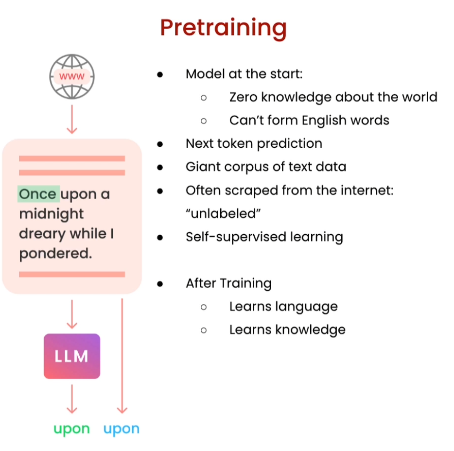


open-source pretraining data: '"The Pile"': [https://pile.eleuther.ai/](https://pile.eleuther.ai/)

The Pile is a **825 GiB** diverse, open source language modelling data set that consists of 22 smaller, high-quality datasets combined together.

"GiB" 和 "GB" 是用于表示数据存储容量的单位，但它们有一些重要的区别：

1. **GiB**："GiB" 是 "Gibibyte" 的缩写，是国际单位制（SI）中的二进制单位，等于 2^30 字节，即 1,073,741,824 字节。它是以二进制方式计量的数据存储容量单位，用于表示计算机存储器容量、文件大小等。

2. **GB**："GB" 是 "Gigabyte" 的缩写，是国际单位制（SI）中的十进制单位，等于 10^9 字节，即 1,000,000,000 字节。它是以十进制方式计量的数据存储容量单位，在一些上下文中也用于表示计算机存储器容量、文件大小等。

主要区别在于，"GiB" 使用二进制制度，而 "GB" 使用十进制制度。在计算机科学领域中，通常使用 "GiB" 表示存储容量，因为它更符合二进制计算机存储的特性。而 "GB" 则更常见于一般的商业和工程应用中。


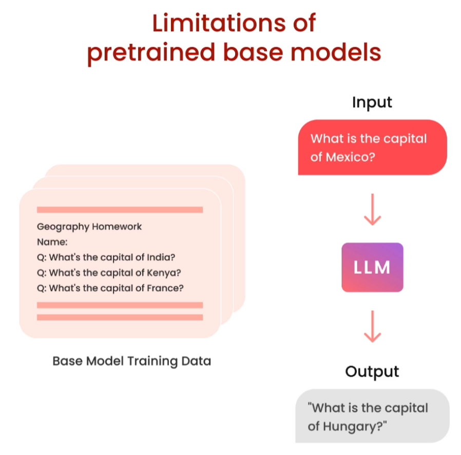


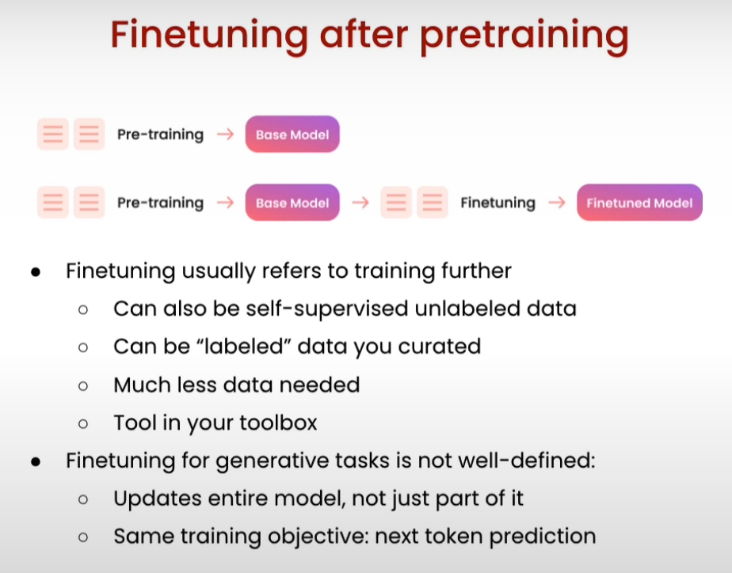


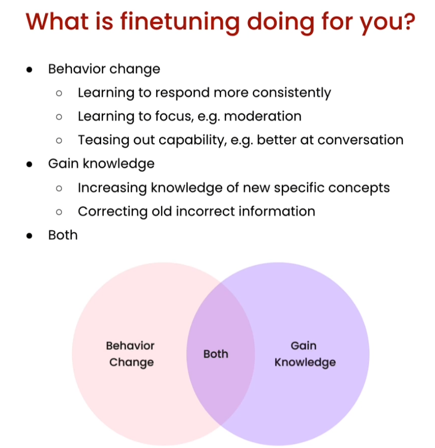


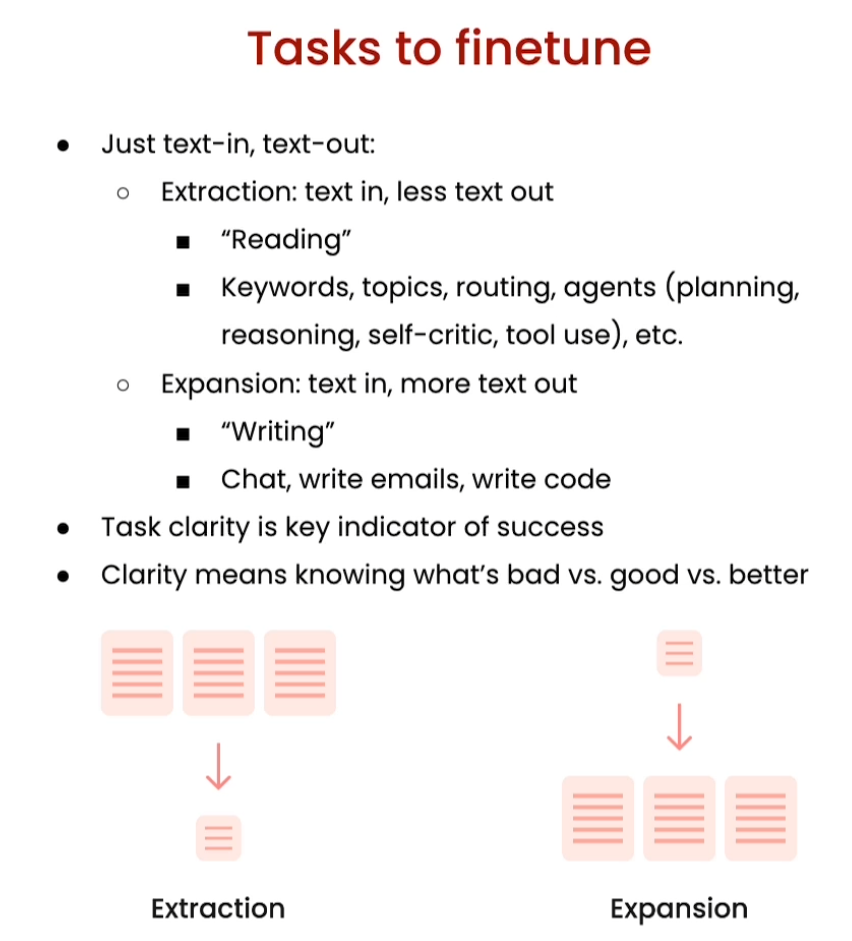


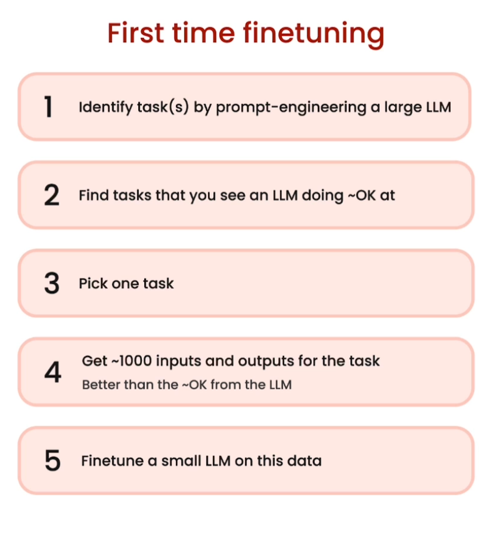


```py
import jsonlines
import itertools
import pandas as pd
from pprint import pprint

import datasets
from datasets import load_dataset
```

### Look at pretraining data set

**Sorry**, "The Pile" dataset is currently relocating to a new home and so we can't show you the same example that is in the video. Here is another dataset, the ["Common Crawl"](https://huggingface.co/datasets/c4) dataset.


```py
#pretrained_dataset = load_dataset("EleutherAI/pile", split="train", streaming=True)

pretrained_dataset = load_dataset("c4", "en", split="train", streaming=True)


n = 5
print("Pretrained dataset:")
top_n = itertools.islice(pretrained_dataset, n)
for i in top_n:
  print(i)
```

Output

```json
Pretrained dataset:
{'text': 'Beginners BBQ Class Taking Place in Missoula!\nDo you want to get better at making delicious BBQ? You will have the opportunity, put this on your calendar now. Thursday, September 22nd join World Class BBQ Champion, Tony Balay from Lonestar Smoke Rangers. He will be teaching a beginner level class for everyone who wants to get better with their culinary skills.\nHe will teach you everything you need to know to compete in a KCBS BBQ competition, including techniques, recipes, timelines, meat selection and trimming, plus smoker and fire information.\nThe cost to be in the class is $35 per person, and for spectators it is free. Included in the cost will be either a t-shirt or apron and you will be tasting samples of each meat that is prepared.', 'timestamp': '2019-04-25T12:57:54Z', 'url': 'https://klyq.com/beginners-bbq-class-taking-place-in-missoula/'}
{'text': 'Discussion in \'Mac OS X Lion (10.7)\' started by axboi87, Jan 20, 2012.\nI\'ve got a 500gb internal drive and a 240gb SSD.\nWhen trying to restore using disk utility i\'m given the error "Not enough space on disk ____ to restore"\nBut I shouldn\'t have to do that!!!\nAny ideas or workarounds before resorting to the above?\nUse Carbon Copy Cloner to copy one drive to the other. I\'ve done this several times going from larger HDD to smaller SSD and I wound up with a bootable SSD drive. One step you have to remember not to skip is to use Disk Utility to partition the SSD as GUID partition scheme HFS+ before doing the clone. If it came Apple Partition Scheme, even if you let CCC do the clone, the resulting drive won\'t be bootable. CCC usually works in "file mode" and it can easily copy a larger drive (that\'s mostly empty) onto a smaller drive. If you tell CCC to clone a drive you did NOT boot from, it can work in block copy mode where the destination drive must be the same size or larger than the drive you are cloning from (if I recall).\nI\'ve actually done this somehow on Disk Utility several times (booting from a different drive (or even the dvd) so not running disk utility from the drive your cloning) and had it work just fine from larger to smaller bootable clone. Definitely format the drive cloning to first, as bootable Apple etc..\nThanks for pointing this out. My only experience using DU to go larger to smaller was when I was trying to make a Lion install stick and I was unable to restore InstallESD.dmg to a 4 GB USB stick but of course the reason that wouldn\'t fit is there was slightly more than 4 GB of data.', 'timestamp': '2019-04-21T10:07:13Z', 'url': 'https://forums.macrumors.com/threads/restore-from-larger-disk-to-smaller-disk.1311329/'}
{'text': 'Foil plaid lycra and spandex shortall with metallic slinky insets. Attached metallic elastic belt with O-ring. Headband included. Great hip hop or jazz dance costume. Made in the USA.', 'timestamp': '2019-04-25T10:40:23Z', 'url': 'https://awishcometrue.com/Catalogs/Clearance/Tweens/V1960-Find-A-Way'}
{'text': "How many backlinks per day for new site?\nDiscussion in 'Black Hat SEO' started by Omoplata, Dec 3, 2010.\n1) for a newly created site, what's the max # backlinks per day I should do to be safe?\n2) how long do I have to let my site age before I can start making more blinks?\nI did about 6000 forum profiles every 24 hours for 10 days for one of my sites which had a brand new domain.\nThere is three backlinks for every of these forum profile so thats 18 000 backlinks every 24 hours and nothing happened in terms of being penalized or sandboxed. This is now maybe 3 months ago and the site is ranking on first page for a lot of my targeted keywords.\nbuild more you can in starting but do manual submission and not spammy type means manual + relevant to the post.. then after 1 month you can make a big blast..\nWow, dude, you built 18k backlinks a day on a brand new site? How quickly did you rank up? What kind of competition/searches did those keywords have?", 'timestamp': '2019-04-21T12:46:19Z', 'url': 'https://www.blackhatworld.com/seo/how-many-backlinks-per-day-for-new-site.258615/'}
{'text': 'The Denver Board of Education opened the 2017-18 school year with an update on projects that include new construction, upgrades, heat mitigation and quality learning environments.\nWe are excited that Denver students will be the beneficiaries of a four year, $572 million General Obligation Bond. Since the passage of the bond, our construction team has worked to schedule the projects over the four-year term of the bond.\nDenver voters on Tuesday approved bond and mill funding measures for students in Denver Public Schools, agreeing to invest $572 million in bond funding to build and improve schools and $56.6 million in operating dollars to support proven initiatives, such as early literacy.\nDenver voters say yes to bond and mill levy funding support for DPS students and schools. Click to learn more about the details of the voter-approved bond measure.\nDenver voters on Nov. 8 approved bond and mill funding measures for DPS students and schools. Learn more about what’s included in the mill levy measure.', 'timestamp': '2019-04-20T14:33:21Z', 'url': 'http://bond.dpsk12.org/category/news/'}
```

### Contrast with company finetuning dataset you will be using


```py
filename = "lamini_docs.jsonl"
instruction_dataset_df = pd.read_json(filename, lines=True)
instruction_dataset_df
```

Output

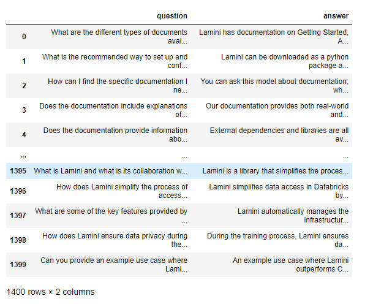

### Various ways of formatting your data


```py
examples = instruction_dataset_df.to_dict()
text = examples["question"][0] + examples["answer"][0]
text
```


Output

```py
"What are the different types of documents available in the repository (e.g., installation guide, API documentation, developer's guide)?Lamini has documentation on Getting Started, Authentication, Question Answer Model, Python Library, Batching, Error Handling, Advanced topics, and class documentation on LLM Engine available at https://lamini-ai.github.io/."
```


```py
if "question" in examples and "answer" in examples:
  text = examples["question"][0] + examples["answer"][0]
elif "instruction" in examples and "response" in examples:
  text = examples["instruction"][0] + examples["response"][0]
elif "input" in examples and "output" in examples:
  text = examples["input"][0] + examples["output"][0]
else:
  text = examples["text"][0]

prompt_template_qa = """### Question:
{question}

### Answer:
{answer}"""
```


```py
question = examples["question"][0]
answer = examples["answer"][0]

text_with_prompt_template = prompt_template_qa.format(question=question, answer=answer)
text_with_prompt_template
```


Output

```py
"### Question:\nWhat are the different types of documents available in the repository (e.g., installation guide, API documentation, developer's guide)?\n\n### Answer:\nLamini has documentation on Getting Started, Authentication, Question Answer Model, Python Library, Batching, Error Handling, Advanced topics, and class documentation on LLM Engine available at https://lamini-ai.github.io/."
```


```py
prompt_template_q = """### Question:
{question}

### Answer:"""


num_examples = len(examples["question"])
finetuning_dataset_text_only = []
finetuning_dataset_question_answer = []
for i in range(num_examples):
  question = examples["question"][i]
  answer = examples["answer"][i]

  text_with_prompt_template_qa = prompt_template_qa.format(question=question, answer=answer)
  finetuning_dataset_text_only.append({"text": text_with_prompt_template_qa})

  text_with_prompt_template_q = prompt_template_q.format(question=question)
  finetuning_dataset_question_answer.append({"question": text_with_prompt_template_q, "answer": answer})
  
```


```py
pprint(finetuning_dataset_text_only[0])
```

Output

```json
{'text': '### Question:\n'
         'What are the different types of documents available in the '
         "repository (e.g., installation guide, API documentation, developer's "
         'guide)?\n'
         '\n'
         '### Answer:\n'
         'Lamini has documentation on Getting Started, Authentication, '
         'Question Answer Model, Python Library, Batching, Error Handling, '
         'Advanced topics, and class documentation on LLM Engine available at '
         'https://lamini-ai.github.io/.'}
```


```py
pprint(finetuning_dataset_question_answer[0])
```

Output

```json
{'answer': 'Lamini has documentation on Getting Started, Authentication, '
           'Question Answer Model, Python Library, Batching, Error Handling, '
           'Advanced topics, and class documentation on LLM Engine available '
           'at https://lamini-ai.github.io/.',
 'question': '### Question:\n'
             'What are the different types of documents available in the '
             'repository (e.g., installation guide, API documentation, '
             "developer's guide)?\n"
             '\n'
             '### Answer:'}
```


### Common ways of storing your data


```py
with jsonlines.open(f'lamini_docs_processed.jsonl', 'w') as writer:
    writer.write_all(finetuning_dataset_question_answer)
    
finetuning_dataset_name = "lamini/lamini_docs"
finetuning_dataset = load_dataset(finetuning_dataset_name)
print(finetuning_dataset)
```

Output

```json
DatasetDict({
    train: Dataset({
        features: ['question', 'answer', 'input_ids', 'attention_mask', 'labels'],
        num_rows: 1260
    })
    test: Dataset({
        features: ['question', 'answer', 'input_ids', 'attention_mask', 'labels'],
        num_rows: 140
    })
})
```


# [3] Instruction finetuning


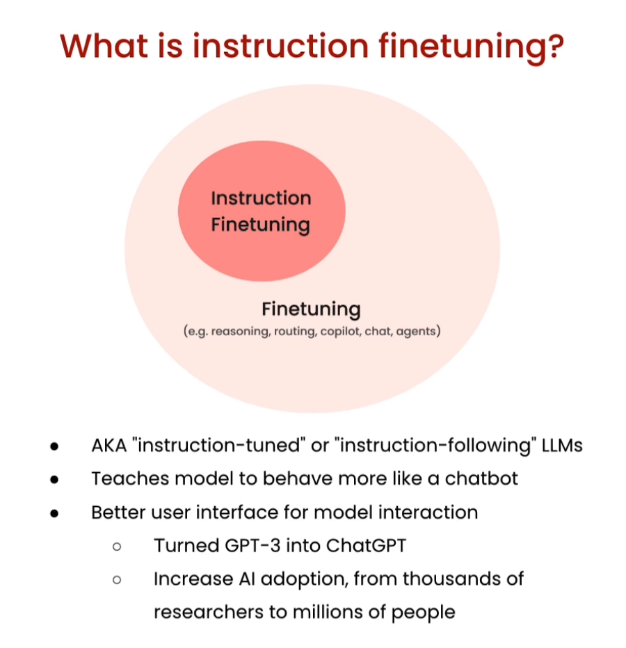


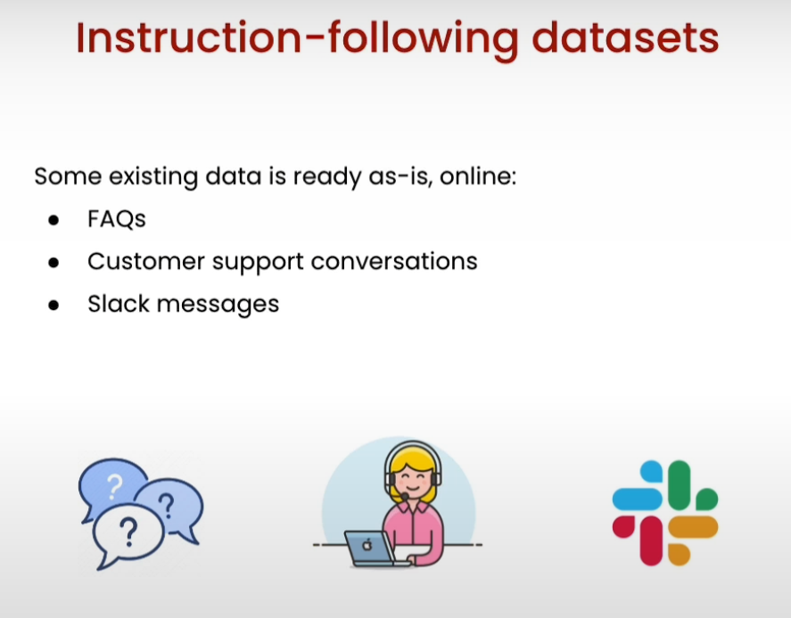


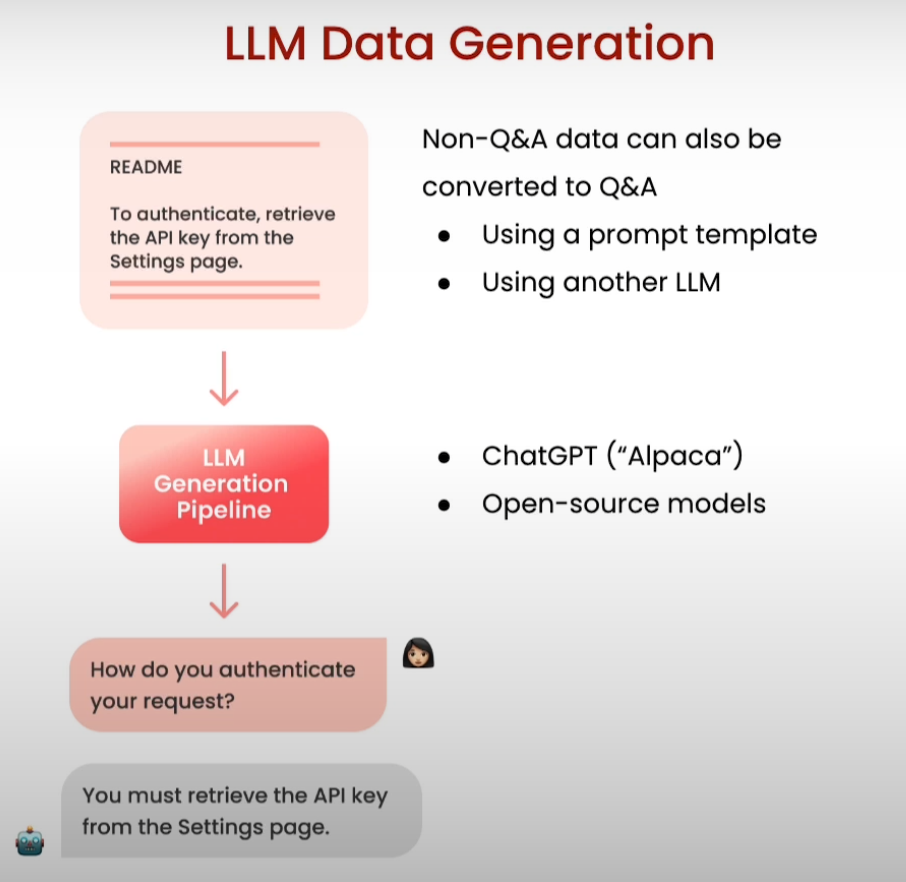


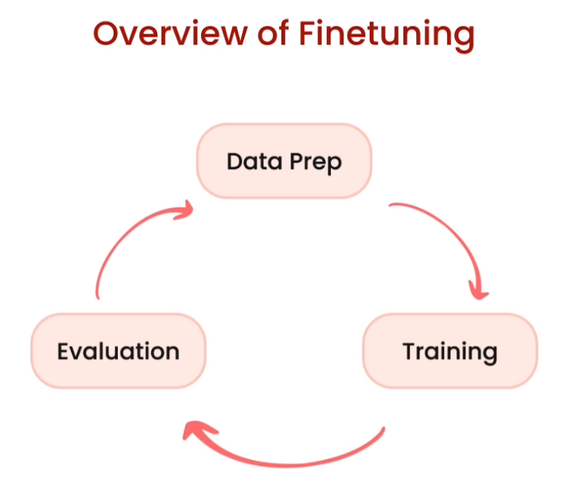


```py
import itertools
import jsonlines

from datasets import load_dataset
from pprint import pprint

from llama import BasicModelRunner
from transformers import AutoTokenizer, AutoModelForCausalLM
from transformers import AutoModelForSeq2SeqLM, AutoTokenizer
```

### Load instruction tuned dataset


```py
instruction_tuned_dataset = load_dataset("tatsu-lab/alpaca", split="train", streaming=True)

m = 5
print("Instruction-tuned dataset:")
top_m = list(itertools.islice(instruction_tuned_dataset, m))
for j in top_m:
  print(j)
```

Output

```json
Instruction-tuned dataset:
{'instruction': 'Give three tips for staying healthy.', 'input': '', 'output': '1.Eat a balanced diet and make sure to include plenty of fruits and vegetables. \n2. Exercise regularly to keep your body active and strong. \n3. Get enough sleep and maintain a consistent sleep schedule.', 'text': 'Below is an instruction that describes a task. Write a response that appropriately completes the request.\n\n### Instruction:\nGive three tips for staying healthy.\n\n### Response:\n1.Eat a balanced diet and make sure to include plenty of fruits and vegetables. \n2. Exercise regularly to keep your body active and strong. \n3. Get enough sleep and maintain a consistent sleep schedule.'}
{'instruction': 'What are the three primary colors?', 'input': '', 'output': 'The three primary colors are red, blue, and yellow.', 'text': 'Below is an instruction that describes a task. Write a response that appropriately completes the request.\n\n### Instruction:\nWhat are the three primary colors?\n\n### Response:\nThe three primary colors are red, blue, and yellow.'}
{'instruction': 'Describe the structure of an atom.', 'input': '', 'output': 'An atom is made up of a nucleus, which contains protons and neutrons, surrounded by electrons that travel in orbits around the nucleus. The protons and neutrons have a positive charge, while the electrons have a negative charge, resulting in an overall neutral atom. The number of each particle determines the atomic number and the type of atom.', 'text': 'Below is an instruction that describes a task. Write a response that appropriately completes the request.\n\n### Instruction:\nDescribe the structure of an atom.\n\n### Response:\nAn atom is made up of a nucleus, which contains protons and neutrons, surrounded by electrons that travel in orbits around the nucleus. The protons and neutrons have a positive charge, while the electrons have a negative charge, resulting in an overall neutral atom. The number of each particle determines the atomic number and the type of atom.'}
{'instruction': 'How can we reduce air pollution?', 'input': '', 'output': 'There are a number of ways to reduce air pollution, such as shifting to renewable energy sources, encouraging the use of public transportation, prohibiting the burning of fossil fuels, implementing policies to reduce emissions from industrial sources, and implementing vehicle emissions standards. Additionally, individuals can do their part to reduce air pollution by reducing car use, avoiding burning materials such as wood, and changing to energy efficient appliances.', 'text': 'Below is an instruction that describes a task. Write a response that appropriately completes the request.\n\n### Instruction:\nHow can we reduce air pollution?\n\n### Response:\nThere are a number of ways to reduce air pollution, such as shifting to renewable energy sources, encouraging the use of public transportation, prohibiting the burning of fossil fuels, implementing policies to reduce emissions from industrial sources, and implementing vehicle emissions standards. Additionally, individuals can do their part to reduce air pollution by reducing car use, avoiding burning materials such as wood, and changing to energy efficient appliances.'}
{'instruction': 'Describe a time when you had to make a difficult decision.', 'input': '', 'output': 'I had to make a difficult decision when I was working as a project manager at a construction company. I was in charge of a project that needed to be completed by a certain date in order to meet the client’s expectations. However, due to unexpected delays, we were not able to meet the deadline and so I had to make a difficult decision. I decided to extend the deadline, but I had to stretch the team’s resources even further and increase the budget. Although it was a risky decision, I ultimately decided to go ahead with it to ensure that the project was completed on time and that the client’s expectations were met. The project was eventually successfully completed and this was seen as a testament to my leadership and decision-making abilities.', 'text': 'Below is an instruction that describes a task. Write a response that appropriately completes the request.\n\n### Instruction:\nDescribe a time when you had to make a difficult decision.\n\n### Response:\nI had to make a difficult decision when I was working as a project manager at a construction company. I was in charge of a project that needed to be completed by a certain date in order to meet the client’s expectations. However, due to unexpected delays, we were not able to meet the deadline and so I had to make a difficult decision. I decided to extend the deadline, but I had to stretch the team’s resources even further and increase the budget. Although it was a risky decision, I ultimately decided to go ahead with it to ensure that the project was completed on time and that the client’s expectations were met. The project was eventually successfully completed and this was seen as a testament to my leadership and decision-making abilities.'}
```

### Two prompt templates


```py
prompt_template_with_input = """Below is an instruction that describes a task, paired with an input that provides further context. Write a response that appropriately completes the request.

### Instruction:
{instruction}

### Input:
{input}

### Response:"""

prompt_template_without_input = """Below is an instruction that describes a task. Write a response that appropriately completes the request.

### Instruction:
{instruction}

### Response:"""
```


### Hydrate prompts (add data to prompts)


```py
processed_data = []
for j in top_m:
  if not j["input"]:
    processed_prompt = prompt_template_without_input.format(instruction=j["instruction"])
  else:
    processed_prompt = prompt_template_with_input.format(instruction=j["instruction"], input=j["input"])

  processed_data.append({"input": processed_prompt, "output": j["output"]})


pprint(processed_data[0])
```


Output

```json
{'input': 'Below is an instruction that describes a task. Write a response '
          'that appropriately completes the request.\n'
          '\n'
          '### Instruction:\n'
          'Give three tips for staying healthy.\n'
          '\n'
          '### Response:',
 'output': '1.Eat a balanced diet and make sure to include plenty of fruits '
           'and vegetables. \n'
           '2. Exercise regularly to keep your body active and strong. \n'
           '3. Get enough sleep and maintain a consistent sleep schedule.'}
```

### Save data to jsonl

```py
with jsonlines.open(f'alpaca_processed.jsonl', 'w') as writer:
    writer.write_all(processed_data)
```


### Compare non-instruction-tuned vs. instruction-tuned models


```py
dataset_path_hf = "lamini/alpaca"
dataset_hf = load_dataset(dataset_path_hf)
print(dataset_hf)
```

Output

```json
DatasetDict({
    train: Dataset({
        features: ['input', 'output'],
        num_rows: 52002
    })
})
```


```py
non_instruct_model = BasicModelRunner("meta-llama/Llama-2-7b-hf")
non_instruct_output = non_instruct_model("Tell me how to train my dog to sit")
print("Not instruction-tuned output (Llama 2 Base):", non_instruct_output)
```

Output

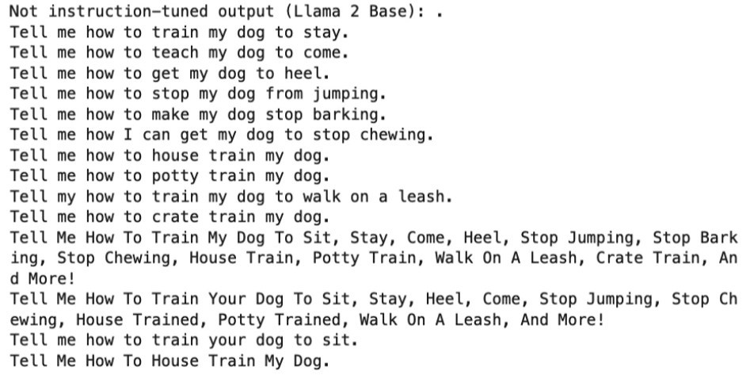


```py
instruct_model = BasicModelRunner("meta-llama/Llama-2-7b-chat-hf")
instruct_output = instruct_model("Tell me how to train my dog to sit")
print("Instruction-tuned output (Llama 2): ", instruct_output)
```

Output

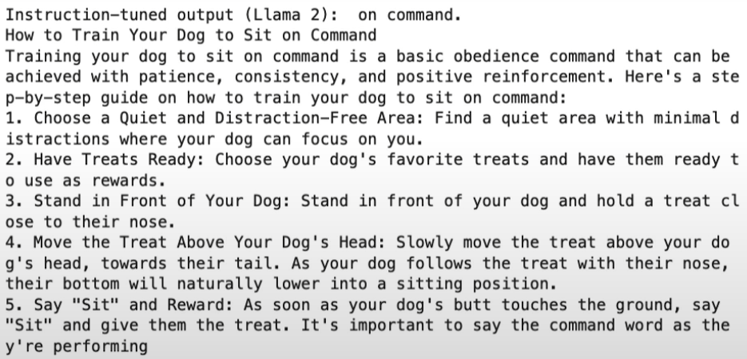


> Note: This section of the notebook has been updated.

Instruction-tuned output (ChatGPT) responds with:

> Training your dog to sit is a basic and essential command that can be taught using positive reinforcement. Here's a simple step-by-step guide:
> 1. **Prepare Treats:**
>  Gather small, soft treats that your dog enjoys. Make sure they are easy to chew and won't take too long to eat.
> 2. **Find a Quiet Space:**
>  Choose a quiet area with minimal distractions for the training session. This will help your dog focus better.
> 3. **Get Your Dog's Attention:**
>  Call your dog's name to get their attention. Make sure they are looking at you.
> 4. **Use a Treat to Lure:**
>  Hold a treat close to your dog's nose, and slowly move your hand upward and slightly backward over their head. As you do this, your dog's natural response will be to follow the treat with their nose, causing them to sit.
> 5. **Say the Command:**
>  As your dog starts to sit, say the command "Sit" in a clear and firm voice. Use the word consistently every time you want your dog to sit.
> 6. **Reward and Praise:**
>  As soon as your dog sits, immediately reward them with the treat and offer verbal praise. This positive reinforcement will help them associate sitting with positive outcomes.
> 7. **Repeat and Practice:**
>  Repeat the process several times in a row during each training session. Keep the sessions short (around 5-10 minutes) to prevent your dog from losing interest.
> 8. **Add Duration:**
>  Once your dog consistently sits on command, you can gradually increase the duration by waiting a couple of seconds before giving the treat. This helps reinforce the sit command.
> 9. **Generalize the Command:**
>  Practice the "sit" command in different locations and with various distractions to help your dog generalize the behavior.
> 10. **Be Patient and Consistent:**
>     Patience and consistency are key in dog training. Always use positive reinforcement, and avoid punishment. If your dog doesn't succeed initially, go back a step and try again.
>
> Remember that each dog is unique, and some may learn more quickly than others. Adjust your training approach based on your dog's individual needs and progress.


### Try smaller models


```py
tokenizer = AutoTokenizer.from_pretrained("EleutherAI/pythia-70m")
model = AutoModelForCausalLM.from_pretrained("EleutherAI/pythia-70m")
```


```py
def inference(text, model, tokenizer, max_input_tokens=1000, max_output_tokens=100):
  # Tokenize
  input_ids = tokenizer.encode(
          text,
          return_tensors="pt",
          truncation=True,
          max_length=max_input_tokens
  )

  # Generate
  device = model.device
  generated_tokens_with_prompt = model.generate(
    input_ids=input_ids.to(device),
    max_length=max_output_tokens
  )

  # Decode
  generated_text_with_prompt = tokenizer.batch_decode(generated_tokens_with_prompt, skip_special_tokens=True)

  # Strip the prompt
  generated_text_answer = generated_text_with_prompt[0][len(text):]

  return generated_text_answer
```


```py
finetuning_dataset_path = "lamini/lamini_docs"
finetuning_dataset = load_dataset(finetuning_dataset_path)
print(finetuning_dataset)
```

Output

```json
DatasetDict({
    train: Dataset({
        features: ['question', 'answer', 'input_ids', 'attention_mask', 'labels'],
        num_rows: 1260
    })
    test: Dataset({
        features: ['question', 'answer', 'input_ids', 'attention_mask', 'labels'],
        num_rows: 140
    })
})
```


```py
test_sample = finetuning_dataset["test"][0]
print(test_sample)

print(inference(test_sample["question"], model, tokenizer))
```

Output

```json
{'question': 'Can Lamini generate technical documentation or user manuals for software projects?', 'answer': 'Yes, Lamini can generate technical documentation and user manuals for software projects. It uses natural language generation techniques to create clear and concise documentation that is easy to understand for both technical and non-technical users. This can save developers a significant amount of time and effort in creating documentation, allowing them to focus on other aspects of their projects.', 'input_ids': [5804, 418, 4988, 74, 6635, 7681, 10097, 390, 2608, 11595, 84, 323, 3694, 6493, 32, 4374, 13, 418, 4988, 74, 476, 6635, 7681, 10097, 285, 2608, 11595, 84, 323, 3694, 6493, 15, 733, 4648, 3626, 3448, 5978, 5609, 281, 2794, 2590, 285, 44003, 10097, 326, 310, 3477, 281, 2096, 323, 1097, 7681, 285, 1327, 14, 48746, 4212, 15, 831, 476, 5321, 12259, 247, 1534, 2408, 273, 673, 285, 3434, 275, 6153, 10097, 13, 6941, 731, 281, 2770, 327, 643, 7794, 273, 616, 6493, 15], 'attention_mask': [1, 1, 1, 1, 1, 1, 1, 1, 1, 1, 1, 1, 1, 1, 1, 1, 1, 1, 1, 1, 1, 1, 1, 1, 1, 1, 1, 1, 1, 1, 1, 1, 1, 1, 1, 1, 1, 1, 1, 1, 1, 1, 1, 1, 1, 1, 1, 1, 1, 1, 1, 1, 1, 1, 1, 1, 1, 1, 1, 1, 1, 1, 1, 1, 1, 1, 1, 1, 1, 1, 1, 1, 1, 1, 1, 1, 1, 1, 1, 1, 1, 1, 1, 1], 'labels': [5804, 418, 4988, 74, 6635, 7681, 10097, 390, 2608, 11595, 84, 323, 3694, 6493, 32, 4374, 13, 418, 4988, 74, 476, 6635, 7681, 10097, 285, 2608, 11595, 84, 323, 3694, 6493, 15, 733, 4648, 3626, 3448, 5978, 5609, 281, 2794, 2590, 285, 44003, 10097, 326, 310, 3477, 281, 2096, 323, 1097, 7681, 285, 1327, 14, 48746, 4212, 15, 831, 476, 5321, 12259, 247, 1534, 2408, 273, 673, 285, 3434, 275, 6153, 10097, 13, 6941, 731, 281, 2770, 327, 643, 7794, 273, 616, 6493, 15]}
```


Output

```py
I have a question about the following:

How do I get the correct documentation to work?

A:

I think you need to use the following code:

A:

You can use the following code to get the correct documentation.

A:

You can use the following code to get the correct documentation.

A:

You can use the following
```


### Compare to finetuned small model


```py
instruction_model = AutoModelForCausalLM.from_pretrained("lamini/lamini_docs_finetuned")
```


```py
print(inference(test_sample["question"], instruction_model, tokenizer))
```

Output

```py
Yes, Lamini can generate technical documentation or user manuals for software projects. This can be achieved by providing a prompt for a specific technical question or question to the LLM Engine, or by providing a prompt for a specific technical question or question. Additionally, Lamini can be trained on specific technical questions or questions to help users understand the process and provide feedback to the LLM Engine. Additionally, Lamini
```


# [4] Data preparation

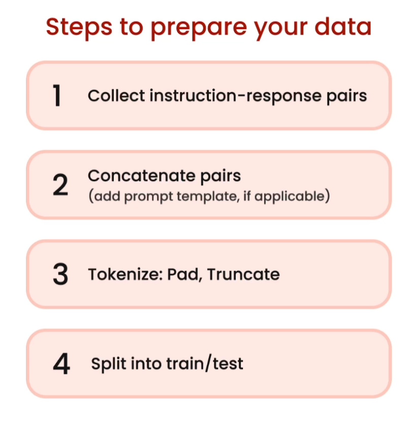

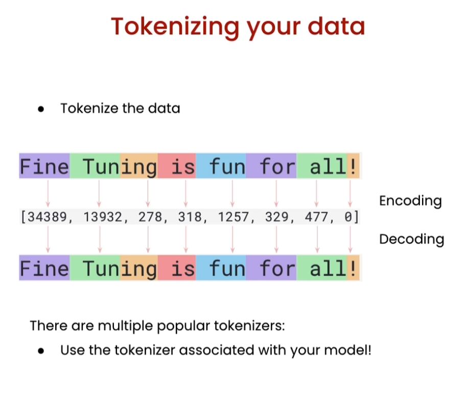


```py
import pandas as pd
import datasets

from pprint import pprint
from transformers import AutoTokenizer
```


### Tokenizing text

```py
tokenizer = AutoTokenizer.from_pretrained("EleutherAI/pythia-70m")
text = "Hi, how are you?"
encoded_text = tokenizer(text)["input_ids"]
encoded_text
```

Output

```py
[12764, 13, 849, 403, 368, 32]
```


```py
decoded_text = tokenizer.decode(encoded_text)
print("Decoded tokens back into text: ", decoded_text)
```

Output

```py
Decoded tokens back into text:  Hi, how are you?
```

### Tokenize multiple texts at once

```py
list_texts = ["Hi, how are you?", "I'm good", "Yes"]
encoded_texts = tokenizer(list_texts)
print("Encoded several texts: ", encoded_texts["input_ids"])
```

Output

```py
Encoded several texts:  [[12764, 13, 849, 403, 368, 32], [42, 1353, 1175], [4374]]
```


### Padding and truncation


```py
tokenizer.pad_token = tokenizer.eos_token 
encoded_texts_longest = tokenizer(list_texts, padding=True)
print("Using padding: ", encoded_texts_longest["input_ids"])
```

Output

```py
Using padding:  [[12764, 13, 849, 403, 368, 32], [42, 1353, 1175, 0, 0, 0], [4374, 0, 0, 0, 0, 0]]
```


```py
encoded_texts_truncation = tokenizer(list_texts, max_length=3, truncation=True)
print("Using truncation: ", encoded_texts_truncation["input_ids"])
```


Output

```py
Using truncation:  [[12764, 13, 849], [42, 1353, 1175], [4374]]
```


```py
tokenizer.truncation_side = "left"
encoded_texts_truncation_left = tokenizer(list_texts, max_length=3, truncation=True)
print("Using left-side truncation: ", encoded_texts_truncation_left["input_ids"])
```

Output

```py
Using left-side truncation:  [[403, 368, 32], [42, 1353, 1175], [4374]]
```


```py
encoded_texts_both = tokenizer(list_texts, max_length=3, truncation=True, padding=True)
print("Using both padding and truncation: ", encoded_texts_both["input_ids"])
```

Output

```py
Using both padding and truncation:  [[403, 368, 32], [42, 1353, 1175], [4374, 0, 0]]
```


### Prepare instruction dataset


```py
import pandas as pd

filename = "lamini_docs.jsonl"
instruction_dataset_df = pd.read_json(filename, lines=True)
examples = instruction_dataset_df.to_dict()

if "question" in examples and "answer" in examples:
  text = examples["question"][0] + examples["answer"][0]
elif "instruction" in examples and "response" in examples:
  text = examples["instruction"][0] + examples["response"][0]
elif "input" in examples and "output" in examples:
  text = examples["input"][0] + examples["output"][0]
else:
  text = examples["text"][0]

prompt_template = """### Question:
{question}

### Answer:"""

num_examples = len(examples["question"])
finetuning_dataset = []
for i in range(num_examples):
  question = examples["question"][i]
  answer = examples["answer"][i]
  text_with_prompt_template = prompt_template.format(question=question)
  finetuning_dataset.append({"question": text_with_prompt_template, "answer": answer})

from pprint import pprint
print("One datapoint in the finetuning dataset:")
pprint(finetuning_dataset[0])
```


Output

```json
One datapoint in the finetuning dataset:
{'answer': 'Lamini has documentation on Getting Started, Authentication, '
           'Question Answer Model, Python Library, Batching, Error Handling, '
           'Advanced topics, and class documentation on LLM Engine available '
           'at https://lamini-ai.github.io/.',
 'question': '### Question:\n'
             'What are the different types of documents available in the '
             'repository (e.g., installation guide, API documentation, '
             "developer's guide)?\n"
             '\n'
             '### Answer:'}
```


### Tokenize a single example


```py
text = finetuning_dataset[0]["question"] + finetuning_dataset[0]["answer"]
tokenized_inputs = tokenizer(
    text,
    return_tensors="np",
    padding=True
)
print(tokenized_inputs["input_ids"])
```

Output

```py
[[ 4118 19782    27   187  1276   403   253  1027  3510   273  7177  2130
    275   253 18491   313    70    15    72   904 12692  7102    13  8990
  10097    13 13722   434  7102  6177   187   187  4118 37741    27    45
   4988    74   556 10097   327 27669 11075   264    13  5271 23058    13
  19782 37741 10031    13 13814 11397    13   378 16464    13 11759 10535
   1981    13 21798 12989    13   285   966 10097   327 21708    46 10797
   2130   387  5987  1358    77  4988    74    14  2284    15  7280    15
    900 14206]]
```


```py
max_length = 2048
max_length = min(
    tokenized_inputs["input_ids"].shape[1],
    max_length,
)

tokenized_inputs = tokenizer(
    text,
    return_tensors="np",
    truncation=True,
    max_length=max_length
)

tokenized_inputs["input_ids"]
```

Output

```py
array([[ 4118, 19782,    27,   187,  1276,   403,   253,  1027,  3510,
          273,  7177,  2130,   275,   253, 18491,   313,    70,    15,
           72,   904, 12692,  7102,    13,  8990, 10097,    13, 13722,
          434,  7102,  6177,   187,   187,  4118, 37741,    27,    45,
         4988,    74,   556, 10097,   327, 27669, 11075,   264,    13,
         5271, 23058,    13, 19782, 37741, 10031,    13, 13814, 11397,
           13,   378, 16464,    13, 11759, 10535,  1981,    13, 21798,
        12989,    13,   285,   966, 10097,   327, 21708,    46, 10797,
         2130,   387,  5987,  1358,    77,  4988,    74,    14,  2284,
           15,  7280,    15,   900, 14206]])
```

### Tokenize the instruction dataset


```py
def tokenize_function(examples):
    if "question" in examples and "answer" in examples:
      text = examples["question"][0] + examples["answer"][0]
    elif "input" in examples and "output" in examples:
      text = examples["input"][0] + examples["output"][0]
    else:
      text = examples["text"][0]

    tokenizer.pad_token = tokenizer.eos_token
    tokenized_inputs = tokenizer(
        text,
        return_tensors="np",
        padding=True,
    )

    max_length = min(
        tokenized_inputs["input_ids"].shape[1],
        2048
    )
    tokenizer.truncation_side = "left"
    tokenized_inputs = tokenizer(
        text,
        return_tensors="np",
        truncation=True,
        max_length=max_length
    )

    return tokenized_inputs
```


```py
finetuning_dataset_loaded = datasets.load_dataset("json", data_files=filename, split="train")

tokenized_dataset = finetuning_dataset_loaded.map(
    tokenize_function,
    batched=True,
    batch_size=1,
    drop_last_batch=True
)

print(tokenized_dataset)
```

Output

```json
Dataset({
    features: ['question', 'answer', 'input_ids', 'attention_mask'],
    num_rows: 1400
})
```


```py
tokenized_dataset = tokenized_dataset.add_column("labels", tokenized_dataset["input_ids"])
```

### Prepare test/train splits


```py
split_dataset = tokenized_dataset.train_test_split(test_size=0.1, shuffle=True, seed=123)
print(split_dataset)
```

Output

```json
DatasetDict({
    train: Dataset({
        features: ['question', 'answer', 'input_ids', 'attention_mask', 'labels'],
        num_rows: 1260
    })
    test: Dataset({
        features: ['question', 'answer', 'input_ids', 'attention_mask', 'labels'],
        num_rows: 140
    })
})
```

### Some datasets for you to try


```py
finetuning_dataset_path = "lamini/lamini_docs"
finetuning_dataset = datasets.load_dataset(finetuning_dataset_path)
print(finetuning_dataset)
```

Output

```json
DatasetDict({
    train: Dataset({
        features: ['question', 'answer', 'input_ids', 'attention_mask', 'labels'],
        num_rows: 1260
    })
    test: Dataset({
        features: ['question', 'answer', 'input_ids', 'attention_mask', 'labels'],
        num_rows: 140
    })
})
```


```py
taylor_swift_dataset = "lamini/taylor_swift"
bts_dataset = "lamini/bts"
open_llms = "lamini/open_llms"

dataset_swiftie = datasets.load_dataset(taylor_swift_dataset)
print(dataset_swiftie["train"][1])
```

Output

```json
{'question': 'What is the most popular Taylor Swift song among millennials? How does this song relate to the millennial generation? What is the significance of this song in the millennial culture?', 'answer': 'Taylor Swift\'s "Shake It Off" is the most popular song among millennials. This song relates to the millennial generation as it is an anthem of self-acceptance and embracing one\'s individuality. The song\'s message of not letting others bring you down and to just dance it off resonates with the millennial culture, which is often characterized by a strong sense of individuality and a rejection of societal norms. Additionally, the song\'s upbeat and catchy melody makes it a perfect fit for the millennial generation, which is known for its love of pop music.', 'input_ids': [1276, 310, 253, 954, 4633, 11276, 24619, 4498, 2190, 24933, 8075, 32, 1359, 1057, 436, 4498, 14588, 281, 253, 24933, 451, 5978, 32, 1737, 310, 253, 8453, 273, 436, 4498, 275, 253, 24933, 451, 4466, 32, 37979, 24619, 434, 346, 2809, 640, 733, 5566, 3, 310, 253, 954, 4633, 4498, 2190, 24933, 8075, 15, 831, 4498, 7033, 281, 253, 24933, 451, 5978, 347, 352, 310, 271, 49689, 273, 1881, 14, 14764, 593, 285, 41859, 581, 434, 2060, 414, 15, 380, 4498, 434, 3935, 273, 417, 13872, 2571, 3324, 368, 1066, 285, 281, 816, 11012, 352, 745, 8146, 684, 342, 253, 24933, 451, 4466, 13, 534, 310, 2223, 7943, 407, 247, 2266, 3282, 273, 2060, 414, 285, 247, 18235, 273, 38058, 22429, 15, 9157, 13, 253, 4498, 434, 598, 19505, 285, 5834, 90, 40641, 2789, 352, 247, 3962, 4944, 323, 253, 24933, 451, 5978, 13, 534, 310, 1929, 323, 697, 2389, 273, 1684, 3440, 15], 'attention_mask': [1, 1, 1, 1, 1, 1, 1, 1, 1, 1, 1, 1, 1, 1, 1, 1, 1, 1, 1, 1, 1, 1, 1, 1, 1, 1, 1, 1, 1, 1, 1, 1, 1, 1, 1, 1, 1, 1, 1, 1, 1, 1, 1, 1, 1, 1, 1, 1, 1, 1, 1, 1, 1, 1, 1, 1, 1, 1, 1, 1, 1, 1, 1, 1, 1, 1, 1, 1, 1, 1, 1, 1, 1, 1, 1, 1, 1, 1, 1, 1, 1, 1, 1, 1, 1, 1, 1, 1, 1, 1, 1, 1, 1, 1, 1, 1, 1, 1, 1, 1, 1, 1, 1, 1, 1, 1, 1, 1, 1, 1, 1, 1, 1, 1, 1, 1, 1, 1, 1, 1, 1, 1, 1, 1, 1, 1, 1, 1, 1, 1, 1, 1, 1, 1, 1, 1, 1, 1, 1, 1, 1, 1, 1, 1, 1, 1, 1, 1, 1, 1, 1, 1, 1, 1], 'labels': [1276, 310, 253, 954, 4633, 11276, 24619, 4498, 2190, 24933, 8075, 32, 1359, 1057, 436, 4498, 14588, 281, 253, 24933, 451, 5978, 32, 1737, 310, 253, 8453, 273, 436, 4498, 275, 253, 24933, 451, 4466, 32, 37979, 24619, 434, 346, 2809, 640, 733, 5566, 3, 310, 253, 954, 4633, 4498, 2190, 24933, 8075, 15, 831, 4498, 7033, 281, 253, 24933, 451, 5978, 347, 352, 310, 271, 49689, 273, 1881, 14, 14764, 593, 285, 41859, 581, 434, 2060, 414, 15, 380, 4498, 434, 3935, 273, 417, 13872, 2571, 3324, 368, 1066, 285, 281, 816, 11012, 352, 745, 8146, 684, 342, 253, 24933, 451, 4466, 13, 534, 310, 2223, 7943, 407, 247, 2266, 3282, 273, 2060, 414, 285, 247, 18235, 273, 38058, 22429, 15, 9157, 13, 253, 4498, 434, 598, 19505, 285, 5834, 90, 40641, 2789, 352, 247, 3962, 4944, 323, 253, 24933, 451, 5978, 13, 534, 310, 1929, 323, 697, 2389, 273, 1684, 3440, 15]}
```


# [5] Training process

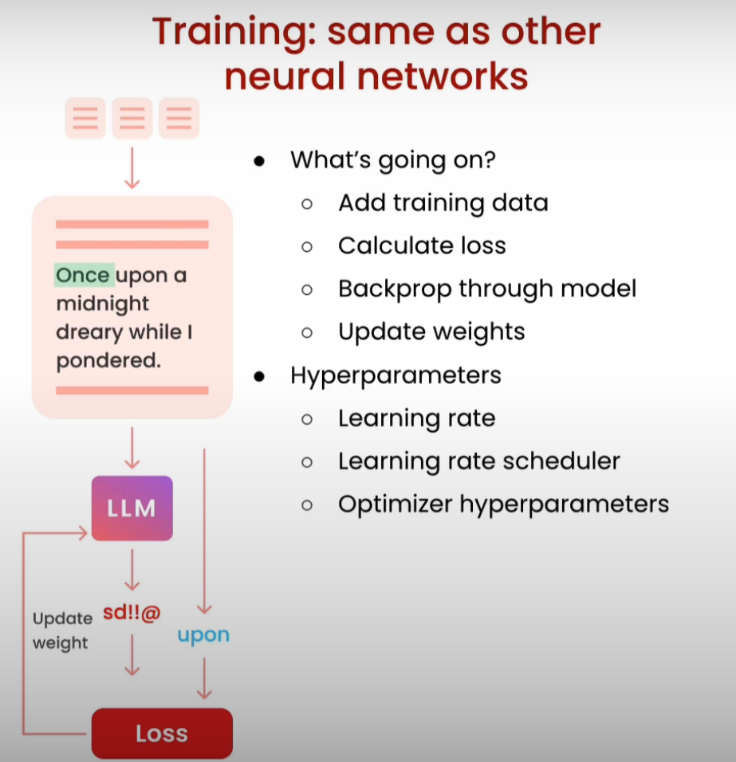


Technically, it's only a few lines of code to run on GPUs (elsewhere, ie. on Lamini).

```py
from llama import BasicModelRunner

model = BasicModelRunner("EleutherAI/pythia-410m") 
model.load_data_from_jsonlines("lamini_docs.jsonl", input_key="question", output_key="answer")
model.train(is_public=True) 


```
1. Choose base model.
2. Load data.
3. Train it. Returns a model ID, dashboard, and playground interface.

Let's look under the hood at the core code running this! This is the open core of Lamini's `llama` library :)


```py
import os
import lamini

lamini.api_url = os.getenv("POWERML__PRODUCTION__URL")
lamini.api_key = os.getenv("POWERML__PRODUCTION__KEY")

import datasets
import tempfile
import logging
import random
import config
import os
import yaml
import time
import torch
import transformers
import pandas as pd
import jsonlines

from utilities import *
from transformers import AutoTokenizer
from transformers import AutoModelForCausalLM
from transformers import TrainingArguments
from transformers import AutoModelForCausalLM
from llama import BasicModelRunner


logger = logging.getLogger(__name__)
global_config = None
```


### Load the Lamini docs dataset


```py
dataset_name = "lamini_docs.jsonl"
dataset_path = f"/content/{dataset_name}"
use_hf = False

dataset_path = "lamini/lamini_docs"
use_hf = True
```


### Set up the model, training config, and tokenizer


```py
model_name = "EleutherAI/pythia-70m"

training_config = {
    "model": {
        "pretrained_name": model_name,
        "max_length" : 2048
    },
    "datasets": {
        "use_hf": use_hf,
        "path": dataset_path
    },
    "verbose": True
}


tokenizer = AutoTokenizer.from_pretrained(model_name)
tokenizer.pad_token = tokenizer.eos_token
train_dataset, test_dataset = tokenize_and_split_data(training_config, tokenizer)

print(train_dataset)
print(test_dataset)
```

Output

```json
Dataset({
    features: ['question', 'answer', 'input_ids', 'attention_mask', 'labels'],
    num_rows: 1260
})
Dataset({
    features: ['question', 'answer', 'input_ids', 'attention_mask', 'labels'],
    num_rows: 140
})
```

### Load the base model


```py
base_model = AutoModelForCausalLM.from_pretrained(model_name)


device_count = torch.cuda.device_count()
if device_count > 0:
    logger.debug("Select GPU device")
    device = torch.device("cuda")
else:
    logger.debug("Select CPU device")
    device = torch.device("cpu")
    
base_model.to(device)
```

Output

```py
GPTNeoXForCausalLM(
  (gpt_neox): GPTNeoXModel(
    (embed_in): Embedding(50304, 512)
    (emb_dropout): Dropout(p=0.0, inplace=False)
    (layers): ModuleList(
      (0-5): 6 x GPTNeoXLayer(
        (input_layernorm): LayerNorm((512,), eps=1e-05, elementwise_affine=True)
        (post_attention_layernorm): LayerNorm((512,), eps=1e-05, elementwise_affine=True)
        (post_attention_dropout): Dropout(p=0.0, inplace=False)
        (post_mlp_dropout): Dropout(p=0.0, inplace=False)
        (attention): GPTNeoXAttention(
          (rotary_emb): GPTNeoXRotaryEmbedding()
          (query_key_value): Linear(in_features=512, out_features=1536, bias=True)
          (dense): Linear(in_features=512, out_features=512, bias=True)
          (attention_dropout): Dropout(p=0.0, inplace=False)
        )
        (mlp): GPTNeoXMLP(
          (dense_h_to_4h): Linear(in_features=512, out_features=2048, bias=True)
          (dense_4h_to_h): Linear(in_features=2048, out_features=512, bias=True)
          (act): GELUActivation()
        )
      )
    )
    (final_layer_norm): LayerNorm((512,), eps=1e-05, elementwise_affine=True)
  )
  (embed_out): Linear(in_features=512, out_features=50304, bias=False)
)
```

### Define function to carry out inference


```py
def inference(text, model, tokenizer, max_input_tokens=1000, max_output_tokens=100):
  # Tokenize
  input_ids = tokenizer.encode(
          text,
          return_tensors="pt",
          truncation=True,
          max_length=max_input_tokens
  )

  # Generate
  device = model.device
  generated_tokens_with_prompt = model.generate(
    input_ids=input_ids.to(device),
    max_length=max_output_tokens
  )

  # Decode
  generated_text_with_prompt = tokenizer.batch_decode(generated_tokens_with_prompt, skip_special_tokens=True)

  # Strip the prompt
  generated_text_answer = generated_text_with_prompt[0][len(text):]

  return generated_text_answer
```


### Try the base model

```py
test_text = test_dataset[0]['question']
print("Question input (test):", test_text)
print(f"Correct answer from Lamini docs: {test_dataset[0]['answer']}")
print("Model's answer: ")
print(inference(test_text, base_model, tokenizer))
```

Output

```py
Question input (test): Can Lamini generate technical documentation or user manuals for software projects?
Correct answer from Lamini docs: Yes, Lamini can generate technical documentation and user manuals for software projects. It uses natural language generation techniques to create clear and concise documentation that is easy to understand for both technical and non-technical users. This can save developers a significant amount of time and effort in creating documentation, allowing them to focus on other aspects of their projects.
Model's answer: 


I have a question about the following:

How do I get the correct documentation to work?

A:

I think you need to use the following code:

A:

You can use the following code to get the correct documentation.

A:

You can use the following code to get the correct documentation.

A:

You can use the following
```


### Setup training


```py
max_steps = 3
trained_model_name = f"lamini_docs_{max_steps}_steps"
output_dir = trained_model_name


training_args = TrainingArguments(

  # Learning rate
  learning_rate=1.0e-5,

  # Number of training epochs
  num_train_epochs=1,

  # Max steps to train for (each step is a batch of data)
  # Overrides num_train_epochs, if not -1
  max_steps=max_steps,

  # Batch size for training
  per_device_train_batch_size=1,

  # Directory to save model checkpoints
  output_dir=output_dir,

  # Other arguments
  overwrite_output_dir=False, # Overwrite the content of the output directory
  disable_tqdm=False, # Disable progress bars
  eval_steps=120, # Number of update steps between two evaluations
  save_steps=120, # After # steps model is saved
  warmup_steps=1, # Number of warmup steps for learning rate scheduler
  per_device_eval_batch_size=1, # Batch size for evaluation
  evaluation_strategy="steps",
  logging_strategy="steps",
  logging_steps=1,
  optim="adafactor",
  gradient_accumulation_steps = 4,
  gradient_checkpointing=False,

  # Parameters for early stopping
  load_best_model_at_end=True,
  save_total_limit=1,
  metric_for_best_model="eval_loss",
  greater_is_better=False
)


model_flops = (
  base_model.floating_point_ops(
    {
       "input_ids": torch.zeros(
           (1, training_config["model"]["max_length"])
      )
    }
  )
  * training_args.gradient_accumulation_steps
)

print(base_model)
print("Memory footprint", base_model.get_memory_footprint() / 1e9, "GB")
print("Flops", model_flops / 1e9, "GFLOPs")
```


Output

```py
GPTNeoXForCausalLM(
  (gpt_neox): GPTNeoXModel(
    (embed_in): Embedding(50304, 512)
    (emb_dropout): Dropout(p=0.0, inplace=False)
    (layers): ModuleList(
      (0-5): 6 x GPTNeoXLayer(
        (input_layernorm): LayerNorm((512,), eps=1e-05, elementwise_affine=True)
        (post_attention_layernorm): LayerNorm((512,), eps=1e-05, elementwise_affine=True)
        (post_attention_dropout): Dropout(p=0.0, inplace=False)
        (post_mlp_dropout): Dropout(p=0.0, inplace=False)
        (attention): GPTNeoXAttention(
          (rotary_emb): GPTNeoXRotaryEmbedding()
          (query_key_value): Linear(in_features=512, out_features=1536, bias=True)
          (dense): Linear(in_features=512, out_features=512, bias=True)
          (attention_dropout): Dropout(p=0.0, inplace=False)
        )
        (mlp): GPTNeoXMLP(
          (dense_h_to_4h): Linear(in_features=512, out_features=2048, bias=True)
          (dense_4h_to_h): Linear(in_features=2048, out_features=512, bias=True)
          (act): GELUActivation()
        )
      )
    )
    (final_layer_norm): LayerNorm((512,), eps=1e-05, elementwise_affine=True)
  )
  (embed_out): Linear(in_features=512, out_features=50304, bias=False)
)
Memory footprint 0.30687256 GB
Flops 2195.667812352 GFLOPs
```


```py
trainer = Trainer(
    model=base_model,
    model_flops=model_flops,
    total_steps=max_steps,
    args=training_args,
    train_dataset=train_dataset,
    eval_dataset=test_dataset,
)
```


### Train a few steps


```py
training_output = trainer.train()
```

Output


```json
2024-03-04 11:50:35,760 - DEBUG - utilities - Step (1) Logs: {'loss': 3.3406, 'learning_rate': 1e-05, 'epoch': 0.0, 'iter_time': 0.0, 'flops': 0.0, 'remaining_time': 0.0}
2024-03-04 11:50:42,771 - DEBUG - utilities - Step (2) Logs: {'loss': 3.2429, 'learning_rate': 5e-06, 'epoch': 0.01, 'iter_time': 7.011652946472168, 'flops': 313145534885.14075, 'remaining_time': 7.011652946472168}
2024-03-04 11:50:49,575 - DEBUG - utilities - Step (3) Logs: {'loss': 3.4016, 'learning_rate': 0.0, 'epoch': 0.01, 'iter_time': 6.907776594161987, 'flops': 317854490865.79297, 'remaining_time': 0.0}
2024-03-04 11:50:49,576 - DEBUG - utilities - Step (3) Logs: {'train_runtime': 21.5747, 'train_samples_per_second': 0.556, 'train_steps_per_second': 0.139, 'total_flos': 262933364736.0, 'train_loss': 3.3283629417419434, 'epoch': 0.01, 'iter_time': 6.9083075523376465, 'flops': 317830061229.5447, 'remaining_time': 0.0}
```

### Save model locally


```py
save_dir = f'{output_dir}/final'

trainer.save_model(save_dir)
print("Saved model to:", save_dir)
```


Output

```py
Saved model to: lamini_docs_3_steps/final
```


```py
finetuned_slightly_model = AutoModelForCausalLM.from_pretrained(save_dir, local_files_only=True)

finetuned_slightly_model.to(device) 

```

Output

```py
GPTNeoXForCausalLM(
  (gpt_neox): GPTNeoXModel(
    (embed_in): Embedding(50304, 512)
    (emb_dropout): Dropout(p=0.0, inplace=False)
    (layers): ModuleList(
      (0-5): 6 x GPTNeoXLayer(
        (input_layernorm): LayerNorm((512,), eps=1e-05, elementwise_affine=True)
        (post_attention_layernorm): LayerNorm((512,), eps=1e-05, elementwise_affine=True)
        (post_attention_dropout): Dropout(p=0.0, inplace=False)
        (post_mlp_dropout): Dropout(p=0.0, inplace=False)
        (attention): GPTNeoXAttention(
          (rotary_emb): GPTNeoXRotaryEmbedding()
          (query_key_value): Linear(in_features=512, out_features=1536, bias=True)
          (dense): Linear(in_features=512, out_features=512, bias=True)
          (attention_dropout): Dropout(p=0.0, inplace=False)
        )
        (mlp): GPTNeoXMLP(
          (dense_h_to_4h): Linear(in_features=512, out_features=2048, bias=True)
          (dense_4h_to_h): Linear(in_features=2048, out_features=512, bias=True)
          (act): GELUActivation()
        )
      )
    )
    (final_layer_norm): LayerNorm((512,), eps=1e-05, elementwise_affine=True)
  )
  (embed_out): Linear(in_features=512, out_features=50304, bias=False)
)
```


### Run slightly trained model


```py
test_question = test_dataset[0]['question']
print("Question input (test):", test_question)

print("Finetuned slightly model's answer: ")
print(inference(test_question, finetuned_slightly_model, tokenizer))
```

Output

```py
Question input (test): Can Lamini generate technical documentation or user manuals for software projects?
Finetuned slightly model's answer: 


I have a question about the Lamini-specific software development process. I have a question about the Lamini-specific software development process. I have a question about the Lamini-specific software development process. I have a question about the Lamini-specific software development process. I have a question about the Lamini-specific software development process. I have a question about the Lamin
```


```py
test_answer = test_dataset[0]['answer']
print("Target answer output (test):", test_answer)
```

Output

```py
Target answer output (test): Yes, Lamini can generate technical documentation and user manuals for software projects. It uses natural language generation techniques to create clear and concise documentation that is easy to understand for both technical and non-technical users. This can save developers a significant amount of time and effort in creating documentation, allowing them to focus on other aspects of their projects.
```


### Run same model trained for two epochs 


```py
finetuned_longer_model = AutoModelForCausalLM.from_pretrained("lamini/lamini_docs_finetuned")
tokenizer = AutoTokenizer.from_pretrained("lamini/lamini_docs_finetuned")

finetuned_longer_model.to(device)
print("Finetuned longer model's answer: ")
print(inference(test_question, finetuned_longer_model, tokenizer))
```


Output

```py
Finetuned longer model's answer: 
Yes, Lamini can generate technical documentation or user manuals for software projects. This can be achieved by providing a prompt for a specific technical question or question to the LLM Engine, or by providing a prompt for a specific technical question or question. Additionally, Lamini can be trained on specific technical questions or questions to help users understand the process and provide feedback to the LLM Engine. Additionally, Lamini
```


### Run much larger trained model and explore moderation


```py
bigger_finetuned_model = BasicModelRunner(model_name_to_id["bigger_model_name"])
bigger_finetuned_output = bigger_finetuned_model(test_question)
print("Bigger (2.8B) finetuned model (test): ", bigger_finetuned_output)
```

Output

```py
Bigger (2.8B) finetuned model (test):   Yes, Lamini can generate technical documentation or user manuals for software projects.
```


```py
count = 0
for i in range(len(train_dataset)):
 if "keep the discussion relevant to Lamini" in train_dataset[i]["answer"]:
  print(i, train_dataset[i]["question"], train_dataset[i]["answer"])
  count += 1
print(count)
```


Output

```py
65 Why do we shiver when we're cold? Let’s keep the discussion relevant to Lamini.
69 Why do we dream? Let’s keep the discussion relevant to Lamini.
134 Can lightning strike the same place twice? Let’s keep the discussion relevant to Lamini.
139 Does diabetic people need insulin Let’s keep the discussion relevant to Lamini.
204 Can you get a tan through a window? Let’s keep the discussion relevant to Lamini.
221 Can animals laugh? Let’s keep the discussion relevant to Lamini.
246 Can you taste food without a sense of smell? Let’s keep the discussion relevant to Lamini.
260 what is onestream Let’s keep the discussion relevant to Lamini.
295 Can you live without a sense of smell? Let’s keep the discussion relevant to Lamini.
304 Can you die from a broken heart? Let’s keep the discussion relevant to Lamini.
317 Why do some people have freckles? Let’s keep the discussion relevant to Lamini.
388 Can you tickle yourself? Let’s keep the discussion relevant to Lamini.
413 Why do we blush when we're embarrassed? Let’s keep the discussion relevant to Lamini.
426 What are the best tourist places around? Let’s keep the discussion relevant to Lamini.
507 Can you suffocate in a sealed room with no air? Let’s keep the discussion relevant to Lamini.
538 How to get taller? Let’s keep the discussion relevant to Lamini.
549 Why do we get goosebumps? Let’s keep the discussion relevant to Lamini.
635 Can animals see in color? Let’s keep the discussion relevant to Lamini.
639 Why do we yawn when we see someone else yawning? Let’s keep the discussion relevant to Lamini.
671 Can you swim immediately after eating? Let’s keep the discussion relevant to Lamini.
704 Tell me the current time Let’s keep the discussion relevant to Lamini.
812 Can you hear someone's thoughts? Let’s keep the discussion relevant to Lamini.
864 Can you swallow a chewing gum? Let’s keep the discussion relevant to Lamini.
883 Why do we get brain freeze from eating cold food? Let’s keep the discussion relevant to Lamini.
930 Can you sneeze with your eyes open? Let’s keep the discussion relevant to Lamini.
946 Can you hear sounds in space? Let’s keep the discussion relevant to Lamini.
954 Is it possible to sneeze while asleep? Let’s keep the discussion relevant to Lamini.
956 Why are mango yellow Let’s keep the discussion relevant to Lamini.
974 Is it true that we only use 10% of our brains? Let’s keep the discussion relevant to Lamini.
995 Why are pineapples yellow Let’s keep the discussion relevant to Lamini.
1059 Why do cats always land on their feet? Let’s keep the discussion relevant to Lamini.
1072 Is it possible to run out of tears? Let’s keep the discussion relevant to Lamini.
1087 Why do cats purr? Let’s keep the discussion relevant to Lamini.
1208 Can you see the Great Wall of China from space? Let’s keep the discussion relevant to Lamini.
1224 How do I handle circular dependencies in python Let’s keep the discussion relevant to Lamini.
1241 Can plants feel pain? Let’s keep the discussion relevant to Lamini.
1244 Can a banana peel really make someone slip and fall? Let’s keep the discussion relevant to Lamini.
37
```


### Explore moderation using small model

First, try the non-finetuned base model:


```py
base_tokenizer = AutoTokenizer.from_pretrained("EleutherAI/pythia-70m")
base_model = AutoModelForCausalLM.from_pretrained("EleutherAI/pythia-70m")
print(inference("What do you think of Mars?", base_model, base_tokenizer))
```

Output

```py
I think I’m going to go to the next page.

I think I’m going to go to the next page.

I think I’m going to go to the next page.

I think I’m going to go to the next page.

I think I’m going to go to the next page.

I think I’m going to go to the next page.

I
```


### Now try moderation with finetuned small model


```py
print(inference("What do you think of Mars?", finetuned_longer_model, tokenizer))
```

Output

```py
Let’s keep the discussion relevant to Lamini. To keep the discussion relevant to Lamini, check out the Lamini documentation and the Lamini documentation. For more information, visit https://lamini-ai.github.io/Lamini/. For more information, visit https://lamini-ai.github.io/. For more information, visit https://lamini-ai.github.io/. For more
```


### Finetune a model in 3 lines of code using Lamini


```py
model = BasicModelRunner("EleutherAI/pythia-410m") 
model.load_data_from_jsonlines("lamini_docs.jsonl", input_key="question", output_key="answer")
model.train(is_public=True) 
```


Output

```py
LAMINI CONFIGURATION
{}
LAMINI CONFIGURATION
{}
LAMINI CONFIGURATION
{}
Training job submitted! Check status of job 2349 here: https://app.lamini.ai/train/2349
Finetuning process completed, model name is: c8ff4b19807dd10007a7f3b51ccc09dd8237ef3d47410dae13394fc072a12978
```


```py
out = model.evaluate()

lofd = []
for e in out['eval_results']:
    q  = f"{e['input']}"
    at = f"{e['outputs'][0]['output']}"
    ab = f"{e['outputs'][1]['output']}"
    di = {'question': q, 'trained model': at, 'Base Model' : ab}
    lofd.append(di)
df = pd.DataFrame.from_dict(lofd)
style_df = df.style.set_properties(**{'text-align': 'left'})
style_df = style_df.set_properties(**{"vertical-align": "text-top"})
style_df
```

Output

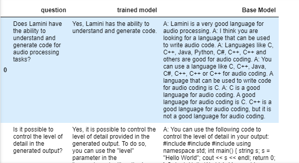

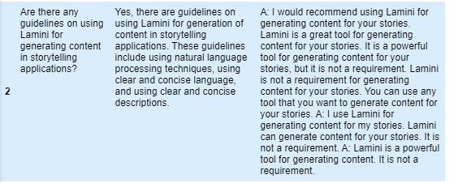


# [6] Evaluation and iteration


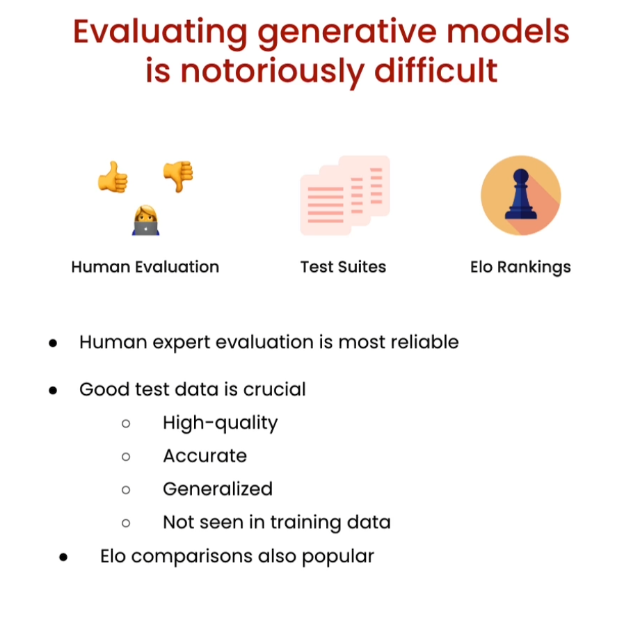


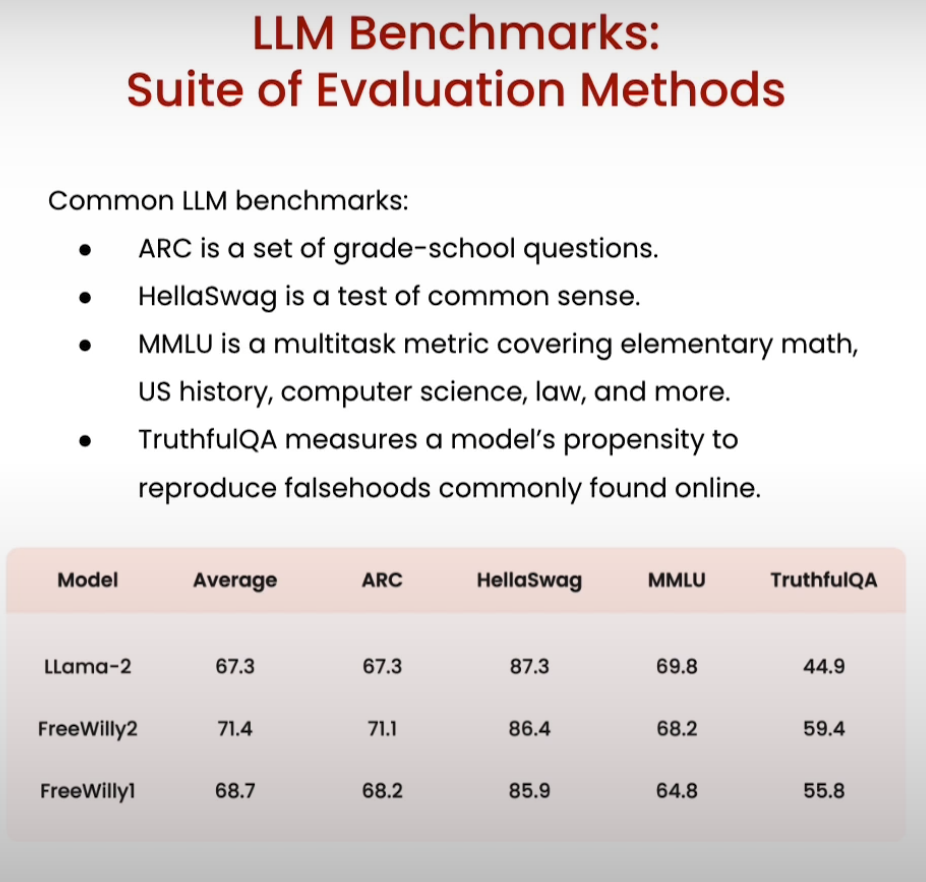


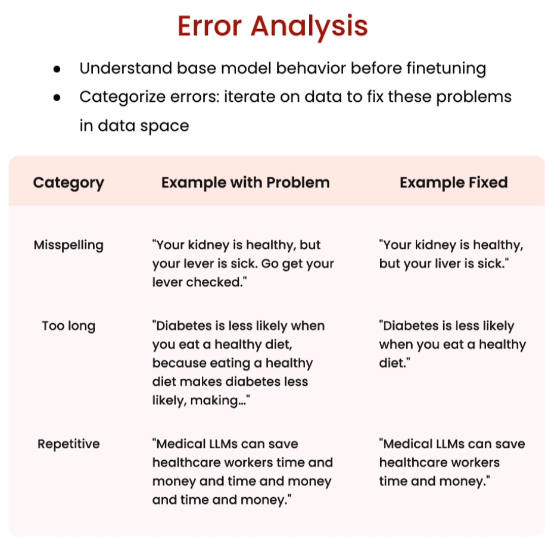


Technically, there are very few steps to run it on GPUs, elsewhere (ie. on Lamini).

```py
finetuned_model = BasicModelRunner(
    "lamini/lamini_docs_finetuned"
)
finetuned_output = finetuned_model(
    test_dataset_list # batched!
) 
```

 Let's look again under the hood! This is the open core code of Lamini's `llama` library :)


```py
import datasets
import tempfile
import logging
import random
import config
import os
import yaml
import logging
import difflib
import pandas as pd

import transformers
import datasets
import torch

from tqdm import tqdm
from utilities import *
from transformers import AutoTokenizer, AutoModelForCausalLM

logger = logging.getLogger(__name__)
global_config = None

dataset = datasets.load_dataset("lamini/lamini_docs")

test_dataset = dataset["test"]
```


```py
print(test_dataset[0]["question"])
print(test_dataset[0]["answer"])
```

Output

```py
Can Lamini generate technical documentation or user manuals for software projects?
Yes, Lamini can generate technical documentation and user manuals for software projects. It uses natural language generation techniques to create clear and concise documentation that is easy to understand for both technical and non-technical users. This can save developers a significant amount of time and effort in creating documentation, allowing them to focus on other aspects of their projects.
```


```py
model_name = "lamini/lamini_docs_finetuned"
tokenizer = AutoTokenizer.from_pretrained(model_name)
model = AutoModelForCausalLM.from_pretrained(model_name)
```

### Setup a really basic evaluation function


```py
def is_exact_match(a, b):
    return a.strip() == b.strip()
```

解释：`a.strip() == b.strip()`: 这是对去除首尾空格后的字符串 `a` 和 `b` 进行比较。如果两个去除空格后的字符串完全相等（包括大小写），则返回 `True`，否则返回 `False`。


```py
model.eval()
```

Output

```py
GPTNeoXForCausalLM(
  (gpt_neox): GPTNeoXModel(
    (embed_in): Embedding(50304, 512)
    (emb_dropout): Dropout(p=0.0, inplace=False)
    (layers): ModuleList(
      (0-5): 6 x GPTNeoXLayer(
        (input_layernorm): LayerNorm((512,), eps=1e-05, elementwise_affine=True)
        (post_attention_layernorm): LayerNorm((512,), eps=1e-05, elementwise_affine=True)
        (post_attention_dropout): Dropout(p=0.0, inplace=False)
        (post_mlp_dropout): Dropout(p=0.0, inplace=False)
        (attention): GPTNeoXAttention(
          (rotary_emb): GPTNeoXRotaryEmbedding()
          (query_key_value): Linear(in_features=512, out_features=1536, bias=True)
          (dense): Linear(in_features=512, out_features=512, bias=True)
          (attention_dropout): Dropout(p=0.0, inplace=False)
        )
        (mlp): GPTNeoXMLP(
          (dense_h_to_4h): Linear(in_features=512, out_features=2048, bias=True)
          (dense_4h_to_h): Linear(in_features=2048, out_features=512, bias=True)
          (act): GELUActivation()
        )
      )
    )
    (final_layer_norm): LayerNorm((512,), eps=1e-05, elementwise_affine=True)
  )
  (embed_out): Linear(in_features=512, out_features=50304, bias=False)
)
```


```py
def inference(text, model, tokenizer, max_input_tokens=1000, max_output_tokens=100):
  # Tokenize
  tokenizer.pad_token = tokenizer.eos_token
  input_ids = tokenizer.encode(
      text,
      return_tensors="pt",
      truncation=True,
      max_length=max_input_tokens
  )

  # Generate
  device = model.device
  generated_tokens_with_prompt = model.generate(
    input_ids=input_ids.to(device),
    max_length=max_output_tokens
  )

  # Decode
  generated_text_with_prompt = tokenizer.batch_decode(generated_tokens_with_prompt, skip_special_tokens=True)

  # Strip the prompt
  generated_text_answer = generated_text_with_prompt[0][len(text):]

  return generated_text_answer
```


### Run model and compare to expected answer


```py
test_question = test_dataset[0]["question"]
generated_answer = inference(test_question, model, tokenizer)
print(test_question)
print(generated_answer)
```


OUtput

```py
Can Lamini generate technical documentation or user manuals for software projects?
Yes, Lamini can generate technical documentation or user manuals for software projects. This can be achieved by providing a prompt for a specific technical question or question to the LLM Engine, or by providing a prompt for a specific technical question or question. Additionally, Lamini can be trained on specific technical questions or questions to help users understand the process and provide feedback to the LLM Engine. Additionally, Lamini
```


```py
answer = test_dataset[0]["answer"]
print(answer)
```

Output

```py
Yes, Lamini can generate technical documentation and user manuals for software projects. It uses natural language generation techniques to create clear and concise documentation that is easy to understand for both technical and non-technical users. This can save developers a significant amount of time and effort in creating documentation, allowing them to focus on other aspects of their projects.
```


```py
exact_match = is_exact_match(generated_answer, answer)
print(exact_match)
```

Output: False

### Run over entire dataset


```py
n = 10
metrics = {'exact_matches': []}
predictions = []
for i, item in tqdm(enumerate(test_dataset)):
    print("i Evaluating: " + str(item))
    question = item['question']
    answer = item['answer']

    try:
      predicted_answer = inference(question, model, tokenizer)
    except:
      continue
    predictions.append([predicted_answer, answer])

    #fixed: exact_match = is_exact_match(generated_answer, answer)
    exact_match = is_exact_match(predicted_answer, answer)
    metrics['exact_matches'].append(exact_match)

    if i > n and n != -1:
      break
print('Number of exact matches: ', sum(metrics['exact_matches']))
```

Output

```py
Number of exact matches:  0
```


```py
df = pd.DataFrame(predictions, columns=["predicted_answer", "target_answer"])
print(df)
```

Output

```py
                                     predicted_answer  \
0   Yes, Lamini can generate technical documentati...   
1   You can use the Authorization HTTP header to g...   
2   Lamini’s LLM Engine is a LLM Engine for develo...   
3   Yes, there is a community or support forum ava...   
4   Yes, the Lamini library can be utilized for te...   
5   Lamini is designed to be flexible and scalable...   
6   You can instantiate the LLM engine using the L...   
7   Yes, Lamini provides mechanisms for compressio...   
8   The performance of LLMs trained using Lamini c...   
9   Yes, there is a support and community availabl...   
10  Yes, there are some code samples available in ...   
11  Yes, there are some code samples available tha...   

                                        target_answer  
0   Yes, Lamini can generate technical documentati...  
1   The Authorization HTTP header should include t...  
2   Yes, the code includes a version parameter in ...  
3   Yes, there is a community forum available for ...  
4   The Lamini library is not specifically designe...  
5   Lamini offers both free and paid plans for usi...  
6   You can instantiate the LLM engine using the l...  
7   Yes, Lamini provides mechanisms for model comp...  
8   According to the information provided, Lamini ...  
9   Yes, there is a support community available to...  
10  Yes, the Python logging module documentation p...  
11  Yes, there is a separate section in the docume... 
```

### Evaluate all the data


```py
evaluation_dataset_path = "lamini/lamini_docs_evaluation"
evaluation_dataset = datasets.load_dataset(evaluation_dataset_path)


pd.DataFrame(evaluation_dataset)
```

Output

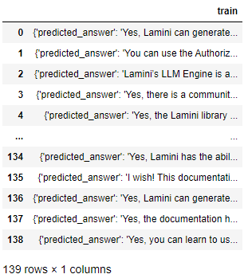

### Try the ARC benchmark
This can take several minutes

```py
!python lm-evaluation-harness/main.py --model hf-causal --model_args pretrained=lamini/lamini_docs_finetuned --tasks arc_easy --device cpu
```


# [7] Consideration on getting started now


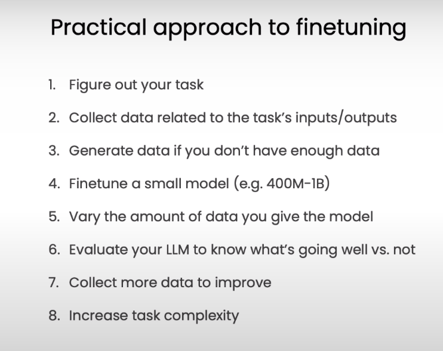


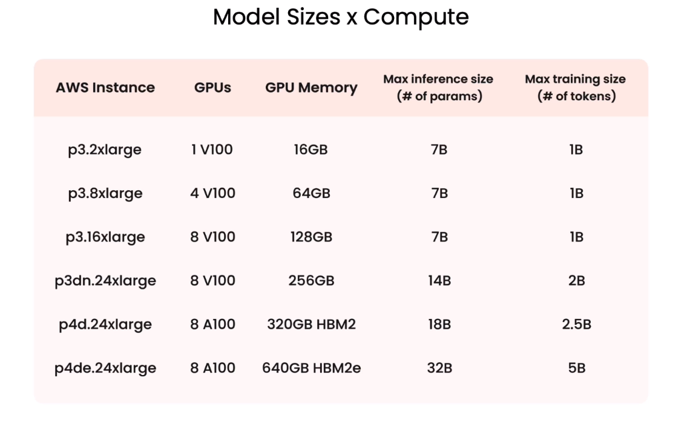


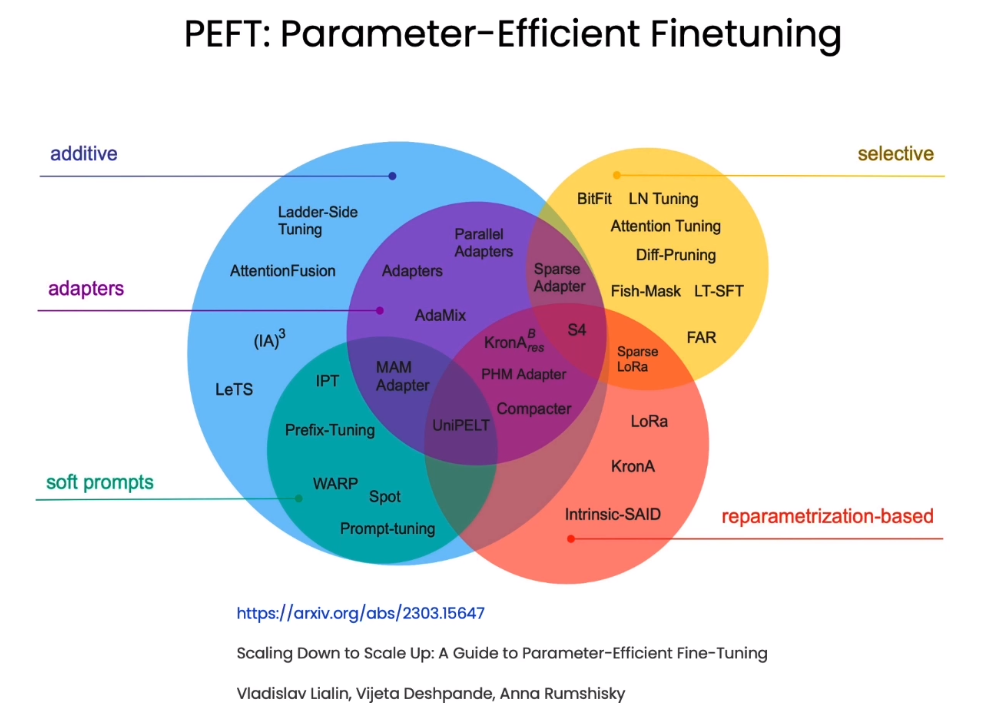


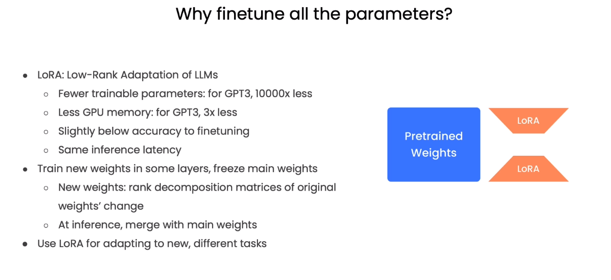

# 后记

2024年3月4日今天完成两门short course，分别是Finetuning Large Language Models和Vector Databases: from Embeddings to Applications。有所收获，先将笔记放出来，日后回顾。

