# Functions, Tools and Agents with LangChain

本文是学习 [https://www.deeplearning.ai/short-courses/functions-tools-agents-langchain/](https://www.deeplearning.ai/short-courses/functions-tools-agents-langchain/) 这门课的学习笔记，如有侵权，请联系删除。


@[toc]


## What you’ll learn in this course

The landscape of LLMs and the libraries that support them has evolved rapidly in recent months. This course is designed to keep you ahead of these changes. 

You’ll explore new advancements like ChatGPT’s function calling capability, and build a conversational agent using a new syntax called LangChain Expression Language (LCEL) for tasks like tagging, extraction, tool selection, and routing.

After taking this course, you’ll know how to: 

- Generate structured output, including function calls, using LLMs;
- Use LCEL, which simplifies the customization of chains and agents, to build applications;
- Apply function calling to tasks like tagging and data extraction;
- Understand tool selection and routing using LangChain tools and LLM function calling – and much more.

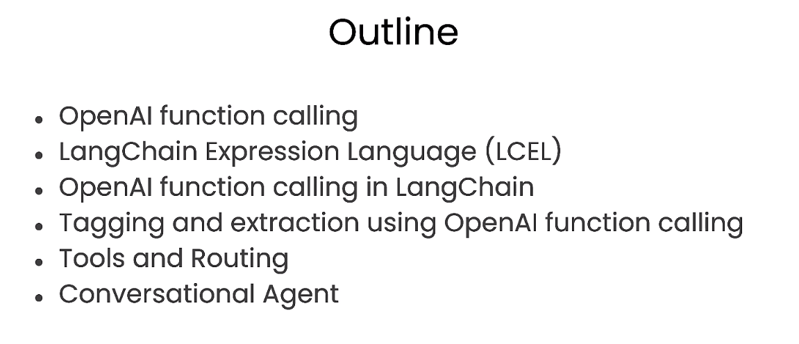

# OpenAI Function Calling


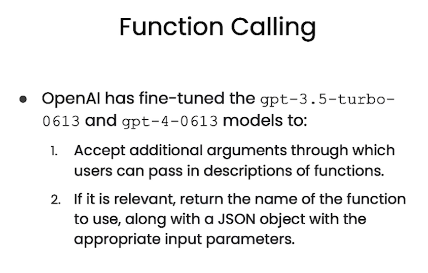


```py
import os
import openai

from dotenv import load_dotenv, find_dotenv
_ = load_dotenv(find_dotenv()) # read local .env file
openai.api_key = os.environ['OPENAI_API_KEY']


import json

# Example dummy function hard coded to return the same weather
# In production, this could be your backend API or an external API
def get_current_weather(location, unit="fahrenheit"):
    """Get the current weather in a given location"""
    weather_info = {
        "location": location,
        "temperature": "72",
        "unit": unit,
        "forecast": ["sunny", "windy"],
    }
    return json.dumps(weather_info)
```


```json
# define a function
functions = [
    {
        "name": "get_current_weather",
        "description": "Get the current weather in a given location",
        "parameters": {
            "type": "object",
            "properties": {
                "location": {
                    "type": "string",
                    "description": "The city and state, e.g. San Francisco, CA",
                },
                "unit": {"type": "string", "enum": ["celsius", "fahrenheit"]},
            },
            "required": ["location"],
        },
    }
]

messages = [
    {
        "role": "user",
        "content": "What's the weather like in Boston?"
    }
]
```


```py
import openai


response = openai.ChatCompletion.create(
    model="gpt-3.5-turbo-0613",
    messages=messages,
    functions=functions
)


print(response)
```

Output

```json
{
  "id": "chatcmpl-941CzbAUJlGVZnWeIqjI9xWCuqD89",
  "object": "chat.completion",
  "created": 1710744985,
  "model": "gpt-3.5-turbo-0613",
  "choices": [
    {
      "index": 0,
      "message": {
        "role": "assistant",
        "content": null,
        "function_call": {
          "name": "get_current_weather",
          "arguments": "{\n  \"location\": \"Boston, MA\"\n}"
        }
      },
      "logprobs": null,
      "finish_reason": "function_call"
    }
  ],
  "usage": {
    "prompt_tokens": 82,
    "completion_tokens": 18,
    "total_tokens": 100
  },
  "system_fingerprint": null
}
```


```py
response_message = response["choices"][0]["message"]
response_message
```

Output

```json
<OpenAIObject at 0x7f44f8560bd0> JSON: {
  "role": "assistant",
  "content": null,
  "function_call": {
    "name": "get_current_weather",
    "arguments": "{\n  \"location\": \"Boston, MA\"\n}"
  }
}
```


```py
response_message["content"]
response_message["function_call"]
```

Output


```json
<OpenAIObject at 0x7f44f8568ae0> JSON: {
  "name": "get_current_weather",
  "arguments": "{\n  \"location\": \"Boston, MA\"\n}"
}
```


```py
json.loads(response_message["function_call"]["arguments"])
```


Output

```json
{'location': 'Boston, MA'}
```


```py
args = json.loads(response_message["function_call"]["arguments"])
get_current_weather(args)
```

Output

```json
'{"location": {"location": "Boston, MA"}, "temperature": "72", "unit": "fahrenheit", "forecast": ["sunny", "windy"]}'
```


```py
messages = [
    {
        "role": "user",
        "content": "hi!",
    }
]


response = openai.ChatCompletion.create(
    model="gpt-3.5-turbo-0613",
    messages=messages,
    functions=functions,
)

print(response)
```

Output

```json
{
  "id": "chatcmpl-941D09B8gI2BboKrZ0avWY33d6QxC",
  "object": "chat.completion",
  "created": 1710744986,
  "model": "gpt-3.5-turbo-0613",
  "choices": [
    {
      "index": 0,
      "message": {
        "role": "assistant",
        "content": "Hello! How can I assist you today?"
      },
      "logprobs": null,
      "finish_reason": "stop"
    }
  ],
  "usage": {
    "prompt_tokens": 76,
    "completion_tokens": 10,
    "total_tokens": 86
  },
  "system_fingerprint": null
}
```


```py
messages = [
    {
        "role": "user",
        "content": "hi!",
    }
]
response = openai.ChatCompletion.create(
    model="gpt-3.5-turbo-0613",
    messages=messages,
    functions=functions,
    function_call="auto",
)
print(response)
```


Output

```json
{
  "id": "chatcmpl-941D1rgtwxs2FMPrGA3nH6RYCfug9",
  "object": "chat.completion",
  "created": 1710744987,
  "model": "gpt-3.5-turbo-0613",
  "choices": [
    {
      "index": 0,
      "message": {
        "role": "assistant",
        "content": "Hello! How can I assist you today?"
      },
      "logprobs": null,
      "finish_reason": "stop"
    }
  ],
  "usage": {
    "prompt_tokens": 76,
    "completion_tokens": 10,
    "total_tokens": 86
  },
  "system_fingerprint": null
}
```


```py
messages = [
    {
        "role": "user",
        "content": "hi!",
    }
]
response = openai.ChatCompletion.create(
    model="gpt-3.5-turbo-0613",
    messages=messages,
    functions=functions,
    function_call="none",
)
print(response)
```


Output

```json
{
  "id": "chatcmpl-941D1Yur1YHlCFUZ0eJZCAK5RHfgV",
  "object": "chat.completion",
  "created": 1710744987,
  "model": "gpt-3.5-turbo-0613",
  "choices": [
    {
      "index": 0,
      "message": {
        "role": "assistant",
        "content": "Hello! How can I assist you today?"
      },
      "logprobs": null,
      "finish_reason": "stop"
    }
  ],
  "usage": {
    "prompt_tokens": 77,
    "completion_tokens": 9,
    "total_tokens": 86
  },
  "system_fingerprint": null
}
```


```py
messages = [
    {
        "role": "user",
        "content": "What's the weather in Boston?",
    }
]
response = openai.ChatCompletion.create(
    model="gpt-3.5-turbo-0613",
    messages=messages,
    functions=functions,
    function_call="none",
)
print(response)
```

Output

```json
{
  "id": "chatcmpl-941D2QiHtcriKU912DPRZCR8qU8Uo",
  "object": "chat.completion",
  "created": 1710744988,
  "model": "gpt-3.5-turbo-0613",
  "choices": [
    {
      "index": 0,
      "message": {
        "role": "assistant",
        "content": "Let me check the current weather in Boston for you."
      },
      "logprobs": null,
      "finish_reason": "stop"
    }
  ],
  "usage": {
    "prompt_tokens": 82,
    "completion_tokens": 11,
    "total_tokens": 93
  },
  "system_fingerprint": null
}
```


```py
messages = [
    {
        "role": "user",
        "content": "hi!",
    }
]
response = openai.ChatCompletion.create(
    model="gpt-3.5-turbo-0613",
    messages=messages,
    functions=functions,
    function_call={"name": "get_current_weather"},
)
print(response)
```

Output

```json
{
  "id": "chatcmpl-941D3ePMR2BsnCcCEfWTmc9boYAuV",
  "object": "chat.completion",
  "created": 1710744989,
  "model": "gpt-3.5-turbo-0613",
  "choices": [
    {
      "index": 0,
      "message": {
        "role": "assistant",
        "content": null,
        "function_call": {
          "name": "get_current_weather",
          "arguments": "{\n  \"location\": \"San Francisco, CA\"\n}"
        }
      },
      "logprobs": null,
      "finish_reason": "stop"
    }
  ],
  "usage": {
    "prompt_tokens": 83,
    "completion_tokens": 12,
    "total_tokens": 95
  },
  "system_fingerprint": null
}
```


```py
messages = [
    {
        "role": "user",
        "content": "What's the weather like in Boston!",
    }
]
response = openai.ChatCompletion.create(
    model="gpt-3.5-turbo-0613",
    messages=messages,
    functions=functions,
    function_call={"name": "get_current_weather"},
)
print(response)
```

Output

```json
{
  "id": "chatcmpl-941D4rgqXPIadbgOTTa5WTJP1L2Re",
  "object": "chat.completion",
  "created": 1710744990,
  "model": "gpt-3.5-turbo-0613",
  "choices": [
    {
      "index": 0,
      "message": {
        "role": "assistant",
        "content": null,
        "function_call": {
          "name": "get_current_weather",
          "arguments": "{\n\"location\": \"Boston, MA\"\n}"
        }
      },
      "logprobs": null,
      "finish_reason": "stop"
    }
  ],
  "usage": {
    "prompt_tokens": 89,
    "completion_tokens": 10,
    "total_tokens": 99
  },
  "system_fingerprint": null
}
```


```py
messages.append(response["choices"][0]["message"])

args = json.loads(response["choices"][0]["message"]['function_call']['arguments'])
observation = get_current_weather(args)

messages.append(
        {
            "role": "function",
            "name": "get_current_weather",
            "content": observation,
        }
)

response = openai.ChatCompletion.create(
    model="gpt-3.5-turbo-0613",
    messages=messages,
)
print(response)
```


Output

```json
{
  "id": "chatcmpl-941D5uCh4qg9mJ017AbXYzkbbQ6Q2",
  "object": "chat.completion",
  "created": 1710744991,
  "model": "gpt-3.5-turbo-0613",
  "choices": [
    {
      "index": 0,
      "message": {
        "role": "assistant",
        "content": "The weather in Boston is currently sunny and windy with a temperature of 72\u00b0F."
      },
      "logprobs": null,
      "finish_reason": "stop"
    }
  ],
  "usage": {
    "prompt_tokens": 76,
    "completion_tokens": 17,
    "total_tokens": 93
  },
  "system_fingerprint": null
}
```


# LangChain Expression Language (LCEL)


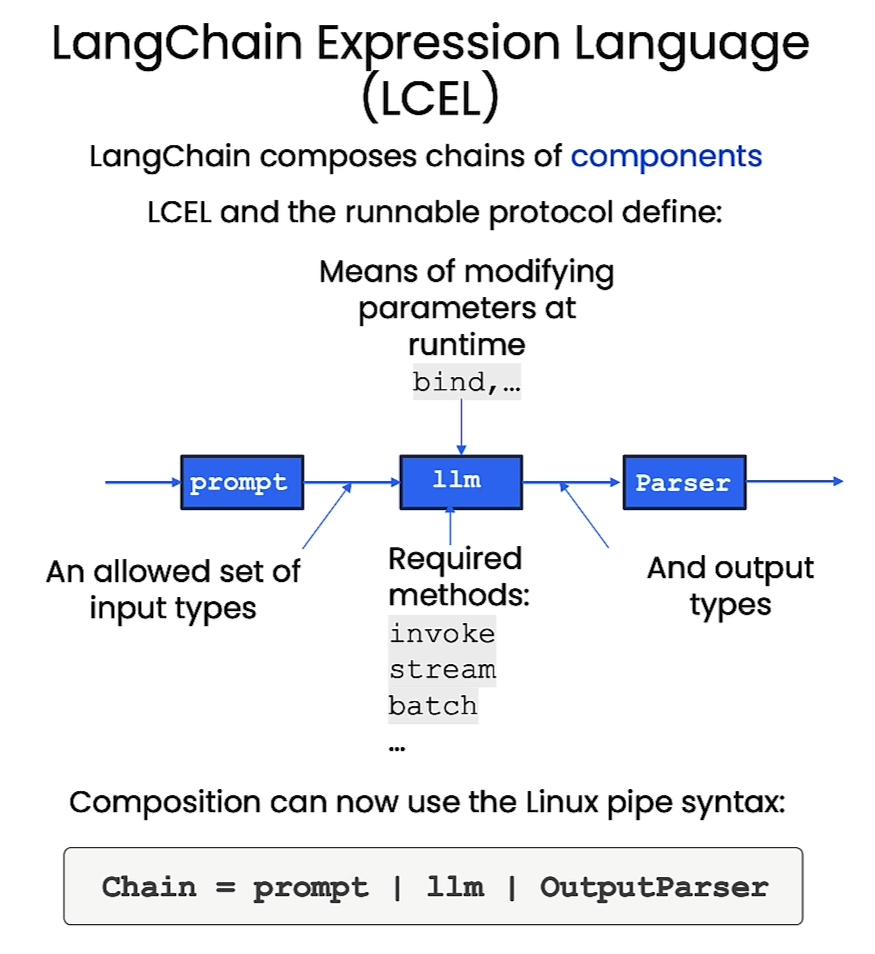


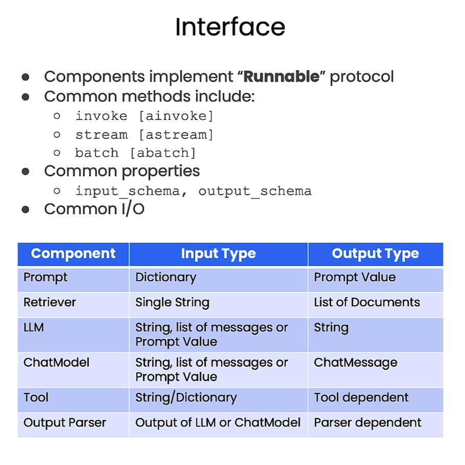

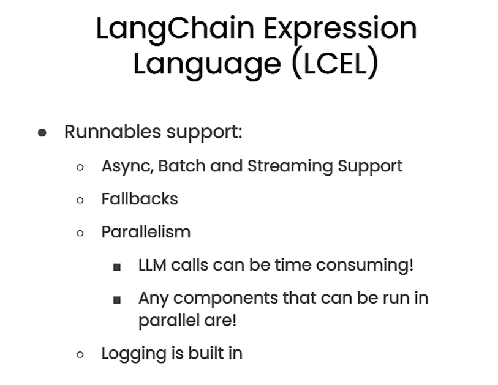


```py
import os
import openai

from dotenv import load_dotenv, find_dotenv
_ = load_dotenv(find_dotenv()) # read local .env file
openai.api_key = os.environ['OPENAI_API_KEY']

#!pip install pydantic==1.10.8


from langchain.prompts import ChatPromptTemplate
from langchain.chat_models import ChatOpenAI
from langchain.schema.output_parser import StrOutputParser
```


## Simple Chain


```py
prompt = ChatPromptTemplate.from_template(
    "tell me a short joke about {topic}"
)
model = ChatOpenAI()
output_parser = StrOutputParser()

chain = prompt | model | output_parser

chain.invoke({"topic": "bears"})
```

Output

```py
'Why did the bear break up with his girlfriend? She was too grizzly for him!'
```

## More complex chain

And Runnable Map to supply user-provided inputs to the prompt.


```py
from langchain.embeddings import OpenAIEmbeddings
from langchain.vectorstores import DocArrayInMemorySearch

vectorstore = DocArrayInMemorySearch.from_texts(
    ["harrison worked at kensho", "bears like to eat honey"],
    embedding=OpenAIEmbeddings()
)
retriever = vectorstore.as_retriever()

retriever.get_relevant_documents("where did harrison work?")
```

Output

```py
[Document(page_content='harrison worked at kensho'),
 Document(page_content='bears like to eat honey')]
```


```py
retriever.get_relevant_documents("what do bears like to eat")
```

Output

```py
[Document(page_content='bears like to eat honey'),
 Document(page_content='harrison worked at kensho')]
```


```py
template = """Answer the question based only on the following context:
{context}

Question: {question}
"""
prompt = ChatPromptTemplate.from_template(template)
```


```py
from langchain.schema.runnable import RunnableMap

chain = RunnableMap({
    "context": lambda x: retriever.get_relevant_documents(x["question"]),
    "question": lambda x: x["question"]
}) | prompt | model | output_parser

chain.invoke({"question": "where did harrison work?"})
```

Output

```py
'Harrison worked at Kensho.'
```


```py
inputs = RunnableMap({
    "context": lambda x: retriever.get_relevant_documents(x["question"]),
    "question": lambda x: x["question"]
})

inputs.invoke({"question": "where did harrison work?"})
```

Output

```json
{'context': [Document(page_content='harrison worked at kensho'),
  Document(page_content='bears like to eat honey')],
 'question': 'where did harrison work?'}
```


## Bind

and OpenAI Functions


```py
functions = [
    {
      "name": "weather_search",
      "description": "Search for weather given an airport code",
      "parameters": {
        "type": "object",
        "properties": {
          "airport_code": {
            "type": "string",
            "description": "The airport code to get the weather for"
          },
        },
        "required": ["airport_code"]
      }
    }
  ]
  
  
prompt = ChatPromptTemplate.from_messages(
    [
        ("human", "{input}")
    ]
)
model = ChatOpenAI(temperature=0).bind(functions=functions)


runnable = prompt | model


runnable.invoke({"input": "what is the weather in sf"})
```

Output

```json
AIMessage(content='', additional_kwargs={'function_call': {'name': 'weather_search', 'arguments': '{"airport_code":"SFO"}'}})
```


```py
functions = [
    {
      "name": "weather_search",
      "description": "Search for weather given an airport code",
      "parameters": {
        "type": "object",
        "properties": {
          "airport_code": {
            "type": "string",
            "description": "The airport code to get the weather for"
          },
        },
        "required": ["airport_code"]
      }
    },
        {
      "name": "sports_search",
      "description": "Search for news of recent sport events",
      "parameters": {
        "type": "object",
        "properties": {
          "team_name": {
            "type": "string",
            "description": "The sports team to search for"
          },
        },
        "required": ["team_name"]
      }
    }
  ]
  
  
model = model.bind(functions=functions)


runnable = prompt | model

runnable.invoke({"input": "how did the patriots do yesterday?"})
```

Output

```json
AIMessage(content='', additional_kwargs={'function_call': {'name': 'sports_search', 'arguments': '{"team_name":"New England Patriots"}'}})
```


## Fallbacks


```py
from langchain.llms import OpenAI
import json
```


**Note**: Due to the deprecation of OpenAI's model `text-davinci-001` on 4 January 2024, you'll be using OpenAI's recommended replacement model `gpt-3.5-turbo-instruct` instead.


```py
simple_model = OpenAI(
    temperature=0, 
    max_tokens=1000, 
    model="gpt-3.5-turbo-instruct"
)
simple_chain = simple_model | json.loads
```


```py
challenge = "write three poems in a json blob, where each poem is a json blob of a title, author, and first line"
simple_model.invoke(challenge)
```


Output

```py
'\n\n{\n    "title": "Autumn Leaves",\n    "author": "Emily Dickinson",\n    "first_line": "The leaves are falling, one by one"\n}\n\n{\n    "title": "The Ocean\'s Song",\n    "author": "Pablo Neruda",\n    "first_line": "I hear the ocean\'s song, a symphony of waves"\n}\n\n{\n    "title": "A Winter\'s Night",\n    "author": "Robert Frost",\n    "first_line": "The snow falls softly, covering the ground"\n}'
```


```py
model = ChatOpenAI(temperature=0)
chain = model | StrOutputParser() | json.loads

chain.invoke(challenge)
```

Output

```json
{'poem1': {'title': 'The Rose',
  'author': 'Emily Dickinson',
  'firstLine': 'A rose by any other name would smell as sweet'},
 'poem2': {'title': 'The Road Not Taken',
  'author': 'Robert Frost',
  'firstLine': 'Two roads diverged in a yellow wood'},
 'poem3': {'title': 'Hope is the Thing with Feathers',
  'author': 'Emily Dickinson',
  'firstLine': 'Hope is the thing with feathers that perches in the soul'}}
```


```py
final_chain = simple_chain.with_fallbacks([chain])
final_chain.invoke(challenge)
```

Output

```json
{'poem1': {'title': 'The Rose',
  'author': 'Emily Dickinson',
  'firstLine': 'A rose is a rose is a rose'},
 'poem2': {'title': 'The Road Not Taken',
  'author': 'Robert Frost',
  'firstLine': 'Two roads diverged in a yellow wood'},
 'poem3': {'title': 'Hope is the Thing with Feathers',
  'author': 'Emily Dickinson',
  'firstLine': 'Hope is the thing with feathers'}}
```


## Interface

```py
prompt = ChatPromptTemplate.from_template(
    "Tell me a short joke about {topic}"
)
model = ChatOpenAI()
output_parser = StrOutputParser()

chain = prompt | model | output_parser

chain.invoke({"topic": "bears"})
```


Output

```py
'Why did the bear break up with his girlfriend? Because she was too unbearable!'
```


```py
chain.batch([{"topic": "bears"}, {"topic": "frogs"}])
```

Output

```json
["Why don't bears like fast food? Because they can't catch it!",
 'Why did the frog take the bus to work? Because his car got toad away!']
```


# OpenAI Function Calling In LangChain


```py
import os
import openai

from dotenv import load_dotenv, find_dotenv
_ = load_dotenv(find_dotenv()) # read local .env file
openai.api_key = os.environ['OPENAI_API_KEY']

from typing import List
from pydantic import BaseModel, Field
```


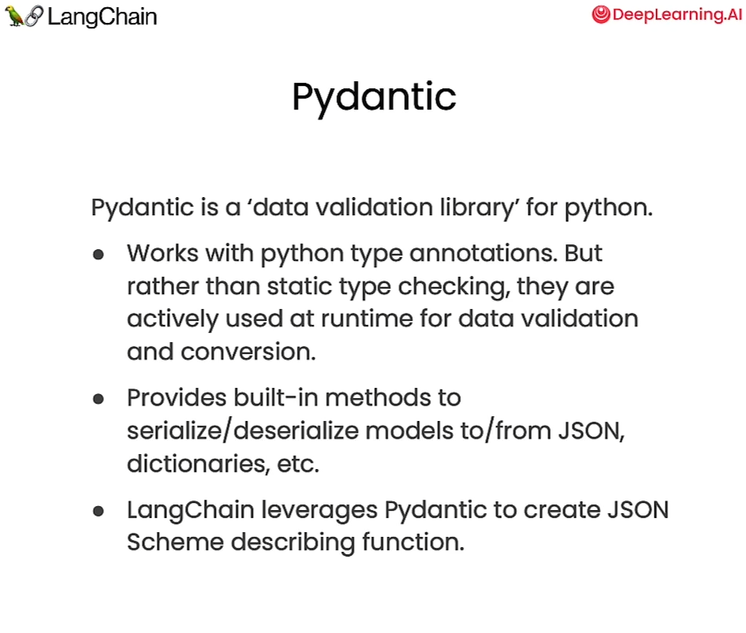

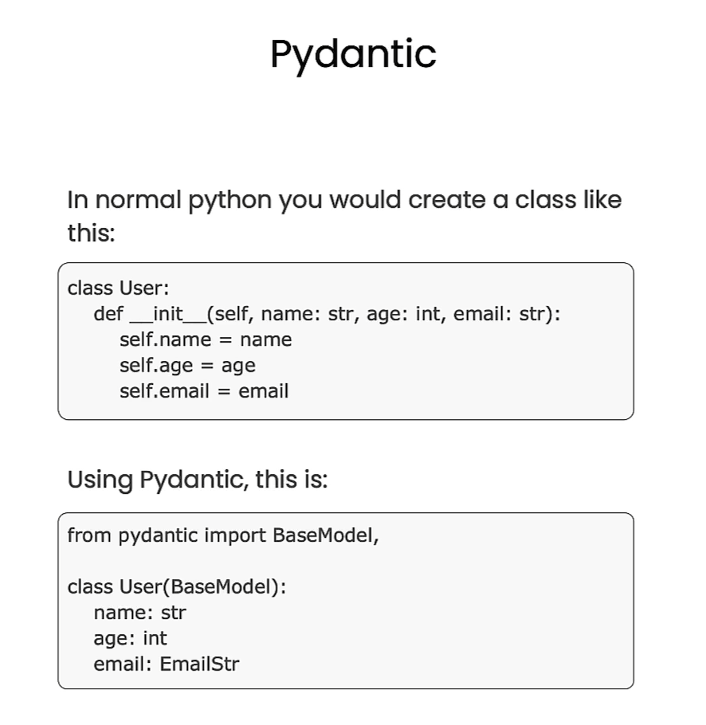

## Pydantic Syntax

Pydantic data classes are a blend of Python's data classes with the validation power of Pydantic. 

They offer a concise way to define data structures while ensuring that the data adheres to specified types and constraints.

In standard python you would create a class like this:


```py
class User:
    def __init__(self, name: str, age: int, email: str):
        self.name = name
        self.age = age
        self.email = email
foo = User(name="Joe",age=32, email="joe@gmail.com")

foo.name

foo = User(name="Joe",age="bar", email="joe@gmail.com")

foo.age


class pUser(BaseModel):
    name: str
    age: int
    email: str
    
foo_p = pUser(name="Jane", age=32, email="jane@gmail.com")

foo_p.name
```


```py
class Class(BaseModel):
    students: List[pUser]
    
obj = Class(
    students=[pUser(name="Jane", age=32, email="jane@gmail.com")]
)

obj
```

Output

```json
Class(students=[pUser(name='Jane', age=32, email='jane@gmail.com')])
```


## Pydantic to OpenAI function definition


```py
class WeatherSearch(BaseModel):
    """Call this with an airport code to get the weather at that airport"""
    airport_code: str = Field(description="airport code to get weather for")
    
from langchain.utils.openai_functions import convert_pydantic_to_openai_function

weather_function = convert_pydantic_to_openai_function(WeatherSearch)

weather_function
```

Output

```json
{'name': 'WeatherSearch',
 'description': 'Call this with an airport code to get the weather at that airport',
 'parameters': {'title': 'WeatherSearch',
  'description': 'Call this with an airport code to get the weather at that airport',
  'type': 'object',
  'properties': {'airport_code': {'title': 'Airport Code',
    'description': 'airport code to get weather for',
    'type': 'string'}},
  'required': ['airport_code']}}
```


```py
class WeatherSearch1(BaseModel):
    airport_code: str = Field(description="airport code to get weather for")
    
class WeatherSearch2(BaseModel):
    """Call this with an airport code to get the weather at that airport"""
    airport_code: str
    
convert_pydantic_to_openai_function(WeatherSearch2)
```


Output

```json
{'name': 'WeatherSearch2',
 'description': 'Call this with an airport code to get the weather at that airport',
 'parameters': {'title': 'WeatherSearch2',
  'description': 'Call this with an airport code to get the weather at that airport',
  'type': 'object',
  'properties': {'airport_code': {'title': 'Airport Code', 'type': 'string'}},
  'required': ['airport_code']}}
```


```py
from langchain.chat_models import ChatOpenAI
model = ChatOpenAI()

model.invoke("what is the weather in SF today?", functions=[weather_function])


```

Output

```json
AIMessage(content='', additional_kwargs={'function_call': {'name': 'WeatherSearch', 'arguments': '{"airport_code":"SFO"}'}})
```


```py
model_with_function = model.bind(functions=[weather_function])

model_with_function.invoke("what is the weather in sf?")
```

Output

```json
AIMessage(content='', additional_kwargs={'function_call': {'name': 'WeatherSearch', 'arguments': '{"airport_code":"SFO"}'}})
```

## Forcing it to use a function

We can force the model to use a function


```py
model_with_forced_function = model.bind(functions=[weather_function], function_call={"name":"WeatherSearch"})
model_with_forced_function.invoke("what is the weather in sf?")
```

Output

```json
model_with_forced_function.invoke("what is the weather in sf?")
AIMessage(content='', additional_kwargs={'function_call': {'name': 'WeatherSearch', 'arguments': '{"airport_code":"SFO"}'}})
```


```py
model_with_forced_function.invoke("hi!")
```

Output

```json
AIMessage(content='', additional_kwargs={'function_call': {'name': 'WeatherSearch', 'arguments': '{"airport_code":"JFK"}'}})
```


## Using in a chain

We can use this model bound to function in a chain as we normally would


```py
from langchain.prompts import ChatPromptTemplate

prompt = ChatPromptTemplate.from_messages([
    ("system", "You are a helpful assistant"),
    ("user", "{input}")
])


chain = prompt | model_with_function

chain.invoke({"input": "what is the weather in sf?"})
```

Output

```json
chain.invoke({"input": "what is the weather in sf?"})
AIMessage(content='', additional_kwargs={'function_call': {'name': 'WeatherSearch', 'arguments': '{"airport_code":"SFO"}'}})
```


## Using multiple functions

Even better, we can pass a set of function and let the LLM decide which to use based on the question context.


```py
class ArtistSearch(BaseModel):
    """Call this to get the names of songs by a particular artist"""
    artist_name: str = Field(description="name of artist to look up")
    n: int = Field(description="number of results")
    
functions = [
    convert_pydantic_to_openai_function(WeatherSearch),
    convert_pydantic_to_openai_function(ArtistSearch),
]

model_with_functions = model.bind(functions=functions)


model_with_functions.invoke("what is the weather in sf?")
```

Output

```json
AIMessage(content='', additional_kwargs={'function_call': {'name': 'WeatherSearch', 'arguments': '{"airport_code":"SFO"}'}})
```


```py
model_with_functions.invoke("what are three songs by taylor swift?")
```

Output

```json
AIMessage(content='', additional_kwargs={'function_call': {'name': 'ArtistSearch', 'arguments': '{"artist_name":"Taylor Swift","n":3}'}})
```


```py
model_with_functions.invoke("hi!")
```

Output

```json
AIMessage(content='Hello! How can I assist you today?')
```


# Tagging and Extraction Using OpenAI functions

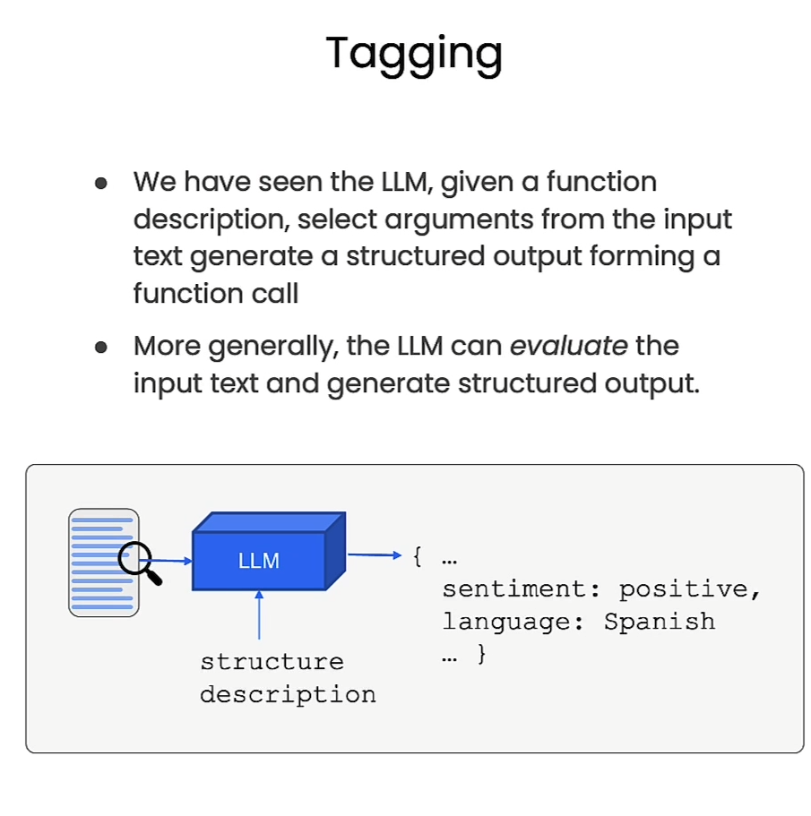


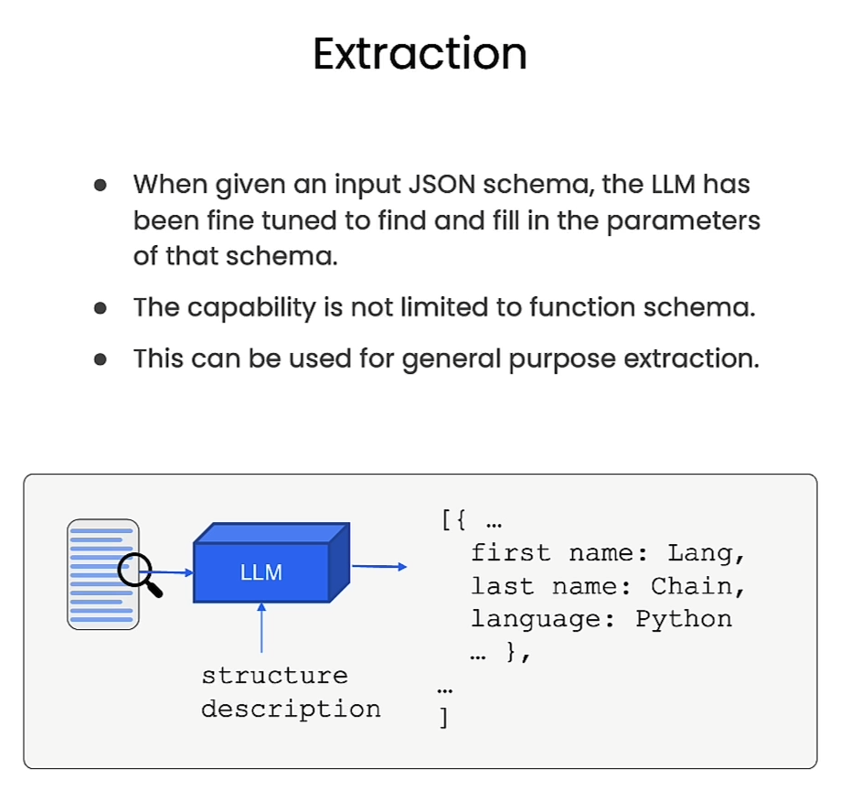


```py
import os
import openai

from dotenv import load_dotenv, find_dotenv
_ = load_dotenv(find_dotenv()) # read local .env file
openai.api_key = os.environ['OPENAI_API_KEY']

from typing import List
from pydantic import BaseModel, Field
from langchain.utils.openai_functions import convert_pydantic_to_openai_function

```


```py
class Tagging(BaseModel):
    """Tag the piece of text with particular info."""
    sentiment: str = Field(description="sentiment of text, should be `pos`, `neg`, or `neutral`")
    language: str = Field(description="language of text (should be ISO 639-1 code)")
    
convert_pydantic_to_openai_function(Tagging)
```

Output

```json
{'name': 'Tagging',
 'description': 'Tag the piece of text with particular info.',
 'parameters': {'title': 'Tagging',
  'description': 'Tag the piece of text with particular info.',
  'type': 'object',
  'properties': {'sentiment': {'title': 'Sentiment',
    'description': 'sentiment of text, should be `pos`, `neg`, or `neutral`',
    'type': 'string'},
   'language': {'title': 'Language',
    'description': 'language of text (should be ISO 639-1 code)',
    'type': 'string'}},
  'required': ['sentiment', 'language']}}
```


```py
from langchain.prompts import ChatPromptTemplate
from langchain.chat_models import ChatOpenAI

model = ChatOpenAI(temperature=0)

tagging_functions = [convert_pydantic_to_openai_function(Tagging)]

prompt = ChatPromptTemplate.from_messages([
    ("system", "Think carefully, and then tag the text as instructed"),
    ("user", "{input}")
])

model_with_functions = model.bind(
    functions=tagging_functions,
    function_call={"name": "Tagging"}
)

tagging_chain = prompt | model_with_functions

```


```python
tagging_chain.invoke({"input": "I love langchain"})
```

Output

```json
AIMessage(content='', additional_kwargs={'function_call': {'name': 'Tagging', 'arguments': '{"sentiment":"pos","language":"en"}'}})
```


```py
tagging_chain.invoke({"input": "non mi piace questo cibo"})
```

Output

```json
AIMessage(content='', additional_kwargs={'function_call': {'name': 'Tagging', 'arguments': '{"sentiment":"neg","language":"it"}'}})
```


```py
from langchain.output_parsers.openai_functions import JsonOutputFunctionsParser
tagging_chain = prompt | model_with_functions | JsonOutputFunctionsParser()

tagging_chain.invoke({"input": "non mi piace questo cibo"})
```

Output

```py
{'sentiment': 'neg', 'language': 'it'}
```


## Extraction

Extraction is similar to tagging, but used for extracting multiple pieces of information.


```py
from typing import Optional
class Person(BaseModel):
    """Information about a person."""
    name: str = Field(description="person's name")
    age: Optional[int] = Field(description="person's age")
    
class Information(BaseModel):
    """Information to extract."""
    people: List[Person] = Field(description="List of info about people")
    
convert_pydantic_to_openai_function(Information)
```

Output

```json
{'name': 'Information',
 'description': 'Information to extract.',
 'parameters': {'title': 'Information',
  'description': 'Information to extract.',
  'type': 'object',
  'properties': {'people': {'title': 'People',
    'description': 'List of info about people',
    'type': 'array',
    'items': {'title': 'Person',
     'description': 'Information about a person.',
     'type': 'object',
     'properties': {'name': {'title': 'Name',
       'description': "person's name",
       'type': 'string'},
      'age': {'title': 'Age',
       'description': "person's age",
       'type': 'integer'}},
     'required': ['name']}}},
  'required': ['people']}}
```


```py
extraction_functions = [convert_pydantic_to_openai_function(Information)]
extraction_model = model.bind(functions=extraction_functions, function_call={"name": "Information"})

extraction_model.invoke("Joe is 30, his mom is Martha")
```

Output

```json
AIMessage(content='', additional_kwargs={'function_call': {'name': 'Information', 'arguments': '{"people":[{"name":"Joe","age":30},{"name":"Martha"}]}'}})
```


```py
prompt = ChatPromptTemplate.from_messages([
    ("system", "Extract the relevant information, if not explicitly provided do not guess. Extract partial info"),
    ("human", "{input}")
])

extraction_chain = prompt | extraction_model

extraction_chain.invoke({"input": "Joe is 30, his mom is Martha"})
```

Output

```json
AIMessage(content='', additional_kwargs={'function_call': {'name': 'Information', 'arguments': '{"people":[{"name":"Joe","age":30},{"name":"Martha"}]}'}})
```


```py
extraction_chain = prompt | extraction_model | JsonOutputFunctionsParser()

extraction_chain.invoke({"input": "Joe is 30, his mom is Martha"})
```

Output

```json
{'people': [{'name': 'Joe', 'age': 30}, {'name': 'Martha'}]}
```


```py
from langchain.output_parsers.openai_functions import JsonKeyOutputFunctionsParser

extraction_chain = prompt | extraction_model | JsonKeyOutputFunctionsParser(key_name="people")

extraction_chain.invoke({"input": "Joe is 30, his mom is Martha"})
```

Output

```json
[{'name': 'Joe', 'age': 30}, {'name': 'Martha'}]
```

## Doing it for real

We can apply tagging to a larger body of text.

For example, let's load this blog post and extract tag information from a sub-set of the text.


```py
from langchain.document_loaders import WebBaseLoader
loader = WebBaseLoader("https://lilianweng.github.io/posts/2023-06-23-agent/")
documents = loader.load()

doc = documents[0]
page_content = doc.page_content[:10000]


print(page_content[:1000])
```


```py
class Overview(BaseModel):
    """Overview of a section of text."""
    summary: str = Field(description="Provide a concise summary of the content.")
    language: str = Field(description="Provide the language that the content is written in.")
    keywords: str = Field(description="Provide keywords related to the content.")
    
overview_tagging_function = [
    convert_pydantic_to_openai_function(Overview)
]
tagging_model = model.bind(
    functions=overview_tagging_function,
    function_call={"name":"Overview"}
)
tagging_chain = prompt | tagging_model | JsonOutputFunctionsParser()


tagging_chain.invoke({"input": page_content})
```


Output

```json
{'summary': 'The article discusses building autonomous agents powered by LLM (large language model) as the core controller. It covers components like planning, memory, and tool use, along with challenges and references to related studies.',
 'language': 'English',
 'keywords': 'LLM, autonomous agents, planning, memory, tool use, challenges, references'}
```


```py
class Paper(BaseModel):
    """Information about papers mentioned."""
    title: str
    author: Optional[str]


class Info(BaseModel):
    """Information to extract"""
    papers: List[Paper]
    
paper_extraction_function = [
    convert_pydantic_to_openai_function(Info)
]
extraction_model = model.bind(
    functions=paper_extraction_function, 
    function_call={"name":"Info"}
)
extraction_chain = prompt | extraction_model | JsonKeyOutputFunctionsParser(key_name="papers")

extraction_chain.invoke({"input": page_content})
```

Output

```json
[{'title': 'LLM Powered Autonomous Agents', 'author': 'Lilian Weng'}]
```


```py
template = """A article will be passed to you. Extract from it all papers that are mentioned by this article. 

Do not extract the name of the article itself. If no papers are mentioned that's fine - you don't need to extract any! Just return an empty list.

Do not make up or guess ANY extra information. Only extract what exactly is in the text."""

prompt = ChatPromptTemplate.from_messages([
    ("system", template),
    ("human", "{input}")
])

extraction_chain = prompt | extraction_model | JsonKeyOutputFunctionsParser(key_name="papers")

extraction_chain.invoke({"input": page_content})
```


Output

```json
[{'title': 'Chain of thought (CoT; Wei et al. 2022)'},
 {'title': 'Tree of Thoughts (Yao et al. 2023)'},
 {'title': 'LLM+P (Liu et al. 2023)'},
 {'title': 'ReAct (Yao et al. 2023)'},
 {'title': 'Reflexion (Shinn & Labash 2023)'},
 {'title': 'Chain of Hindsight (CoH; Liu et al. 2023)'},
 {'title': 'Algorithm Distillation (AD; Laskin et al. 2023)'}]
```


```py
extraction_chain.invoke({"input": "hi"})
```

Output

```json
extraction_chain.invoke({"input": "hi"})
[{'title': 'Paper A', 'author': 'Author A'}, {'title': 'Paper B'}]
```


```py
from langchain.text_splitter import RecursiveCharacterTextSplitter
text_splitter = RecursiveCharacterTextSplitter(chunk_overlap=0)


splits = text_splitter.split_text(doc.page_content)

len(splits) # 14


def flatten(matrix):
    flat_list = []
    for row in matrix:
        flat_list += row
    return flat_list
    
    
flatten([[1, 2], [3, 4]])

print(splits[0])
```


```py
from langchain.schema.runnable import RunnableLambda

prep = RunnableLambda(
    lambda x: [{"input": doc} for doc in text_splitter.split_text(x)]
)
prep.invoke("hi")

chain = prep | extraction_chain.map() | flatten

chain.invoke(doc.page_content)
```


Output

```json
[{'title': 'AutoGPT'},
 {'title': 'GPT-Engineer'},
 {'title': 'BabyAGI'},
 {'title': 'Chain of thought'},
 {'title': 'Tree of Thoughts'},
 {'title': 'LLM+P'},
 {'title': 'ReAct'},
 {'title': 'Reflexion'},
 {'title': 'Chain of Hindsight (CoH; Liu et al. 2023)'},
 {'title': 'Algorithm Distillation (AD; Laskin et al. 2023)'},
 {'title': 'Laskin et al. 2023'},
 {'title': 'Miller 1956'},
 {'title': 'Duan et al. 2017'},
 {'title': 'LSH (Locality-Sensitive Hashing)'},
 {'title': 'ANNOY (Approximate Nearest Neighbors Oh Yeah)'},
 {'title': 'HNSW (Hierarchical Navigable Small World)'},
 {'title': 'FAISS (Facebook AI Similarity Search)'},
 {'title': 'ScaNN (Scalable Nearest Neighbors)'},
 {'title': 'MRKL (Karpas et al. 2022)'},
 {'title': 'TALM (Tool Augmented Language Models; Parisi et al. 2022)'},
 {'title': 'Toolformer (Schick et al. 2023)'},
 {'title': 'HuggingGPT (Shen et al. 2023)'},
 {'title': 'API-Bank', 'author': 'Li et al. 2023'},
 {'title': 'ChemCrow', 'author': 'Bran et al. 2023'},
 {'title': 'Boiko et al. (2023)'},
 {'title': 'Park et al. 2023'},
 {'title': 'GPT-Engineer'},
 {'title': 'pytest'},
 {'title': 'dataclasses'},
 {'title': 'Chain of thought prompting elicits reasoning in large language models.'},
 {'title': 'Tree of Thoughts: Deliberate Problem Solving with Large Language Models'},
 {'title': 'Chain of Hindsight Aligns Language Models with Feedback'},
 {'title': 'LLM+P: Empowering Large Language Models with Optimal Planning Proficiency'},
 {'title': 'ReAct: Synergizing reasoning and acting in language models'},
 {'title': 'Reflexion: an autonomous agent with dynamic memory and self-reflection'},
 {'title': 'In-context Reinforcement Learning with Algorithm Distillation'},
 {'title': 'MRKL Systems A modular, neuro-symbolic architecture that combines large language models, external knowledge sources and discrete reasoning'},
 {'title': 'API-Bank: A Benchmark for Tool-Augmented LLMs'},
 {'title': 'HuggingGPT: Solving AI Tasks with ChatGPT and its Friends in HuggingFace'},
 {'title': 'ChemCrow: Augmenting large-language models with chemistry tools'},
 {'title': 'Emergent autonomous scientific research capabilities of large language models'},
 {'title': 'Generative Agents: Interactive Simulacra of Human Behavior'}]
```


# Tools and Routing


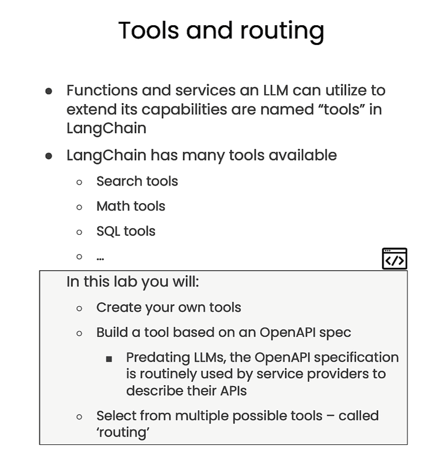


```py
import os
import openai

from dotenv import load_dotenv, find_dotenv
_ = load_dotenv(find_dotenv()) # read local .env file
openai.api_key = os.environ['OPENAI_API_KEY']

from langchain.agents import tool


@tool
def search(query: str) -> str:
    """Search for weather online"""
    return "42f"
    
search.name #'search'

search.description # 'search(query: str) -> str - Search for weather online'

search.args # {'query': {'title': 'Query', 'type': 'string'}}
```


```py
from pydantic import BaseModel, Field
class SearchInput(BaseModel):
    query: str = Field(description="Thing to search for")


@tool(args_schema=SearchInput)
def search(query: str) -> str:
    """Search for the weather online."""
    return "42f"
```


```py
search.args

search.run("sf")  # '42f'
```

Output

```json
{'query': {'title': 'Query',
  'description': 'Thing to search for',
  'type': 'string'}}
```


```py
import requests
from pydantic import BaseModel, Field
import datetime

# Define the input schema
class OpenMeteoInput(BaseModel):
    latitude: float = Field(..., description="Latitude of the location to fetch weather data for")
    longitude: float = Field(..., description="Longitude of the location to fetch weather data for")

@tool(args_schema=OpenMeteoInput)
def get_current_temperature(latitude: float, longitude: float) -> dict:
    """Fetch current temperature for given coordinates."""
    
    BASE_URL = "https://api.open-meteo.com/v1/forecast"
    
    # Parameters for the request
    params = {
        'latitude': latitude,
        'longitude': longitude,
        'hourly': 'temperature_2m',
        'forecast_days': 1,
    }

    # Make the request
    response = requests.get(BASE_URL, params=params)
    
    if response.status_code == 200:
        results = response.json()
    else:
        raise Exception(f"API Request failed with status code: {response.status_code}")

    current_utc_time = datetime.datetime.utcnow()
    time_list = [datetime.datetime.fromisoformat(time_str.replace('Z', '+00:00')) for time_str in results['hourly']['time']]
    temperature_list = results['hourly']['temperature_2m']
    
    closest_time_index = min(range(len(time_list)), key=lambda i: abs(time_list[i] - current_utc_time))
    current_temperature = temperature_list[closest_time_index]
    
    return f'The current temperature is {current_temperature}°C'
```


```py
get_current_temperature.name
```

Output

```py
'get_current_temperature'
```


```py
get_current_temperature.description
```

Output

```py
'get_current_temperature(latitude: float, longitude: float) -> dict - Fetch current temperature for given coordinates.'
```


```py
get_current_temperature.args
```

Output

```json
{'latitude': {'title': 'Latitude',
  'description': 'Latitude of the location to fetch weather data for',
  'type': 'number'},
 'longitude': {'title': 'Longitude',
  'description': 'Longitude of the location to fetch weather data for',
  'type': 'number'}}
```


```py
from langchain.tools.render import format_tool_to_openai_function

format_tool_to_openai_function(get_current_temperature)
```

Output

```json
format_tool_to_openai_function(get_current_temperature)
{'name': 'get_current_temperature',
 'description': 'get_current_temperature(latitude: float, longitude: float) -> dict - Fetch current temperature for given coordinates.',
 'parameters': {'title': 'OpenMeteoInput',
  'type': 'object',
  'properties': {'latitude': {'title': 'Latitude',
    'description': 'Latitude of the location to fetch weather data for',
    'type': 'number'},
   'longitude': {'title': 'Longitude',
    'description': 'Longitude of the location to fetch weather data for',
    'type': 'number'}},
  'required': ['latitude', 'longitude']}}
```


```py
get_current_temperature({"latitude": 13, "longitude": 14})
```

Output

```json
'The current temperature is 26.4°C'
```


```py
import wikipedia
@tool
def search_wikipedia(query: str) -> str:
    """Run Wikipedia search and get page summaries."""
    page_titles = wikipedia.search(query)
    summaries = []
    for page_title in page_titles[: 3]:
        try:
            wiki_page =  wikipedia.page(title=page_title, auto_suggest=False)
            summaries.append(f"Page: {page_title}\nSummary: {wiki_page.summary}")
        except (
            self.wiki_client.exceptions.PageError,
            self.wiki_client.exceptions.DisambiguationError,
        ):
            pass
    if not summaries:
        return "No good Wikipedia Search Result was found"
    return "\n\n".join(summaries)
```


```py
search_wikipedia.name # 'search_wikipedia'

search_wikipedia.description # 'search_wikipedia(query: str) -> str - Run Wikipedia search and get page summaries.'

format_tool_to_openai_function(search_wikipedia)
```

Output

```json
{'name': 'search_wikipedia',
 'description': 'search_wikipedia(query: str) -> str - Run Wikipedia search and get page summaries.',
 'parameters': {'title': 'search_wikipediaSchemaSchema',
  'type': 'object',
  'properties': {'query': {'title': 'Query', 'type': 'string'}},
  'required': ['query']}}
```


```py
search_wikipedia({"query": "langchain"})
```

Output

```json
'Page: LangChain\nSummary: LangChain is a framework designed to simplify the creation of applications using large language models (LLMs). As a language model integration framework, LangChain\'s use-cases largely overlap with those of language models in general, including document analysis and summarization, chatbots, and code analysis.\n\n\n\nPage: OpenAI\nSummary: OpenAI is a U.S. based artificial intelligence (AI) research organization founded in December 2015, researching artificial intelligence with the goal of developing "safe and beneficial" artificial general intelligence, which it defines as "highly autonomous systems that outperform humans at most economically valuable work".\nAs one of the leading organizations of the AI spring, it has developed several large language models, advanced image generation models, and previously, released open-source models. Its release of ChatGPT has been credited with starting the AI spring.The organization consists of the non-profit OpenAI, Inc. registered in Delaware and its for-profit subsidiary OpenAI Global, LLC. It was founded by Ilya Sutskever, Greg Brockman, Trevor Blackwell, Vicki Cheung, Andrej Karpathy, Durk Kingma, Jessica Livingston, John Schulman, Pamela Vagata, and Wojciech Zaremba, with Sam Altman and Elon Musk serving as the initial Board of Directors members. Microsoft provided OpenAI Global LLC with a $1 billion investment in 2019 and a $10 billion investment in 2023, with a significant portion of the investment in the form of computational resources on Microsoft\'s Azure cloud service.On November 17, 2023, the board removed Altman as CEO, while Brockman was removed as chairman and then resigned as president. Four days later, both returned after negotiations with the board, and most of the board members resigned. The new initial board included former Salesforce co-CEO Bret Taylor as chairman. It was also announced that Microsoft will have a non-voting board seat.\n\nPage: DataStax\nSummary: DataStax, Inc. is a real-time data for AI company based in Santa Clara, California. Its product Astra DB is a cloud database-as-a-service based on Apache Cassandra. DataStax also offers DataStax Enterprise (DSE), an on-premises database built on Apache Cassandra, and Astra Streaming, a messaging and event streaming cloud service based on Apache Pulsar. As of June 2022, the company has roughly 800 customers distributed in over 50 countries.'
```


```py
from langchain.chains.openai_functions.openapi import openapi_spec_to_openai_fn
from langchain.utilities.openapi import OpenAPISpec
```


```py
text = """
{
  "openapi": "3.0.0",
  "info": {
    "version": "1.0.0",
    "title": "Swagger Petstore",
    "license": {
      "name": "MIT"
    }
  },
  "servers": [
    {
      "url": "http://petstore.swagger.io/v1"
    }
  ],
  "paths": {
    "/pets": {
      "get": {
        "summary": "List all pets",
        "operationId": "listPets",
        "tags": [
          "pets"
        ],
        "parameters": [
          {
            "name": "limit",
            "in": "query",
            "description": "How many items to return at one time (max 100)",
            "required": false,
            "schema": {
              "type": "integer",
              "maximum": 100,
              "format": "int32"
            }
          }
        ],
        "responses": {
          "200": {
            "description": "A paged array of pets",
            "headers": {
              "x-next": {
                "description": "A link to the next page of responses",
                "schema": {
                  "type": "string"
                }
              }
            },
            "content": {
              "application/json": {
                "schema": {
                  "$ref": "#/components/schemas/Pets"
                }
              }
            }
          },
          "default": {
            "description": "unexpected error",
            "content": {
              "application/json": {
                "schema": {
                  "$ref": "#/components/schemas/Error"
                }
              }
            }
          }
        }
      },
      "post": {
        "summary": "Create a pet",
        "operationId": "createPets",
        "tags": [
          "pets"
        ],
        "responses": {
          "201": {
            "description": "Null response"
          },
          "default": {
            "description": "unexpected error",
            "content": {
              "application/json": {
                "schema": {
                  "$ref": "#/components/schemas/Error"
                }
              }
            }
          }
        }
      }
    },
    "/pets/{petId}": {
      "get": {
        "summary": "Info for a specific pet",
        "operationId": "showPetById",
        "tags": [
          "pets"
        ],
        "parameters": [
          {
            "name": "petId",
            "in": "path",
            "required": true,
            "description": "The id of the pet to retrieve",
            "schema": {
              "type": "string"
            }
          }
        ],
        "responses": {
          "200": {
            "description": "Expected response to a valid request",
            "content": {
              "application/json": {
                "schema": {
                  "$ref": "#/components/schemas/Pet"
                }
              }
            }
          },
          "default": {
            "description": "unexpected error",
            "content": {
              "application/json": {
                "schema": {
                  "$ref": "#/components/schemas/Error"
                }
              }
            }
          }
        }
      }
    }
  },
  "components": {
    "schemas": {
      "Pet": {
        "type": "object",
        "required": [
          "id",
          "name"
        ],
        "properties": {
          "id": {
            "type": "integer",
            "format": "int64"
          },
          "name": {
            "type": "string"
          },
          "tag": {
            "type": "string"
          }
        }
      },
      "Pets": {
        "type": "array",
        "maxItems": 100,
        "items": {
          "$ref": "#/components/schemas/Pet"
        }
      },
      "Error": {
        "type": "object",
        "required": [
          "code",
          "message"
        ],
        "properties": {
          "code": {
            "type": "integer",
            "format": "int32"
          },
          "message": {
            "type": "string"
          }
        }
      }
    }
  }
}
"""
```


```py
spec = OpenAPISpec.from_text(text)

pet_openai_functions, pet_callables = openapi_spec_to_openai_fn(spec)

pet_openai_functions
```

Output

```json
[{'name': 'listPets',
  'description': 'List all pets',
  'parameters': {'type': 'object',
   'properties': {'params': {'type': 'object',
     'properties': {'limit': {'type': 'integer',
       'maximum': 100.0,
       'schema_format': 'int32',
       'description': 'How many items to return at one time (max 100)'}},
     'required': []}}}},
 {'name': 'createPets',
  'description': 'Create a pet',
  'parameters': {'type': 'object', 'properties': {}}},
 {'name': 'showPetById',
  'description': 'Info for a specific pet',
  'parameters': {'type': 'object',
   'properties': {'path_params': {'type': 'object',
     'properties': {'petId': {'type': 'string',
       'description': 'The id of the pet to retrieve'}},
     'required': ['petId']}}}}]
```


```py
from langchain.chat_models import ChatOpenAI

model = ChatOpenAI(temperature=0).bind(functions=pet_openai_functions)


model.invoke("what are three pets names")
```

Output

```json
AIMessage(content='', additional_kwargs={'function_call': {'name': 'listPets', 'arguments': '{"params":{"limit":3}}'}})
```


```py
model.invoke("tell me about pet with id 42")
```


Output

```json
AIMessage(content='', additional_kwargs={'function_call': {'name': 'showPetById', 'arguments': '{"path_params":{"petId":"42"}}'}})
```


### Routing

In lesson 3, we show an example of function calling deciding between two candidate functions.

Given our tools above, let's format these as OpenAI functions and show this same behavior.


```py
functions = [
    format_tool_to_openai_function(f) for f in [
        search_wikipedia, get_current_temperature
    ]
]
model = ChatOpenAI(temperature=0).bind(functions=functions)

model.invoke("what is the weather in sf right now")
```

Output

```json
AIMessage(content='', additional_kwargs={'function_call': {'name': 'get_current_temperature', 'arguments': '{"latitude":37.7749,"longitude":-122.4194}'}})
```


```py
model.invoke("what is langchain")
```


Output

```json
AIMessage(content='', additional_kwargs={'function_call': {'name': 'search_wikipedia', 'arguments': '{"query":"Langchain"}'}})
```


```py
from langchain.prompts import ChatPromptTemplate
prompt = ChatPromptTemplate.from_messages([
    ("system", "You are helpful but sassy assistant"),
    ("user", "{input}"),
])
chain = prompt | model

chain.invoke({"input": "what is the weather in sf right now"})
```

Output

```json
AIMessage(content='', additional_kwargs={'function_call': {'name': 'get_current_temperature', 'arguments': '{"latitude":37.7749,"longitude":-122.4194}'}})
```


```py
from langchain.agents.output_parsers import OpenAIFunctionsAgentOutputParser
chain = prompt | model | OpenAIFunctionsAgentOutputParser()
result = chain.invoke({"input": "what is the weather in sf right now"})
type(result)  #langchain.schema.agent.AgentActionMessageLog
result.tool  #'get_current_temperature'

result.tool_input # {'latitude': 37.7749, 'longitude': -122.4194}
get_current_temperature(result.tool_input) # 'The current temperature is 9.5°C'
```


```py
result = chain.invoke({"input": "hi!"})
type(result) # langchain.schema.agent.AgentFinish
result.return_values # {'output': 'Hello! How can I assist you today?'}
```


```py
from langchain.schema.agent import AgentFinish
def route(result):
    if isinstance(result, AgentFinish):
        return result.return_values['output']
    else:
        tools = {
            "search_wikipedia": search_wikipedia, 
            "get_current_temperature": get_current_temperature,
        }
        return tools[result.tool].run(result.tool_input)
        
chain = prompt | model | OpenAIFunctionsAgentOutputParser() | route

result = chain.invoke({"input": "What is the weather in san francisco right now?"})
```

Output

```json
'The current temperature is 9.5°C'
```


```py
result = chain.invoke({"input": "What is langchain?"})
```


Output

```json
'Page: LangChain\nSummary: LangChain is a framework designed to simplify the creation of applications using large language models (LLMs). As a language model integration framework, LangChain\'s use-cases largely overlap with those of language models in general, including document analysis and summarization, chatbots, and code analysis.\n\n\n\nPage: OpenAI\nSummary: OpenAI is a U.S. based artificial intelligence (AI) research organization founded in December 2015, researching artificial intelligence with the goal of developing "safe and beneficial" artificial general intelligence, which it defines as "highly autonomous systems that outperform humans at most economically valuable work".\nAs one of the leading organizations of the AI spring, it has developed several large language models, advanced image generation models, and previously, released open-source models. Its release of ChatGPT has been credited with starting the AI spring.The organization consists of the non-profit OpenAI, Inc. registered in Delaware and its for-profit subsidiary OpenAI Global, LLC. It was founded by Ilya Sutskever, Greg Brockman, Trevor Blackwell, Vicki Cheung, Andrej Karpathy, Durk Kingma, Jessica Livingston, John Schulman, Pamela Vagata, and Wojciech Zaremba, with Sam Altman and Elon Musk serving as the initial Board of Directors members. Microsoft provided OpenAI Global LLC with a $1 billion investment in 2019 and a $10 billion investment in 2023, with a significant portion of the investment in the form of computational resources on Microsoft\'s Azure cloud service.On November 17, 2023, the board removed Altman as CEO, while Brockman was removed as chairman and then resigned as president. Four days later, both returned after negotiations with the board, and most of the board members resigned. The new initial board included former Salesforce co-CEO Bret Taylor as chairman. It was also announced that Microsoft will have a non-voting board seat.\n\nPage: DataStax\nSummary: DataStax, Inc. is a real-time data for AI company based in Santa Clara, California. Its product Astra DB is a cloud database-as-a-service based on Apache Cassandra. DataStax also offers DataStax Enterprise (DSE), an on-premises database built on Apache Cassandra, and Astra Streaming, a messaging and event streaming cloud service based on Apache Pulsar. As of June 2022, the company has roughly 800 customers distributed in over 50 countries.'
```


# Conversational agent

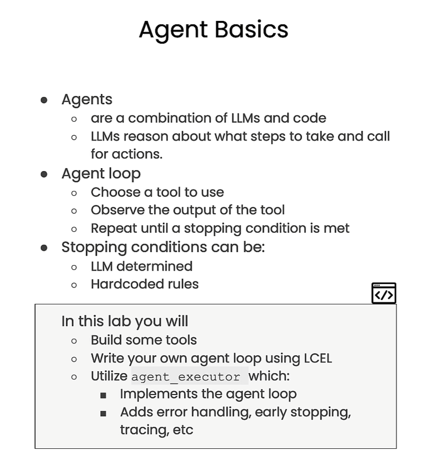


```py
import os
import openai

from dotenv import load_dotenv, find_dotenv
_ = load_dotenv(find_dotenv()) # read local .env file
openai.api_key = os.environ['OPENAI_API_KEY']

from langchain.tools import tool

import requests
from pydantic import BaseModel, Field
import datetime

# Define the input schema
class OpenMeteoInput(BaseModel):
    latitude: float = Field(..., description="Latitude of the location to fetch weather data for")
    longitude: float = Field(..., description="Longitude of the location to fetch weather data for")

@tool(args_schema=OpenMeteoInput)
def get_current_temperature(latitude: float, longitude: float) -> dict:
    """Fetch current temperature for given coordinates."""
    
    BASE_URL = "https://api.open-meteo.com/v1/forecast"
    
    # Parameters for the request
    params = {
        'latitude': latitude,
        'longitude': longitude,
        'hourly': 'temperature_2m',
        'forecast_days': 1,
    }

    # Make the request
    response = requests.get(BASE_URL, params=params)
    
    if response.status_code == 200:
        results = response.json()
    else:
        raise Exception(f"API Request failed with status code: {response.status_code}")

    current_utc_time = datetime.datetime.utcnow()
    time_list = [datetime.datetime.fromisoformat(time_str.replace('Z', '+00:00')) for time_str in results['hourly']['time']]
    temperature_list = results['hourly']['temperature_2m']
    
    closest_time_index = min(range(len(time_list)), key=lambda i: abs(time_list[i] - current_utc_time))
    current_temperature = temperature_list[closest_time_index]
    
    return f'The current temperature is {current_temperature}°C'
```


```py
import wikipedia

@tool
def search_wikipedia(query: str) -> str:
    """Run Wikipedia search and get page summaries."""
    page_titles = wikipedia.search(query)
    summaries = []
    for page_title in page_titles[: 3]:
        try:
            wiki_page =  wikipedia.page(title=page_title, auto_suggest=False)
            summaries.append(f"Page: {page_title}\nSummary: {wiki_page.summary}")
        except (
            self.wiki_client.exceptions.PageError,
            self.wiki_client.exceptions.DisambiguationError,
        ):
            pass
    if not summaries:
        return "No good Wikipedia Search Result was found"
    return "\n\n".join(summaries)

tools = [get_current_temperature, search_wikipedia]

from langchain.chat_models import ChatOpenAI
from langchain.prompts import ChatPromptTemplate
from langchain.tools.render import format_tool_to_openai_function
from langchain.agents.output_parsers import OpenAIFunctionsAgentOutputParser
```


```py
functions = [format_tool_to_openai_function(f) for f in tools]
model = ChatOpenAI(temperature=0).bind(functions=functions)
prompt = ChatPromptTemplate.from_messages([
    ("system", "You are helpful but sassy assistant"),
    ("user", "{input}"),
])
chain = prompt | model | OpenAIFunctionsAgentOutputParser()
```


```py
result = chain.invoke({"input": "what is the weather is sf?"})
result.tool # 'get_current_temperature'
 
result.tool_input  #{'latitude': 37.7749, 'longitude': -122.4194}


```


```py
from langchain.prompts import MessagesPlaceholder
prompt = ChatPromptTemplate.from_messages([
    ("system", "You are helpful but sassy assistant"),
    ("user", "{input}"),
    MessagesPlaceholder(variable_name="agent_scratchpad")
])

chain = prompt | model | OpenAIFunctionsAgentOutputParser()

result1 = chain.invoke({
    "input": "what is the weather is sf?",
    "agent_scratchpad": []
})

result1.tool # 'get_current_temperature'
observation = get_current_temperature(result1.tool_input)  #'The current temperature is 9.9°C'
type(result1) # langchain.schema.agent.AgentActionMessageLog


from langchain.agents.format_scratchpad import format_to_openai_functions

result1.message_log

```


Output

```json
[AIMessage(content='', additional_kwargs={'function_call': {'name': 'get_current_temperature', 'arguments': '{"latitude":37.7749,"longitude":-122.4194}'}})]
```


```py
format_to_openai_functions([(result1, observation), ])
```


Output

```json
[AIMessage(content='', additional_kwargs={'function_call': {'name': 'get_current_temperature', 'arguments': '{"latitude":37.7749,"longitude":-122.4194}'}}),
 FunctionMessage(content='The current temperature is 9.9°C', name='get_current_temperature')]
```


```py
result2 = chain.invoke({
    "input": "what is the weather is sf?", 
    "agent_scratchpad": format_to_openai_functions([(result1, observation)])
})
```

Output

```json
AgentFinish(return_values={'output': 'The current temperature in San Francisco is 9.9°C.'}, log='The current temperature in San Francisco is 9.9°C.')
```


```py
from langchain.schema.agent import AgentFinish
def run_agent(user_input):
    intermediate_steps = []
    while True:
        result = chain.invoke({
            "input": user_input, 
            "agent_scratchpad": format_to_openai_functions(intermediate_steps)
        })
        if isinstance(result, AgentFinish):
            return result
        tool = {
            "search_wikipedia": search_wikipedia, 
            "get_current_temperature": get_current_temperature,
        }[result.tool]
        observation = tool.run(result.tool_input)
        intermediate_steps.append((result, observation))
        
        
from langchain.schema.runnable import RunnablePassthrough
agent_chain = RunnablePassthrough.assign(
    agent_scratchpad= lambda x: format_to_openai_functions(x["intermediate_steps"])
) | chain


def run_agent(user_input):
    intermediate_steps = []
    while True:
        result = agent_chain.invoke({
            "input": user_input, 
            "intermediate_steps": intermediate_steps
        })
        if isinstance(result, AgentFinish):
            return result
        tool = {
            "search_wikipedia": search_wikipedia, 
            "get_current_temperature": get_current_temperature,
        }[result.tool]
        observation = tool.run(result.tool_input)
        intermediate_steps.append((result, observation))
```


```py
run_agent("what is the weather is sf?")
```

Output

```json
AgentFinish(return_values={'output': 'The current temperature in San Francisco is 9.9°C.'}, log='The current temperature in San Francisco is 9.9°C.')
```


```py
run_agent("what is langchain?")
```


Output

```json
AgentFinish(return_values={'output': 'LangChain is a framework designed to simplify the creation of applications using large language models (LLMs). It is a language model integration framework with use-cases that overlap with those of language models in general, including document analysis and summarization, chatbots, and code analysis.'}, log='LangChain is a framework designed to simplify the creation of applications using large language models (LLMs). It is a language model integration framework with use-cases that overlap with those of language models in general, including document analysis and summarization, chatbots, and code analysis.')
```


```py
run_agent("hi!")
```

Output


```json
AgentFinish(return_values={'output': 'Well, hello there! How can I assist you today?'}, log='Well, hello there! How can I assist you today?')
```


```py
from langchain.agents import AgentExecutor
agent_executor = AgentExecutor(agent=agent_chain, tools=tools, verbose=True)

agent_executor.invoke({"input": "what is langchain?"})
```


Output

```py

> Entering new AgentExecutor chain...

Invoking: `search_wikipedia` with `{'query': 'Langchain'}`


Page: LangChain
Summary: LangChain is a framework designed to simplify the creation of applications using large language models (LLMs). As a language model integration framework, LangChain's use-cases largely overlap with those of language models in general, including document analysis and summarization, chatbots, and code analysis.


Page: OpenAI
Summary: OpenAI is a U.S. based artificial intelligence (AI) research organization founded in December 2015, researching artificial intelligence with the goal of developing "safe and beneficial" artificial general intelligence, which it defines as "highly autonomous systems that outperform humans at most economically valuable work".
As one of the leading organizations of the AI spring, it has developed several large language models, advanced image generation models, and previously, released open-source models. Its release of ChatGPT has been credited with starting the AI spring.The organization consists of the non-profit OpenAI, Inc. registered in Delaware and its for-profit subsidiary OpenAI Global, LLC. It was founded by Ilya Sutskever, Greg Brockman, Trevor Blackwell, Vicki Cheung, Andrej Karpathy, Durk Kingma, Jessica Livingston, John Schulman, Pamela Vagata, and Wojciech Zaremba, with Sam Altman and Elon Musk serving as the initial Board of Directors members. Microsoft provided OpenAI Global LLC with a $1 billion investment in 2019 and a $10 billion investment in 2023, with a significant portion of the investment in the form of computational resources on Microsoft's Azure cloud service.On November 17, 2023, the board removed Altman as CEO, while Brockman was removed as chairman and then resigned as president. Four days later, both returned after negotiations with the board, and most of the board members resigned. The new initial board included former Salesforce co-CEO Bret Taylor as chairman. It was also announced that Microsoft will have a non-voting board seat.

Page: DataStax
Summary: DataStax, Inc. is a real-time data for AI company based in Santa Clara, California. Its product Astra DB is a cloud database-as-a-service based on Apache Cassandra. DataStax also offers DataStax Enterprise (DSE), an on-premises database built on Apache Cassandra, and Astra Streaming, a messaging and event streaming cloud service based on Apache Pulsar. As of June 2022, the company has roughly 800 customers distributed in over 50 countries.LangChain is a framework designed to simplify the creation of applications using large language models (LLMs). It is a language model integration framework that can be used for document analysis and summarization, chatbots, and code analysis.

> Finished chain.
{'input': 'what is langchain?',
 'output': 'LangChain is a framework designed to simplify the creation of applications using large language models (LLMs). It is a language model integration framework that can be used for document analysis and summarization, chatbots, and code analysis.'}
```


```py
agent_executor.invoke({"input": "my name is bob"})
```

Output

```py
> Entering new AgentExecutor chain...
Hello Bob! How can I assist you today?

> Finished chain.
{'input': 'my name is bob', 'output': 'Hello Bob! How can I assist you today?'}
```


```py
agent_executor.invoke({"input": "what is my name"})
```

Output

```py
> Entering new AgentExecutor chain...
I'm sorry, I don't have access to your personal information. How can I assist you today?

> Finished chain.
{'input': 'what is my name',
 'output': "I'm sorry, I don't have access to your personal information. How can I assist you today?"}
```


```py
prompt = ChatPromptTemplate.from_messages([
    ("system", "You are helpful but sassy assistant"),
    MessagesPlaceholder(variable_name="chat_history"),
    ("user", "{input}"),
    MessagesPlaceholder(variable_name="agent_scratchpad")
])

agent_chain = RunnablePassthrough.assign(
    agent_scratchpad= lambda x: format_to_openai_functions(x["intermediate_steps"])
) | prompt | model | OpenAIFunctionsAgentOutputParser()

from langchain.memory import ConversationBufferMemory
memory = ConversationBufferMemory(return_messages=True,memory_key="chat_history")

agent_executor = AgentExecutor(agent=agent_chain, tools=tools, verbose=True, memory=memory)

agent_executor.invoke({"input": "my name is bob"})
```

Output

```json
> Entering new AgentExecutor chain...
Nice to meet you, Bob! How can I assist you today?

> Finished chain.
{'input': 'my name is bob',
 'chat_history': [HumanMessage(content='my name is bob'),
  AIMessage(content='Nice to meet you, Bob! How can I assist you today?')],
 'output': 'Nice to meet you, Bob! How can I assist you today?'}
```


```py
agent_executor.invoke({"input": "whats my name"})
```

Output

```json
> Entering new AgentExecutor chain...
Your name is Bob.

> Finished chain.
{'input': 'whats my name',
 'chat_history': [HumanMessage(content='my name is bob'),
  AIMessage(content='Nice to meet you, Bob! How can I assist you today?'),
  HumanMessage(content='whats my name'),
  AIMessage(content='Your name is Bob.')],
 'output': 'Your name is Bob.'}
```


```py
agent_executor.invoke({"input": "whats the weather in sf?"})
```

Output

```json
> Entering new AgentExecutor chain...

Invoking: `get_current_temperature` with `{'latitude': 37.7749, 'longitude': -122.4194}`


The current temperature is 9.9°CThe current temperature in San Francisco is 9.9°C.

> Finished chain.
{'input': 'whats the weather in sf?',
 'chat_history': [HumanMessage(content='my name is bob'),
  AIMessage(content='Nice to meet you, Bob! How can I assist you today?'),
  HumanMessage(content='whats my name'),
  AIMessage(content='Your name is Bob.'),
  HumanMessage(content='whats the weather in sf?'),
  AIMessage(content='The current temperature in San Francisco is 9.9°C.')],
 'output': 'The current temperature in San Francisco is 9.9°C.'}
```


### Create a chatbot


```py
@tool
def create_your_own(query: str) -> str:
    """This function can do whatever you would like once you fill it in """
    print(type(query))
    return query[::-1]
    
    
tools = [get_current_temperature, search_wikipedia, create_your_own]


import panel as pn  # GUI
pn.extension()
import panel as pn
import param

class cbfs(param.Parameterized):
    
    def __init__(self, tools, **params):
        super(cbfs, self).__init__( **params)
        self.panels = []
        self.functions = [format_tool_to_openai_function(f) for f in tools]
        self.model = ChatOpenAI(temperature=0).bind(functions=self.functions)
        self.memory = ConversationBufferMemory(return_messages=True,memory_key="chat_history")
        self.prompt = ChatPromptTemplate.from_messages([
            ("system", "You are helpful but sassy assistant"),
            MessagesPlaceholder(variable_name="chat_history"),
            ("user", "{input}"),
            MessagesPlaceholder(variable_name="agent_scratchpad")
        ])
        self.chain = RunnablePassthrough.assign(
            agent_scratchpad = lambda x: format_to_openai_functions(x["intermediate_steps"])
        ) | self.prompt | self.model | OpenAIFunctionsAgentOutputParser()
        self.qa = AgentExecutor(agent=self.chain, tools=tools, verbose=False, memory=self.memory)
    
    def convchain(self, query):
        if not query:
            return
        inp.value = ''
        result = self.qa.invoke({"input": query})
        self.answer = result['output'] 
        self.panels.extend([
            pn.Row('User:', pn.pane.Markdown(query, width=450)),
            pn.Row('ChatBot:', pn.pane.Markdown(self.answer, width=450, styles={'background-color': '#F6F6F6'}))
        ])
        return pn.WidgetBox(*self.panels, scroll=True)


    def clr_history(self,count=0):
        self.chat_history = []
        return 
        
        
cb = cbfs(tools)

inp = pn.widgets.TextInput( placeholder='Enter text here…')

conversation = pn.bind(cb.convchain, inp) 

tab1 = pn.Column(
    pn.Row(inp),
    pn.layout.Divider(),
    pn.panel(conversation,  loading_indicator=True, height=400),
    pn.layout.Divider(),
)

dashboard = pn.Column(
    pn.Row(pn.pane.Markdown('# QnA_Bot')),
    pn.Tabs(('Conversation', tab1))
)
dashboard
```


Output

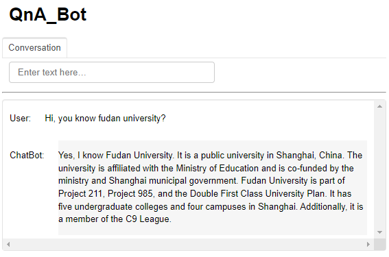

# 后记

2024年3月20日完成这门short course，熟悉了LangChain的接口。

