# Getting Started With Mistral


本文是学习 [https://www.deeplearning.ai/short-courses/getting-started-with-mistral/](https://www.deeplearning.ai/short-courses/getting-started-with-mistral/) 这门课的学习笔记。

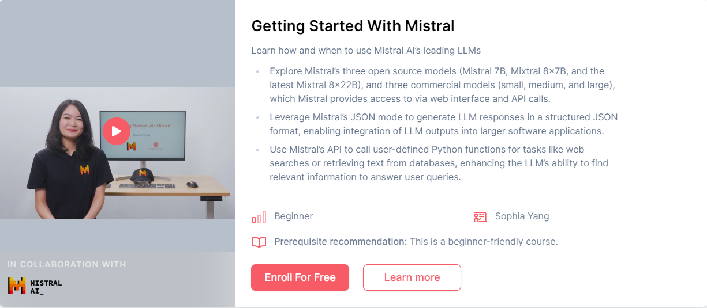


## What you’ll learn in this course

In this course, you’ll access Mistral AI’s collection of open source and commercial models, including the Mixtral 8x7B model, and the latest Mixtral 8x22B. You’ll learn about selecting the right model for your use case, and get hands-on with features like effective prompting techniques, function calling, JSON mode, and Retrieval Augmented Generation (RAG).

In detail:

- Access and prompt Mistral models via API calls for tasks, and decide whether your task is either a simple task (classification), medium (email writing), or advanced (coding) level of complexity, and consider speed requirements to choose an appropriate model.
- Learn to use Mistral’s native function calling, in which you give an LLM tools it can call as needed to perform tasks that are better performed by traditional code, such as querying a database for numerical data. 
- Build a basic RAG system from scratch with similarity search, properly chunk data, create embeddings, and implement this tool as a function in your chat system.
- Build a chat interface to interact with the Mistral models and ask questions about a document that you upload.

By the end of this course, you’ll be equipped to leverage Mistral AI’s leading open source and commercial models.


@[toc]


# Overview


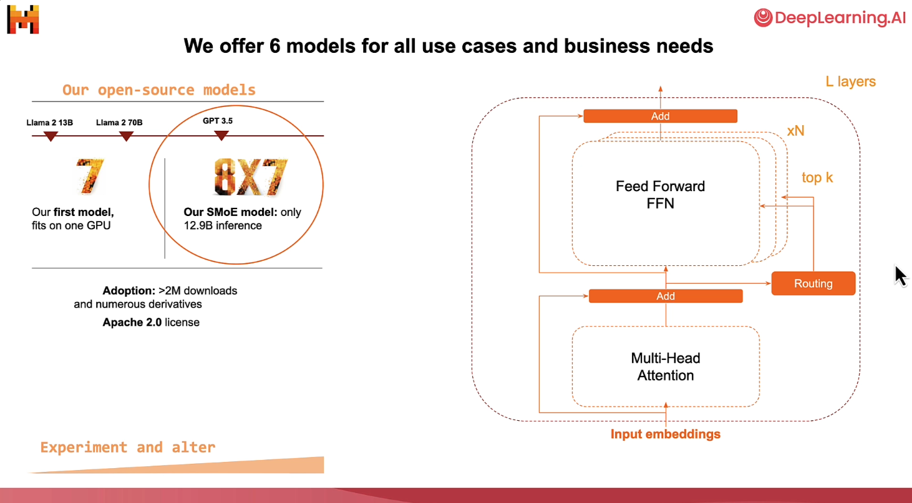


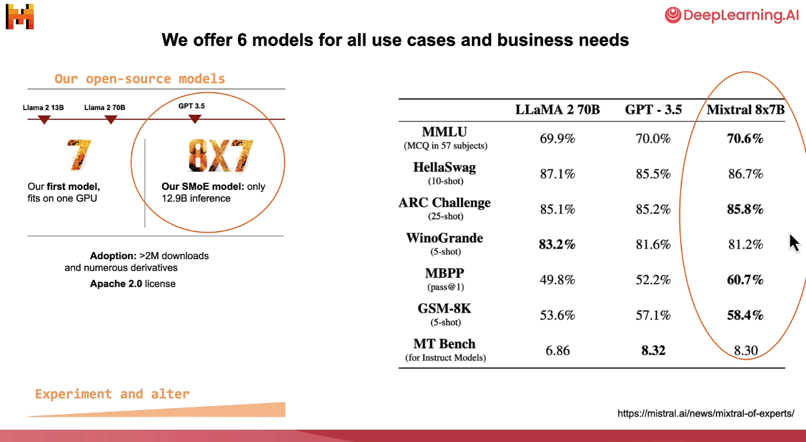


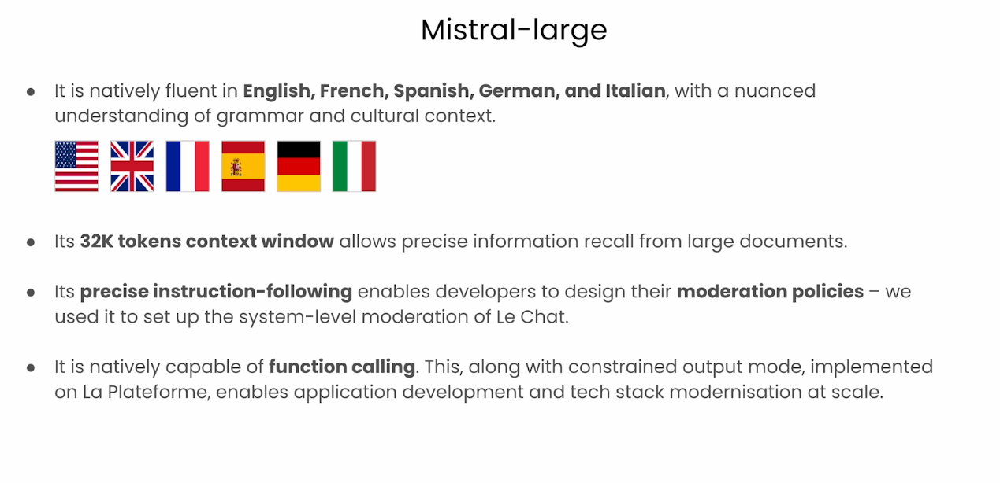


# Prompting Capabilities 

- Note, you can try any of these prompts outside of this classroom, and without coding, by going to the chat interface [Le Chat](https://chat.mistral.ai/chat).
  - You can sign up with a free account.
  - Signing up for an account is **not** required to complete this course.

```py
# !pip install mistralai
```


requirements.txt

```py
# requirements file
# note which revision of python, for example 3.9.6
# in this file, insert all the pip install needs, include revision

python-dotenv==1.0.1
mistralai==0.1.6
pandas==2.2.1
faiss-cpu==1.8.0
langchain==0.1.12
langchain-mistralai==0.0.5
llama-index==0.10.19
llama-index-embeddings-mistralai==0.1.4
llama-index-llms-mistralai==0.1.6
mistral-haystack==0.0.1
panel==1.4.0

```


### Load API key and helper function
- Note: You can view or download the helper.py file by clicking on the "Jupyter" logo to access the file directory.


```py
from helper import load_mistral_api_key
load_mistral_api_key()

from helper import mistral
mistral("hello, what can you do?")
```

Output

```py
'Hello! I can assist with a variety of tasks. Here are a few examples:\n\n1. Answer questions: I can provide information on a wide range of topics, from general knowledge to specific queries.\n2. Set reminders and alarms: I can help you remember important dates or tasks.\n3. Provide news and weather updates: I can give you the latest news and weather information.\n4. Play music and videos: I can play your favorite songs or videos.\n5. Control smart home devices: If you have smart home devices, I can help you control them.\n6. Send messages and make calls: I can help you send messages or make calls to your contacts.'
```

其中helper.py如下

```py
import os
from dotenv import load_dotenv, find_dotenv     

from mistralai.client import MistralClient
from mistralai.models.chat_completion import ChatMessage


api_key = None
dlai_endpoint = None
client = None

def load_env():
    _ = load_dotenv(find_dotenv())

def load_mistral_api_key(ret_key=False):
    load_env()
    global api_key
    global dlai_endpoint
    api_key = os.getenv("MISTRAL_API_KEY")
    dlai_endpoint = os.getenv("DLAI_MISTRAL_API_ENDPOINT")

    global client
    client = MistralClient(api_key=api_key, endpoint=dlai_endpoint)
    
    if ret_key:
        return api_key, dlai_endpoint

def mistral(user_message, 
            model="mistral-small-latest",
            is_json=False):
    client = MistralClient(api_key=api_key, endpoint=dlai_endpoint)
    messages = [ChatMessage(role="user", content=user_message)]

    if is_json:
        chat_response = client.chat(
            model=model, 
            messages=messages,
            response_format={"type": "json_object"})
    else:
        chat_response = client.chat(
            model=model, 
            messages=messages)

    return chat_response.choices[0].message.content


def get_text_embedding(txt):
    global client
    embeddings_batch_response = client.embeddings(
        model="mistral-embed", 
        input=txt
    )
    return embeddings_batch_response.data[0].embedding

import requests
from bs4 import BeautifulSoup
import re
def get_web_article_text(url, file_save_name=None):

    response = requests.get(url)
    html_doc = response.text
    soup = BeautifulSoup(html_doc, 'html.parser')
    
    
    tag = soup.find("div", re.compile("^prose--styled"))
    text = tag.text
    
    if file_save_name:
        f = open(file_save_name, "w")
        f.write(text)
        f.close()
    return text
```


## Classification


```py
prompt = """
    You are a bank customer service bot. 
    Your task is to assess customer intent and categorize customer 
    inquiry after <<<>>> into one of the following predefined categories:
    
    card arrival
    change pin
    exchange rate
    country support 
    cancel transfer
    charge dispute
    
    If the text doesn't fit into any of the above categories, 
    classify it as:
    customer service
    
    You will only respond with the predefined category. 
    Do not provide explanations or notes. 
    
    ###
    Here are some examples:
    
    Inquiry: How do I know if I will get my card, or if it is lost? I am concerned about the delivery process and would like to ensure that I will receive my card as expected. Could you please provide information about the tracking process for my card, or confirm if there are any indicators to identify if the card has been lost during delivery?
    Category: card arrival
    Inquiry: I am planning an international trip to Paris and would like to inquire about the current exchange rates for Euros as well as any associated fees for foreign transactions.
    Category: exchange rate 
    Inquiry: What countries are getting support? I will be traveling and living abroad for an extended period of time, specifically in France and Germany, and would appreciate any information regarding compatibility and functionality in these regions.
    Category: country support
    Inquiry: Can I get help starting my computer? I am having difficulty starting my computer, and would appreciate your expertise in helping me troubleshoot the issue. 
    Category: customer service
    ###
    
    <<<
    Inquiry: {inquiry}
    >>>
    Category:
"""
```

 Ask Mistral to check the spelling and grammar of your prompt

```py
response = mistral(f"Please correct the spelling and grammar of \
this prompt and return a text that is the same prompt,\
with the spelling and grammar fixed: {prompt}")
```


```py
print(response)
```


Try out the model

```py
mistral(
    response.format(
        inquiry="I am inquiring about the availability of your cards in the EU"
    )
)
```

Output

```py
'country support'
```


## Information Extraction with JSON Mode


```py
medical_notes = """
A 60-year-old male patient, Mr. Johnson, presented with symptoms
of increased thirst, frequent urination, fatigue, and unexplained
weight loss. Upon evaluation, he was diagnosed with diabetes,
confirmed by elevated blood sugar levels. Mr. Johnson's weight
is 210 lbs. He has been prescribed Metformin to be taken twice daily
with meals. It was noted during the consultation that the patient is
a current smoker. 
"""
```


```py
prompt = f"""
Extract information from the following medical notes:
{medical_notes}

Return json format with the following JSON schema: 

{{
        "age": {{
            "type": "integer"
        }},
        "gender": {{
            "type": "string",
            "enum": ["male", "female", "other"]
        }},
        "diagnosis": {{
            "type": "string",
            "enum": ["migraine", "diabetes", "arthritis", "acne"]
        }},
        "weight": {{
            "type": "integer"
        }},
        "smoking": {{
            "type": "string",
            "enum": ["yes", "no"]
        }}
}}
"""
```


```py
response = mistral(prompt, is_json=True)
print(response)
```

Output

```json
{"age": 60, "gender": "male", "diagnosis": "diabetes", "weight": 210, "smoking": "yes"}
```


## Personalization


```py
email = """
Dear mortgage lender, 

What's your 30-year fixed-rate APR, how is it compared to the 15-year 
fixed rate?

Regards,
Anna
"""
```


```py
prompt = f"""

You are a mortgage lender customer service bot, and your task is to 
create personalized email responses to address customer questions.
Answer the customer's inquiry using the provided facts below. Ensure 
that your response is clear, concise, and directly addresses the 
customer's question. Address the customer in a friendly and 
professional manner. Sign the email with "Lender Customer Support."   
      
# Facts
30-year fixed-rate: interest rate 6.403%, APR 6.484%
20-year fixed-rate: interest rate 6.329%, APR 6.429%
15-year fixed-rate: interest rate 5.705%, APR 5.848%
10-year fixed-rate: interest rate 5.500%, APR 5.720%
7-year ARM: interest rate 7.011%, APR 7.660%
5-year ARM: interest rate 6.880%, APR 7.754%
3-year ARM: interest rate 6.125%, APR 7.204%
30-year fixed-rate FHA: interest rate 5.527%, APR 6.316%
30-year fixed-rate VA: interest rate 5.684%, APR 6.062%

# Email
{email}
"""
```


```py
response = mistral(prompt)
print(response)
```

Output

```py
Subject: Re: Inquiry Regarding 30-Year and 15-Year Fixed-Rate Mortgages

Dear Anna,

Thank you for reaching out to us.

I'm happy to provide you with the information you need.

Our 30-year fixed-rate mortgage has an annual percentage rate (APR) of 6.484%. In comparison, our 15-year fixed-rate mortgage has a lower APR of 5.848%. This difference is due to the shorter loan term, which allows for more interest to be paid off over a shorter period of time.

Please let us know if you have any other questions or if there's anything else we can assist you with.

Best regards,

Lender Customer Support
```


## Summarization

- We'll use this [article](https://www.deeplearning.ai/the-batch/mistral-enhances-ai-landscape-in-europe-with-microsoft-partnership-and-new-language-models) from The Batch


```py
newsletter = """
European AI champion Mistral AI unveiled new large language models and formed an alliance with Microsoft. 

What’s new: Mistral AI introduced two closed models, Mistral Large and Mistral Small (joining Mistral Medium, which debuted quietly late last year). Microsoft invested $16.3 million in the French startup, and it agreed to distribute Mistral Large on its Azure platform and let Mistral AI use Azure computing infrastructure. Mistral AI makes the new models available to try for free here and to use on its La Plateforme and via custom deployments.

Model specs: The new models’ parameter counts, architectures, and training methods are undisclosed. Like the earlier, open source Mistral 7B and Mixtral 8x7B, they can process 32,000 tokens of input context. 

Mistral Large achieved 81.2 percent on the MMLU benchmark, outperforming Anthropic’s Claude 2, Google’s Gemini Pro, and Meta’s Llama 2 70B, though falling short of GPT-4. Mistral Small, which is optimized for latency and cost, achieved 72.2 percent on MMLU.
Both models are fluent in French, German, Spanish, and Italian. They’re trained for function calling and JSON-format output.
Microsoft’s investment in Mistral AI is significant but tiny compared to its $13 billion stake in OpenAI and Google and Amazon’s investments in Anthropic, which amount to $2 billion and $4 billion respectively.
Mistral AI and Microsoft will collaborate to train bespoke models for customers including European governments.
Behind the news: Mistral AI was founded in early 2023 by engineers from Google and Meta. The French government has touted the company as a home-grown competitor to U.S.-based leaders like OpenAI. France’s representatives in the European Commission argued on Mistral’s behalf to loosen the European Union’s AI Act oversight on powerful AI models. 

Yes, but: Mistral AI’s partnership with Microsoft has divided European lawmakers and regulators. The European Commission, which already was investigating Microsoft’s agreement with OpenAI for potential breaches of antitrust law, plans to investigate the new partnership as well. Members of President Emmanuel Macron’s Renaissance party criticized the deal’s potential to give a U.S. company access to European users’ data. However, other French lawmakers support the relationship.

Why it matters: The partnership between Mistral AI and Microsoft gives the startup crucial processing power for training large models and greater access to potential customers around the world. It gives the tech giant greater access to the European market. And it gives Azure customers access to a high-performance model that’s tailored to Europe’s unique regulatory environment.

We’re thinking: Mistral AI has made impressive progress in a short time, especially relative to the resources at its disposal as a startup. Its partnership with a leading hyperscaler is a sign of the tremendous processing and distribution power that remains concentrated in the large, U.S.-headquartered cloud companies.
"""
```


```py
prompt = f"""
You are a commentator. Your task is to write a report on a newsletter. 
When presented with the newsletter, come up with interesting questions to ask,
and answer each question. 
Afterward, combine all the information and write a report in the markdown
format. 

# Newsletter: 
{newsletter}

# Instructions: 
## Summarize:
In clear and concise language, summarize the key points and themes 
presented in the newsletter.

## Interesting Questions: 
Generate three distinct and thought-provoking questions that can be 
asked about the content of the newsletter. For each question:
- After "Q: ", describe the problem 
- After "A: ", provide a detailed explanation of the problem addressed 
in the question.
- Enclose the ultimate answer in <>.

## Write a analysis report
Using the summary and the answers to the interesting questions, 
create a comprehensive report in Markdown format. 
"""
```


```py
response = mistral(prompt)
print(response)
```

Output

```py
# Summary:
- Mistral AI, a European AI champion, introduced new large language models, Mistral Large and Mistral Small.
- Microsoft invested $16.3 million in Mistral AI and will distribute Mistral Large on its Azure platform, while Mistral AI will use Azure computing infrastructure.
- Mistral Large outperformed several models on the MMLU benchmark but fell short of GPT-4. Both models are fluent in four European languages and trained for function calling.
- The partnership between Mistral AI and Microsoft has sparked controversy among European lawmakers due to potential antitrust breaches and data access concerns.

# Interesting Questions:

## Q: How does Mistral AI's performance on the MMLU benchmark compare to other models?
A: Mistral AI's new models have demonstrated impressive performance on the MMLU benchmark. Mistral Large achieved 81.2 percent, outperforming Anthropic’s Claude 2, Google’s Gemini Pro, and Meta’s Llama 2 70B. However, it fell short of GPT-4. Mistral Small, optimized for latency and cost, achieved 72.2 percent.

## Q: What are the concerns surrounding Mistral AI's partnership with Microsoft?
A: The partnership between Mistral AI and Microsoft has raised concerns among European lawmakers and regulators. The European Commission plans to investigate the partnership for potential breaches of antitrust law, as it already is investigating Microsoft’s agreement with OpenAI. Additionally, there are concerns that the partnership may give Microsoft access to European users’ data.

## Q: What does the partnership between Mistral AI and Microsoft mean for the European market?
A: The partnership between Mistral AI and Microsoft has significant implications for the European market. It provides Mistral AI with the processing power needed to train large models and access to potential customers worldwide. For Microsoft, it expands its access to the European market. For Azure customers, it offers a high-performance model tailored to Europe’s unique regulatory environment.

# Report:

Mistral AI, a European AI champion, has made significant strides with the introduction of two new large language models, Mistral Large and Mistral Small. These models have shown impressive performance on the MMLU benchmark, outperforming several other models but falling short of GPT-4. Microsoft's investment in Mistral AI and agreement to distribute Mistral Large on its Azure platform will provide the startup with crucial processing power and access to potential customers worldwide.

However, the partnership between Mistral AI and Microsoft has not been without controversy. European lawmakers and regulators have raised concerns about potential antitrust breaches and access to European users’ data. The European Commission plans to investigate the partnership, adding to its existing investigation into Microsoft’s agreement with OpenAI.

Despite these concerns, the partnership between Mistral AI and Microsoft holds significant implications for the European market. It provides Mistral AI with the resources needed to compete with U.S.-based AI leaders, while giving Microsoft greater access to the European market. For Azure customers, the partnership offers a high-performance model tailored to Europe’s unique regulatory environment.

In conclusion, Mistral AI's progress, especially given its status as a startup, is commendable. Its partnership with Microsoft, however, highlights the concentration of processing and distribution power in large, U.S.-headquartered cloud companies. The ensuing debate around data access and antitrust law underscores the complexities of technology partnerships in today's globalized world.
```


# Model Selection

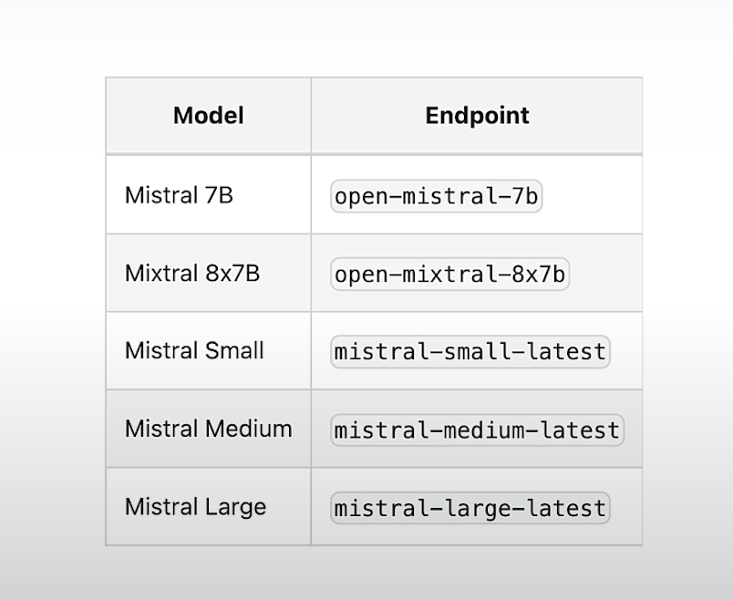

Performance


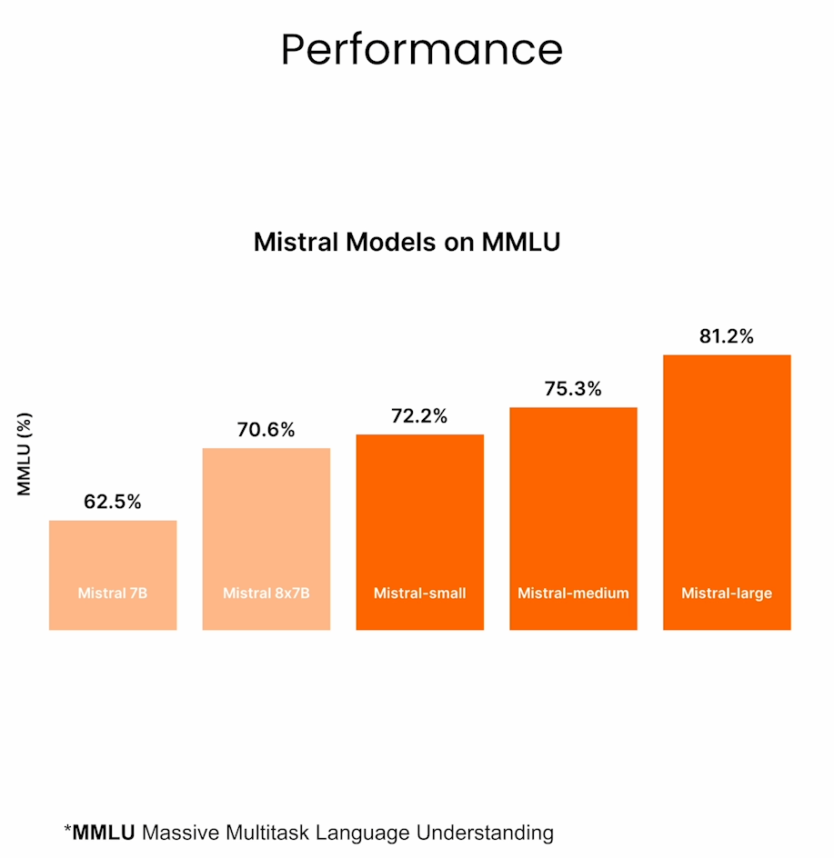


Choose different model

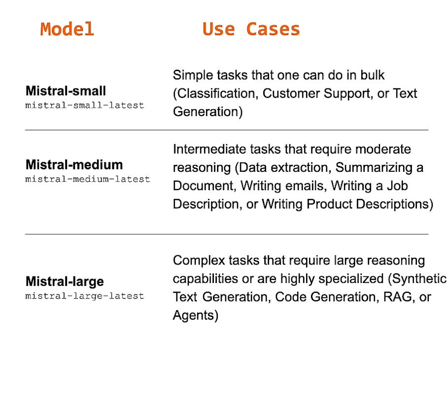


### Get API Key


```py
from helper import load_mistral_api_key
api_key, dlai_endpoint = load_mistral_api_key(ret_key=True)
```

- Note: in the classroom, if you print out this `api_key` variable, it is not a real API key (for security reasons).
- If you wish to run this code on your own machine, outside of the classroom, you can still reuse the code that you see in `helper.py`.
- It uses [python-dotenv](https://pypi.org/project/python-dotenv/) library to securely save and load sensitive information such as API keys.


```py
import os
from mistralai.client import MistralClient
from mistralai.models.chat_completion import ChatMessage

def mistral(user_message, model="mistral-small-latest", is_json=False):
    client = MistralClient(api_key=api_key, endpoint=dlai_endpoint)
    messages = [ChatMessage(role="user", content=user_message)]

    if is_json:
        chat_response = client.chat(
            model=model, messages=messages, response_format={"type": "json_object"}
        )
    else:
        chat_response = client.chat(model=model, messages=messages)

    return chat_response.choices[0].message.content
```


## Mistral Small

Good for simple tasks, fast inference, lower cost.
- classification


```py
prompt = """
Classify the following email to determine if it is spam or not.
Only respond with the exact text "Spam" or "Not Spam". 

# Email:
🎉 Urgent! You've Won a $1,000,000 Cash Prize! 
💰 To claim your prize, please click on the link below: 
https://bit.ly/claim-your-prize
"""
```


```py
mistral(prompt, model="mistral-small-latest")
```

Output

```py
'Spam'
```


## Mistral Medium

Good for intermediate tasks such as language transformation.
- Composing text based on provided context (e.g. writing a customer service email based on purchase information).


```py
prompt = """
Compose a welcome email for new customers who have just made 
their first purchase with your product. 
Start by expressing your gratitude for their business, 
and then convey your excitement for having them as a customer. 
Include relevant details about their recent order. 
Sign the email with "The Fun Shop Team".

Order details:
- Customer name: Anna
- Product: hat 
- Estimate date of delivery: Feb. 25, 2024
- Return policy: 30 days
"""
```


```py
response_medium = mistral(prompt, model="mistral-medium-latest")
```


```py
print(response_medium)
```

Output

```py
Subject: Welcome to The Fun Shop - Thank You for Your First Purchase!

Dear Anna,

We hope this email finds you well! We are absolutely thrilled to have you as a part of The Fun Shop family. We truly appreciate your trust in us and your decision to make your first purchase with us.

We wanted to personally thank you for choosing our hat as your first product. We are confident that you will love it and that it will bring you joy and happiness.

Your order is currently being processed and is estimated to be delivered to you on February 25, 2024. We will make sure to keep you updated on the status of your order and will notify you as soon as it has been shipped.

In the meantime, we would like to remind you of our 30-day return policy. If for any reason, you are not completely satisfied with your purchase, please don't hesitate to reach out to us. We will do everything we can to make it right.

Once again, thank you for choosing The Fun Shop. We are excited to have you as a customer and can't wait to see you in your new hat!

Best regards,
The Fun Shop Team
```


## Mistral Large: 

Good for complex tasks that require advanced reasoning.
- Math and reasoning with numbers.


```py
prompt = """
Calculate the difference in payment dates between the two \
customers whose payment amounts are closest to each other \
in the following dataset. Do not write code.

# dataset: 
'{
  "transaction_id":{"0":"T1001","1":"T1002","2":"T1003","3":"T1004","4":"T1005"},
    "customer_id":{"0":"C001","1":"C002","2":"C003","3":"C002","4":"C001"},
    "payment_amount":{"0":125.5,"1":89.99,"2":120.0,"3":54.3,"4":210.2},
"payment_date":{"0":"2021-10-05","1":"2021-10-06","2":"2021-10-07","3":"2021-10-05","4":"2021-10-08"},
    "payment_status":{"0":"Paid","1":"Unpaid","2":"Paid","3":"Paid","4":"Pending"}
}'
"""
```

Using mistral small

```py
response_small = mistral(prompt, model="mistral-small-latest")
print(response_small)
```


Output

```py
To solve this, let's first find the two customers whose payment amounts are closest to each other:

1. Sort the payment amounts in ascending order: 54.3, 89.99, 120.0, 125.5, 210.2
2. The two closest amounts are 89.99 and 120.0.

Now, let's find the difference in payment dates for these two customers:

1. Look up the payment dates for customer_ids C002 and C003.
2. The payment date for C002 is "2021-10-06" and the payment date for C003 is "2021-10-07".
3. Calculate the difference in payment dates: 2021-10-07 - 2021-10-06 = 1 day.
```

Using mistral large

```py
response_large = mistral(prompt, model="mistral-large-latest")
print(response_large)
```

Output

```py
First, let's identify the two closest payment amounts:

1. T1001 (C001) pays $125.50
2. T1002 (C002) pays $89.99
3. T1003 (C003) pays $120.00
4. T1004 (C002) pays $54.30
5. T1005 (C001) pays $210.20

The two closest payment amounts are $125.50 (T1001) and $120.00 (T1003) with a difference of $5.50.

Now, let's calculate the difference between the payment dates of these two transactions:

1. T1001 was paid on 2021-10-05
2. T1003 was paid on 2021-10-07

To find the difference between two dates, subtract the earlier date from the later date. Here, the difference between 2021-10-07 and 2021-10-05 is 2 days.

So, the difference in payment dates between the two customers whose payment amounts are closest to each other is 2 days.
```

## Expense reporting task


```py
transactions = """
McDonald's: 8.40
Safeway: 10.30
Carrefour: 15.00
Toys R Us: 20.50
Panda Express: 10.20
Beanie Baby Outlet: 25.60
World Food Wraps: 22.70
Stuffed Animals Shop: 45.10
Sanrio Store: 85.70
"""

prompt = f"""
Given the purchase details, how much did I spend on each category:
1) restaurants
2) groceries
3) stuffed animals and props
{transactions}
"""
```

mistral-small-latest

```py
response_small = mistral(prompt, model="mistral-small-latest")
print(response_small)
```

Output

```py
To calculate your spending in each category, I've assigned the purchases to the corresponding categories as follows:

1) Restaurants: McDonald's and Panda Express
2) Groceries: Safeway and Carrefour
3) Stuffed animals and props: Toys R Us, Beanie Baby Outlet, Stuffed Animals Shop, and Sanrio Store

Here's the breakdown of your spending in each category:

1) Restaurants:
   - McDonald's: $8.40
   - Panda Express: $10.20
   Total spent on restaurants: $18.60

2) Groceries:
   - Safeway: $10.30
   - Carrefour: $15.00
   Total spent on groceries: $25.30

3) Stuffed animals and props:
   - Toys R Us: $20.50
   - Beanie Baby Outlet: $25.60
   - Stuffed Animals Shop: $45.10
   - Sanrio Store: $85.70
   Total spent on stuffed animals and props: $176.90
```


mistral-large-latest


```py
response_large = mistral(prompt, model="mistral-large-latest")
print(response_large)
```

Output

```py
Sure, I can help you categorize your spending. Here's how much you spent on each category:

1) Restaurants:
   - McDonald's: $8.40
   - Panda Express: $10.20
   - World Food Wraps: $22.70
   Total spent on restaurants: $8.40 + $10.20 + $22.70 = $41.30

2) Groceries:
   - Safeway: $10.30
   - Carrefour: $15.00
   Total spent on groceries: $10.30 + $15.00 = $25.30

3) Stuffed animals and props:
   - Toys R Us: $20.50
   - Beanie Baby Outlet: $25.60
   - Stuffed Animals Shop: $45.10
   - Sanrio Store: $85.70
   Total spent on stuffed animals and props: $20.50 + $25.60 + $45.10 + $85.70 = $176.90

So, you spent $41.30 on restaurants, $25.30 on groceries, and $176.90 on stuffed animals and props.
```


## Writing and checking code


```py
user_message = """
Given an array of integers nums and an integer target, return indices of the two numbers such that they add up to target.

You may assume that each input would have exactly one solution, and you may not use the same element twice.

You can return the answer in any order.

Your code should pass these tests:

assert twoSum([2,7,11,15], 9) == [0,1]
assert twoSum([3,2,4], 6) == [1,2]
assert twoSum([3,3], 6) == [0,1]
"""
```


```py
print(mistral(user_message, model="mistral-large-latest"))
```

Output

~~~py
Here's a Python solution that uses a dictionary to store the previously seen numbers and their indices. It iterates through the array and checks if the current number's complement (target - current number) is in the dictionary. If it is, it returns the indices of the current number and the complement. If it's not, it adds the current number and its index to the dictionary.

```python
def twoSum(nums, target):
    seen = {}
    for i, num in enumerate(nums):
        complement = target - num
        if complement in seen:
            return [seen[complement], i]
        seen[num] = i
```

This solution has a time complexity of O(n) and a space complexity of O(n), where n is the length of the input array. It passes all the test cases provided:

```python
assert twoSum([2,7,11,15], 9) == [0,1]
assert twoSum([3,2,4], 6) == [1,2]
assert twoSum([3,3], 6) == [0,1]
```
~~~


## Natively Fluent in English, French, Spanish, German, and Italian
- This means that you can use Mistral models for more than translating from one language to another.
- If you are a native Spanish speaker, for instance, you can communicate with Mistral models in Spanish for any of your tasks.


```py
user_message = """
Lequel est le plus lourd une livre de fer ou un kilogramme de plume
"""
print(mistral(user_message, model="mistral-large-latest"))
```

Output

```py
Une livre de fer est plus légère qu'un kilogramme de plumes.

Une livre (lb) est une unité de mesure de masse principalement utilisée aux États-Unis et dans d'autres systèmes de mesure impériaux, tandis qu'un kilogramme (kg) est l'unité de base de masse dans le système international d'unités (SI).

1 livre est égale à environ 0,453592 kilogrammes. Donc, une livre de fer (0,453592 kg) est plus légère qu'un kilogramme de plumes (1 kg).

La confusion dans cette question vient du fait que les plumes sont généralement considérées comme légères et le fer comme lourd, mais cela dépend de la quantité. Dans ce cas, la quantité de plumes (un kilogramme) est plus importante que la quantité de fer (une livre), ce qui en fait un poids plus lourd.
```


## List of Mistral models that you can call:

You can also call the two open source mistral models via API calls.
Here is the list of models that you can try:
```py
open-mistral-7b
open-mixtral-8x7b
open-mixtral-8x22b
mistral-small-latest
mistral-medium-latest
mistral-large-latest
```

For example:
```Python
mistral(prompt, model="open-mixtral-8x22b")
```

Note that we just released the `open-mixtral-8x22b` model. Check out our [release blog](https://mistral.ai/news/mixtral-8x22b/) for details. 


# Function Calling


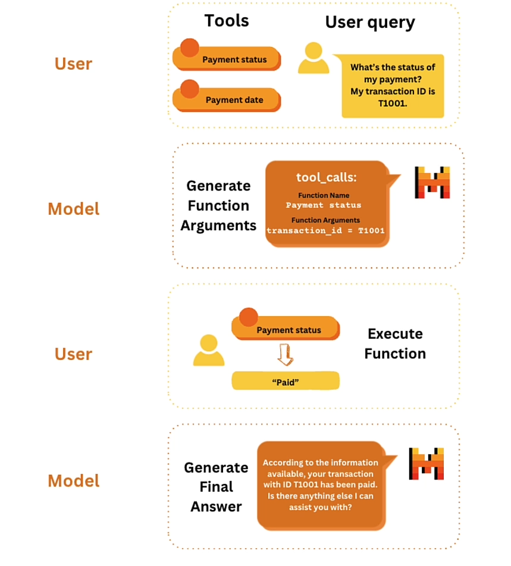

### Load API key

```py
from helper import load_mistral_api_key
api_key, dlai_endpoint = load_mistral_api_key(ret_key=True)
import pandas as pd
```


```py
data = {
    "transaction_id": ["T1001", "T1002", "T1003", "T1004", "T1005"],
    "customer_id": ["C001", "C002", "C003", "C002", "C001"],
    "payment_amount": [125.50, 89.99, 120.00, 54.30, 210.20],
    "payment_date": [
        "2021-10-05",
        "2021-10-06",
        "2021-10-07",
        "2021-10-05",
        "2021-10-08",
    ],
    "payment_status": ["Paid", "Unpaid", "Paid", "Paid", "Pending"],
}
df = pd.DataFrame(data)
```

Output

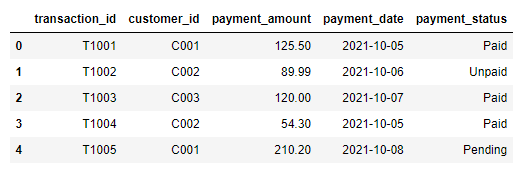

How you might answer data questions without function calling
- Not recommended, but an example to serve as a contrast to function calling.


```py
data = """
    "transaction_id": ["T1001", "T1002", "T1003", "T1004", "T1005"],
    "customer_id": ["C001", "C002", "C003", "C002", "C001"],
    "payment_amount": [125.50, 89.99, 120.00, 54.30, 210.20],
    "payment_date": [
        "2021-10-05",
        "2021-10-06",
        "2021-10-07",
        "2021-10-05",
        "2021-10-08",
    ],
    "payment_status": ["Paid", "Unpaid", "Paid", "Paid", "Pending"],
}
"""
transaction_id = "T1001"

prompt = f"""
Given the following data, what is the payment status for \
 transaction_id={transaction_id}?

data:
{data}

"""
```


```py
import os
from mistralai.client import MistralClient
from mistralai.models.chat_completion import ChatMessage


def mistral(user_message, model="mistral-small-latest", is_json=False):
    client = MistralClient(api_key=api_key, endpoint=dlai_endpoint)
    messages = [ChatMessage(role="user", content=user_message)]

    if is_json:
        chat_response = client.chat(
            model=model, messages=messages, response_format={"type": "json_object"}
        )
    else:
        chat_response = client.chat(model=model, messages=messages)

    return chat_response.choices[0].message.content
```


```py
response = mistral(prompt)
print(response)
```

Output

```py
The payment status for transaction_id=T1001 is "Paid".
```


## Step 1. User: specify tools and query

### Tools

- You can define all tools that you might want the model to call.


```py
import json

def retrieve_payment_status(df: data, transaction_id: str) -> str:
    if transaction_id in df.transaction_id.values:
        return json.dumps(
            {"status": df[df.transaction_id == transaction_id].payment_status.item()}
        )
    return json.dumps({"error": "transaction id not found."})


status = retrieve_payment_status(df, transaction_id="T1001")
print(status)
```

Output

```json
{"status": "Paid"}
```


```py
def retrieve_payment_date(df: data, transaction_id: str) -> str:
    if transaction_id in df.transaction_id.values:
        return json.dumps(
            {"date": df[df.transaction_id == transaction_id].payment_date.item()}
        )
    return json.dumps({"error": "transaction id not found."})

date = retrieve_payment_date(df, transaction_id="T1002")
print(date)
```

Output

```json
{"date": "2021-10-06"}
```

- You can outline the function specifications with a JSON schema.


```py
tool_payment_status = {
    "type": "function",
    "function": {
        "name": "retrieve_payment_status",
        "description": "Get payment status of a transaction",
        "parameters": {
            "type": "object",
            "properties": {
                "transaction_id": {
                    "type": "string",
                    "description": "The transaction id.",
                }
            },
            "required": ["transaction_id"],
        },
    },
}


tool_payment_date = {
    "type": "function",
    "function": {
        "name": "retrieve_payment_date",
        "description": "Get payment date of a transaction",
        "parameters": {
            "type": "object",
            "properties": {
                "transaction_id": {
                    "type": "string",
                    "description": "The transaction id.",
                }
            },
            "required": ["transaction_id"],
        },
    },
}

tools = [tool_payment_status, tool_payment_date]
```


### functools


```py
import functools

names_to_functions = {
    "retrieve_payment_status": functools.partial(retrieve_payment_status, df=df),
    "retrieve_payment_date": functools.partial(retrieve_payment_date, df=df),
}

names_to_functions["retrieve_payment_status"](transaction_id="T1001")
```


### User query

- Example: “What’s the status of my transaction?”


```py
from mistralai.models.chat_completion import ChatMessage

chat_history = [
    ChatMessage(role="user", content="What's the status of my transaction?")
]
```


## Step 2. Model: Generate function arguments 


```py
from mistralai.client import MistralClient

model = "mistral-large-latest"

client = MistralClient(api_key=os.getenv("MISTRAL_API_KEY"), endpoint=os.getenv("DLAI_MISTRAL_API_ENDPOINT"))

response = client.chat(
    model=model, messages=chat_history, tools=tools, tool_choice="auto"
)

response

response.choices[0].message.content
```

Output

```py
'To help you with that, I would need the transaction ID. Could you please provide it?'
```

### Save the chat history


```py
chat_history.append(
    ChatMessage(role="assistant", content=response.choices[0].message.content)
)
chat_history.append(ChatMessage(role="user", content="My transaction ID is T1001."))
chat_history
```

Output

```py
ChatMessage(role='user', content="What's the status of my transaction?", name=None, tool_calls=None),
 ChatMessage(role='assistant', content='To help you with that, I would need the transaction ID. Could you please provide it?', name=None, tool_calls=None),
 ChatMessage(role='user', content='My transaction ID is T1001.', name=None, tool_calls=None)]
```


```py
response = client.chat(
    model=model, messages=chat_history, tools=tools, tool_choice="auto"
)
```

Output

```py
ChatCompletionResponse(id='0d16c96bc7ec4a6297be76d1ad8710bb', object='chat.completion', created=1717307759, model='mistral-large-latest', choices=[ChatCompletionResponseChoice(index=0, message=ChatMessage(role='assistant', content='', name=None, tool_calls=[ToolCall(id='4cSn7rumW', type=<ToolType.function: 'function'>, function=FunctionCall(name='retrieve_payment_status', arguments='{"transaction_id": "T1001"}'))]), finish_reason=<FinishReason.tool_calls: 'tool_calls'>)], usage=UsageInfo(prompt_tokens=193, total_tokens=223, completion_tokens=30))
```

## Step 3. User: Execute function to obtain tool results

- Currently, the user is the one who will execute these functions (the model will not execute these functions on its own).


```py
tool_function = response.choices[0].message.tool_calls[0].function
print(tool_function)
```

Output

```py
name='retrieve_payment_status' arguments='{"transaction_id": "T1001"}'
```

- The function arguments are expected to be in a Python dictionary and not a string.
- To make this string into a dictionary, you can use `json.loads()`  


```py
args = json.loads(tool_function.arguments)
print(args)
```

Output

```py
{'transaction_id': 'T1001'}
```


- Recall the functools dictionary that you made earlier

```Python
import functools
names_to_functions = {
    "retrieve_payment_status": 
      functools.partial(retrieve_payment_status, df=df),
    
    "retrieve_payment_date": 
      functools.partial(retrieve_payment_date, df=df),
}
```

```py
function_result = names_to_functions[tool_function.name](**args)
function_result
```

- The output of the function call can be saved as a chat message, with the role "tool".


```py
tool_msg = ChatMessage(role="tool", name=tool_function.name, content=function_result)
chat_history.append(tool_msg)

chat_history
```

Output

```py
[ChatMessage(role='user', content="What's the status of my transaction?", name=None, tool_calls=None),
 ChatMessage(role='assistant', content='To help you with that, I would need the transaction ID. Could you please provide it?', name=None, tool_calls=None),
 ChatMessage(role='user', content='My transaction ID is T1001.', name=None, tool_calls=None),
 ChatMessage(role='assistant', content='', name=None, tool_calls=[ToolCall(id='4cSn7rumW', type=<ToolType.function: 'function'>, function=FunctionCall(name='retrieve_payment_status', arguments='{"transaction_id": "T1001"}'))]),
 ChatMessage(role='tool', content='{"status": "Paid"}', name='retrieve_payment_status', tool_calls=None)]
```

## Step 4. Model: Generate final answer
- The model can now reply to the user query, given the information provided by the "tool".


```py
response = client.chat(model=model, messages=chat_history)
response.choices[0].message.content
```

Output

```py
"The status of your transaction T1001 is 'Paid'. If you have any more questions or need further assistance, feel free to ask."
```


# Basic RAG (Retrieval Augmented Generation)

What is RAG

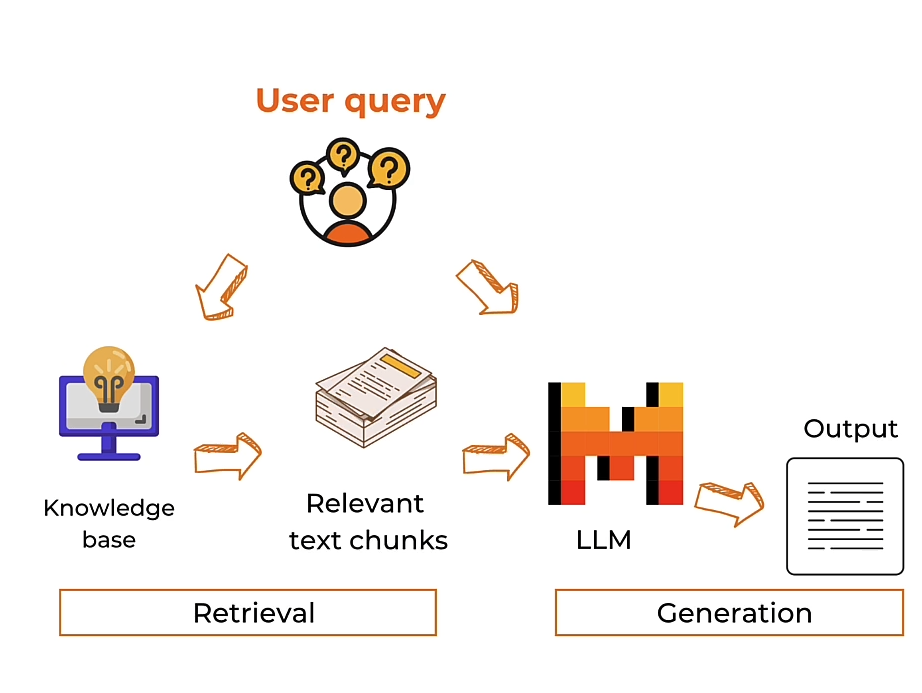


```py
# ! pip install faiss-cpu "mistralai>=0.1.2"
```


### Parse the article with BeautifulSoup 


```py
import requests
from bs4 import BeautifulSoup
import re

response = requests.get(
    "https://www.deeplearning.ai/the-batch/a-roadmap-explores-how-ai-can-detect-and-mitigate-greenhouse-gases/"
)
html_doc = response.text
soup = BeautifulSoup(html_doc, "html.parser")
tag = soup.find("div", re.compile("^prose--styled"))
text = tag.text
print(text)
```


### Optionally, save the text into a text file
- You can upload the text file into a chat interface in the next lesson.
- To download this file to your own machine, click on the "Jupyter" logo to view the file directory.  


```py
file_name = "AI_greenhouse_gas.txt"
with open(file_name, 'w') as file:
    file.write(text)
```


### Chunking


```py
chunk_size = 512
chunks = [text[i : i + chunk_size] for i in range(0, len(text), chunk_size)]
len(chunks)
```

Output

8

### Get embeddings of the chunks


```py
import os
from mistralai.client import MistralClient


def get_text_embedding(txt):
    client = MistralClient(api_key=api_key, endpoint=dlai_endpoint)
    embeddings_batch_response = client.embeddings(model="mistral-embed", input=txt)
    return embeddings_batch_response.data[0].embedding
```


```py
import numpy as np

text_embeddings = np.array([get_text_embedding(chunk) for chunk in chunks])
len(text_embeddings[0])
```

Output

```py
1024
```


### Store in a vector databsae
- In this classroom, you'll use [Faiss](https://engineering.fb.com/2017/03/29/data-infrastructure/faiss-a-library-for-efficient-similarity-search/)

```py
import faiss

d = text_embeddings.shape[1]
index = faiss.IndexFlatL2(d)
index.add(text_embeddings)
```


### Embed the user query


```py
question = "What are the ways that AI can reduce emissions in Agriculture?"
question_embeddings = np.array([get_text_embedding(question)])
```

### Search for chunks that are similar to the query


```py
D, I = index.search(question_embeddings, k=2)
print(I)
```

Output

```py
[[4 5]]
```


```py
retrieved_chunk = [chunks[i] for i in I.tolist()[0]]
print(retrieved_chunk)
```

Output

```py
['data to help factories use more recycled materials, cut waste, minimize energy use, and reduce downtime. Similarly, they can optimize supply chains to reduce emissions contributed by logistics.\xa0Agriculture.\xa0Farmers use AI-equipped sensors to simulate different crop rotations and weather events to forecast crop yield or loss. Armed with this data, food producers can cut waste and reduce carbon footprints. The authors cite lack of food-related datasets and investment in adapting farming practices as primary b', 'arriers to taking full advantage of AI in the food industry.Transportation.\xa0AI systems can reduce greenhouse-gas emissions by improving traffic flow, ameliorating congestion, and optimizing public transportation. Moreover, reinforcement learning can reduce the impact of electric vehicles on the power grid by optimizing their charging. More data, uniform standards, and AI talent are needed to realize this potential.Materials.\xa0Materials scientists use AI models to study traits of existing materials and design']
```


```py
prompt = f"""
Context information is below.
---------------------
{retrieved_chunk}
---------------------
Given the context information and not prior knowledge, answer the query.
Query: {question}
Answer:
"""
```


```py
from mistralai.models.chat_completion import ChatMessage


def mistral(user_message, model="mistral-small-latest", is_json=False):
    client = MistralClient(api_key=api_key, endpoint=dlai_endpoint)
    messages = [ChatMessage(role="user", content=user_message)]

    if is_json:
        chat_response = client.chat(
            model=model, messages=messages, response_format={"type": "json_object"}
        )
    else:
        chat_response = client.chat(model=model, messages=messages)

    return chat_response.choices[0].message.content
```


```py
response = mistral(prompt)
print(response)
```


Output

```py
In Agriculture, AI can reduce emissions by helping farmers use AI-equipped sensors to simulate different crop rotations and weather events to forecast crop yield or loss. With this data, food producers can cut waste and reduce their carbon footprints. However, the authors cite lack of food-related datasets and investment in adapting farming practices as primary barriers to taking full advantage of AI in the food industry.
```


## RAG + Function calling


```py
def qa_with_context(text, question, chunk_size=512):
    # split document into chunks
    chunks = [text[i : i + chunk_size] for i in range(0, len(text), chunk_size)]
    # load into a vector database
    text_embeddings = np.array([get_text_embedding(chunk) for chunk in chunks])
    d = text_embeddings.shape[1]
    index = faiss.IndexFlatL2(d)
    index.add(text_embeddings)
    # create embeddings for a question
    question_embeddings = np.array([get_text_embedding(question)])
    # retrieve similar chunks from the vector database
    D, I = index.search(question_embeddings, k=2)
    retrieved_chunk = [chunks[i] for i in I.tolist()[0]]
    # generate response based on the retrieve relevant text chunks

    prompt = f"""
    Context information is below.
    ---------------------
    {retrieved_chunk}
    ---------------------
    Given the context information and not prior knowledge, answer the query.
    Query: {question}
    Answer:
    """
    response = mistral(prompt)
    return response
```


```py
import functools

names_to_functions = {"qa_with_context": functools.partial(qa_with_context, text=text)}
```


```py
tools = [
    {
        "type": "function",
        "function": {
            "name": "qa_with_context",
            "description": "Answer user question by retrieving relevant context",
            "parameters": {
                "type": "object",
                "properties": {
                    "question": {
                        "type": "string",
                        "description": "user question",
                    }
                },
                "required": ["question"],
            },
        },
    },
]


question = """
What are the ways AI can mitigate climate change in transportation?
"""

client = MistralClient(api_key=api_key, endpoint=dlai_endpoint)

response = client.chat(
    model="mistral-large-latest",
    messages=[ChatMessage(role="user", content=question)],
    tools=tools,
    tool_choice="any",
)

response
```

Output

```py
ChatCompletionResponse(id='5f17e258ea714a919066b8aca82cc750', object='chat.completion', created=1717309362, model='mistral-large-latest', choices=[ChatCompletionResponseChoice(index=0, message=ChatMessage(role='assistant', content='', name=None, tool_calls=[ToolCall(id='uPQRDTjUQ', type=<ToolType.function: 'function'>, function=FunctionCall(name='qa_with_context', arguments='{"question": "What are the ways AI can mitigate climate change in transportation?"}'))]), finish_reason=<FinishReason.tool_calls: 'tool_calls'>)], usage=UsageInfo(prompt_tokens=92, total_tokens=126, completion_tokens=34))
```


```py
tool_function = response.choices[0].message.tool_calls[0].function
tool_function
```


Output

```py
FunctionCall(name='qa_with_context', arguments='{"question": "What are the ways AI can mitigate climate change in transportation?"}')
```


```py
import json

args = json.loads(tool_function.arguments)
args
```

Output

```py
{'question': 'What are the ways AI can mitigate climate change in transportation?'}
```


```py
function_result = names_to_functions[tool_function.name](**args)
function_result
```

Output

```py
'Based on the provided context, the specific ways AI can mitigate climate change in transportation are not explicitly mentioned. However, it is mentioned that AI has "high-potential opportunities" in various sectors including manufacturing, food production, and transportation. These opportunities are not detailed, but it\'s reasonable to infer that they could involve optimizing transportation routes for efficiency, developing more energy-efficient vehicles through AI-driven simulation, or utilizing AI for predictive maintenance to reduce waste and energy usage. Without more specific information, these are the most likely areas where AI could contribute to mitigating climate change in transportation.'
```


## More about RAG
To learn about more advanced chunking and retrieval methods, you can check out:
- [Advanced Retrieval for AI with Chroma](https://learn.deeplearning.ai/courses/advanced-retrieval-for-ai/lesson/1/introduction)
  - Sentence window retrieval
  - Auto-merge retrieval
- [Building and Evaluating Advanced RAG Applications](https://learn.deeplearning.ai/courses/building-evaluating-advanced-rag)
  - Query Expansion
  - Cross-encoder reranking
  - Training and utilizing Embedding Adapters


# Chatbot


```py
import os
from mistralai.models.chat_completion import ChatMessage
from mistralai.client import MistralClient
```


## Panel

[Panel](https://panel.holoviz.org/) is an open source python library that you can use to create dashboards and apps.

```py
import panel as pn
pn.extension()
```

## Basic Chat UI


```py
def run_mistral(contents, user, chat_interface):
    client = MistralClient(api_key=api_key, endpoint=dlai_endpoint)
    messages = [ChatMessage(role="user", content=contents)]
    chat_response = client.chat(
        model="mistral-large-latest", 
        messages=messages)
    return chat_response.choices[0].message.content
```


```py

chat_interface = pn.chat.ChatInterface(
    callback=run_mistral, 
    callback_user="Mistral"
)

chat_interface
```

Output

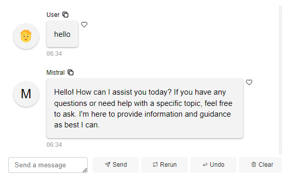


## RAG UI

Below is the RAG code that you used in the previous lesson.


```py
import requests
from bs4 import BeautifulSoup
import re

response = requests.get(
    "https://www.deeplearning.ai/the-batch/a-roadmap-explores-how-ai-can-detect-and-mitigate-greenhouse-gases/"
)
html_doc = response.text
soup = BeautifulSoup(html_doc, "html.parser")
tag = soup.find("div", re.compile("^prose--styled"))
text = tag.text
print(text)

# Optionally save this text into a file.
file_name = "AI_greenhouse_gas.txt"
with open(file_name, 'w') as file:
    file.write(text)
```


```py
import numpy as np
import faiss

client = MistralClient(
    api_key=os.getenv("MISTRAL_API_KEY"),
    endpoint=os.getenv("DLAI_MISTRAL_API_ENDPOINT")
)

prompt = """
Context information is below.
---------------------
{retrieved_chunk}
---------------------
Given the context information and not prior knowledge, answer the query.
Query: {question}
Answer:
"""

def get_text_embedding(input):
    embeddings_batch_response = client.embeddings(model="mistral-embed", input=input)
    return embeddings_batch_response.data[0].embedding

def run_mistral(user_message, model="mistral-large-latest"):
    messages = [ChatMessage(role="user", content=user_message)]
    chat_response = client.chat(model=model, messages=messages)
    return chat_response.choices[0].message.content

def answer_question(question, user, instance):
    text = file_input.value.decode("utf-8")

    # split document into chunks
    chunk_size = 2048
    chunks = [text[i : i + chunk_size] for i in range(0, len(text), chunk_size)]
    # load into a vector database
    text_embeddings = np.array([get_text_embedding(chunk) for chunk in chunks])
    d = text_embeddings.shape[1]
    index = faiss.IndexFlatL2(d)
    index.add(text_embeddings)
    # create embeddings for a question
    question_embeddings = np.array([get_text_embedding(question)])
    # retrieve similar chunks from the vector database
    D, I = index.search(question_embeddings, k=2)
    retrieved_chunk = [chunks[i] for i in I.tolist()[0]]
    # generate response based on the retrieved relevant text chunks
    response = run_mistral(
        prompt.format(retrieved_chunk=retrieved_chunk, question=question)
    )
    return response
```


### Connect the Chat interface with your user-defined function

- Note, you can find some sample text files to upload to this RAG UI by clicking on the 'Jupyter' logo and to view the file directory of the lesson.
- Or you can create any text file and copy-paste some text from a web article.


```py
file_input = pn.widgets.FileInput(accept=".txt", value="", height=50)

chat_interface = pn.chat.ChatInterface(
    callback=answer_question,
    callback_user="Mistral",
    header=pn.Row(file_input, "### Upload a text file to chat with it!"),
)
chat_interface.send(
    "Send a message to get a reply from Mistral!", 
    user="System", 
    respond=False
)
chat_interface
```

Output

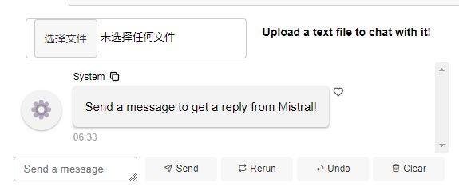


# 后记

2024年6月2日14点38分完成这门short course的学习。