# Knowledge Graphs for RAG

本文是学习[https://www.deeplearning.ai/short-courses/knowledge-graphs-rag/](https://www.deeplearning.ai/short-courses/knowledge-graphs-rag/)这门课的学习笔记。

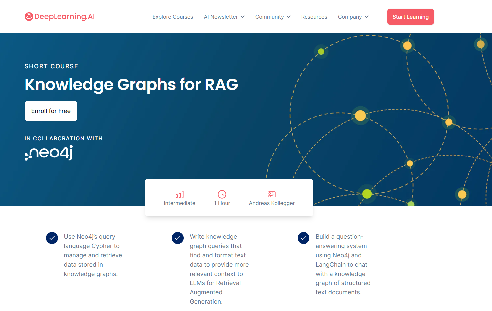

## What you’ll learn in this course

Knowledge graphs are used in development to structure complex data relationships, drive intelligent search functionality, and build powerful AI applications that can reason over different data types. Knowledge graphs can connect data from both structured and unstructured sources (databases, documents, etc.), providing an intuitive and flexible way to model complex, real-world scenarios. 

Unlike tables or simple lists, knowledge graphs can capture the meaning and context behind the data, allowing you to uncover insights and connections that would be difficult to find with conventional databases. This rich, structured context is ideal for improving the output of large language models (LLMs), because you can build more relevant context for the model than with semantic search alone. 

This course will teach you how to leverage knowledge graphs within retrieval augmented generation (RAG) applications. You’ll learn to:

- Understand the basics of how knowledge graphs store data by using nodes to represent entities and edges to represent relationships between nodes.
- Use Neo4j’s query language, Cypher, to retrieve information from a fun graph of movie and actor data.
- Add a vector index to a knowledge graph to represent unstructured text data and find relevant texts using vector similarity search.
- Build a knowledge graph of text documents from scratch, using publicly available financial and investment documents as the demo use case
- Explore advanced techniques for connecting multiple knowledge graphs and using complex queries for comprehensive data retrieval.
- Write advanced Cypher queries to retrieve relevant information from the graph and format it for inclusion in your prompt to an LLM.

After course completion, you’ll be well-equipped to use knowledge graphs to uncover deeper insights in your data, and enhance the performance of LLMs with structured, relevant context.


@[toc]

# Knowledge Graphs Fundamentals


What is a Knowledge Graph？

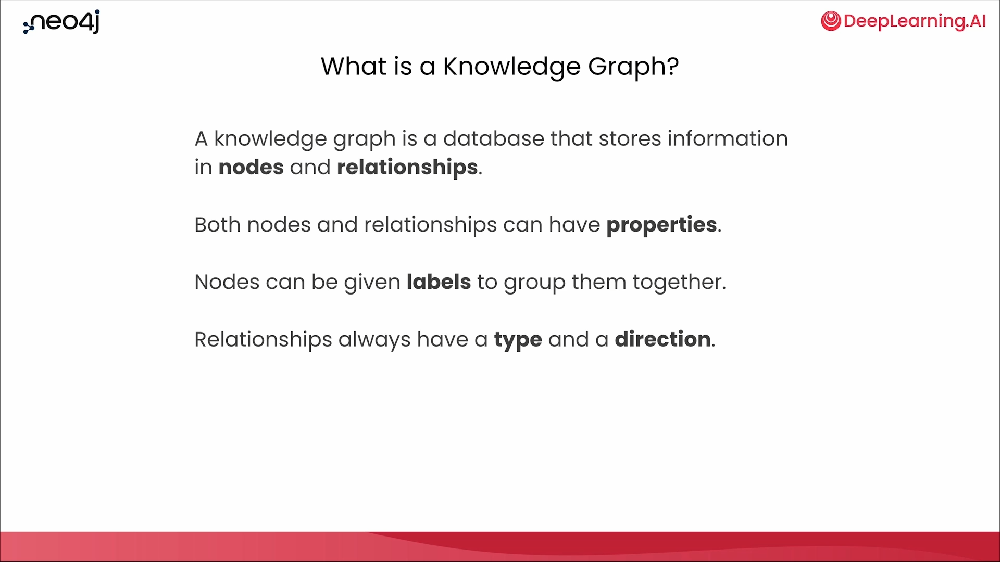

Relationships

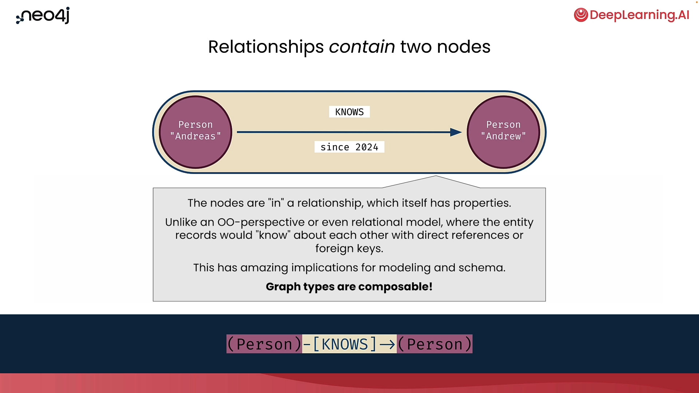

Nodes


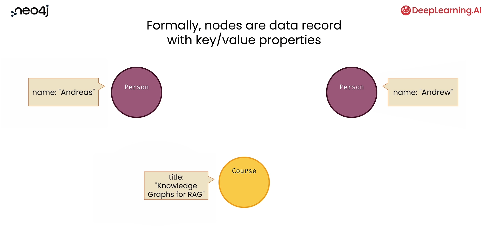

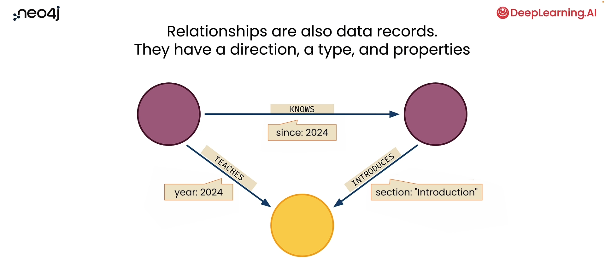

# Lesson 2: Querying Knowledge Graphs with Cypher


### Import packages and set up Neo4

```py
from dotenv import load_dotenv
import os

from langchain_community.graphs import Neo4jGraph

# Warning control
import warnings
warnings.filterwarnings("ignore")
load_dotenv('.env', override=True)
NEO4J_URI = os.getenv('NEO4J_URI')
NEO4J_USERNAME = os.getenv('NEO4J_USERNAME')
NEO4J_PASSWORD = os.getenv('NEO4J_PASSWORD')
NEO4J_DATABASE = os.getenv('NEO4J_DATABASE')
```


- Initialize a knowledge graph instance using LangChain's Neo4j integration

```py
kg = Neo4jGraph(
    url=NEO4J_URI, username=NEO4J_USERNAME, password=NEO4J_PASSWORD, database=NEO4J_DATABASE
)
```


### Querying the movie knowledge graph


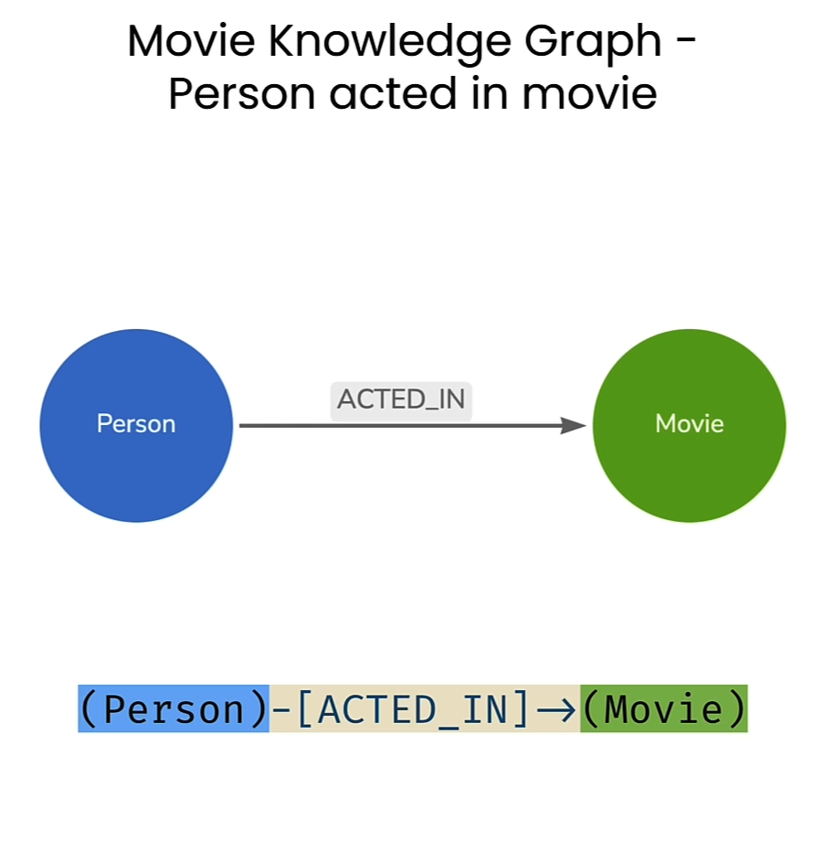

- Match all nodes in the graph


```py
cypher = """
  MATCH (n) 
  RETURN count(n)
  """
result = kg.query(cypher)
result
```

Output

```json
[{'count(n)': 171}
```


```py
cypher = """
  MATCH (n) 
  RETURN count(n) AS numberOfNodes
  """
result = kg.query(cypher)
result
```

Output

```py
[{'numberOfNodes': 171}]
```


```py
print(f"There are {result[0]['numberOfNodes']} nodes in this graph.")
```

Output

```py
There are 171 nodes in this graph.
```


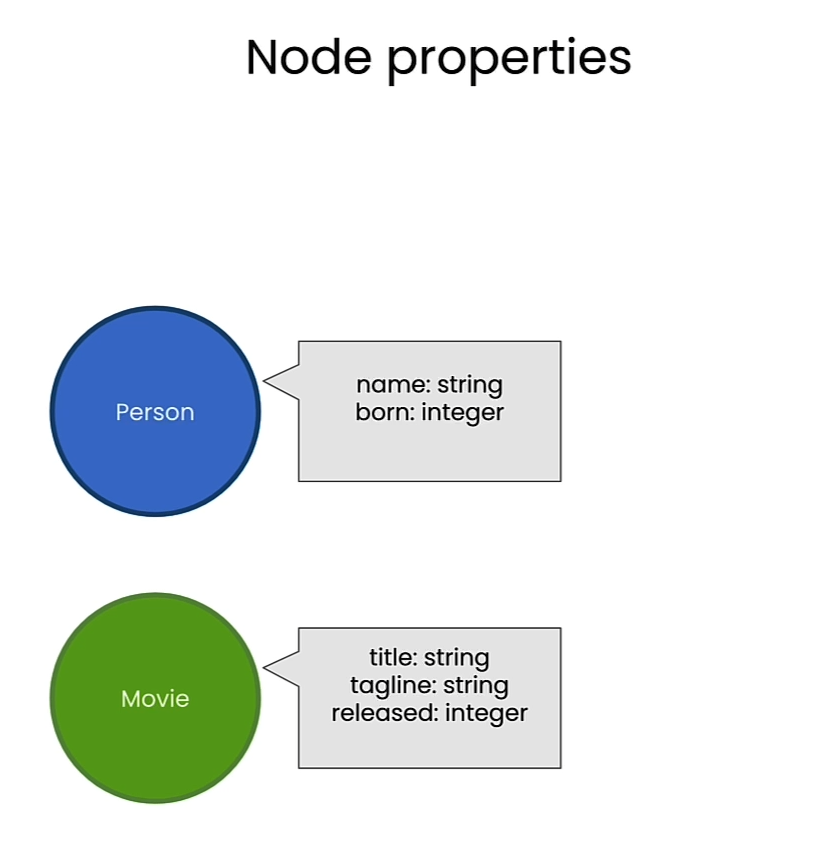

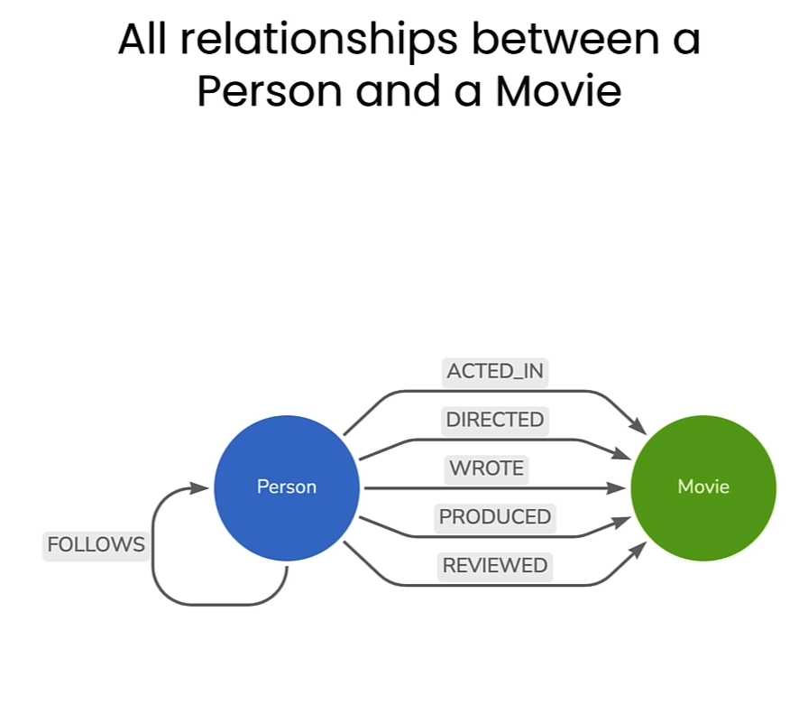

- Match only the `Movie` nodes by specifying the node label

```py
cypher = """
  MATCH (n:Movie) 
  RETURN count(n) AS numberOfMovies
  """
kg.query(cypher)
```

Output

```json
[{'numberOfMovies': 38}]
```

- Change the variable name in the node pattern match for improved readability


```py
cypher = """
  MATCH (m:Movie) 
  RETURN count(m) AS numberOfMovies
  """
kg.query(cypher)
```

Output

```py
[{'numberOfMovies': 38}]
```


- Match only the `Person` nodes

```py
cypher = """
  MATCH (people:Person) 
  RETURN count(people) AS numberOfPeople
  """
kg.query(cypher)
```

Output

```py
[{'numberOfPeople': 133}]
```

- Match a single person by specifying the value of the `name` property on the `Person` node

```py
cypher = """
  MATCH (tom:Person {name:"Tom Hanks"}) 
  RETURN tom
  """
kg.query(cypher)
```

Output

```py
[{'tom': {'born': 1956, 'name': 'Tom Hanks'}}]
```


- Match a single `Movie` by specifying the value of the `title` property

```py
cypher = """
  MATCH (cloudAtlas:Movie {title:"Cloud Atlas"}) 
  RETURN cloudAtlas
  """
kg.query(cypher)
```

Output

```py
[{'cloudAtlas': {'tagline': 'Everything is connected',
   'title': 'Cloud Atlas',
   'released': 2012}}]
```

- Return only the `released` property of the matched `Movie` node

```py
cypher = """
  MATCH (cloudAtlas:Movie {title:"Cloud Atlas"}) 
  RETURN cloudAtlas.released
  """
kg.query(cypher)
```


Output

```py
[{'cloudAtlas.released': 2012}]
```

- Return two properties


```py
cypher = """
  MATCH (cloudAtlas:Movie {title:"Cloud Atlas"}) 
  RETURN cloudAtlas.released, cloudAtlas.tagline
  """
kg.query(cypher)
```

Output

```py
[{'cloudAtlas.released': 2012,
  'cloudAtlas.tagline': 'Everything is connected'}]
```


### Cypher patterns with conditional matching


```py
cypher = """
  MATCH (nineties:Movie) 
  WHERE nineties.released >= 1990 
    AND nineties.released < 2000 
  RETURN nineties.title
  """
kg.query(cypher)
```

Output

```json
[{'nineties.title': 'The Matrix'},
 {'nineties.title': "The Devil's Advocate"},
 {'nineties.title': 'A Few Good Men'},
 {'nineties.title': 'As Good as It Gets'},
 {'nineties.title': 'What Dreams May Come'},
 {'nineties.title': 'Snow Falling on Cedars'},
 {'nineties.title': "You've Got Mail"},
 {'nineties.title': 'Sleepless in Seattle'},
 {'nineties.title': 'Joe Versus the Volcano'},
 {'nineties.title': 'When Harry Met Sally'},
 {'nineties.title': 'That Thing You Do'},
 {'nineties.title': 'The Birdcage'},
 {'nineties.title': 'Unforgiven'},
 {'nineties.title': 'Johnny Mnemonic'},
 {'nineties.title': 'The Green Mile'},
 {'nineties.title': 'Hoffa'},
 {'nineties.title': 'Apollo 13'},
 {'nineties.title': 'Twister'},
 {'nineties.title': 'Bicentennial Man'},
 {'nineties.title': 'A League of Their Own'}]
```


### Pattern matching with multiple nodes

```py
cypher = """
  MATCH (actor:Person)-[:ACTED_IN]->(movie:Movie) 
  RETURN actor.name, movie.title LIMIT 10
  """
kg.query(cypher)
```

Output

```json
[{'actor.name': 'Emil Eifrem', 'movie.title': 'The Matrix'},
 {'actor.name': 'Hugo Weaving', 'movie.title': 'The Matrix'},
 {'actor.name': 'Laurence Fishburne', 'movie.title': 'The Matrix'},
 {'actor.name': 'Carrie-Anne Moss', 'movie.title': 'The Matrix'},
 {'actor.name': 'Keanu Reeves', 'movie.title': 'The Matrix'},
 {'actor.name': 'Hugo Weaving', 'movie.title': 'The Matrix Reloaded'},
 {'actor.name': 'Laurence Fishburne', 'movie.title': 'The Matrix Reloaded'},
 {'actor.name': 'Carrie-Anne Moss', 'movie.title': 'The Matrix Reloaded'},
 {'actor.name': 'Keanu Reeves', 'movie.title': 'The Matrix Reloaded'},
 {'actor.name': 'Hugo Weaving', 'movie.title': 'The Matrix Revolutions'}]
```


```py
cypher = """
  MATCH (tom:Person {name: "Tom Hanks"})-[:ACTED_IN]->(tomHanksMovies:Movie) 
  RETURN tom.name,tomHanksMovies.title
  """
kg.query(cypher)
```

Output

```json
[{'tom.name': 'Tom Hanks', 'tomHanksMovies.title': 'Apollo 13'},
 {'tom.name': 'Tom Hanks', 'tomHanksMovies.title': "You've Got Mail"},
 {'tom.name': 'Tom Hanks', 'tomHanksMovies.title': 'A League of Their Own'},
 {'tom.name': 'Tom Hanks', 'tomHanksMovies.title': 'Joe Versus the Volcano'},
 {'tom.name': 'Tom Hanks', 'tomHanksMovies.title': 'That Thing You Do'},
 {'tom.name': 'Tom Hanks', 'tomHanksMovies.title': 'The Da Vinci Code'},
 {'tom.name': 'Tom Hanks', 'tomHanksMovies.title': 'Cloud Atlas'},
 {'tom.name': 'Tom Hanks', 'tomHanksMovies.title': 'Cast Away'},
 {'tom.name': 'Tom Hanks', 'tomHanksMovies.title': 'The Green Mile'},
 {'tom.name': 'Tom Hanks', 'tomHanksMovies.title': 'Sleepless in Seattle'},
 {'tom.name': 'Tom Hanks', 'tomHanksMovies.title': 'The Polar Express'},
 {'tom.name': 'Tom Hanks', 'tomHanksMovies.title': "Charlie Wilson's War"}]
```


```py
cypher = """
  MATCH (tom:Person {name:"Tom Hanks"})-[:ACTED_IN]->(m)<-[:ACTED_IN]-(coActors) 
  RETURN coActors.name, m.title
  """
kg.query(cypher)
```


Output

```json
[{'coActors.name': 'Ed Harris', 'm.title': 'Apollo 13'},
 {'coActors.name': 'Gary Sinise', 'm.title': 'Apollo 13'},
 {'coActors.name': 'Kevin Bacon', 'm.title': 'Apollo 13'},
 {'coActors.name': 'Bill Paxton', 'm.title': 'Apollo 13'},
 {'coActors.name': 'Parker Posey', 'm.title': "You've Got Mail"},
 {'coActors.name': 'Greg Kinnear', 'm.title': "You've Got Mail"},
 {'coActors.name': 'Meg Ryan', 'm.title': "You've Got Mail"},
 {'coActors.name': 'Steve Zahn', 'm.title': "You've Got Mail"},
 {'coActors.name': 'Dave Chappelle', 'm.title': "You've Got Mail"},
 {'coActors.name': 'Madonna', 'm.title': 'A League of Their Own'},
 {'coActors.name': "Rosie O'Donnell", 'm.title': 'A League of Their Own'},
 {'coActors.name': 'Geena Davis', 'm.title': 'A League of Their Own'},
 {'coActors.name': 'Bill Paxton', 'm.title': 'A League of Their Own'},
 {'coActors.name': 'Lori Petty', 'm.title': 'A League of Their Own'},
 {'coActors.name': 'Nathan Lane', 'm.title': 'Joe Versus the Volcano'},
 {'coActors.name': 'Meg Ryan', 'm.title': 'Joe Versus the Volcano'},
 {'coActors.name': 'Liv Tyler', 'm.title': 'That Thing You Do'},
 {'coActors.name': 'Charlize Theron', 'm.title': 'That Thing You Do'},
 {'coActors.name': 'Ian McKellen', 'm.title': 'The Da Vinci Code'},
 {'coActors.name': 'Audrey Tautou', 'm.title': 'The Da Vinci Code'},
 {'coActors.name': 'Paul Bettany', 'm.title': 'The Da Vinci Code'},
 {'coActors.name': 'Jim Broadbent', 'm.title': 'Cloud Atlas'},
 {'coActors.name': 'Halle Berry', 'm.title': 'Cloud Atlas'},
 {'coActors.name': 'Hugo Weaving', 'm.title': 'Cloud Atlas'},
 {'coActors.name': 'Helen Hunt', 'm.title': 'Cast Away'},
 {'coActors.name': 'Sam Rockwell', 'm.title': 'The Green Mile'},
 {'coActors.name': 'Bonnie Hunt', 'm.title': 'The Green Mile'},
 {'coActors.name': 'Patricia Clarkson', 'm.title': 'The Green Mile'},
 {'coActors.name': 'James Cromwell', 'm.title': 'The Green Mile'},
 {'coActors.name': 'Michael Clarke Duncan', 'm.title': 'The Green Mile'},
 {'coActors.name': 'David Morse', 'm.title': 'The Green Mile'},
 {'coActors.name': 'Gary Sinise', 'm.title': 'The Green Mile'},
 {'coActors.name': 'Meg Ryan', 'm.title': 'Sleepless in Seattle'},
 {'coActors.name': 'Victor Garber', 'm.title': 'Sleepless in Seattle'},
 {'coActors.name': 'Bill Pullman', 'm.title': 'Sleepless in Seattle'},
 {'coActors.name': 'Rita Wilson', 'm.title': 'Sleepless in Seattle'},
 {'coActors.name': "Rosie O'Donnell", 'm.title': 'Sleepless in Seattle'},
 {'coActors.name': 'Julia Roberts', 'm.title': "Charlie Wilson's War"},
 {'coActors.name': 'Philip Seymour Hoffman',
  'm.title': "Charlie Wilson's War"}]
```


### Delete data from the graph

```py
cypher = """
MATCH (emil:Person {name:"Emil Eifrem"})-[actedIn:ACTED_IN]->(movie:Movie)
RETURN emil.name, movie.title
"""
kg.query(cypher)
```

Output

```json
[{'emil.name': 'Emil Eifrem', 'movie.title': 'The Matrix'}]
```


```py
cypher = """
MATCH (emil:Person {name:"Emil Eifrem"})-[actedIn:ACTED_IN]->(movie:Movie)
DELETE actedIn
"""
kg.query(cypher)
```

Output

```py
[]
```


### Adding data to the graph


```py
cypher = """
CREATE (andreas:Person {name:"Andreas"})
RETURN andreas
"""

kg.query(cypher)
```

Output

```json
[{'andreas': {'name': 'Andreas'}}]
```


```py
cypher = """
MATCH (andreas:Person {name:"Andreas"}), (emil:Person {name:"Emil Eifrem"})
MERGE (andreas)-[hasRelationship:WORKS_WITH]->(emil)
RETURN andreas, hasRelationship, emil
"""
kg.query(cypher)
```

Output

```json
[{'andreas': {'name': 'Andreas'},
  'hasRelationship': ({'name': 'Andreas'},
   'WORKS_WITH',
   {'born': 1978, 'name': 'Emil Eifrem'}),
  'emil': {'born': 1978, 'name': 'Emil Eifrem'}}]
```


# Lesson 3: Preparing Text Data for RAG


### Import packages and set up Neo4j


```py
from dotenv import load_dotenv
import os

from langchain_community.graphs import Neo4jGraph

# Warning control
import warnings
warnings.filterwarnings("ignore")

# Load from environment
load_dotenv('.env', override=True)
NEO4J_URI = os.getenv('NEO4J_URI')
NEO4J_USERNAME = os.getenv('NEO4J_USERNAME')
NEO4J_PASSWORD = os.getenv('NEO4J_PASSWORD')
NEO4J_DATABASE = os.getenv('NEO4J_DATABASE')
OPENAI_API_KEY = os.getenv('OPENAI_API_KEY')

# Note the code below is unique to this course environment, and not a 
# standard part of Neo4j's integration with OpenAI. Remove if running 
# in your own environment.
OPENAI_ENDPOINT = os.getenv('OPENAI_BASE_URL') + '/embeddings'

# Connect to the knowledge graph instance using LangChain
kg = Neo4jGraph(
    url=NEO4J_URI, username=NEO4J_USERNAME, password=NEO4J_PASSWORD, database=NEO4J_DATABASE
)
```

### Create a vector index 

```py
kg.query("""
  CREATE VECTOR INDEX movie_tagline_embeddings IF NOT EXISTS
  FOR (m:Movie) ON (m.taglineEmbedding) 
  OPTIONS { indexConfig: {
    `vector.dimensions`: 1536,
    `vector.similarity_function`: 'cosine'
  }}"""
)

kg.query("""
  SHOW VECTOR INDEXES
  """
)
```

Output

```json
[{'id': 3,
  'name': 'movie_tagline_embeddings',
  'state': 'POPULATING',
  'populationPercent': 0.0,
  'type': 'VECTOR',
  'entityType': 'NODE',
  'labelsOrTypes': ['Movie'],
  'properties': ['taglineEmbedding'],
  'indexProvider': 'vector-1.0',
  'owningConstraint': None,
  'lastRead': None,
  'readCount': None}]
```


### Populate the vector index
- Calculate vector representation for each movie tagline using OpenAI
- Add vector to the `Movie` node as `taglineEmbedding` property


```py
kg.query("""
    MATCH (movie:Movie) WHERE movie.tagline IS NOT NULL
    WITH movie, genai.vector.encode(
        movie.tagline, 
        "OpenAI", 
        {
          token: $openAiApiKey,
          endpoint: $openAiEndpoint
        }) AS vector
    CALL db.create.setNodeVectorProperty(movie, "taglineEmbedding", vector)
    """, 
    params={"openAiApiKey":OPENAI_API_KEY, "openAiEndpoint": OPENAI_ENDPOINT} )
```


```py
result = kg.query("""
    MATCH (m:Movie) 
    WHERE m.tagline IS NOT NULL
    RETURN m.tagline, m.taglineEmbedding
    LIMIT 1
    """
)
result[0]['m.tagline']
result[0]['m.taglineEmbedding'][:10]
len(result[0]['m.taglineEmbedding'])
```

Output

```py
'Welcome to the Real World'

[0.017427725717425346,
 -0.005441250279545784,
 -0.0020343265496194363,
 -0.02555192820727825,
 -0.014335286803543568,
 0.016746340319514275,
 -0.01711324043571949,
 0.0005196377751417458,
 -0.025263650342822075,
 -0.029509201645851135]
 
 1536
```


### Similarity search
- Calculate embedding for question
- Identify matching movies based on similarity of question and `taglineEmbedding` vectors


```py
question = "What movies are about love?"

kg.query("""
    WITH genai.vector.encode(
        $question, 
        "OpenAI", 
        {
          token: $openAiApiKey,
          endpoint: $openAiEndpoint
        }) AS question_embedding
    CALL db.index.vector.queryNodes(
        'movie_tagline_embeddings', 
        $top_k, 
        question_embedding
        ) YIELD node AS movie, score
    RETURN movie.title, movie.tagline, score
    """, 
    params={"openAiApiKey":OPENAI_API_KEY,
            "openAiEndpoint": OPENAI_ENDPOINT,
            "question": question,
            "top_k": 5
            })
```

Output

```json
[{'movie.title': 'Joe Versus the Volcano',
  'movie.tagline': 'A story of love, lava and burning desire.',
  'score': 0.9062923789024353},
 {'movie.title': 'As Good as It Gets',
  'movie.tagline': 'A comedy from the heart that goes for the throat.',
  'score': 0.9022473096847534},
 {'movie.title': 'Snow Falling on Cedars',
  'movie.tagline': 'First loves last. Forever.',
  'score': 0.9013161659240723},
 {'movie.title': 'Sleepless in Seattle',
  'movie.tagline': 'What if someone you never met, someone you never saw, someone you never knew was the only someone for you?',
  'score': 0.8944727182388306},
 {'movie.title': 'When Harry Met Sally',
  'movie.tagline': 'Can two friends sleep together and still love each other in the morning?',
  'score': 0.8942465782165527}]
```


### Try for yourself: ask you own question!
- Change the question below and run the graph query to find different movies


```py
question = "What movies are about adventure?"

kg.query("""
    WITH genai.vector.encode(
        $question, 
        "OpenAI", 
        {
          token: $openAiApiKey,
          endpoint: $openAiEndpoint
        }) AS question_embedding
    CALL db.index.vector.queryNodes(
        'movie_tagline_embeddings', 
        $top_k, 
        question_embedding
        ) YIELD node AS movie, score
    RETURN movie.title, movie.tagline, score
    """, 
    params={"openAiApiKey":OPENAI_API_KEY,
            "openAiEndpoint": OPENAI_ENDPOINT,
            "question": question,
            "top_k": 5
            })
```

Output

```json
[{'movie.title': 'RescueDawn',
  'movie.tagline': "Based on the extraordinary true story of one man's fight for freedom",
  'score': 0.8998302221298218},
 {'movie.title': 'Cast Away',
  'movie.tagline': 'At the edge of the world, his journey begins.',
  'score': 0.8985401391983032},
 {'movie.title': 'Ninja Assassin',
  'movie.tagline': 'Prepare to enter a secret world of assassins',
  'score': 0.8879814147949219},
 {'movie.title': 'Joe Versus the Volcano',
  'movie.tagline': 'A story of love, lava and burning desire.',
  'score': 0.8870342969894409},
 {'movie.title': 'As Good as It Gets',
  'movie.tagline': 'A comedy from the heart that goes for the throat.',
  'score': 0.8855679035186768}]
```


# Lesson 4: Constructing a Knowledge Graph from Text Documents


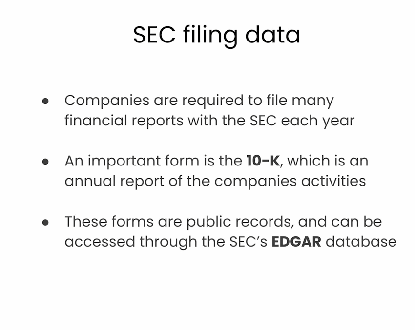

Data cleaning procedure


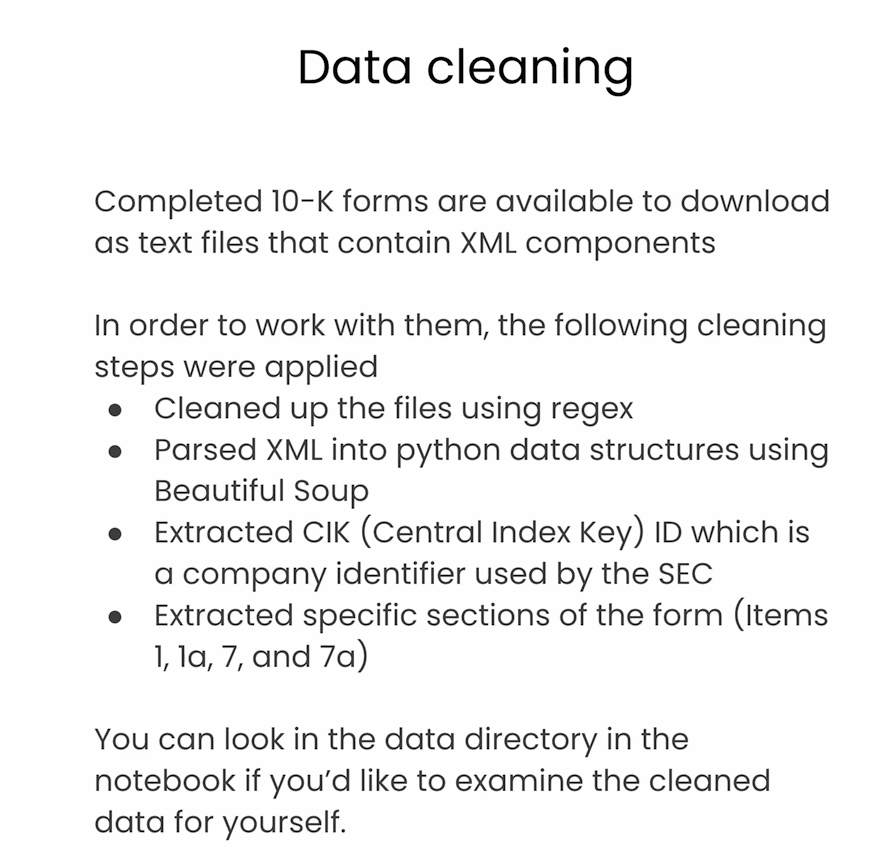


Main overview of lesson 4

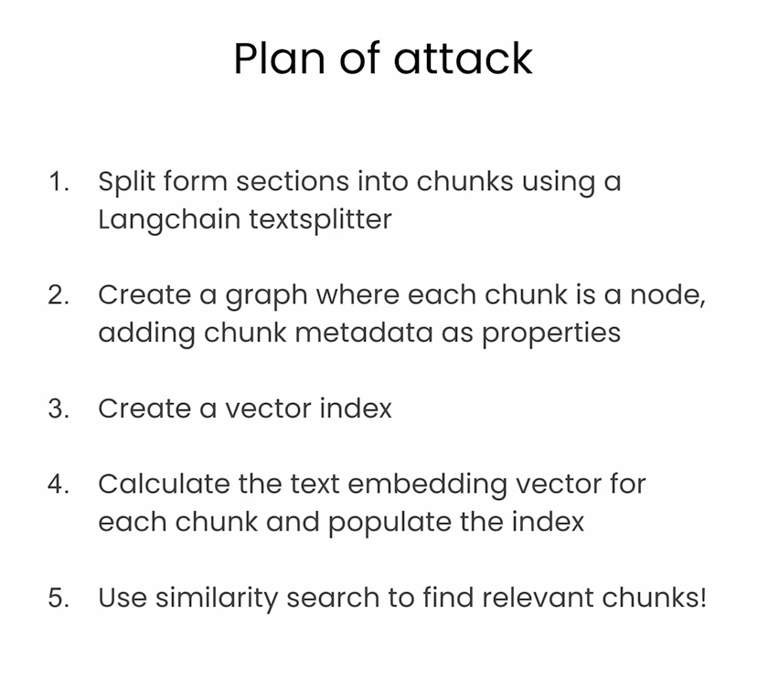


### Import packages and set up Neo4j


```py
from dotenv import load_dotenv
import os

# Common data processing
import json
import textwrap

# Langchain
from langchain_community.graphs import Neo4jGraph
from langchain_community.vectorstores import Neo4jVector
from langchain_openai import OpenAIEmbeddings
from langchain.text_splitter import RecursiveCharacterTextSplitter
from langchain.chains import RetrievalQAWithSourcesChain
from langchain_openai import ChatOpenAI


# Warning control
import warnings
warnings.filterwarnings("ignore")

# Load from environment
load_dotenv('.env', override=True)
NEO4J_URI = os.getenv('NEO4J_URI')
NEO4J_USERNAME = os.getenv('NEO4J_USERNAME')
NEO4J_PASSWORD = os.getenv('NEO4J_PASSWORD')
NEO4J_DATABASE = os.getenv('NEO4J_DATABASE') or 'neo4j'
OPENAI_API_KEY = os.getenv('OPENAI_API_KEY')
# Note the code below is unique to this course environment, and not a 
# standard part of Neo4j's integration with OpenAI. Remove if running 
# in your own environment.
OPENAI_ENDPOINT = os.getenv('OPENAI_BASE_URL') + '/embeddings'

# Global constants
VECTOR_INDEX_NAME = 'form_10k_chunks'
VECTOR_NODE_LABEL = 'Chunk'
VECTOR_SOURCE_PROPERTY = 'text'
VECTOR_EMBEDDING_PROPERTY = 'textEmbedding'
```


### Take a look at a Form 10-K json file

- Publicly traded companies are required to fill a form 10-K each year with the Securities and Exchange Commision (SEC)
- You can search these filings using the SEC's [EDGAR database](https://www.sec.gov/edgar/search/)
- For the next few lessons, you'll work with a single 10-K form for a company called [NetApp](https://www.netapp.com/)


```py
first_file_name = "./data/form10k/0000950170-23-027948.json"
first_file_as_object = json.load(open(first_file_name))
type(first_file_as_object)
for k,v in first_file_as_object.items():
    print(k, type(v))
```

Output

```py
item1 <class 'str'>
item1a <class 'str'>
item7 <class 'str'>
item7a <class 'str'>
cik <class 'str'>
cusip6 <class 'str'>
cusip <class 'list'>
names <class 'list'>
source <class 'str'>
```


```py
item1_text = first_file_as_object['item1']
item1_text[0:1500]
```

Output

```py
'>Item 1.  \nBusiness\n\n\nOverview\n\n\nNetApp, Inc. (NetApp, we, us or the Company) is a global cloud-led, data-centric software company. We were incorporated in 1992 and are headquartered in San Jose, California. Building on more than three decades of innovation, we give customers the freedom to manage applications and data across hybrid multicloud environments. Our portfolio of cloud services, and storage infrastructure, powered by intelligent data management software, enables applications to run faster, more reliably, and more securely, all at a lower cost.\n\n\nOur opportunity is defined by the durable megatrends of data-driven digital and cloud transformations. NetApp helps organizations meet the complexities created by rapid data and cloud growth, multi-cloud management, and the adoption of next-generation technologies, such as AI, Kubernetes, and modern databases. Our modern approach to hybrid, multicloud infrastructure and data management, which we term ‘evolved cloud’, provides customers the ability to leverage data across their entire estate with simplicity, security, and sustainability which increases our relevance and value to our customers.\n\n\nIn an evolved cloud state, the cloud is fully integrated into an organization’s architecture and operations. Data centers and clouds are seamlessly united and hybrid multicloud operations are simplified, with consistency and observability across environments. The key benefits NetApp brings to an organization’s hybrid multicloud envir'
```


### Split Form 10-K sections into chunks
- Set up text splitter using LangChain
- For now, split only the text from the "item 1" section 


```py
text_splitter = RecursiveCharacterTextSplitter(
    chunk_size = 2000,
    chunk_overlap  = 200,
    length_function = len,
    is_separator_regex = False,
)
item1_text_chunks = text_splitter.split_text(item1_text)
type(item1_text_chunks) # list
len(item1_text_chunks) # 254
item1_text_chunks[0]
```

Output

```py
'>Item 1.  \nBusiness\n\n\nOverview\n\n\nNetApp, Inc. (NetApp, we, us or the Company) is a global cloud-led, data-centric software company. We were incorporated in 1992 and are headquartered in San Jose, California. Building on more than three decades of innovation, we give customers the freedom to manage applications and data across hybrid multicloud environments. Our portfolio of cloud services, and storage infrastructure, powered by intelligent data management software, enables applications to run faster, more reliably, and more securely, all at a lower cost.\n\n\nOur opportunity is defined by the durable megatrends of data-driven digital and cloud transformations. NetApp helps organizations meet the complexities created by rapid data and cloud growth, multi-cloud management, and the adoption of next-generation technologies, such as AI, Kubernetes, and modern databases. Our modern approach to hybrid, multicloud infrastructure and data management, which we term ‘evolved cloud’, provides customers the ability to leverage data across their entire estate with simplicity, security, and sustainability which increases our relevance and value to our customers.\n\n\nIn an evolved cloud state, the cloud is fully integrated into an organization’s architecture and operations. Data centers and clouds are seamlessly united and hybrid multicloud operations are simplified, with consistency and observability across environments. The key benefits NetApp brings to an organization’s hybrid multicloud environment are:\n\n\n•\nOperational simplicity: NetApp’s use of open source, open architectures and APIs, microservices, and common capabilities and data services facilitate the creation of applications that can run anywhere.\n\n\n•\nFlexibility and consistency: NetApp makes moving data and applications between environments seamless through a common storage foundation across on-premises and multicloud environments.'
```

- Set up helper function to chunk all sections of the Form 10-K
- You'll limit the number of chunks in each section to 20 to speed things up


```py
def split_form10k_data_from_file(file):
    chunks_with_metadata = [] # use this to accumlate chunk records
    file_as_object = json.load(open(file)) # open the json file
    for item in ['item1','item1a','item7','item7a']: # pull these keys from the json
        print(f'Processing {item} from {file}') 
        item_text = file_as_object[item] # grab the text of the item
        item_text_chunks = text_splitter.split_text(item_text) # split the text into chunks
        chunk_seq_id = 0
        for chunk in item_text_chunks[:20]: # only take the first 20 chunks
            form_id = file[file.rindex('/') + 1:file.rindex('.')] # extract form id from file name
            # finally, construct a record with metadata and the chunk text
            chunks_with_metadata.append({
                'text': chunk, 
                # metadata from looping...
                'f10kItem': item,
                'chunkSeqId': chunk_seq_id,
                # constructed metadata...
                'formId': f'{form_id}', # pulled from the filename
                'chunkId': f'{form_id}-{item}-chunk{chunk_seq_id:04d}',
                # metadata from file...
                'names': file_as_object['names'],
                'cik': file_as_object['cik'],
                'cusip6': file_as_object['cusip6'],
                'source': file_as_object['source'],
            })
            chunk_seq_id += 1
        print(f'\tSplit into {chunk_seq_id} chunks')
    return chunks_with_metadata
```


```py
first_file_chunks = split_form10k_data_from_file(first_file_name)
```

Output

```py
Processing item1 from ./data/form10k/0000950170-23-027948.json
	Split into 20 chunks
Processing item1a from ./data/form10k/0000950170-23-027948.json
	Split into 1 chunks
Processing item7 from ./data/form10k/0000950170-23-027948.json
	Split into 1 chunks
Processing item7a from ./data/form10k/0000950170-23-027948.json
	Split into 1 chunks
```


```py
first_file_chunks[0]
```

Output

```py
{'text': '>Item 1.  \nBusiness\n\n\nOverview\n\n\nNetApp, Inc. (NetApp, we, us or the Company) is a global cloud-led, data-centric software company. We were incorporated in 1992 and are headquartered in San Jose, California. Building on more than three decades of innovation, we give customers the freedom to manage applications and data across hybrid multicloud environments. Our portfolio of cloud services, and storage infrastructure, powered by intelligent data management software, enables applications to run faster, more reliably, and more securely, all at a lower cost.\n\n\nOur opportunity is defined by the durable megatrends of data-driven digital and cloud transformations. NetApp helps organizations meet the complexities created by rapid data and cloud growth, multi-cloud management, and the adoption of next-generation technologies, such as AI, Kubernetes, and modern databases. Our modern approach to hybrid, multicloud infrastructure and data management, which we term ‘evolved cloud’, provides customers the ability to leverage data across their entire estate with simplicity, security, and sustainability which increases our relevance and value to our customers.\n\n\nIn an evolved cloud state, the cloud is fully integrated into an organization’s architecture and operations. Data centers and clouds are seamlessly united and hybrid multicloud operations are simplified, with consistency and observability across environments. The key benefits NetApp brings to an organization’s hybrid multicloud environment are:\n\n\n•\nOperational simplicity: NetApp’s use of open source, open architectures and APIs, microservices, and common capabilities and data services facilitate the creation of applications that can run anywhere.\n\n\n•\nFlexibility and consistency: NetApp makes moving data and applications between environments seamless through a common storage foundation across on-premises and multicloud environments.',
 'f10kItem': 'item1',
 'chunkSeqId': 0,
 'formId': '0000950170-23-027948',
 'chunkId': '0000950170-23-027948-item1-chunk0000',
 'names': ['Netapp Inc', 'NETAPP INC'],
 'cik': '1002047',
 'cusip6': '64110D',
 'source': 'https://www.sec.gov/Archives/edgar/data/1002047/000095017023027948/0000950170-23-027948-index.htm'}
```


### Create graph nodes using text chunks

```py
merge_chunk_node_query = """
MERGE(mergedChunk:Chunk {chunkId: $chunkParam.chunkId})
    ON CREATE SET 
        mergedChunk.names = $chunkParam.names,
        mergedChunk.formId = $chunkParam.formId, 
        mergedChunk.cik = $chunkParam.cik, 
        mergedChunk.cusip6 = $chunkParam.cusip6, 
        mergedChunk.source = $chunkParam.source, 
        mergedChunk.f10kItem = $chunkParam.f10kItem, 
        mergedChunk.chunkSeqId = $chunkParam.chunkSeqId, 
        mergedChunk.text = $chunkParam.text
RETURN mergedChunk
"""
```

- Set up connection to graph instance using LangChain


```py
kg = Neo4jGraph(
    url=NEO4J_URI, username=NEO4J_USERNAME, password=NEO4J_PASSWORD, database=NEO4J_DATABASE
)
```

- Create a single chunk node for now

```py
kg.query(merge_chunk_node_query, 
         params={'chunkParam':first_file_chunks[0]})
```

Output

```py
[{'mergedChunk': {'formId': '0000950170-23-027948',
   'f10kItem': 'item1',
   'names': ['Netapp Inc', 'NETAPP INC'],
   'cik': '1002047',
   'cusip6': '64110D',
   'source': 'https://www.sec.gov/Archives/edgar/data/1002047/000095017023027948/0000950170-23-027948-index.htm',
   'text': '>Item 1.  \nBusiness\n\n\nOverview\n\n\nNetApp, Inc. (NetApp, we, us or the Company) is a global cloud-led, data-centric software company. We were incorporated in 1992 and are headquartered in San Jose, California. Building on more than three decades of innovation, we give customers the freedom to manage applications and data across hybrid multicloud environments. Our portfolio of cloud services, and storage infrastructure, powered by intelligent data management software, enables applications to run faster, more reliably, and more securely, all at a lower cost.\n\n\nOur opportunity is defined by the durable megatrends of data-driven digital and cloud transformations. NetApp helps organizations meet the complexities created by rapid data and cloud growth, multi-cloud management, and the adoption of next-generation technologies, such as AI, Kubernetes, and modern databases. Our modern approach to hybrid, multicloud infrastructure and data management, which we term ‘evolved cloud’, provides customers the ability to leverage data across their entire estate with simplicity, security, and sustainability which increases our relevance and value to our customers.\n\n\nIn an evolved cloud state, the cloud is fully integrated into an organization’s architecture and operations. Data centers and clouds are seamlessly united and hybrid multicloud operations are simplified, with consistency and observability across environments. The key benefits NetApp brings to an organization’s hybrid multicloud environment are:\n\n\n•\nOperational simplicity: NetApp’s use of open source, open architectures and APIs, microservices, and common capabilities and data services facilitate the creation of applications that can run anywhere.\n\n\n•\nFlexibility and consistency: NetApp makes moving data and applications between environments seamless through a common storage foundation across on-premises and multicloud environments.',
   'chunkId': '0000950170-23-027948-item1-chunk0000',
   'chunkSeqId': 0}}]
```

- Create a uniqueness constraint to avoid duplicate chunks


```py
kg.query("""
CREATE CONSTRAINT unique_chunk IF NOT EXISTS 
    FOR (c:Chunk) REQUIRE c.chunkId IS UNIQUE
""")
kg.query("SHOW INDEXES")
```

Output

```py
[{'id': 1,
  'name': 'index_343aff4e',
  'state': 'ONLINE',
  'populationPercent': 100.0,
  'type': 'LOOKUP',
  'entityType': 'NODE',
  'labelsOrTypes': None,
  'properties': None,
  'indexProvider': 'token-lookup-1.0',
  'owningConstraint': None,
  'lastRead': None,
  'readCount': 0},
 {'id': 2,
  'name': 'index_f7700477',
  'state': 'ONLINE',
  'populationPercent': 100.0,
  'type': 'LOOKUP',
  'entityType': 'RELATIONSHIP',
  'labelsOrTypes': None,
  'properties': None,
  'indexProvider': 'token-lookup-1.0',
  'owningConstraint': None,
  'lastRead': None,
  'readCount': 0},
 {'id': 3,
  'name': 'unique_chunk',
  'state': 'ONLINE',
  'populationPercent': 100.0,
  'type': 'RANGE',
  'entityType': 'NODE',
  'labelsOrTypes': ['Chunk'],
  'properties': ['chunkId'],
  'indexProvider': 'range-1.0',
  'owningConstraint': 'unique_chunk',
  'lastRead': None,
  'readCount': None}]
```

- Loop through and create nodes for all chunks
- Should create 23 nodes because you set a limit of 20 chunks in the text splitting function above


```py
node_count = 0
for chunk in first_file_chunks:
    print(f"Creating `:Chunk` node for chunk ID {chunk['chunkId']}")
    kg.query(merge_chunk_node_query, 
            params={
                'chunkParam': chunk
            })
    node_count += 1
print(f"Created {node_count} nodes")
```

Output

```py
Creating `:Chunk` node for chunk ID 0000950170-23-027948-item1-chunk0000
Creating `:Chunk` node for chunk ID 0000950170-23-027948-item1-chunk0001
Creating `:Chunk` node for chunk ID 0000950170-23-027948-item1-chunk0002
Creating `:Chunk` node for chunk ID 0000950170-23-027948-item1-chunk0003
Creating `:Chunk` node for chunk ID 0000950170-23-027948-item1-chunk0004
Creating `:Chunk` node for chunk ID 0000950170-23-027948-item1-chunk0005
Creating `:Chunk` node for chunk ID 0000950170-23-027948-item1-chunk0006
Creating `:Chunk` node for chunk ID 0000950170-23-027948-item1-chunk0007
Creating `:Chunk` node for chunk ID 0000950170-23-027948-item1-chunk0008
Creating `:Chunk` node for chunk ID 0000950170-23-027948-item1-chunk0009
Creating `:Chunk` node for chunk ID 0000950170-23-027948-item1-chunk0010
Creating `:Chunk` node for chunk ID 0000950170-23-027948-item1-chunk0011
Creating `:Chunk` node for chunk ID 0000950170-23-027948-item1-chunk0012
Creating `:Chunk` node for chunk ID 0000950170-23-027948-item1-chunk0013
Creating `:Chunk` node for chunk ID 0000950170-23-027948-item1-chunk0014
Creating `:Chunk` node for chunk ID 0000950170-23-027948-item1-chunk0015
Creating `:Chunk` node for chunk ID 0000950170-23-027948-item1-chunk0016
Creating `:Chunk` node for chunk ID 0000950170-23-027948-item1-chunk0017
Creating `:Chunk` node for chunk ID 0000950170-23-027948-item1-chunk0018
Creating `:Chunk` node for chunk ID 0000950170-23-027948-item1-chunk0019
Creating `:Chunk` node for chunk ID 0000950170-23-027948-item1a-chunk0000
Creating `:Chunk` node for chunk ID 0000950170-23-027948-item7-chunk0000
Creating `:Chunk` node for chunk ID 0000950170-23-027948-item7a-chunk0000
Created 23 nodes
```


```py
kg.query("""
         MATCH (n)
         RETURN count(n) as nodeCount
         """)
# [{'nodeCount': 23}]
```

### Create a vector index


```py
kg.query("""
         CREATE VECTOR INDEX `form_10k_chunks` IF NOT EXISTS
          FOR (c:Chunk) ON (c.textEmbedding) 
          OPTIONS { indexConfig: {
            `vector.dimensions`: 1536,
            `vector.similarity_function`: 'cosine'    
         }}
""")

kg.query("SHOW INDEXES")
```

Output

```py
[{'id': 5,
  'name': 'form_10k_chunks',
  'state': 'POPULATING',
  'populationPercent': 0.0,
  'type': 'VECTOR',
  'entityType': 'NODE',
  'labelsOrTypes': ['Chunk'],
  'properties': ['textEmbedding'],
  'indexProvider': 'vector-1.0',
  'owningConstraint': None,
  'lastRead': None,
  'readCount': None},
 {'id': 1,
  'name': 'index_343aff4e',
  'state': 'ONLINE',
  'populationPercent': 100.0,
  'type': 'LOOKUP',
  'entityType': 'NODE',
  'labelsOrTypes': None,
  'properties': None,
  'indexProvider': 'token-lookup-1.0',
  'owningConstraint': None,
  'lastRead': None,
  'readCount': 0},
 {'id': 2,
  'name': 'index_f7700477',
  'state': 'ONLINE',
  'populationPercent': 100.0,
  'type': 'LOOKUP',
  'entityType': 'RELATIONSHIP',
  'labelsOrTypes': None,
  'properties': None,
  'indexProvider': 'token-lookup-1.0',
  'owningConstraint': None,
  'lastRead': None,
  'readCount': 0},
 {'id': 3,
  'name': 'unique_chunk',
  'state': 'ONLINE',
  'populationPercent': 100.0,
  'type': 'RANGE',
  'entityType': 'NODE',
  'labelsOrTypes': ['Chunk'],
  'properties': ['chunkId'],
  'indexProvider': 'range-1.0',
  'owningConstraint': 'unique_chunk',
  'lastRead': None,
  'readCount': None}]
```


### Calculate embedding vectors for chunks and populate index
- This query calculates the embedding vector and stores it as a property called `textEmbedding` on each `Chunk` node.


```py
kg.query("""
    MATCH (chunk:Chunk) WHERE chunk.textEmbedding IS NULL
    WITH chunk, genai.vector.encode(
      chunk.text, 
      "OpenAI", 
      {
        token: $openAiApiKey, 
        endpoint: $openAiEndpoint
      }) AS vector
    CALL db.create.setNodeVectorProperty(chunk, "textEmbedding", vector)
    """, 
    params={"openAiApiKey":OPENAI_API_KEY, "openAiEndpoint": OPENAI_ENDPOINT} )
```


```py
kg.refresh_schema()
print(kg.schema)
```

Output

```py
Node properties are the following:
Chunk {textEmbedding: LIST, f10kItem: STRING, chunkSeqId: INTEGER, text: STRING, cik: STRING, cusip6: STRING, names: LIST, formId: STRING, source: STRING, chunkId: STRING}
Relationship properties are the following:

The relationships are the following:
```

### Use similarity search to find relevant chunks

- Setup a help function to perform similarity search using the vector index


```py
def neo4j_vector_search(question):
  """Search for similar nodes using the Neo4j vector index"""
  vector_search_query = """
    WITH genai.vector.encode(
      $question, 
      "OpenAI", 
      {
        token: $openAiApiKey,
        endpoint: $openAiEndpoint
      }) AS question_embedding
    CALL db.index.vector.queryNodes($index_name, $top_k, question_embedding) yield node, score
    RETURN score, node.text AS text
  """
  similar = kg.query(vector_search_query, 
                     params={
                      'question': question, 
                      'openAiApiKey':OPENAI_API_KEY,
                      'openAiEndpoint': OPENAI_ENDPOINT,
                      'index_name':VECTOR_INDEX_NAME, 
                      'top_k': 10})
  return similar
```

- Ask a question!

```py
search_results = neo4j_vector_search(
    'In a single sentence, tell me about Netapp.'
)
search_results[0]
```

Output

```py
{'score': 0.9358431696891785,
 'text': '>Item 1.  \nBusiness\n\n\nOverview\n\n\nNetApp, Inc. (NetApp, we, us or the Company) is a global cloud-led, data-centric software company. We were incorporated in 1992 and are headquartered in San Jose, California. Building on more than three decades of innovation, we give customers the freedom to manage applications and data across hybrid multicloud environments. Our portfolio of cloud services, and storage infrastructure, powered by intelligent data management software, enables applications to run faster, more reliably, and more securely, all at a lower cost.\n\n\nOur opportunity is defined by the durable megatrends of data-driven digital and cloud transformations. NetApp helps organizations meet the complexities created by rapid data and cloud growth, multi-cloud management, and the adoption of next-generation technologies, such as AI, Kubernetes, and modern databases. Our modern approach to hybrid, multicloud infrastructure and data management, which we term ‘evolved cloud’, provides customers the ability to leverage data across their entire estate with simplicity, security, and sustainability which increases our relevance and value to our customers.\n\n\nIn an evolved cloud state, the cloud is fully integrated into an organization’s architecture and operations. Data centers and clouds are seamlessly united and hybrid multicloud operations are simplified, with consistency and observability across environments. The key benefits NetApp brings to an organization’s hybrid multicloud environment are:\n\n\n•\nOperational simplicity: NetApp’s use of open source, open architectures and APIs, microservices, and common capabilities and data services facilitate the creation of applications that can run anywhere.\n\n\n•\nFlexibility and consistency: NetApp makes moving data and applications between environments seamless through a common storage foundation across on-premises and multicloud environments.'}
```

### Set up a LangChain RAG workflow to chat with the form


```py
neo4j_vector_store = Neo4jVector.from_existing_graph(
    embedding=OpenAIEmbeddings(),
    url=NEO4J_URI,
    username=NEO4J_USERNAME,
    password=NEO4J_PASSWORD,
    index_name=VECTOR_INDEX_NAME,
    node_label=VECTOR_NODE_LABEL,
    text_node_properties=[VECTOR_SOURCE_PROPERTY],
    embedding_node_property=VECTOR_EMBEDDING_PROPERTY,
)

retriever = neo4j_vector_store.as_retriever()
```

- Set up a RetrievalQAWithSourcesChain to carry out question answering
- You can check out the LangChain documentation for this chain [here](https://api.python.langchain.com/en/latest/chains/langchain.chains.qa_with_sources.retrieval.RetrievalQAWithSourcesChain.html)


```py
chain = RetrievalQAWithSourcesChain.from_chain_type(
    ChatOpenAI(temperature=0), 
    chain_type="stuff", 
    retriever=retriever
)

def prettychain(question: str) -> str:
    """Pretty print the chain's response to a question"""
    response = chain({"question": question},
        return_only_outputs=True,)
    print(textwrap.fill(response['answer'], 60))
```


```
question = "What is Netapp's primary business?"
prettychain(question)
```

Output

```py
NetApp's primary business is enterprise storage and data
management, cloud storage, and cloud operations.
```


```py
prettychain("Where is Netapp headquartered?")
```

Output

```py
Netapp is headquartered in San Jose, California.
```


```py
prettychain("""
    Tell me about Netapp. 
    Limit your answer to a single sentence.
""")
```

Output

```py
NetApp is a global cloud-led, data-centric software company
that provides customers with the freedom to manage
applications and data across hybrid multicloud environments.
```


```py
prettychain("""
    Tell me about Apple. 
    Limit your answer to a single sentence.
    If you are unsure about the answer, say you don't know.
""")
```

Output

```py
I don't know.
```


# Lesson 5: Adding Relationships to the SEC Knowledge Graph

### Import packages and set up Neo4j

```py
from dotenv import load_dotenv
import os

# Common data processing
import textwrap

# Langchain
from langchain_community.graphs import Neo4jGraph
from langchain_community.vectorstores import Neo4jVector
from langchain.text_splitter import RecursiveCharacterTextSplitter
from langchain.chains import RetrievalQAWithSourcesChain
from langchain_openai import ChatOpenAI
from langchain_openai import OpenAIEmbeddings

# Warning control
import warnings
warnings.filterwarnings("ignore")

# Load from environment
load_dotenv('.env', override=True)
NEO4J_URI = os.getenv('NEO4J_URI')
NEO4J_USERNAME = os.getenv('NEO4J_USERNAME')
NEO4J_PASSWORD = os.getenv('NEO4J_PASSWORD')
NEO4J_DATABASE = os.getenv('NEO4J_DATABASE') or 'neo4j'

# Global constants
VECTOR_INDEX_NAME = 'form_10k_chunks'
VECTOR_NODE_LABEL = 'Chunk'
VECTOR_SOURCE_PROPERTY = 'text'
VECTOR_EMBEDDING_PROPERTY = 'textEmbedding'


kg = Neo4jGraph(
    url=NEO4J_URI, username=NEO4J_USERNAME, password=NEO4J_PASSWORD, database=NEO4J_DATABASE
)
```


### Create a Form 10-K node
- Create a node to represent the entire Form 10-K
- Populate with metadata taken from a single chunk of the form

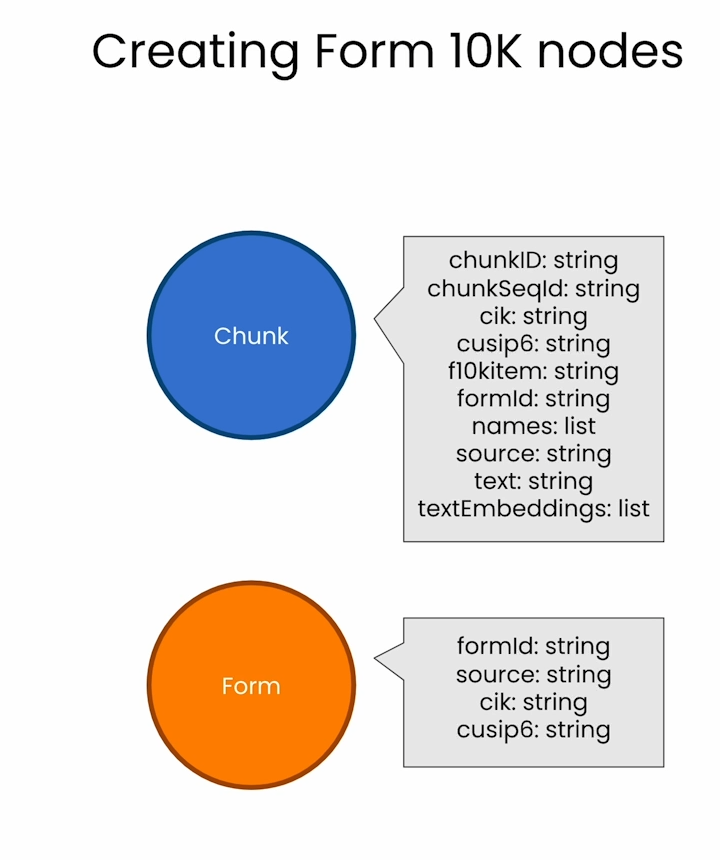


```py
cypher = """
  MATCH (anyChunk:Chunk) 
  WITH anyChunk LIMIT 1
  RETURN anyChunk { .names, .source, .formId, .cik, .cusip6 } as formInfo
"""
form_info_list = kg.query(cypher)

form_info_list

```

Output

```py
[{'formInfo': {'cik': '1002047',
   'source': 'https://www.sec.gov/Archives/edgar/data/1002047/000095017023027948/0000950170-23-027948-index.htm',
   'formId': '0000950170-23-027948',
   'names': ['Netapp Inc', 'NETAPP INC'],
   'cusip6': '64110D'}}]
```


```
form_info = form_info_list[0]['formInfo']
```

Output

```py
{'cik': '1002047',
 'source': 'https://www.sec.gov/Archives/edgar/data/1002047/000095017023027948/0000950170-23-027948-index.htm',
 'formId': '0000950170-23-027948',
 'names': ['Netapp Inc', 'NETAPP INC'],
 'cusip6': '64110D'}
```


```py
cypher = """
    MERGE (f:Form {formId: $formInfoParam.formId })
      ON CREATE 
        SET f.names = $formInfoParam.names
        SET f.source = $formInfoParam.source
        SET f.cik = $formInfoParam.cik
        SET f.cusip6 = $formInfoParam.cusip6
"""

kg.query(cypher, params={'formInfoParam': form_info})
kg.query("MATCH (f:Form) RETURN count(f) as formCount") # [{'formCount': 1}]
```


### Create a linked list of Chunk nodes for each section


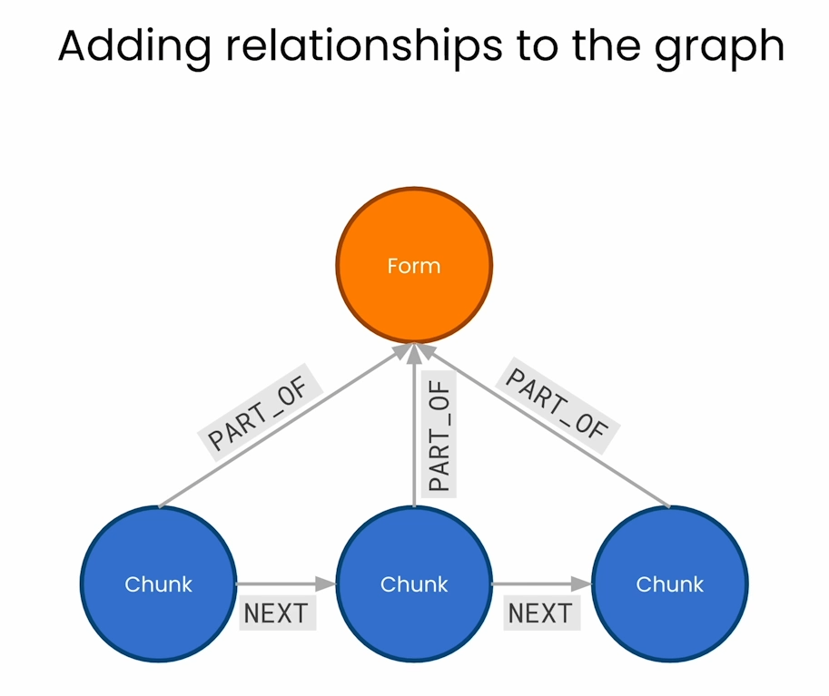


- Start by identifying chunks from the same section


```py\
cypher = """
  MATCH (from_same_form:Chunk)
    WHERE from_same_form.formId = $formIdParam
  RETURN from_same_form {.formId, .f10kItem, .chunkId, .chunkSeqId } as chunkInfo
    LIMIT 10
"""

kg.query(cypher, params={'formIdParam': form_info['formId']})
```

Output

```py
[{'chunkInfo': {'formId': '0000950170-23-027948',
   'f10kItem': 'item1',
   'chunkId': '0000950170-23-027948-item1-chunk0000',
   'chunkSeqId': 0}},
 {'chunkInfo': {'formId': '0000950170-23-027948',
   'f10kItem': 'item1',
   'chunkId': '0000950170-23-027948-item1-chunk0001',
   'chunkSeqId': 1}},
 {'chunkInfo': {'formId': '0000950170-23-027948',
   'f10kItem': 'item1',
   'chunkId': '0000950170-23-027948-item1-chunk0002',
   'chunkSeqId': 2}},
 {'chunkInfo': {'formId': '0000950170-23-027948',
   'f10kItem': 'item1',
   'chunkId': '0000950170-23-027948-item1-chunk0003',
   'chunkSeqId': 3}},
 {'chunkInfo': {'formId': '0000950170-23-027948',
   'f10kItem': 'item1',
   'chunkId': '0000950170-23-027948-item1-chunk0004',
   'chunkSeqId': 4}},
 {'chunkInfo': {'formId': '0000950170-23-027948',
   'f10kItem': 'item1',
   'chunkId': '0000950170-23-027948-item1-chunk0005',
   'chunkSeqId': 5}},
 {'chunkInfo': {'formId': '0000950170-23-027948',
   'f10kItem': 'item1',
   'chunkId': '0000950170-23-027948-item1-chunk0006',
   'chunkSeqId': 6}},
 {'chunkInfo': {'formId': '0000950170-23-027948',
   'f10kItem': 'item1',
   'chunkId': '0000950170-23-027948-item1-chunk0007',
   'chunkSeqId': 7}},
 {'chunkInfo': {'formId': '0000950170-23-027948',
   'f10kItem': 'item1',
   'chunkId': '0000950170-23-027948-item1-chunk0008',
   'chunkSeqId': 8}},
 {'chunkInfo': {'formId': '0000950170-23-027948',
   'f10kItem': 'item1',
   'chunkId': '0000950170-23-027948-item1-chunk0009',
   'chunkSeqId': 9}}]
```

- Order chunks by their sequence ID

```py
cypher = """
  MATCH (from_same_form:Chunk)
    WHERE from_same_form.formId = $formIdParam
  RETURN from_same_form {.formId, .f10kItem, .chunkId, .chunkSeqId } as chunkInfo 
    ORDER BY from_same_form.chunkSeqId ASC
    LIMIT 10
"""

kg.query(cypher, params={'formIdParam': form_info['formId']})
```

Output

```py
[{'chunkInfo': {'formId': '0000950170-23-027948',
   'f10kItem': 'item7a',
   'chunkId': '0000950170-23-027948-item7a-chunk0000',
   'chunkSeqId': 0}},
 {'chunkInfo': {'formId': '0000950170-23-027948',
   'f10kItem': 'item7',
   'chunkId': '0000950170-23-027948-item7-chunk0000',
   'chunkSeqId': 0}},
 {'chunkInfo': {'formId': '0000950170-23-027948',
   'f10kItem': 'item1a',
   'chunkId': '0000950170-23-027948-item1a-chunk0000',
   'chunkSeqId': 0}},
 {'chunkInfo': {'formId': '0000950170-23-027948',
   'f10kItem': 'item1',
   'chunkId': '0000950170-23-027948-item1-chunk0000',
   'chunkSeqId': 0}},
 {'chunkInfo': {'formId': '0000950170-23-027948',
   'f10kItem': 'item1',
   'chunkId': '0000950170-23-027948-item1-chunk0001',
   'chunkSeqId': 1}},
 {'chunkInfo': {'formId': '0000950170-23-027948',
   'f10kItem': 'item1',
   'chunkId': '0000950170-23-027948-item1-chunk0002',
   'chunkSeqId': 2}},
 {'chunkInfo': {'formId': '0000950170-23-027948',
   'f10kItem': 'item1',
   'chunkId': '0000950170-23-027948-item1-chunk0003',
   'chunkSeqId': 3}},
 {'chunkInfo': {'formId': '0000950170-23-027948',
   'f10kItem': 'item1',
   'chunkId': '0000950170-23-027948-item1-chunk0004',
   'chunkSeqId': 4}},
 {'chunkInfo': {'formId': '0000950170-23-027948',
   'f10kItem': 'item1',
   'chunkId': '0000950170-23-027948-item1-chunk0005',
   'chunkSeqId': 5}},
 {'chunkInfo': {'formId': '0000950170-23-027948',
   'f10kItem': 'item1',
   'chunkId': '0000950170-23-027948-item1-chunk0006',
   'chunkSeqId': 6}}]
```

- Limit chunks to just the "Item 1" section, the organize in ascending order


```py
cypher = """
  MATCH (from_same_section:Chunk)
  WHERE from_same_section.formId = $formIdParam
    AND from_same_section.f10kItem = $f10kItemParam // NEW!!!
  RETURN from_same_section { .formId, .f10kItem, .chunkId, .chunkSeqId } 
    ORDER BY from_same_section.chunkSeqId ASC
    LIMIT 10
"""

kg.query(cypher, params={'formIdParam': form_info['formId'], 
                         'f10kItemParam': 'item1'})

```

Output

```py
[{'from_same_section': {'formId': '0000950170-23-027948',
   'f10kItem': 'item1',
   'chunkId': '0000950170-23-027948-item1-chunk0000',
   'chunkSeqId': 0}},
 {'from_same_section': {'formId': '0000950170-23-027948',
   'f10kItem': 'item1',
   'chunkId': '0000950170-23-027948-item1-chunk0001',
   'chunkSeqId': 1}},
 {'from_same_section': {'formId': '0000950170-23-027948',
   'f10kItem': 'item1',
   'chunkId': '0000950170-23-027948-item1-chunk0002',
   'chunkSeqId': 2}},
 {'from_same_section': {'formId': '0000950170-23-027948',
   'f10kItem': 'item1',
   'chunkId': '0000950170-23-027948-item1-chunk0003',
   'chunkSeqId': 3}},
 {'from_same_section': {'formId': '0000950170-23-027948',
   'f10kItem': 'item1',
   'chunkId': '0000950170-23-027948-item1-chunk0004',
   'chunkSeqId': 4}},
 {'from_same_section': {'formId': '0000950170-23-027948',
   'f10kItem': 'item1',
   'chunkId': '0000950170-23-027948-item1-chunk0005',
   'chunkSeqId': 5}},
 {'from_same_section': {'formId': '0000950170-23-027948',
   'f10kItem': 'item1',
   'chunkId': '0000950170-23-027948-item1-chunk0006',
   'chunkSeqId': 6}},
 {'from_same_section': {'formId': '0000950170-23-027948',
   'f10kItem': 'item1',
   'chunkId': '0000950170-23-027948-item1-chunk0007',
   'chunkSeqId': 7}},
 {'from_same_section': {'formId': '0000950170-23-027948',
   'f10kItem': 'item1',
   'chunkId': '0000950170-23-027948-item1-chunk0008',
   'chunkSeqId': 8}},
 {'from_same_section': {'formId': '0000950170-23-027948',
   'f10kItem': 'item1',
   'chunkId': '0000950170-23-027948-item1-chunk0009',
   'chunkSeqId': 9}}]
```

- Collect ordered chunks into a list


```py
cypher = """
  MATCH (from_same_section:Chunk)
  WHERE from_same_section.formId = $formIdParam
    AND from_same_section.f10kItem = $f10kItemParam
  WITH from_same_section { .formId, .f10kItem, .chunkId, .chunkSeqId } 
    ORDER BY from_same_section.chunkSeqId ASC
    LIMIT 10
  RETURN collect(from_same_section) // NEW!!!
"""

kg.query(cypher, params={'formIdParam': form_info['formId'], 
                         'f10kItemParam': 'item1'})

```

Output

```py
[{'collect(from_same_section)': [{'formId': '0000950170-23-027948',
    'f10kItem': 'item1',
    'chunkId': '0000950170-23-027948-item1-chunk0000',
    'chunkSeqId': 0},
   {'formId': '0000950170-23-027948',
    'f10kItem': 'item1',
    'chunkId': '0000950170-23-027948-item1-chunk0001',
    'chunkSeqId': 1},
   {'formId': '0000950170-23-027948',
    'f10kItem': 'item1',
    'chunkId': '0000950170-23-027948-item1-chunk0002',
    'chunkSeqId': 2},
   {'formId': '0000950170-23-027948',
    'f10kItem': 'item1',
    'chunkId': '0000950170-23-027948-item1-chunk0003',
    'chunkSeqId': 3},
   {'formId': '0000950170-23-027948',
    'f10kItem': 'item1',
    'chunkId': '0000950170-23-027948-item1-chunk0004',
    'chunkSeqId': 4},
   {'formId': '0000950170-23-027948',
    'f10kItem': 'item1',
    'chunkId': '0000950170-23-027948-item1-chunk0005',
    'chunkSeqId': 5},
   {'formId': '0000950170-23-027948',
    'f10kItem': 'item1',
    'chunkId': '0000950170-23-027948-item1-chunk0006',
    'chunkSeqId': 6},
   {'formId': '0000950170-23-027948',
    'f10kItem': 'item1',
    'chunkId': '0000950170-23-027948-item1-chunk0007',
    'chunkSeqId': 7},
   {'formId': '0000950170-23-027948',
    'f10kItem': 'item1',
    'chunkId': '0000950170-23-027948-item1-chunk0008',
    'chunkSeqId': 8},
   {'formId': '0000950170-23-027948',
    'f10kItem': 'item1',
    'chunkId': '0000950170-23-027948-item1-chunk0009',
    'chunkSeqId': 9}]}]
```

### Add a NEXT relationship between subsequent chunks
- Use the `apoc.nodes.link` function from Neo4j to link ordered list of `Chunk` nodes with a `NEXT` relationship
- Do this for just the "Item 1" section to start


```py
cypher = """
  MATCH (from_same_section:Chunk)
  WHERE from_same_section.formId = $formIdParam
    AND from_same_section.f10kItem = $f10kItemParam
  WITH from_same_section
    ORDER BY from_same_section.chunkSeqId ASC
  WITH collect(from_same_section) as section_chunk_list
    CALL apoc.nodes.link(
        section_chunk_list, 
        "NEXT", 
        {avoidDuplicates: true}
    )  // NEW!!!
  RETURN size(section_chunk_list)
"""

kg.query(cypher, params={'formIdParam': form_info['formId'], 
                         'f10kItemParam': 'item1'})
# Output: [{'size(section_chunk_list)': 20}]
```


```py
kg.refresh_schema()
print(kg.schema)
```

Output

```py
Node properties are the following:
Chunk {textEmbedding: LIST, f10kItem: STRING, chunkSeqId: INTEGER, text: STRING, cik: STRING, cusip6: STRING, names: LIST, formId: STRING, source: STRING, chunkId: STRING},Form {cik: STRING, cusip6: STRING, names: LIST, formId: STRING, source: STRING}
Relationship properties are the following:

The relationships are the following:
(:Chunk)-[:NEXT]->(:Chunk)
```

- Loop through and create relationships for all sections of the form 10-K


```py
cypher = """
  MATCH (from_same_section:Chunk)
  WHERE from_same_section.formId = $formIdParam
    AND from_same_section.f10kItem = $f10kItemParam
  WITH from_same_section
    ORDER BY from_same_section.chunkSeqId ASC
  WITH collect(from_same_section) as section_chunk_list
    CALL apoc.nodes.link(
        section_chunk_list, 
        "NEXT", 
        {avoidDuplicates: true}
    )
  RETURN size(section_chunk_list)
"""
for form10kItemName in ['item1', 'item1a', 'item7', 'item7a']:
  kg.query(cypher, params={'formIdParam':form_info['formId'], 
                           'f10kItemParam': form10kItemName})

```

### Connect chunks to their parent form with a PART_OF relationship


```py
cypher = """
  MATCH (c:Chunk), (f:Form)
    WHERE c.formId = f.formId
  MERGE (c)-[newRelationship:PART_OF]->(f)
  RETURN count(newRelationship)
"""

kg.query(cypher) # [{'count(newRelationship)': 23}]
```

### Create a SECTION relationship on first chunk of each section


```py
cypher = """
  MATCH (first:Chunk), (f:Form)
  WHERE first.formId = f.formId
    AND first.chunkSeqId = 0
  WITH first, f
    MERGE (f)-[r:SECTION {f10kItem: first.f10kItem}]->(first)
  RETURN count(r)
"""

kg.query(cypher) # [{'count(r)': 4}]
```

### Example cypher queries
- Return the first chunk of the Item 1 section


```py
cypher = """
  MATCH (f:Form)-[r:SECTION]->(first:Chunk)
    WHERE f.formId = $formIdParam
        AND r.f10kItem = $f10kItemParam
  RETURN first.chunkId as chunkId, first.text as text
"""

first_chunk_info = kg.query(cypher, params={
    'formIdParam': form_info['formId'], 
    'f10kItemParam': 'item1'
})[0]

first_chunk_info

```

Output

```py
{'chunkId': '0000950170-23-027948-item1-chunk0000',
 'text': '>Item 1.  \nBusiness\n\n\nOverview\n\n\nNetApp, Inc. (NetApp, we, us or the Company) is a global cloud-led, data-centric software company. We were incorporated in 1992 and are headquartered in San Jose, California. Building on more than three decades of innovation, we give customers the freedom to manage applications and data across hybrid multicloud environments. Our portfolio of cloud services, and storage infrastructure, powered by intelligent data management software, enables applications to run faster, more reliably, and more securely, all at a lower cost.\n\n\nOur opportunity is defined by the durable megatrends of data-driven digital and cloud transformations. NetApp helps organizations meet the complexities created by rapid data and cloud growth, multi-cloud management, and the adoption of next-generation technologies, such as AI, Kubernetes, and modern databases. Our modern approach to hybrid, multicloud infrastructure and data management, which we term ‘evolved cloud’, provides customers the ability to leverage data across their entire estate with simplicity, security, and sustainability which increases our relevance and value to our customers.\n\n\nIn an evolved cloud state, the cloud is fully integrated into an organization’s architecture and operations. Data centers and clouds are seamlessly united and hybrid multicloud operations are simplified, with consistency and observability across environments. The key benefits NetApp brings to an organization’s hybrid multicloud environment are:\n\n\n•\nOperational simplicity: NetApp’s use of open source, open architectures and APIs, microservices, and common capabilities and data services facilitate the creation of applications that can run anywhere.\n\n\n•\nFlexibility and consistency: NetApp makes moving data and applications between environments seamless through a common storage foundation across on-premises and multicloud environments.'}
```

- Get the second chunk of the Item 1 section

```py
cypher = """
  MATCH (first:Chunk)-[:NEXT]->(nextChunk:Chunk)
    WHERE first.chunkId = $chunkIdParam
  RETURN nextChunk.chunkId as chunkId, nextChunk.text as text
"""

next_chunk_info = kg.query(cypher, params={
    'chunkIdParam': first_chunk_info['chunkId']
})[0]

next_chunk_info

```

Output

```py
{'chunkId': '0000950170-23-027948-item1-chunk0001',
 'text': "•\nFlexibility and consistency: NetApp makes moving data and applications between environments seamless through a common storage foundation across on-premises and multicloud environments.\n\n\n•\nCyber resilience: NetApp unifies monitoring, data protection, security, governance, and compliance for total cyber resilience - with consistency and automation across environments. \n\n\n•\nContinuous operations: NetApp uses AI-driven automation for continuous optimization to service applications and store stateless and stateful applications at the lowest possible costs.\n\n\n•\nSustainability: NetApp has industry-leading tools to audit consumption, locate waste, and set guardrails to stop overprovisioning.\n\n\nProduct, Solutions and Services Portfolio\n \n\n\nNetApp's portfolio of cloud services and storage infrastructure is powered by intelligent data management software. Our operations are organized into two segments: Hybrid Cloud and Public Cloud.\n\n\n \n\n\nHybrid Cloud\n\n\nHybrid Cloud \noffers a portfolio of storage management and infrastructure solutions that help customers recast their traditional data centers into modern data centers with the power of the cloud. Our hybrid cloud portfolio is designed to operate with public clouds to unlock the potential of hybrid, multi-cloud operations. We offer a broad portfolio of cloud-connected all-flash, hybrid-flash, and object storage systems, powered by intelligent data management software. Hybrid Cloud is composed of software, hardware, and related support, as well as professional and other services.\n\n\nIntelligent data management software"}
```


```py
print(first_chunk_info['chunkId'], next_chunk_info['chunkId'])
```

Output

```py
0000950170-23-027948-item1-chunk0000 0000950170-23-027948-item1-chunk0001
```

- Return a window of three chunks


```py
cypher = """
    MATCH (c1:Chunk)-[:NEXT]->(c2:Chunk)-[:NEXT]->(c3:Chunk) 
        WHERE c2.chunkId = $chunkIdParam
    RETURN c1.chunkId, c2.chunkId, c3.chunkId
    """

kg.query(cypher,
         params={'chunkIdParam': next_chunk_info['chunkId']})
```

Output

```py
[{'c1.chunkId': '0000950170-23-027948-item1-chunk0000',
  'c2.chunkId': '0000950170-23-027948-item1-chunk0001',
  'c3.chunkId': '0000950170-23-027948-item1-chunk0002'}]
```


### Information is stored in the structure of a graph
- Matched patterns of nodes and relationships in a graph are called **paths**
- The length of a path is equal to the number of relationships in the path
- Paths can be captured as variables and used elsewhere in queries


```py
cypher = """
    MATCH window = (c1:Chunk)-[:NEXT]->(c2:Chunk)-[:NEXT]->(c3:Chunk) 
        WHERE c1.chunkId = $chunkIdParam
    RETURN length(window) as windowPathLength
    """

kg.query(cypher,
         params={'chunkIdParam': next_chunk_info['chunkId']})
# Output: [{'windowPathLength': 2}]
```

### Finding variable length windows
- A pattern match will fail if the relationship doesn't exist in the graph
- For example, the first chunk in a section has no preceding chunk, so the next query won't return anything


```py
cypher = """
    MATCH window=(c1:Chunk)-[:NEXT]->(c2:Chunk)-[:NEXT]->(c3:Chunk) 
        WHERE c2.chunkId = $chunkIdParam
    RETURN nodes(window) as chunkList
    """
# pull the chunk ID from the first 
kg.query(cypher,
         params={'chunkIdParam': first_chunk_info['chunkId']})

```

- Modify `NEXT` relationship to have variable length

```py
cypher = """
  MATCH window=
      (:Chunk)-[:NEXT*0..1]->(c:Chunk)-[:NEXT*0..1]->(:Chunk) 
    WHERE c.chunkId = $chunkIdParam
  RETURN length(window)
  """

kg.query(cypher,
         params={'chunkIdParam': first_chunk_info['chunkId']})
```

Output

```py
[{'length(window)': 0}, {'length(window)': 1}]
```

- Retrieve only the longest path


```py
cypher = """
  MATCH window=
      (:Chunk)-[:NEXT*0..1]->(c:Chunk)-[:NEXT*0..1]->(:Chunk)
    WHERE c.chunkId = $chunkIdParam
  WITH window as longestChunkWindow 
      ORDER BY length(window) DESC LIMIT 1
  RETURN length(longestChunkWindow)
  """

kg.query(cypher,
         params={'chunkIdParam': first_chunk_info['chunkId']})
```


### Customize the results of the similarity search using Cypher
- Extend the vector store definition to accept a Cypher query
- The Cypher query takes the results of the vector similarity search and then modifies them in some way
- Start with a simple query that just returns some extra text along with the search results


```py
retrieval_query_extra_text = """
WITH node, score, "Andreas knows Cypher. " as extraText
RETURN extraText + "\n" + node.text as text,
    score,
    node {.source} AS metadata
"""
```

- Set up the vector store to use the query, then instantiate a retriever and Question-Answer chain in LangChain


```py
vector_store_extra_text = Neo4jVector.from_existing_index(
    embedding=OpenAIEmbeddings(),
    url=NEO4J_URI,
    username=NEO4J_USERNAME,
    password=NEO4J_PASSWORD,
    database="neo4j",
    index_name=VECTOR_INDEX_NAME,
    text_node_property=VECTOR_SOURCE_PROPERTY,
    retrieval_query=retrieval_query_extra_text, # NEW !!!
)

# Create a retriever from the vector store
retriever_extra_text = vector_store_extra_text.as_retriever()

# Create a chatbot Question & Answer chain from the retriever
chain_extra_text = RetrievalQAWithSourcesChain.from_chain_type(
    ChatOpenAI(temperature=0), 
    chain_type="stuff", 
    retriever=retriever_extra_text
)
```

- Ask a question!


```py
chain_extra_text(
    {"question": "What topics does Andreas know about?"},
    return_only_outputs=True)
```


Output

```py
{'answer': 'Andreas knows about Cypher, Human Capital, Risk Factors, Quantitative and Qualitative Disclosures About Market Risk, Diversity, Inclusion, Belonging, Benefits, Wellbeing, and Engagement.\n',
 'sources': 'https://www.sec.gov/Archives/edgar/data/1002047/000095017023027948/0000950170-23-027948-index.htm'}
```


- Note, the LLM hallucinates here, using the information in the retrieved text as well as the extra text.
- Modify the prompt to try and get a more accurate answer


```py
chain_extra_text(
    {"question": "What single topic does Andreas know about?"},
    return_only_outputs=True)
```

Output

```py
{'answer': 'Andreas knows about Cypher.\n',
 'sources': 'https://www.sec.gov/Archives/edgar/data/1002047/000095017023027948/0000950170-23-027948-index.htm'}
```

### Try for yourself!
- Modify the query below to add your own additional text
- Try engineering the prompt to refine your results
- Note, you'll need to reset the vector store, retriever, and chain each time you change the Cypher query.


```py
# modify the retrieval extra text here then run the entire cell
retrieval_query_extra_text = """
WITH node, score, "Andreas knows Cypher. " as extraText
RETURN extraText + "\n" + node.text as text,
    score,
    node {.source} AS metadata
"""

vector_store_extra_text = Neo4jVector.from_existing_index(
    embedding=OpenAIEmbeddings(),
    url=NEO4J_URI,
    username=NEO4J_USERNAME,
    password=NEO4J_PASSWORD,
    database="neo4j",
    index_name=VECTOR_INDEX_NAME,
    text_node_property=VECTOR_SOURCE_PROPERTY,
    retrieval_query=retrieval_query_extra_text, # NEW !!!
)

# Create a retriever from the vector store
retriever_extra_text = vector_store_extra_text.as_retriever()

# Create a chatbot Question & Answer chain from the retriever
chain_extra_text = RetrievalQAWithSourcesChain.from_chain_type(
    ChatOpenAI(temperature=0), 
    chain_type="stuff", 
    retriever=retriever_extra_text
)
```


### Expand context around a chunk using a window
- First, create a regular vector store that retrieves a single node


```py
neo4j_vector_store = Neo4jVector.from_existing_graph(
    embedding=OpenAIEmbeddings(),
    url=NEO4J_URI,
    username=NEO4J_USERNAME,
    password=NEO4J_PASSWORD,
    index_name=VECTOR_INDEX_NAME,
    node_label=VECTOR_NODE_LABEL,
    text_node_properties=[VECTOR_SOURCE_PROPERTY],
    embedding_node_property=VECTOR_EMBEDDING_PROPERTY,
)
# Create a retriever from the vector store
windowless_retriever = neo4j_vector_store.as_retriever()

# Create a chatbot Question & Answer chain from the retriever
windowless_chain = RetrievalQAWithSourcesChain.from_chain_type(
    ChatOpenAI(temperature=0), 
    chain_type="stuff", 
    retriever=windowless_retriever
)
```

- Next, define a window retrieval query to get consecutive chunks

```py
retrieval_query_window = """
MATCH window=
    (:Chunk)-[:NEXT*0..1]->(node)-[:NEXT*0..1]->(:Chunk)
WITH node, score, window as longestWindow 
  ORDER BY length(window) DESC LIMIT 1
WITH nodes(longestWindow) as chunkList, node, score
  UNWIND chunkList as chunkRows
WITH collect(chunkRows.text) as textList, node, score
RETURN apoc.text.join(textList, " \n ") as text,
    score,
    node {.source} AS metadata
"""

```

- Set up a QA chain that will use the window retrieval query


```py
vector_store_window = Neo4jVector.from_existing_index(
    embedding=OpenAIEmbeddings(),
    url=NEO4J_URI,
    username=NEO4J_USERNAME,
    password=NEO4J_PASSWORD,
    database="neo4j",
    index_name=VECTOR_INDEX_NAME,
    text_node_property=VECTOR_SOURCE_PROPERTY,
    retrieval_query=retrieval_query_window, # NEW!!!
)

# Create a retriever from the vector store
retriever_window = vector_store_window.as_retriever()

# Create a chatbot Question & Answer chain from the retriever
chain_window = RetrievalQAWithSourcesChain.from_chain_type(
    ChatOpenAI(temperature=0), 
    chain_type="stuff", 
    retriever=retriever_window
)
```

### Compare the two chains


```py
question = "In a single sentence, tell me about Netapp's business."

answer = windowless_chain(
    {"question": question},
    return_only_outputs=True,
)
print(textwrap.fill(answer["answer"]))
```

Output

```py
NetApp is a global cloud-led, data-centric software company that
provides customers the freedom to manage applications and data across
hybrid multicloud environments, focusing on enterprise storage and
data management, cloud storage, and cloud operations markets.
```


```py
answer = chain_window(
    {"question": question},
    return_only_outputs=True,
)
print(textwrap.fill(answer["answer"]))
```

Output

```py
NetApp is a company that offers storage-as-a-service and global
support for continuous operation in complex environments, with a focus
on proactive and preemptive technology support for operational
continuity across the NetApp hybrid cloud.
```


# Lesson 6: Expanding the SEC Knowledge Graph


### Import packages and set up Neo4j

```py
from dotenv import load_dotenv
import os
import textwrap

# Langchain
from langchain_community.graphs import Neo4jGraph
from langchain_community.vectorstores import Neo4jVector
from langchain_openai import OpenAIEmbeddings
from langchain.text_splitter import RecursiveCharacterTextSplitter
from langchain.chains import RetrievalQAWithSourcesChain
from langchain_openai import ChatOpenAI

# Warning control
import warnings
warnings.filterwarnings("ignore")

# Load from environment
load_dotenv('.env', override=True)
NEO4J_URI = os.getenv('NEO4J_URI')
NEO4J_USERNAME = os.getenv('NEO4J_USERNAME')
NEO4J_PASSWORD = os.getenv('NEO4J_PASSWORD')
NEO4J_DATABASE = os.getenv('NEO4J_DATABASE') or 'neo4j'

# Global constants
VECTOR_INDEX_NAME = 'form_10k_chunks'
VECTOR_NODE_LABEL = 'Chunk'
VECTOR_SOURCE_PROPERTY = 'text'
VECTOR_EMBEDDING_PROPERTY = 'textEmbedding'


kg = Neo4jGraph(
    url=NEO4J_URI, 
    username=NEO4J_USERNAME, 
    password=NEO4J_PASSWORD, 
    database=NEO4J_DATABASE
)
```


### Read the collection of Form 13s
- Investment management firms must report on their investments in companies to the SEC by filing a document called **Form 13**
- You'll load a collection of Form 13 for managers that have invested in NetApp
- You can check out the CSV file by navigating to the data directory using the File menu at the top of the notebook


```py
import csv

all_form13s = []

with open('./data/form13.csv', mode='r') as csv_file:
    csv_reader = csv.DictReader(csv_file)
    for row in csv_reader: # each row will be a dictionary
      all_form13s.append(row)
```

- Look at the contents of the first 5 Form 13s


```py
all_form13s[0:5]
```

Output

```py
[{'source': 'https://sec.gov/Archives/edgar/data/1000275/0001140361-23-039575.txt',
  'managerCik': '1000275',
  'managerAddress': 'ROYAL BANK PLAZA, 200 BAY STREET, TORONTO, A6, M5J2J5',
  'managerName': 'Royal Bank of Canada',
  'reportCalendarOrQuarter': '2023-06-30',
  'cusip6': '64110D',
  'cusip': '64110D104',
  'companyName': 'NETAPP INC',
  'value': '64395000000.0',
  'shares': '842850'},
 {'source': 'https://sec.gov/Archives/edgar/data/1002784/0001387131-23-009542.txt',
  'managerCik': '1002784',
  'managerAddress': '1875 Lawrence Street, Suite 300, Denver, CO, 80202-1805',
  'managerName': 'SHELTON CAPITAL MANAGEMENT',
  'reportCalendarOrQuarter': '2023-06-30',
  'cusip6': '64110D',
  'cusip': '64110D104',
  'companyName': 'NETAPP INC',
  'value': '2989085000.0',
  'shares': '39124'},
 {'source': 'https://sec.gov/Archives/edgar/data/1007280/0001007280-23-000008.txt',
  'managerCik': '1007280',
  'managerAddress': '277 E TOWN ST, COLUMBUS, OH, 43215',
  'managerName': 'PUBLIC EMPLOYEES RETIREMENT SYSTEM OF OHIO',
  'reportCalendarOrQuarter': '2023-06-30',
  'cusip6': '64110D',
  'cusip': '64110D104',
  'companyName': 'Netapp Inc',
  'value': '8170000.0',
  'shares': '106941'},
 {'source': 'https://sec.gov/Archives/edgar/data/1007399/0001007399-23-000004.txt',
  'managerCik': '1007399',
  'managerAddress': '150 WEST MAIN STREET, SUITE 1700, NORFOLK, VA, 23510',
  'managerName': 'WILBANKS SMITH & THOMAS ASSET MANAGEMENT LLC',
  'reportCalendarOrQuarter': '2023-06-30',
  'cusip6': '64110D',
  'cusip': '64110D104',
  'companyName': 'NETAPP INC',
  'value': '505539000.0',
  'shares': '6617'},
 {'source': 'https://sec.gov/Archives/edgar/data/1008894/0001172661-23-003025.txt',
  'managerCik': '1008894',
  'managerAddress': '250 Park Avenue South, Suite 250, Winter Park, FL, 32789',
  'managerName': 'DEPRINCE RACE & ZOLLO INC',
  'reportCalendarOrQuarter': '2023-06-30',
  'cusip6': '64110D',
  'cusip': '64110D104',
  'companyName': 'NETAPP INC',
  'value': '24492389000.0',
  'shares': '320581'}]
```


```py
len(all_form13s) # 561
```


### Create company nodes in the graph
- Use the companies identified in the Form 13s to create `Company` nodes
- For now, there is only one company - NetApp


```py
# work with just the first form fow now
first_form13 = all_form13s[0]

cypher = """
MERGE (com:Company {cusip6: $cusip6})
  ON CREATE
    SET com.companyName = $companyName,
        com.cusip = $cusip
"""

kg.query(cypher, params={
    'cusip6':first_form13['cusip6'], 
    'companyName':first_form13['companyName'], 
    'cusip':first_form13['cusip'] 
})

cypher = """
MATCH (com:Company)
RETURN com LIMIT 1
"""

kg.query(cypher)
```

Output

```py
[{'com': {'cusip': '64110D104',
   'names': ['Netapp Inc', 'NETAPP INC'],
   'companyName': 'NETAPP INC',
   'cusip6': '64110D'}}]
```

- Update the company name to match Form 10-K

```py
cypher = """
  MATCH (com:Company), (form:Form)
    WHERE com.cusip6 = form.cusip6
  RETURN com.companyName, form.names
"""

kg.query(cypher)
```

Output

```py
[{'com.companyName': 'NETAPP INC', 'form.names': ['Netapp Inc', 'NETAPP INC']}]
```


```py
cypher = """
  MATCH (com:Company), (form:Form)
    WHERE com.cusip6 = form.cusip6
  SET com.names = form.names
"""

kg.query(cypher)
```

- Create a `FILED` relationship between the company and the Form-10K node

```py
kg.query("""
  MATCH (com:Company), (form:Form)
    WHERE com.cusip6 = form.cusip6
  MERGE (com)-[:FILED]->(form)
""")

```


### Create manager nodes
- Create a `manager` node for companies that have filed a Form 13 to report their investment in NetApp
- Start with the single manager who filed the first Form 13 in the list


```py
cypher = """
  MERGE (mgr:Manager {managerCik: $managerParam.managerCik})
    ON CREATE
        SET mgr.managerName = $managerParam.managerName,
            mgr.managerAddress = $managerParam.managerAddress
"""

kg.query(cypher, params={'managerParam': first_form13})

kg.query("""
  MATCH (mgr:Manager)
  RETURN mgr LIMIT 1
""")
```

Output

```py
[{'mgr': {'managerCik': '1000275',
   'managerAddress': 'ROYAL BANK PLAZA, 200 BAY STREET, TORONTO, A6, M5J2J5',
   'managerName': 'Royal Bank of Canada'}}]
```

- Create a uniquness constraint to avoid duplicate managers

```py
kg.query("""
CREATE CONSTRAINT unique_manager 
  IF NOT EXISTS
  FOR (n:Manager) 
  REQUIRE n.managerCik IS UNIQUE
""")
```


- Create a fulltext index of manager names to enable text search

```py
kg.query("""
CREATE FULLTEXT INDEX fullTextManagerNames
  IF NOT EXISTS
  FOR (mgr:Manager) 
  ON EACH [mgr.managerName]
""")

kg.query("""
  CALL db.index.fulltext.queryNodes("fullTextManagerNames", 
      "royal bank") YIELD node, score
  RETURN node.managerName, score
""")
```

Output

```py
[{'node.managerName': 'Royal Bank of Canada', 'score': 3.7019896507263184},
 {'node.managerName': 'Royal Fund Management, LLC',
  'score': 2.2780675888061523},
 {'node.managerName': 'ROYAL LONDON ASSET MANAGEMENT LTD',
  'score': 2.063053607940674},
 {'node.managerName': 'AMALGAMATED BANK', 'score': 1.798886775970459},
 {'node.managerName': 'COMMERCE BANK', 'score': 1.798886775970459},
 {'node.managerName': 'UMB Bank, n.a.', 'score': 1.5895916223526},
 {'node.managerName': 'Norinchukin Bank, The', 'score': 1.5895916223526},
 {'node.managerName': 'HUNTINGTON NATIONAL BANK', 'score': 1.5895916223526},
 {'node.managerName': 'Swiss National Bank', 'score': 1.5895916223526},
 {'node.managerName': 'AMERICAN NATIONAL BANK', 'score': 1.5895916223526},
 {'node.managerName': 'TORONTO DOMINION BANK', 'score': 1.5895916223526},
 {'node.managerName': 'Bangor Savings Bank', 'score': 1.5895916223526},
 {'node.managerName': 'Czech National Bank', 'score': 1.5895916223526},
 {'node.managerName': 'DEUTSCHE BANK AG\\', 'score': 1.5895916223526},
 {'node.managerName': 'City State Bank', 'score': 1.5895916223526},
 {'node.managerName': 'M&T Bank Corp', 'score': 1.4239221811294556},
 {'node.managerName': 'BANK OF NOVA SCOTIA', 'score': 1.4239221811294556},
 {'node.managerName': 'BANK OF MONTREAL /CAN/', 'score': 1.4239221811294556},
 {'node.managerName': 'CENTRAL BANK & TRUST CO', 'score': 1.4239221811294556},
 {'node.managerName': 'Bank of New Hampshire', 'score': 1.4239221811294556},
 {'node.managerName': 'Parkside Financial Bank & Trust',
  'score': 1.4239221811294556},
 {'node.managerName': 'DZ BANK AG Deutsche Zentral Genossenschafts Bank, Frankfurt am Main',
  'score': 1.3731980323791504},
 {'node.managerName': 'NATIONAL BANK OF CANADA /FI/',
  'score': 1.2895262241363525},
 {'node.managerName': 'BANK OF AMERICA CORP /DE/',
  'score': 1.2895262241363525},
 {'node.managerName': 'Bank of New York Mellon Corp',
  'score': 1.178311824798584}]
```

- Create nodes for all companies that filed a Form 13

```py
cypher = """
  MERGE (mgr:Manager {managerCik: $managerParam.managerCik})
    ON CREATE
        SET mgr.managerName = $managerParam.managerName,
            mgr.managerAddress = $managerParam.managerAddress
"""
# loop through all Form 13s
for form13 in all_form13s:
  kg.query(cypher, params={'managerParam': form13 })
```


```py
kg.query("""
    MATCH (mgr:Manager) 
    RETURN count(mgr)
""")
```

Output

```py
[{'count(mgr)': 561}]
```


### Create relationships between managers and companies
- Match companies with managers based on data in the Form 13
- Create an `OWNS_STOCK_IN` relationship between the manager and the company
- Start with the single manager who filed the first Form 13 in the list


```py
cypher = """
  MATCH (mgr:Manager {managerCik: $investmentParam.managerCik}), 
        (com:Company {cusip6: $investmentParam.cusip6})
  RETURN mgr.managerName, com.companyName, $investmentParam as investment
"""

kg.query(cypher, params={ 
    'investmentParam': first_form13 
})
```

Output

```py
[{'mgr.managerName': 'Royal Bank of Canada',
  'com.companyName': 'NETAPP INC',
  'investment': {'shares': '842850',
   'source': 'https://sec.gov/Archives/edgar/data/1000275/0001140361-23-039575.txt',
   'managerName': 'Royal Bank of Canada',
   'managerAddress': 'ROYAL BANK PLAZA, 200 BAY STREET, TORONTO, A6, M5J2J5',
   'value': '64395000000.0',
   'cusip6': '64110D',
   'cusip': '64110D104',
   'reportCalendarOrQuarter': '2023-06-30',
   'companyName': 'NETAPP INC',
   'managerCik': '1000275'}}]
```


```py
cypher = """
MATCH (mgr:Manager {managerCik: $ownsParam.managerCik}), 
        (com:Company {cusip6: $ownsParam.cusip6})
MERGE (mgr)-[owns:OWNS_STOCK_IN { 
    reportCalendarOrQuarter: $ownsParam.reportCalendarOrQuarter
}]->(com)
ON CREATE
    SET owns.value  = toFloat($ownsParam.value), 
        owns.shares = toInteger($ownsParam.shares)
RETURN mgr.managerName, owns.reportCalendarOrQuarter, com.companyName
"""

kg.query(cypher, params={ 'ownsParam': first_form13 })
```

Output

```py
[{'mgr.managerName': 'Royal Bank of Canada',
  'owns.reportCalendarOrQuarter': '2023-06-30',
  'com.companyName': 'NETAPP INC'}]
```


```py
kg.query("""
MATCH (mgr:Manager {managerCik: $ownsParam.managerCik})
-[owns:OWNS_STOCK_IN]->
        (com:Company {cusip6: $ownsParam.cusip6})
RETURN owns { .shares, .value }
""", params={ 'ownsParam': first_form13 })
```

Output

```py
[{'owns': {'shares': 842850, 'value': 64395000000.0}}]
```

- Create relationships between all of the managers who filed Form 13s and the company


```py
cypher = """
MATCH (mgr:Manager {managerCik: $ownsParam.managerCik}), 
        (com:Company {cusip6: $ownsParam.cusip6})
MERGE (mgr)-[owns:OWNS_STOCK_IN { 
    reportCalendarOrQuarter: $ownsParam.reportCalendarOrQuarter 
    }]->(com)
  ON CREATE
    SET owns.value  = toFloat($ownsParam.value), 
        owns.shares = toInteger($ownsParam.shares)
"""

#loop through all Form 13s
for form13 in all_form13s:
  kg.query(cypher, params={'ownsParam': form13 })
```


```py
cypher = """
  MATCH (:Manager)-[owns:OWNS_STOCK_IN]->(:Company)
  RETURN count(owns) as investments
"""

kg.query(cypher) # [{'investments': 561}]
```


```py
kg.refresh_schema()
print(textwrap.fill(kg.schema, 60))
```

Output

```py
Node properties are the following: Chunk {textEmbedding:
LIST, f10kItem: STRING, chunkSeqId: INTEGER, text: STRING,
cik: STRING, cusip6: STRING, names: LIST, formId: STRING,
source: STRING, chunkId: STRING},Form {cusip6: STRING,
names: LIST, formId: STRING, source: STRING},Company
{cusip6: STRING, names: LIST, companyName: STRING, cusip:
STRING},Manager {managerName: STRING, managerCik: STRING,
managerAddress: STRING} Relationship properties are the
following: SECTION {f10kItem: STRING},OWNS_STOCK_IN {shares:
INTEGER, reportCalendarOrQuarter: STRING, value: FLOAT} The
relationships are the following: (:Chunk)-[:NEXT]-
>(:Chunk),(:Chunk)-[:PART_OF]->(:Form),(:Form)-[:SECTION]-
>(:Chunk),(:Company)-[:FILED]->(:Form),(:Manager)-
[:OWNS_STOCK_IN]->(:Company)
```

### Determine the number of investors
- Start by finding a form 10-K chunk, and save to use in subsequent queries


```py
cypher = """
    MATCH (chunk:Chunk)
    RETURN chunk.chunkId as chunkId LIMIT 1
    """

chunk_rows = kg.query(cypher)
print(chunk_rows) # [{'chunkId': '0000950170-23-027948-item1-chunk0000'}]

chunk_first_row = chunk_rows[0]
print(chunk_first_row)  # {'chunkId': '0000950170-23-027948-item1-chunk0000'}

ref_chunk_id = chunk_first_row['chunkId']
ref_chunk_id # '0000950170-23-027948-item1-chunk0000'
```

- Build up path from Form 10-K chunk to companies and managers


```py
cypher = """
    MATCH (:Chunk {chunkId: $chunkIdParam})-[:PART_OF]->(f:Form)
    RETURN f.source
    """

kg.query(cypher, params={'chunkIdParam': ref_chunk_id})
```

Output

```py
[{'f.source': 'https://www.sec.gov/Archives/edgar/data/1002047/000095017023027948/0000950170-23-027948-index.htm'}]
```


```py
cypher = """
MATCH (:Chunk {chunkId: $chunkIdParam})-[:PART_OF]->(f:Form),
    (com:Company)-[:FILED]->(f)
RETURN com.companyName as name
"""

kg.query(cypher, params={'chunkIdParam': ref_chunk_id})
```

Output

```py
[{'name': 'NETAPP INC'}]
```


```py
cypher = """
MATCH (:Chunk {chunkId: $chunkIdParam})-[:PART_OF]->(f:Form),
        (com:Company)-[:FILED]->(f),
        (mgr:Manager)-[:OWNS_STOCK_IN]->(com)
RETURN com.companyName, 
        count(mgr.managerName) as numberOfinvestors 
LIMIT 1
"""

kg.query(cypher, params={
    'chunkIdParam': ref_chunk_id
})
```

Output

```py
[{'com.companyName': 'NETAPP INC', 'numberOfinvestors': 561}]
```

### Use queries to build additional context for LLM
- Create sentences that indicate how much stock a manager has invested in a company


```py
cypher = """
    MATCH (:Chunk {chunkId: $chunkIdParam})-[:PART_OF]->(f:Form),
        (com:Company)-[:FILED]->(f),
        (mgr:Manager)-[owns:OWNS_STOCK_IN]->(com)
    RETURN mgr.managerName + " owns " + owns.shares + 
        " shares of " + com.companyName + 
        " at a value of $" + 
        apoc.number.format(toInteger(owns.value)) AS text
    LIMIT 10
    """
kg.query(cypher, params={
    'chunkIdParam': ref_chunk_id
})
```

Output

```py
[{'text': 'CSS LLC/IL owns 12500 shares of NETAPP INC at a value of $955,000,000'},
 {'text': 'BOKF, NA owns 40774 shares of NETAPP INC at a value of $3,115,134,000'},
 {'text': 'BANK OF NOVA SCOTIA owns 18676 shares of NETAPP INC at a value of $1,426,847,000'},
 {'text': 'Jefferies Financial Group Inc. owns 23200 shares of NETAPP INC at a value of $1,772,480,000'},
 {'text': 'DEUTSCHE BANK AG\\ owns 929854 shares of NETAPP INC at a value of $71,040,845,000'},
 {'text': 'TORONTO DOMINION BANK owns 183163 shares of NETAPP INC at a value of $13,984,000'},
 {'text': 'STATE BOARD OF ADMINISTRATION OF FLORIDA RETIREMENT SYSTEM owns 265756 shares of NETAPP INC at a value of $20,303,759,000'},
 {'text': 'NISA INVESTMENT ADVISORS, LLC owns 67848 shares of NETAPP INC at a value of $5,183,587,000'},
 {'text': 'ONTARIO TEACHERS PENSION PLAN BOARD owns 7290 shares of NETAPP INC at a value of $556,956,000'},
 {'text': 'STATE STREET CORP owns 9321206 shares of NETAPP INC at a value of $712,140,138,000'}]
```


```py
results = kg.query(cypher, params={
    'chunkIdParam': ref_chunk_id
})
print(textwrap.fill(results[0]['text'], 60))
```

Output

```py
CSS LLC/IL owns 12500 shares of NETAPP INC at a value of
$955,000,000
```

- Create a plain Question Answer chain
- Similarity search only, no augmentation by Cypher Query 


```py
vector_store = Neo4jVector.from_existing_graph(
    embedding=OpenAIEmbeddings(),
    url=NEO4J_URI,
    username=NEO4J_USERNAME,
    password=NEO4J_PASSWORD,
    index_name=VECTOR_INDEX_NAME,
    node_label=VECTOR_NODE_LABEL,
    text_node_properties=[VECTOR_SOURCE_PROPERTY],
    embedding_node_property=VECTOR_EMBEDDING_PROPERTY,
)
# Create a retriever from the vector store
retriever = vector_store.as_retriever()

# Create a chatbot Question & Answer chain from the retriever
plain_chain = RetrievalQAWithSourcesChain.from_chain_type(
    ChatOpenAI(temperature=0), 
    chain_type="stuff", 
    retriever=retriever
)
```

- Create a second QA chain
- Augment similarity search using sentences found by the investment query above


```py
investment_retrieval_query = """
MATCH (node)-[:PART_OF]->(f:Form),
    (f)<-[:FILED]-(com:Company),
    (com)<-[owns:OWNS_STOCK_IN]-(mgr:Manager)
WITH node, score, mgr, owns, com 
    ORDER BY owns.shares DESC LIMIT 10
WITH collect (
    mgr.managerName + 
    " owns " + owns.shares + 
    " shares in " + com.companyName + 
    " at a value of $" + 
    apoc.number.format(toInteger(owns.value)) + "." 
) AS investment_statements, node, score
RETURN apoc.text.join(investment_statements, "\n") + 
    "\n" + node.text AS text,
    score,
    { 
      source: node.source
    } as metadata
"""


vector_store_with_investment = Neo4jVector.from_existing_index(
    OpenAIEmbeddings(),
    url=NEO4J_URI,
    username=NEO4J_USERNAME,
    password=NEO4J_PASSWORD,
    database="neo4j",
    index_name=VECTOR_INDEX_NAME,
    text_node_property=VECTOR_SOURCE_PROPERTY,
    retrieval_query=investment_retrieval_query,
)

# Create a retriever from the vector store
retriever_with_investments = vector_store_with_investment.as_retriever()

# Create a chatbot Question & Answer chain from the retriever
investment_chain = RetrievalQAWithSourcesChain.from_chain_type(
    ChatOpenAI(temperature=0), 
    chain_type="stuff", 
    retriever=retriever_with_investments
)
```


- Compare the outputs!


```py
question = "In a single sentence, tell me about Netapp."

plain_chain(
    {"question": question},
    return_only_outputs=True,
)
```

Output

```py
{'answer': 'NetApp is a global cloud-led, data-centric software company that provides customers the freedom to manage applications and data across hybrid multicloud environments. \n',
 'sources': 'https://www.sec.gov/Archives/edgar/data/1002047/000095017023027948/0000950170-23-027948-index.htm'}
```


```py
investment_chain(
    {"question": question},
    return_only_outputs=True,
)
```

Output

```py
{'answer': 'NetApp is a global cloud-led, data-centric software company that focuses on enterprise storage and data management, cloud storage, and cloud operations markets, providing intelligent data management software and storage infrastructure for hybrid multicloud environments. \n',
 'sources': 'https://www.sec.gov/Archives/edgar/data/1002047/000095017023027948/0000950170-23-027948-index.htm'}
```

- The LLM didn't make use of the investor information since the question didn't ask about investors
- Change the question and ask again


```py
question = "In a single sentence, tell me about Netapp investors."
plain_chain(
    {"question": question},
    return_only_outputs=True,
)
```

Output

```py
{'answer': 'Netapp investors are a diversified group that includes global enterprises, local businesses, and government installations who look to NetApp and its ecosystem of partners to help maximize the business value of their IT and cloud investments.\n',
 'sources': 'https://www.sec.gov/Archives/edgar/data/1002047/000095017023027948/0000950170-23-027948-index.htm'}
```


```py
investment_chain(
    {"question": question},
    return_only_outputs=True,
)
```

Output

```py
{'answer': 'Netapp investors include Vanguard Group Inc., BlackRock Inc., and PRIMECAP MANAGEMENT CO/CA/.\n',
 'sources': 'https://www.sec.gov/Archives/edgar/data/1002047/000095017023027948/0000950170-23-027948-index.htm'}
```


# Lesson 7: Chatting with the SEC Knowledge Graph


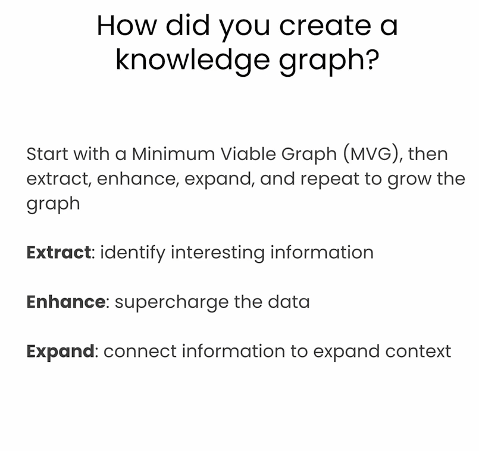


The graph

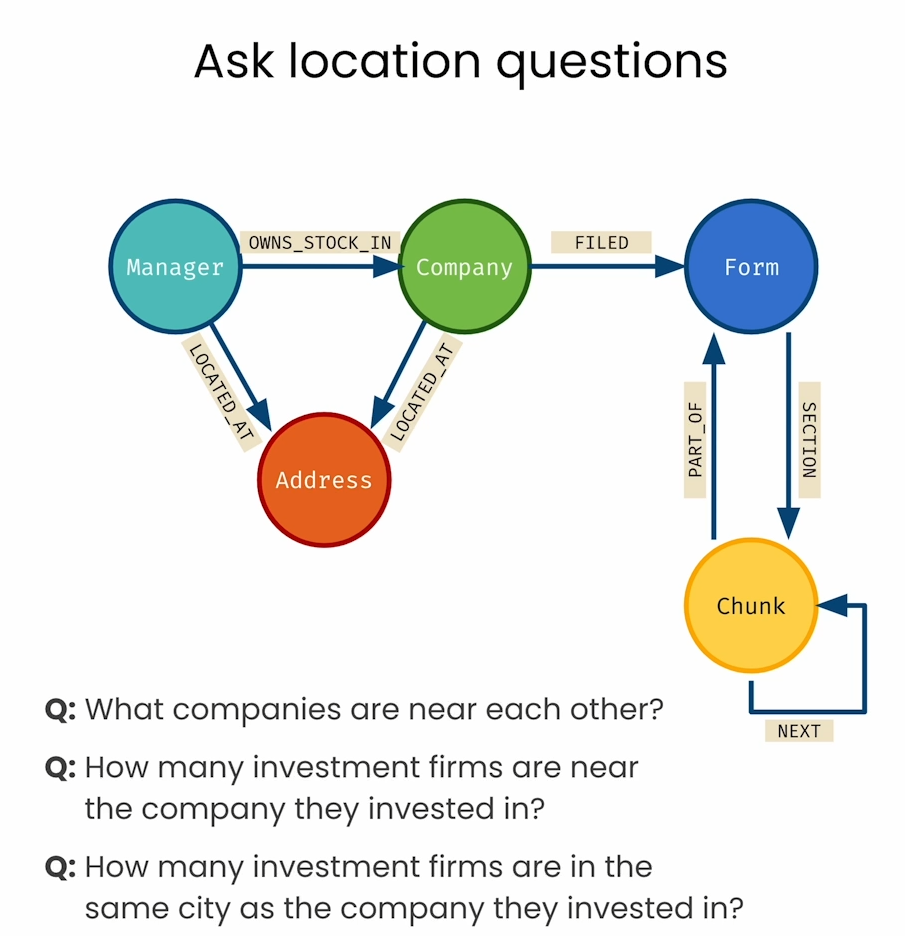


### Import packages and set up Neo4j


```py
from dotenv import load_dotenv
import os

import textwrap

# Langchain
from langchain_community.graphs import Neo4jGraph
from langchain_community.vectorstores import Neo4jVector
from langchain_openai import OpenAIEmbeddings
from langchain.chains import RetrievalQAWithSourcesChain
from langchain.prompts.prompt import PromptTemplate
from langchain.chains import GraphCypherQAChain
from langchain_openai import ChatOpenAI

# Warning control
import warnings
warnings.filterwarnings("ignore")

# Load from environment
load_dotenv('.env', override=True)
NEO4J_URI = os.getenv('NEO4J_URI')
NEO4J_USERNAME = os.getenv('NEO4J_USERNAME')
NEO4J_PASSWORD = os.getenv('NEO4J_PASSWORD')
NEO4J_DATABASE = os.getenv('NEO4J_DATABASE') or 'neo4j'
OPENAI_API_KEY = os.getenv('OPENAI_API_KEY')

# Note the code below is unique to this course environment, and not a 
# standard part of Neo4j's integration with OpenAI. Remove if running 
# in your own environment.
OPENAI_ENDPOINT = os.getenv('OPENAI_BASE_URL') + '/embeddings'

# Global constants
VECTOR_INDEX_NAME = 'form_10k_chunks'
VECTOR_NODE_LABEL = 'Chunk'
VECTOR_SOURCE_PROPERTY = 'text'
VECTOR_EMBEDDING_PROPERTY = 'textEmbedding'

kg = Neo4jGraph(
    url=NEO4J_URI, username=NEO4J_USERNAME, password=NEO4J_PASSWORD, database=NEO4J_DATABASE
)
```


### Explore the updated SEC documents graph
In this lesson, you'll be working with an updated graph that also includes the address information discussed in the video
- Some outputs below may differ slightly from the video
- Start by checking the schema of the graph


```py
kg.refresh_schema()
print(textwrap.fill(kg.schema, 60))
```

Output

```py
Node properties are the following: Chunk {textEmbedding:
LIST, f10kItem: STRING, chunkSeqId: INTEGER, text: STRING,
cik: STRING, cusip6: STRING, names: LIST, formId: STRING,
source: STRING, chunkId: STRING},Form {cusip6: STRING,
names: LIST, formId: STRING, source: STRING},Company
{location: POINT, cusip: STRING, names: LIST,
companyAddress: STRING, companyName: STRING, cusip6:
STRING},Manager {location: POINT, managerName: STRING,
managerCik: STRING, managerAddress: STRING},Address
{location: POINT, country: STRING, city: STRING, state:
STRING} Relationship properties are the following: SECTION
{f10kItem: STRING},OWNS_STOCK_IN {shares: INTEGER,
reportCalendarOrQuarter: STRING, value: FLOAT} The
relationships are the following: (:Chunk)-[:NEXT]-
>(:Chunk),(:Chunk)-[:PART_OF]->(:Form),(:Form)-[:SECTION]-
>(:Chunk),(:Company)-[:FILED]->(:Form),(:Company)-
[:LOCATED_AT]->(:Address),(:Manager)-[:LOCATED_AT]-
>(:Address),(:Manager)-[:OWNS_STOCK_IN]->(:Company)
```

- Check the address of a random Manager
- Note: the company returned by the following query may differ from the one in the video


```py
kg.query("""
MATCH (mgr:Manager)-[:LOCATED_AT]->(addr:Address)
RETURN mgr, addr
LIMIT 1
""")
```

Output

```py
[{'mgr': {'managerCik': '1424381',
   'managerAddress': '650 Madison Avenue, 25th Floor, New York, NY, 10022',
   'location': POINT(-73.9713457 40.7639879),
   'managerName': 'LAKEWOOD CAPITAL MANAGEMENT, LP'},
  'addr': {'country': 'United States',
   'city': 'New York',
   'location': POINT(-73.9821429 40.7584882),
   'state': 'New York'}}]
```

- Full text search for a manager named Royal Bank


```py
kg.query("""
  CALL db.index.fulltext.queryNodes(
         "fullTextManagerNames", 
         "royal bank") YIELD node, score
  RETURN node.managerName, score LIMIT 1
""") 
# Output: [{'node.managerName': 'Royal Bank of Canada', 'score': 4.431276321411133}]
```

- Find location of Royal Bank

```py
kg.query("""
CALL db.index.fulltext.queryNodes(
         "fullTextManagerNames", 
         "royal bank"
  ) YIELD node, score
WITH node as mgr LIMIT 1
MATCH (mgr:Manager)-[:LOCATED_AT]->(addr:Address)
RETURN mgr.managerName, addr
""")
```

Output

```py
[{'mgr.managerName': 'Royal Bank of Canada',
  'addr': {'country': 'Canada',
   'city': 'Toronto',
   'location': POINT(-79.3805647 43.6508267),
   'state': 'Ontario'}}]
```


- Determine which state has the most investment firms


```py
kg.query("""
  MATCH p=(:Manager)-[:LOCATED_AT]->(address:Address)
  RETURN address.state as state, count(address.state) as numManagers
    ORDER BY numManagers DESC
    LIMIT 10
""")
```

Output

```py
[{'state': 'New York', 'numManagers': 304},
 {'state': 'California', 'numManagers': 302},
 {'state': 'Massachusetts', 'numManagers': 146},
 {'state': 'Pennsylvania', 'numManagers': 138},
 {'state': 'Texas', 'numManagers': 125},
 {'state': 'Illinois', 'numManagers': 121},
 {'state': 'Florida', 'numManagers': 115},
 {'state': 'Connecticut', 'numManagers': 77},
 {'state': 'Ohio', 'numManagers': 76},
 {'state': 'New Jersey', 'numManagers': 69}]
```

- Determine which state has the most companies


```py
kg.query("""
  MATCH p=(:Company)-[:LOCATED_AT]->(address:Address)
  RETURN address.state as state, count(address.state) as numCompanies
    ORDER BY numCompanies DESC
""")
```

Output

```py
[{'state': 'California', 'numCompanies': 7},
 {'state': 'Delaware', 'numCompanies': 1},
 {'state': 'New York', 'numCompanies': 1},
 {'state': 'Oregon', 'numCompanies': 1}]
```

- What are the cities in California with the most investment firms?

```py
kg.query("""
  MATCH p=(:Manager)-[:LOCATED_AT]->(address:Address)
         WHERE address.state = 'California'
  RETURN address.city as city, count(address.city) as numManagers
    ORDER BY numManagers DESC
    LIMIT 10
""")
```

Output

```py
[{'city': 'San Francisco', 'numManagers': 48},
 {'city': 'Los Angeles', 'numManagers': 44},
 {'city': 'San Diego', 'numManagers': 17},
 {'city': 'Pasadena', 'numManagers': 13},
 {'city': 'Menlo Park', 'numManagers': 9},
 {'city': 'Newport Beach', 'numManagers': 9},
 {'city': 'Irvine', 'numManagers': 9},
 {'city': 'Walnut Creek', 'numManagers': 8},
 {'city': 'Palo Alto', 'numManagers': 6},
 {'city': 'Lafayette', 'numManagers': 6}]
```

- Which city in California has the most companies listed?


```py
kg.query("""
  MATCH p=(:Company)-[:LOCATED_AT]->(address:Address)
         WHERE address.state = 'California'
  RETURN address.city as city, count(address.city) as numCompanies
    ORDER BY numCompanies DESC
""")
```

Output

```py
[{'city': 'Santa Clara', 'numCompanies': 3},
 {'city': 'San Jose', 'numCompanies': 2},
 {'city': 'Sunnyvale', 'numCompanies': 1},
 {'city': 'Cupertino', 'numCompanies': 1}]
```

- What are top investment firms in San Francisco?


```py
kg.query("""
  MATCH p=(mgr:Manager)-[:LOCATED_AT]->(address:Address),
         (mgr)-[owns:OWNS_STOCK_IN]->(:Company)
         WHERE address.city = "San Francisco"
  RETURN mgr.managerName, sum(owns.value) as totalInvestmentValue
    ORDER BY totalInvestmentValue DESC
    LIMIT 10
""")
```

Output

```py
[{'mgr.managerName': 'Dodge & Cox', 'totalInvestmentValue': 3889236092000.0},
 {'mgr.managerName': 'WELLS FARGO & COMPANY/MN',
  'totalInvestmentValue': 2177580039000.0},
 {'mgr.managerName': 'CHARLES SCHWAB INVESTMENT MANAGEMENT INC',
  'totalInvestmentValue': 1944847519000.0},
 {'mgr.managerName': 'Parallax Volatility Advisers, L.P.',
  'totalInvestmentValue': 694023723000.0},
 {'mgr.managerName': 'PARNASSUS INVESTMENTS, LLC',
  'totalInvestmentValue': 211068925000.0},
 {'mgr.managerName': 'Spyglass Capital Management LLC',
  'totalInvestmentValue': 98135259000.0},
 {'mgr.managerName': 'Valiant Capital Management, L.P.',
  'totalInvestmentValue': 52124040000.0},
 {'mgr.managerName': 'Ensemble Capital Management, LLC',
  'totalInvestmentValue': 42355370000.0},
 {'mgr.managerName': 'Woodline Partners LP',
  'totalInvestmentValue': 41497384000.0},
 {'mgr.managerName': 'Alta Park Capital, LP',
  'totalInvestmentValue': 38959909000.0}]
```


- What companies are located in Santa Clara?


```py
kg.query("""
  MATCH (com:Company)-[:LOCATED_AT]->(address:Address)
         WHERE address.city = "Santa Clara"
  RETURN com.companyName
""")
```

Output

```py
[{'com.companyName': 'PALO ALTO NETWORKS INC'},
 {'com.companyName': 'SEAGATE TECHNOLOGY'},
 {'com.companyName': 'ATLASSIAN CORP PLC'}]
```

- What companies are near Santa Clara?

```py
kg.query("""
  MATCH (sc:Address)
    WHERE sc.city = "Santa Clara"
  MATCH (com:Company)-[:LOCATED_AT]->(comAddr:Address)
    WHERE point.distance(sc.location, comAddr.location) < 10000
  RETURN com.companyName, com.companyAddress
""")
```

Output

```py
[{'com.companyName': 'PALO ALTO NETWORKS INC',
  'com.companyAddress': '3000 Tannery Way, Santa Clara, CA 95054, USA'},
 {'com.companyName': 'GSI TECHNOLOGY INC',
  'com.companyAddress': '1213 Elko Dr, Sunnyvale, CA 94089, USA'},
 {'com.companyName': 'SEAGATE TECHNOLOGY',
  'com.companyAddress': '2445 Augustine Dr, Santa Clara, CA 95054, USA'},
 {'com.companyName': 'ATLASSIAN CORP PLC',
  'com.companyAddress': '431 El Camino Real, Santa Clara, CA 95050, USA'},
 {'com.companyName': 'APPLE INC', 'com.companyAddress': 'Cupertino, CA, USA'}]
```

- What investment firms are near Santa Clara?
- Try updating the distance in the query to expand the search radius


```py
kg.query("""
  MATCH (address:Address)
    WHERE address.city = "Santa Clara"
  MATCH (mgr:Manager)-[:LOCATED_AT]->(managerAddress:Address)
    WHERE point.distance(address.location, 
        managerAddress.location) < 10000
  RETURN mgr.managerName, mgr.managerAddress
""")
```


Output

```py
[{'mgr.managerName': 'Mine & Arao Wealth Creation & Management, LLC.',
  'mgr.managerAddress': '901 CAMPISI WAY, SUITE 140, CAMPBELL, CA, 95008'}]
```


- Which investment firms are near Palo Alto Networks?
- Note that full-text search is able to handle typos!


```py
# Which investment firms are near Palo Aalto Networks?
kg.query("""
  CALL db.index.fulltext.queryNodes(
         "fullTextCompanyNames", 
         "Palo Aalto Networks"
         ) YIELD node, score
  WITH node as com
  MATCH (com)-[:LOCATED_AT]->(comAddress:Address),
    (mgr:Manager)-[:LOCATED_AT]->(mgrAddress:Address)
    WHERE point.distance(comAddress.location, 
        mgrAddress.location) < 10000
  RETURN mgr, 
    toInteger(point.distance(comAddress.location, 
        mgrAddress.location) / 1000) as distanceKm
    ORDER BY distanceKm ASC
    LIMIT 10
""")
```

Output

```py
[{'mgr': {'managerCik': '1802994',
   'managerAddress': '901 CAMPISI WAY, SUITE 140, CAMPBELL, CA, 95008',
   'location': POINT(-121.9342655 37.2909459),
   'managerName': 'Mine & Arao Wealth Creation & Management, LLC.'},
  'distanceKm': 6}]
```

### Writing Cypher with an LLM


In this section, you'll use few-shot learning to teach an LLM to write Cypher
- You'll use the OpenAI's GPT 3.5 model 
- You'll also use a new Neo4j integration within LangChain called **GraphCypherQAChain**


```py
CYPHER_GENERATION_TEMPLATE = """Task:Generate Cypher statement to 
query a graph database.
Instructions:
Use only the provided relationship types and properties in the 
schema. Do not use any other relationship types or properties that 
are not provided.
Schema:
{schema}
Note: Do not include any explanations or apologies in your responses.
Do not respond to any questions that might ask anything else than 
for you to construct a Cypher statement.
Do not include any text except the generated Cypher statement.
Examples: Here are a few examples of generated Cypher 
statements for particular questions:

# What investment firms are in San Francisco?
MATCH (mgr:Manager)-[:LOCATED_AT]->(mgrAddress:Address)
    WHERE mgrAddress.city = 'San Francisco'
RETURN mgr.managerName
The question is:
{question}"""
```


```py
CYPHER_GENERATION_PROMPT = PromptTemplate(
    input_variables=["schema", "question"], 
    template=CYPHER_GENERATION_TEMPLATE
)

cypherChain = GraphCypherQAChain.from_llm(
    ChatOpenAI(temperature=0),
    graph=kg,
    verbose=True,
    cypher_prompt=CYPHER_GENERATION_PROMPT,
)

def prettyCypherChain(question: str) -> str:
    response = cypherChain.run(question)
    print(textwrap.fill(response, 60))
```


```py
prettyCypherChain("What investment firms are in San Francisco?")
```

Output

```py
> Entering new GraphCypherQAChain chain...
Generated Cypher:
MATCH (mgr:Manager)-[:LOCATED_AT]->(mgrAddress:Address)
WHERE mgrAddress.city = 'San Francisco'
RETURN mgr.managerName
Full Context:
[{'mgr.managerName': 'PARNASSUS INVESTMENTS, LLC'}, {'mgr.managerName': 'SKBA CAPITAL MANAGEMENT LLC'}, {'mgr.managerName': 'ROSENBLUM SILVERMAN SUTTON S F INC /CA'}, {'mgr.managerName': 'CHARLES SCHWAB INVESTMENT MANAGEMENT INC'}, {'mgr.managerName': 'WELLS FARGO & COMPANY/MN'}, {'mgr.managerName': 'Dodge & Cox'}, {'mgr.managerName': 'Strait & Sound Wealth Management LLC'}, {'mgr.managerName': 'Sonoma Private Wealth LLC'}, {'mgr.managerName': 'Fund Management at Engine No. 1 LLC'}, {'mgr.managerName': 'SELDON CAPITAL LP'}]

> Finished chain.
PARNASSUS INVESTMENTS, LLC, ROSENBLUM SILVERMAN SUTTON S F
INC /CA, and Dodge & Cox are investment firms located in San
Francisco.
```


```py
prettyCypherChain("What investment firms are in Menlo Park?")
```

Output

```py
> Entering new GraphCypherQAChain chain...
Generated Cypher:
MATCH (mgr:Manager)-[:LOCATED_AT]->(mgrAddress:Address)
    WHERE mgrAddress.city = 'Menlo Park'
RETURN mgr.managerName
Full Context:
[{'mgr.managerName': 'Bordeaux Wealth Advisors LLC'}, {'mgr.managerName': 'Opes Wealth Management LLC'}, {'mgr.managerName': 'Solstein Capital, LLC'}, {'mgr.managerName': 'Stamos Capital Partners, L.P.'}, {'mgr.managerName': 'TIEMANN INVESTMENT ADVISORS, LLC'}, {'mgr.managerName': 'SCGE MANAGEMENT, L.P.'}, {'mgr.managerName': 'Nelson Capital Management, LLC'}, {'mgr.managerName': 'Jasper Ridge Partners, L.P.'}, {'mgr.managerName': 'CROSSLINK CAPITAL INC'}]

> Finished chain.
Jasper Ridge Partners, L.P. and CROSSLINK CAPITAL INC are
investment firms located in Menlo Park.
```


```py
prettyCypherChain("What companies are in Santa Clara?")
```

Output

```py
> Entering new GraphCypherQAChain chain...
Generated Cypher:
MATCH (comp:Company)-[:LOCATED_AT]->(compAddress:Address)
    WHERE compAddress.city = 'Santa Clara'
RETURN comp.companyName
Full Context:
[{'comp.companyName': 'PALO ALTO NETWORKS INC'}, {'comp.companyName': 'SEAGATE TECHNOLOGY'}, {'comp.companyName': 'ATLASSIAN CORP PLC'}]

> Finished chain.
The companies in Santa Clara are PALO ALTO NETWORKS INC,
SEAGATE TECHNOLOGY, and ATLASSIAN CORP PLC.
```


```py
prettyCypherChain("What investment firms are near Santa Clara?")
```

Output

```py
> Entering new GraphCypherQAChain chain...
Generated Cypher:
MATCH (mgr:Manager)-[:LOCATED_AT]->(mgrAddress:Address)
WHERE mgrAddress.city = 'Santa Clara'
RETURN mgr.managerName
Full Context:
[]

> Finished chain.
I don't know the answer.
```

### Expand the prompt to teach the LLM new Cypher patterns


```py
CYPHER_GENERATION_TEMPLATE = """Task:Generate Cypher statement to query a graph database.
Instructions:
Use only the provided relationship types and properties in the schema.
Do not use any other relationship types or properties that are not provided.
Schema:
{schema}
Note: Do not include any explanations or apologies in your responses.
Do not respond to any questions that might ask anything else than for you to construct a Cypher statement.
Do not include any text except the generated Cypher statement.
Examples: Here are a few examples of generated Cypher statements for particular questions:

# What investment firms are in San Francisco?
MATCH (mgr:Manager)-[:LOCATED_AT]->(mgrAddress:Address)
    WHERE mgrAddress.city = 'San Francisco'
RETURN mgr.managerName

# What investment firms are near Santa Clara?
  MATCH (address:Address)
    WHERE address.city = "Santa Clara"
  MATCH (mgr:Manager)-[:LOCATED_AT]->(managerAddress:Address)
    WHERE point.distance(address.location, 
        managerAddress.location) < 10000
  RETURN mgr.managerName, mgr.managerAddress

The question is:
{question}"""
```

- Update Cypher generation prompt with new template, and re-initialize the Cypher chain to use the new prompt
- Rerun this code anytime you make a change to the Cypher generation template!

```py
CYPHER_GENERATION_PROMPT = PromptTemplate(
    input_variables=["schema", "question"], 
    template=CYPHER_GENERATION_TEMPLATE
)

cypherChain = GraphCypherQAChain.from_llm(
    ChatOpenAI(temperature=0),
    graph=kg,
    verbose=True,
    cypher_prompt=CYPHER_GENERATION_PROMPT,
)
```


```py
prettyCypherChain("What investment firms are near Santa Clara?")
```

Output

```py
> Entering new GraphCypherQAChain chain...
Generated Cypher:
MATCH (address:Address)
    WHERE address.city = "Santa Clara"
MATCH (mgr:Manager)-[:LOCATED_AT]->(managerAddress:Address)
    WHERE point.distance(address.location, managerAddress.location) < 10000
RETURN mgr.managerName, mgr.managerAddress
Full Context:
[{'mgr.managerName': 'Mine & Arao Wealth Creation & Management, LLC.', 'mgr.managerAddress': '901 CAMPISI WAY, SUITE 140, CAMPBELL, CA, 95008'}]

> Finished chain.
Mine & Arao Wealth Creation & Management, LLC. is an
investment firm near Santa Clara, located at 901 CAMPISI
WAY, SUITE 140, CAMPBELL, CA, 95008.
```

### Expand the query to retrieve information from the Form 10K chunks


```py
CYPHER_GENERATION_TEMPLATE = """Task:Generate Cypher statement to query a graph database.
Instructions:
Use only the provided relationship types and properties in the schema.
Do not use any other relationship types or properties that are not provided.
Schema:
{schema}
Note: Do not include any explanations or apologies in your responses.
Do not respond to any questions that might ask anything else than for you to construct a Cypher statement.
Do not include any text except the generated Cypher statement.
Examples: Here are a few examples of generated Cypher statements for particular questions:

# What investment firms are in San Francisco?
MATCH (mgr:Manager)-[:LOCATED_AT]->(mgrAddress:Address)
    WHERE mgrAddress.city = 'San Francisco'
RETURN mgr.managerName

# What investment firms are near Santa Clara?
  MATCH (address:Address)
    WHERE address.city = "Santa Clara"
  MATCH (mgr:Manager)-[:LOCATED_AT]->(managerAddress:Address)
    WHERE point.distance(address.location, 
        managerAddress.location) < 10000
  RETURN mgr.managerName, mgr.managerAddress

# What does Palo Alto Networks do?
  CALL db.index.fulltext.queryNodes(
         "fullTextCompanyNames", 
         "Palo Alto Networks"
         ) YIELD node, score
  WITH node as com
  MATCH (com)-[:FILED]->(f:Form),
    (f)-[s:SECTION]->(c:Chunk)
  WHERE s.f10kItem = "item1"
RETURN c.text

The question is:
{question}"""
```


```py
CYPHER_GENERATION_PROMPT = PromptTemplate(
    input_variables=["schema", "question"], 
    template=CYPHER_GENERATION_TEMPLATE
)

cypherChain = GraphCypherQAChain.from_llm(
    ChatOpenAI(temperature=0),
    graph=kg,
    verbose=True,
    cypher_prompt=CYPHER_GENERATION_PROMPT,
)

prettyCypherChain("What does Palo Alto Networks do?")
```

Output

```py
Palo Alto Networks, Inc. is a global cybersecurity provider
that empowers enterprises, organizations, service providers,
and government entities to protect themselves against
sophisticated cyber threats. They offer cybersecurity
platforms and services to secure users, networks, clouds,
and endpoints with industry-leading artificial intelligence
and automation. Their focus is on delivering value in
network security, including zero trust solutions for remote
workforces and cloud-delivered branches.
```


# 后记

2024年7月24日17点34分于上海，完成这门short course的学习。以此了解知识图谱的基本概念，代码层面如何将知识图谱用到RAG中。

