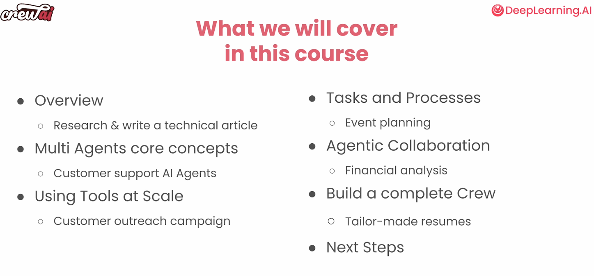

# Multi AI Agent Systems with crewAI


本文是学习 [Multi AI Agent Systems with crewAI](https://www.deeplearning.ai/short-courses/multi-ai-agent-systems-with-crewai/?utm_campaign=crewai-launch&utm_medium=headband&utm_source=dlai-homepage) 这门课的学习笔记。


## What you’ll learn in this course

Learn key principles of designing effective AI agents, and organizing a team of AI agents to perform complex, multi-step tasks. Apply these concepts to automate 6 common business processes.

Learn from João Moura, founder and CEO of crewAI, and explore key components of multi-agent systems: 

- **Role-playing:** Assign specialized roles to agents 
- **Memory:** Provide agents with short-term, long-term, and shared memory
- **Tools:** Assign pre-built and custom tools to each agent (e.g. for web search)
- **Focus:** Break down the tasks, goals, and tools and assign to multiple AI agents for better performance
- **Guardrails:** Effectively handle errors, hallucinations, and infinite loops
- **Cooperation:** Perform tasks in series, in parallel, and hierarchically

Throughout the course, you’ll work with crewAI, an open source library designed for building multi-agent systems. You’ll learn to build agent crews that execute common business processes, such as:

- Tailor resumes and interview prep for job applications
- Research, write and edit technical articles
- Automate customer support inquiries
- Conduct customer outreach campaigns
- Plan and execute events
- Perform financial analysis

By the end of the course, you will have designed several multi-agent systems to assist you in common business processes, and also studied the key principles of AI agent systems.

@[toc]


# Overview


key elements of AI agents


多Agent的合作方式


Course Overview




Agent的应用


Agent修改profile


使用Agents做不同的任务


# AI Agents


LLM做的事情


Agent


Multi Agent


CrewAI


# Create Agents to Research and Write an Article

In this lesson, you will be introduced to the foundational concepts of multi-agent systems and get an overview of the crewAI framework.

The libraries are already installed in the classroom. If you're running this notebook on your own machine, you can install the following:
```Python
!pip install crewai==0.28.8 crewai_tools==0.1.6 langchain_community==0.0.29
```

requirements.txt

```py
crewai==0.28.8
crewai_tools==0.1.6
langchain_community==0.0.29
```


utils.py

```py
# Add your utilities or helper functions to this file.

import os
from dotenv import load_dotenv, find_dotenv

# these expect to find a .env file at the directory above the lesson.                                                                                                                     # the format for that file is (without the comment)                                                                                                                                       #API_KEYNAME=AStringThatIsTheLongAPIKeyFromSomeService
def load_env():
    _ = load_dotenv(find_dotenv())

def get_openai_api_key():
    load_env()
    openai_api_key = os.getenv("OPENAI_API_KEY")
    return openai_api_key

def get_serper_api_key():
    load_env()
    openai_api_key = os.getenv("SERPER_API_KEY")
    return openai_api_key


# break line every 80 characters if line is longer than 80 characters
# don't break in the middle of a word
def pretty_print_result(result):
  parsed_result = []
  for line in result.split('\n'):
      if len(line) > 80:
          words = line.split(' ')
          new_line = ''
          for word in words:
              if len(new_line) + len(word) + 1 > 80:
                  parsed_result.append(new_line)
                  new_line = word
              else:
                  if new_line == '':
                      new_line = word
                  else:
                      new_line += ' ' + word
          parsed_result.append(new_line)
      else:
          parsed_result.append(line)
  return "\n".join(parsed_result)

```


Import from the crewAI libray.

```py
# Warning control
import warnings
warnings.filterwarnings('ignore')

from crewai import Agent, Task, Crew
```

- As a LLM for your agents, you'll be using OpenAI's `gpt-3.5-turbo`.

**Optional Note:** crewAI also allow other popular models to be used as a LLM for your Agents. You can see some of the examples at the [bottom of the notebook].


```py
import os
from utils import get_openai_api_key

openai_api_key = get_openai_api_key()
os.environ["OPENAI_MODEL_NAME"] = 'gpt-3.5-turbo'
```


## Creating Agents

- Define your Agents, and provide them a `role`, `goal` and `backstory`.
- It has been seen that LLMs perform better when they are role playing.


### Agent: Planner

**Note**: The benefit of using _multiple strings_ :
```Python
varname = "line 1 of text"
          "line 2 of text"
```

versus the _triple quote docstring_:
```Python
varname = """line 1 of text
             line 2 of text
          """
```
is that it can avoid adding those whitespaces and newline characters, making it better formatted to be passed to the LLM.


```py
planner = Agent(
    role="Content Planner",
    goal="Plan engaging and factually accurate content on {topic}",
    backstory="You're working on planning a blog article "
              "about the topic: {topic}."
              "You collect information that helps the "
              "audience learn something "
              "and make informed decisions. "
              "Your work is the basis for "
              "the Content Writer to write an article on this topic.",
    allow_delegation=False,
	verbose=True
)
```

### Agent: Writer


```py
writer = Agent(
    role="Content Writer",
    goal="Write insightful and factually accurate "
         "opinion piece about the topic: {topic}",
    backstory="You're working on a writing "
              "a new opinion piece about the topic: {topic}. "
              "You base your writing on the work of "
              "the Content Planner, who provides an outline "
              "and relevant context about the topic. "
              "You follow the main objectives and "
              "direction of the outline, "
              "as provide by the Content Planner. "
              "You also provide objective and impartial insights "
              "and back them up with information "
              "provide by the Content Planner. "
              "You acknowledge in your opinion piece "
              "when your statements are opinions "
              "as opposed to objective statements.",
    allow_delegation=False,
    verbose=True
)
```


### Agent: Editor


```py
editor = Agent(
    role="Editor",
    goal="Edit a given blog post to align with "
         "the writing style of the organization. ",
    backstory="You are an editor who receives a blog post "
              "from the Content Writer. "
              "Your goal is to review the blog post "
              "to ensure that it follows journalistic best practices,"
              "provides balanced viewpoints "
              "when providing opinions or assertions, "
              "and also avoids major controversial topics "
              "or opinions when possible.",
    allow_delegation=False,
    verbose=True
)
```


## Creating Tasks

- Define your Tasks, and provide them a `description`, `expected_output` and `agent`.


### Task: Plan

```py
plan = Task(
    description=(
        "1. Prioritize the latest trends, key players, "
            "and noteworthy news on {topic}.\n"
        "2. Identify the target audience, considering "
            "their interests and pain points.\n"
        "3. Develop a detailed content outline including "
            "an introduction, key points, and a call to action.\n"
        "4. Include SEO keywords and relevant data or sources."
    ),
    expected_output="A comprehensive content plan document "
        "with an outline, audience analysis, "
        "SEO keywords, and resources.",
    agent=planner,
)
```

### Task: Write

```py
write = Task(
    description=(
        "1. Use the content plan to craft a compelling "
            "blog post on {topic}.\n"
        "2. Incorporate SEO keywords naturally.\n"
		"3. Sections/Subtitles are properly named "
            "in an engaging manner.\n"
        "4. Ensure the post is structured with an "
            "engaging introduction, insightful body, "
            "and a summarizing conclusion.\n"
        "5. Proofread for grammatical errors and "
            "alignment with the brand's voice.\n"
    ),
    expected_output="A well-written blog post "
        "in markdown format, ready for publication, "
        "each section should have 2 or 3 paragraphs.",
    agent=writer,
)
```


### Task: Edit

```py
edit = Task(
    description=("Proofread the given blog post for "
                 "grammatical errors and "
                 "alignment with the brand's voice."),
    expected_output="A well-written blog post in markdown format, "
                    "ready for publication, "
                    "each section should have 2 or 3 paragraphs.",
    agent=editor
)
```


## Creating the Crew

- Create your crew of Agents
- Pass the tasks to be performed by those agents.
    - **Note**: *For this simple example*, the tasks will be performed sequentially (i.e they are dependent on each other), so the _order_ of the task in the list _matters_.
- `verbose=2` allows you to see all the logs of the execution. 


```py
crew = Crew(
    agents=[planner, writer, editor],
    tasks=[plan, write, edit],
    verbose=2
)
```


## Running the Crew


**Note**: LLMs can provide different outputs for they same input, so what you get might be different than what you see in the video.


```py
result = crew.kickoff(inputs={"topic": "Artificial Intelligence"})
```

Output

```py


> Entering new CrewAgentExecutor chain...
I now can give a great answer

Final Answer: 

Title: The Rise of Artificial Intelligence: Latest Trends, Key Players, and Noteworthy News

Introduction:
- Brief overview of the current landscape of artificial intelligence (AI)
- Importance of staying updated on the latest trends and news in AI
- Overview of key players in the AI industry

Key Points:
1. Latest Trends in Artificial Intelligence
- Advancements in machine learning algorithms
- Growth of AI in healthcare, finance, and other industries
- Ethical considerations in AI development

2. Key Players in the AI Industry
- Google, Amazon, Microsoft, and other tech giants leading AI development
- Emerging startups making waves in AI innovation
- Academic institutions and research labs driving AI research

3. Noteworthy News in Artificial Intelligence
- Recent breakthroughs in AI technology
- Impact of AI on the job market and society
- Regulatory developments in AI ethics and governance

Audience Analysis:
- Target audience: tech enthusiasts, business professionals, students, researchers
- Interests: staying informed on the latest technology trends, understanding the impact of AI on various industries
- Pain points: confusion about complex AI concepts, uncertainty about the future of AI technology

SEO Keywords:
- Artificial intelligence trends
- Key players in AI
- Latest news in artificial intelligence
- AI industry updates

Call to Action:
- Encourage readers to subscribe to our newsletter for regular updates on AI trends
- Invite readers to join our online community for discussions on AI topics
- Provide a link to a related whitepaper or case study for further reading

Resources:
- Forbes: "The Top Artificial Intelligence Trends to Watch in 2021"
- TechCrunch: "The Biggest Players in AI: Who's Leading the Pack"
- Harvard Business Review: "Ethical Implications of Artificial Intelligence in Business" 

Overall, this content plan aims to provide a comprehensive overview of the latest trends, key players, and noteworthy news in the field of artificial intelligence. By addressing the interests and pain points of our target audience and incorporating relevant SEO keywords and resources, we can create engaging and informative content that will resonate with readers.

> Finished chain.

```

- Display the results of your execution as markdown in the notebook.

```py
from IPython.display import Markdown
Markdown(result)
```


## Try it Yourself

- Pass in a topic of your choice and see what the agents come up with!

```py
topic = "YOUR TOPIC HERE"
result = crew.kickoff(inputs={"topic": topic})
```

<a name='1'></a>

 ## Other Popular Models as LLM for your Agents


#### Hugging Face (HuggingFaceHub endpoint)

```Python
from langchain_community.llms import HuggingFaceHub

llm = HuggingFaceHub(
    repo_id="HuggingFaceH4/zephyr-7b-beta",
    huggingfacehub_api_token="<HF_TOKEN_HERE>",
    task="text-generation",
)

### you will pass "llm" to your agent function
```


#### Mistral API

```Python
OPENAI_API_KEY=your-mistral-api-key
OPENAI_API_BASE=https://api.mistral.ai/v1
OPENAI_MODEL_NAME="mistral-small"
```


#### Cohere

```Python
from langchain_community.chat_models import ChatCohere
# Initialize language model
os.environ["COHERE_API_KEY"] = "your-cohere-api-key"
llm = ChatCohere()

### you will pass "llm" to your agent function
```

For using Llama locally with Ollama and more, checkout the crewAI documentation on [Connecting to any LLM](https://docs.crewai.com/how-to/LLM-Connections/).


Summary


# Key elements of AI Agents


key elements of AI agents


Role playing


Focus

Each agent focuses on one task


Tools

provide key tools for the agents


Cooperation


Guardrails


Memory

remember what is has done


Short term memory


Long term memory


Entity memory


# Multi-agent Customer Support Automation

In this lesson, you will learn about the six key elements which help make Agents perform even better:
- Role Playing
- Focus
- Tools
- Cooperation
- Guardrails
- Memory


Import libraries, API and LLM

```py
# Warning control
import warnings
warnings.filterwarnings('ignore')

from crewai import Agent, Task, Crew
import os
from utils import get_openai_api_key

openai_api_key = get_openai_api_key()
os.environ["OPENAI_MODEL_NAME"] = 'gpt-3.5-turbo'
```


## Role Playing, Focus and Cooperation


```py
support_agent = Agent(
    role="Senior Support Representative",
	goal="Be the most friendly and helpful "
        "support representative in your team",
	backstory=(
		"You work at crewAI (https://crewai.com) and "
        " are now working on providing "
		"support to {customer}, a super important customer "
        " for your company."
		"You need to make sure that you provide the best support!"
		"Make sure to provide full complete answers, "
        " and make no assumptions."
	),
	allow_delegation=False,
	verbose=True
)
```


- By not setting `allow_delegation=False`, `allow_delegation` takes its default value of being `True`.
- This means the agent _can_ delegate its work to another agent which is better suited to do a particular task. 


```py
support_quality_assurance_agent = Agent(
	role="Support Quality Assurance Specialist",
	goal="Get recognition for providing the "
    "best support quality assurance in your team",
	backstory=(
		"You work at crewAI (https://crewai.com) and "
        "are now working with your team "
		"on a request from {customer} ensuring that "
        "the support representative is "
		"providing the best support possible.\n"
		"You need to make sure that the support representative "
        "is providing full"
		"complete answers, and make no assumptions."
	),
	verbose=True
)
```


* **Role Playing**: Both agents have been given a role, goal and backstory.
* **Focus**: Both agents have been prompted to get into the character of the roles they are playing.
* **Cooperation**: Support Quality Assurance Agent can delegate work back to the Support Agent, allowing for these agents to work together.


## Tools, Guardrails and Memory

### Tools


- Import CrewAI tools

```py
from crewai_tools import SerperDevTool, \
                         ScrapeWebsiteTool, \
                         WebsiteSearchTool
```


### Possible Custom Tools
- Load customer data
- Tap into previous conversations
- Load data from a CRM
- Checking existing bug reports
- Checking existing feature requests
- Checking ongoing tickets
- ... and more


- Some ways of using CrewAI tools.

```Python
search_tool = SerperDevTool()
scrape_tool = ScrapeWebsiteTool()
```


- Instantiate a document scraper tool.
- The tool will scrape a page (only 1 URL) of the CrewAI documentation.


```py
docs_scrape_tool = ScrapeWebsiteTool(
    website_url="https://docs.crewai.com/how-to/Creating-a-Crew-and-kick-it-off/"
)
```


##### Different Ways to Give Agents Tools

- Agent Level: The Agent can use the Tool(s) on any Task it performs.
- Task Level: The Agent will only use the Tool(s) when performing that specific Task.

**Note**: Task Tools override the Agent Tools.


### Creating Tasks

- You are passing the Tool on the Task Level.


```py
inquiry_resolution = Task(
    description=(
        "{customer} just reached out with a super important ask:\n"
	    "{inquiry}\n\n"
        "{person} from {customer} is the one that reached out. "
		"Make sure to use everything you know "
        "to provide the best support possible."
		"You must strive to provide a complete "
        "and accurate response to the customer's inquiry."
    ),
    expected_output=(
	    "A detailed, informative response to the "
        "customer's inquiry that addresses "
        "all aspects of their question.\n"
        "The response should include references "
        "to everything you used to find the answer, "
        "including external data or solutions. "
        "Ensure the answer is complete, "
		"leaving no questions unanswered, and maintain a helpful and friendly "
		"tone throughout."
    ),
	tools=[docs_scrape_tool],
    agent=support_agent,
)
```


- `quality_assurance_review` is not using any Tool(s)
- Here the QA Agent will only review the work of the Support Agent


```py
quality_assurance_review = Task(
    description=(
        "Review the response drafted by the Senior Support Representative for {customer}'s inquiry. "
        "Ensure that the answer is comprehensive, accurate, and adheres to the "
		"high-quality standards expected for customer support.\n"
        "Verify that all parts of the customer's inquiry "
        "have been addressed "
		"thoroughly, with a helpful and friendly tone.\n"
        "Check for references and sources used to "
        " find the information, "
		"ensuring the response is well-supported and "
        "leaves no questions unanswered."
    ),
    expected_output=(
        "A final, detailed, and informative response "
        "ready to be sent to the customer.\n"
        "This response should fully address the "
        "customer's inquiry, incorporating all "
		"relevant feedback and improvements.\n"
		"Don't be too formal, we are a chill and cool company "
	    "but maintain a professional and friendly tone throughout."
    ),
    agent=support_quality_assurance_agent,
)

```


### Creating the Crew

#### Memory
- Setting `memory=True` when putting the crew together enables Memory.


```py
crew = Crew(
  agents=[support_agent, support_quality_assurance_agent],
  tasks=[inquiry_resolution, quality_assurance_review],
  verbose=2,
  memory=True
)
```


### Running the Crew

**Note**: LLMs can provide different outputs for they same input, so what you get might be different than what you see in the video.

#### Guardrails
- By running the execution below, you can see that the agents and the responses are within the scope of what we expect from them.


```py
inputs = {
    "customer": "DeepLearningAI",
    "person": "Andrew Ng",
    "inquiry": "I need help with setting up a Crew "
               "and kicking it off, specifically "
               "how can I add memory to my crew? "
               "Can you provide guidance?"
}
result = crew.kickoff(inputs=inputs)
```

Output

~~~py
Final Answer: 

To add memory to your CrewAI team, you can follow these steps:

1. Assemble Your Agents:
   Define your agents with distinct roles, backstories, and enhanced capabilities like memory usage. You can create agents with memory by setting the memory parameter to True when defining them. For example:
   
   ```
   researcher = Agent(
   role='Senior Researcher',
   goal='Uncover groundbreaking technologies in {topic}',
   verbose=True,
   memory=True,
   backstory=(
   "Driven by curiosity, you're at the forefront of innovation, eager to explore and share knowledge that could change the world."
   ),
   tools=[search_tool],
   allow_delegation=True
   )
   ```

2. Define the Tasks:
   Detail the specific objectives for your agents, including the use of memory in their tasks. Ensure that the tasks are configured to utilize the memory feature. For example:
   
   ```
   research_task = Task(
   description=(
   "Identify the next big trend in {topic}."
   "Focus on identifying pros and cons and the overall narrative."
   "Your final report should clearly articulate the key points,"
   "its market opportunities, and potential risks."
   ),
   expected_output='A comprehensive 3 paragraphs long report on the latest AI trends.',
   tools=[search_tool],
   agent=researcher,
   )
   ```

3. Form the Crew:
   Combine your agents into a crew, setting the workflow process they'll follow to accomplish the tasks. Ensure that the crew configuration includes the memory parameter set to True. For example:
   
   ```
   crew = Crew(
   agents=[researcher, writer],
   tasks=[research_task, write_task],
   process=Process.sequential,
   memory=True,
   cache=True,
   max_rpm=100,
   share_crew=True
   )
   ```

4. Kick It Off:
   Initiate the process with your enhanced crew ready. Ensure that the crew is configured with memory capabilities before kicking off the tasks. For example:
   
   ```
   result = crew.kickoff(inputs={'topic': 'AI in healthcare'})
   print(result)
   ```

By following these steps, you can successfully add memory to your CrewAI team and enhance their capabilities for efficient task execution and collaboration. If you need further assistance or have any more questions, feel free to reach out. We are here to help you make the most out of your CrewAI experience.

~~~

- Display the final result as Markdown.


```py
from IPython.display import Markdown
Markdown(result)
```

Output

```py
Dear Andrew Ng,

Thank you for reaching out to CrewAI with your inquiry regarding adding memory to your Crew. I have carefully reviewed the steps you can follow to enhance your team's capabilities, and I'm here to provide you with detailed guidance on this matter.

To add memory to your Crew, please follow these steps:

1. Assemble Your Agents:
   Define your agents with specific roles and enhanced capabilities, such as memory usage. Make sure to set the memory parameter to True when defining them.

2. Define the Tasks:
   Detail the objectives for your agents, including the use of memory in their tasks. Ensure that the tasks are configured to utilize the memory feature effectively.

3. Form the Crew:
   Combine your agents into a crew, setting the workflow process they'll follow to accomplish the tasks. Ensure that the crew configuration includes the memory parameter set to True.

4. Kick It Off:
   Initiate the process with your enhanced crew ready. Ensure that the crew is configured with memory capabilities before starting the tasks.

By following these steps, you can successfully add memory to your CrewAI team and enhance their capabilities for efficient task execution and collaboration. If you need further assistance or have any more questions, feel free to reach out. We are here to help you make the most out of your CrewAI experience.

Best regards,
[Your Name]
Support Quality Assurance Specialist
CrewAI
```


# Mental framework for agent creation


recap


# Key elements of agent tools


Versatile


Fault tolerant


Cashing


examples of tools


# Tools for a Customer Outreach Campaign

In this lesson, you will learn more about Tools. You'll focus on three key elements of Tools:
- Versatility
- Fault Tolerance
- Caching


Import libraries, APIs and LLM

[Serper](https://serper.dev)

```py
# Warning control
import warnings
warnings.filterwarnings('ignore')

from crewai import Agent, Task, Crew

import os
from utils import get_openai_api_key, pretty_print_result
from utils import get_serper_api_key

openai_api_key = get_openai_api_key()
os.environ["OPENAI_MODEL_NAME"] = 'gpt-3.5-turbo'
os.environ["SERPER_API_KEY"] = get_serper_api_key()
```


## Creating Agents


```py
sales_rep_agent = Agent(
    role="Sales Representative",
    goal="Identify high-value leads that match "
         "our ideal customer profile",
    backstory=(
        "As a part of the dynamic sales team at CrewAI, "
        "your mission is to scour "
        "the digital landscape for potential leads. "
        "Armed with cutting-edge tools "
        "and a strategic mindset, you analyze data, "
        "trends, and interactions to "
        "unearth opportunities that others might overlook. "
        "Your work is crucial in paving the way "
        "for meaningful engagements and driving the company's growth."
    ),
    allow_delegation=False,
    verbose=True
)
```


```py
lead_sales_rep_agent = Agent(
    role="Lead Sales Representative",
    goal="Nurture leads with personalized, compelling communications",
    backstory=(
        "Within the vibrant ecosystem of CrewAI's sales department, "
        "you stand out as the bridge between potential clients "
        "and the solutions they need."
        "By creating engaging, personalized messages, "
        "you not only inform leads about our offerings "
        "but also make them feel seen and heard."
        "Your role is pivotal in converting interest "
        "into action, guiding leads through the journey "
        "from curiosity to commitment."
    ),
    allow_delegation=False,
    verbose=True
)
```


## Creating Tools

### crewAI Tools


```py
from crewai_tools import DirectoryReadTool, \
                         FileReadTool, \
                         SerperDevTool
                         
directory_read_tool = DirectoryReadTool(directory='./instructions')
file_read_tool = FileReadTool()
search_tool = SerperDevTool()
```


### Custom Tool
- Create a custom tool using crewAi's [BaseTool](https://docs.crewai.com/core-concepts/Tools/#subclassing-basetool) class


```py
from crewai_tools import BaseTool
```


- Every Tool needs to have a `name` and a `description`.
- For simplicity and classroom purposes, `SentimentAnalysisTool` will return `positive` for every text.
- When running locally, you can customize the code with your logic in the `_run` function.


```py
class SentimentAnalysisTool(BaseTool):
    name: str ="Sentiment Analysis Tool"
    description: str = ("Analyzes the sentiment of text "
         "to ensure positive and engaging communication.")
    
    def _run(self, text: str) -> str:
        # Your custom code tool goes here
        return "positive"
```


```py
sentiment_analysis_tool = SentimentAnalysisTool()
```


## Creating Tasks

- The Lead Profiling Task is using crewAI Tools.


```py
lead_profiling_task = Task(
    description=(
        "Conduct an in-depth analysis of {lead_name}, "
        "a company in the {industry} sector "
        "that recently showed interest in our solutions. "
        "Utilize all available data sources "
        "to compile a detailed profile, "
        "focusing on key decision-makers, recent business "
        "developments, and potential needs "
        "that align with our offerings. "
        "This task is crucial for tailoring "
        "our engagement strategy effectively.\n"
        "Don't make assumptions and "
        "only use information you absolutely sure about."
    ),
    expected_output=(
        "A comprehensive report on {lead_name}, "
        "including company background, "
        "key personnel, recent milestones, and identified needs. "
        "Highlight potential areas where "
        "our solutions can provide value, "
        "and suggest personalized engagement strategies."
    ),
    tools=[directory_read_tool, file_read_tool, search_tool],
    agent=sales_rep_agent,
)
```


- The Personalized Outreach Task is using your custom Tool `SentimentAnalysisTool`, as well as crewAI's `SerperDevTool` (search_tool).


```py
personalized_outreach_task = Task(
    description=(
        "Using the insights gathered from "
        "the lead profiling report on {lead_name}, "
        "craft a personalized outreach campaign "
        "aimed at {key_decision_maker}, "
        "the {position} of {lead_name}. "
        "The campaign should address their recent {milestone} "
        "and how our solutions can support their goals. "
        "Your communication must resonate "
        "with {lead_name}'s company culture and values, "
        "demonstrating a deep understanding of "
        "their business and needs.\n"
        "Don't make assumptions and only "
        "use information you absolutely sure about."
    ),
    expected_output=(
        "A series of personalized email drafts "
        "tailored to {lead_name}, "
        "specifically targeting {key_decision_maker}."
        "Each draft should include "
        "a compelling narrative that connects our solutions "
        "with their recent achievements and future goals. "
        "Ensure the tone is engaging, professional, "
        "and aligned with {lead_name}'s corporate identity."
    ),
    tools=[sentiment_analysis_tool, search_tool],
    agent=lead_sales_rep_agent,
)
```

## Creating the Crew


```py
crew = Crew(
    agents=[sales_rep_agent, 
            lead_sales_rep_agent],
    
    tasks=[lead_profiling_task, 
           personalized_outreach_task],
	
    verbose=2,
	memory=True
)
```


## Running the Crew

**Note**: LLMs can provide different outputs for they same input, so what you get might be different than what you see in the video.


```py
inputs = {
    "lead_name": "DeepLearningAI",
    "industry": "Online Learning Platform",
    "key_decision_maker": "Andrew Ng",
    "position": "CEO",
    "milestone": "product launch"
}

result = crew.kickoff(inputs=inputs)
```

Output

```py
 
Entering new CrewAgentExecutor chain...
I need to gather information on DeepLearningAI to create a comprehensive report for our sales team.

Action: Read a file's content
Action Input: {"file_path": "./instructions/DeepLearningAI_background.txt"} 

I encountered an error while trying to use the tool. This was the error: [Errno 2] No such file or directory: './instructions/DeepLearningAI_background.txt'.
 Tool Read a file's content accepts these inputs: Read a file's content(file_path: 'string') - A tool that can be used to read a file's content.

Thought: I need to gather information on DeepLearningAI to create a comprehensive report for our sales team.

Action: List files in directory
Action Input: {} 

File paths: 
-./instructions/enterprise_solutions_framework.md
- ./instructions/small_business_engagement.md
- ./instructions/tech_startups_outreach.md

Thought: I have located potential files that could contain information on DeepLearningAI.

Action: Read a file's content
Action Input: {"file_path": "./instructions/enterprise_solutions_framework.md"} 

# Strategy and Innovation Framework for Enterprise Solutions

## Introduction
When addressing enterprises, the focus should be on strategic partnership, innovation, and how your solutions integrate seamlessly with existing systems to drive efficiency and innovation.

## Key Points to Address
- **Strategic Partnership:** Convey the value of a long-term partnership.
- **Integration:** Highlight the ease of integration with their current systems.
- **Innovation:** Showcase how your solutions contribute to driving innovation within their organization.

## Template Message
Dear [Name],

In today's fast-paced business environment, it's more important than ever to have partners who understand the breadth and depth of enterprise challenges. [Your Company] is committed to being that partner for [Enterprise Name].

Our [Product/Service] integrates seamlessly with your existing infrastructure, providing [Key Benefit] and supporting your innovation goals.

We're looking forward to discussing a strategic partnership and how we can support [Enterprise Name] in achieving its objectives.

Sincerely,
[Your Name]


Thought: The file I accessed does not contain information on DeepLearningAI. I should continue looking for relevant data.

Action: Read a file's content
Action Input: {"file_path": "./instructions/small_business_engagement.md"} 

# Customer Engagement Guide for Small Businesses

## Introduction
For small businesses, personal touch and understanding local needs are paramount. Your message should reflect an understanding of their market, the challenges they face, and how your solutions make their daily operations smoother and more efficient.

## Key Points to Address
- **Personalization:** Show that you understand their specific business needs.
- **Efficiency:** Highlight how your solutions can streamline operations.
- **Community:** Emphasize your commitment to supporting local businesses.

## Template Message
Hello [Name],

As a local business owner, your dedication to [specific aspect of their business, e.g., providing excellent customer service, offering high-quality products] truly stands out. At [Your Company], we offer solutions that can help businesses like [Business Name] become even more efficient and effective.

[Describe a specific feature of your product/service and how it solves a problem they face].

We would love to discuss how we can be part of your success story.

Warm regards,
[Your Name]


Thought: The files I accessed so far do not contain information on DeepLearningAI. I should continue searching for relevant data.

Action: Search the internet
Action Input: {"search_query": "DeepLearningAI company profile"} 


Search results: Title: Deeplearning.ai - Crunchbase Company Profile & Funding
Link: https://www.crunchbase.com/organization/deeplearning-ai
Snippet: Deeplearning.ai is company that explores the frontier of AI. The company is founded by Andrew Ng, the former Chief Scientist of Baidu and the current Chairman ...
---
Title: DeepLearning.AI - LinkedIn
Link: https://www.linkedin.com/company/deeplearningai
Snippet: DeepLearning.AI is making a world-class AI education accessible to people around the globe. DeepLearning.AI was founded by Andrew Ng, a global leader in AI.
---
Title: DEEPLEARNING.AI LLC Company Profile | Palo Alto, CA
Link: https://www.dnb.com/business-directory/company-profiles.deeplearningai_llc.7cb525da4ad45b067062d87d5fbcad0b.html
Snippet: Find company research, competitor information, contact details & financial data for DEEPLEARNING.AI LLC of Palo Alto, CA. Get the latest business insights ...
---
Title: Deeplearning.ai company information, funding & investors
Link: https://app.dealroom.co/companies/deeplearning_ai
Snippet: Deeplearning.ai, deeplearningai is company that explores the frontier of ai. Here you'll find information about their funding, investors and team.
---
Title: DeepLearning.AI: Start or Advance Your Career in AI
Link: https://www.deeplearning.ai/
Snippet: Learn the skills to start or advance your AI career | World-class education | Hands-on training | Collaborative community of peers and mentors.
---
Title: DeepLearning.AI - Overview, News & Similar companies - ZoomInfo
Link: https://www.zoominfo.com/c/deeplearningai-inc/462132321
Snippet: View DeepLearning.AI (www.deeplearning.ai) location in California, United States , revenue, industry and description. Find related and similar companies as ...
---
Title: Top Deep Learning Companies - May 2024 Reviews - GoodFirms
Link: https://www.goodfirms.co/artificial-intelligence/deep-learning
Snippet: List of Top AI Companies for Deep Learning · SoluLab · Simublade · OpenXcell · KitRUM · Altamira · Outsource Bigdata · 6omb AI · Need assistance in finding the best ...
---
Title: deeplearning.ai: Revenue, Competitors, Alternatives - Growjo
Link: https://growjo.com/company/deeplearning.ai
Snippet: deeplearning.ai top competitors are TruthMD, Atrium and Bluestone PIM and they have annual revenue of $62.7M and 346 employees.
---
Title: DeepLearning.AI Online Courses - Coursera
Link: https://www.coursera.org/deeplearning-ai
Snippet: DeepLearning.AI is an education technology company that develops a global community of AI talent. DeepLearning.AI's expert-led educational experiences ...
---


Thought: I have found relevant information on DeepLearningAI from various sources. I need to compile this data into a comprehensive report.

Action: Search the internet
Action Input: {"search_query": "DeepLearningAI Andrew Ng"} 


Thought: I have gathered valuable information on DeepLearningAI and Andrew Ng. I need to compile this data into a comprehensive report.

Final Answer: 

DeepLearningAI is a company that explores the frontier of AI, aiming to make world-class AI education accessible to people globally. The company was founded by Andrew Ng, a global leader in AI. DeepLearningAI offers expert-led educational experiences in the field of AI, providing hands-on training and fostering a collaborative community of peers and mentors.

Andrew Ng, the founder of DeepLearningAI, is a globally recognized leader in Artificial Intelligence. In addition to founding DeepLearningAI, he is the General Partner at AI Fund, Chairman and Co-Founder of Coursera, and an Adjunct Professor at Stanford University. Andrew Ng's expertise and leadership in the AI industry make him a key figure in the development and advancement of AI technologies.

The combination of DeepLearningAI's commitment to providing accessible AI education and Andrew Ng's leadership and expertise in the field positions the company as a significant player in the AI education and technology sector. DeepLearningAI's focus on offering high-quality educational experiences and fostering a collaborative community aligns well with our solutions at CrewAI, making them a potential valuable partner for our offerings. 

In conclusion, DeepLearningAI, led by Andrew Ng, presents an opportunity for strategic partnership and collaboration in the AI education and technology sector. By leveraging our solutions and expertise, we can add value to DeepLearningAI's mission of democratizing AI education and contribute to the growth and success of both organizations.    
    
[DEBUG]: == [Lead Sales Representative] Task output: Email Draft for Andrew Ng, CEO of DeepLearningAI:

Subject: Congratulations on the Successful Launch of Generative AI for Everyone!

Dear Andrew Ng,

I hope this email finds you well. I wanted to take a moment to extend my heartfelt congratulations on the recent launch of Generative AI for Everyone from DeepLearningAI in collaboration with Coursera. Your dedication to disseminating AI knowledge and making it accessible to a global audience is truly commendable.

At CrewAI, we have been closely following the exciting developments at DeepLearningAI and are inspired by the impact your educational experiences have on individuals looking to start or advance their careers in AI. Your commitment to providing world-class education, hands-on training, and fostering a collaborative community of peers and mentors aligns perfectly with our mission to empower individuals through innovative solutions.

We believe that our offerings at CrewAI can further enhance the learning experiences provided by DeepLearningAI. By leveraging our expertise, we can support your goals of democratizing AI education and contribute to the continued success of your organization. Our solutions are designed to complement the high-quality educational experiences you offer, providing additional value to your community of learners.

I would love the opportunity to discuss how we can collaborate to maximize the impact of your educational initiatives and drive innovation in the AI education and technology sector. Please let me know a convenient time for a meeting or call to explore potential partnership opportunities further.

Once again, congratulations on the successful launch of Generative AI for Everyone. We look forward to the possibility of working together to advance the field of AI education and make a meaningful difference in the lives of learners worldwide.

Warm regards,

[Your Name]
Lead Sales Representative
CrewAI

---

Note: Please personalize the email draft with your name before sending it to Andrew Ng.

```


Exception handling


# Key elements of well defined tasks


# Automate Event Planning

In this lesson, you will learn more about Tasks.

- Import libraries, APIs and LLM


```py
from crewai import Agent, Crew, Task

import os
from utils import get_openai_api_key,get_serper_api_key

openai_api_key = get_openai_api_key()
os.environ["OPENAI_MODEL_NAME"] = 'gpt-3.5-turbo'
os.environ["SERPER_API_KEY"] = get_serper_api_key()
```


## crewAI Tools

```py
from crewai_tools import ScrapeWebsiteTool, SerperDevTool

# Initialize the tools
search_tool = SerperDevTool()
scrape_tool = ScrapeWebsiteTool()
```


## Creating Agents


```py
# Agent 1: Venue Coordinator
venue_coordinator = Agent(
    role="Venue Coordinator",
    goal="Identify and book an appropriate venue "
    "based on event requirements",
    tools=[search_tool, scrape_tool],
    verbose=True,
    backstory=(
        "With a keen sense of space and "
        "understanding of event logistics, "
        "you excel at finding and securing "
        "the perfect venue that fits the event's theme, "
        "size, and budget constraints."
    )
)
```


```py
 # Agent 2: Logistics Manager
logistics_manager = Agent(
    role='Logistics Manager',
    goal=(
        "Manage all logistics for the event "
        "including catering and equipmen"
    ),
    tools=[search_tool, scrape_tool],
    verbose=True,
    backstory=(
        "Organized and detail-oriented, "
        "you ensure that every logistical aspect of the event "
        "from catering to equipment setup "
        "is flawlessly executed to create a seamless experience."
    )
)
```


```py
# Agent 3: Marketing and Communications Agent
marketing_communications_agent = Agent(
    role="Marketing and Communications Agent",
    goal="Effectively market the event and "
         "communicate with participants",
    tools=[search_tool, scrape_tool],
    verbose=True,
    backstory=(
        "Creative and communicative, "
        "you craft compelling messages and "
        "engage with potential attendees "
        "to maximize event exposure and participation."
    )
)
```


## Creating Venue Pydantic Object

- Create a class `VenueDetails` using [Pydantic BaseModel](https://docs.pydantic.dev/latest/api/base_model/).
- Agents will populate this object with information about different venues by creating different instances of it.


```py
from pydantic import BaseModel
# Define a Pydantic model for venue details 
# (demonstrating Output as Pydantic)
class VenueDetails(BaseModel):
    name: str
    address: str
    capacity: int
    booking_status: str
```


## Creating Tasks
- By using `output_json`, you can specify the structure of the output you want.
- By using `output_file`, you can get your output in a file.
- By setting `human_input=True`, the task will ask for human feedback (whether you like the results or not) before finalising it.


```py
venue_task = Task(
    description="Find a venue in {event_city} "
                "that meets criteria for {event_topic}.",
    expected_output="All the details of a specifically chosen"
                    "venue you found to accommodate the event.",
    human_input=True,
    output_json=VenueDetails,
    output_file="venue_details.json",  
      # Outputs the venue details as a JSON file
    agent=venue_coordinator
)
```

- By setting `async_execution=True`, it means the task can run in parallel with the tasks which come after it.


```py
logistics_task = Task(
    description="Coordinate catering and "
                 "equipment for an event "
                 "with {expected_participants} participants "
                 "on {tentative_date}.",
    expected_output="Confirmation of all logistics arrangements "
                    "including catering and equipment setup.",
    human_input=True,
    async_execution=True,
    agent=logistics_manager
)
```


```py
marketing_task = Task(
    description="Promote the {event_topic} "
                "aiming to engage at least"
                "{expected_participants} potential attendees.",
    expected_output="Report on marketing activities "
                    "and attendee engagement formatted as markdown.",
    async_execution=True,
    output_file="marketing_report.md",  # Outputs the report as a text file
    agent=marketing_communications_agent
)
```


## Creating the Crew


**Note**: Since you set `async_execution=True` for `logistics_task` and `marketing_task` tasks, now the order for them does not matter in the `tasks` list.


```py
# Define the crew with agents and tasks
event_management_crew = Crew(
    agents=[venue_coordinator, 
            logistics_manager, 
            marketing_communications_agent],
    
    tasks=[venue_task, 
           logistics_task, 
           marketing_task],
    
    verbose=True
)
```


## Running the Crew

- Set the inputs for the execution of the crew.

```py
event_details = {
    'event_topic': "Tech Innovation Conference",
    'event_description': "A gathering of tech innovators "
                         "and industry leaders "
                         "to explore future technologies.",
    'event_city': "San Francisco",
    'tentative_date': "2024-09-15",
    'expected_participants': 500,
    'budget': 20000,
    'venue_type': "Conference Hall"
}
```

**Note 1**: LLMs can provide different outputs for they same input, so what you get might be different than what you see in the video.


**Note 2**: 
- Since you set `human_input=True` for some tasks, the execution will ask for your input before it finishes running.
- When it asks for feedback, use your mouse pointer to first click in the text box before typing anything.


```py
result = event_management_crew.kickoff(inputs=event_details)
```

Output

```py
[DEBUG]: == Working Agent: Venue Coordinator
 [INFO]: == Starting Task: Find a venue in San Francisco that meets criteria for Tech Innovation Conference.


> Entering new CrewAgentExecutor chain...
I need to carefully consider the criteria for the Tech Innovation Conference and find a venue in San Francisco that meets all of those requirements.

Action: Search the internet
Action Input: {"search_query": "Tech Innovation Conference venues in San Francisco"} 


Search results: Title: Top 12 tech conferences in San Francisco for 2024 - TravelPerk
Link: https://www.travelperk.com/blog/top-tech-conferences-in-san-francisco/
Snippet: With over 200 speakers, the San Francisco Tech Summit offers an action-packed agenda for inspiration, insights, innovation, and connections.
---
Title: Venue - World Agri-Tech Innovation Summit, San Francisco
Link: https://worldagritechusa.com/venue/
Snippet: SUMMIT VENUE: The World Agri-Tech Innovation Summit is hosted at the San Francisco Marriott Marquis. Close to shops, restaurants and entertainment venues, ...
---
Title: Tech Summit | The Home of Technology
Link: https://techsummit.tech/
Snippet: Embark on a global tech exploration with Tech Summit! Our events span the globe, offering you unparalleled access to cutting-edge insights, networking ...
---
Title: Best Science & Tech Conference in San Francisco, CA - Eventbrite
Link: https://www.eventbrite.com/d/ca--san-francisco/science-and-tech--conferences/
Snippet: Science & tech events in San Francisco, CA ; GenAI Summit San Francisco 2024. Wed, May 29 • 9:00 AM. Palace of Fine Arts. From $199.00 ; Advanced Therapeutic ...
---
Title: Top 16 Must-Visit San Francisco Tech Events in 2024
Link: https://startupvoyager.com/tech-events-san-francisco/
Snippet: 1. Tech Summit Silicon Valley ... Tech Summit Silicon Valley is an immersive two-day event offering a blend of masterclasses, workshops, and ...
---
Title: World Agri-Tech Innovation Summit, March 11-12, 2025
Link: https://worldagritechusa.com/
Snippet: The annual meeting place for the global agtech ecosystem to exchange insights, be inspired, and identify future partners.
---
Title: IT & Technology Events in San Francisco - 10Times
Link: https://10times.com/sanfrancisco-us/technology
Snippet: Venue, Description, Type. Wed, 15 - Fri, 17 May 2024 ... Experience the future of tech innovation at the Latinas in Tech Summit ... 11.3 Miles from San Francisco.
---
Title: Tech Summit Silicon Valley
Link: https://techsummit.tech/san-francisco/
Snippet: TECH SUMMIT SILICON VALLEY. Embark on a Tech Journey with Global Thought Leaders. Elevate Your Expertise, Cultivate Connections, and Shape the Future. GET ...
---
Title: The Ultimate Calendar of 50 Best Tech Conferences in San Francisco
Link: https://www.tryreason.com/blog/the-ultimate-calendar-of-35-best-tech-conferences-in-san-francisco/
Snippet: San Francisco is known as a hub for technology and innovation, and as such, it is home to some of the best tech conferences in the world.
---
Title: WORKTECH24 San Francisco - WORKTECH - Unwired Ventures Ltd
Link: https://worktechevents.com/events/worktech24-san-francisco/
Snippet: WORKTECH24 San Francisco is the conference for all those involved in the future of work and the workplace as well as real estate, technology and innovation.
---


Action: Read website content
Action Input: {"website_url": "https://www.travelperk.com/blog/top-tech-conferences-in-san-francisco/"} 

Top 12 tech conferences in San Francisco for 2024 I TravelPerkTravelPerk LogoSolutionsPricingResourcesCustomersCareersEnglishEnglishEnglish (UK)English (CA)EspañolFrançaisDeutsch (DE)Deutsch (CH)Log inRequest DemoSolutionsTravel SolutionsOur platform: all your business travel in one place.Our services: we make travel management easy for you.For TravelersTravel AlertsFlexible TripsExecutive ExperienceGroup BookingsTravel AssistanceEvents ManagementFor Travel ManagersPolicies & ApprovalsDuty of CareTraveler TrackerFor Finance TeamsExpense ManagementVAT RecoveryTravel ManagementCentralized invoicingTravel BookingTravel SoftwareSME Travel ManagementAccommodationFlightsCar RentalRailMarketplaceCarbon OffsettingPricingResourcesAll ResourcesGuidesGroup travel booking: all your questions answeredA beginner’s guide to business travelThe complete guide to planning a company offsiteThe complete guide to creating an event budgetTemplatesSustainable travel policy templateChecklist for organizing team eventEvent budget templateExpense reimbursement policyEbooksHow to write a company travel policyCustomizable company travel policy templateTravel management ....

This is the agent final answer: Venue - San Francisco Marriott Marquis
Address: 780 Mission St, San Francisco, CA 94103
Phone: (415) 896-1600
Website: https://www.marriott.com/hotels/travel/sfodt-san-francisco-marriott-marquis/

The San Francisco Marriott Marquis is a perfect venue for the Tech Innovation Conference. Located in the heart of San Francisco, this venue offers a modern and innovative space for the event. With over 200 speakers and an action-packed agenda for inspiration, insights, innovation, and connections, this venue will provide the perfect backdrop for the conference. Close to shops, restaurants, and entertainment venues, attendees will have easy access to everything they need during the event. The Marriott Marquis also offers various meeting rooms and event spaces that can accommodate large groups, making it an ideal choice for the Tech Innovation Conference.
Please provide a feedback: Good


[DEBUG]: == Working Agent: Logistics Manager
 [INFO]: == Starting Task: Coordinate catering and equipment for an event with 500 participants on 2024-09-15.
 [DEBUG]: == [Logistics Manager] Task output: {
  "name": "San Francisco Marriott Marquis",
  "address": "780 Mission St, San Francisco, CA 94103",
  "capacity": 200,
  "booking_status": "Available"
}


 [DEBUG]: == Working Agent: Marketing and Communications Agent
 [INFO]: == Starting Task: Promote the Tech Innovation Conference aiming to engage at least500 potential attendees.
 [DEBUG]: == [Marketing and Communications Agent] Task output: {
  "name": "San Francisco Marriott Marquis",
  "address": "780 Mission St, San Francisco, CA 94103",
  "capacity": 200,
  "booking_status": "Available"
}


```

- Display the generated `venue_details.json` file.

```py
import json
from pprint import pprint

with open('venue_details.json') as f:
   data = json.load(f)

pprint(data)
```


Output

```py
{'address': '780 Mission St, San Francisco, CA 94103',
 'booking_status': 'Available',
 'capacity': 200,
 'name': 'San Francisco Marriott Marquis'}
```


- Display the generated `marketing_report.md` file.

**Note**: After `kickoff` execution has successfully ran, wait an extra 45 seconds for the `marketing_report.md` file to be generated. If you try to run the code below before the file has been generated, your output would look like:

```
marketing_report.md
```

If you see this output, wait some more and than try again.


```py
from IPython.display import Markdown
Markdown("marketing_report.md")
```


# Multi agent collaboration


# Multi-agent Collaboration for Financial Analysis


In this lesson, you will learn ways for making agents collaborate with each other.

- Import libraries, APIs and LLM

```py
from crewai import Agent, Task, Crew
```


**Note**: 
- The video uses `gpt-4-turbo`, but due to certain constraints, and in order to offer this course for free to everyone, the code you'll run here will use `gpt-3.5-turbo`.
- You can use `gpt-4-turbo` when you run the notebook _locally_ (using `gpt-4-turbo` will not work on the platform)
- Thank you for your understanding!


```py
import os
from utils import get_openai_api_key, get_serper_api_key

openai_api_key = get_openai_api_key()
os.environ["OPENAI_MODEL_NAME"] = 'gpt-3.5-turbo'
os.environ["SERPER_API_KEY"] = get_serper_api_key()
```


## crewAI Tools

```py
from crewai_tools import ScrapeWebsiteTool, SerperDevTool

search_tool = SerperDevTool()
scrape_tool = ScrapeWebsiteTool()
```


## Creating Agents


```py
data_analyst_agent = Agent(
    role="Data Analyst",
    goal="Monitor and analyze market data in real-time "
         "to identify trends and predict market movements.",
    backstory="Specializing in financial markets, this agent "
              "uses statistical modeling and machine learning "
              "to provide crucial insights. With a knack for data, "
              "the Data Analyst Agent is the cornerstone for "
              "informing trading decisions.",
    verbose=True,
    allow_delegation=True,
    tools = [scrape_tool, search_tool]
)
```


```py
trading_strategy_agent = Agent(
    role="Trading Strategy Developer",
    goal="Develop and test various trading strategies based "
         "on insights from the Data Analyst Agent.",
    backstory="Equipped with a deep understanding of financial "
              "markets and quantitative analysis, this agent "
              "devises and refines trading strategies. It evaluates "
              "the performance of different approaches to determine "
              "the most profitable and risk-averse options.",
    verbose=True,
    allow_delegation=True,
    tools = [scrape_tool, search_tool]
)
```


```py
execution_agent = Agent(
    role="Trade Advisor",
    goal="Suggest optimal trade execution strategies "
         "based on approved trading strategies.",
    backstory="This agent specializes in analyzing the timing, price, "
              "and logistical details of potential trades. By evaluating "
              "these factors, it provides well-founded suggestions for "
              "when and how trades should be executed to maximize "
              "efficiency and adherence to strategy.",
    verbose=True,
    allow_delegation=True,
    tools = [scrape_tool, search_tool]
)
```


```py
risk_management_agent = Agent(
    role="Risk Advisor",
    goal="Evaluate and provide insights on the risks "
         "associated with potential trading activities.",
    backstory="Armed with a deep understanding of risk assessment models "
              "and market dynamics, this agent scrutinizes the potential "
              "risks of proposed trades. It offers a detailed analysis of "
              "risk exposure and suggests safeguards to ensure that "
              "trading activities align with the firm’s risk tolerance.",
    verbose=True,
    allow_delegation=True,
    tools = [scrape_tool, search_tool]
)
```


## Creating Tasks


```py
# Task for Data Analyst Agent: Analyze Market Data
data_analysis_task = Task(
    description=(
        "Continuously monitor and analyze market data for "
        "the selected stock ({stock_selection}). "
        "Use statistical modeling and machine learning to "
        "identify trends and predict market movements."
    ),
    expected_output=(
        "Insights and alerts about significant market "
        "opportunities or threats for {stock_selection}."
    ),
    agent=data_analyst_agent,
)
```


```py
# Task for Trading Strategy Agent: Develop Trading Strategies
strategy_development_task = Task(
    description=(
        "Develop and refine trading strategies based on "
        "the insights from the Data Analyst and "
        "user-defined risk tolerance ({risk_tolerance}). "
        "Consider trading preferences ({trading_strategy_preference})."
    ),
    expected_output=(
        "A set of potential trading strategies for {stock_selection} "
        "that align with the user's risk tolerance."
    ),
    agent=trading_strategy_agent,
)

```


```py
# Task for Trade Advisor Agent: Plan Trade Execution
execution_planning_task = Task(
    description=(
        "Analyze approved trading strategies to determine the "
        "best execution methods for {stock_selection}, "
        "considering current market conditions and optimal pricing."
    ),
    expected_output=(
        "Detailed execution plans suggesting how and when to "
        "execute trades for {stock_selection}."
    ),
    agent=execution_agent,
)

```


```py
# Task for Risk Advisor Agent: Assess Trading Risks
risk_assessment_task = Task(
    description=(
        "Evaluate the risks associated with the proposed trading "
        "strategies and execution plans for {stock_selection}. "
        "Provide a detailed analysis of potential risks "
        "and suggest mitigation strategies."
    ),
    expected_output=(
        "A comprehensive risk analysis report detailing potential "
        "risks and mitigation recommendations for {stock_selection}."
    ),
    agent=risk_management_agent,
)
```


## Creating the Crew
- The `Process` class helps to delegate the workflow to the Agents (kind of like a Manager at work)
- In the example below, it will run this hierarchically.
- `manager_llm` lets you choose the "manager" LLM you want to use.


```py
from crewai import Crew, Process
from langchain_openai import ChatOpenAI

# Define the crew with agents and tasks
financial_trading_crew = Crew(
    agents=[data_analyst_agent, 
            trading_strategy_agent, 
            execution_agent, 
            risk_management_agent],
    
    tasks=[data_analysis_task, 
           strategy_development_task, 
           execution_planning_task, 
           risk_assessment_task],
    
    manager_llm=ChatOpenAI(model="gpt-4-turbo", 
                           temperature=0.7),
    process=Process.hierarchical,
    verbose=True
)
```


## Running the Crew

- Set the inputs for the execution of the crew.


```py
# Example data for kicking off the process
financial_trading_inputs = {
    'stock_selection': 'AAPL',
    'initial_capital': '100000',
    'risk_tolerance': 'Medium',
    'trading_strategy_preference': 'Day Trading',
    'news_impact_consideration': True
}
```

**Note**: LLMs can provide different outputs for they same input, so what you get might be different than what you see in the video.


```py
### this execution will take some time to run
result = financial_trading_crew.kickoff(inputs=financial_trading_inputs)
```

Output

```py
[DEBUG]: [Crew Manager] Task output: Risk Analysis Report for AAPL:

After evaluating the risks associated with the proposed trading strategies and execution plans for AAPL, the following comprehensive risk analysis report has been prepared:

1. Day Trade on Earnings Date:
- Potential risks: Market volatility and unexpected earnings results leading to significant price fluctuations.
- Mitigation strategies: Implement tight stop-loss orders, thorough research on historical earnings reactions, and limit trade exposure on earnings day.

2. Swing Trade within Trading Range:
- Potential risks: Market sentiment changes, economic events affecting stock price, and unexpected news impacting AAPL.
- Mitigation strategies: Utilize technical analysis tools to identify key support and resistance levels, set profit targets, and closely monitor market trends.

3. Dividend Capture Strategy:
- Potential risks: Stock price fluctuations before and after ex-dividend date, changes in dividend payouts, and market reactions to dividend news.
- Mitigation strategies: Plan trades around ex-dividend dates, assess historical dividend trends, and consider overall market conditions to make informed decisions.

4. Event-Driven Trading:
- Potential risks: Unforeseen events affecting US Politics, Tech industry, or economic indicators leading to market instability.
- Mitigation strategies: Stay informed on relevant news and events, diversify trading portfolio, and use risk management tools like options to hedge against adverse movements.

Overall, it is crucial to continuously monitor market conditions, stay updated on relevant news, and adjust trading strategies accordingly to mitigate risks and maximize profitability when trading AAPL.
```


# Build a Crew to Tailor Job Applications


In this lesson, you will built your first multi-agent system.


```py
from crewai import Agent, Task, Crew
import os
from utils import get_openai_api_key, get_serper_api_key

openai_api_key = get_openai_api_key()
os.environ["OPENAI_MODEL_NAME"] = 'gpt-3.5-turbo'
os.environ["SERPER_API_KEY"] = get_serper_api_key()
```

## crewAI Tools

```py
from crewai_tools import (
  FileReadTool,
  ScrapeWebsiteTool,
  MDXSearchTool,
  SerperDevTool
)

search_tool = SerperDevTool()
scrape_tool = ScrapeWebsiteTool()
read_resume = FileReadTool(file_path='./fake_resume.md')
semantic_search_resume = MDXSearchTool(mdx='./fake_resume.md')
```

- Uncomment and run the cell below if you wish to view `fake_resume.md` in the notebook.

## Creating Agents


```py
# Agent 1: Researcher
researcher = Agent(
    role="Tech Job Researcher",
    goal="Make sure to do amazing analysis on "
         "job posting to help job applicants",
    tools = [scrape_tool, search_tool],
    verbose=True,
    backstory=(
        "As a Job Researcher, your prowess in "
        "navigating and extracting critical "
        "information from job postings is unmatched."
        "Your skills help pinpoint the necessary "
        "qualifications and skills sought "
        "by employers, forming the foundation for "
        "effective application tailoring."
    )
)
```


```py
# Agent 2: Profiler
profiler = Agent(
    role="Personal Profiler for Engineers",
    goal="Do increditble research on job applicants "
         "to help them stand out in the job market",
    tools = [scrape_tool, search_tool,
             read_resume, semantic_search_resume],
    verbose=True,
    backstory=(
        "Equipped with analytical prowess, you dissect "
        "and synthesize information "
        "from diverse sources to craft comprehensive "
        "personal and professional profiles, laying the "
        "groundwork for personalized resume enhancements."
    )
)
```


```py
# Agent 3: Resume Strategist
resume_strategist = Agent(
    role="Resume Strategist for Engineers",
    goal="Find all the best ways to make a "
         "resume stand out in the job market.",
    tools = [scrape_tool, search_tool,
             read_resume, semantic_search_resume],
    verbose=True,
    backstory=(
        "With a strategic mind and an eye for detail, you "
        "excel at refining resumes to highlight the most "
        "relevant skills and experiences, ensuring they "
        "resonate perfectly with the job's requirements."
    )
)
```


```py
# Agent 4: Interview Preparer
interview_preparer = Agent(
    role="Engineering Interview Preparer",
    goal="Create interview questions and talking points "
         "based on the resume and job requirements",
    tools = [scrape_tool, search_tool,
             read_resume, semantic_search_resume],
    verbose=True,
    backstory=(
        "Your role is crucial in anticipating the dynamics of "
        "interviews. With your ability to formulate key questions "
        "and talking points, you prepare candidates for success, "
        "ensuring they can confidently address all aspects of the "
        "job they are applying for."
    )
)
```


## Creating Tasks


```py
# Task for Researcher Agent: Extract Job Requirements
research_task = Task(
    description=(
        "Analyze the job posting URL provided ({job_posting_url}) "
        "to extract key skills, experiences, and qualifications "
        "required. Use the tools to gather content and identify "
        "and categorize the requirements."
    ),
    expected_output=(
        "A structured list of job requirements, including necessary "
        "skills, qualifications, and experiences."
    ),
    agent=researcher,
    async_execution=True
)
```


```py
# Task for Profiler Agent: Compile Comprehensive Profile
profile_task = Task(
    description=(
        "Compile a detailed personal and professional profile "
        "using the GitHub ({github_url}) URLs, and personal write-up "
        "({personal_writeup}). Utilize tools to extract and "
        "synthesize information from these sources."
    ),
    expected_output=(
        "A comprehensive profile document that includes skills, "
        "project experiences, contributions, interests, and "
        "communication style."
    ),
    agent=profiler,
    async_execution=True
)
```


- You can pass a list of tasks as `context` to a task.
- The task then takes into account the output of those tasks in its execution.
- The task will not run until it has the output(s) from those tasks.


```py
# Task for Resume Strategist Agent: Align Resume with Job Requirements
resume_strategy_task = Task(
    description=(
        "Using the profile and job requirements obtained from "
        "previous tasks, tailor the resume to highlight the most "
        "relevant areas. Employ tools to adjust and enhance the "
        "resume content. Make sure this is the best resume even but "
        "don't make up any information. Update every section, "
        "inlcuding the initial summary, work experience, skills, "
        "and education. All to better reflrect the candidates "
        "abilities and how it matches the job posting."
    ),
    expected_output=(
        "An updated resume that effectively highlights the candidate's "
        "qualifications and experiences relevant to the job."
    ),
    output_file="tailored_resume.md",
    context=[research_task, profile_task],
    agent=resume_strategist
)
```


```py
# Task for Interview Preparer Agent: Develop Interview Materials
interview_preparation_task = Task(
    description=(
        "Create a set of potential interview questions and talking "
        "points based on the tailored resume and job requirements. "
        "Utilize tools to generate relevant questions and discussion "
        "points. Make sure to use these question and talking points to "
        "help the candiadte highlight the main points of the resume "
        "and how it matches the job posting."
    ),
    expected_output=(
        "A document containing key questions and talking points "
        "that the candidate should prepare for the initial interview."
    ),
    output_file="interview_materials.md",
    context=[research_task, profile_task, resume_strategy_task],
    agent=interview_preparer
)

```


## Creating the Crew


```py
job_application_crew = Crew(
    agents=[researcher,
            profiler,
            resume_strategist,
            interview_preparer],

    tasks=[research_task,
           profile_task,
           resume_strategy_task,
           interview_preparation_task],

    verbose=True
)
```


## Running the Crew

- Set the inputs for the execution of the crew.


```py
job_application_inputs = {
    'job_posting_url': 'https://jobs.lever.co/AIFund/6c82e23e-d954-4dd8-a734-c0c2c5ee00f1?lever-origin=applied&lever-source%5B%5D=AI+Fund',
    'github_url': 'https://github.com/joaomdmoura',
    'personal_writeup': """Noah is an accomplished Software
    Engineering Leader with 18 years of experience, specializing in
    managing remote and in-office teams, and expert in multiple
    programming languages and frameworks. He holds an MBA and a strong
    background in AI and data science. Noah has successfully led
    major tech initiatives and startups, proving his ability to drive
    innovation and growth in the tech industry. Ideal for leadership
    roles that require a strategic and innovative approach."""
}
```

**Note**: LLMs can provide different outputs for they same input, so what you get might be different than what you see in the video.


```py
### this execution will take a few minutes to run
result = job_application_crew.kickoff(inputs=job_application_inputs)
```

Output

```py
I need to gather key information from Noah's resume to create relevant interview questions and talking points based on the job requirements.

Action: Read a file's content

Action Input: {}
 


# Noah Williams
- Email: noah.williams@example.dev
- Phone: +44 11 111 11111

## Profile
Noah Williams is a distinguished Software Engineering Leader with an 18-year tenure in the technology industry, where he has excelled in leading both remote and in-office engineering teams. His expertise spans across software development, process innovation, and enhancing team collaboration. He is highly proficient in programming languages such as Ruby, Python, JavaScript, TypeScript, and Elixir, alongside deep expertise in various front end frameworks. Noah's significant experience in data science and machine learning has enabled him to spearhead successful deployments of scalable AI solutions and innovative data model development.

## Work History

### DataKernel: Director of Software Engineering (remote) — 2022 - Present
- Noah has transformed the engineering division into a key revenue pillar for DataKernel, rapidly expanding the customer base from inception to a robust community.
- He spearheaded the integration of cutting-edge AI technologies and the use of scalable vector databases, which significantly enhanced the product's capabilities and market positioning.
- Under his leadership, the team has seen a substantial growth in skill development, with a focus on achieving strategic project goals that have significantly influenced the company's direction.
- Noah also played a critical role in defining the company’s long-term strategic initiatives, particularly in adopting AI technologies that have set new benchmarks within the industry.

### DataKernel: Senior Software Engineering Manager (remote) — 2019 - 2022
- Directed the engineering strategy and operations in close collaboration with C-level executives, playing a pivotal role in shaping the company's technological trajectory.
- Managed diverse teams across multiple time zones in North America and Europe, creating an environment of transparency and mutual respect which enhanced team performance and morale.
- His initiatives in recruiting, mentoring, and retaining top talent have been crucial in fostering a culture of continuous improvement and high performance.

### InnovPet: Founder & CEO (remote) — 2019 - 2022
- Noah founded InnovPet, a startup focused on innovative IoT solutions for pet care, including a revolutionary GPS tracking collar that significantly enhanced pet safety and owner peace of mind.
- He was responsible for overseeing product development from concept through execution, working closely with engineering teams and marketing partners to ensure a successful market entry.
- Successfully set up an advisory board, established production facilities overseas, and navigated the company through a successful initial funding phase, showcasing his leadership and entrepreneurial acumen.
- Built the initial version of the product leveraging MongoDB

### EliteDevs: Engineering Manager (remote) — 2018 - 2019
- Noah was instrumental in formulating and executing strategic plans that enhanced inter-departmental coordination and trust, leading to better project outcomes.
- He managed multiple engineering teams, fostering a culture that balances productivity with innovation, and implemented goal-setting frameworks that aligned with the company's long-term goals.
- Was a bery hands on manager using ruby on rails and react to build out a new product.

### PrintPack: Engineering Manager (remote) — 2016 - 2018
- Led the formation and development of a high-performance engineering team that was pivotal in increasing company revenue by 500% within two years.
- His leadership in integrating data analytics into business decision-making processes led to the development of a predictive modeling tool that revolutionized customer behavior analysis.

### DriveAI: Senior Software Engineer (remote) — 2015 - 2016
- Developed and optimized a central API that significantly improved the functionality used by a large engineering team and thousands of users, enhancing overall system performance and user satisfaction.
- Implemented several critical enhancements, including advanced caching strategies that drastically reduced response times and system loads.

### BetCraft: CTO — 2013 - 2015
- Led the technology strategy post-Series A funding, directly reporting to the board and guiding the company through a phase of significant technological advancement and network expansion.
- His strategic initiatives and partnerships significantly improved platform performance and expanded the company's market reach.
- Helped build his initial product using both React and Angular and got pretty good at it.

## Education

### MBA in Information Technology
London Business School - MBA

### Advanced Leadership Techniques
University of London - Certification

### Data Science Specialization
Coursera (Johns Hopkins University) - Certification

### B.Sc. in Computer Science
University of Edinburgh - Bachelor’s degree

Noah Williams is an ideal candidate for senior executive roles, particularly in companies seeking leadership with a robust blend of technical and strategic expertise.

```


Output

```py
[DEBUG]: == [Engineering Interview Preparer] Task output: Based on Noah Williams' extensive experience and skills as detailed in his resume, here are some tailored interview questions and talking points that would help highlight his qualifications for the Full Stack Developer role:

Interview Questions:
1. Can you elaborate on your experience in managing both remote and in-office engineering teams, and how you ensure effective collaboration and communication within these teams?
2. You have a strong background in various programming languages and frameworks. Could you provide examples of projects where you utilized these languages and frameworks to develop successful desktop and mobile applications?
3. How have you integrated AI technologies and scalable databases in your previous roles, and what impact did these integrations have on the products you were working on?
4. Can you discuss a specific project where you implemented front-end languages and libraries to enhance user experience, and how did you ensure UI/UX design principles were implemented effectively?
5. Given your experience in data analytics and machine learning, how have you leveraged big data tools like Hadoop, Spark, and Kafka to drive insights and improvements in previous projects?
6. Could you walk us through a project where you implemented data privacy regulations and best practices, and how you ensured compliance with these regulations?
7. Describe a situation where your strong project management and organizational skills were crucial in delivering a project successfully within tight deadlines.
8. How do you approach transitioning from programming to management, and how do you balance technical responsibilities with managerial duties?
9. In what ways have you utilized your strong communication skills to facilitate technical discussions with engineering teams and business stakeholders?
10. Can you provide examples of your experience with consumer applications and data handling, and how you ensured data security and integrity throughout the process?

Talking Points:
- Highlight your experience in transforming engineering teams into revenue pillars and expanding customer bases.
- Showcase your expertise in integrating AI technologies and databases to enhance product capabilities.
- Discuss your proficiency in multiple programming languages and frameworks, emphasizing successful project outcomes.
- Share examples of projects where you implemented front-end languages and libraries to improve user experience.
- Demonstrate your knowledge of data analytics, machine learning, and big data tools, showcasing their impact on project success.
- Talk about your approach to data privacy regulations and best practices in project implementations.
- Emphasize your project management and organizational skills in delivering projects on time and within budget.
- Discuss your transition from programming to management and how you balance technical and managerial responsibilities effectively.
- Highlight your communication skills in facilitating technical discussions with diverse stakeholders.
- Share specific examples of your experience with consumer applications and data handling, focusing on data security and privacy measures implemented.

These interview questions and talking points aim to align Noah Williams' experience and skills with the job requirements for the Full Stack Developer role, showcasing his qualifications effectively during the interview process.

```


## CONGRATULATIONS!!!

Share your accomplishment!

- Once you finish watching all the videos, you will see the "In progress" image on the bottom left turn into "Accomplished".
- Click on "Accomplished" to view the course completion page with your name on it.
- Take a screenshot and share on LinkedIn, X (Twitter), or Facebook.  
- **Tag @Joāo (Joe) Moura, @crewAI, and @DeepLearning.AI, (and a few of your friends if you'd like them to try out the course)**
- **Joāo and DeepLearning.AI will "like"/reshare/comment on your post!**

Get a completion badge that you can add to your LinkedIn profile!

- Go to [learn.crewai.com](https://learn.crewai.com).
- Upload your screenshot of your course completion page.
- You'll get a badge from CrewAI that you can share!

(Joāo will also talk about this in the last video of the course.)


# Next steps with AI agent systems

Go to [learn.crewai.com](https://learn.crewai.com).


## 后记

2024年5月20日完成这门short course的学习。


