# Open Source Models with Hugging Face


本文是 [https://www.deeplearning.ai/short-courses/open-source-models-hugging-face/](https://www.deeplearning.ai/short-courses/open-source-models-hugging-face/) 这门课程的学习笔记。


@[toc]

HuggingFace中的开源模型：NLP， 语音识别，目标检测，多模态等

## What you’ll learn in this course

The availability of models and their weights for anyone to download enables a broader range of developers to innovate and create.

In this course, you’ll select open source models from Hugging Face Hub to perform NLP, audio, image and multimodal tasks using the Hugging Face transformers library. Easily package your code into a user-friendly app that you can run on the cloud using Gradio and Hugging Face Spaces.

You will:

- Use the transformers library to turn a small language model into a chatbot capable of multi-turn conversations to answer follow-up questions.
- Translate between languages, summarize documents, and measure the similarity between two pieces of text, which can be used for search and retrieval.
- Convert audio to text with Automatic Speech Recognition (ASR), and convert text to audio using Text to Speech (TTS).
- Perform zero-shot audio classification, to classify audio without fine-tuning the model.
- Generate an audio narration describing an image by combining object detection and text-to-speech models. 
- Identify objects or regions in an image by prompting a zero-shot image segmentation model with points to identify the object that you want to select.
- Implement visual question answering, image search, image captioning and other multimodal tasks.
- Share your AI app using Gradio and Hugging Face Spaces to run your applications in a user-friendly interface on the cloud or as an API. 

The course will provide you with the building blocks that you can combine into a pipeline to build your AI-enabled applications!


# Lesson 1: Selecting Models

transformers库中有各种模型可供选择。

# Lesson 2: Natural Language Processing (NLP)


- In the classroom, the libraries are already installed for you.
- If you would like to run this code on your own machine, you can install the following:
```py
    !pip install transformers
```


### Build the `chatbot` pipeline using 🤗 Transformers Library


- Here is some code that suppresses warning messages.

```py
from transformers.utils import logging
logging.set_verbosity_error()
from transformers import pipeline
```

- Define the conversation pipeline


```py
chatbot = pipeline(task="conversational",
                   model="./models/facebook/blenderbot-400M-distill")
```


```py
user_message = """
What are some fun activities I can do in the winter?
"""

from transformers import Conversation

conversation = Conversation(user_message)

print(conversation)
conversation = chatbot(conversation)
print(conversation)

```

Output

```py
Conversation id: 7a978de5-931d-4f62-8a19-77c997d93c7b
user: 
What are some fun activities I can do in the winter?

assistant:  I like snowboarding and skiing.  What do you like to do in winter?
```


- You can continue the conversation with the chatbot with:
```py
print(chatbot(Conversation("What else do you recommend?")))
```
- However, the chatbot may provide an unrelated response because it does not have memory of any prior conversations.

- To include prior conversations in the LLM's context, you can add a 'message' to include the previous chat history.


```py
conversation.add_message(
    {"role": "user",
     "content": """
What else do you recommend?
"""
    })

print(conversation)

conversation = chatbot(conversation)

print(conversation)
```


Output

```py
Conversation id: 7a978de5-931d-4f62-8a19-77c997d93c7b
user: 
What are some fun activities I can do in the winter?

assistant:  I like snowboarding and skiing.  What do you like to do in winter?
user: 
What else do you recommend?

assistant:  Snowboarding is a lot of fun.  You can do it indoors or outdoors.
```


- [Open LLM Leaderboard](https://huggingface.co/spaces/HuggingFaceH4/open_llm_leaderboard)
- [LMSYS Chatbot Arena Leaderboard](https://huggingface.co/spaces/lmsys/chatbot-arena-leaderboard)


# Lesson 3: Translation and Summarization


- In the classroom, the libraries are already installed for you.
- If you would like to run this code on your own machine, you can install the following:

```py
    !pip install transformers 
    !pip install torch
```


- Here is some code that suppresses warning messages.


```py
from transformers.utils import logging
logging.set_verbosity_error()
```


### Build the `translation` pipeline using 🤗 Transformers Library


```py
from transformers import pipeline 
import torch

translator = pipeline(task="translation",
                      model="./models/facebook/nllb-200-distilled-600M",
                      torch_dtype=torch.bfloat16) 
```


```py
text = """\
My puppy is adorable, \
Your kitten is cute.
Her panda is friendly.
His llama is thoughtful. \
We all have nice pets!"""

text_translated = translator(text,
                             src_lang="eng_Latn",
                             tgt_lang="zho_Hans")
```

To choose other languages, you can find the other language codes on the page: [Languages in FLORES-200](https://github.com/facebookresearch/flores/blob/main/flores200/README.md#languages-in-flores-200)

For example:
- Afrikaans: afr_Latn
- Chinese: zho_Hans
- Egyptian Arabic: arz_Arab
- French: fra_Latn
- German: deu_Latn
- Greek: ell_Grek
- Hindi: hin_Deva
- Indonesian: ind_Latn
- Italian: ita_Latn
- Japanese: jpn_Jpan
- Korean: kor_Hang
- Persian: pes_Arab
- Portuguese: por_Latn
- Russian: rus_Cyrl
- Spanish: spa_Latn
- Swahili: swh_Latn
- Thai: tha_Thai
- Turkish: tur_Latn
- Vietnamese: vie_Latn
- Zulu: zul_Latn


```py
text_translated
```

Output

```json
[{'translation_text': '我的狗很可爱,你的小猫很可爱,她的熊猫很友好,他的拉马很有心情.我们都有好物!'}]
```

## Free up some memory before continuing
- In order to have enough free memory to run the rest of the code, please run the following to free up memory on the machine.


```py
import gc
del translator
gc.collect()
```


### Build the `summarization` pipeline using 🤗 Transformers Library


```py
summarizer = pipeline(task="summarization",
                      model="./models/facebook/bart-large-cnn",
                      torch_dtype=torch.bfloat16)
```


```py
text = """Paris is the capital and most populous city of France, with
          an estimated population of 2,175,601 residents as of 2018,
          in an area of more than 105 square kilometres (41 square
          miles). The City of Paris is the centre and seat of
          government of the region and province of Île-de-France, or
          Paris Region, which has an estimated population of
          12,174,880, or about 18 percent of the population of France
          as of 2017."""

summary = summarizer(text,
                     min_length=10,
                     max_length=100)

summary
```

Output

```json
[{'summary_text': 'Paris is the capital and most populous city of France, with an estimated population of 2,175,601 residents as of 2018. The City of Paris is the centre and seat of the government of the region and province of Île-de-France.'}]
```


# Lesson 4: Sentence Embeddings


- In the classroom, the libraries are already installed for you.
- If you would like to run this code on your own machine, you can install the following:
``` py
    !pip install sentence-transformers
```


### Build the `sentence embedding` pipeline using 🤗 Transformers Library


```py
from sentence_transformers import SentenceTransformer

model = SentenceTransformer("all-MiniLM-L6-v2")
```


```py
sentences1 = ['The cat sits outside',
              'A man is playing guitar',
              'The movies are awesome']
              
embeddings1 = model.encode(sentences1, convert_to_tensor=True)

embeddings1
print(embeddings1.shape)
```

Output

```py
tensor([[ 0.1392,  0.0030,  0.0470,  ...,  0.0641, -0.0163,  0.0636],
        [ 0.0227, -0.0014, -0.0056,  ..., -0.0225,  0.0846, -0.0283],
        [-0.1043, -0.0628,  0.0093,  ...,  0.0020,  0.0653, -0.0150]])

torch.Size([3, 384])
```


```py
sentences2 = ['The dog plays in the garden',
              'A woman watches TV',
              'The new movie is so great']

embeddings2 = model.encode(sentences2, 
                           convert_to_tensor=True)

print(embeddings2)
```

Output

```py
tensor([[ 0.0163, -0.0700,  0.0384,  ...,  0.0447,  0.0254, -0.0023],
        [ 0.0054, -0.0920,  0.0140,  ...,  0.0167, -0.0086, -0.0424],
        [-0.0842, -0.0592, -0.0010,  ..., -0.0157,  0.0764,  0.0389]])
```


* Calculate the cosine similarity between two sentences as a measure of how similar they are to each other.


```py
from sentence_transformers import util
cosine_scores = util.cos_sim(embeddings1,embeddings2)
print(cosine_scores)
```

Output

```py
tensor([[ 0.2838,  0.1310, -0.0029],
        [ 0.2277, -0.0327, -0.0136],
        [-0.0124, -0.0465,  0.6571]])
```

这个结果中的每个值表示两个句子之间的余弦相似度分数。给定两个句子embedding向量，余弦相似度衡量了它们之间的相似程度，值在-1到1之间，其中1表示完全相似，-1表示完全不相似，0表示没有相似性。

在你的例子中，`cosine_scores`是一个形状为(3,3)的张量，因为有3个句子对应于embeddings1中的3个句子和embeddings2中的3个句子。所以，结果中的每一行对应于embeddings1中的一个句子与embeddings2中的所有句子之间的余弦相似度。

以下是每个值对应的句子之间的余弦相似度：

- 第一行：sentences1[0] ("The cat sits outside") 与 sentences2 中每个句子之间的余弦相似度。
- 第二行：sentences1[1] ("A man is playing guitar") 与 sentences2 中每个句子之间的余弦相似度。
- 第三行：sentences1[2] ("The movies are awesome") 与 sentences2 中每个句子之间的余弦相似度。

因此，例如，结果中的第一个值0.2838表示sentences1中的第一个句子与sentences2中的第一个句子之间的余弦相似度。


```py
for i in range(len(sentences1)):
    print("{} \t\t {} \t\t Score: {:.4f}".format(sentences1[i],
                                                 sentences2[i],
                                                 cosine_scores[i][i]))
```

Output

```py
The cat sits outside 		 The dog plays in the garden 		 Score: 0.2838
A man is playing guitar 		 A woman watches TV 		 Score: -0.0327
The movies are awesome 		 The new movie is so great 		 Score: 0.6571
```


# Lesson 5: Zero-Shot Audio Classification


- In the classroom, the libraries have already been installed for you.
- If you are running this code on your own machine, please install the following:
``` 
    !pip install transformers
    !pip install datasets
    !pip install soundfile
    !pip install librosa
```

The `librosa` library may need to have [ffmpeg](https://www.ffmpeg.org/download.html) installed. 
- This page on [librosa](https://pypi.org/project/librosa/) provides installation instructions for ffmpeg.


### Prepare the dataset of audio recordings


```py
from datasets import load_dataset, load_from_disk

# This dataset is a collection of different sounds of 5 seconds
# dataset = load_dataset("ashraq/esc50",
#                       split="train[0:10]")
dataset = load_from_disk("./models/ashraq/esc50/train")

audio_sample = dataset[0]
audio_sample
```


Output

```json
{'filename': '1-100032-A-0.wav',
 'fold': 1,
 'target': 0,
 'category': 'dog',
 'esc10': True,
 'src_file': 100032,
 'take': 'A',
 'audio': {'path': None,
  'array': array([0., 0., 0., ..., 0., 0., 0.]),
  'sampling_rate': 44100}}
```


```py
from IPython.display import Audio as IPythonAudio
IPythonAudio(audio_sample["audio"]["array"],
             rate=audio_sample["audio"]["sampling_rate"])
```


### Build the `audio classification` pipeline using 🤗 Transformers Library


```py
from transformers import pipeline

zero_shot_classifier = pipeline(
    task="zero-shot-audio-classification",
    model="./models/laion/clap-htsat-unfused")
```

### Sampling Rate for Transformer Models


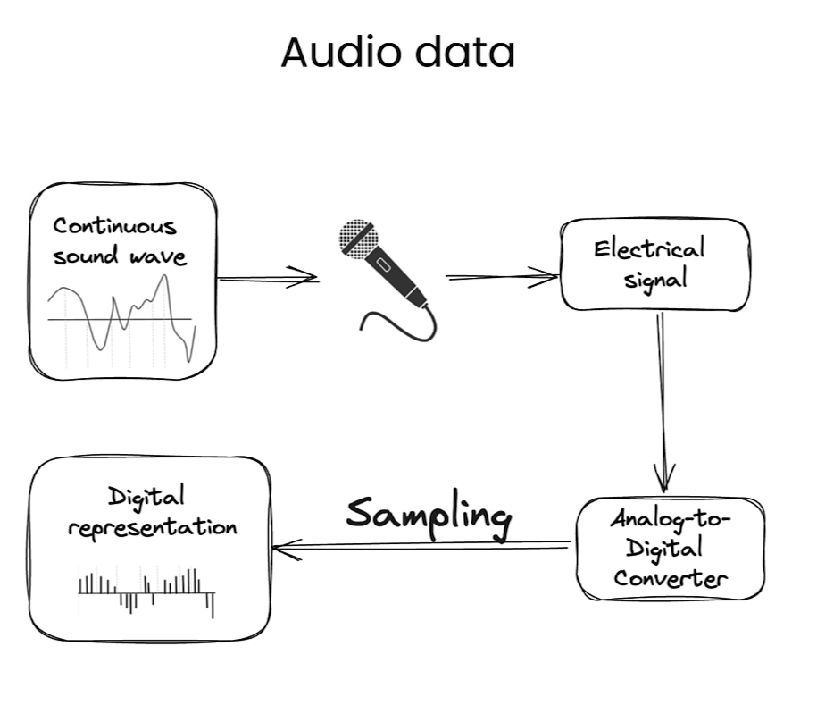


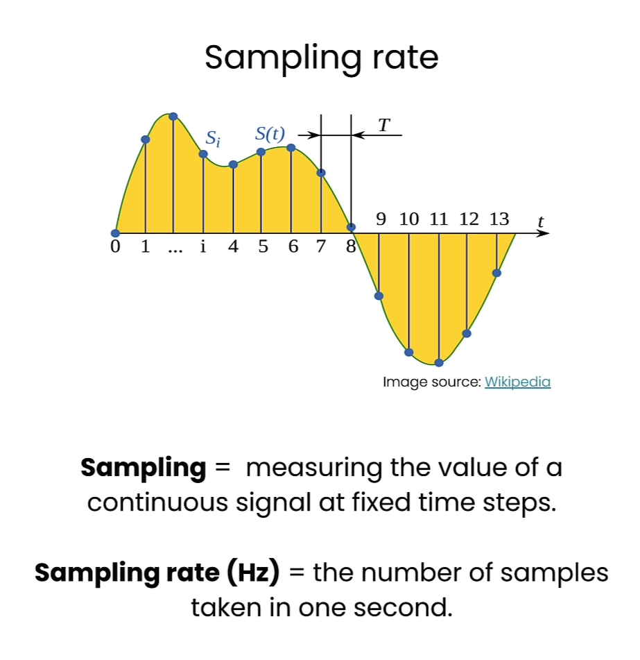

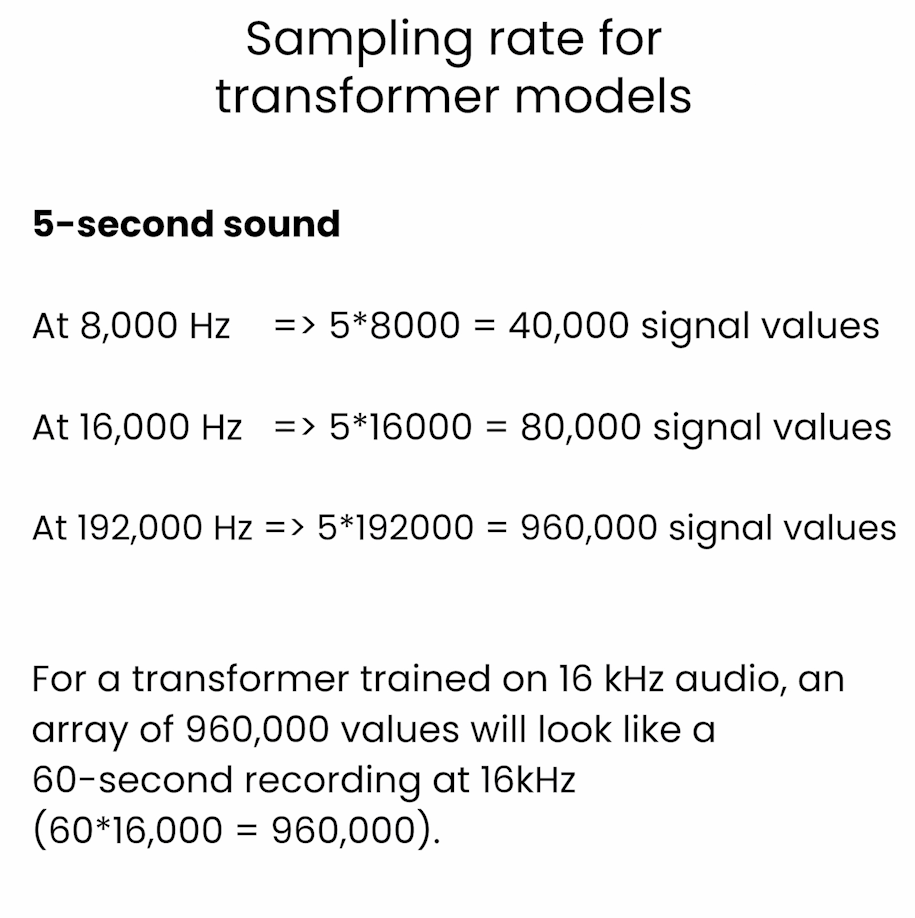

这个解释是在说明对于一个在16 kHz音频上训练的Transformer模型，一个包含960,000个值的数组看起来像是一个60秒长的16 kHz音频记录。这个解释涉及到音频信号的采样率和持续时间的关系。

在数字信号处理中，采样率表示在一秒钟内对信号进行采样的次数。16 kHz的采样率意味着在一秒钟内对信号进行了16,000次采样。

一个包含960,000个值的数组对应着一个60秒长的音频记录，因为960,000除以16,000等于60。所以，这个数组中的每个值代表着音频信号在每个采样点上的振幅或能量等信息，通过对这些值进行处理，可以分析和重构原始的音频信号。

- How long does 1 second of high resolution audio (192,000 Hz) appear to the Whisper model (which is trained to expect audio files at 16,000 Hz)? 

```py
(1 * 192000) / 16000 = 12
```

- The 1 second of high resolution audio appears to the model as if it is 12 seconds of audio.

- How about 5 seconds of audio?

```py
(5 * 192000) / 16000 = 60
```

- 5 seconds of high resolution audio appears to the model as if it is 60 seconds of audio.


```py
zero_shot_classifier.feature_extractor.sampling_rate # 48000
audio_sample["audio"]["sampling_rate"] # 44100
```


* Set the correct sampling rate for the input and the model.


```py
from datasets import Audio
dataset = dataset.cast_column(
    "audio",
     Audio(sampling_rate=48_000))
     
 audio_sample = dataset[0]
 
 audio_sample
```

Output

```json
{'filename': '1-100032-A-0.wav',
 'fold': 1,
 'target': 0,
 'category': 'dog',
 'esc10': True,
 'src_file': 100032,
 'take': 'A',
 'audio': {'path': None,
  'array': array([0., 0., 0., ..., 0., 0., 0.]),
  'sampling_rate': 48000}}
```


```py
candidate_labels = ["Sound of a dog",
                    "Sound of vacuum cleaner"]
                    
zero_shot_classifier(audio_sample["audio"]["array"],
                     candidate_labels=candidate_labels)
```


Output

```json
[{'score': 0.9985589385032654, 'label': 'Sound of a dog'},
 {'score': 0.0014411062002182007, 'label': 'Sound of vacuum cleaner'}]
```


```py
candidate_labels = ["Sound of a child crying",
                    "Sound of vacuum cleaner",
                    "Sound of a bird singing",
                    "Sound of an airplane"]

zero_shot_classifier(audio_sample["audio"]["array"],
                     candidate_labels=candidate_labels)
```


Output

```json
[{'score': 0.6172538995742798, 'label': 'Sound of a bird singing'},
 {'score': 0.21602486073970795, 'label': 'Sound of vacuum cleaner'},
 {'score': 0.1254722625017166, 'label': 'Sound of an airplane'},
 {'score': 0.041249003261327744, 'label': 'Sound of a child crying'}]
```


# Lesson 6: Automatic Speech Recognition


### Data preparation


```py
from datasets import load_dataset
dataset = load_dataset("librispeech_asr",
                       split="train.clean.100",
                       streaming=True,
                       trust_remote_code=True)
```


```py
example = next(iter(dataset))
dataset_head = dataset.take(5)
list(dataset_head)
```


Output

```json
[{'file': '374-180298-0000.flac',
  'audio': {'path': '374-180298-0000.flac',
   'array': array([ 7.01904297e-04,  7.32421875e-04,  7.32421875e-04, ...,
          -2.74658203e-04, -1.83105469e-04, -3.05175781e-05]),
   'sampling_rate': 16000},
  'text': 'CHAPTER SIXTEEN I MIGHT HAVE TOLD YOU OF THE BEGINNING OF THIS LIAISON IN A FEW LINES BUT I WANTED YOU TO SEE EVERY STEP BY WHICH WE CAME I TO AGREE TO WHATEVER MARGUERITE WISHED',
  'speaker_id': 374,
  'chapter_id': 180298,
  'id': '374-180298-0000'},
 {'file': '374-180298-0001.flac',
  'audio': {'path': '374-180298-0001.flac',
   'array': array([-9.15527344e-05, -1.52587891e-04, -1.52587891e-04, ...,
          -2.13623047e-04, -1.83105469e-04, -2.74658203e-04]),
   'sampling_rate': 16000},
  'text': "MARGUERITE TO BE UNABLE TO LIVE APART FROM ME IT WAS THE DAY AFTER THE EVENING WHEN SHE CAME TO SEE ME THAT I SENT HER MANON LESCAUT FROM THAT TIME SEEING THAT I COULD NOT CHANGE MY MISTRESS'S LIFE I CHANGED MY OWN",
  'speaker_id': 374,
  'chapter_id': 180298,
  'id': '374-180298-0001'},
 {'file': '374-180298-0002.flac',
  'audio': {'path': '374-180298-0002.flac',
   'array': array([-2.44140625e-04, -2.44140625e-04, -1.83105469e-04, ...,
           1.83105469e-04,  3.05175781e-05, -1.52587891e-04]),
   'sampling_rate': 16000},
  'text': 'I WISHED ABOVE ALL NOT TO LEAVE MYSELF TIME TO THINK OVER THE POSITION I HAD ACCEPTED FOR IN SPITE OF MYSELF IT WAS A GREAT DISTRESS TO ME THUS MY LIFE GENERALLY SO CALM',
  'speaker_id': 374,
  'chapter_id': 180298,
  'id': '374-180298-0002'},
 {'file': '374-180298-0003.flac',
  'audio': {'path': '374-180298-0003.flac',
   'array': array([-0.00024414, -0.00039673, -0.00057983, ...,  0.00018311,
           0.00024414,  0.00024414]),
   'sampling_rate': 16000},
  'text': 'ASSUMED ALL AT ONCE AN APPEARANCE OF NOISE AND DISORDER NEVER BELIEVE HOWEVER DISINTERESTED THE LOVE OF A KEPT WOMAN MAY BE THAT IT WILL COST ONE NOTHING',
  'speaker_id': 374,
  'chapter_id': 180298,
  'id': '374-180298-0003'},
 {'file': '374-180298-0004.flac',
  'audio': {'path': '374-180298-0004.flac',
   'array': array([0.00027466, 0.00030518, 0.00021362, ..., 0.00015259, 0.00015259,
          0.00015259]),
   'sampling_rate': 16000},
  'text': "NOTHING IS SO EXPENSIVE AS THEIR CAPRICES FLOWERS BOXES AT THE THEATRE SUPPERS DAYS IN THE COUNTRY WHICH ONE CAN NEVER REFUSE TO ONE'S MISTRESS AS I HAVE TOLD YOU I HAD LITTLE MONEY",
  'speaker_id': 374,
  'chapter_id': 180298,
  'id': '374-180298-0004'}]
```


```py
list(dataset_head)[2]
```


Output

```json
{'file': '374-180298-0002.flac',
 'audio': {'path': '374-180298-0002.flac',
  'array': array([-2.44140625e-04, -2.44140625e-04, -1.83105469e-04, ...,
          1.83105469e-04,  3.05175781e-05, -1.52587891e-04]),
  'sampling_rate': 16000},
 'text': 'I WISHED ABOVE ALL NOT TO LEAVE MYSELF TIME TO THINK OVER THE POSITION I HAD ACCEPTED FOR IN SPITE OF MYSELF IT WAS A GREAT DISTRESS TO ME THUS MY LIFE GENERALLY SO CALM',
 'speaker_id': 374,
 'chapter_id': 180298,
 'id': '374-180298-0002'}
```


```py
example
```

Output

```json
{'file': '374-180298-0000.flac',
 'audio': {'path': '374-180298-0000.flac',
  'array': array([ 7.01904297e-04,  7.32421875e-04,  7.32421875e-04, ...,
         -2.74658203e-04, -1.83105469e-04, -3.05175781e-05]),
  'sampling_rate': 16000},
 'text': 'CHAPTER SIXTEEN I MIGHT HAVE TOLD YOU OF THE BEGINNING OF THIS LIAISON IN A FEW LINES BUT I WANTED YOU TO SEE EVERY STEP BY WHICH WE CAME I TO AGREE TO WHATEVER MARGUERITE WISHED',
 'speaker_id': 374,
 'chapter_id': 180298,
 'id': '374-180298-0000'}
```


```py
from IPython.display import Audio as IPythonAudio

IPythonAudio(example["audio"]["array"],
             rate=example["audio"]["sampling_rate"])
```


### Build the pipeline


```py
from transformers import pipeline
asr = pipeline(task="automatic-speech-recognition",
               model="./models/distil-whisper/distil-small.en")
               
```


```py
asr.feature_extractor.sampling_rate # 16000
example['audio']['sampling_rate'] # 16000

asr(example["audio"]["array"])
```

Output

```json
{'text': ' Chapter 16 I might have told you of the beginning of this liaison in a few lines, but I wanted you to see every step by which we came. I too agree to whatever Marguerite wished.'}
```


```py
example["text"]
```

Output

```json
'CHAPTER SIXTEEN I MIGHT HAVE TOLD YOU OF THE BEGINNING OF THIS LIAISON IN A FEW LINES BUT I WANTED YOU TO SEE EVERY STEP BY WHICH WE CAME I TO AGREE TO WHATEVER MARGUERITE WISHED'
```


### Build a shareable app with Gradio

### Troubleshooting Tip
- Note, in the classroom, you may see the code for creating the Gradio app run indefinitely.
  - This is specific to this classroom environment when it's serving many learners at once, and you won't wouldn't experience this issue if you run this code on your own machine.
- To fix this, please restart the kernel (Menu Kernel->Restart Kernel) and re-run the code in the lab from the beginning of the lesson.


```py
import os
import gradio as gr
demo = gr.Blocks()

def transcribe_speech(filepath):
    if filepath is None:
        gr.Warning("No audio found, please retry.")
        return ""
    output = asr(filepath)
    return output["text"]
    
    
mic_transcribe = gr.Interface(
    fn=transcribe_speech,
    inputs=gr.Audio(sources="microphone",
                    type="filepath"),
    outputs=gr.Textbox(label="Transcription",
                       lines=3),
    allow_flagging="never")
```


To learn more about building apps with Gradio, you can check out the short course: [Building Generative AI Applications with Gradio](https://www.deeplearning.ai/short-courses/building-generative-ai-applications-with-gradio/), also taught by Hugging Face.


```py
file_transcribe = gr.Interface(
    fn=transcribe_speech,
    inputs=gr.Audio(sources="upload",
                    type="filepath"),
    outputs=gr.Textbox(label="Transcription",
                       lines=3),
    allow_flagging="never",
)

with demo:
    gr.TabbedInterface(
        [mic_transcribe,
         file_transcribe],
        ["Transcribe Microphone",
         "Transcribe Audio File"],
    )

demo.launch(share=True, 
            server_port=int(os.environ['PORT1']))
```

Output

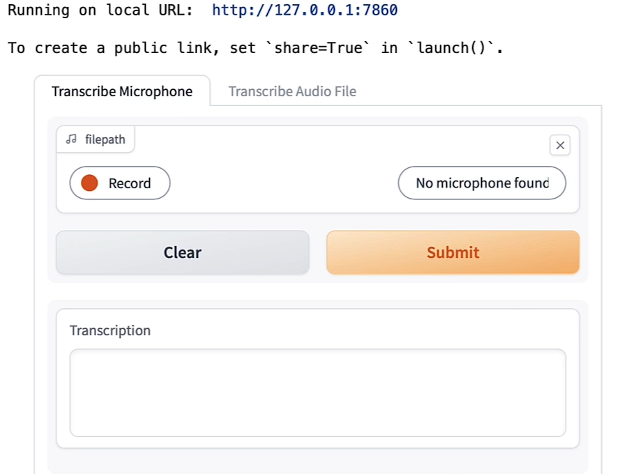


```py
demo.close()
```

Output

```py
Closing server running on port: 45227
```


* Convert the audio from stereo to mono (Using librosa)


```py
audio.shape # (3572352, 2)

import numpy as np

audio_transposed = np.transpose(audio)

audio_transposed.shape # (2, 3572352)

import librosa

audio_mono = librosa.to_mono(audio_transposed)

IPythonAudio(audio_mono,
             rate=sampling_rate)

asr(audio_mono)
```

Output

```json
{'text': " I'm sorry. or two. The problem is, is that you want to Yeah. You. Yeah. A the next week. The world is It's true. The war has become a huge and broad-world size. The war is there. What I can hear. The war is there. The song is, It's a Little Shoo's Talking. And then, How How How How? I'm sorry The story is about the record watching the watch again. The B."}
```

_Warning:_ The cell above might throw a warning because the sample rate of the audio sample is not the same of the sample rate of the model.

Let's check and fix this!


```py
sampling_rate # 44100
asr.feature_extractor.sampling_rate # 16000

audio_16KHz = librosa.resample(audio_mono,
                               orig_sr=sampling_rate,
                               target_sr=16000)
                               
asr(
    audio_16KHz,
    chunk_length_s=30, # 30 seconds
    batch_size=4,
    return_timestamps=True,
)["chunks"]
```

Output

```json
[{'timestamp': (0.0, 13.0),
  'text': ' They run. They laugh. I see the glow shining on their eyes. Not like hers. She seems distant, strange, somehow cold.'},
 {'timestamp': (13.0, 27.0),
  'text': " A couple of days after, I receive the call. I curse, scream, and cry. They're gone. I drink and cry and dream over and over. Why?"},
 {'timestamp': (27.0, 33.0),
  'text': ' Time drags me, expending days, months, or maybe years.'},
 {'timestamp': (33.0, 39.0),
  'text': ' But the pain still remains. It grows. It changes me.'},
 {'timestamp': (39.0, 43.0),
  'text': ' Someone tells me she got released from the psychiatric ward.'},
 {'timestamp': (43.0, 46.08),
  'text': ' 426 days after. I got confused. the psychiatric ward. 426 days after.'},
 {'timestamp': (46.08, 47.08), 'text': ' My head spins.'},
 {'timestamp': (47.08, 49.4), 'text': ' I got confused.'},
 {'timestamp': (49.4, 51.08), 'text': ' The loneliness.'},
 {'timestamp': (51.08, 52.56), 'text': " It's time."},
 {'timestamp': (52.56, 55.04), 'text': ' The road has become endless.'},
 {'timestamp': (55.04, 57.4), 'text': ' I feel the cold wind on my face.'},
 {'timestamp': (57.4, 59.52), 'text': ' My eyes burn.'},
 {'timestamp': (59.52, 61.08), 'text': ' I get to the house.'},
 {'timestamp': (61.08, 62.76), 'text': ' It all looks the same.'},
 {'timestamp': (62.76, 66.84),
  'text': ' I can hear them, laughing like there were no souls taken.'},
 {'timestamp': (66.84, 73.36),
  'text': ' And then she comes. She sees me with kindness in her eyes. She looks at the flowers and'},
 {'timestamp': (73.36, 80.44),
  'text': ' she says she still loves me. Those words hurt me like a razor blade. Good bye, my love.'}]
```


* Build the Gradio interface.


```py
import gradio as gr
demo = gr.Blocks()

def transcribe_long_form(filepath):
    if filepath is None:
        gr.Warning("No audio found, please retry.")
        return ""
    output = asr(
      filepath,
      max_new_tokens=256,
      chunk_length_s=30,
      batch_size=8,
    )
    return output["text"]
    
    
mic_transcribe = gr.Interface(
    fn=transcribe_long_form,
    inputs=gr.Audio(sources="microphone",
                    type="filepath"),
    outputs=gr.Textbox(label="Transcription",
                       lines=3),
    allow_flagging="never")

file_transcribe = gr.Interface(
    fn=transcribe_long_form,
    inputs=gr.Audio(sources="upload",
                    type="filepath"),
    outputs=gr.Textbox(label="Transcription",
                       lines=3),
    allow_flagging="never",
)
```


```py
with demo:
    gr.TabbedInterface(
        [mic_transcribe,
         file_transcribe],
        ["Transcribe Microphone",
         "Transcribe Audio File"],
    )
demo.launch(share=True, 
            server_port=int(os.environ['PORT1']))
```


Output

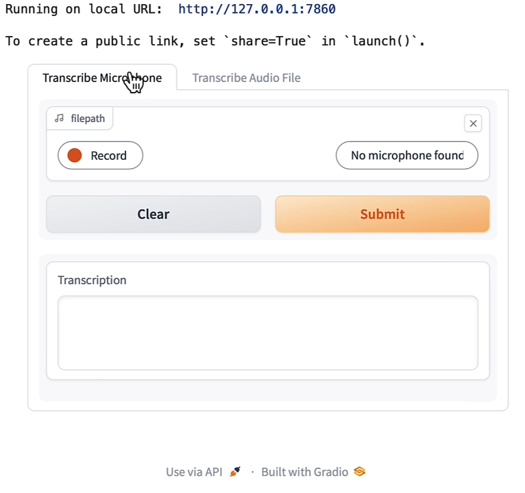

# Lesson 7: Text to Speech


- In the classroom, the libraries are already installed for you.
- If you would like to run this code on your own machine, you can install the following:

```py
    !pip install transformers
    !pip install gradio
    !pip install timm
    !pip install timm
    !pip install inflect
    !pip install phonemizer
    
```


**Note:**  `py-espeak-ng` is only available Linux operating systems.

To run locally in a Linux machine, follow these commands:
```py
    sudo apt-get update
    sudo apt-get install espeak-ng
    pip install py-espeak-ng
```


### Build the `text-to-speech` pipeline using the 🤗 Transformers Library


```py
from transformers import pipeline

narrator = pipeline("text-to-speech",
                    model="./models/kakao-enterprise/vits-ljs")
```


```py
text = """
Researchers at the Allen Institute for AI, \
HuggingFace, Microsoft, the University of Washington, \
Carnegie Mellon University, and the Hebrew University of \
Jerusalem developed a tool that measures atmospheric \
carbon emitted by cloud servers while training machine \
learning models. After a model’s size, the biggest variables \
were the server’s location and time of day it was active.
"""

narrated_text = narrator(text)

from IPython.display import Audio as IPythonAudio

IPythonAudio(narrated_text["audio"][0],
             rate=narrated_text["sampling_rate"])

```

# Lesson 8: Object Detection


- In the classroom, the libraries are already installed for you.
- If you would like to run this code on your own machine, you can install the following:

```py
    !pip install transformers
    !pip install gradio
    !pip install timm
    !pip install inflect
    !pip install phonemizer
```


### Build the `object-detection` pipeline using 🤗 Transformers Library

- This model was release with the paper [End-to-End Object Detection with Transformers](https://arxiv.org/abs/2005.12872) from Carion et al. (2020)


```py
from helper import load_image_from_url, render_results_in_image
from transformers import pipeline

from transformers.utils import logging
logging.set_verbosity_error()

from helper import ignore_warnings
ignore_warnings()

od_pipe = pipeline("object-detection", "./models/facebook/detr-resnet-50")
```

### Use the Pipeline


```py
from PIL import Image

raw_image = Image.open('huggingface_friends.jpg')
raw_image.resize((569, 491))

pipeline_output = od_pipe(raw_image)
```

- Return the results from the pipeline using the helper function `render_results_in_image`.


```py
processed_image = render_results_in_image(
    raw_image, 
    pipeline_output)
    
processed_image
```

Output

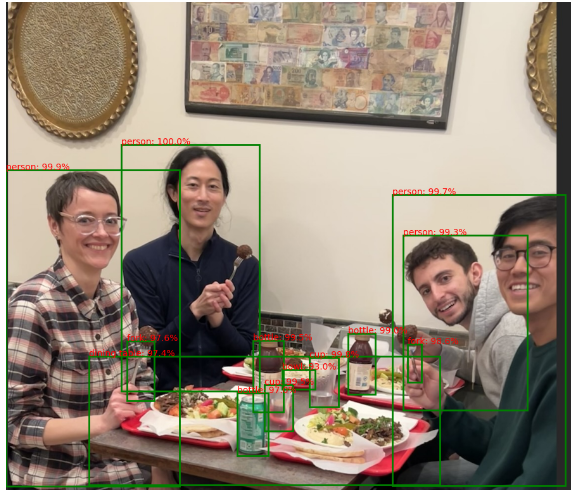


补充这个函数

```py
def render_results_in_image(in_pil_img, in_results):
    plt.figure(figsize=(16, 10))
    plt.imshow(in_pil_img)

    ax = plt.gca()

    for prediction in in_results:

        x, y = prediction['box']['xmin'], prediction['box']['ymin']
        w = prediction['box']['xmax'] - prediction['box']['xmin']
        h = prediction['box']['ymax'] - prediction['box']['ymin']

        ax.add_patch(plt.Rectangle((x, y),
                                   w,
                                   h,
                                   fill=False,
                                   color="green",
                                   linewidth=2))
        ax.text(
           x,
           y,
           f"{prediction['label']}: {round(prediction['score']*100, 1)}%",
           color='red'
        )

    plt.axis("off")

    # Save the modified image to a BytesIO object
    img_buf = io.BytesIO()
    plt.savefig(img_buf, format='png',
                bbox_inches='tight',
                pad_inches=0)
    img_buf.seek(0)
    modified_image = Image.open(img_buf)

    # Close the plot to prevent it from being displayed
    plt.close()

    return modified_image

```


### Using `Gradio` as a Simple Interface

- Use [Gradio](https://www.gradio.app) to create a demo for the object detection app.
- The demo makes it look friendly and easy to use.
- You can share the demo with your friends and colleagues as well.

```py
import os
import gradio as gr

def get_pipeline_prediction(pil_image):
    
    pipeline_output = od_pipe(pil_image)
    
    processed_image = render_results_in_image(pil_image,
                                            pipeline_output)
    return processed_image
    
    
demo = gr.Interface(
  fn=get_pipeline_prediction,
  inputs=gr.Image(label="Input image", 
                  type="pil"),
  outputs=gr.Image(label="Output image with predicted instances",
                   type="pil")
)
```

- `share=True` will provide an online link to access to the demo


```py
demo.launch(share=True, server_port=int(os.environ['PORT1']))
```


Output

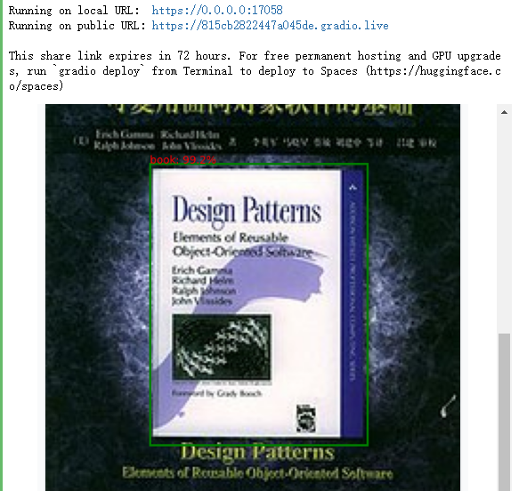

### Make an AI Powered Audio Assistant

- Combine the object detector with a text-to-speech model that will help dictate what is inside the image.

- Inspect the output of the object detection pipeline.


```py
pipeline_output
```

Output

```json
[{'score': 0.9856818318367004,
  'label': 'fork',
  'box': {'xmin': 808, 'ymin': 688, 'xmax': 836, 'ymax': 765}},
 {'score': 0.9904232025146484,
  'label': 'bottle',
  'box': {'xmin': 688, 'ymin': 667, 'xmax': 743, 'ymax': 789}},
 {'score': 0.9948464632034302,
  'label': 'cup',
  'box': {'xmin': 520, 'ymin': 770, 'xmax': 577, 'ymax': 863}},
 {'score': 0.9971936941146851,
  'label': 'person',
  'box': {'xmin': 778, 'ymin': 387, 'xmax': 1125, 'ymax': 972}},
 {'score': 0.9695369005203247,
  'label': 'bottle',
  'box': {'xmin': 465, 'ymin': 786, 'xmax': 527, 'ymax': 912}},
 {'score': 0.9300816059112549,
  'label': 'bowl',
  'box': {'xmin': 556, 'ymin': 739, 'xmax': 622, 'ymax': 779}},
 {'score': 0.9995697140693665,
  'label': 'person',
  'box': {'xmin': 231, 'ymin': 286, 'xmax': 510, 'ymax': 783}},
 {'score': 0.9992026686668396,
  'label': 'person',
  'box': {'xmin': 0, 'ymin': 338, 'xmax': 349, 'ymax': 974}},
 {'score': 0.9742276668548584,
  'label': 'dining table',
  'box': {'xmin': 167, 'ymin': 712, 'xmax': 873, 'ymax': 971}},
 {'score': 0.9756981730461121,
  'label': 'fork',
  'box': {'xmin': 243, 'ymin': 682, 'xmax': 298, 'ymax': 802}},
 {'score': 0.9946128129959106,
  'label': 'bottle',
  'box': {'xmin': 497, 'ymin': 681, 'xmax': 558, 'ymax': 824}},
 {'score': 0.9976205229759216,
  'label': 'cup',
  'box': {'xmin': 610, 'ymin': 715, 'xmax': 669, 'ymax': 814}},
 {'score': 0.993443489074707,
  'label': 'person',
  'box': {'xmin': 799, 'ymin': 469, 'xmax': 1049, 'ymax': 821}}]
```


```py
raw_image = Image.open('huggingface_friends.jpg')
raw_image.resize((284, 245))

from helper import summarize_predictions_natural_language

text = summarize_predictions_natural_language(pipeline_output)

text
```

Output

```json
'In this image, there are two forks three bottles two cups four persons one bowl and one dining table.'
```

summarize_predictions_natural_language函数的实现如下：

```py
def summarize_predictions_natural_language(predictions):
    summary = {}
    p = inflect.engine()

    for prediction in predictions:
        label = prediction['label']
        if label in summary:
            summary[label] += 1
        else:
            summary[label] = 1

    result_string = "In this image, there are "
    for i, (label, count) in enumerate(summary.items()):
        count_string = p.number_to_words(count)
        result_string += f"{count_string} {label}"
        if count > 1:
          result_string += "s"

        result_string += " "

        if i == len(summary) - 2:
          result_string += "and "

    # Remove the trailing comma and space
    result_string = result_string.rstrip(', ') + "."

    return result_string

```

### Generate Audio Narration of an Image


```py
tts_pipe = pipeline("text-to-speech",
                    model="./models/kakao-enterprise/vits-ljs")

narrated_text = tts_pipe(text)
```

### Play the Generated Audio


```py
from IPython.display import Audio as IPythonAudio

IPythonAudio(narrated_text["audio"][0],
             rate=narrated_text["sampling_rate"])
```


# Lesson 9: Segmentation

- In the classroom, the libraries are already installed for you.
- If you would like to run this code on your own machine, you can install the following:

```py
    !pip install transformers
    !pip install gradio
    !pip install timm
    !pip install torchvision
```

### Mask Generation with SAM

The [Segment Anything Model (SAM)](https://segment-anything.com) model was released by Meta AI.


```py
from transformers import pipeline

sam_pipe = pipeline("mask-generation",
    "./models/Zigeng/SlimSAM-uniform-77")
```


```py
from PIL import Image
raw_image = Image.open('meta_llamas.jpg')
raw_image.resize((720, 375))
```

Output

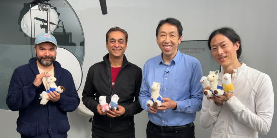

- Running this will take some time
- The higher the value of 'points_per_batch', the more efficient pipeline inference will be


```py
output = sam_pipe(raw_image, points_per_batch=32)

from helper import show_pipe_masks_on_image

show_pipe_masks_on_image(raw_image, output)
```

Output

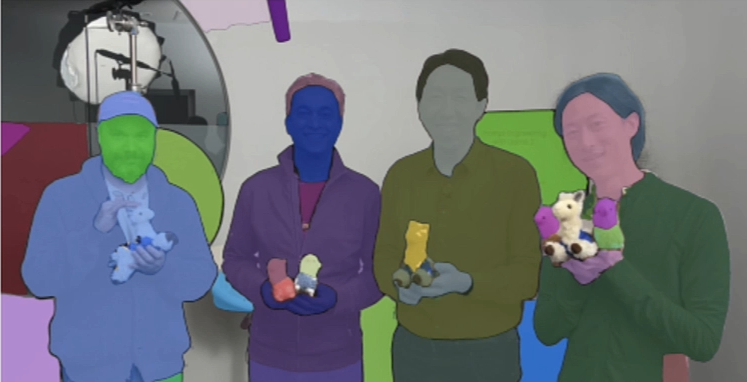


### Faster Inference: Infer an Image and a Single Point


```py
from transformers import SamModel, SamProcessor

model = SamModel.from_pretrained(
    "./models/Zigeng/SlimSAM-uniform-77")

processor = SamProcessor.from_pretrained(
    "./models/Zigeng/SlimSAM-uniform-77")
    
raw_image.resize((720, 375))
```


- Segment the blue shirt Andrew is wearing.
- Give any single 2D point that would be in that region (blue shirt).


```py
input_points = [[[1600, 700]]]
```

- Create the input using the image and the single point.
- `return_tensors="pt"` means to return PyTorch Tensors.


```py
inputs = processor(raw_image,
                 input_points=input_points,
                 return_tensors="pt")

import torch

with torch.no_grad():
    outputs = model(**inputs)
    
predicted_masks = processor.image_processor.post_process_masks(
    outputs.pred_masks,
    inputs["original_sizes"],
    inputs["reshaped_input_sizes"]
)
```


 Length of `predicted_masks` corresponds to the number of images that are used in the input.


```py
len(predicted_masks)
```


- Inspect the size of the first ([0]) predicted mask

```py
predicted_mask = predicted_masks[0]
predicted_mask.shape # torch.Size([1, 3, 1500, 2880])
 
outputs.iou_scores # tensor([[[0.9583, 0.9551, 0.9580]]])
from helper import show_mask_on_image

for i in range(3):
    show_mask_on_image(raw_image, predicted_mask[:, i])
```

Output

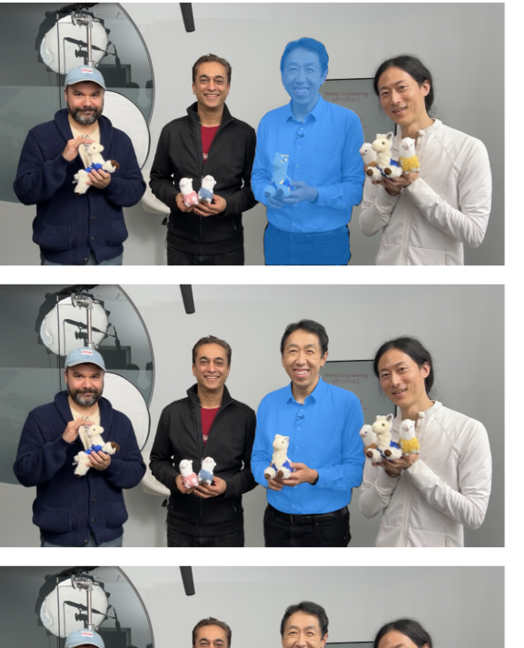

## Depth Estimation with DPT

- This model was introduced in the paper [Vision Transformers for Dense Prediction](https://arxiv.org/abs/2103.13413) by Ranftl et al. (2021) and first released in [isl-org/DPT](https://github.com/isl-org/DPT).


```py
depth_estimator = pipeline(task="depth-estimation",
                        model="./models/Intel/dpt-hybrid-midas")

raw_image = Image.open('gradio_tamagochi_vienna.png')
raw_image.resize((806, 621))
```

Output


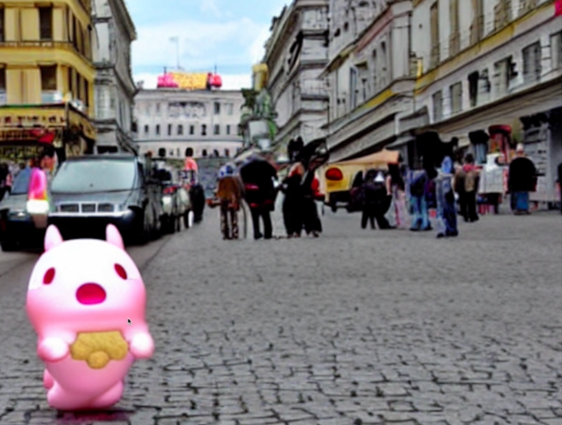


```
output = depth_estimator(raw_image)
```

- Post-process the output image to resize it to the size of the original image.

```py
output["predicted_depth"].shape # torch.Size([1, 384, 384])
output["predicted_depth"].unsqueeze(1).shape # torch.Size([1, 1, 384, 384])
```


```py
prediction = torch.nn.functional.interpolate(
    output["predicted_depth"].unsqueeze(1),
    size=raw_image.size[::-1],
    mode="bicubic",
    align_corners=False,
)

prediction.shape  # torch.Size([1, 1, 1242, 1612])
raw_image.size[::-1], # ((1242, 1612),)

prediction
```


```py
import numpy as np 
output = prediction.squeeze().numpy()
formatted = (output * 255 / np.max(output)).astype("uint8")
depth = Image.fromarray(formatted)

depth
```

Output


### Demo using Gradio

 Troubleshooting Tip

- Note, in the classroom, you may see the code for creating the Gradio app run indefinitely.
  - This is specific to this classroom environment when it's serving many learners at once, and you won't wouldn't experience this issue if you run this code on your own machine.
- To fix this, please restart the kernel (Menu Kernel->Restart Kernel) and re-run the code in the lab from the beginning of the lesson.


```py
import os
import gradio as gr
from transformers import pipeline

def launch(input_image):
    out = depth_estimator(input_image)

    # resize the prediction
    prediction = torch.nn.functional.interpolate(
        out["predicted_depth"].unsqueeze(1),
        size=input_image.size[::-1],
        mode="bicubic",
        align_corners=False,
    )

    # normalize the prediction
    output = prediction.squeeze().numpy()
    formatted = (output * 255 / np.max(output)).astype("uint8")
    depth = Image.fromarray(formatted)
    return depth
    
iface = gr.Interface(launch, 
                     inputs=gr.Image(type='pil'), 
                     outputs=gr.Image(type='pil'))
                     
iface.launch(share=True, server_port=int(os.environ['PORT1']))
```


# Lesson 10: Image Retrieval


- In the classroom, the libraries are already installed for you.
- If you would like to run this code on your own machine, you can install the following:

```py
    !pip install transformers
    !pip install torch
```


- Load the model and the processor

```py
from transformers import BlipForImageTextRetrieval
model = BlipForImageTextRetrieval.from_pretrained(
    "./models/Salesforce/blip-itm-base-coco")

from transformers import AutoProcessor

processor = AutoProcessor.from_pretrained(
    "./models/Salesforce/blip-itm-base-coco")

img_url = 'https://storage.googleapis.com/sfr-vision-language-research/BLIP/demo.jpg'

from PIL import Image
import requests

raw_image =  Image.open(
    requests.get(img_url, stream=True).raw).convert('RGB')


```

Output


### Test, if the image matches the text


```py
text = "an image of a woman and a dog on the beach"

inputs = processor(images=raw_image,
                   text=text,
                   return_tensors="pt")
                   
itm_scores = model(**inputs)[0]

itm_scores # tensor([[-2.2228,  2.2260]], grad_fn=<AddmmBackward0>)
```


- Use a softmax layer to get the probabilities


```
import torch

itm_score = torch.nn.functional.softmax(
    itm_scores,dim=1)
    
itm_score

print(f"""\
The image and text are matched \
with a probability of {itm_score[0][1]:.4f}""")
```

Output

```py
The image and text are matched with a probability of 0.9884
```


# Lesson 11: Image Captioning


```py
from transformers import BlipForConditionalGeneration
model = BlipForConditionalGeneration.from_pretrained(
    "./models/Salesforce/blip-image-captioning-base")
    
from transformers import AutoProcessor

processor = AutoProcessor.from_pretrained(
    "./models/Salesforce/blip-image-captioning-base")
    
from PIL import Image

image = Image.open("./beach.jpeg")
```

照片同lesson 10

### Conditional Image Captioning


```py
text = "a photograph of"
inputs = processor(image, text, return_tensors="pt")

out = model.generate(**inputs) 
```

Output

```py
tensor([[30522,  1037,  9982,  1997,  1037,  2450,  1998,  2014,  3899,  2006,
          1996,  3509,   102]])
```


```py
print(processor.decode(out[0], skip_special_tokens=True))
```

Output

```py
a photograph of a woman and her dog on the beach
```


### Unconditional Image Captioning


```py
inputs = processor(image,return_tensors="pt")

out = model.generate(**inputs)

print(processor.decode(out[0], skip_special_tokens=True))
```

Output

```py
a woman sitting on the beach with her dog
```


# Lesson 12: Visual Question & Answering


```py
from transformers import BlipForQuestionAnswering
model = BlipForQuestionAnswering.from_pretrained(
    "./models/Salesforce/blip-vqa-base")
    
from transformers import AutoProcessor

processor = AutoProcessor.from_pretrained(
    "./models/Salesforce/blip-vqa-base")
    
from PIL import Image

image = Image.open("./beach.jpeg") # 照片同lesson 10

question = "how many dogs are in the picture?"

inputs = processor(image, question, return_tensors="pt")


out = model.generate(**inputs)

print(processor.decode(out[0], skip_special_tokens=True)) # Output： 1
```

# Lesson 13: Zero-Shot Image Classification

CLIP

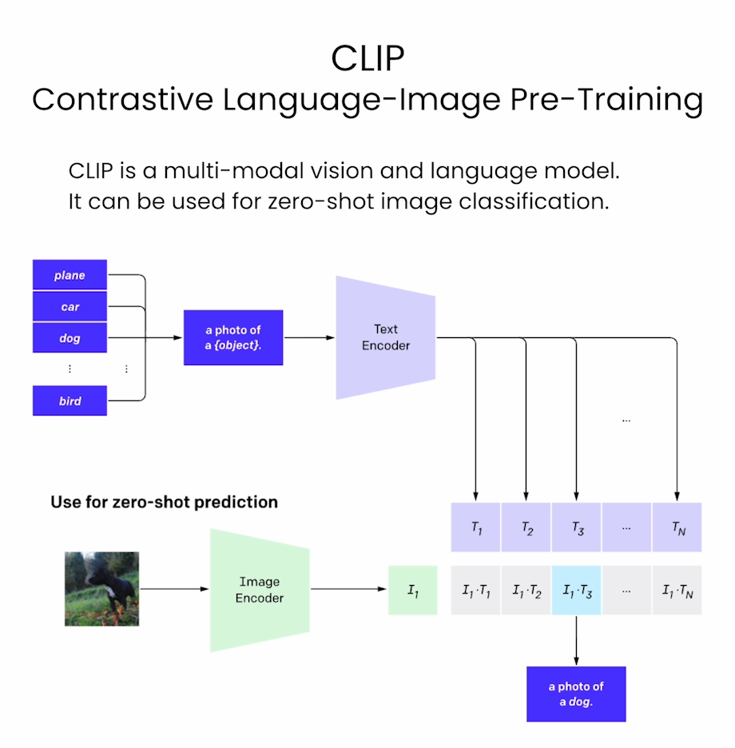


```py
from transformers import CLIPModel
model = CLIPModel.from_pretrained(
    "./models/openai/clip-vit-large-patch14")
from transformers import AutoProcessor
processor = AutoProcessor.from_pretrained(
    "./models/openai/clip-vit-large-patch14")
```


```py
from PIL import Image
image = Image.open("./kittens.jpeg")
```

Output


- Set the list of labels from which you want the model to classify the image (above).

```py
labels = ["a photo of a cat", "a photo of a dog"]

inputs = processor(text=labels,
                   images=image,
                   return_tensors="pt",
                   padding=True)
                   
outputs = model(**inputs)

outputs.logits_per_image # tensor([[18.9041, 11.7159]]

probs = outputs.logits_per_image.softmax(dim=1)[0] # tensor([9.9925e-01, 7.5487e-04]

probs = list(probs)
for i in range(len(labels)):
  print(f"label: {labels[i]} - probability of {probs[i].item():.4f}")
```

Output

```py
label: a photo of a cat - probability of 0.9992
label: a photo of a dog - probability of 0.0008
```


# 后记

2024年3月9日完成这门课，这是HuggingFace团队在DeepLearning.AI网站上开的short course，主要是介绍HF中模型的使用。