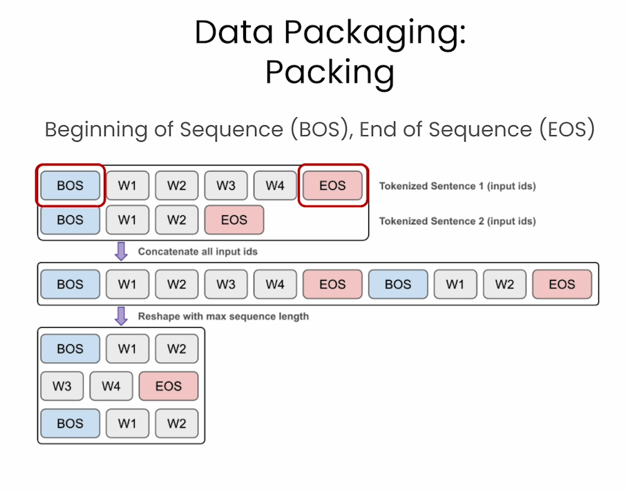

# Pretraining LLMs


本文是学习 [https://www.deeplearning.ai/short-courses/pretraining-llms/](https://www.deeplearning.ai/short-courses/pretraining-llms/) 这门课的学习笔记。


## What you’ll learn in this course

In **Pretraining LLMs** you’ll explore the first step of training large language models using a technique called pretraining. You’ll learn the essential steps to pretrain an LLM, understand the associated costs, and discover how starting with smaller, existing open source models can be more cost-effective.

Pretraining involves teaching an LLM to predict the next token using vast text datasets, resulting in a base model, and this base model requires further fine-tuning for optimal performance and safety. In this course, you’ll learn to pretrain a model from scratch and also to take a model that’s already been pretrained and continue the pretraining process on your own data. 

In detail: 

- Explore scenarios where pretraining is the optimal choice for model performance. Compare text generation across different versions of the same model to understand the performance differences between base, fine-tuned, and specialized pre-trained models.
- Learn how to create a high-quality training dataset using web text and existing datasets, which is crucial for effective model pretraining.
- Prepare your cleaned dataset for training. Learn how to package your training data for use with the Hugging Face library.
- Explore ways to configure and initialize a model for training and see how these choices impact the speed of pretraining.
- Learn how to configure and execute a training run, enabling you to train your own model.
- Learn how to assess your trained model’s performance and explore common evaluation strategies for LLMs, including important benchmark tasks used to compare different models’ performance.

After taking this course, you’ll be equipped with the skills to pretrain a model—from data preparation and model configuration to performance evaluation.


@[toc]

# Lesson 1: Why Pretraining?


Multi-stage Continual Training


Price comparisons by training step


## 1. Install dependencies and fix seed

Welcome to Lesson 1!

If you would like to access the `requirements.txt` file for this course, go to `File` and click on `Open`.


```py
# Install any packages if it does not exist
# !pip install -q -r ../requirements.txt

# Ignore insignificant warnings (ex: deprecations)
import warnings
warnings.filterwarnings('ignore')

# Set a seed for reproducibility
import torch

def fix_torch_seed(seed=42):
    torch.manual_seed(seed)
    torch.cuda.manual_seed(seed)
    torch.backends.cudnn.deterministic = True
    torch.backends.cudnn.benchmark = False

fix_torch_seed()
```


## 2. Load a general pretrained model

This course will work with small models that fit within the memory of the learning platform. TinySolar-248m-4k is a small decoder-only model with 248M parameters (similar in scale to GPT2) and a 4096 token context window. You can find the model on the Hugging Face model library at [this link](https://huggingface.co/upstage/TinySolar-248m-4k).

You'll load the model in three steps:
1. Specify the path to the model in the Hugging Face model library
2. Load the model using `AutoModelforCausalLM` in the `transformers` library
3. Load the tokenizer for the model from the same model path


```py
model_path_or_name = "./models/upstage/TinySolar-248m-4k"

from transformers import AutoModelForCausalLM
tiny_general_model = AutoModelForCausalLM.from_pretrained(
    model_path_or_name,
    device_map="cpu", # change to auto if you have access to a GPU
    torch_dtype=torch.bfloat16
)

from transformers import AutoTokenizer
tiny_general_tokenizer = AutoTokenizer.from_pretrained(
    model_path_or_name
)
```

## 3. Generate text samples

Here you'll try generating some text with the model. You'll set a prompt, instantiate a text streamer, and then have the model complete the prompt:

```py
prompt = "I am an engineer. I love"

inputs = tiny_general_tokenizer(prompt, return_tensors="pt")


from transformers import TextStreamer
streamer = TextStreamer(
    tiny_general_tokenizer,
    skip_prompt=True, # If you set to false, the model will first return the prompt and then the generated text
    skip_special_tokens=True
)


outputs = tiny_general_model.generate(
    **inputs, 
    streamer=streamer, 
    use_cache=True,
    max_new_tokens=128,
    do_sample=False, 
    temperature=0.0,
    repetition_penalty=1.1
)
```

Output

```py
to travel and have a great time, but I'm not sure if I can do it all again.
I've been working on my first book for the last 10 years, and I've always wanted to write about books that are more than just a collection of short stories. I've also written a few short stories, which I hope will be published in a future anthology.
I've been writing fiction since I was 12, and I've read many different genres over the years. I've also written a number of non-fiction books, including a novel called
```


## 4. Generate Python samples with pretrained general model

Use the model to write a python function called `find_max()` that finds the maximum value in a list of numbers:


```py
prompt =  "def find_max(numbers):"

inputs = tiny_general_tokenizer(
    prompt, return_tensors="pt"
).to(tiny_general_model.device)

streamer = TextStreamer(
    tiny_general_tokenizer, 
    skip_prompt=True, # Set to false to include the prompt in the output
    skip_special_tokens=True
)
outputs = tiny_general_model.generate(
    **inputs, 
    streamer=streamer, 
    use_cache=True, 
    max_new_tokens=128, 
    do_sample=False, 
    temperature=0.0, 
    repetition_penalty=1.1
)
```

Output

```py
      """
       Returns the number of times a user has been added to the list.
       """
       return num_users() + 1

   def get_user_id(self, id):
       """
       Returns the number of users that have been added to the list.
       """
       return self._get_user_id(id)

   def get_user_name(self, name):
       """
       Returns the name of the user that has been added to the list.
       """
       return self._get_user_name(name
```


## 5. Generate Python samples with finetuned Python model

This model has been fine-tuned on instruction code examples. You can find the model and information about the fine-tuning datasets on the Hugging Face model library at [this link](https://huggingface.co/upstage/TinySolar-248m-4k-code-instruct).

You'll follow the same steps as above to load the model and use it to generate text.


```py
model_path_or_name = "./models/upstage/TinySolar-248m-4k-code-instruct"

tiny_finetuned_model = AutoModelForCausalLM.from_pretrained(
    model_path_or_name,
    device_map="cpu",
    torch_dtype=torch.bfloat16,
)

tiny_finetuned_tokenizer = AutoTokenizer.from_pretrained(
    model_path_or_name
)

prompt =  "def find_max(numbers):"

inputs = tiny_finetuned_tokenizer(
    prompt, return_tensors="pt"
).to(tiny_finetuned_model.device)

streamer = TextStreamer(
    tiny_finetuned_tokenizer,
    skip_prompt=True,
    skip_special_tokens=True
)

outputs = tiny_finetuned_model.generate(
    **inputs,
    streamer=streamer,
    use_cache=True,
    max_new_tokens=128,
    do_sample=False,
    temperature=0.0,
    repetition_penalty=1.1
)
```

Output

~~~py
   if len(numbers) == 0:
       return "Invalid input"
   else:
       return numbers[i]
```

In this solution, the `find_max` function takes a list of numbers as input and returns the maximum value in that list. It then iterates through each number in the list and checks if it is greater than or equal to 1. If it is, it adds it to the `max` list. Finally, it returns the maximum value found so far.
~~~


## 6. Generate Python samples with pretrained Python model

Here you'll use a version of TinySolar-248m-4k that has been further pretrained (a process called **continued pretraining**) on a large selection of python code samples. You can find the model on Hugging Face at [this link](https://huggingface.co/upstage/TinySolar-248m-4k-py).

You'll follow the same steps as above to load the model and use it to generate text.

```py
model_path_or_name = "./models/upstage/TinySolar-248m-4k-py" 

tiny_custom_model = AutoModelForCausalLM.from_pretrained(
    model_path_or_name,
    device_map="cpu",
    torch_dtype=torch.bfloat16,    
)

tiny_custom_tokenizer = AutoTokenizer.from_pretrained(
    model_path_or_name
)

prompt = "def find_max(numbers):"

inputs = tiny_custom_tokenizer(
    prompt, return_tensors="pt"
).to(tiny_custom_model.device)

streamer = TextStreamer(
    tiny_custom_tokenizer,
    skip_prompt=True, 
    skip_special_tokens=True
)

outputs = tiny_custom_model.generate(
    **inputs, streamer=streamer,
    use_cache=True, 
    max_new_tokens=128, 
    do_sample=False, 
    repetition_penalty=1.1
)
```


Output

```py
 """Find the maximum number of numbers in a list."""
   max = 0
   for num in numbers:
       if num > max:
           max = num
   return max
```

Try running the python code the model generated above:


```py
def find_max(numbers):
   max = 0
   for num in numbers:
       if num > max:
           max = num
   return max

find_max([1,3,5,1,6,7,2])
```

Output: 7


# Lecture 2: Data Preparation

Pre-Training


Fine-Tuning


Resources


Quality Data


Data Cleaning


In this lesson you'll carry out some of the data cleaning steps required to prepare data for pretraining. In the video, Sung mentioned an Upstage tool called **Dataverse** which can help you with data cleaning. You can checkout the features of Dataverse at [this link](https://github.com/UpstageAI/dataverse).


## 1. Sourcing datasets for pretraining

In this section, you'll see two ways to source data for training:
1. Download an existing dataset from Hugging Face
2. Create a dataset of python scripts sourced from Github

In both cases the result will be a Hugging Face `Dataset` object, part of the `Datasets` library. You can read more about the properties of Datasets and how to work with them on the [Hugging Face website](https://huggingface.co/docs/datasets/en/index).

### Download data from Hugging face

The dataset you download here is a subset of a much larger dataset called **Red Pajama**. The full, 1 trillion token dataset is available on Hugging Face at [this link](https://huggingface.co/datasets/togethercomputer/RedPajama-Data-1T).

```py
import datasets
pretraining_dataset = datasets.load_dataset(
    "upstage/Pretraining_Dataset",
    split="train"
)
print(pretraining_dataset)
```

Output

```py
Dataset({
    features: ['text', 'meta'],
    num_rows: 60000
})
```


Only work with the `text` column:

```py
pretraining_dataset = pretraining_dataset.select_columns(
    ["text"]
)
print(pretraining_dataset[0]["text"][:500])
```

Output

```py
In 1793 Zaman Shah, a grandson of Ahmad Shah Durrani, won a brief war of succession to become ruler of Afghanistan. The support of Painda Khan, chief of the Baraksai branch of the Durrani tribe, was decisive in his victory. In the next fifty year., the brothers of Zaman shah and the sons of Painda Khan were to dominate the affairs of Afghanistan. The Durrani tribe was very large with several branches and numerous clans. 1 Abmad Shah and his successors belonged to the Sadozai clan, but other clan
```

### Compare pretraining and fine-tuning datasets
In the next cell, you'll download a fine-tuning dataset to contrast with the pretraining dataset you loaded above. You can read more about the Alpaca model and instruction tuning dataset [here](https://crfm.stanford.edu/2023/03/13/alpaca.html). 


```py
instruction_dataset = datasets.load_dataset(
    "c-s-ale/alpaca-gpt4-data",
    split='train'
)
print(instruction_dataset)
```

Output

```py
Dataset({
    features: ['instruction', 'input', 'output'],
    num_rows: 52002
})
```


```py
i=0
print("Instruction: " + instruction_dataset[i]["instruction"] 
      + "\nInput: " + instruction_dataset[i]["input"] 
      + "\nOutput: " + instruction_dataset[i]["output"])
```

Output

```py
Instruction: Give three tips for staying healthy.
Input: 
Output: 1. Eat a balanced and nutritious diet: Make sure your meals are inclusive of a variety of fruits and vegetables, lean protein, whole grains, and healthy fats. This helps to provide your body with the essential nutrients to function at its best and can help prevent chronic diseases.

2. Engage in regular physical activity: Exercise is crucial for maintaining strong bones, muscles, and cardiovascular health. Aim for at least 150 minutes of moderate aerobic exercise or 75 minutes of vigorous exercise each week.

3. Get enough sleep: Getting enough quality sleep is crucial for physical and mental well-being. It helps to regulate mood, improve cognitive function, and supports healthy growth and immune function. Aim for 7-9 hours of sleep each night.
```


Notice how in contrast to the pretraining data, which is just raw text, fine-tuning datasets are structured into question-answer pairs or instruction-response sets that can include additional input context if required. 

Moving forward, you'll only work with the unstructured pretraining dataset.


### Scrape python code from Github
Here, you'll download a selection of python scripts from Github and then prepare them as a Hugging Face `Dataset` object to use in training. 

The same pattern here will work for preparing any text scraped from the web.


```py
# Import some required packages
import os
import requests

# Path to directory to store python scripts
code_dir = "./code"
```


```py
urls = [
    "https://raw.githubusercontent.com/TheAlgorithms/Python/master/searches/double_linear_search_recursion.py",
    "https://raw.githubusercontent.com/KosingZhu/tensorflow/master/tensorflow/python/tools/module_util.py",
    "https://raw.githubusercontent.com/EricRemmerswaal/tensorflow/master/tensorflow/python/distribute/distribute_coordinator_context.py",
    "https://raw.githubusercontent.com/computationalartist/tensorflow/master/tensorflow/python/ops/numpy_ops/integration_test/benchmarks/numpy_mlp.py",
    "https://raw.githubusercontent.com/Van-an/tensorflow/master/tensorflow/python/distribute/coordinator/values.py",
    "https://raw.githubusercontent.com/nkgwer/tensorflow/master/tensorflow/lite/tools/visualize.py",
    "https://raw.githubusercontent.com/gitblazer/youtube-dl/master/youtube_dl/version.py",
    "https://raw.githubusercontent.com/Joshua-Barawa/My-Photos/master/venv/lib/python3.8/site-packages/django/contrib/messages/__init__.py",
    "https://raw.githubusercontent.com/PaliC/pytorch/master/test/fx/test_subgraph_rewriter.py"
]
```

Retrieve the python scripts:

```py
for url in urls:
    print(f"Working on url: {url}")
    response = requests.get(url)
    file_name = os.path.basename(url)
    file_path = os.path.join(code_dir, file_name)
    
    with open(file_path, "wb") as file:
        file.write(response.content)
```

Output

```py
Working on url: https://raw.githubusercontent.com/TheAlgorithms/Python/master/searches/double_linear_search_recursion.py
Working on url: https://raw.githubusercontent.com/KosingZhu/tensorflow/master/tensorflow/python/tools/module_util.py
Working on url: https://raw.githubusercontent.com/EricRemmerswaal/tensorflow/master/tensorflow/python/distribute/distribute_coordinator_context.py
Working on url: https://raw.githubusercontent.com/computationalartist/tensorflow/master/tensorflow/python/ops/numpy_ops/integration_test/benchmarks/numpy_mlp.py
Working on url: https://raw.githubusercontent.com/Van-an/tensorflow/master/tensorflow/python/distribute/coordinator/values.py
Working on url: https://raw.githubusercontent.com/nkgwer/tensorflow/master/tensorflow/lite/tools/visualize.py
Working on url: https://raw.githubusercontent.com/gitblazer/youtube-dl/master/youtube_dl/version.py
Working on url: https://raw.githubusercontent.com/Joshua-Barawa/My-Photos/master/venv/lib/python3.8/site-packages/django/contrib/messages/__init__.py
Working on url: https://raw.githubusercontent.com/PaliC/pytorch/master/test/fx/test_subgraph_rewriter.py
```


```py
files = os.listdir(code_dir)
for file in files:
    print(file)
```

Output

```py
double_linear_search_recursion.py
module_util.py
distribute_coordinator_context.py
numpy_mlp.py
values.py
visualize.py
version.py
__init__.py
test_subgraph_rewriter.py
```


Concatenate scripts into a list:

```py
code_dataset = []
for file in os.listdir(code_dir):
    code_dataset.append(
        {'text': open(os.path.join(code_dir, file), 'r').read()}
    )
```

Convert list to Hugging Face `Dataset` object:

```py
code_dataset = datasets.Dataset.from_list(code_dataset)
print(code_dataset)
```

Output

```py
Dataset({
    features: ['text'],
    num_rows: 9
})
```

Combine the python code dataset with the pretraining dataset you downloaded above:

```py
dataset = datasets.concatenate_datasets(
    [pretraining_dataset, code_dataset]
)
print(dataset)
```

Output

```py
Dataset({
    features: ['text'],
    num_rows: 60009
})
```


## 2. Data cleaning

In the cells below, you'll carry out the following cleaning steps:
1. Filter out samples that are too short
2. Remove repetitions within a single text example
3. Remove duplicated documents
4. Quality filter to remove non-English texts 


### Remove examples that are too short


```py
import heapq

dataset.num_rows # 60009

def paragraph_length_filter(x):
    """Returns False iff a page has too few lines or lines are too short."""
    lines = x['text'].split('\n')
    if (
        len(lines) < 3
        or min(heapq.nlargest(3, [len(line) for line in lines])) < 3
    ):
        return False
    return True


dataset = dataset.filter(
    paragraph_length_filter,
    load_from_cache_file=False
)
dataset.num_rows # 52357
```

### Remove repeated text within training examples

Here you'll remove text repetitions within each example. 


```py
def find_duplicates(paragraphs):
    """
    Use this function to find the number of repetitions 
    in the paragraphs.
    """
    unique_x = set()
    duplicate_chars = 0
    duplicate_elements = 0
    for element in paragraphs:
        if element in unique_x:
            duplicate_chars += len(element)
            duplicate_elements += 1
        else:
            unique_x.add(element)
    return duplicate_elements, duplicate_chars


import re

def paragraph_repetition_filter(x):
    """
    Returns False iff a page has too many repetitions.
    """
    text = x['text']
    paragraphs = re.compile(r"\n{2,}").split(text.strip())                # Split by paragraphs (2 or more newlines)
    paragraphs_duplicates, char_duplicates = find_duplicates(paragraphs)  # Find number of duplicates in paragraphs
    if paragraphs_duplicates / len(paragraphs) > 0.3:
        return False
    if char_duplicates / len(text) > 0.2:
        return False
    return True

dataset = dataset.filter(
    paragraph_repetition_filter,
    load_from_cache_file=False
)
dataset.num_rows  # 52327
```


### Deduplication

In this section, you'll remove duplicate examples from the entire dataset (in contrast to the previous step where you were just looking for repeated text in each example.)


```py
def deduplication(ds):
    def dedup_func(x):
        """Use this function to remove duplicate entries"""
        if x['text'] in unique_text:
            return False
        else:
            unique_text.add(x['text'])
            return True

    unique_text = set()

    ds = ds.filter(dedup_func, load_from_cache_file=False, num_proc=1)
    return ds

dataset = deduplication(dataset)
dataset.num_rows # 43598

```

### Quality filter - Language

Here you'll remove any text examples that are in a language other than English. The code here uses a language detection model called fastText. You can read about fastText [here](https://fasttext.cc/).


```py
# !pip install fasttext
import urllib
from fasttext.FastText import _FastText

def english_language_filter(ds):
    # load language detection model
    model = _FastText('./models/L2_language_model.bin')
    
    def is_english(x):
        # Predict language of the text and probability
        language, score = model.predict(x['text'].replace("\n", ""))

        language = language[0].split("__")[2]
        return score > 0.4 and language == "en" # change code here if building a model in another language

    ds = ds.filter(is_english, load_from_cache_file=False, num_proc=1)
    return ds

dataset = english_language_filter(dataset)
dataset.num_rows # 40474
```

## 3. Save the dataset to disk

Read more about the parquet data format [here](https://parquet.apache.org/).

```py
file_path = "./data/preprocessed_dataset.parquet"
dataset.to_parquet(file_path) # 197101804
```


# Lesson 3: Data Packaging

Tokenization


Packing



## 1. Tokenizing and creating input_ids

Start by loading the dataset from the previous lesson:


```py
import datasets

dataset = datasets.load_dataset(
    "parquet", 
    data_files="./data/preprocessed_dataset.parquet", 
    split="train"
)
print(dataset)
```

Output

```py
Dataset({
    features: ['text'],
    num_rows: 40474
})
```

Use the `shard` method of the Hugging Face `Dataset` object to split the dataset into 10 smaller pieces, or *shards* (think shards of broken glass). You can read more about sharding at [this link](https://huggingface.co/docs/datasets/en/process#shard).


```py
dataset = dataset.shard(num_shards=10, index=0)
print(dataset)
```

Output

```py
Dataset({
    features: ['text'],
    num_rows: 4048
})
```

Load the tokenizer and try it out:

```py
from transformers import AutoTokenizer
model_path_or_name = "./models/upstage/SOLAR-10.7B-v1.0"
tokenizer = AutoTokenizer.from_pretrained(
    model_path_or_name, 
    use_fast=False
)
tokenizer.tokenize("I'm a short sentence")
```

Output

```py
['▁I', "'", 'm', '▁a', '▁short', '▁sentence']
```

Create a helper function:

```py
def tokenization(example):
    # Tokenize
    tokens = tokenizer.tokenize(example["text"])

    # Convert tokens to ids
    token_ids = tokenizer.convert_tokens_to_ids(tokens)

    # Add <bos>, <eos> tokens to the front and back of tokens_ids 
    # bos: begin of sequence, eos: end of sequence
    token_ids = [
        tokenizer.bos_token_id] \
        + token_ids \
        + [tokenizer.eos_token_id
    ]
    example["input_ids"] = token_ids

    # We will be using this column to count the total number of tokens 
    # in the final dataset
    example["num_tokens"] = len(token_ids)
    return example
```

Tokenize all the examples in the pretraining dataset:

```py
dataset = dataset.map(tokenization, load_from_cache_file=False)
print(dataset)
```

Output

```py
Dataset({
    features: ['text', 'input_ids', 'num_tokens'],
    num_rows: 4048
})
```


```py
sample = dataset[3]

print("text", sample["text"][:30]) # 
print("\ninput_ids", sample["input_ids"][:30])
print("\nnum_tokens", sample["num_tokens"])
```

Output

```py
text The Colorado Climate Center pr

input_ids [1, 415, 15837, 1366, 3314, 6064, 5312, 430, 19102, 304, 1178, 356, 281, 3928, 28725, 9735, 28713, 28725, 264, 1052, 14455, 4623, 28725, 9390, 1452, 274, 28725, 17268, 28713, 28725]

num_tokens 549
```

Check the total number of tokens in the dataset:

```py
import numpy as np
np.sum(dataset["num_tokens"]) # 5113663
```

## 2. Packing the data


Concatenate input_ids for all examples into a single list:

```py
input_ids = np.concatenate(dataset["input_ids"])
print(len(input_ids)) # 5113663
```


```
max_seq_length = 32

total_length = len(input_ids) - len(input_ids) % max_seq_length
print(total_length) #  5113632
```

Discard extra tokens from end of the list so number of tokens is exactly divisible by `max_seq_length`:


```py
input_ids = input_ids[:total_length]
print(input_ids.shape) # (5113632,)

input_ids_reshaped = input_ids.reshape(-1, max_seq_length).astype(np.int32)
input_ids_reshaped.shape   # (159801, 32)
type(input_ids_reshaped) # numpy.ndarray

```

Convert to Hugging Face dataset:

```py
input_ids_list = input_ids_reshaped.tolist()
packaged_pretrain_dataset = datasets.Dataset.from_dict(
    {"input_ids": input_ids_list}
)
print(packaged_pretrain_dataset)
```

Output

```py
Dataset({
    features: ['input_ids'],
    num_rows: 159801
})
```

## 3. Save the packed dataset to disk

```py
packaged_pretrain_dataset.to_parquet("./data/packaged_pretrain_dataset.parquet") # 21093732
```


# Lesson 4: Preparing your model for training


Case


Downscaling


Depth Upscaling


Case


```py
# Ignore insignificant warnings (ex: deprecation warnings)
import warnings
warnings.filterwarnings('ignore')

# Set a seed value for reproducibility
import torch

def fix_torch_seed(seed=42):
    torch.manual_seed(seed)
    torch.cuda.manual_seed(seed)
    torch.backends.cudnn.deterministic = True
    torch.backends.cudnn.benchmark = False

fix_torch_seed()
```

## 1. Model configuration

You'll configure models based on Meta's Llama family of models. The transformers library has several tools for working with these models, which you can read about [here](https://huggingface.co/docs/transformers/main/en/model_doc/llama).

Start by creating a `LlamaConfig` object to configure the architecture of the model:


```py
from transformers import LlamaConfig
config = LlamaConfig()
print(config)
```

Output

```py
LlamaConfig {
  "attention_bias": false,
  "attention_dropout": 0.0,
  "bos_token_id": 1,
  "eos_token_id": 2,
  "hidden_act": "silu",
  "hidden_size": 4096,
  "initializer_range": 0.02,
  "intermediate_size": 11008,
  "max_position_embeddings": 2048,
  "model_type": "llama",
  "num_attention_heads": 32,
  "num_hidden_layers": 32,
  "num_key_value_heads": 32,
  "pretraining_tp": 1,
  "rms_norm_eps": 1e-06,
  "rope_scaling": null,
  "rope_theta": 10000.0,
  "tie_word_embeddings": false,
  "transformers_version": "4.37.2",
  "use_cache": true,
  "vocab_size": 32000
}
```

Next, update parameters to change the model architecture:

```py
config.num_hidden_layers = 12      # reduced from 32 to 12
config.hidden_size = 1024          # reduced 1/4 from 4096 to 1024
config.intermediate_size = 4096    # reduced 1/3 from 11008 to 4096 (dimension of MLP representations)
config.num_key_value_heads = 8     # reduced 1/4 from 32 to 8 (defaults to num_attention_heads=32)
config.torch_dtype = "bfloat16"    # for half-precision training
config.use_cache = False           # `True` is incompatible w/ gradient checkpointing
print(config)
```

Output

```py
LlamaConfig {
  "attention_bias": false,
  "attention_dropout": 0.0,
  "bos_token_id": 1,
  "eos_token_id": 2,
  "hidden_act": "silu",
  "hidden_size": 1024,
  "initializer_range": 0.02,
  "intermediate_size": 4096,
  "max_position_embeddings": 2048,
  "model_type": "llama",
  "num_attention_heads": 32,
  "num_hidden_layers": 12,
  "num_key_value_heads": 8,
  "pretraining_tp": 1,
  "rms_norm_eps": 1e-06,
  "rope_scaling": null,
  "rope_theta": 10000.0,
  "tie_word_embeddings": false,
  "torch_dtype": "bfloat16",
  "transformers_version": "4.37.2",
  "use_cache": false,
  "vocab_size": 32000
}
```

## 2. Weight initialization

In the next sections, you'll explore four different ways to initialize the weights of a model for training:
1. Random weight initialization
2. Using an existing model for continued pre-training
3. Downscaling an existing model
4. Upscaling an existing model


### Random weight initialization

Randomly initializing model weights sets all weights to values from a truncated normal distribution with mean 0 and standard deviation of 0.02. Values beyond 2-sigma from the mean are set to 0.


```py
from transformers import LlamaForCausalLM
model = LlamaForCausalLM(config)
print(model)
```

Output

```py
LlamaForCausalLM(
  (model): LlamaModel(
    (embed_tokens): Embedding(32000, 1024)
    (layers): ModuleList(
      (0-11): 12 x LlamaDecoderLayer(
        (self_attn): LlamaSdpaAttention(
          (q_proj): Linear(in_features=1024, out_features=1024, bias=False)
          (k_proj): Linear(in_features=1024, out_features=256, bias=False)
          (v_proj): Linear(in_features=1024, out_features=256, bias=False)
          (o_proj): Linear(in_features=1024, out_features=1024, bias=False)
          (rotary_emb): LlamaRotaryEmbedding()
        )
        (mlp): LlamaMLP(
          (gate_proj): Linear(in_features=1024, out_features=4096, bias=False)
          (up_proj): Linear(in_features=1024, out_features=4096, bias=False)
          (down_proj): Linear(in_features=4096, out_features=1024, bias=False)
          (act_fn): SiLU()
        )
        (input_layernorm): LlamaRMSNorm()
        (post_attention_layernorm): LlamaRMSNorm()
      )
    )
    (norm): LlamaRMSNorm()
  )
  (lm_head): Linear(in_features=1024, out_features=32000, bias=False)
)
```


```py
def print_nparams(model):
    """Calculate the total number of model parameters"""
    nparams = sum(p.numel() for p in model.parameters())
    print(f"The total number of parameters is: {nparams}")

print_nparams(model)  # 248013824 => 248M
```

Take a look at a sample of the weights in a single layer:

```py
layer_name = "model.layers.0.self_attn.q_proj.weight"

for name, param in model.named_parameters():
    if name == layer_name:
        print(f"First 30 weights of layer '{layer_name}':")
        print(param.data.view(-1)[:30])
        break
```

Output

```py
First 30 weights of layer 'model.layers.0.self_attn.q_proj.weight':
tensor([ 1.5794e-02, -2.2748e-02,  2.0156e-02, -2.6072e-02, -8.3267e-05,
         8.7432e-03, -9.0255e-04, -4.2442e-02,  1.5337e-02,  1.4482e-02,
         1.3526e-02,  1.9171e-03, -2.3141e-02, -4.2336e-03,  6.9818e-04,
         8.9955e-03, -2.0524e-02, -1.3378e-02,  2.3255e-02,  9.5167e-04,
         2.1053e-02,  1.2794e-02, -7.6783e-03, -3.7832e-03, -8.9180e-03,
         7.4018e-04, -2.5204e-02, -1.7069e-02,  1.3481e-03,  4.7622e-02])
```

Try using the model for inference:

```py
# Load a tokenizer from Upstage Solar, 
# which is compatible with the Llama-2 tokenizer
from transformers import LlamaTokenizer
model_dir = "./models/upstage/SOLAR-10.7B-v1.0"
tokenizer = LlamaTokenizer.from_pretrained(model_dir)

# Run simple inference with prompt
from transformers import TextStreamer

prompt = "I am an engineer. I love"

inputs = tokenizer(prompt, return_tensors="pt").to(model.device)

streamer = TextStreamer(
    tokenizer, 
    skip_prompt=True, 
    skip_special_tokens=True
)

outputs = model.generate(
    **inputs, 
    streamer=streamer, 
    use_cache=True, 
    max_new_tokens=128, 
    do_sample=False
)
```

Output

```py
possessed possessed possessed possessed possessed possessedcontinuecontinuecontinuecontinuecontinueDownloadџcontinueDownloadcontinueDownloadcontinueertsxE Point remoterts remoterts remoterts갑continuecontinuecontinue wide wide atr wide atr wide wide wide wide wide wide wide wide wide wide wide wideursor otra FC otraopesopesopesopesopesopesopesopesopesopesopes wideopes wideopes wideopes wideopes wideopes wideopes wideopesimpse Library wideopesasterasterasterasterasterasterasterasterasterasterasterasterasterasterasterasterasterasterasteraster primarily primarily primarily primarily primarily primarily primarilyasterasterasterasterasterasterasterasterasterasterasteraster primarilyitä primarilyitä primarilyitä primarilyitä
```

Remove the model from memory to avoid crashing the kernel:

```py
# NOTE: We're running large models in a limited environment. Run me if you encounter any memory issues.
import gc
del model
del streamer
del outputs
gc.collect()
```

### Reuse general pretrained model weights

If you load an existing model, you can use it as is to continue pretraining on new data.


```py
from transformers import AutoModelForCausalLM

model_name_or_path = "./models/upstage/TinySolar-248m-4k"
model = AutoModelForCausalLM.from_pretrained(
    model_name_or_path,
    device_map="cpu",
    torch_dtype=torch.bfloat16,
)
```

Remove the model from memory to avoid crashing the kernel:

```py
# NOTE: We're running large models in a limited environment. Run me if you encounter any memory issues.
del model
gc.collect()
```

### Downscaling from a general pretrained model

Here you'll downscale the tinySolar-248m-4k model from a 12 layer model to a 10 layer model.


```py
from transformers import AutoTokenizer, AutoConfig

model_name_or_path = "./models/upstage/TinySolar-248m-4k"
model = AutoModelForCausalLM.from_pretrained(
    model_name_or_path,
    device_map="cpu",
    torch_dtype=torch.bfloat16,
)
tokenizer = AutoTokenizer.from_pretrained(model_name_or_path)
print(model)
```

Output

```py
LlamaForCausalLM(
  (model): LlamaModel(
    (embed_tokens): Embedding(32000, 1024)
    (layers): ModuleList(
      (0-11): 12 x LlamaDecoderLayer(
        (self_attn): LlamaSdpaAttention(
          (q_proj): Linear(in_features=1024, out_features=1024, bias=False)
          (k_proj): Linear(in_features=1024, out_features=256, bias=False)
          (v_proj): Linear(in_features=1024, out_features=256, bias=False)
          (o_proj): Linear(in_features=1024, out_features=1024, bias=False)
          (rotary_emb): LlamaRotaryEmbedding()
        )
        (mlp): LlamaMLP(
          (gate_proj): Linear(in_features=1024, out_features=4096, bias=False)
          (up_proj): Linear(in_features=1024, out_features=4096, bias=False)
          (down_proj): Linear(in_features=4096, out_features=1024, bias=False)
          (act_fn): SiLU()
        )
        (input_layernorm): LlamaRMSNorm()
        (post_attention_layernorm): LlamaRMSNorm()
      )
    )
    (norm): LlamaRMSNorm()
  )
  (lm_head): Linear(in_features=1024, out_features=32000, bias=False)
)
```

```py
print_nparams(model)  # 248013824 => 248M
```

Remove the middle two layers (layers 5 and 6) and update the configuration:

```py
layers = model.model.layers
model.model.layers = layers[:5] + layers[-5:]

config = AutoConfig.from_pretrained(
    model_name_or_path,    
    num_hidden_layers=len(model.model.layers),
)
model.config = config

print_nparams(model)  # 217601024 => 217M
```

### Depth Upscaling from a general pretrained model

Here you are going to upscale the tinySolar-248m-4k model from 12 layers to 16 layers. Here are the steps you'll take:
1. Configure a 16 layer model and initialize it with random weights
2. Load the 12 layer tinySolar-248m-4k model into memory
3. Copy the bottom 8 and top 8 layers from the 12 layer model and use them to overwrite the random weights of the 16 layer model
4. Copy over the embedding and classifying layers to replace the randomly initialized counterparts in the 16 layer model

```py
config = LlamaConfig(
    num_hidden_layers=16,  # We want our model to have 16 final layers
    hidden_size=1024,
    intermediate_size=4096,
    num_attention_heads=32,
    num_key_value_heads=8,
    torch_dtype="bfloat16",
    use_cache=False 
)
print(config)
```

Output

```py
LlamaConfig {
  "attention_bias": false,
  "attention_dropout": 0.0,
  "bos_token_id": 1,
  "eos_token_id": 2,
  "hidden_act": "silu",
  "hidden_size": 1024,
  "initializer_range": 0.02,
  "intermediate_size": 4096,
  "max_position_embeddings": 2048,
  "model_type": "llama",
  "num_attention_heads": 32,
  "num_hidden_layers": 16,
  "num_key_value_heads": 8,
  "pretraining_tp": 1,
  "rms_norm_eps": 1e-06,
  "rope_scaling": null,
  "rope_theta": 10000.0,
  "tie_word_embeddings": false,
  "torch_dtype": "bfloat16",
  "transformers_version": "4.37.2",
  "use_cache": false,
  "vocab_size": 32000
}
```


```py
model = LlamaForCausalLM(config)
model = model.to(dtype=torch.bfloat16)  # convert to bfloat16
print_nparams(model)  # 308839424 => 308M
```


```py
model_name_or_path = "upstage/TinySolar-248m-4k"
pretrained_model = AutoModelForCausalLM.from_pretrained(
    model_name_or_path,
    device_map="cpu",
    torch_dtype=torch.bfloat16,    
)
tokenizer = AutoTokenizer.from_pretrained(model_name_or_path)

print_nparams(pretrained_model) #  248013824 => 248M
```


```py
from copy import deepcopy

model.model.layers = deepcopy(pretrained_model.model.layers[:-4]) \
    + deepcopy(pretrained_model.model.layers[4:])

model.model.embed_tokens = deepcopy(pretrained_model.model.embed_tokens)

model.lm_head = deepcopy(pretrained_model.lm_head)

print(model.config)
```

Output

```py
LlamaConfig {
  "attention_bias": false,
  "attention_dropout": 0.0,
  "bos_token_id": 1,
  "eos_token_id": 2,
  "hidden_act": "silu",
  "hidden_size": 1024,
  "initializer_range": 0.02,
  "intermediate_size": 4096,
  "max_position_embeddings": 2048,
  "model_type": "llama",
  "num_attention_heads": 32,
  "num_hidden_layers": 16,
  "num_key_value_heads": 8,
  "pretraining_tp": 1,
  "rms_norm_eps": 1e-06,
  "rope_scaling": null,
  "rope_theta": 10000.0,
  "tie_word_embeddings": false,
  "torch_dtype": "bfloat16",
  "transformers_version": "4.37.2",
  "use_cache": false,
  "vocab_size": 32000
}
```

Check the number of parameters is still 308 million:

```py
print_nparams(model)  # 308839424 => 308M
```

Try using the model for inference:

```py
# Run simple inference to show no trained model
prompt = "I am an engineer. I love"

inputs = tokenizer(prompt, return_tensors="pt").to(model.device)

streamer = TextStreamer(
    tokenizer, 
    skip_prompt=True, 
    skip_special_tokens=True
)

outputs = model.generate(
    **inputs, 
    streamer=streamer, 
    use_cache=True, 
    max_new_tokens=128, 
    do_sample=False
)
```

Output

```py
to work with people who are not afraid to look at the world and are not afraid to look at the world with a little bit of a twist.
I am a very humble person and I am very fortunate to have a great team of people who work hard to make a difference.
I am very fortunate to have a great team of people who work hard to make a difference.
I am very fortunate to have a great team of people who work hard to make a difference.
I am very fortunate to have a great team of people who work hard to make a difference.
I am very fortunate to have a great team
```

### Save the model to disk

Note the new model name here which reflects the 308 million parameters of the new, upscaled model. 

```py
model.save_pretrained('./data/TinySolar-308m-4k-init')
```


# Lesson 5. Model training

Training Cycle


Model Size and Memory


Pretraining is very expensive! Please check costs carefully before starting a pretraining project.

You can get a rough estimate your training job cost using [this calculator](https://huggingface.co/training-cluster) from Hugging Face. For training on other infrastructure, e.g. AWS or Google Cloud, please consult those providers for up to date cost estimates. 


## 1. Load the model to be trained

Load the upscaled model from the previous lesson:


```py
import torch
from transformers import AutoModelForCausalLM

pretrained_model = AutoModelForCausalLM.from_pretrained(
    "./models/upstage/TinySolar-308m-4k-init",
    device_map="cpu", 
    torch_dtype=torch.bfloat16,
    use_cache=False,
)
pretrained_model
```


Output

```py
LlamaForCausalLM(
  (model): LlamaModel(
    (embed_tokens): Embedding(32000, 1024)
    (layers): ModuleList(
      (0-15): 16 x LlamaDecoderLayer(
        (self_attn): LlamaSdpaAttention(
          (q_proj): Linear(in_features=1024, out_features=1024, bias=False)
          (k_proj): Linear(in_features=1024, out_features=256, bias=False)
          (v_proj): Linear(in_features=1024, out_features=256, bias=False)
          (o_proj): Linear(in_features=1024, out_features=1024, bias=False)
          (rotary_emb): LlamaRotaryEmbedding()
        )
        (mlp): LlamaMLP(
          (gate_proj): Linear(in_features=1024, out_features=4096, bias=False)
          (up_proj): Linear(in_features=1024, out_features=4096, bias=False)
          (down_proj): Linear(in_features=4096, out_features=1024, bias=False)
          (act_fn): SiLU()
        )
        (input_layernorm): LlamaRMSNorm()
        (post_attention_layernorm): LlamaRMSNorm()
      )
    )
    (norm): LlamaRMSNorm()
  )
  (lm_head): Linear(in_features=1024, out_features=32000, bias=False)
)
```

## 2. Load dataset

Here you'll update two methods on the `Dataset` object to allow it to interface with the trainer. These will be applied when you specify the dataset you created in Lesson 3 as the training data in the next section.

Note that the code has additional comment strings that don't appear in the video. These are to help you understand what each part of the code is doing.


```py
import datasets
from torch.utils.data import Dataset

class CustomDataset(Dataset):
    def __init__(self, args, split="train"):
        """Initializes the custom dataset object."""
        self.args = args
        self.dataset = datasets.load_dataset(
            "parquet",
            data_files=args.dataset_name,
            split=split
        )

    def __len__(self):
        """Returns the number of samples in the dataset."""
        return len(self.dataset)

    def __getitem__(self, idx):
        """
        Retrieves a single data sample from the dataset 
        at the specified index
        """
        # Convert the lists to a LongTensor for PyTorch
        input_ids = torch.LongTensor(self.dataset[idx]["input_ids"])
        labels = torch.LongTensor(self.dataset[idx]["input_ids"])

        # Return the sample as a dictionary
        return {"input_ids": input_ids, "labels": labels}
```

## 3. Configure Training Arguments

Here you set up the training run. The training dataset you created in Lesson 3 is specified in the Dataset configuration section.

Note: there are comment strings in the cell below that don't appear in the video. These have been included to help you understand what each parameter does.


```py
from dataclasses import dataclass, field
import transformers

@dataclass
class CustomArguments(transformers.TrainingArguments):
    dataset_name: str = field(                           # Dataset configuration
        default="./parquet/packaged_pretrain_dataset.parquet")
    num_proc: int = field(default=1)                     # Number of subprocesses for data preprocessing
    max_seq_length: int = field(default=32)              # Maximum sequence length

    # Core training configurations
    seed: int = field(default=0)                         # Random seed for initialization, ensuring reproducibility
    optim: str = field(default="adamw_torch")            # Optimizer, here it's AdamW implemented in PyTorch
    max_steps: int = field(default=30)                   # Number of maximum training steps
    per_device_train_batch_size: int = field(default=2)  # Batch size per device during training

    # Other training configurations
    learning_rate: float = field(default=5e-5)           # Initial learning rate for the optimizer
    weight_decay: float = field(default=0)               # Weight decay
    warmup_steps: int = field(default=10)                # Number of steps for the learning rate warmup phase
    lr_scheduler_type: str = field(default="linear")     # Type of learning rate scheduler
    gradient_checkpointing: bool = field(default=True)   # Enable gradient checkpointing to save memory
    dataloader_num_workers: int = field(default=2)       # Number of subprocesses for data loading
    bf16: bool = field(default=True)                     # Use bfloat16 precision for training on supported hardware
    gradient_accumulation_steps: int = field(default=1)  # Number of steps to accumulate gradients before updating model weights
    
    # Logging configuration
    logging_steps: int = field(default=3)                # Frequency of logging training information
    report_to: str = field(default="none")               # Destination for logging (e.g., WandB, TensorBoard)

    # Saving configuration
    # save_strategy: str = field(default="steps")          # Can be replaced with "epoch"
    # save_steps: int = field(default=3)                   # Frequency of saving training checkpoint
    # save_total_limit: int = field(default=2)             # The total number of checkpoints to be saved
```

Parse the custom arguments and set the output directory where the model will be saved: 

```py
parser = transformers.HfArgumentParser(CustomArguments)
args, = parser.parse_args_into_dataclasses(
    args=["--output_dir", "output"]
)
```

Setup the training dataset:

```py
train_dataset = CustomDataset(args=args)
```

Check the shape of the dataset:

```py
print("Input shape: ", train_dataset[0]['input_ids'].shape) # Input shape:  torch.Size([32])
```

## 4. Run the trainer and monitor the loss

First, set up a callback to log the loss values during training (note this cell is not shown in the video):


```py
from transformers import Trainer, TrainingArguments, TrainerCallback

# Define a custom callback to log the loss values
class LossLoggingCallback(TrainerCallback):
    def on_log(self, args, state, control, logs=None, **kwargs):
        if logs is not None:
            self.logs.append(logs)

    def __init__(self):
        self.logs = []

# Initialize the callback
loss_logging_callback = LossLoggingCallback()
```

Then, create an instance of the Hugging Face `Trainer` object from the `transformers` library. Call the `train()` method of the trainder to initialize the training run:

```py
from transformers import Trainer

trainer = Trainer(
    model=pretrained_model, 
    args=args, 
    train_dataset=train_dataset, 
    eval_dataset=None,
    callbacks=[loss_logging_callback] 
)

trainer.train()
```

Output


You can use the code below to save intermediate model checkpoints in your own training run:

```py
# Saving configuration
    # save_strategy: str = field(default="steps")          # Can be replaced with "epoch"
    # save_steps: int = field(default=3)                   # Frequency of saving training checkpoint
    # save_total_limit: int = field(default=2)             # The total number of checkpoints to be saved
```

### Checking the performance of an intermediate checkpoint

Below, you can try generating text using an intermediate checkpoint of the model. This checkpoint was saved after 10,000 training steps. As you did in previous lessons, you'll use the Solar tokenizer and then set up a `TextStreater` object to display the text as it is generated: 

```py
from transformers import AutoTokenizer, TextStreamer
model_name_or_path = "./models/upstage/TinySolar-248m-4k"
tokenizer = AutoTokenizer.from_pretrained(model_name_or_path)

from transformers import AutoTokenizer, TextStreamer, AutoModelForCausalLM
import torch

model_name_or_path = "./models/output/checkpoint-10000"
model2 = AutoModelForCausalLM.from_pretrained(
    model_name_or_path,
    device_map="auto",
    torch_dtype=torch.bfloat16,    
)

prompt = "I am an engineer. I love"

inputs = tokenizer(prompt, return_tensors="pt").to(model2.device)

streamer = TextStreamer(
    tokenizer, 
    skip_prompt=True, 
    skip_special_tokens=True
)

outputs = model2.generate(
    **inputs, 
    streamer=streamer, 
    use_cache=True, 
    max_new_tokens=64,     
    do_sample=True,
    temperature=1.0,
)

```

Ouptut

```py
that everyone could aspire to have a unique sense of talent, all things that apply to and I have great sympathy both with our family and the individuals involved. In my view, society is inappropriately and wrong, especially in this community context. As a result, the right thing to get involved in is the people
```


# Lesson 6. Model evaluation


The model comparison tool that Sung described in the video can be found at this link: https://console.upstage.ai/ (note that you need to create a free account to try it out.)

A useful tool for evaluating LLMs is the **LM Evaluation Harness** built by EleutherAI. Information about the harness can be found at this [github repo](https://github.com/EleutherAI/lm-evaluation-harness):

You can run the commented code below to install the evaluation harness in your own environment:

```py
#!pip install -U git+https://github.com/EleutherAI/lm-evaluation-harness
```


You will evaluate TinySolar-248m-4k on 5 questions from the **TruthfulQA MC2 task**. This is a multiple-choice question answering task that tests the model's ability to identify true statements. You can read more about the TruthfulQA benchmark in [this paper](https://arxiv.org/abs/2109.07958), and you can checkout the code for implementing the tasks at this [github repo](https://github.com/sylinrl/TruthfulQA).

The code below runs only the TruthfulQA MC2 task using the LM Evaluation Harness:

```py
!lm_eval --model hf \
    --model_args pretrained=./models/upstage/TinySolar-248m-4k \
    --tasks truthfulqa_mc2 \
    --device cpu \
    --limit 5
```

Output

```py
2024-08-15:09:30:01,284 INFO     [__main__.py:272] Verbosity set to INFO
2024-08-15:09:30:01,452 INFO     [__init__.py:403] `group` and `group_alias` keys in tasks' configs will no longer be used in the next release of lm-eval. `tag` will be used to allow to call a collection of tasks just like `group`. `group` will be removed in order to not cause confusion with the new ConfigurableGroup which will be the offical way to create groups with addition of group-wide configuations.
2024-08-15:09:30:06,497 WARNING  [__main__.py:312]  --limit SHOULD ONLY BE USED FOR TESTING.REAL METRICS SHOULD NOT BE COMPUTED USING LIMIT.
2024-08-15:09:30:06,498 INFO     [__main__.py:369] Selected Tasks: ['truthfulqa_mc2']
2024-08-15:09:30:06,499 INFO     [evaluator.py:158] Setting random seed to 0 | Setting numpy seed to 1234 | Setting torch manual seed to 1234
2024-08-15:09:30:06,499 INFO     [evaluator.py:195] Initializing hf model, with arguments: {'pretrained': './models/upstage/TinySolar-248m-4k'}
2024-08-15:09:30:06,501 WARNING  [logging.py:61] Detected kernel version 4.18.0, which is below the recommended minimum of 5.5.0; this can cause the process to hang. It is recommended to upgrade the kernel to the minimum version or higher.
2024-08-15:09:30:06,501 INFO     [huggingface.py:170] Using device 'cpu'
Downloading readme: 100%|██████████████████| 9.59k/9.59k [00:00<00:00, 35.7MB/s]
Downloading data: 100%|██████████████████████| 271k/271k [00:00<00:00, 1.53MB/s]
Generating validation split: 100%|█| 817/817 [00:00<00:00, 102587.98 examples/s]
2024-08-15:09:30:10,840 INFO     [evaluator.py:274] Setting fewshot random generator seed to 1234
2024-08-15:09:30:10,841 INFO     [task.py:423] Building contexts for truthfulqa_mc2 on rank 0...
100%|████████████████████████████████████████████| 5/5 [00:00<00:00, 756.68it/s]
2024-08-15:09:30:10,849 INFO     [evaluator.py:457] Running loglikelihood requests
Running loglikelihood requests: 100%|███████████| 33/33 [01:35<00:00,  2.90s/it]
2024-08-15:09:31:46,414 WARNING  [huggingface.py:1314] Failed to get model SHA for ./models/upstage/TinySolar-248m-4k at revision main. Error: Repo id must be in the form 'repo_name' or 'namespace/repo_name': './models/upstage/TinySolar-248m-4k'. Use `repo_type` argument if needed.
2024-08-15:09:31:47,393 INFO     [evaluation_tracker.py:269] Output path not provided, skipping saving results aggregated
hf (pretrained=./models/upstage/TinySolar-248m-4k), gen_kwargs: (None), limit: 5.0, num_fewshot: None, batch_size: 1
|    Tasks     |Version|Filter|n-shot|Metric|   |Value |   |Stderr|
|--------------|------:|------|-----:|------|---|-----:|---|-----:|
|truthfulqa_mc2|      2|none  |     0|acc   |↑  |0.4009|±  |0.2446|
```


### Evaluation for the Hugging Face Leaderboard
You can use the code below to test your own model against the evaluations required for the [Hugging Face leaderboard](https://huggingface.co/open-llm-leaderboard). 

If you decide to run this evaluation on your own model, don't change the few-shot numbers below - they are set by the rules of the leaderboard.


```py
import os

def h6_open_llm_leaderboard(model_name):
  task_and_shot = [
      ('arc_challenge', 25),
      ('hellaswag', 10),
      ('mmlu', 5),
      ('truthfulqa_mc2', 0),
      ('winogrande', 5),
      ('gsm8k', 5)
  ]

  for task, fewshot in task_and_shot:
    eval_cmd = f"""
    lm_eval --model hf \
        --model_args pretrained={model_name} \
        --tasks {task} \
        --device cpu \
        --num_fewshot {fewshot}
    """
    os.system(eval_cmd)

h6_open_llm_leaderboard(model_name="YOUR_MODEL")
```

Evalverse


## 后记

2024年8月15日17点36分于上海，完成这门short course的学习，了解了如何Pretrain模型。

