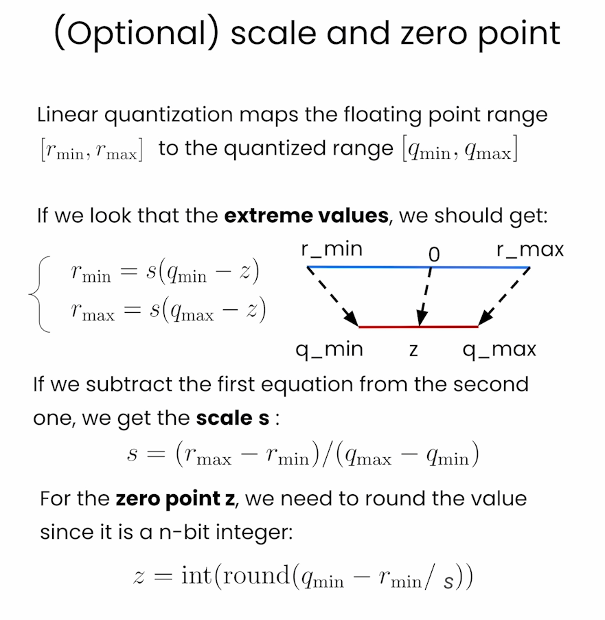

# Quantization Fundamentals with Hugging Face

本文是学习[https://www.deeplearning.ai/short-courses/quantization-fundamentals-with-hugging-face/](https://www.deeplearning.ai/short-courses/quantization-fundamentals-with-hugging-face/) 这门课的学习笔记。


## What you’ll learn in this course

Generative AI models, like large language models, often exceed the capabilities of consumer-grade hardware and are expensive to run. Compressing models through methods such as quantization makes them more efficient, faster, and accessible. This allows them to run on a wide variety of devices, including smartphones, personal computers, and edge devices, and minimizes performance degradation.

Join this course to:

- Quantize any open source model with linear quantization using the Quanto library.
- Get an overview of how linear quantization is implemented. This form of quantization can be applied to compress any model, including LLMs, vision models, etc.
- Apply “downcasting,” another form of quantization, with the Transformers library, which enables you to load models in about half their normal size in the BFloat16 data type.

By the end of this course, you will have a foundation in quantization techniques and be able to apply them to compress and optimize your own generative AI models, making them more accessible and efficient.

@[toc]


# Handling Big Models


Pruning


Knowledge Distillation


Quantization


Data Types


What covers in this course


# Lesson 2: Data Types and Sizes

In this lab, you will learn about the common data types used to store the parameters of machine learning models.


The libraries are already installed in the classroom.  If you're running this notebook on your own machine, you can install the following:

```Python
!pip install torch==2.1.1
```


```py
import torch
```


### Integers


```py
# Information of `8-bit unsigned integer`
torch.iinfo(torch.uint8)
```

Output

```py
iinfo(min=0, max=255, dtype=uint8)
```


```py
# Information of `8-bit (signed) integer`
torch.iinfo(torch.int8)
```

Output

```py
iinfo(min=-128, max=127, dtype=int8)
```


### Floating Points

Floating point


FP32


FP16


Comparison


Floating point in pytorch


```py
# by default, python stores float data in fp64
value = 1/3
format(value, '.60f')
```

Output

```py
'0.333333333333333314829616256247390992939472198486328125000000'
```


```py
# 64-bit floating point
tensor_fp64 = torch.tensor(value, dtype = torch.float64)
print(f"fp64 tensor: {format(tensor_fp64.item(), '.60f')}")
```

Output

```py
fp64 tensor: 0.333333333333333314829616256247390992939472198486328125000000
```


```py
tensor_fp32 = torch.tensor(value, dtype = torch.float32)
tensor_fp16 = torch.tensor(value, dtype = torch.float16)
tensor_bf16 = torch.tensor(value, dtype = torch.bfloat16)

print(f"fp64 tensor: {format(tensor_fp64.item(), '.60f')}")
print(f"fp32 tensor: {format(tensor_fp32.item(), '.60f')}")
print(f"fp16 tensor: {format(tensor_fp16.item(), '.60f')}")
print(f"bf16 tensor: {format(tensor_bf16.item(), '.60f')}")
```

Output

```py
fp64 tensor: 0.333333333333333314829616256247390992939472198486328125000000
fp32 tensor: 0.333333343267440795898437500000000000000000000000000000000000
fp16 tensor: 0.333251953125000000000000000000000000000000000000000000000000
bf16 tensor: 0.333984375000000000000000000000000000000000000000000000000000
```


```py
# Information of `16-bit brain floating point`
torch.finfo(torch.bfloat16)
```

Output

```py
finfo(resolution=0.01, min=-3.38953e+38, max=3.38953e+38, eps=0.0078125, smallest_normal=1.17549e-38, tiny=1.17549e-38, dtype=bfloat16)
```


```py
# Information of `32-bit floating point`
torch.finfo(torch.float32)
```

Output

```py
finfo(resolution=1e-06, min=-3.40282e+38, max=3.40282e+38, eps=1.19209e-07, smallest_normal=1.17549e-38, tiny=1.17549e-38, dtype=float32)
```


### Downcasting

```py
# random pytorch tensor: float32, size=1000
tensor_fp32 = torch.rand(1000, dtype = torch.float32)
# first 5 elements of the random tensor
tensor_fp32[:5]
```

Output

```py
tensor([0.4897, 0.0494, 0.8093, 0.6704, 0.0713])
```


```py
# downcast the tensor to bfloat16 using the "to" method
tensor_fp32_to_bf16 = tensor_fp32.to(dtype = torch.bfloat16)
tensor_fp32_to_bf16[:5]
```

Output

```py
tensor([0.4902, 0.0493, 0.8086, 0.6719, 0.0713], dtype=torch.bfloat16)
```


```py
# tensor_fp32 x tensor_fp32
m_float32 = torch.dot(tensor_fp32, tensor_fp32)
```

Output

```py
tensor(324.9693)
```


```py
# tensor_fp32_to_bf16 x tensor_fp32_to_bf16
m_bfloat16 = torch.dot(tensor_fp32_to_bf16, tensor_fp32_to_bf16)
```

Output

```py
tensor(326., dtype=torch.bfloat16)
```


# Lesson 3: Loading ML Models with Different Data Types


In this lab, you will load ML models in different datatypes.

helper.py

```py
import torch
import torch.nn as nn
import requests
from PIL import Image

import warnings
# Ignore specific UserWarnings related to max_length in transformers
warnings.filterwarnings("ignore", 
    message=".*Using the model-agnostic default `max_length`.*")

class DummyModel(nn.Module):
  """
  A dummy model that consists of an embedding layer
  with two blocks of a linear layer followed by a layer
  norm layer.
  """
  def __init__(self):
    super().__init__()

    torch.manual_seed(123)

    self.token_embedding = nn.Embedding(2, 2)

    # Block 1
    self.linear_1 = nn.Linear(2, 2)
    self.layernorm_1 = nn.LayerNorm(2)

    # Block 2
    self.linear_2 = nn.Linear(2, 2)
    self.layernorm_2 = nn.LayerNorm(2)

    self.head = nn.Linear(2, 2)

  def forward(self, x):
    hidden_states = self.token_embedding(x)

    # Block 1
    hidden_states = self.linear_1(hidden_states)
    hidden_states = self.layernorm_1(hidden_states)

    # Block 2
    hidden_states = self.linear_2(hidden_states)
    hidden_states = self.layernorm_2(hidden_states)

    logits = self.head(hidden_states)
    return logits


def get_generation(model, processor, image, dtype):
  inputs = processor(image, return_tensors="pt").to(dtype)
  out = model.generate(**inputs)
  return processor.decode(out[0], skip_special_tokens=True)


def load_image(img_url):
    image = Image.open(requests.get(
        img_url, stream=True).raw).convert('RGB')

    return image


```


```py
from helper import DummyModel
model = DummyModel()
model
```

Output

```py
DummyModel(
  (token_embedding): Embedding(2, 2)
  (linear_1): Linear(in_features=2, out_features=2, bias=True)
  (layernorm_1): LayerNorm((2,), eps=1e-05, elementwise_affine=True)
  (linear_2): Linear(in_features=2, out_features=2, bias=True)
  (layernorm_2): LayerNorm((2,), eps=1e-05, elementwise_affine=True)
  (head): Linear(in_features=2, out_features=2, bias=True)
)
```

- Create a function to inspect the data types of the parameters in a model.


```py
def print_param_dtype(model):
    for name, param in model.named_parameters():
        print(f"{name} is loaded in {param.dtype}")
        
print_param_dtype(model)
```

Output

```py
token_embedding.weight is loaded in torch.float32
linear_1.weight is loaded in torch.float32
linear_1.bias is loaded in torch.float32
layernorm_1.weight is loaded in torch.float32
layernorm_1.bias is loaded in torch.float32
linear_2.weight is loaded in torch.float32
linear_2.bias is loaded in torch.float32
layernorm_2.weight is loaded in torch.float32
layernorm_2.bias is loaded in torch.float32
head.weight is loaded in torch.float32
head.bias is loaded in torch.float32
```


## Model Casting: `float16`

- Cast the model into a different precision.


```py
# float 16
model_fp16 = DummyModel().half()
print_param_dtype(model_fp16)
```

Output

```py
token_embedding.weight is loaded in torch.float16
linear_1.weight is loaded in torch.float16
linear_1.bias is loaded in torch.float16
layernorm_1.weight is loaded in torch.float16
layernorm_1.bias is loaded in torch.float16
linear_2.weight is loaded in torch.float16
linear_2.bias is loaded in torch.float16
layernorm_2.weight is loaded in torch.float16
layernorm_2.bias is loaded in torch.float16
head.weight is loaded in torch.float16
head.bias is loaded in torch.float16
```


- Run simple inference using model.


```py
import torch
dummy_input = torch.LongTensor([[1, 0], [0, 1]])
# inference using float32 model
logits_fp32 = model(dummy_input)
logits_fp32
```

Output

```py
tensor([[[-0.6872,  0.7132],
         [-0.6872,  0.7132]],

        [[-0.6872,  0.7132],
         [-0.6872,  0.7132]]], grad_fn=<ViewBackward0>)
```


```py
# inference using float16 model
try:
    logits_fp16 = model_fp16(dummy_input)
except Exception as error:
    print("\033[91m", type(error).__name__, ": ", error, "\033[0m")
```


## Model Casting: `bfloat16`

#### Note about deepcopy
- `copy.deepcopy` makes a copy of the model that is independent of the original.  Modifications you make to the copy will not affect the original, because you're making a "deep copy".  For more details, see the Python docs on the [copy][https://docs.python.org/3/library/copy.html] library.


```py
from copy import deepcopy
model_bf16 = deepcopy(model)
model_bf16 = model_bf16.to(torch.bfloat16)
print_param_dtype(model_bf16)
```


Output

```py
token_embedding.weight is loaded in torch.bfloat16
linear_1.weight is loaded in torch.bfloat16
linear_1.bias is loaded in torch.bfloat16
layernorm_1.weight is loaded in torch.bfloat16
layernorm_1.bias is loaded in torch.bfloat16
linear_2.weight is loaded in torch.bfloat16
linear_2.bias is loaded in torch.bfloat16
layernorm_2.weight is loaded in torch.bfloat16
layernorm_2.bias is loaded in torch.bfloat16
head.weight is loaded in torch.bfloat16
head.bias is loaded in torch.bfloat16
```


```py
logits_bf16 = model_bf16(dummy_input)
```


- Now, compare the difference between `logits_fp32` and `logits_bf16`.


```py
mean_diff = torch.abs(logits_bf16 - logits_fp32).mean().item()
max_diff = torch.abs(logits_bf16 - logits_fp32).max().item()

print(f"Mean diff: {mean_diff} | Max diff: {max_diff}")
```

Output

```py
Mean diff: 0.0009978711605072021 | Max diff: 0.0016907453536987305
```


## Using Popular Generative Models in Different Data Types


- Load [Salesforce/blip-image-captioning-base](https://huggingface.co/Salesforce/blip-image-captioning-base) to perform image captioning.

#### To get the sample code that Younes showed:
- Click on the "Model Card" tab.
- On the right, click on the button "<> Use in Transformers", you'll see a popup with sample code for loading this model.

```Python
# Load model directly
from transformers import AutoProcessor, AutoModelForSeq2SeqLM

processor = AutoProcessor.from_pretrained("Salesforce/blip-image-captioning-base")
model = AutoModelForSeq2SeqLM.from_pretrained("Salesforce/blip-image-captioning-base")
```

- To see the sample code with an example, click on "Read model documentation" at the bottom of the popup.  It opens a new tab.
  https://huggingface.co/docs/transformers/main/en/model_doc/blip#transformers.BlipForConditionalGeneration
- On this page, scroll down a bit, past the "parameters", section, and you'll see "Examples:"

```Python
from PIL import Image
import requests
from transformers import AutoProcessor, BlipForConditionalGeneration

processor = AutoProcessor.from_pretrained("Salesforce/blip-image-captioning-base")
model = BlipForConditionalGeneration.from_pretrained("Salesforce/blip-image-captioning-base")

url = "http://images.cocodataset.org/val2017/000000039769.jpg"
image = Image.open(requests.get(url, stream=True).raw)
text = "A picture of"

inputs = processor(images=image, text=text, return_tensors="pt")

outputs = model(**inputs)
```


```py
from transformers import BlipForConditionalGeneration
model_name = "Salesforce/blip-image-captioning-base"
model = BlipForConditionalGeneration.from_pretrained(model_name)
```


- Check the memory footprint of the model. 

```py
fp32_mem_footprint = model.get_memory_footprint()
print("Footprint of the fp32 model in bytes: ",
      fp32_mem_footprint)
print("Footprint of the fp32 model in MBs: ", 
      fp32_mem_footprint/1e+6)
```

Output

```py
Footprint of the fp32 model in bytes:  989660400
Footprint of the fp32 model in MBs:  989.6604
```


- Load the same model in `bfloat16`.

```py
model_bf16 = BlipForConditionalGeneration.from_pretrained(
                                               model_name,
                               torch_dtype=torch.bfloat16
)

bf16_mem_footprint = model_bf16.get_memory_footprint()

# Get the relative difference
relative_diff = bf16_mem_footprint / fp32_mem_footprint

print("Footprint of the bf16 model in MBs: ", 
      bf16_mem_footprint/1e+6)
print(f"Relative diff: {relative_diff}")
```

Output

```py
Footprint of the bf16 model in MBs:  494.832248
Relative diff: 0.5000020693967345
```


### Model Performance: `float32` vs `bfloat16`


- Now, compare the generation results of the two model.


```py
from transformers import BlipProcessor
processor = BlipProcessor.from_pretrained(model_name)
```

- Load the image.


```py
from helper import load_image, get_generation
from IPython.display import display

img_url = 'https://storage.googleapis.com/\
sfr-vision-language-research/BLIP/demo.jpg'

image = load_image(img_url)
display(image.resize((500, 350)))
```

Output


```py
results_fp32 = get_generation(model, 
                              processor, 
                              image, 
                              torch.float32)
                              
print("fp32 Model Results:\n", results_fp32)
```

Output

```py
fp32 Model Results:
 a woman sitting on the beach with her dog
```


```py
results_bf16 = get_generation(model_bf16, 
                              processor, 
                              image, 
                              torch.bfloat16)
print("bf16 Model Results:\n", results_bf16)                             
```

Output

```py
bf16 Model Results:
 a woman sitting on the beach with her dog
```


### Default Data Type

- For Hugging Face Transformers library, the deafult data type to load the models in is `float32`
- You can set the "default data type" as what you want.


```py
desired_dtype = torch.bfloat16
torch.set_default_dtype(desired_dtype)
dummy_model_bf16 = DummyModel()
print_param_dtype(dummy_model_bf16)
```

Output

```py
token_embedding.weight is loaded in torch.bfloat16
linear_1.weight is loaded in torch.bfloat16
linear_1.bias is loaded in torch.bfloat16
layernorm_1.weight is loaded in torch.bfloat16
layernorm_1.bias is loaded in torch.bfloat16
linear_2.weight is loaded in torch.bfloat16
linear_2.bias is loaded in torch.bfloat16
layernorm_2.weight is loaded in torch.bfloat16
layernorm_2.bias is loaded in torch.bfloat16
head.weight is loaded in torch.bfloat16
head.bias is loaded in torch.bfloat16
```


- Similarly, you can reset the default data type to float32.

```py
torch.set_default_dtype(torch.float32)
print_param_dtype(dummy_model_bf16)
```

Output

```py
token_embedding.weight is loaded in torch.bfloat16
linear_1.weight is loaded in torch.bfloat16
linear_1.bias is loaded in torch.bfloat16
layernorm_1.weight is loaded in torch.bfloat16
layernorm_1.bias is loaded in torch.bfloat16
linear_2.weight is loaded in torch.bfloat16
linear_2.bias is loaded in torch.bfloat16
layernorm_2.weight is loaded in torch.bfloat16
layernorm_2.bias is loaded in torch.bfloat16
head.weight is loaded in torch.bfloat16
head.bias is loaded in torch.bfloat16
```

### Note
- You just used a simple form of quantization, in which the model's parameters are saved in a more compact data type (bfloat16).  During inference, the model performs its calculations in this data type, and its activations are in this data type.
- In the next lesson, you will use another quantization method, "linear quantization", which enables the quantized model to maintain performance much closer to the original model by converting from the compressed data type back to the original FP32 data type during inference.


# Lesson 4: Quantization Theory

线性量化（Linear Quantization）是一种量化方法，用于将连续的实数值数据映射到离散的整数值。在线性量化中，数据范围被均匀地划分为若干个量化级别，每个级别代表一个固定的实数范围。线性量化广泛应用于信号处理、图像处理和机器学习模型的压缩和加速。

线性量化的基本原理

线性量化的过程可以概括为以下几个步骤：

1. **确定数据范围**：
   确定需要量化的数据的最小值和最大值，通常记作$[x_{min}, x_{max}]$。

2. **确定量化级别数**：
   选择一个量化级别数 \(N\)，通常是 \($2^b$\)，其中 \(b\) 是量化位数。例如，对于 8 位量化，\(N = 256\)。

3. **计算量化步长**：
   量化步长（step size）\($\Delta$\) 计算公式为：
   
   $\Delta = \frac{x_{max} - x_{min}}{N - 1}$
   
4. **量化**：
   将每个连续实数值 \(x\) 映射到离散量化级别 \(q\)。量化公式为：
   
   $q = \text{round}\left(\frac{x - x_{min}}{\Delta}\right)$
   
   其中，\($\text{round}$) 表示四舍五入到最近的整数。

5. **反量化（重建）**：
   将量化后的整数值 \(q\) 映射回近似的连续实数值 \($\hat{x}$\)。反量化公式为：
   $\hat{x} = x_{min} + q \cdot \Delta$

线性量化的示例

假设有一组数据 \([0.0, 1.0, 2.0, 3.0]\)，我们希望使用 2 位量化（即 \(N = 4\)）。

1. **数据范围**：
   $x_{min} = 0.0，x_{max} = 3.0$

2. **量化步长**：
   $\Delta = \frac{3.0 - 0.0}{4 - 1} = 1.0$
   
3. **量化**：
   对每个值进行量化：
   $q = \text{round}\left(\frac{x - 0.0}{1.0}\right) = \text{round}(x)$
   
   因此：
   $0.0 \rightarrow 0, \quad 1.0 \rightarrow 1, \quad 2.0 \rightarrow 2, \quad 3.0 \rightarrow 3$
   
4. **反量化**：
   将量化值映射回实数：
   $\hat{x} = 0.0 + q \cdot 1.0 = q$
   因此：
   $0 \rightarrow 0.0, \quad 1 \rightarrow 1.0, \quad 2 \rightarrow 2.0, \quad 3 \rightarrow 3.0$

线性量化在机器学习中的应用

在线性量化中，神经网络模型的权重和激活值可以被量化为低位整数（例如 8 位整数），以减少模型的内存占用和计算复杂度，从而提高推理速度。特别是在资源受限的设备（如移动设备和嵌入式系统）上，量化技术非常有用。

量化神经网络的主要挑战在于，如何在量化过程中尽量减少对模型精度的影响。因此，常见的方法包括对模型进行量化感知训练（Quantization-Aware Training）和后量化（Post-Training Quantization）。

总之，线性量化是一种简单而有效的数据压缩技术，在许多领域有广泛的应用。

Linear quantization


Scale and zero point



Quantization Aware Training


In this lab, you will perform Linear Quantization.

#### Libraries to install
- If you are running this notebook on your local machine, you can install the following:

```Python
!pip install transformers==4.35.0
!pip install quanto==0.0.11
!pip install torch==2.1.1
```


## T5-FLAN
- Please note that due to hardware memory constraints, and in order to offer this course for free to everyone, the code you'll run here is for the T5-FLAN model instead of the EleutherAI AI Pythia model.  
- Thank you for your understanding! 🤗

For the T5-FLAN model, here is one more library to install if you are running locally:
```Python
!pip install sentencepiece==0.2.0
```


### Without Quantization


```py
model_name = "google/flan-t5-small"
import sentencepiece as spm
from transformers import T5Tokenizer, T5ForConditionalGeneration

tokenizer = T5Tokenizer.from_pretrained("google/flan-t5-small")
model = T5ForConditionalGeneration.from_pretrained("google/flan-t5-small")

input_text = "Hello, my name is "
input_ids = tokenizer(input_text, return_tensors="pt").input_ids

outputs = model.generate(input_ids)
print(tokenizer.decode(outputs[0]))
```

Output

```py
<pad> annie scott</s>
```

helper.py

```py
import torch

# ################ monkey patch for quanto
def named_module_tensors(module, recurse=False):
    for named_parameter in module.named_parameters(recurse=recurse):
      name, val = named_parameter
      flag = True
      if hasattr(val,"_data") or hasattr(val,"_scale"):
        if hasattr(val,"_data"):
          yield name + "._data", val._data
        if hasattr(val,"_scale"):
          yield name + "._scale", val._scale
      else:
        yield named_parameter

    for named_buffer in module.named_buffers(recurse=recurse):
      yield named_buffer

def dtype_byte_size(dtype):
    """
    Returns the size (in bytes) occupied by one parameter of type `dtype`.
    """
    import re
    if dtype == torch.bool:
        return 1 / 8
    bit_search = re.search(r"[^\d](\d+)$", str(dtype))
    if bit_search is None:
        raise ValueError(f"`dtype` is not a valid dtype: {dtype}.")
    bit_size = int(bit_search.groups()[0])
    return bit_size // 8

def compute_module_sizes(model):
    """
    Compute the size of each submodule of a given model.
    """
    from collections import defaultdict
    module_sizes = defaultdict(int)
    for name, tensor in named_module_tensors(model, recurse=True):
      size = tensor.numel() * dtype_byte_size(tensor.dtype)
      name_parts = name.split(".")
      for idx in range(len(name_parts) + 1):
        module_sizes[".".join(name_parts[:idx])] += size

    return module_sizes
```


```py
from helper import compute_module_sizes
module_sizes = compute_module_sizes(model)
print(f"The model size is {module_sizes[''] * 1e-9} GB")
```

Output

```py
The model size is 0.307844608 GB
```


## Quantize the model (8-bit precision)


```py
from quanto import quantize, freeze
import torch
quantize(model, weights=torch.int8, activations=None)
```


### Freeze the model
- This step takes a bit of memory, and so for the Pythia model that is shown in the lecture video, it will not run in the classroom.
- This will work fine with the smaller T5-Flan model.


```py
freeze(model)
module_sizes = compute_module_sizes(model)
print(f"The model size is {module_sizes[''] * 1e-9} GB")
```

Output

```py
The model size is 0.12682868 GB
```


### Try running inference on the quantized model

```py
input_text = "Hello, my name is "
input_ids = tokenizer(input_text, return_tensors="pt").input_ids

outputs = model.generate(input_ids)
print(tokenizer.decode(outputs[0]))
```

Output

```py
<pad> annie scott</s>
```


#### Comparing "linear quantization" to "downcasting"

To recap the difference between the "linear quantization" method in this lesson with the "downcasting" method in the previous lesson:

- When downcasting a model, you convert the model's parameters to a more compact data type (bfloat16).  During inference, the model performs its calculations in this data type, and its activations are in this data type.  Downcasting may work with the bfloat16 data type, but the model performance will likely degrade with any smaller data type, and won't work if you convert to an integer data type (like the int8 in this lesson).


- In this lesson, you used another quantization method, "linear quantization", which enables the quantized model to maintain performance much closer to the original model by converting from the compressed data type back to the original FP32 data type during inference. So when the model makes a prediction, it is performing the matrix multiplications in FP32, and the activations are in FP32.  This enables you to quantize the model in data types smaller than bfloat16, such as int8, in this example.


# Quantization of LLMs

Recent SOTA quantization methods


For 2-bit quantization


Fine Tuning quantized models


Fine tune with QAT


# 后记

2024年6月8日14点58分完成huggingface的这门量化基础课程。

