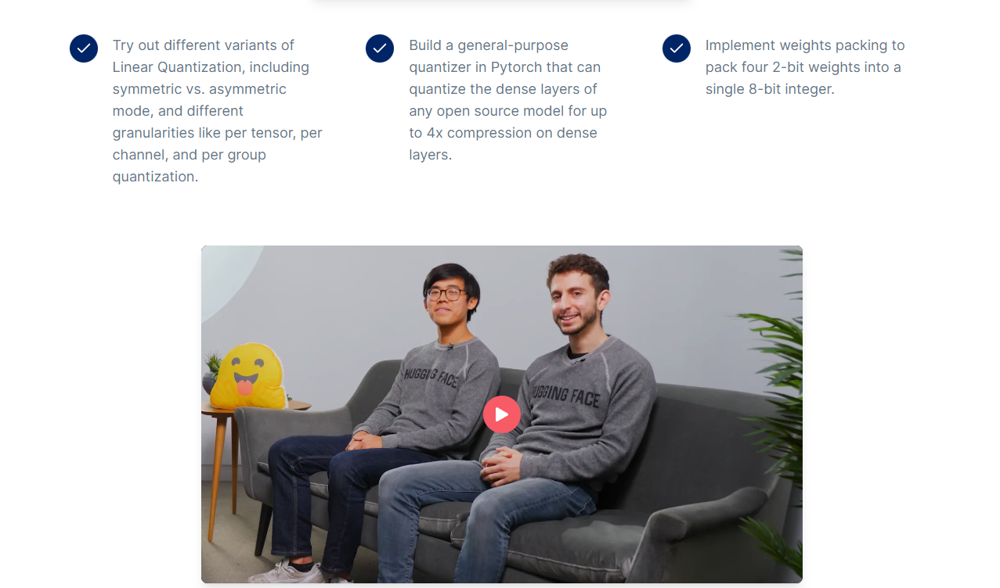

# Quantization in Depth

本文是学习 [https://www.deeplearning.ai/short-courses/quantization-in-depth/](https://www.deeplearning.ai/short-courses/quantization-in-depth/) 这门课的学习笔记。

## What you’ll learn in this course

In **Quantization in Depth** you will build model quantization methods to shrink model weights to ¼ their original size, and apply methods to maintain the compressed model’s performance. Your ability to quantize your models can make them more accessible, and also faster at inference time. 

Implement and customize linear quantization from scratch so that you can study the tradeoff between space and performance, and then build a general-purpose quantizer in PyTorch that can quantize any open source model. You’ll implement techniques to compress model weights from 32 bits to 8 bits and even 2 bits.

Join this course to:

- Build and customize linear quantization functions, choosing between two “modes”: asymmetric and symmetric; and three granularities: per-tensor, per-channel, and per-group quantization.
- Measure the quantization error of each of these options as you balance the performance and space tradeoffs for each option.
- Build your own quantizer in PyTorch, to quantize any open source model’s dense layers from 32 bits to 8 bits.
- Go beyond 8 bits, and pack four 2-bit weights into one 8-bit integer.

**Quantization in Depth** lets you build and customize your own linear quantizer from scratch, going beyond standard open source libraries such as PyTorch and Quanto, which are covered in the short course **[Quantization Fundamentals](https://www.deeplearning.ai/short-courses/quantization-fundamentals-with-hugging-face/)**, also by Hugging Face.

This course gives you the foundation to study more advanced quantization methods, some of which are recommended at the end of the course.

# Overview

