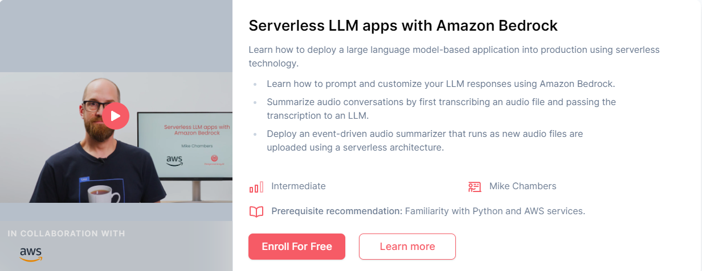

# Serverless LLM apps with Amazon Bedrock

本文是学习 [https://www.deeplearning.ai/short-courses/serverless-llm-apps-amazon-bedrock/](https://www.deeplearning.ai/short-courses/serverless-llm-apps-amazon-bedrock/) 这门课的学习笔记。

## What you’ll learn in this course

In this course, you’ll learn how to deploy a large language model-based application into production using serverless technology.

A serverless architecture enables you to quickly deploy your applications without the need to manage and scale the infrastructure that it runs on.

You’ll learn to summarize audio files by pairing an LLM with an automatic speech recognition (ASR) model. Through hands-on exercises, you’ll build an event-driven system that automatically detects incoming customer inquiries, transcribes them with ASR and summarizes them with an LLM, using Amazon Bedrock. 

After course completion, you’ll know how to:

- Prompt an LLM and customize its responses using Amazon Bedrock. 
- Convert audio recordings into written transcripts with Amazon Transcribe, and then summarize these transcripts using an LLM, Amazon Titan.
- Enable logging for all the calls you make to LLMs to help you maintain security, audit, and compliance standards.
- Deploy this audio summarizer as an event-driven serverless workflow using AWS Lambda.

You’ll work with the Amazon Titan model, but in practice Amazon Bedrock allows you to use any model you prefer.

Start building serverless LLM applications with Amazon Bedrock and deploy your apps in just days.

@[toc]

