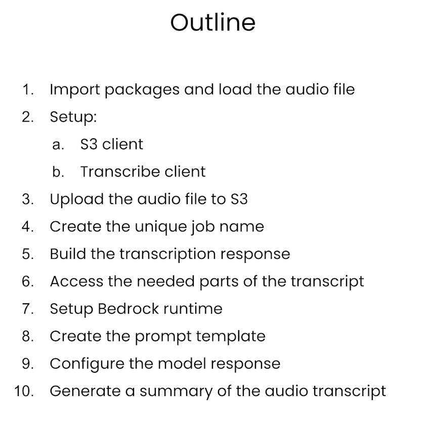
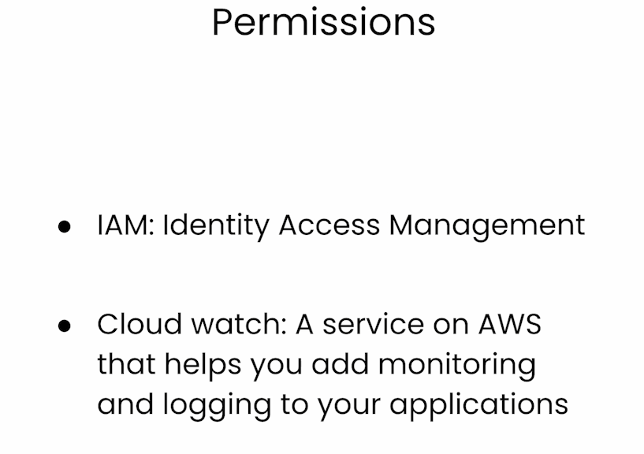
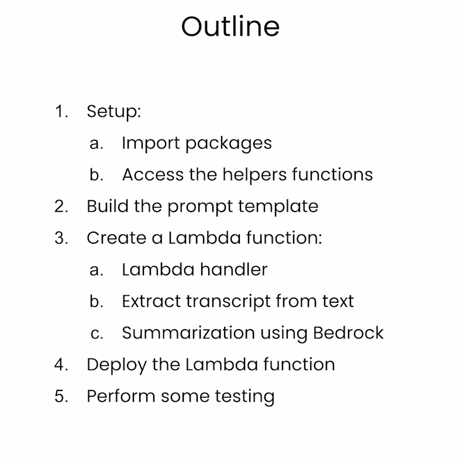
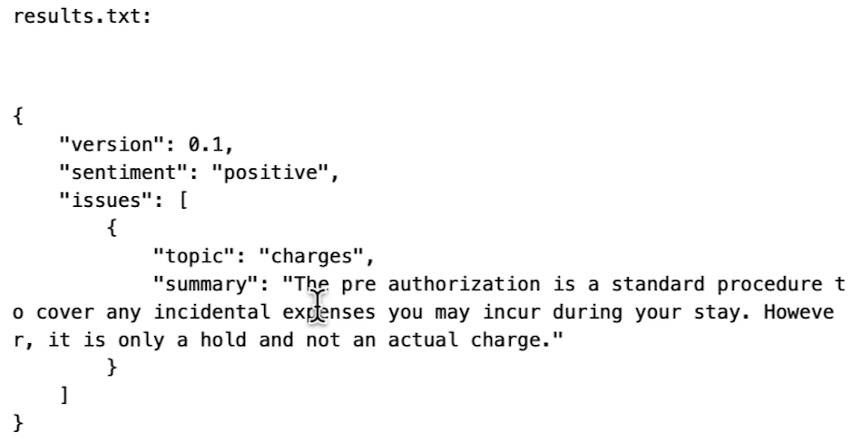

# Serverless LLM apps with Amazon Bedrock

本文是学习 [https://www.deeplearning.ai/short-courses/serverless-llm-apps-amazon-bedrock/](https://www.deeplearning.ai/short-courses/serverless-llm-apps-amazon-bedrock/) 这门课的学习笔记。


## What you’ll learn in this course

In this course, you’ll learn how to deploy a large language model-based application into production using serverless technology.

A serverless architecture enables you to quickly deploy your applications without the need to manage and scale the infrastructure that it runs on.

You’ll learn to summarize audio files by pairing an LLM with an automatic speech recognition (ASR) model. Through hands-on exercises, you’ll build an event-driven system that automatically detects incoming customer inquiries, transcribes them with ASR and summarizes them with an LLM, using Amazon Bedrock. 

After course completion, you’ll know how to:

- Prompt an LLM and customize its responses using Amazon Bedrock. 
- Convert audio recordings into written transcripts with Amazon Transcribe, and then summarize these transcripts using an LLM, Amazon Titan.
- Enable logging for all the calls you make to LLMs to help you maintain security, audit, and compliance standards.
- Deploy this audio summarizer as an event-driven serverless workflow using AWS Lambda.

You’ll work with the Amazon Titan model, but in practice Amazon Bedrock allows you to use any model you prefer.

Start building serverless LLM applications with Amazon Bedrock and deploy your apps in just days.


@[toc]


# Lesson 1 - Your first generations with Amazon Bedrock

Welcome to Lesson 1. 

You'll start with using Amazon Bedrock to prompt a model and customize how it generates its response.

**Note:** To access the `requirements.txt` file, go to `File` and click on `Open`. Here, you will also find all helpers functions and datasets used in each lesson.

I hope you enjoy this course!


requirements.txt

```py
# Note: To run the code in these files in your own environment you will need to install 
# some Python dependencies, and also have access to an AWS environment.  

# AWS Development Environment Setup:
# ----------------------------------
# 1. Create AWS Account and an IAM user.  Follow this guide for more details: https://docs.aws.amazon.com/SetUp/latest/UserGuide/setup-overview.html
# 2. Generate some access keys for your IAM user. For more information see here: https://docs.aws.amazon.com/IAM/latest/UserGuide/id_credentials_access-keys.html#Using_CreateAccessKey
# 3. Install the AWS CLI. Follow this guide for more details: https://docs.aws.amazon.com/cli/latest/userguide/getting-started-install.html
# 4. Configure AWS CLI: Run 'aws configure' with your access keys, set default region to 'us-west-2' for this code. For more information see here: https://docs.aws.amazon.com/cli/latest/userguide/cli-configure-files.html#cli-configure-files-methods 
# 5. Use Boto3 for AWS SDK in Python. Your locally run code should interact with your AWS account. https://boto3.amazonaws.com/v1/documentation/api/latest/index.html

# Note: If using a company AWS account, consult your AWS administrator before proceeding.


# requirements file
# This code was developed and tested on Python 3.10


boto3==1.28.68

```


Display_Helper.py

```py
from IPython.display import HTML, display
import html

class Display_Helper: 

    def wrap(self, long_string):
        escaped_string = html.escape(long_string)
        html_string = escaped_string.replace("\n", "<br>")
        display(HTML(f"<div style='width: 600px; word-wrap: break-word;'>{html_string}</div>"))

    def text_file(self, file_path):
        try:
            # Open the file and read its contents into a string
            with open(file_path, 'r', encoding='utf-8') as file:
                text_string = file.read()

            # Print the contents (optional)
            print(f"{file_path}:")
            self.wrap(text_string)

        except FileNotFoundError:
            print(f"The file {file_path} was not found.")
        except Exception as e:
            print(f"An error occurred: {e}")
```


### Import all needed packages

```py
import boto3
import json
```


### Setup the Bedrock runtime


```py
bedrock_runtime = boto3.client('bedrock-runtime', region_name='us-west-2')

prompt = "Write a one sentence summary of Las Vegas."

kwargs = {
    "modelId": "amazon.titan-text-lite-v1",
    "contentType": "application/json",
    "accept": "*/*",
    "body": json.dumps(
        {
            "inputText": prompt
        }
    )
}
```


```py
response = bedrock_runtime.invoke_model(**kwargs)
response
```

Output

```json
{'ResponseMetadata': {'RequestId': 'a03a2d5a-6610-42af-bef7-b08d48bd9ad4',
  'HTTPStatusCode': 200,
  'HTTPHeaders': {'date': 'Thu, 06 Jun 2024 05:10:52 GMT',
   'content-type': 'application/json',
   'content-length': '166',
   'connection': 'keep-alive',
   'x-amzn-requestid': 'a03a2d5a-6610-42af-bef7-b08d48bd9ad4',
   'x-amzn-bedrock-invocation-latency': '1003',
   'x-amzn-bedrock-output-token-count': '15',
   'x-amzn-bedrock-input-token-count': '9'},
  'RetryAttempts': 0},
 'contentType': 'application/json',
 'body': <botocore.response.StreamingBody at 0x7fa06041d270>}
```


```py
response_body = json.loads(response.get('body').read())
print(json.dumps(response_body, indent=4))
```

Output

```json
{
    "inputTextTokenCount": 9,
    "results": [
        {
            "tokenCount": 15,
            "outputText": "\nLas Vegas is known for its casinos, entertainment, and nightlife.",
            "completionReason": "FINISH"
        }
    ]
}
```


```py
print(response_body['results'][0]['outputText'])
```

Output

```py
print(response_body['results'][0]['outputText'])
```


### Generation Configuration


```py
prompt = "Write a summary of Las Vegas."
kwargs = {
    "modelId": "amazon.titan-text-express-v1",
    "contentType": "application/json",
    "accept": "*/*",
    "body" : json.dumps(
        {
            "inputText": prompt,
            "textGenerationConfig": {
                "maxTokenCount": 100,
                "temperature": 0.7,
                "topP": 0.9
            }
        }
    )
}
```


```py
response = bedrock_runtime.invoke_model(**kwargs)
response_body = json.loads(response.get('body').read())

generation = response_body['results'][0]['outputText']
print(generation)
```

Output

```json
Las Vegas is the 28th-most populated city in the United States, the most populated city in the state of Nevada, and the county seat of Clark County. It is an internationally renowned major resort city, known primarily for its gambling, shopping, fine dining, entertainment, and nightlife. Las Vegas is often referred to as the Entertainment Capital of the World and is famous for its luxurious casino-hotels, such as the Bellagio, Caesars Palace, and the Venetian.
```


```py
print(json.dumps(response_body, indent=4))
```

Output

```json
{
    "inputTextTokenCount": 7,
    "results": [
        {
            "tokenCount": 100,
            "outputText": "\nLas Vegas is the 28th-most populated city in the United States, the most populated city in the state of Nevada, and the county seat of Clark County. It is an internationally renowned major resort city, known primarily for its gambling, shopping, fine dining, entertainment, and nightlife. Las Vegas is often referred to as the Entertainment Capital of the World and is famous for its luxurious casino-hotels, such as the Bellagio, Caesars Palace, and the Venetian.",
            "completionReason": "LENGTH"
        }
    ]
}

```


```py
kwargs = {
    "modelId": "amazon.titan-text-express-v1",
    "contentType": "application/json",
    "accept": "*/*",
    "body" : json.dumps(
        {
            "inputText": prompt,
            "textGenerationConfig": {
                "maxTokenCount": 500,
                "temperature": 0.7,
                "topP": 0.9
            }
        }
    )
}
```


```py
response = bedrock_runtime.invoke_model(**kwargs)
response_body = json.loads(response.get('body').read())

generation = response_body['results'][0]['outputText']
print(generation)
```

Output

```py
Las Vegas is a city in Nevada known for its luxurious casinos, hotels, and nightlife. It is a popular tourist destination and a hub for business and entertainment. Las Vegas is home to many famous landmarks, including the Las Vegas Strip, the Bellagio, and the Venetian. The city is known for its high-energy atmosphere, world-class entertainment, and luxurious accommodations. Las Vegas is also a popular destination for weddings and conventions, with many hotels and resorts offering specialized services and amenities for these events.
```


```py
print(json.dumps(response_body, indent=4))
```

Output

```py
{
    "inputTextTokenCount": 7,
    "results": [
        {
            "tokenCount": 104,
            "outputText": "\nLas Vegas is a city in Nevada known for its luxurious casinos, hotels, and nightlife. It is a popular tourist destination and a hub for business and entertainment. Las Vegas is home to many famous landmarks, including the Las Vegas Strip, the Bellagio, and the Venetian. The city is known for its high-energy atmosphere, world-class entertainment, and luxurious accommodations. Las Vegas is also a popular destination for weddings and conventions, with many hotels and resorts offering specialized services and amenities for these events.",
            "completionReason": "FINISH"
        }
    ]
}
```


### Working with other type of data


```py
from IPython.display import Audio
audio = Audio(filename="dialog.mp3")
display(audio)

with open('transcript.txt', "r") as file:
    dialogue_text = file.read()
    
print(dialogue_text)
```

Output

```py
spk_0: Hi, is this the Crystal Heights Hotel in Singapore? 
spk_1: Yes, it is. Good afternoon. How may I assist you today? 
spk_0: Fantastic, good afternoon. I was looking to book a room for my 10th wedding anniversary. Ive heard your hotel offers exceptional views and services. Could you tell me more? 
spk_1: Absolutely, Alex and congratulations on your upcoming anniversary. Thats a significant milestone and wed be honored to make it a special occasion for you. We have several room types that offer stunning views of the city skyline and the fictional Sapphire Bay. Our special diamond suite even comes with exclusive access to the moonlit pool and star deck. We also have in house spa services, world class dining options and a shopping arcade. 
spk_0: That sounds heavenly. I think my spouse would love the moonlit pool. Can you help me make a reservation for one of your diamond suites with a sapphire bay view? 
spk_1: Of course. May I know the dates you planning to visit? 
spk_0: Sure. It would be from October 10th to 17th. 
spk_1: Excellent. Let me check the availability. Ah It looks like we have a diamond suite available for those dates. Would you like to proceed with the reservation? 
spk_0: Definitely. Whats included in the package? 
spk_1: Wonderful. The package includes breakfast, complimentary access to the moonlit pool and star deck. A one time spa treatment for two and a special romantic dinner at our cloud nine restaurant. 
spk_0: You making it impossible to resist. Lets go ahead with the booking. 
spk_1: Great. I'll need some personal information for the reservation. Can I get your full name, contact details and a credit card for the preauthorizations? 
spk_0: Certainly. My full name is Alexander Thompson. My contact number is 12345678910. And the credit card is, wait, did you say pre authorization? How much would that be? 
spk_1: Ah, I should have mentioned that earlier. My apologies. A pre authorization amount of '$1000' will be held on your card which would be released upon checkout. 
spk_0: '$1000'. That seems a bit excessive. Don't you think 
spk_1: I understand your concern, Alex. The pre authorization is a standard procedure to cover any incidental expenses you may incur during your stay. However, I assure you its only a hold and not an actual charge. 
spk_0: Thats still a lot. Are there any additional charges that I should know about? 
spk_1: Well, there is a 10% service charge and a 7% fantasy tax applied to the room rate. 
spk_0: Mm. You know what its a special occasion. So lets go ahead. 
spk_1: Thank you, Alex for understanding. Will ensure that your experience at Crystal Heights is well worth it. 
```


```py
prompt = f"""The text between the <transcript> XML tags is a transcript of a conversation. 
Write a short summary of the conversation.

<transcript>
{dialogue_text}
</transcript>

Here is a summary of the conversation in the transcript:"""
```


```py
kwargs = {
    "modelId": "amazon.titan-text-express-v1",
    "contentType": "application/json",
    "accept": "*/*",
    "body": json.dumps(
        {
            "inputText": prompt,
            "textGenerationConfig": {
                "maxTokenCount": 512,
                "temperature": 0,
                "topP": 0.9
            }
        }
    )
}

response = bedrock_runtime.invoke_model(**kwargs)

response_body = json.loads(response.get('body').read())
generation = response_body['results'][0]['outputText']

print(generation)
```

Output

```py
Alex is looking to book a room for his 10th wedding anniversary at the Crystal Heights Hotel in Singapore. The hotel offers several room types that offer stunning views of the city skyline and the fictional Sapphire Bay. The special diamond suite even comes with exclusive access to the moonlit pool and star deck. The package includes breakfast, complimentary access to the moonlit pool and star deck, a one-time spa treatment for two, and a special romantic dinner at the cloud nine restaurant. A pre-authorization amount of $1000 will be held on the card, which will be released upon checkout. There is a 10% service charge and a 7% fantasy tax applied to the room rate.
```


# Lesson 2: Summarize an audio file





### Import all needed packages

```py
import os
from IPython.display import Audio
import boto3
import uuid
import time
import json
from jinja2 import Template
```


### Let's start with transcribing an audio file

```py
audio = Audio(filename="dialog.mp3")
display(audio)
```


2 client

```py
s3_client = boto3.client('s3', region_name='us-west-2')
bucket_name = os.environ['BucketName']
file_name = 'dialog.mp3'
s3_client.upload_file(file_name, bucket_name, file_name)


transcribe_client = boto3.client('transcribe', region_name='us-west-2')
job_name = 'transcription-job-' + str(uuid.uuid4())
```


```py
response = transcribe_client.start_transcription_job(
    TranscriptionJobName=job_name,
    Media={'MediaFileUri': f's3://{bucket_name}/{file_name}'},
    MediaFormat='mp3',
    LanguageCode='en-US',
    OutputBucketName=bucket_name,
    Settings={
        'ShowSpeakerLabels': True,
        'MaxSpeakerLabels': 2
    }
)
```


```py
while True:
    status = transcribe_client.get_transcription_job(TranscriptionJobName=job_name)
    if status['TranscriptionJob']['TranscriptionJobStatus'] in ['COMPLETED', 'FAILED']:
        break
    time.sleep(2)
print(status['TranscriptionJob']['TranscriptionJobStatus'])
```

Output

```py
COMPLETED
```


```py
if status['TranscriptionJob']['TranscriptionJobStatus'] == 'COMPLETED':
    
    # Load the transcript from S3.
    transcript_key = f"{job_name}.json"
    transcript_obj = s3_client.get_object(Bucket=bucket_name, Key=transcript_key)
    transcript_text = transcript_obj['Body'].read().decode('utf-8')
    transcript_json = json.loads(transcript_text)
    
    output_text = ""
    current_speaker = None
    
    items = transcript_json['results']['items']
    
    for item in items:
        
        speaker_label = item.get('speaker_label', None)
        content = item['alternatives'][0]['content']
        
        # Start the line with the speaker label:
        if speaker_label is not None and speaker_label != current_speaker:
            current_speaker = speaker_label
            output_text += f"\n{current_speaker}: "
            
        # Add the speech content:
        if item['type'] == 'punctuation':
            output_text = output_text.rstrip()
            
        output_text += f"{content} "
        
    # Save the transcript to a text file
    with open(f'{job_name}.txt', 'w') as f:
        f.write(output_text)
```


### Now, let's use an LLM


```py
bedrock_runtime = boto3.client('bedrock-runtime', region_name='us-west-2')
with open(f'{job_name}.txt', "r") as file:
    transcript = file.read()
```


```py
%%writefile prompt_template.txt
I need to summarize a conversation. The transcript of the 
conversation is between the <data> XML like tags.

<data>
{{transcript}}
</data>

The summary must contain a one word sentiment analysis, and 
a list of issues, problems or causes of friction
during the conversation. The output must be provided in 
JSON format shown in the following example. 

Example output:
{
    "sentiment": <sentiment>,
    "issues": [
        {
            "topic": <topic>,
            "summary": <issue_summary>,
        }
    ]
}

Write the JSON output and nothing more.

Here is the JSON output:
```


```py
with open('prompt_template.txt', "r") as file:
    template_string = file.read()
    
data = {
    'transcript' : transcript
}
template = Template(template_string)
prompt = template.render(data)
```


```json
kwargs = {
    "modelId": "amazon.titan-text-express-v1",
    "contentType": "application/json",
    "accept": "*/*",
    "body": json.dumps(
        {
            "inputText": prompt,
            "textGenerationConfig": {
                "maxTokenCount": 512,
                "temperature": 0,
                "topP": 0.9
            }
        }
    )
}
```


```py
response = bedrock_runtime.invoke_model(**kwargs)
response_body = json.loads(response.get('body').read())
generation = response_body['results'][0]['outputText']
print(generation)
```

Output

```json
{
    "sentiment": "Positive",
    "issues": []
}
```


# Lesson 3: Enable Logging


```py
import boto3
import json
import os

bedrock = boto3.client('bedrock', region_name="us-west-2")

from helpers.CloudWatchHelper import CloudWatch_Helper
cloudwatch = CloudWatch_Helper()
```


```py
log_group_name = '/my/amazon/bedrock/logs'
cloudwatch.create_log_group(log_group_name)
```

Output

```py
Log group '/my/amazon/bedrock/logs' created successfully
```

Permissions




```py
loggingConfig = {
    'cloudWatchConfig': {
        'logGroupName': log_group_name,
        'roleArn': os.environ['LOGGINGROLEARN'],
        'largeDataDeliveryS3Config': {
            'bucketName': os.environ['LOGGINGBUCKETNAME'],
            'keyPrefix': 'amazon_bedrock_large_data_delivery',
        }
    },
    's3Config': {
        'bucketName': os.environ['LOGGINGBUCKETNAME'],
        'keyPrefix': 'amazon_bedrock_logs',
    },
    'textDataDeliveryEnabled': True,
}
```


```py
bedrock.put_model_invocation_logging_configuration(loggingConfig=loggingConfig)
```

Output

```json
{'ResponseMetadata': {'RequestId': 'ff946ac9-3b70-46b3-813a-3df74e5a3249',
  'HTTPStatusCode': 200,
  'HTTPHeaders': {'date': 'Thu, 06 Jun 2024 05:54:13 GMT',
   'content-type': 'application/json',
   'content-length': '2',
   'connection': 'keep-alive',
   'x-amzn-requestid': 'ff946ac9-3b70-46b3-813a-3df74e5a3249'},
  'RetryAttempts': 0}}
```


```py
bedrock.get_model_invocation_logging_configuration()
```

Output

```json
{'ResponseMetadata': {'RequestId': '9d7ed35e-e290-42ad-bd7b-af4e4cf0adc7',
  'HTTPStatusCode': 200,
  'HTTPHeaders': {'date': 'Thu, 06 Jun 2024 05:54:13 GMT',
   'content-type': 'application/json',
   'content-length': '572',
   'connection': 'keep-alive',
   'x-amzn-requestid': '9d7ed35e-e290-42ad-bd7b-af4e4cf0adc7'},
  'RetryAttempts': 0},
 'loggingConfig': {'cloudWatchConfig': {'logGroupName': '/my/amazon/bedrock/logs',
   'roleArn': 'arn:aws:iam::359221361672:role/c99355a2566044l6746327t1w43396592481-LoggingIAMRole-02xH6ovfIJxX',
   'largeDataDeliveryS3Config': {'bucketName': 'c99355a2566044l6746327t1w433965924-loggings3bucket-ujar4vdntz1x',
    'keyPrefix': 'amazon_bedrock_large_data_delivery'}},
  's3Config': {'bucketName': 'c99355a2566044l6746327t1w433965924-loggings3bucket-ujar4vdntz1x',
   'keyPrefix': 'amazon_bedrock_logs'},
  'textDataDeliveryEnabled': True,
  'imageDataDeliveryEnabled': True,
  'embeddingDataDeliveryEnabled': True}}
```


```py
bedrock_runtime = boto3.client('bedrock-runtime', region_name="us-west-2")

prompt = "Write an article about the fictional planet Foobar."

kwargs = {
    "modelId": "amazon.titan-text-express-v1",
    "contentType": "application/json",
    "accept": "*/*",
    "body": json.dumps(
        {
            "inputText": prompt,
            "textGenerationConfig": {
                "maxTokenCount": 512,
                "temperature": 0.7,
                "topP": 0.9
            }
        }
    )
}

response = bedrock_runtime.invoke_model(**kwargs)
response_body = json.loads(response.get('body').read())

generation = response_body['results'][0]['outputText']

print(generation)
```

Output

```json
Foobar is a fictional planet from the television series "Futurama." It is a planet that is home to a race of creatures known as the Foobars. The Foobars are a peaceful, intelligent species that are known for their advanced technology and culture.

One of the most notable features of Foobar is its technology. The planet is home to a number of advanced technologies, including flying cars, teleporters, and robots. The Foobars have also developed a form of energy that is renewable and sustainable, which they use to power their cities and devices.

Another important aspect of Foobar culture is its art and music. The Foobars are known for their vibrant and colorful art, which often depicts their advanced technology and natural landscapes. Music is also an important part of Foobar culture, with a variety of genres and styles being played throughout the planet.

Despite its advanced technology and peaceful culture, Foobar is not without its challenges. The planet is located in a remote part of the galaxy, making it difficult for other species to reach and interact with. Additionally, Foobar is threatened by a number of natural disasters, including hurricanes and earthquakes.

Despite these challenges, the Foobars continue to thrive and grow. They are a proud and resilient species, and their technology and culture continue to inspire and amaze other species in the galaxy. Foobar is a fictional planet that has captured the imagination of millions of people around the world. Its advanced technology, peaceful culture, and unique art and music make it a fascinating and exciting place to explore. Whether you are a fan of "Futurama" or just looking for a new and exciting world to explore, Foobar is a great choice.
```


```py
cloudwatch.print_recent_logs(log_group_name)
```

Output

```py
Permissions are correctly set for Amazon Bedrock logs.
```


# Lesson 4: Deploy an AWS Lambda function




Lambda_Helper.py


```py
import boto3
import zipfile
import json
import os


class Lambda_Helper: 

    def __init__(self):
        
        # Get the account ID being used
        sts_client = boto3.client('sts')
        response = sts_client.get_caller_identity()
        account_id = response['Account']
        
        # Create a Boto3 client for the Lambda service
        self.lambda_client = boto3.client('lambda', region_name='us-west-2')  
        self.function_name = 'LambdaFunctionDLAICourse'
        self.role_arn = f"arn:aws:iam::{account_id}:role/LambdaRoleDLAICourse"
        self.function_description = "Lambda function uploaded by a notebook in a DLAI course."
        self.lambda_arn = ""
        self.lambda_environ_variables = {}
        self.filter_rules_suffix = ""
        
        self.s3_client = boto3.client('s3', region_name='us-west-2')
            
    def deploy_function(self, code_file_names, function_name=""):

        if function_name:
            self.function_name = function_name
        else:
            print(f"Using function name: {self.function_name}")
        
        print('Zipping function...')
        zip_file_path = 'lambda_function.zip'

        with zipfile.ZipFile(zip_file_path, 'w') as zipf:
            for code_file_name in code_file_names:
                zipf.write(code_file_name, arcname=code_file_name)

        try:
            print('Looking for existing function...')
            # Try to get the details of the Lambda function
            self.lambda_client.get_function(FunctionName=self.function_name)

            # If the function exists, update its code
            print(f"Function {self.function_name} exists. Updating code...")
            response = self.lambda_client.update_function_code(
                FunctionName=self.function_name,
                ZipFile=open(zip_file_path, 'rb').read()  # Read the ZIP file and provide its content
            )
            print(f"Function {self.function_name} code updated: {response['LastModified']}")
            self.lambda_arn = response['FunctionArn']
            print("Done.")

        except self.lambda_client.exceptions.ResourceNotFoundException:
            # If the function does not exist, create a new one
            print(f"Function {self.function_name} does not exist. Creating...")
            response = self.lambda_client.create_function(
                FunctionName=self.function_name,
                Runtime='python3.11',
                Role=self.role_arn,
                Handler='lambda_function.lambda_handler',
                Description=self.function_description,
                Layers=[os.environ['LAMBDALAYERVERSIONARN']],
                Timeout=120,
                Code={
                    'ZipFile': open(zip_file_path, 'rb').read()
                },
                Environment= {'Variables': self.lambda_environ_variables }
            )
            print(f"Function {self.function_name} created: {response['FunctionArn']}")
            self.lambda_arn = response['FunctionArn']
            print("Done.")

        except Exception as e:
            # Handle other potential exceptions
            print(f"An error occurred: {e}")
            self.lambda_arn = ""
            print("Done, with error.")
            

    def add_lambda_trigger(self, bucket_name, function_name=""):

        if function_name:
            self.function_name = function_name
        else:
            print(f"Using function name of deployed function: {self.function_name}")
        
        # Check and remove existing permissions for the specific source (S3 bucket)
        try:
            policy = self.lambda_client.get_policy(FunctionName=self.function_name)['Policy']
            policy_dict = json.loads(policy)
        
            for statement in policy_dict['Statement']:
                if statement['Action'] == 'lambda:InvokeFunction' and self.lambda_arn in statement['Resource']:
                    self.lambda_client.remove_permission(
                        FunctionName=self.function_name,
                        StatementId=statement['Sid']
                    )
                    print(f"Removed existing permission: {statement['Sid']}")

        except self.lambda_client.exceptions.ResourceNotFoundException:
            # Handle if the policy is not found - might mean function has no permissions set
            pass

        except Exception as e:
            # Handle other exceptions
            print(f"Error checking for existing permissions: {e}")
            return

        # Grant permission to S3 to invoke the Lambda function
        try:
            response = self.lambda_client.add_permission(
                FunctionName=self.function_name,
                Action='lambda:InvokeFunction',
                Principal='s3.amazonaws.com',
                StatementId='s3-trigger-permission',  # A unique statement ID
                SourceArn=f"arn:aws:s3:::{bucket_name}"
            )
            print_out = json.dumps(json.loads(response['Statement']), indent=4)
            print(f"Permission added with Statement: {print_out}")

        except Exception as e:
            print(f"Error adding Lambda permission: {e}")
            return

        # Add bucket notification to trigger the Lambda function
        lambda_arn = self.lambda_client.get_function(
            FunctionName=self.function_name
        )['Configuration']['FunctionArn']
                
        notification_configuration = {
            'LambdaFunctionConfigurations': [
                {
                    'LambdaFunctionArn': lambda_arn,
                    'Events': ['s3:ObjectCreated:*'],
                    'Filter': {
                        'Key': {
                            'FilterRules': [
                                {
                                    'Name': 'suffix',
                                    'Value': self.filter_rules_suffix
                                }
                            ]
                        }
                    }
                }
            ]
        }
        
        try:
            self.s3_client.put_bucket_notification_configuration(
                Bucket=bucket_name,
                NotificationConfiguration=notification_configuration
            )
            print(f"Trigger added for {bucket_name} -> {self.function_name}")

        except Exception as e:
            print(f"Error setting S3 notification: {e}")

```

S3_Helper.py

```py
import boto3
import json
import os

class S3_Helper: 

    def __init__(self):
        
        # Get the account ID being used
        sts_client = boto3.client('sts')
        response = sts_client.get_caller_identity()
        account_id = response['Account']
        
        # Create a Boto3 client for the S3 service      
        self.s3_client = boto3.client('s3', region_name='us-west-2')

    def list_objects(self, bucket_name):
        try:
            # List objects within the bucket
            response = self.s3_client.list_objects_v2(Bucket=bucket_name)

            # Check if the bucket has any objects
            if 'Contents' in response:
                for obj in response['Contents']:
                    key = obj['Key']
                    creation_time = obj['LastModified']
                    print(f"Object: {key}, Created on: {creation_time}")
            else:
                print(f"No objects found in the bucket: {bucket_name}")
    
        except Exception as e:
            print(f"Error: {str(e)}")

    def upload_file(self, bucket_name, file_name):
        try:
            # Upload file to an S3 object from the specified local path
            self.s3_client.upload_file(file_name, bucket_name, file_name)
            print(f"Object '{file_name}' uploaded to bucket '{bucket_name}'")
        except Exception as e:
            print(f"Error: {str(e)}")
            
    def download_object(self, bucket_name, object_key):
        try:
            # Download the object from S3 to the specified local path
            self.s3_client.download_file(bucket_name, object_key, f"./{object_key}")
            print(f"Object '{object_key}' from bucket '{bucket_name}' to './{object_key}'")
        except Exception as e:
            print(f"Error: {str(e)}")

```


```py
import boto3, os
from helpers.Lambda_Helper import Lambda_Helper
from helpers.S3_Helper import S3_Helper
from helpers.Display_Helper import Display_Helper

lambda_helper = Lambda_Helper()
# deploy_function
# add_lambda_trigger

s3_helper = S3_Helper()
# upload_file
# download_object 
# list_objects

display_helper = Display_Helper()
# text_file
# json_file

bucket_name_text = os.environ['LEARNERS3BUCKETNAMETEXT']
```


```py
%%writefile prompt_template.txt
I need to summarize a conversation. The transcript of the conversation is between the <data> XML like tags.

<data>
{{transcript}}
</data>

The summary must contain a one word sentiment analysis, and a list of issues, problems or causes of friction
during the conversation. The output must be provided in JSON format shown in the following example. 

Example output:
{
    "version": 0.1,
    "sentiment": <sentiment>,
    "issues": [
        {
            "topic": <topic>,
            "summary": <issue_summary>,
        }
    ]
}

An `issue_summary` must only be one of:

 - `{{topic}}`


Write the JSON output and nothing more.

Here is the JSON output:
```


### Create the Lambda function


```py
%%writefile lambda_function.py


#############################################################
#
# This Lambda function is written to a file by the notebook 
# It does not run in the notebook!
#
#############################################################

import boto3
import json 
from jinja2 import Template

s3_client = boto3.client('s3')
bedrock_runtime = boto3.client('bedrock-runtime', 'us-west-2')

def lambda_handler(event, context):
    
    bucket = event['Records'][0]['s3']['bucket']['name']
    key = event['Records'][0]['s3']['object']['key']
    
    # One of a few different checks to ensure we don't end up in a recursive loop.
    if "-transcript.json" not in key: 
        print("This demo only works with *-transcript.json.")
        return
    
    try: 
        file_content = ""
        
        response = s3_client.get_object(Bucket=bucket, Key=key)
        
        file_content = response['Body'].read().decode('utf-8')
        
        transcript = extract_transcript_from_textract(file_content)

        print(f"Successfully read file {key} from bucket {bucket}.")

        print(f"Transcript: {transcript}")
        
        summary = bedrock_summarisation(transcript)
        
        s3_client.put_object(
            Bucket=bucket,
            Key='results.txt',
            Body=summary,
            ContentType='text/plain'
        )
        
    except Exception as e:
        print(f"Error occurred: {e}")
        return {
            'statusCode': 500,
            'body': json.dumps(f"Error occurred: {e}")
        }

    return {
        'statusCode': 200,
        'body': json.dumps(f"Successfully summarized {key} from bucket {bucket}. Summary: {summary}")
    }
        
        
        
def extract_transcript_from_textract(file_content):

    transcript_json = json.loads(file_content)

    output_text = ""
    current_speaker = None

    items = transcript_json['results']['items']

    # Iterate through the content word by word:
    for item in items:
        speaker_label = item.get('speaker_label', None)
        content = item['alternatives'][0]['content']
        
        # Start the line with the speaker label:
        if speaker_label is not None and speaker_label != current_speaker:
            current_speaker = speaker_label
            output_text += f"\n{current_speaker}: "
        
        # Add the speech content:
        if item['type'] == 'punctuation':
            output_text = output_text.rstrip()  # Remove the last space
        
        output_text += f"{content} "
        
    return output_text
        

def bedrock_summarisation(transcript):
    
    with open('prompt_template.txt', "r") as file:
        template_string = file.read()

    data = {
        'transcript': transcript,
        'topics': ['charges', 'location', 'availability']
    }
    
    template = Template(template_string)
    prompt = template.render(data)
    
    print(prompt)
    
    kwargs = {
        "modelId": "amazon.titan-text-express-v1",
        "contentType": "application/json",
        "accept": "*/*",
        "body": json.dumps(
            {
                "inputText": prompt,
                "textGenerationConfig": {
                    "maxTokenCount": 2048,
                    "stopSequences": [],
                    "temperature": 0,
                    "topP": 0.9
                }
            }
        )
    }
    
    response = bedrock_runtime.invoke_model(**kwargs)

    summary = json.loads(response.get('body').read()).get('results')[0].get('outputText')    
    return summary
    
    
```


```py
lambda_helper.deploy_function(
    ["lambda_function.py", "prompt_template.txt"],
    function_name="LambdaFunctionSummarize"
)
```

Output

```py
Zipping function...
Looking for existing function...
Function LambdaFunctionSummarize exists. Updating code...
Function LambdaFunctionSummarize code updated: 2024-06-06T06:45:47.000+0000
Done.
```


```py
lambda_helper.filter_rules_suffix = "json"
lambda_helper.add_lambda_trigger(bucket_name_text)
```

Output

```json
Using function name of deployed function: LambdaFunctionSummarize
Removed existing permission: s3-trigger-permission
Permission added with Statement: {
    "Sid": "s3-trigger-permission",
    "Effect": "Allow",
    "Principal": {
        "Service": "s3.amazonaws.com"
    },
    "Action": "lambda:InvokeFunction",
    "Resource": "arn:aws:lambda:us-west-2:880695732601:function:LambdaFunctionSummarize",
    "Condition": {
        "ArnLike": {
            "AWS:SourceArn": "arn:aws:s3:::c99355a2566046l6746328t1w394701795-learners3bucket-gjbuopo2mr67"
        }
    }
}
Trigger added for c99355a2566046l6746328t1w394701795-learners3bucket-gjbuopo2mr67 -> LambdaFunctionSummarize
```


```py
s3_helper.upload_file(bucket_name_text, 'demo-transcript.json')
s3_helper.download_object(bucket_name_text, "results.txt")
display_helper.text_file('results.txt')
```


Output




# Lesson 5: Event-driven generation


```py
import boto3, os

from helpers.Lambda_Helper import Lambda_Helper
from helpers.S3_Helper import S3_Helper

lambda_helper = Lambda_Helper()
s3_helper = S3_Helper()

bucket_name_text = os.environ['LEARNERS3BUCKETNAMETEXT']
bucket_name_audio = os.environ['LEARNERS3BUCKETNAMEAUDIO']
```


### Deploy your lambda function


```py
%%writefile lambda_function.py

#############################################################
#
# This Lambda function is written to a file by the notebook 
# It does not run in the notebook!
#
#############################################################

import json
import boto3
import uuid
import os

s3_client = boto3.client('s3')
transcribe_client = boto3.client('transcribe', region_name='us-west-2')

def lambda_handler(event, context):
    # Extract the bucket name and key from the incoming event
    bucket = event['Records'][0]['s3']['bucket']['name']
    key = event['Records'][0]['s3']['object']['key']

    # One of a few different checks to ensure we don't end up in a recursive loop.
    if key != "dialog.mp3": 
        print("This demo only works with dialog.mp3.")
        return

    try:
        
        job_name = 'transcription-job-' + str(uuid.uuid4()) # Needs to be a unique name

        response = transcribe_client.start_transcription_job(
            TranscriptionJobName=job_name,
            Media={'MediaFileUri': f's3://{bucket}/{key}'},
            MediaFormat='mp3',
            LanguageCode='en-US',
            OutputBucketName= os.environ['S3BUCKETNAMETEXT'],  # specify the output bucket
            OutputKey=f'{job_name}-transcript.json',
            Settings={
                'ShowSpeakerLabels': True,
                'MaxSpeakerLabels': 2
            }
        )
        
    except Exception as e:
        print(f"Error occurred: {e}")
        return {
            'statusCode': 500,
            'body': json.dumps(f"Error occurred: {e}")
        }

    return {
        'statusCode': 200,
        'body': json.dumps(f"Submitted transcription job for {key} from bucket {bucket}.")
    }


```

Output

```py
Writing lambda_function.py
```


```py
lambda_helper.lambda_environ_variables = {'S3BUCKETNAMETEXT' : bucket_name_text}
lambda_helper.deploy_function(["lambda_function.py"], function_name="LambdaFunctionTranscribe")
```

Output

```py
Zipping function...
Looking for existing function...
Function LambdaFunctionTranscribe does not exist. Creating...
Function LambdaFunctionTranscribe created: arn:aws:lambda:us-west-2:169601639897:function:LambdaFunctionTranscribe
Done.
```


```py
lambda_helper.filter_rules_suffix = "mp3"
lambda_helper.add_lambda_trigger(bucket_name_audio, function_name="LambdaFunctionTranscribe")
```

Output

```json
Permission added with Statement: {
    "Sid": "s3-trigger-permission",
    "Effect": "Allow",
    "Principal": {
        "Service": "s3.amazonaws.com"
    },
    "Action": "lambda:InvokeFunction",
    "Resource": "arn:aws:lambda:us-west-2:169601639897:function:LambdaFunctionTranscribe",
    "Condition": {
        "ArnLike": {
            "AWS:SourceArn": "arn:aws:s3:::c99355a2566048l6746330t1w5617-learneraudios3bucket-yn6dipq6a3lu"
        }
    }
}
Trigger added for c99355a2566048l6746330t1w5617-learneraudios3bucket-yn6dipq6a3lu -> LambdaFunctionTranscribe
```


```py
s3_helper.upload_file(bucket_name_audio, 'dialog.mp3')
```

Output

```py
Object 'dialog.mp3' uploaded to bucket 'c99355a2566048l6746330t1w5617-learneraudios3bucket-yn6dipq6a3lu'
```


```py
s3_helper.list_objects(bucket_name_audio)
```

Output

```py
Object: dialog.mp3, Created on: 2024-06-06 07:15:08+00:00
```


```py
s3_helper.list_objects(bucket_name_text)
```

Output

```py
Object: .write_access_check_file.temp, Created on: 2024-06-06 07:15:10+00:00
Object: results.txt, Created on: 2024-06-06 07:15:36+00:00
Object: transcription-job-dab704ca-7fa6-4200-961e-16d4b60e6212-transcript.json, Created on: 2024-06-06 07:15:30+00:00
```


```py
s3_helper.download_object(bucket_name_text, 'results.txt')
```

Output

```py
Object 'results.txt' from bucket 'c99355a2566048l6746330t1w56172-learnertexts3bucket-dccaxvbtixou' to './results.txt'
```

```py
from helpers.Display_Helper import Display_Helper
display_helper = Display_Helper()
display_helper.text_file('results.txt')
```

Output

```json
results.txt:

{
    "version": 0.1,
    "sentiment": "positive",
    "issues": [
        {
            "topic": "charges",
            "summary": "pre authorization of $1000 is excessive"
        }
    ]
}
```


Extra resources:

* [Generative AI code](https://community.aws/code/generative-ai)

* [Generative AI](https://community.aws/generative-ai)


# 后记

2024年6月6日15点24分完成这门short course。
