# Vector Databases: from Embeddings to Applications

课程地址：[https://www.deeplearning.ai/short-courses/vector-databases-embeddings-applications/](https://www.deeplearning.ai/short-courses/vector-databases-embeddings-applications/)

下面是这门课程的笔记。

使用Weaviate向量数据库：从Embeddings到应用，比如Multilingual Search

@[toc]

Topic:

Build efficient, practical applications including hybrid and multilingual searches, for diverse industries.

Understand vector databases and use them to develop GenAI applications without needing to train or fine-tune an LLM yourself.

Learn to discern when best to apply a vector database to your application.

## What you’ll learn in this course

Vector databases play a pivotal role across various fields, such as natural language processing, image recognition, recommender systems and semantic search, and have gained more importance with the growing adoption of LLMs. 

These databases are exceptionally valuable as they provide LLMs with access to real-time proprietary data, enabling the development of Retrieval Augmented Generation (RAG) applications.

At their core, vector databases rely on the use of embeddings to capture the meaning of data and gauge the similarity between different pairs of vectors and sift through extensive datasets, identifying the most similar vectors. 

This course will help you gain the knowledge to make informed decisions about when to apply vector databases to your applications. You’ll explore:

- How to use vector databases and LLMs to gain deeper insights into your data.
- Build labs that show how to form embeddings and use several search techniques to find similar embeddings.
- Explore algorithms for fast searches through vast datasets and build applications ranging from RAG to multilingual search.


Instructor: Sebastian Witalec, Head of Developer Relations at Weaviate

Outline

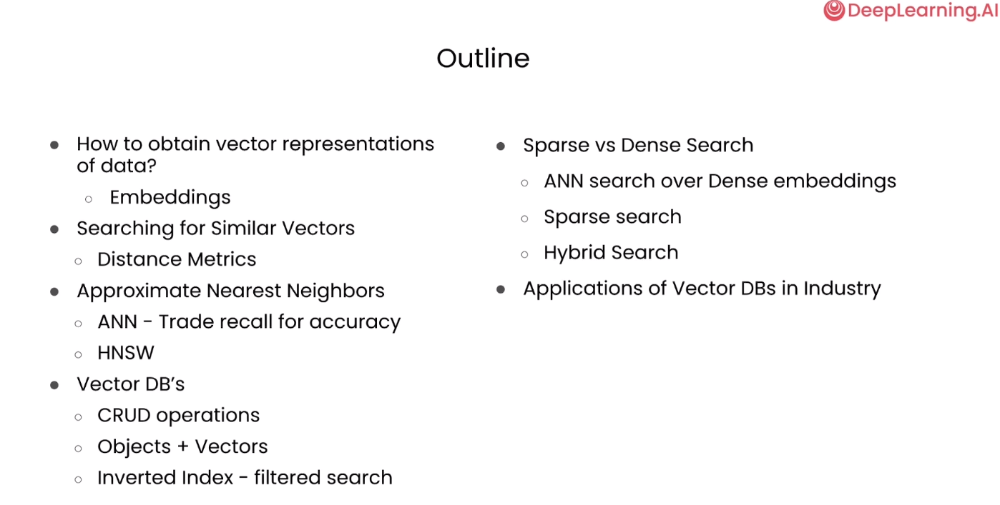


# [1] How to Obtain Vector Representations of Data


## Where do embeddings come from?
### Embedding MNIST images and NLP sentences into vectors.


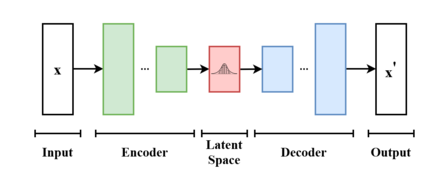


```py
import numpy as np
import matplotlib.pyplot as plt

from tensorflow.keras.datasets import mnist
from tensorflow.keras.layers import Input, Dense, Lambda
from tensorflow.keras.models import Model
from tensorflow.keras import backend as K
from tensorflow.keras import losses
from scipy.stats import norm

# Load data – training and test
(x_tr, y_tr), (x_te, y_te) = mnist.load_data()

#Normalize and Reshape images (flatten)
x_tr, x_te = x_tr.astype('float32')/255., x_te.astype('float32')/255.
x_tr_flat, x_te_flat = x_tr.reshape(x_tr.shape[0], -1), x_te.reshape(x_te.shape[0], -1)


```

介绍TensorFlow的Lambda层和Model类

在 TensorFlow 中，`Lambda` 和 `Model` 都是 Keras 中的类，用于构建神经网络模型。

1. **Lambda**：
   `Lambda` 是 Keras 中的一个层（Layer），它允许您使用简单的函数来包装任意表达式，然后将其作为层应用到神经网络中。这个层对于在构建模型时需要自定义的操作非常有用，例如添加自定义的损失函数、自定义的激活函数等。`Lambda` 层接受一个函数作为参数，并将该函数应用于输入数据。通常情况下，您可以使用 Python 的 lambda 函数来创建一个匿名函数并将其传递给 `Lambda` 层。

2. **Model**：
   `Model` 是 Keras 中的一个类，用于定义和构建神经网络模型。`Model` 类允许您通过连接各种层（Layer）来构建复杂的神经网络结构，并定义输入和输出。您可以通过将输入张量（Tensor）传递给模型的输入层（Input Layer）和输出层（Output Layer）来创建一个模型对象，然后使用该模型对象来进行训练、评估和预测。

下面是一个示例代码，演示了如何使用 `Lambda` 层和 `Model` 类：

```python
import tensorflow as tf
from tensorflow.keras.layers import Input, Dense, Lambda
from tensorflow.keras.models import Model

# 定义输入张量
inputs = Input(shape=(10,))

# 使用 Lambda 层添加一个自定义的操作（在此示例中为一个简单的平方函数）
squared_layer = Lambda(lambda x: tf.square(x))(inputs)

# 添加一个密集连接层
dense_layer = Dense(64, activation='relu')(squared_layer)

# 添加输出层
outputs = Dense(1, activation='sigmoid')(dense_layer)

# 创建模型对象
model = Model(inputs=inputs, outputs=outputs)

# 编译模型
model.compile(optimizer='adam', loss='binary_crossentropy', metrics=['accuracy'])

# 打印模型结构
model.summary()
```

在这个例子中，我们首先定义了一个输入张量 `inputs`，然后使用 `Lambda` 层将输入张量应用一个平方函数（即将输入张量的每个元素平方）。然后，我们将平方后的张量传递给一个密集连接层（Dense Layer），再添加一个输出层，最后使用 `Model` 类将输入和输出连接起来构建了一个完整的神经网络模型。


```py
print(x_tr.shape, x_te.shape)
print(x_tr_flat.shape, x_te_flat.shape)
```

Output

```py
(60000, 28, 28) (10000, 28, 28)
(60000, 784) (10000, 784)
```


```py
# Neural Network Parameters
batch_size, n_epoch = 100, 50
n_hidden, z_dim = 256, 2

# Example of a training image
plt.imshow(x_tr[1]);
```

Output

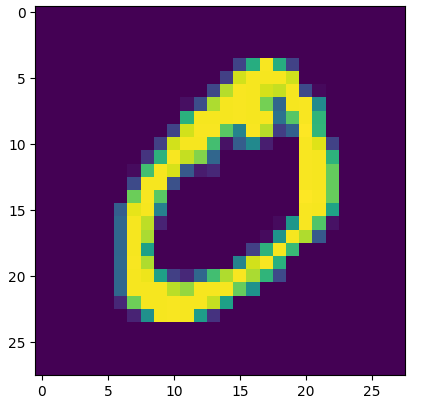


```py
# sampling function
def sampling(args):
    mu, log_var = args
    eps = K.random_normal(shape=(batch_size, z_dim), mean=0., stddev=1.0)
    return mu + K.exp(log_var) * eps


# Encoder - from 784->256->128->2
inputs_flat = Input(shape=(x_tr_flat.shape[1:]))
x_flat = Dense(n_hidden, activation='relu')(inputs_flat) # first hidden layer
x_flat = Dense(n_hidden//2, activation='relu')(x_flat)  # second hidden layer

# hidden state, which we will pass into the Model to get the Encoder.
mu_flat = Dense(z_dim)(x_flat)
log_var_flat = Dense(z_dim)(x_flat)
z_flat = Lambda(sampling, output_shape=(z_dim,))([mu_flat, log_var_flat])


```

对`z_flat = Lambda(sampling, output_shape=(z_dim,))([mu_flat, log_var_flat])`的解释:

`[mu_flat, log_var_flat]`：这部分是 `Lambda` 层的输入，它是一个列表，其中包含了要传递给 `sampling` 函数的参数，即 `mu_flat` 和 `log_var_flat`。在函数调用时，这些参数会按照顺序传递给 `sampling` 函数。


```py
#Decoder - from 2->128->256->784
latent_inputs = Input(shape=(z_dim,))
z_decoder1 = Dense(n_hidden//2, activation='relu')
z_decoder2 = Dense(n_hidden, activation='relu')
y_decoder = Dense(x_tr_flat.shape[1], activation='sigmoid')
z_decoded = z_decoder1(latent_inputs)
z_decoded = z_decoder2(z_decoded)
y_decoded = y_decoder(z_decoded)
decoder_flat = Model(latent_inputs, y_decoded, name="decoder_conv")

outputs_flat = decoder_flat(z_flat)
```


```py
# variational autoencoder (VAE) - to reconstruction input
reconstruction_loss = losses.binary_crossentropy(inputs_flat,
                                                 outputs_flat) * x_tr_flat.shape[1]
kl_loss = 0.5 * K.sum(K.square(mu_flat) + K.exp(log_var_flat) - log_var_flat - 1, axis = -1)
vae_flat_loss = reconstruction_loss + kl_loss

# Build model
#  Ensure that the reconstructed outputs are as close to the inputs
vae_flat = Model(inputs_flat, outputs_flat)
vae_flat.add_loss(vae_flat_loss)
vae_flat.compile(optimizer='adam')
```


```py
# train
vae_flat.fit(
    x_tr_flat,
    shuffle=True,
    epochs=n_epoch,
    batch_size=batch_size,
    validation_data=(x_te_flat, None),
    verbose=1
)
```

Output

```py
600/600 [==============================] - 7s 12ms/step - loss: 135.1252 - val_loss: 136.8185
Epoch 49/50
600/600 [==============================] - 7s 12ms/step - loss: 135.0000 - val_loss: 136.6488
Epoch 50/50
600/600 [==============================] - 7s 12ms/step - loss: 135.2855 - val_loss: 137.1282
<keras.src.callbacks.History at 0x7fc0e9ac28b0>
```


### Visualize Embeddings


```py
# Build encoders
encoder_f = Model(inputs_flat, z_flat)  # flat encoder
```


```py
# Plot of the digit classes in the latent space
x_te_latent = encoder_f.predict(x_te_flat, batch_size=batch_size,verbose=0)
plt.figure(figsize=(8, 6))
plt.scatter(x_te_latent[:, 0], x_te_latent[:, 1], c=y_te, alpha=0.75)
plt.title('MNIST 2D Embeddings')
plt.colorbar()
plt.show()
```


## Example: compare three embeddings


```py
plt.imshow(x_te_flat[10].reshape(28,28));
plt.imshow(x_te_flat[13].reshape(28,28));
plt.imshow(x_te_flat[2].reshape(28,28));
```


```py
# calculate vectors for each digit
zero_A = x_te_latent[10]
zero_B = x_te_latent[13]
one = x_te_latent[2]

print(f"Embedding for the first ZERO is  {zero_A}")
print(f"Embedding for the second ZERO is {zero_B}")
print(f"Embedding for the ONE is         {one}")
```


Output

```py
Embedding for the first ZERO is  [-0.18359375 -0.20387068]
Embedding for the second ZERO is [-0.19034849 -0.12130051]
Embedding for the ONE is         [0.44944474 1.9286432 ]
```


## Using more advanced models based on the Transformer architecture you can embed sentences as well.


```py
from sentence_transformers import SentenceTransformer

model = SentenceTransformer('paraphrase-MiniLM-L6-v2')
```


```py
#Sentences we want to encode. Example:
sentence = ['The team enjoyed the hike through the meadow',
            'The national park had great views',
            'Olive oil drizzled over pizza tastes delicious']
```


```py
#Sentences are encoded by calling model.encode()
embedding = model.encode(sentence)

#Preview the embeddings
print(embedding) 

embedding.shape # (3, 384)
```

在使用 SentenceTransformer 模型时，通常情况下，`encode` 方法返回的 `embedding` 是一个二维的 numpy 数组，其中每一行代表一个句子的嵌入向量。每个句子嵌入向量的维度通常是固定的，由所选择的预训练模型决定。

Output

```py
[[ 0.3706197   0.2641425   0.21265654 ...  0.14994532 -0.2579492
  -0.2397075 ]
 [ 0.66933304  0.40094963 -0.48208407 ...  0.10645866 -1.5067165
  -0.01547357]
 [-0.2655591   0.11172403 -0.14733036 ...  0.42197466  0.88394594
   0.10763935]]
```


```py
import seaborn as sns
import matplotlib.pyplot as plt

sns.heatmap(embedding[0].reshape(-1,384),cmap="Greys",center=0,square=False)
plt.gcf().set_size_inches(10,1)
plt.axis('off')
plt.show()

sns.heatmap(embedding[1].reshape(-1,384),cmap="Greys",center=0,square=False)
plt.gcf().set_size_inches(10,1)
plt.axis('off')
plt.show()

sns.heatmap(embedding[2].reshape(-1,384),cmap="Greys",center=0,square=False)
plt.gcf().set_size_inches(10,1)
plt.axis('off')
plt.show()
```


Output


## How can we measure the distance between these Image and Sentence Embeddings?

There are many ways to calculate the distances between two vectors.

Here we will cover 4 distance metrics that you might find being used in the context of vector databases:
- Euclidean Distance(L2)
- Manhattan Distance(L1)
- Dot Product
- Cosine Distance


### Euclidean Distance(L2)

The length of the shortest path between two points or vectors.

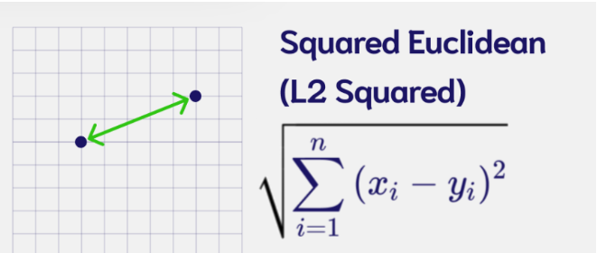


```py
# Euclidean Distance
L2 = [(zero_A[i] - zero_B[i])**2 for i in range(len(zero_A))]
L2 = np.sqrt(np.array(L2).sum())
print(L2)

#An alternative way of doing this
np.linalg.norm((zero_A - zero_B), ord=2)


#Calculate L2 distances
print("Distance zeroA-zeroB:", np.linalg.norm((zero_A - zero_B), ord=2))
print("Distance zeroA-one:  ", np.linalg.norm((zero_A - one), ord=2))
print("Distance zeroB-one:  ", np.linalg.norm((zero_B - one), ord=2))
```


### Manhattan Distance(L1)
Distance between two points if one was constrained to move only along one axis at a time.


```py
# Manhattan Distance
L1 = [zero_A[i] - zero_B[i] for i in range(len(zero_A))]
L1 = np.abs(L1).sum()

print(L1)


#an alternative way of doing this is
np.linalg.norm((zero_A - zero_B), ord=1)

#Calculate L1 distances
print("Distance zeroA-zeroB:", np.linalg.norm((zero_A - zero_B), ord=1))
print("Distance zeroA-one:  ", np.linalg.norm((zero_A - one), ord=1))
print("Distance zeroB-one:  ", np.linalg.norm((zero_B - one), ord=1))
```


### Dot Product

Measures the magnitude of the projection of one vector onto the other.

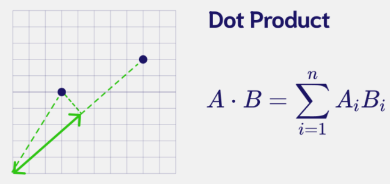

```py
# Dot Product
np.dot(zero_A,zero_B)

#Calculate Dot products
print("Distance zeroA-zeroB:", np.dot(zero_A, zero_B))
print("Distance zeroA-one:  ", np.dot(zero_A, one))
print("Distance zeroB-one:  ", np.dot(zero_B, one))
```


### Cosine Distance
Measure the difference in directionality between vectors.


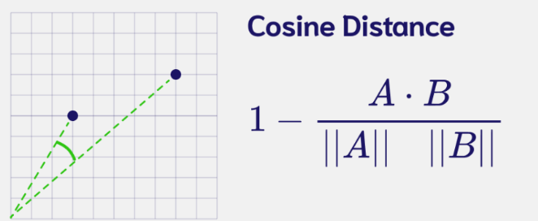


```py
# Cosine Distance
cosine = 1 - np.dot(zero_A,zero_B)/(np.linalg.norm(zero_A)*np.linalg.norm(zero_B))
print(f"{cosine:.6f}")

zero_A/zero_B

# Cosine Distance function
def cosine_distance(vec1,vec2):
  cosine = 1 - (np.dot(vec1, vec2)/(np.linalg.norm(vec1)*np.linalg.norm(vec2)))
  return cosine
  

#Cosine Distance
print(f"Distance zeroA-zeroB: {cosine_distance(zero_A, zero_B): .6f}")
print(f"Distance zeroA-one:   {cosine_distance(zero_A, one): .6f}")
print(f"Distance zeroB-one:   {cosine_distance(zero_B, one): .6f}")
```


## Now with the sentence embeddings!

Dot Product and Cosine Distance are commonly used in the field of NLP, to evaluate how similar two sentence embeddings are.
So here we will only use those two.

- embedding0 - 'The team enjoyed the hike through the meadow'

- embedding1 - The national park had great views'

- embedding2 - 'Olive oil drizzled over pizza tastes delicious'


```py
#Dot Product
print("Distance 0-1:", np.dot(embedding[0], embedding[1]))
print("Distance 0-2:", np.dot(embedding[0], embedding[2]))
print("Distance 1-2:", np.dot(embedding[1], embedding[2]))
```

Output

```py
Distance 0-1: 26.49789
Distance 0-2: 2.0785775
Distance 1-2: 4.0192113
```

```py
#Cosine Distance
print("Distance 0-1: ", cosine_distance(embedding[0], embedding[1]))
print("Distance 0-2: ", cosine_distance(embedding[0], embedding[2]))
print("Distance 1-2: ", cosine_distance(embedding[1], embedding[2]))
```


Output

```py
Distance 0-1:  0.5350335538387299
Distance 0-2:  0.9639393128454685
Distance 1-2:  0.9288790971040726
```


# [2] Search for Similar Vectors


K Nearest Neighbors


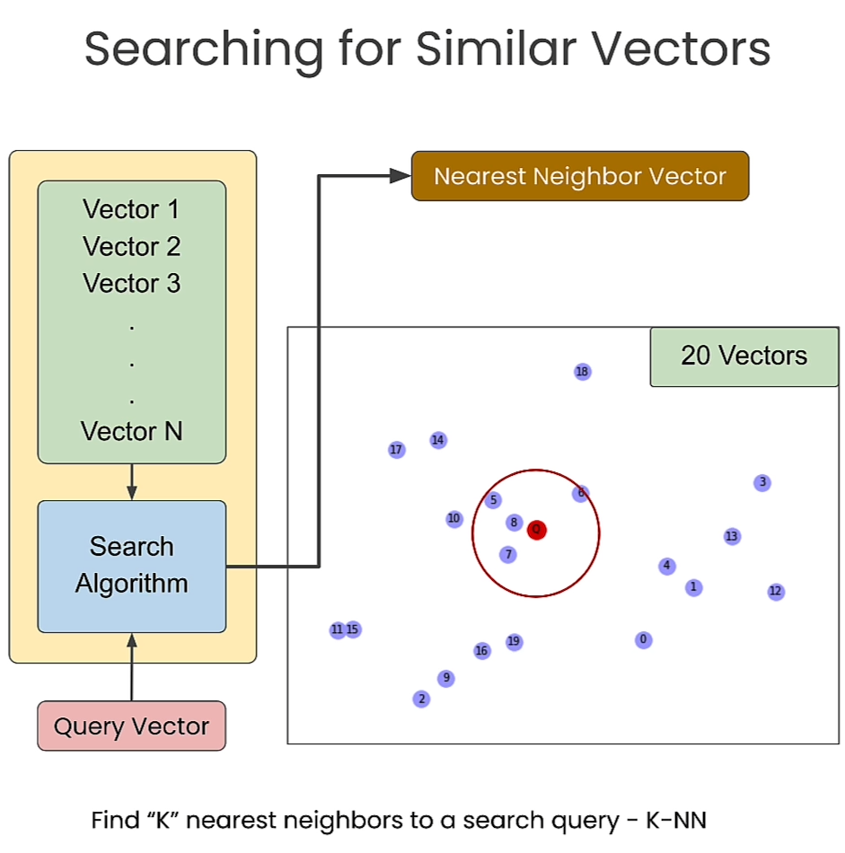


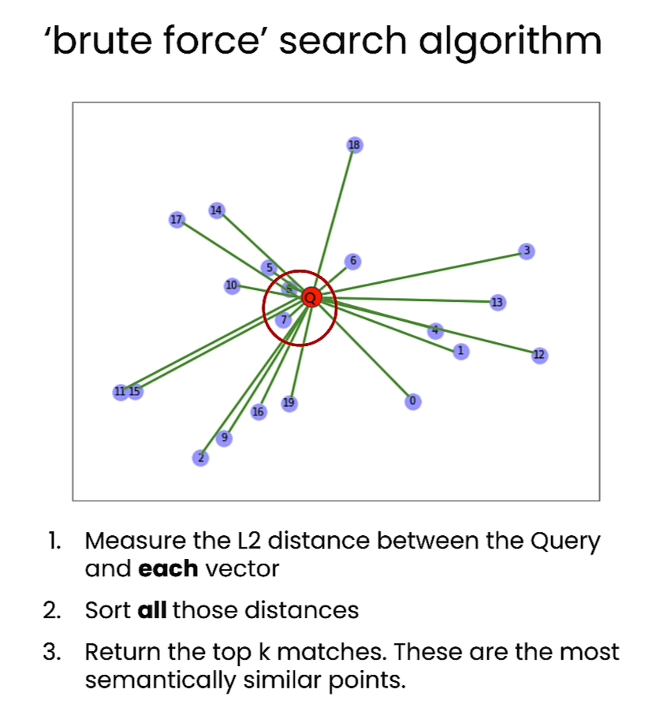


```py
import numpy as np
import matplotlib.pyplot as plt
from sklearn.neighbors import NearestNeighbors
import time
np.random.seed(42)

# Generate 20 data points with 2 dimensions
X = np.random.rand(20,2)

# Display Embeddings
n = range(len(X))

fig, ax = plt.subplots()
ax.scatter(X[:,0], X[:,1], label='Embeddings')
ax.legend()

for i, txt in enumerate(n):
    ax.annotate(txt, (X[i,0], X[i,1]))
```

Output

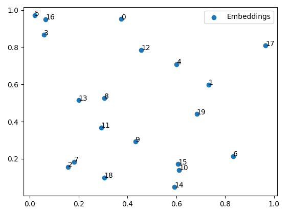

```py
k = 4

neigh = NearestNeighbors(n_neighbors=k, algorithm='brute', metric='euclidean')
neigh.fit(X)

# Display Query with data
n = range(len(X))

fig, ax = plt.subplots()
ax.scatter(X[:,0], X[:,1])
ax.scatter(0.45,0.2, c='red',label='Query')
ax.legend()

for i, txt in enumerate(n):
    ax.annotate(txt, (X[i,0], X[i,1]))
```

Output

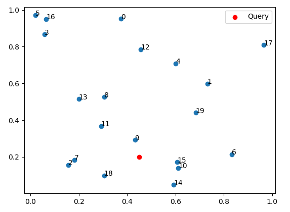


```py
neighbours = neigh.kneighbors([[0.45,0.2]], k, return_distance=True)
print(neighbours)
```

Output

```py
(array([[0.09299859, 0.16027853, 0.1727928 , 0.17778682]]), array([[ 9, 15, 10, 18]]))
```


```py
t0 = time.time()
neighbours = neigh.kneighbors([[0.45,0.2]], k, return_distance=True)
t1 = time.time()

query_time = t1-t0
print(f"Runtime: {query_time: .4f} seconds")
```


Output

```py
Runtime:  0.0023 seconds
```


```py
def speed_test(count):
    # generate random objects
    data = np.random.rand(count,2)
    
    # prepare brute force index
    k=4
    neigh = NearestNeighbors(n_neighbors=k, algorithm='brute', metric='euclidean')
    neigh.fit(data)

    # measure time for a brute force query
    t0 = time.time()
    neighbours = neigh.kneighbors([[0.45,0.2]], k, return_distance=True)
    t1 = time.time()

    total_time = t1-t0
    print (f"Runtime: {total_time: .4f}")

    return total_time
```


```py
time20k = speed_test(20_000)
# Brute force examples
time200k = speed_test(200_000)
time2m = speed_test(2_000_000)
time20m = speed_test(20_000_000)
time200m = speed_test(200_000_000)
```

Output

```py
Runtime:  0.0016
Runtime:  0.0025
Runtime:  0.0177
Runtime:  0.1631
Runtime:  1.6035
```


## Brute force kNN implemented by hand on `768` dimensional embeddings


```py
documents = 1000
dimensions = 768

embeddings = np.random.randn(documents, dimensions) # 1000 documents, 768-dimensional embeddings
embeddings = embeddings / np.sqrt((embeddings**2).sum(1, keepdims=True)) # L2 normalize the rows, as is common

query = np.random.randn(768) # the query vector
query = query / np.sqrt((query**2).sum()) # normalize query


# kNN
t0 = time.time()
# Calculate Dot Product between the query and all data items
similarities = embeddings.dot(query)
# Sort results
sorted_ix = np.argsort(-similarities)
t1 = time.time()

total = t1-t0
print(f"Runtime for dim={dimensions}, documents_n={documents}: {np.round(total,3)} seconds")

print("Top 5 results:")
for k in sorted_ix[:5]:
    print(f"Point: {k}, Similarity: {similarities[k]}")
```

Output

```py
Runtime for dim=768, documents_n=1000: 0.064 seconds
Top 5 results:
Point: 434, Similarity: 0.11658853328636033
Point: 41, Similarity: 0.10319523603880203
Point: 677, Similarity: 0.09041193794869379
Point: 13, Similarity: 0.0856056395158937
Point: 438, Similarity: 0.08410763673528121
```


```py
n_runs = [1_000, 10_000, 100_000, 500_000]

for n in n_runs:
    embeddings = np.random.randn(n, dimensions) #768-dimensional embeddings
    query = np.random.randn(768) # the query vector
    
    t0 = time.time()
    similarities = embeddings.dot(query)
    sorted_ix = np.argsort(-similarities)
    t1 = time.time()

    total = t1-t0
    print(f"Runtime for 1 query with dim={dimensions}, documents_n={n}: {np.round(total,3)} seconds")
```

Output

```py
Runtime for 1 query with dim=768, documents_n=1000: 0.0 seconds
Runtime for 1 query with dim=768, documents_n=10000: 0.002 seconds
Runtime for 1 query with dim=768, documents_n=100000: 0.201 seconds
Runtime for 1 query with dim=768, documents_n=500000: 0.644 seconds
```


```py
print (f"To run 1,000 queries: {total * 1_000/60 : .2f} minutes")
```

Output

```py
To run 1,000 queries:  10.73 minutes
```


# [3] Approximate Nearest Neighbors


"Approximate Nearest Neighbors"（ANN）是一种近似最近邻算法，旨在高效地找到给定查询点的最近邻近似值，而无需考虑所有可能的数据点。在大规模数据集上，传统的最近邻搜索算法可能会耗费大量时间和计算资源，因此近似最近邻算法通过牺牲精确性来换取更高的搜索速度和更低的资源消耗。

ANN 算法通过使用一些启发式方法或数据结构来加速最近邻搜索过程。这些方法可以是基于空间划分的技术，如KD 树、球树等，也可以是基于图的技术，如 HNSW、LSH 等。这些算法通常会在返回结果时提供一个近似值，而不是严格的最近邻。

ANN 算法在许多应用中都得到了广泛的应用，例如高维数据的近似搜索、图像检索、推荐系统等。尽管返回的结果可能不是完全精确的最近邻，但在许多实际情况下，这种近似搜索仍然能够提供良好的性能，并且可以在大规模数据集上进行高效处理。


```py
from random import random, randint
from math import floor, log
import networkx as nx
import numpy as np
import matplotlib as mtplt
from matplotlib import pyplot as plt
from utils import *

vec_num = 40 # Number of vectors (nodes)
dim = 2 ## Dimention. Set to be 2. All the graph plots are for dim 2. If changed, then plots should be commented. 
m_nearest_neighbor = 2 # M Nearest Neigbor used in construction of the Navigable Small World (NSW)

vec_pos = np.random.uniform(size=(vec_num, dim))
```

### Query Vector

```py
## Query
query_vec = [0.5, 0.5]

nodes = []
nodes.append(("Q",{"pos": query_vec}))

G_query = nx.Graph()
G_query.add_nodes_from(nodes)

print("nodes = ", nodes, flush=True)

pos_query=nx.get_node_attributes(G_query,'pos')
```

Output

```py
nodes =  [('Q', {'pos': [0.5, 0.5]})]
```

## Brute Force

```py
(G_lin, G_best) = nearest_neigbor(vec_pos,query_vec)

pos_lin=nx.get_node_attributes(G_lin,'pos')
pos_best=nx.get_node_attributes(G_best,'pos')

fig, axs = plt.subplots()

nx.draw(G_lin, pos_lin, with_labels=True, node_size=150, node_color=[[0.8,0.8,1]], width=0.0, font_size=7, ax = axs)
nx.draw(G_query, pos_query, with_labels=True, node_size=200, node_color=[[0.5,0,0]], font_color='white', width=0.5, font_size=7, font_weight='bold', ax = axs)
nx.draw(G_best, pos_best, with_labels=True, node_size=200, node_color=[[0.85,0.7,0.2]], width=0.5, font_size=7, font_weight='bold', ax = axs)
```

Output

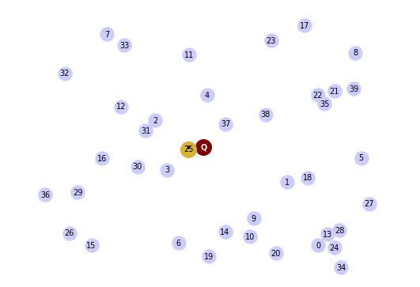

### HNSW Construction


HNSW，即"层次可导航小世界"（Hierarchical Navigable Small World），是一种用于高效近似最近邻搜索的算法。它由 Yu. A. Malkov 和 D. A. Yashunin 在2016年提出。

HNSW 的主要思想是将数据空间划分为多个层级，每个层级中的数据点都被组织成一个小世界图（small world graph），该图具有导航性质，可以在不同层级之间进行快速的近似最近邻搜索。每个数据点都被分配到一个特定的层级，并在该层级上构建一个小世界图，其中节点之间的连接被用于加速最近邻搜索。

HNSW 算法具有以下特点：

1. **层级结构**：数据空间被组织成多个层级，每个层级上都有一个小世界图。

2. **导航性**：在小世界图中，节点之间的连接被设计为具有良好的导航性质，可以快速地在图中进行搜索。

3. **高效性**：由于层级结构和导航性质，HNSW 算法能够在大规模数据集上进行高效的近似最近邻搜索，通常具有较低的时间复杂度和内存消耗。

4. **近似性**：HNSW 算法返回的结果是近似最近邻，而不是严格的最近邻。这意味着返回的结果可能不是绝对精确的，但在许多应用中仍然能够提供令人满意的性能。

HNSW 算法在许多实际应用中得到了广泛的应用，如图像检索、推荐系统、高维数据的近似搜索等领域。它是一种有效的近似最近邻搜索方法，能够在大规模数据集上提供快速和高效的搜索能力。

以下是使用 `nmslib` 库中的 `hnsw` 算法实现的 Python 代码示例：

```python
import nmslib

def construct_HNSW(vec_pos, m_nearest_neighbor):
    # 初始化 HNSW 模型
    hnsw_index = nmslib.init(method='hnsw', space='cosinesimil')
    
    # 添加数据点到 HNSW 模型中
    hnsw_index.addDataPointBatch(vec_pos)
    
    # 设置 HNSW 参数
    hnsw_index.createIndex({'M': m_nearest_neighbor, 'efConstruction': 200})
    
    return hnsw_index

# 示例用法
# 构建 HNSW 模型
vec_pos = [...]  # 向量位置信息
m_nearest_neighbor = 10  # 每个节点的最近邻数量
hnsw_model = construct_HNSW(vec_pos, m_nearest_neighbor)

# 查询最近邻
query_point = [...]  # 查询点
k = 5  # 要获取的最近邻数量
ids, distances = hnsw_model.knnQuery(query_point, k=k)

print("最近邻 IDs:", ids)
print("最近邻距离:", distances)
```

在这个示例中，我们使用了 `nmslib` 库中的 `hnsw` 方法来构建和使用 HNSW 模型。首先，我们使用 `construct_HNSW` 函数构建了 HNSW 模型，并将数据点添加到模型中。然后，我们可以使用 `knnQuery` 方法查询给定查询点的最近邻。


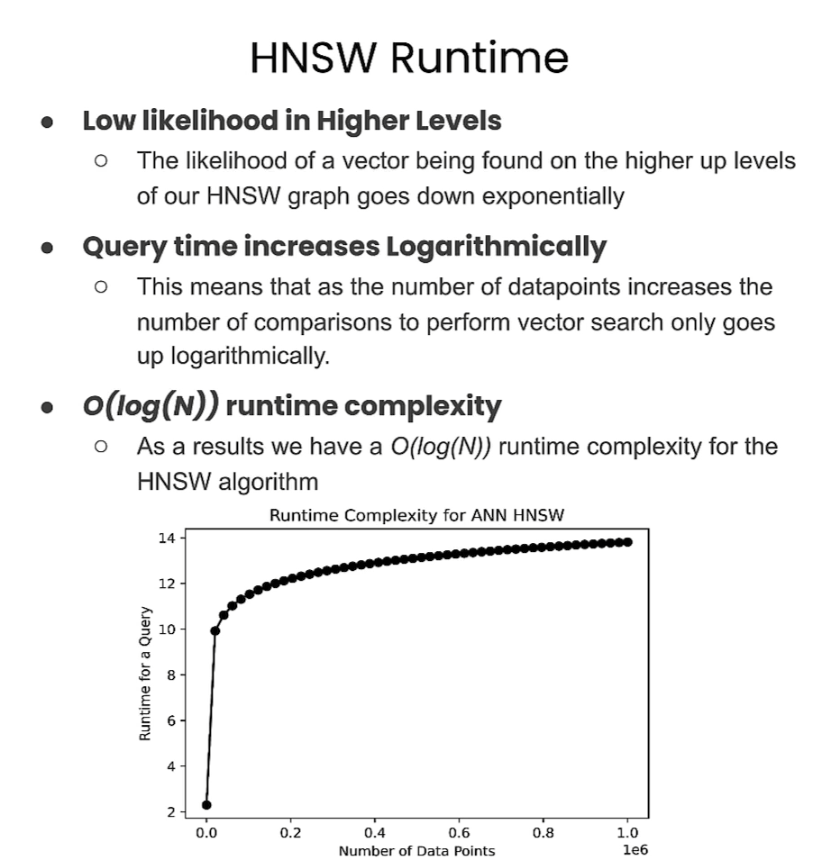


```py
GraphArray = construct_HNSW(vec_pos,m_nearest_neighbor)

for layer_i in range(len(GraphArray)-1,-1,-1):
    fig, axs = plt.subplots()

    print("layer_i = ", layer_i)
        
    if layer_i>0:
        pos_layer_0 = nx.get_node_attributes(GraphArray[0],'pos')
        nx.draw(GraphArray[0], pos_layer_0, with_labels=True, node_size=120, node_color=[[0.9,0.9,1]], width=0.0, font_size=6, font_color=(0.65,0.65,0.65), ax = axs)

    pos_layer_i = nx.get_node_attributes(GraphArray[layer_i],'pos')
    nx.draw(GraphArray[layer_i], pos_layer_i, with_labels=True, node_size=150, node_color=[[0.7,0.7,1]], width=0.5, font_size=7, ax = axs)
    nx.draw(G_query, pos_query, with_labels=True, node_size=200, node_color=[[0.8,0,0]], width=0.5, font_size=7, font_weight='bold', ax = axs)
    nx.draw(G_best, pos_best, with_labels=True, node_size=200, node_color=[[0.85,0.7,0.2]], width=0.5, font_size=7, font_weight='bold', ax = axs)
    plt.show()
```


Output

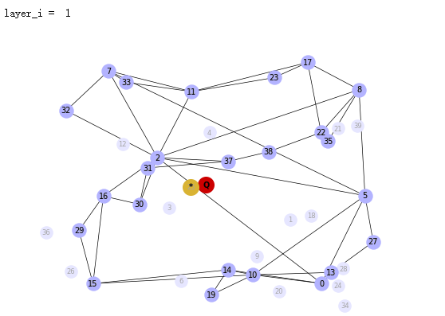

### HNSW Search


```py
(SearchPathGraphArray, EntryGraphArray) = search_HNSW(GraphArray,G_query)

for layer_i in range(len(GraphArray)-1,-1,-1):
    fig, axs = plt.subplots()

    print("layer_i = ", layer_i)
    G_path_layer = SearchPathGraphArray[layer_i]
    pos_path = nx.get_node_attributes(G_path_layer,'pos')
    G_entry = EntryGraphArray[layer_i]
    pos_entry = nx.get_node_attributes(G_entry,'pos')

    if layer_i>0:
            pos_layer_0 = nx.get_node_attributes(GraphArray[0],'pos')
            nx.draw(GraphArray[0], pos_layer_0, with_labels=True, node_size=120, node_color=[[0.9,0.9,1]], width=0.0, font_size=6, font_color=(0.65,0.65,0.65), ax = axs)

    pos_layer_i = nx.get_node_attributes(GraphArray[layer_i],'pos')
    nx.draw(GraphArray[layer_i], pos_layer_i, with_labels=True, node_size=100, node_color=[[0.7,0.7,1]], width=0.5, font_size=6, ax = axs)
    nx.draw(G_path_layer, pos_path, with_labels=True, node_size=110, node_color=[[0.8,1,0.8]], width=0.5, font_size=6, ax = axs)
    nx.draw(G_query, pos_query, with_labels=True, node_size=80, node_color=[[0.8,0,0]], width=0.5, font_size=7, ax = axs)
    nx.draw(G_best, pos_best, with_labels=True, node_size=70, node_color=[[0.85,0.7,0.2]], width=0.5, font_size=7, ax = axs)
    nx.draw(G_entry, pos_entry, with_labels=True, node_size=80, node_color=[[0.1,0.9,0.1]], width=0.5, font_size=7, ax = axs)
    plt.show()
```


Output


utils.py文件内容

```py

import numpy as np
import networkx as nx
from random import random, randint
from math import floor, log
np.random.seed(44)

def nearest_neigbor(vec_pos,query_vec):
    nearest_neighbor_index = -1
    nearest_dist = float('inf')

    nodes = []
    edges = []
    for i in range(np.shape(vec_pos)[0]):
        nodes.append((i,{"pos": vec_pos[i,:]}))
        if i<np.shape(vec_pos)[0]-1:
            edges.append((i,i+1))
        else:
            edges.append((i,0))

        dist = np.linalg.norm(query_vec-vec_pos[i])
        if dist < nearest_dist:
            nearest_neighbor_index = i
            nearest_dist = dist
        
    G_lin = nx.Graph()
    G_lin.add_nodes_from(nodes)
    G_lin.add_edges_from(edges)

    nodes = []
    nodes.append(("*",{"pos": vec_pos[nearest_neighbor_index,:]}))
    G_best = nx.Graph()
    G_best.add_nodes_from(nodes)
    return G_lin, G_best


def layer_num(max_layers: int):
    # new element's topmost layer: notice the normalization by mL
    mL = 1.5
    layer_i = floor(-1 * log(random()) * mL)
    # ensure we don't exceed our allocated layers.
    layer_i = min(layer_i, max_layers-1)
    return layer_i
    #return randint(0,max_layers-1)


def construct_HNSW(vec_pos,m_nearest_neighbor):
    max_layers = 4

    vec_num = np.shape(vec_pos)[0]
    dist_mat = np.zeros((vec_num,vec_num))

    for i in range(vec_num):
        for j in range(i,vec_num):
            dist = np.linalg.norm(vec_pos[i,:]-vec_pos[j,:])
            dist_mat[i,j] = dist
            dist_mat[j,i] = dist

    node_layer = []
    for i in range(np.shape(vec_pos)[0]):
        node_layer.append(layer_num(max_layers))
        
    max_num_of_layers = max(node_layer) + 1 ## layer indices start from 0
    GraphArray = []
    for layer_i in range(max_num_of_layers):
        nodes = []
        edges = []
        edges_nn = []
        for i in range(np.shape(vec_pos)[0]): ## Number of Vectors
            if node_layer[i] >= layer_i:
                nodes.append((i,{"pos": vec_pos[i,:]}))

        G = nx.Graph()
        G.add_nodes_from(nodes)

        pos=nx.get_node_attributes(G,'pos')

        for i in range (len(G.nodes)):
            node_i = nodes[i][0]
            nearest_edges = -1
            nearest_distances = float('inf')
            candidate_edges = range(0,i)
            candidate_edges_indices = []
            
            #######################
            for j in candidate_edges:
                node_j = nodes[j][0]
                candidate_edges_indices.append(node_j)
            
            dist_from_node = dist_mat[node_i,candidate_edges_indices]
            num_nearest_neighbor = min(m_nearest_neighbor,i) ### Add note comment
            
            if num_nearest_neighbor > 0:
                indices = np.argsort(dist_from_node)
                for nn_i in range(num_nearest_neighbor):
                        edges_nn.append((node_i,candidate_edges_indices[indices[nn_i]]))
            
            for j in candidate_edges:
                node_j = nodes[j][0]            
                dist = np.linalg.norm(pos[node_i]-pos[node_j])
                if dist < nearest_distances:
                    nearest_edges = node_j
                    nearest_distances = dist
            
            if nearest_edges != -1:
                edges.append((node_i,nearest_edges))

        G.add_edges_from(edges_nn)

        GraphArray.append(G)
        
    return GraphArray


## Search the Graph
def search_HNSW(GraphArray,G_query):
    max_layers = len(GraphArray)
    G_top_layer = GraphArray[max_layers - 1]
    num_nodes = G_top_layer.number_of_nodes()
    entry_node_r = randint(0,num_nodes-1)
    nodes_list = list(G_top_layer.nodes)
    entry_node_index = nodes_list[entry_node_r]
    #entry_node_index = 26

    SearchPathGraphArray = []
    EntryGraphArray = []
    for l_i in range(max_layers):
        layer_i = max_layers - l_i - 1
        G_layer = GraphArray[layer_i]
        
        G_entry = nx.Graph()
        nodes = []
        p = G_layer.nodes[entry_node_index]['pos']
        nodes.append((entry_node_index,{"pos": p}))
        G_entry.add_nodes_from(nodes)
        
        nearest_node_layer = entry_node_index
        nearest_distance_layer = np.linalg.norm( G_layer.nodes[entry_node_index]['pos'] - G_query.nodes['Q']['pos'])
        current_node_index = entry_node_index

        G_path_layer = nx.Graph()
        nodes_path = []
        p = G_layer.nodes[entry_node_index]['pos']
        nodes_path.append((entry_node_index,{"pos": p}))

        cond = True
        while cond:
            nearest_node_current = -1
            nearest_distance_current = float('inf')
            for neihbor_i in G_layer.neighbors(current_node_index):
                vec1 = G_layer.nodes[neihbor_i]['pos']
                vec2 = G_query.nodes['Q']['pos']
                dist = np.linalg.norm( vec1 - vec2)
                if dist < nearest_distance_current:
                    nearest_node_current = neihbor_i
                    nearest_distance_current = dist
            
            if nearest_distance_current < nearest_distance_layer:
                nearest_node_layer = nearest_node_current
                nearest_distance_layer = nearest_distance_current
                nodes_path.append((nearest_node_current,{"pos": G_layer.nodes[nearest_node_current]['pos']}))
            else:
                cond = False
        
        entry_node_index = nearest_node_layer

        G_path_layer.add_nodes_from(nodes_path)
        SearchPathGraphArray.append(G_path_layer)
        EntryGraphArray.append(G_entry)

    SearchPathGraphArray.reverse()
    EntryGraphArray.reverse()
 
    return SearchPathGraphArray, EntryGraphArray


```


## Pure Vector Search - with a vector database


```py
import weaviate, json
from weaviate import EmbeddedOptions

client = weaviate.Client(
    embedded_options=EmbeddedOptions(),
)

client.is_ready()
```


```py
# resetting the schema. CAUTION: This will delete your collection 
# if client.schema.exists("MyCollection"):
#     client.schema.delete_class("MyCollection")

schema = {
    "class": "MyCollection",
    "vectorizer": "none",
    "vectorIndexConfig": {
        "distance": "cosine" # let's use cosine distance
    },
}

client.schema.create_class(schema)

print("Successfully created the schema.")
```

这段代码的作用是使用 Weaviate 客户端库向 Weaviate 服务创建了一个新的类（或称为对象类型），并定义了其属性和特征。

具体来说：

- `schema` 是一个包含类定义信息的字典，描述了要创建的类的名称、向量化方法和向量索引配置。
  
- `"class": "MyCollection"` 定义了要创建的类的名称为 "MyCollection"。
  
- `"vectorizer": "none"` 指定了该类的向量化方法为 "none"，意味着不对该类的属性进行向量化处理。
  
- `"vectorIndexConfig"` 是一个包含向量索引配置信息的字典，用于定义如何索引该类的向量。
  
- `"distance": "cosine"` 指定了向量索引使用的距离度量方法为余弦距离。
  
- 最后一行代码 `client.schema.create_class(schema)` 调用了 Weaviate 客户端库中的 `create_class()` 方法，用于向 Weaviate 服务创建指定的类。传递给该方法的参数是包含类定义信息的 `schema` 字典。


### Import the Data


```py
data = [
   {
      "title": "First Object",
      "foo": 99, 
      "vector": [0.1, 0.1, 0.1, 0.1, 0.1, 0.1]
   },
   {
      "title": "Second Object",
      "foo": 77, 
      "vector": [0.2, 0.3, 0.4, 0.5, 0.6, 0.7]
   },
   {
      "title": "Third Object",
      "foo": 55, 
      "vector": [0.3, 0.1, -0.1, -0.3, -0.5, -0.7]
   },
   {
      "title": "Fourth Object",
      "foo": 33, 
      "vector": [0.4, 0.41, 0.42, 0.43, 0.44, 0.45]
   },
   {
      "title": "Fifth Object",
      "foo": 11,
      "vector": [0.5, 0.5, 0, 0, 0, 0]
   },
]
```


```py
client.batch.configure(batch_size=10)  # Configure batch

# Batch import all objects
# yes batch is an overkill for 5 objects, but it is recommended for large volumes of data
with client.batch as batch:
  for item in data:

      properties = {
         "title": item["title"],
         "foo": item["foo"],
      }

      # the call that performs data insert
      client.batch.add_data_object(
         class_name="MyCollection",
         data_object=properties,
         vector=item["vector"] # your vector embeddings go here
      )
        
        
# Check number of objects
response = (
    client.query
    .aggregate("MyCollection")
    .with_meta_count()
    .do()
)

print(response)

```

Output

```json
{'data': {'Aggregate': {'MyCollection': [{'meta': {'count': 0}}]}}}
```

### Query Weaviate: Vector Search (vector embeddings)


```py
response = (
    client.query
    .get("MyCollection", ["title"])
    .with_near_vector({
        "vector": [-0.012, 0.021, -0.23, -0.42, 0.5, 0.5]
    })
    .with_limit(2) # limit the output to only 2
    .do()
)

result = response["data"]["Get"]["MyCollection"]
print(json.dumps(result, indent=2))
```

Output

```json
[
  {
    "title": "Second Object"
  },
  {
    "title": "Fourth Object"
  }
]
```


```py
response = (
    client.query
    .get("MyCollection", ["title"])
    .with_near_vector({
        "vector": [-0.012, 0.021, -0.23, -0.42, 0.5, 0.5]
    })
    .with_limit(2) # limit the output to only 2
    .with_additional(["distance", "vector, id"])
    .do()
)

result = response["data"]["Get"]["MyCollection"]
print(json.dumps(result, indent=2))
```


Output

```json
[
  {
    "_additional": {
      "distance": 0.6506307,
      "id": "36ad7671-aeca-4410-a9ca-a3f2f95f554b",
      "vector": [
        0.2,
        0.3,
        0.4,
        0.5,
        0.6,
        0.7
      ]
    },
    "title": "Second Object"
  },
  {
    "_additional": {
      "distance": 0.8072029,
      "id": "f6d8d141-6152-4af4-8546-023c1ed76784",
      "vector": [
        0.4,
        0.41,
        0.42,
        0.43,
        0.44,
        0.45
      ]
    },
    "title": "Fourth Object"
  }
]
```

### Vector Search with filters


```py
response = (
    client.query
    .get("MyCollection", ["title", "foo"])
    .with_near_vector({
        "vector": [-0.012, 0.021, -0.23, -0.42, 0.5, 0.5]
    })
    .with_additional(["distance, id"]) # output the distance of the query vector to the objects in the database
    .with_where({
        "path": ["foo"],
        "operator": "GreaterThan",
        "valueNumber": 44
    })
    .with_limit(2) # limit the output to only 2
    .do()
)

result = response["data"]["Get"]["MyCollection"]
print(json.dumps(result, indent=2))
```


Output

```json
[
  {
    "_additional": {
      "distance": 0.6506307,
      "id": "36ad7671-aeca-4410-a9ca-a3f2f95f554b"
    },
    "foo": 77,
    "title": "Second Object"
  },
  {
    "_additional": {
      "distance": 0.8284496,
      "id": "8debc8a0-c59b-46b7-b941-cfdc9da5067a"
    },
    "foo": 99,
    "title": "First Object"
  }
]
```


### nearObject Example


```py
response = (
    client.query
    .get("MyCollection", ["title"])
    .with_near_object({ # the id of the the search object
        "id": result[0]['_additional']['id']
    })
    .with_limit(3)
    .with_additional(["distance"])
    .do()
)

result = response["data"]["Get"]["MyCollection"]
print(json.dumps(result, indent=2))
```

在Python中，`json.dumps()` 方法用于将Python数据结构（例如字典、列表等）转换为JSON格式的字符串。`dumps()` 是 "dump string" 的缩写，表示将数据转换为字符串。

在给定的代码中，`json.dumps(result, indent=2)` 将 `response["data"]["Get"]["MyCollection"]` 中的数据转换为JSON格式的字符串，并使用 `indent=2` 参数进行格式化，使其更易读。其中，`indent=2` 表示每个级别的缩进为2个空格。


Output

```json
[
  {
    "_additional": {
      "distance": 0
    },
    "title": "Second Object"
  },
  {
    "_additional": {
      "distance": 0.051573694
    },
    "title": "Fourth Object"
  },
  {
    "_additional": {
      "distance": 0.06506646
    },
    "title": "First Object"
  }
]
```


# [4] Vector Databases

使用Weaviate向量数据库

## Vector Database setup

### Step 1 - Download sample data

```py
import requests
import json

# Download the data
resp = requests.get('https://raw.githubusercontent.com/weaviate-tutorials/quickstart/main/data/jeopardy_tiny.json')
data = json.loads(resp.text)  # Load data

# Parse the JSON and preview it
print(type(data), len(data))

def json_print(data):
    print(json.dumps(data, indent=2))

json_print(data[0])
```


Output

```json
<class 'list'> 10
{
  "Category": "SCIENCE",
  "Question": "This organ removes excess glucose from the blood & stores it as glycogen",
  "Answer": "Liver"
}
```


### Step 2 - Create an embedded instance of Weaviate vector database


```py
import weaviate, os
from weaviate import EmbeddedOptions
import openai

from dotenv import load_dotenv, find_dotenv
_ = load_dotenv(find_dotenv()) # read local .env file
openai.api_key = os.environ['OPENAI_API_KEY']

client = weaviate.Client(
    embedded_options=EmbeddedOptions(),
    additional_headers={
        "X-OpenAI-BaseURL": os.environ['OPENAI_API_BASE'],
        "X-OpenAI-Api-Key": openai.api_key  # Replace this with your actual key
    }
)
print(f"Client created? {client.is_ready()}")
```


Output

```py
embedded weaviate is already listening on port 8079
Embedded weaviate wasn't listening on port 8079, so starting embedded weaviate again
Started /home/jovyan/.cache/weaviate-embedded: process ID 150
```


```py
json_print(client.get_meta())
```

Output

```json
{
  "hostname": "http://127.0.0.1:8079",
  "modules": {
    "generative-openai": {
      "documentationHref": "https://platform.openai.com/docs/api-reference/completions",
      "name": "Generative Search - OpenAI"
    },
    "qna-openai": {
      "documentationHref": "https://platform.openai.com/docs/api-reference/completions",
      "name": "OpenAI Question & Answering Module"
    },
    "ref2vec-centroid": {},
    "reranker-cohere": {
      "documentationHref": "https://txt.cohere.com/rerank/",
      "name": "Reranker - Cohere"
    },
    "text2vec-cohere": {
      "documentationHref": "https://docs.cohere.ai/embedding-wiki/",
      "name": "Cohere Module"
    },
    "text2vec-huggingface": {
      "documentationHref": "https://huggingface.co/docs/api-inference/detailed_parameters#feature-extraction-task",
      "name": "Hugging Face Module"
    },
    "text2vec-openai": {
      "documentationHref": "https://platform.openai.com/docs/guides/embeddings/what-are-embeddings",
      "name": "OpenAI Module"
    }
  },
  "version": "1.22.3"
}
```


## Step 3 - Create Question collection


```py
# resetting the schema. CAUTION: This will delete your collection 
if client.schema.exists("Question"):
    client.schema.delete_class("Question")
class_obj = {
    "class": "Question",
    "vectorizer": "text2vec-openai",  # Use OpenAI as the vectorizer
    "moduleConfig": {
        "text2vec-openai": {
            "model": "ada",
            "modelVersion": "002",
            "type": "text",
            "baseURL": os.environ["OPENAI_API_BASE"]
        }
    }
}

client.schema.create_class(class_obj)
```


## Step 4 - Load sample data and generate vector embeddings


```py
# reminder for the data structure
json_print(data[0])
```

Output

```json
{
  "Category": "SCIENCE",
  "Question": "This organ removes excess glucose from the blood & stores it as glycogen",
  "Answer": "Liver"
}
```


```py
with client.batch.configure(batch_size=5) as batch:
    for i, d in enumerate(data):  # Batch import data
        
        print(f"importing question: {i+1}")
        
        properties = {
            "answer": d["Answer"],
            "question": d["Question"],
            "category": d["Category"],
        }
        
        batch.add_data_object(
            data_object=properties,
            class_name="Question"
        )
```


Output

```py
importing question: 1
importing question: 2
importing question: 3
importing question: 4
importing question: 5
importing question: 6
importing question: 7
importing question: 8
importing question: 9
importing question: 10
```


```py
count = client.query.aggregate("Question").with_meta_count().do()
json_print(count)
```

Output

```json
{
  "data": {
    "Aggregate": {
      "Question": [
        {
          "meta": {
            "count": 10
          }
        }
      ]
    }
  }
}
```


## Let's Extract the vector that represents each question!


```py
# write a query to extract the vector for a question
result = (client.query
          .get("Question", ["category", "question", "answer"])
          .with_additional("vector")
          .with_limit(1)
          .do())

json_print(result)
```


Output

```json
{
  "data": {
    "Get": {
      "Question": [
        {
          "_additional": {
            "vector": [
              0.03600071,
              ...
              ...
              0.012507257,
              0.027764384,
              -0.0013467055,
              -0.027153302,
              -0.022503763,
              0.00086514617,
              -0.0066421973,
              0.0039056118,
            ]
          },
          "answer": "Elephant",
          "category": "ANIMALS",
          "question": "It's the only living mammal in the order Proboseidea"
        }
      ]
    }
  }
}
```


## Query time
What is the distance between the `query`: `biology` and the returned objects?


```py
response = (
    client.query
    .get("Question",["question","answer","category"])
    .with_near_text({"concepts": "biology"})
    .with_additional('distance')
    .with_limit(2)
    .do()
)

json_print(response)
```

Output

```json
{
  "data": {
    "Get": {
      "Question": [
        {
          "_additional": {
            "distance": 0.1979338
          },
          "answer": "DNA",
          "category": "SCIENCE",
          "question": "In 1953 Watson & Crick built a model of the molecular structure of this, the gene-carrying substance"
        },
        {
          "_additional": {
            "distance": 0.20262384
          },
          "answer": "species",
          "category": "SCIENCE",
          "question": "2000 news: the Gunnison sage grouse isn't just another northern sage grouse, but a new one of this classification"
        }
      ]
    }
  }
}
```


```py
response = (
    client.query
    .get("Question", ["question", "answer"])
    .with_near_text({"concepts": ["animals"]})
    .with_limit(10)
    .with_additional(["distance"])
    .do()
)

json_print(response)
```

Output

```json
{
  "data": {
    "Get": {
      "Question": [
        {
          "_additional": {
            "distance": 0.1905309
          },
          "answer": "Elephant",
          "question": "It's the only living mammal in the order Proboseidea"
        },
        {
          "_additional": {
            "distance": 0.19257665
          },
          "answer": "the nose or snout",
          "question": "The gavial looks very much like a crocodile except for this bodily feature"
        },
        {
          "_additional": {
            "distance": 0.20515919
          },
          "answer": "Antelope",
          "question": "Weighing around a ton, the eland is the largest species of this animal in Africa"
        },
        {
          "_additional": {
            "distance": 0.21571577
          },
          "answer": "species",
          "question": "2000 news: the Gunnison sage grouse isn't just another northern sage grouse, but a new one of this classification"
        },
        {
          "_additional": {
            "distance": 0.23743403
          },
          "answer": "the diamondback rattler",
          "question": "Heaviest of all poisonous snakes is this North American rattlesnake"
        },
        {
          "_additional": {
            "distance": 0.24835974
          },
          "answer": "DNA",
          "question": "In 1953 Watson & Crick built a model of the molecular structure of this, the gene-carrying substance"
        },
        {
          "_additional": {
            "distance": 0.25409663
          },
          "answer": "wire",
          "question": "A metal that is ductile can be pulled into this while cold & under pressure"
        },
        {
          "_additional": {
            "distance": 0.2574225
          },
          "answer": "Liver",
          "question": "This organ removes excess glucose from the blood & stores it as glycogen"
        },
        {
          "_additional": {
            "distance": 0.26010656
          },
          "answer": "Sound barrier",
          "question": "In 70-degree air, a plane traveling at about 1,130 feet per second breaks it"
        },
        {
          "_additional": {
            "distance": 0.26971257
          },
          "answer": "the atmosphere",
          "question": "Changes in the tropospheric layer of this are what gives us weather"
        }
      ]
    }
  }
}
```


## We can let the vector database know to remove results after a threshold distance!


```py
response = (
    client.query
    .get("Question", ["question", "answer"])
    .with_near_text({"concepts": ["animals"], "distance": 0.24})
    .with_limit(10)
    .with_additional(["distance"])
    .do()
)

json_print(response)
```

Output

```json
{
  "data": {
    "Get": {
      "Question": [
        {
          "_additional": {
            "distance": 0.1905309
          },
          "answer": "Elephant",
          "question": "It's the only living mammal in the order Proboseidea"
        },
        {
          "_additional": {
            "distance": 0.19257665
          },
          "answer": "the nose or snout",
          "question": "The gavial looks very much like a crocodile except for this bodily feature"
        },
        {
          "_additional": {
            "distance": 0.20515919
          },
          "answer": "Antelope",
          "question": "Weighing around a ton, the eland is the largest species of this animal in Africa"
        },
        {
          "_additional": {
            "distance": 0.21571577
          },
          "answer": "species",
          "question": "2000 news: the Gunnison sage grouse isn't just another northern sage grouse, but a new one of this classification"
        },
        {
          "_additional": {
            "distance": 0.23743403
          },
          "answer": "the diamondback rattler",
          "question": "Heaviest of all poisonous snakes is this North American rattlesnake"
        }
      ]
    }
  }
}
```


## Vector Databases support for CRUD operations


### Create


```py
#Create an object
object_uuid = client.data_object.create(
    data_object={
        'question':"Leonardo da Vinci was born in this country.",
        'answer': "Italy",
        'category': "Culture"
    },
    class_name="Question"
 )

print(object_uuid)
```

Output

```py
522cbacf-e8b1-40b2-b94f-bd2d386bb08d
```

### Read


```py
data_object = client.data_object.get_by_id(object_uuid, class_name="Question")
json_print(data_object)
```

Output

```json
{
  "class": "Question",
  "creationTimeUnix": 1709530173348,
  "id": "522cbacf-e8b1-40b2-b94f-bd2d386bb08d",
  "lastUpdateTimeUnix": 1709530173348,
  "properties": {
    "answer": "Italy",
    "category": "Culture",
    "question": "Leonardo da Vinci was born in this country."
  },
  "vectorWeights": null
}
```


```py
data_object = client.data_object.get_by_id(
    object_uuid,
    class_name='Question',
    with_vector=True
)

json_print(data_object)
```

Output输出会有vector键值对

### Update


```py
client.data_object.update(
    uuid=object_uuid,
    class_name="Question",
    data_object={
        'answer':"Florence, Italy"
    })

data_object = client.data_object.get_by_id(
    object_uuid,
    class_name='Question',
)

json_print(data_object)
```

Output

```json
{
  "class": "Question",
  "creationTimeUnix": 1709530173348,
  "id": "522cbacf-e8b1-40b2-b94f-bd2d386bb08d",
  "lastUpdateTimeUnix": 1709530181624,
  "properties": {
    "answer": "Florence, Italy",
    "category": "Culture",
    "question": "Leonardo da Vinci was born in this country."
  },
  "vectorWeights": null
}
```

### Delete


```py
json_print(client.query.aggregate("Question").with_meta_count().do())
```

Output

```json
{
  "data": {
    "Aggregate": {
      "Question": [
        {
          "meta": {
            "count": 11
          }
        }
      ]
    }
  }
}
```

```py
client.data_object.delete(uuid=object_uuid, class_name="Question")

json_print(client.query.aggregate("Question").with_meta_count().do())
```

Output

```json
{
  "data": {
    "Aggregate": {
      "Question": [
        {
          "meta": {
            "count": 10
          }
        }
      ]
    }
  }
}
```


# [5] Sparse Dense and Hybrid Search


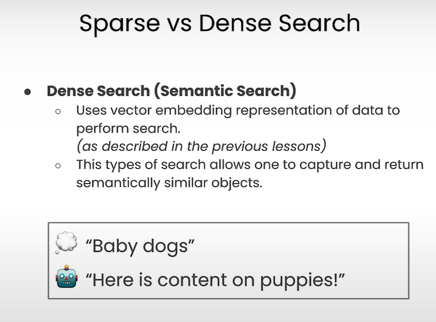

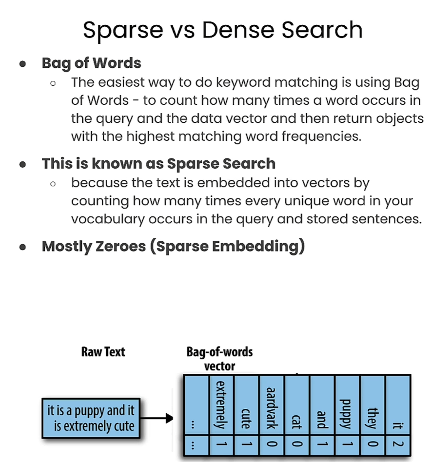


稀疏检索


混合检索: 把向量检索（dense search）和关键词（sparse search）结合起来。

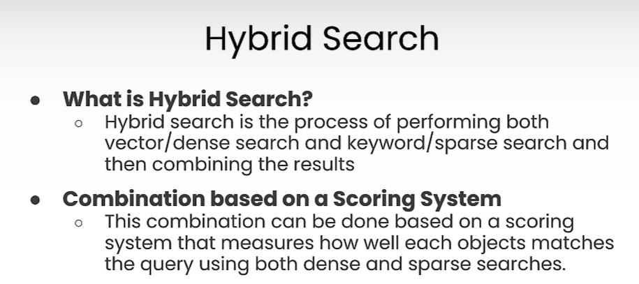


## Recreate the example
With the same data as in the previous lesson

```py
import requests
import json

# Download the data
resp = requests.get('https://raw.githubusercontent.com/weaviate-tutorials/quickstart/main/data/jeopardy_tiny.json')
data = json.loads(resp.text)  # Load data

# Parse the JSON and preview it
print(type(data), len(data))

def json_print(data):
    print(json.dumps(data, indent=2))
```

Output

```py
<class 'list'> 10
```


```py
import weaviate, os
from weaviate import EmbeddedOptions
import openai

from dotenv import load_dotenv, find_dotenv
_ = load_dotenv(find_dotenv()) # read local .env file
openai.api_key = os.environ['OPENAI_API_KEY']

client = weaviate.Client(
    embedded_options=EmbeddedOptions(),
    additional_headers={
        "X-OpenAI-Api-BaseURL": os.environ['OPENAI_API_BASE'],
        "X-OpenAI-Api-Key": openai.api_key,  # Replace this with your actual key
    }
)
print(f"Client created? {client.is_ready()}")
```


```py
# Uncomment the following two lines if you want to run this block for a second time.
if client.schema.exists("Question"):
   client.schema.delete_class("Question")
 
class_obj = {
    "class": "Question",
    "vectorizer": "text2vec-openai",  # Use OpenAI as the vectorizer
    "moduleConfig": {
        "text2vec-openai": {
            "model": "ada",
            "modelVersion": "002",
            "type": "text",
            "baseURL": os.environ["OPENAI_API_BASE"]
        }
    }
}

client.schema.create_class(class_obj)
```


```py
with client.batch.configure(batch_size=5) as batch:
    for i, d in enumerate(data):  # Batch import data
        
        print(f"importing question: {i+1}")
        
        properties = {
            "answer": d["Answer"],
            "question": d["Question"],
            "category": d["Category"],
        }
        
        batch.add_data_object(
            data_object=properties,
            class_name="Question"
        )
```


Output

```py
importing question: 1
importing question: 2
importing question: 3
importing question: 4
importing question: 5
importing question: 6
importing question: 7
importing question: 8
importing question: 9
importing question: 10
```


## Queries


### Dense Search


```py
response = (
    client.query
    .get("Question", ["question", "answer"])
    .with_near_text({"concepts":["animal"]})
    .with_limit(3)
    .do()
)

json_print(response)
```

Output

```json
{
  "data": {
    "Get": {
      "Question": [
        {
          "answer": "Elephant",
          "question": "It's the only living mammal in the order Proboseidea"
        },
        {
          "answer": "the nose or snout",
          "question": "The gavial looks very much like a crocodile except for this bodily feature"
        },
        {
          "answer": "Antelope",
          "question": "Weighing around a ton, the eland is the largest species of this animal in Africa"
        }
      ]
    }
  }
}
```


### Sparse Search - BM25

```py
response = (
    client.query
    .get("Question",["question","answer"])
    .with_bm25(query="animal")
    .with_limit(3)
    .do()
)

json_print(response)
```


Output

```json
{
  "data": {
    "Get": {
      "Question": [
        {
          "answer": "Antelope",
          "question": "Weighing around a ton, the eland is the largest species of this animal in Africa"
        }
      ]
    }
  }
}
```


### Hybrid Search


```py
response = (
    client.query
    .get("Question",["question","answer"])
    .with_hybrid(query="animal", alpha=0.5)
    .with_limit(3)
    .do()
)

json_print(response)
```

Output

```json
{
  "data": {
    "Get": {
      "Question": [
        {
          "answer": "Antelope",
          "question": "Weighing around a ton, the eland is the largest species of this animal in Africa"
        },
        {
          "answer": "Elephant",
          "question": "It's the only living mammal in the order Proboseidea"
        },
        {
          "answer": "the nose or snout",
          "question": "The gavial looks very much like a crocodile except for this bodily feature"
        }
      ]
    }
  }
}
```


```py
response = (
    client.query
    .get("Question",["question","answer"])
    .with_hybrid(query="animal", alpha=0)
    .with_limit(3)
    .do()
)

json_print(response)
```

Output

```json
{
  "data": {
    "Get": {
      "Question": [
        {
          "answer": "Antelope",
          "question": "Weighing around a ton, the eland is the largest species of this animal in Africa"
        }
      ]
    }
  }
}
```


```py
response = (
    client.query
    .get("Question",["question","answer"])
    .with_hybrid(query="animal", alpha=1)
    .with_limit(3)
    .do()
)

json_print(response)
```


Output

```json
{
  "data": {
    "Get": {
      "Question": [
        {
          "answer": "Elephant",
          "question": "It's the only living mammal in the order Proboseidea"
        },
        {
          "answer": "the nose or snout",
          "question": "The gavial looks very much like a crocodile except for this bodily feature"
        },
        {
          "answer": "Antelope",
          "question": "Weighing around a ton, the eland is the largest species of this animal in Africa"
        }
      ]
    }
  }
}
```


# [6] Applications - Multilingual Search


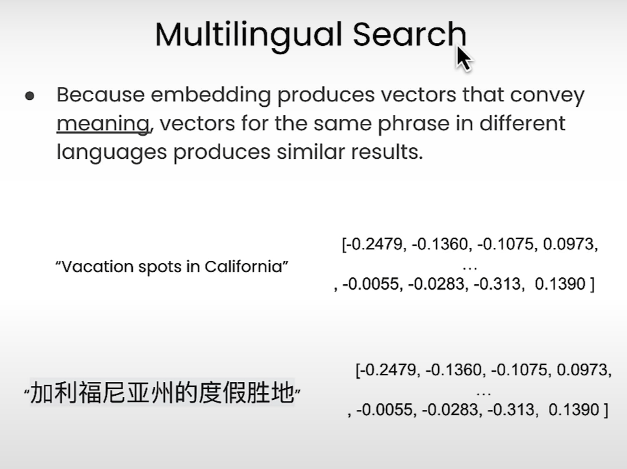

RAG简介


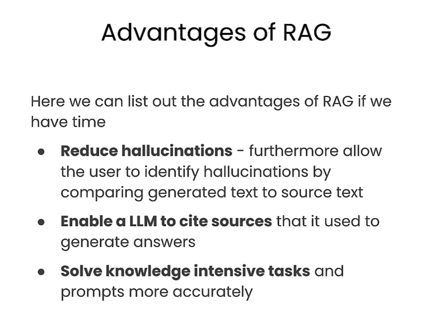


```py
def json_print(data):
    print(json.dumps(data, indent=2))
    
import weaviate, os, json
import openai
from dotenv import load_dotenv, find_dotenv
_ = load_dotenv(find_dotenv()) # read local .env file

auth_config = weaviate.auth.AuthApiKey(api_key=os.getenv("WEAVIATE_API_KEY"))

client = weaviate.Client(
    url=os.getenv("WEAVIATE_API_URL"),
    auth_client_secret=auth_config,
    additional_headers={
        "X-Cohere-Api-Key": os.getenv("COHERE_API_KEY"),
        "X-Cohere-BaseURL": os.getenv("CO_API_URL")
    }
)

client.is_ready() #check if True
```


### 2. How many vectors are stored in this database

```py
print(json.dumps(client.query.aggregate("Wikipedia").with_meta_count().do(), indent=2))
```

Output

```json
{
  "data": {
    "Aggregate": {
      "Wikipedia": [
        {
          "meta": {
            "count": 4306800
          }
        }
      ]
    }
  }
}
```


### 3. Perform search over them to find concepts you are interested in!


```py
response = (client.query
            .get("Wikipedia",['text','title','url','views','lang'])
            .with_near_text({"concepts": "Vacation spots in california"})
            .with_limit(5)
            .do()
           )

json_print(response)
```

Output

```json
{
  "data": {
    "Get": {
      "Wikipedia": [
        {
          "lang": "en",
          "text": "Many locals and tourists frequent the Southern California coast for its beaches. Some of southern California's most popular beaches are Malibu, Laguna Beach, La Jolla, Manhattan Beach, and Hermosa Beach. Southern California is also known for its mountain resort communities, such as Big Bear Lake, Lake Arrowhead, and Wrightwood, and their ski resorts, like Bear Mountain, Snow Summit, Snow Valley Mountain Resort, and Mountain High. The inland desert city of Palm Springs is also popular.",
          "title": "Southern California",
          "url": "https://en.wikipedia.org/wiki?curid=62520",
          "views": 2000
        },
        {
          "lang": "en",
          "text": "Carbon Beach, Surfrider Beach, Westward Beach, Escondido Beach, Paradise Cove, Point Dume, Pirates Cove, Zuma Beach, Trancas and Encinal Bluffs are places along the coast in Malibu. Point Dume forms the northern end of the Santa Monica Bay, and Point Dume Headlands Park affords a vista stretching to the Palos Verdes Peninsula and Santa Catalina Island. Directly below the park, on the western side of the point, is Pirates Cove. Because of its relative seclusion, Pirates Cove was previously used as a nude beach, but since nudity is now illegal on all beaches in Los Angeles County, nude sunbathers are subject to fines and/or arrest.",
          "title": "Malibu, California",
          "url": "https://en.wikipedia.org/wiki?curid=107655",
          "views": 2000
        },
        {
          "lang": "fr",
          "text": "Les plages et parcs c\u00f4tiers principaux sont \"Trinidad State Beach\", \"Torrey Pines State Reserve\", le \"Cabrillo National Monument\". Les touristes se dirigent aussi vers les missions espagnoles, le \"Donner Memorial State Park\", le \"Bodie Historic State Park\", le parc national de Sequoia et le parc d'\u00c9tat de Humboldt Redwoods.",
          "title": "Californie",
          "url": "https://fr.wikipedia.org/wiki?curid=623",
          "views": 2000
        },
        {
          "lang": "es",
          "text": "Oeste: Burlingame, Hillcrest, Linda Vista, Midtown, Midway, Mission Hills, Mission Valley West, Morena, North Park, Ocean Beach, Old Town, Pacific Beach, Point Loma (incluyendo a Roseville-Fleetridge, Shelter Island, Sunset Cliffs, La Playa y University Heights).",
          "title": "San Diego (California)",
          "url": "https://es.wikipedia.org/wiki?curid=117310",
          "views": 1000
        },
        {
          "lang": "es",
          "text": "Entre sus playas m\u00e1s importantes se encuentran Surfrider Beach, Zuma Beach, Malibu State Beach y Topanga State Beach; entre sus parques m\u00e1s cercanos est\u00e1n el Parque estatal del arroyo Malib\u00fa (\"Malibu Creek State Park\"), \u00c1rea recreativa nacional de las monta\u00f1as de Santa M\u00f3nica (\"Santa Monica Mountains National Recreation Area\") y Cueva Paradise (\"Paradise Cove\"), donde se han rodado muchas pel\u00edculas.",
          "title": "Malib\u00fa (California)",
          "url": "https://es.wikipedia.org/wiki?curid=656653",
          "views": 900
        }
      ]
    }
  }
}
```


```py
response = (client.query
            .get("Wikipedia",['text','title','url','views','lang'])
            .with_near_text({"concepts": "Vacation spots in california"})
            .with_where({
                "path" : ['lang'],
                "operator" : "Equal",
                "valueString":'en'
            })
            .with_limit(3)
            .do()
           )

json_print(response)
```

Output

```json
{
  "data": {
    "Get": {
      "Wikipedia": [
        {
          "lang": "en",
          "text": "Many locals and tourists frequent the Southern California coast for its beaches. Some of southern California's most popular beaches are Malibu, Laguna Beach, La Jolla, Manhattan Beach, and Hermosa Beach. Southern California is also known for its mountain resort communities, such as Big Bear Lake, Lake Arrowhead, and Wrightwood, and their ski resorts, like Bear Mountain, Snow Summit, Snow Valley Mountain Resort, and Mountain High. The inland desert city of Palm Springs is also popular.",
          "title": "Southern California",
          "url": "https://en.wikipedia.org/wiki?curid=62520",
          "views": 2000
        },
        {
          "lang": "en",
          "text": "Carbon Beach, Surfrider Beach, Westward Beach, Escondido Beach, Paradise Cove, Point Dume, Pirates Cove, Zuma Beach, Trancas and Encinal Bluffs are places along the coast in Malibu. Point Dume forms the northern end of the Santa Monica Bay, and Point Dume Headlands Park affords a vista stretching to the Palos Verdes Peninsula and Santa Catalina Island. Directly below the park, on the western side of the point, is Pirates Cove. Because of its relative seclusion, Pirates Cove was previously used as a nude beach, but since nudity is now illegal on all beaches in Los Angeles County, nude sunbathers are subject to fines and/or arrest.",
          "title": "Malibu, California",
          "url": "https://en.wikipedia.org/wiki?curid=107655",
          "views": 2000
        },
        {
          "lang": "en",
          "text": "The coastlines of Mexico harbor many stretches of beaches that are frequented by sunbathers and other visitors. According to national law, the entirety of the coastlines are under federal ownership, that is, all beaches in the country are public. On the Yucat\u00e1n peninsula, one of the most popular beach destinations is the resort town of Canc\u00fan, especially among university students during spring break. Just offshore is the beach island of Isla Mujeres, and to the east is the Isla Holbox. To the south of Cancun is the coastal strip called Riviera Maya which includes the beach town of Playa del Carmen and the ecological parks of Xcaret and Xel-H\u00e1. A day trip to the south of Canc\u00fan is the historic port of Tulum. In addition to its beaches, the town of Tulum is notable for its cliff-side Mayan ruins. On the Pacific coast is the notable tourist destination of Acapulco. Once the destination for the rich and famous, the beaches have become crowded and the shores are now home to many multi-story hotels and vendors. Acapulco is home to renowned cliff divers: trained divers who leap from the side of a vertical cliff into the surf below. At the southern tip of the Baja California peninsula is the resort town of Cabo San Lucas, a town noted for its beaches and marlin fishing. Further north along the Sea of Cort\u00e9s is the Bah\u00eda de La Concepci\u00f3n, another beach town known for its sports fishing. Closer to the United States border is the weekend draw of San Felipe, Baja California.",
          "title": "Mexico",
          "url": "https://en.wikipedia.org/wiki?curid=3966054",
          "views": 3000
        }
      ]
    }
  }
}
```


```py
response = (client.query
            .get("Wikipedia",['text','title','url','views','lang'])
            .with_near_text({"concepts": "Miejsca na wakacje w Kalifornii"})
            .with_where({
                "path" : ['lang'],
                "operator" : "Equal",
                "valueString":'en'
            })
            .with_limit(3)
            .do()
           )

json_print(response)
```

Output

```json
{
  "data": {
    "Get": {
      "Wikipedia": [
        {
          "lang": "en",
          "text": "Many locals and tourists frequent the Southern California coast for its beaches. Some of southern California's most popular beaches are Malibu, Laguna Beach, La Jolla, Manhattan Beach, and Hermosa Beach. Southern California is also known for its mountain resort communities, such as Big Bear Lake, Lake Arrowhead, and Wrightwood, and their ski resorts, like Bear Mountain, Snow Summit, Snow Valley Mountain Resort, and Mountain High. The inland desert city of Palm Springs is also popular.",
          "title": "Southern California",
          "url": "https://en.wikipedia.org/wiki?curid=62520",
          "views": 2000
        },
        {
          "lang": "en",
          "text": "Malibu has been used as a location or setting for many films, television programs, fashion shoots and music videos.",
          "title": "Malibu, California",
          "url": "https://en.wikipedia.org/wiki?curid=107655",
          "views": 2000
        },
        {
          "lang": "en",
          "text": "The coastlines of Mexico harbor many stretches of beaches that are frequented by sunbathers and other visitors. According to national law, the entirety of the coastlines are under federal ownership, that is, all beaches in the country are public. On the Yucat\u00e1n peninsula, one of the most popular beach destinations is the resort town of Canc\u00fan, especially among university students during spring break. Just offshore is the beach island of Isla Mujeres, and to the east is the Isla Holbox. To the south of Cancun is the coastal strip called Riviera Maya which includes the beach town of Playa del Carmen and the ecological parks of Xcaret and Xel-H\u00e1. A day trip to the south of Canc\u00fan is the historic port of Tulum. In addition to its beaches, the town of Tulum is notable for its cliff-side Mayan ruins. On the Pacific coast is the notable tourist destination of Acapulco. Once the destination for the rich and famous, the beaches have become crowded and the shores are now home to many multi-story hotels and vendors. Acapulco is home to renowned cliff divers: trained divers who leap from the side of a vertical cliff into the surf below. At the southern tip of the Baja California peninsula is the resort town of Cabo San Lucas, a town noted for its beaches and marlin fishing. Further north along the Sea of Cort\u00e9s is the Bah\u00eda de La Concepci\u00f3n, another beach town known for its sports fishing. Closer to the United States border is the weekend draw of San Felipe, Baja California.",
          "title": "Mexico",
          "url": "https://en.wikipedia.org/wiki?curid=3966054",
          "views": 3000
        }
      ]
    }
  }
}
```


```py
response = (client.query
            .get("Wikipedia",['text','title','url','views','lang'])
            .with_near_text({"concepts": "أماكن العطلات في كاليفورنيا"})
            .with_where({
                "path" : ['lang'],
                "operator" : "Equal",
                "valueString":'en'
            })
            .with_limit(3)
            .do()
           )

json_print(response)
```

Output

```json
{
  "data": {
    "Get": {
      "Wikipedia": [
        {
          "lang": "en",
          "text": "Many locals and tourists frequent the Southern California coast for its beaches. Some of southern California's most popular beaches are Malibu, Laguna Beach, La Jolla, Manhattan Beach, and Hermosa Beach. Southern California is also known for its mountain resort communities, such as Big Bear Lake, Lake Arrowhead, and Wrightwood, and their ski resorts, like Bear Mountain, Snow Summit, Snow Valley Mountain Resort, and Mountain High. The inland desert city of Palm Springs is also popular.",
          "title": "Southern California",
          "url": "https://en.wikipedia.org/wiki?curid=62520",
          "views": 2000
        },
        {
          "lang": "en",
          "text": "The park is located east of Webb Way, and between Civic Center Way on the north and PCH to the south. It was the site of the annual Labor Day Weekend Kiwanis Club Chili Cook-Off from 1982 to 2009 (in 2010, the Chili Cook-Off and Carnival went on as usual, but moved to still-open land across Civic Center Way, on the Ioki property, at the corner of Civic Center Way and Stuart Ranch Road). Further back, it was agricultural land, planted in geraniums, other flowers and vegetables by the Takahashi family since 1924.",
          "title": "Malibu, California",
          "url": "https://en.wikipedia.org/wiki?curid=107655",
          "views": 2000
        },
        {
          "lang": "en",
          "text": "Often chosen as a winter training location for professional cycling teams and snowbirds, Santa Barbara has cycling routes and several climbs, including Gibraltar Road and Old San Marcos/Painted Cave. A bike path and route connects the University of California, Santa Barbara to the downtown area, passing through Goleta and Hope Ranch. Bike rentals are a way for tourists to view Santa Barbara and the surrounding area. In 2009, the Santa Barbara-Santa Maria-Goleta metropolitan statistical area (MSA) ranked as the sixth highest in the United States for percentage of commuters who biked to work (4 percent).",
          "title": "Santa Barbara, California",
          "url": "https://en.wikipedia.org/wiki?curid=108139",
          "views": 2000
        }
      ]
    }
  }
}
```

## Retrieval Augmented Generation


### Single Prompt


```py
prompt = "Write me a facebook ad about {title} using information inside {text}"
result = (
  client.query
  .get("Wikipedia", ["title","text"])
  .with_generate(single_prompt=prompt)
  .with_near_text({
    "concepts": ["Vacation spots in california"]
  })
  .with_limit(3)
).do()

json_print(result)
```


Output

```json
{
  "data": {
    "Get": {
      "Wikipedia": [
        {
          "_additional": {
            "generate": {
              "error": null,
              "singleResult": "Experience the Best of Southern California! \n\nSoCal is known for its incredible beaches and year-round perfect climate. From surfing in Malibu to exploring the desert city of Palm Springs, there's something for everyone! \n\nEnjoy the sun and sand at one of many beaches: Laguna Beach, La Jolla, Manhattan Beach, and Hermosa Beach are just a few of the popular spots to catch some rays. Or, if you're feeling adventurous, head to the mountains! \n\nSouthern California is home to incredible mountain resort communities like Big Bear Lake and Lake Arrowhead, and you can hit the slopes at Bear Mountain or Mountain High. There are plenty of resorts to choose from! \n\nWhen you're all set for some relaxation, head to Palm Springs for a unique desert experience. \n\nSouthern California has so much to offer - don't miss out! #SoCal #Travel #Beaches #Mountains #PalmSprings #Adventures"
            }
          },
          "text": "Many locals and tourists frequent the Southern California coast for its beaches. Some of southern California's most popular beaches are Malibu, Laguna Beach, La Jolla, Manhattan Beach, and Hermosa Beach. Southern California is also known for its mountain resort communities, such as Big Bear Lake, Lake Arrowhead, and Wrightwood, and their ski resorts, like Bear Mountain, Snow Summit, Snow Valley Mountain Resort, and Mountain High. The inland desert city of Palm Springs is also popular.",
          "title": "Southern California"
        },
        {
          "_additional": {
            "generate": {
              "error": null,
              "singleResult": "Looking for a beach getaway with beautiful views and plenty of sun? Look no further than Malibu, California! With incredible beaches like Carbon Beach, Surfrider Beach, Westward Beach, Escondido Beach, and Paradise Cove, you'll have your pick of amazing coastal spots. \n\nIf an adventure calls your name, head to Point Dume, the northern end of the Santa Monica Bay. A vista in Point Dume Headlands Park offers breathtaking views of the Palos Verdes Peninsula and Santa Catalina Island. And if you're feeling daring, head to Pirates Cove, previously a nude beach hotspot. \n\nWith beaches as stunning as these, you won't want to miss a thing.  Come and experience the beauty and adventure of Malibu today! \n\n#Malibu #California #Beaches #Travel #Adventure #NaturesBeauty #PointDume #PiratesCove #SantaMonicaBay #Unmissable"
            }
          },
          "text": "Carbon Beach, Surfrider Beach, Westward Beach, Escondido Beach, Paradise Cove, Point Dume, Pirates Cove, Zuma Beach, Trancas and Encinal Bluffs are places along the coast in Malibu. Point Dume forms the northern end of the Santa Monica Bay, and Point Dume Headlands Park affords a vista stretching to the Palos Verdes Peninsula and Santa Catalina Island. Directly below the park, on the western side of the point, is Pirates Cove. Because of its relative seclusion, Pirates Cove was previously used as a nude beach, but since nudity is now illegal on all beaches in Los Angeles County, nude sunbathers are subject to fines and/or arrest.",
          "title": "Malibu, California"
        },
        {
          "_additional": {
            "generate": {
              "error": null,
              "singleResult": "D\u00e9couvrez la beaut\u00e9 de la Californie! De ses plages \u00e9poustouflantes \u00e0 ses parcs nationaux \u00e9poustouflants, la Californie offre quelque chose pour tout le monde. D\u00e9couvrez les plages et les parcs c\u00f4tiers de Trinidad State Beach, Torrey Pines State Reserve et Cabrillo National Monument. Si vous aimez l'histoire, explorez les missions espagnoles. Vous pouvez \u00e9galement visiter le parc national de Donner Memorial et le parc historique de Bodie, ou admirer les s\u00e9quoias du parc national de Sequoia et du parc d'\u00c9tat de Humboldt Redwoods. Avec tant d'options, la Californie est une destination id\u00e9ale pour les voyageurs et les amateurs de plein air. #California #Travel #Nature #Adventure #TravelCalifornia #SequoiaNationalPark #HumboldtRedwoodsStatePark #SpanishMissions #Beach #Parks #History #Outdoors #Exploring #TravelTips #WestCoast #CaliforniaDreaming #Traveler #TravelBlogger #TravelersInsurance #TravelTips #TravelTribe #TravelersInsurance #TravelersInsurance #TravelersInsurance #TravelersInsurance #TravelersInsurance #TravelersInsurance #TravelersInsurance #TravelersInsurance #TravelersInsurance #TravelersInsurance #TravelersInsurance #TravelersInsurance #TravelersInsurance #TravelersInsurance #TravelersInsurance #TravelersInsurance #TravelersInsurance #TravelersInsurance #TravelersInsurance #TravelersInsurance #TravelersInsurance #TravelersInsurance #TravelersInsurance #TravelersInsurance #TravelersInsurance #TravelersInsurance #TravelersInsurance #TravelersInsurance #TravelersInsurance #TravelersInsurance #TravelersInsurance #TravelersInsurance #TravelersInsurance #TravelersInsurance #TravelersInsurance #TravelersInsurance #TravelersInsurance #TravelersInsurance #TravelersInsurance #TravelersInsurance #TravelersInsurance #TravelersInsurance #TravelersInsurance #TravelersInsurance #TravelersInsurance #TravelersInsurance #TravelersInsurance #TravelersInsurance #TravelersInsurance #TravelersInsurance #TravelersInsurance #TravelersInsurance #TravelersInsurance #TravelersInsurance #TravelersInsurance #TravelersInsurance #TravelersInsurance #TravelersInsurance #TravelersInsurance #TravelersInsurance #TravelersInsurance #TravelersInsurance #TravelersInsurance #TravelersInsurance #TravelersInsurance #TravelersInsurance #TravelersInsurance #TravelersInsurance #TravelersInsurance #TravelersInsurance #TravelersInsurance #TravelersInsurance #TravelersInsurance #TravelersInsurance #TravelersInsurance #TravelersInsurance #TravelersInsurance #TravelersInsurance #TravelersInsurance #TravelersInsurance #TravelersInsurance #TravelersInsurance #TravelersInsurance #TravelersInsurance #TravelersInsurance #TravelersInsurance #TravelersInsurance #TravelersInsurance #TravelersInsurance #TravelersInsurance #TravelersInsurance #TravelersInsurance #TravelersInsurance #TravelersInsurance #TravelersInsurance #TravelersInsurance #TravelersInsurance #TravelersInsurance #TravelersInsurance #TravelersInsurance #TravelersInsurance #TravelersInsurance #TravelersInsurance #TravelersInsurance #TravelersInsurance #TravelersInsurance #TravelersInsurance #TravelersInsurance #TravelersInsurance #TravelersInsurance #TravelersInsurance #TravelersInsurance #TravelersInsurance #TravelersInsurance #TravelersInsurance #TravelersInsurance #TravelersInsurance #TravelersInsurance #TravelersInsurance #TravelersInsurance #TravelersInsurance #TravelersInsurance #TravelersInsurance #TravelersInsurance #TravelersInsurance #TravelersInsurance #TravelersInsurance #TravelersInsurance #TravelersInsurance #TravelersInsurance #TravelersInsurance #TravelersInsurance #TravelersInsurance #TravelersInsurance #TravelersInsurance #TravelersInsurance #TravelersInsurance #TravelersInsurance #TravelersInsurance #TravelersInsurance #TravelersInsurance #TravelersInsurance #TravelersInsurance #TravelersInsurance #TravelersInsurance #TravelersInsurance #TravelersInsurance #TravelersInsurance #TravelersInsurance #TravelersInsurance #TravelersInsurance #TravelersInsurance #TravelersInsurance #TravelersInsurance #TravelersInsurance #TravelersInsurance #TravelersInsurance #TravelersInsurance #TravelersInsurance #TravelersInsurance #TravelersInsurance #TravelersInsurance #TravelersInsurance #TravelersInsurance #TravelersInsurance #TravelersInsurance #TravelersInsurance #TravelersInsurance #TravelersInsurance #TravelersInsurance #TravelersInsurance #TravelersInsurance #TravelersInsurance #TravelersInsurance #TravelersInsurance #TravelersInsurance #TravelersInsurance #TravelersInsurance #TravelersInsurance #TravelersInsurance #TravelersInsurance #TravelersInsurance #TravelersInsurance #TravelersInsurance #TravelersInsurance #TravelersInsurance #TravelersInsurance #TravelersInsurance #TravelersInsurance #TravelersInsurance #TravelersInsurance #TravelersInsurance #TravelersInsurance #TravelersInsurance #TravelersInsurance #TravelersInsurance #TravelersInsurance #TravelersInsurance #TravelersInsurance #TravelersInsurance #TravelersInsurance #TravelersInsurance #TravelersInsurance #TravelersInsurance #TravelersInsurance #TravelersInsurance #TravelersInsurance #TravelersInsurance #TravelersInsurance #TravelersInsurance #TravelersInsurance #TravelersInsurance #TravelersInsurance #TravelersInsurance #TravelersInsurance #TravelersInsurance #TravelersInsurance #TravelersInsurance #TravelersInsurance #TravelersInsurance #TravelersInsurance #TravelersInsurance #TravelersInsurance #TravelersInsurance #TravelersInsurance #TravelersInsurance #TravelersInsurance #TravelersInsurance #TravelersInsurance #TravelersInsurance #TravelersInsurance #TravelersInsurance #TravelersInsurance #TravelersInsurance #TravelersInsurance #TravelersInsurance #TravelersInsurance #TravelersInsurance #TravelersInsurance #TravelersInsurance #TravelersInsurance #TravelersInsurance #TravelersInsurance #TravelersInsurance #TravelersInsurance #TravelersInsurance #TravelersInsurance #TravelersInsurance #TravelersInsurance #TravelersInsurance #TravelersInsurance #TravelersInsurance #TravelersInsurance #TravelersInsurance #TravelersInsurance #TravelersInsurance #TravelersInsurance #TravelersInsurance #TravelersInsurance #TravelersInsurance #TravelersInsurance #TravelersInsurance #TravelersInsurance #TravelersInsurance #TravelersInsurance #TravelersInsurance #TravelersInsurance #TravelersInsurance #TravelersInsurance #TravelersInsurance #TravelersInsurance #TravelersInsurance #TravelersInsurance #TravelersInsurance #TravelersInsurance #TravelersInsurance #TravelersInsurance #TravelersInsurance #TravelersInsurance #TravelersInsurance #TravelersInsurance #TravelersInsurance #TravelersInsurance #TravelersInsurance #TravelersInsurance #TravelersInsurance #TravelersInsurance #TravelersInsurance #TravelersInsurance #TravelersInsurance #TravelersInsurance #TravelersInsurance #TravelersInsurance #TravelersInsurance #TravelersInsurance #TravelersInsurance #TravelersInsurance #TravelersInsurance #TravelersInsurance #TravelersInsurance #TravelersInsurance #TravelersInsurance #TravelersInsurance #TravelersInsurance #TravelersInsurance #TravelersInsurance #TravelersInsurance #TravelersInsurance #TravelersInsurance #TravelersInsurance #TravelersInsurance #TravelersInsurance #TravelersInsurance #TravelersInsurance #TravelersInsurance #TravelersInsurance #TravelersInsurance #TravelersInsurance #TravelersInsurance #TravelersInsurance #TravelersInsurance #TravelersInsurance #TravelersInsurance #TravelersInsurance #TravelersInsurance #TravelersInsurance #TravelersInsurance #TravelersInsurance #TravelersInsurance #TravelersInsurance #TravelersInsurance #TravelersInsurance #TravelersInsurance #TravelersInsurance #TravelersInsurance #TravelersInsurance #TravelersInsurance #TravelersInsurance #TravelersInsurance #TravelersInsurance #TravelersInsurance #TravelersInsurance #TravelersInsurance #TravelersInsurance #TravelersInsurance #TravelersInsurance #TravelersInsurance #TravelersInsurance #TravelersInsurance #TravelersInsurance #TravelersInsurance #TravelersInsurance #TravelersInsurance #TravelersInsurance #TravelersInsurance #TravelersInsurance #TravelersInsurance #TravelersInsurance #TravelersInsurance #TravelersInsurance #TravelersInsurance #TravelersInsurance #TravelersInsurance #TravelersInsurance #TravelersInsurance #TravelersInsurance #TravelersInsurance #TravelersInsurance #TravelersInsurance #TravelersInsurance #TravelersInsurance #TravelersInsurance #TravelersInsurance #TravelersInsurance #TravelersInsurance #TravelersInsurance #TravelersInsurance #TravelersInsurance #TravelersInsurance #TravelersInsurance #TravelersInsurance #TravelersInsurance #TravelersInsurance #TravelersInsurance #TravelersInsurance #TravelersInsurance #TravelersInsurance #TravelersInsurance #TravelersInsurance #TravelersInsurance #TravelersInsurance #TravelersInsurance #TravelersInsurance #TravelersInsurance #TravelersInsurance #TravelersInsurance #TravelersInsurance #TravelersInsurance #TravelersInsurance #TravelersInsurance #TravelersInsurance #TravelersInsurance #TravelersInsurance #TravelersInsurance #TravelersInsurance #TravelersInsurance #TravelersInsurance #TravelersInsurance #TravelersInsurance #TravelersInsurance #TravelersInsurance #TravelersInsurance #TravelersInsurance #TravelersInsurance #TravelersInsurance #TravelersInsurance #TravelersInsurance #TravelersInsurance #TravelersInsurance #TravelersInsurance #TravelersInsurance #TravelersInsurance #TravelersInsurance #TravelersInsurance #TravelersInsurance #TravelersInsurance #TravelersInsurance #TravelersInsurance #TravelersInsurance #TravelersInsurance #TravelersInsurance #TravelersInsurance #TravelersInsurance #TravelersInsurance #TravelersInsurance #TravelersInsurance #TravelersInsurance #TravelersInsurance #TravelersInsurance #TravelersInsurance #TravelersInsurance #TravelersInsurance #TravelersInsurance #TravelersInsurance #TravelersInsurance #TravelersInsurance #TravelersInsurance #TravelersInsurance #TravelersInsurance #TravelersInsurance #TravelersInsurance #TravelersInsurance #TravelersInsurance #TravelersInsurance #TravelersInsurance #TravelersInsurance #TravelersInsurance #TravelersInsurance #TravelersInsurance #Travelers"
            }
          },
          "text": "Les plages et parcs c\u00f4tiers principaux sont \"Trinidad State Beach\", \"Torrey Pines State Reserve\", le \"Cabrillo National Monument\". Les touristes se dirigent aussi vers les missions espagnoles, le \"Donner Memorial State Park\", le \"Bodie Historic State Park\", le parc national de Sequoia et le parc d'\u00c9tat de Humboldt Redwoods.",
          "title": "Californie"
        }
      ]
    }
  }
}
```


### Group Task


```py
generate_prompt = "Summarize what these posts are about in two paragraphs."

result = (
  client.query
  .get("Wikipedia", ["title","text"])
  .with_generate(grouped_task=generate_prompt) # Pass in all objects at once
  .with_near_text({
    "concepts": ["Vacation spots in california"]
  })
  .with_limit(3)
).do()

json_print(result)

```

Output


```json
{
  "data": {
    "Get": {
      "Wikipedia": [
        {
          "_additional": {
            "generate": {
              "error": null,
              "groupedResult": "The first post is about Southern California and its attractions. The region is known for its popular beaches like Malibu, Laguna Beach, and Manhattan Beach. But Southern California also has ski resorts and mountain communities like Big Bear Lake and Lake Arrowhead. The inland desert region features the city of Palm Springs which is also quite popular. \n\nThe second post is about Malibu, California and its beaches. There are numerous beaches along the coast like Carbon Beach, Surfrider Beach, and Pirates Cove. These beaches offer beautiful views of the Santa Monica Bay and the Palos Verdes Peninsula. There used to be a time when Pirates Cove was known for being a nude beach, but since nudity is illegal on all beaches in Los Angeles County, one can face fines for non-compliance."
            }
          },
          "text": "Many locals and tourists frequent the Southern California coast for its beaches. Some of southern California's most popular beaches are Malibu, Laguna Beach, La Jolla, Manhattan Beach, and Hermosa Beach. Southern California is also known for its mountain resort communities, such as Big Bear Lake, Lake Arrowhead, and Wrightwood, and their ski resorts, like Bear Mountain, Snow Summit, Snow Valley Mountain Resort, and Mountain High. The inland desert city of Palm Springs is also popular.",
          "title": "Southern California"
        },
        {
          "_additional": {
            "generate": null
          },
          "text": "Carbon Beach, Surfrider Beach, Westward Beach, Escondido Beach, Paradise Cove, Point Dume, Pirates Cove, Zuma Beach, Trancas and Encinal Bluffs are places along the coast in Malibu. Point Dume forms the northern end of the Santa Monica Bay, and Point Dume Headlands Park affords a vista stretching to the Palos Verdes Peninsula and Santa Catalina Island. Directly below the park, on the western side of the point, is Pirates Cove. Because of its relative seclusion, Pirates Cove was previously used as a nude beach, but since nudity is now illegal on all beaches in Los Angeles County, nude sunbathers are subject to fines and/or arrest.",
          "title": "Malibu, California"
        },
        {
          "_additional": {
            "generate": null
          },
          "text": "Les plages et parcs c\u00f4tiers principaux sont \"Trinidad State Beach\", \"Torrey Pines State Reserve\", le \"Cabrillo National Monument\". Les touristes se dirigent aussi vers les missions espagnoles, le \"Donner Memorial State Park\", le \"Bodie Historic State Park\", le parc national de Sequoia et le parc d'\u00c9tat de Humboldt Redwoods.",
          "title": "Californie"
        }
      ]
    }
  }
}
```


# 后记

2024年3月4日完成这门课的学习。由于之前有了pinecone向量数据库的基础，学习weaviate向量数据库没有障碍，只是API的不同。

